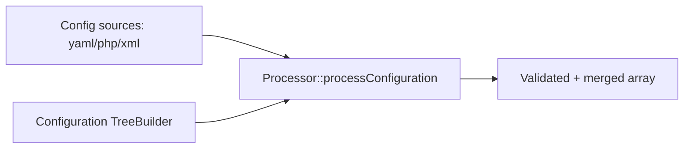

# Configuration (Config, DotEnv, ExpressionLanguage)

!!! tip "In a nutshell"
    Three components hide here: Config validates structured options against a
    `TreeBuilder` schema, DotEnv loads `.env*` files, ExpressionLanguage
    evaluates dynamic rules. Exam gold: `.env.local` is skipped in the `test`
    environment, and real OS environment variables always win.

!!! example "Real-world analogy"
    Think of setting up a new employee's workstation. A settings checklist (the Config
    schema) rejects impossible choices before they apply — you can't request a monitor
    size that doesn't exist. Default preferences come from a stack of policy documents
    (the `.env` files), but a direct instruction IT already pinned to the machine (a real
    OS environment variable) overrides anything a document says. And a short "if this,
    then that" rule sheet the manager consults on the spot is the ExpressionLanguage.

!!! abstract "Learning objectives"
    By the end of this chapter you can:

    - [ ] Build and validate a config tree with `TreeBuilder` and `Processor`.
    - [ ] Explain the `.env` cascade, `APP_ENV`, and the `.env.local.php` dump.
    - [ ] Evaluate and compile expressions with `ExpressionLanguage` and add providers.

    **Syllabus:** `Miscellaneous → Configuration` ·
    **Level:** Advanced → Expert ·
    **Est. time:** 40 min ·
    **Prerequisites:** [Dependency Injection](../dependency-injection/index.md)

---

## Theory

Three distinct components sit under "configuration":

- **Config** — defines a *schema* for structured configuration (bundle
  `Configuration` classes) and validates/merges raw arrays against it.
- **DotEnv** — loads `.env*` files into environment variables at bootstrap.
- **ExpressionLanguage** — a small, sandboxed expression engine used across
  Symfony (security, routing conditions, service definitions, validation).

## Deep Dive — how it works internally

!!! question "Predict first"
    `.env.local` sets `APP_ENV=dev`, but the OS already exports `APP_ENV=prod`.
    Which wins — and does `.env.local` even load under the `test` environment?

??? note "Reveal"
    The **real OS variable wins**: `.env*` never overrides an already-set env var.
    And `.env.local` is deliberately **skipped in `test`** so tests stay
    reproducible regardless of a developer's machine.

### Config: TreeBuilder + Processor

A bundle exposes a `ConfigurationInterface::getConfigTreeBuilder()` returning a
`Symfony\Component\Config\Definition\Builder\TreeBuilder`. The
`Symfony\Component\Config\Definition\Processor` merges every config source and
validates it against that tree, applying defaults, normalisation and
constraints. Node types: `arrayNode`, `scalarNode`, `booleanNode`,
`integerNode`, `enumNode`, with `->isRequired()`, `->defaultValue()`,
`->cannotBeEmpty()`, `->validate()->ifTrue()->thenInvalid()`.



The `Symfony\Component\Config\FileLocator` and loaders (`YamlFileLoader`,
`PhpFileLoader`) read files; `ConfigCache`/`ConfigCacheFactory` cache the result
and check freshness via `ResourceInterface` (e.g. `FileResource`) so debug mode
rebuilds when sources change.

!!! note "Source reference"
    `Symfony\Component\Config\Definition\Processor::processConfiguration()` —
    [symfony/symfony `8.0`](https://github.com/symfony/symfony/blob/8.0/src/Symfony/Component/Config/Definition/Processor.php).

### DotEnv: the cascade

`Symfony\Component\Dotenv\Dotenv` populates `$_ENV`/`$_SERVER`. Load order (later
does **not** override real environment variables, but does override earlier
files):

1. `.env` — committed defaults for all environments.
2. `.env.local` — machine-specific overrides (git-ignored; **ignored in `test`**).
3. `.env.<APP_ENV>` — e.g. `.env.prod` (committed).
4. `.env.<APP_ENV>.local` — env-specific machine overrides (git-ignored).

`APP_ENV` selects the environment; `APP_DEBUG` toggles debug. In production run
`composer dump-env prod`, which compiles all of the above into a single
**`.env.local.php`** (a plain PHP array). When present, Symfony loads *only* that
file and skips parsing `.env*`, saving I/O on every request.

### ExpressionLanguage

`Symfony\Component\ExpressionLanguage\ExpressionLanguage` parses an expression
into an AST, then either `evaluate($expr, $vars)` (interpret) or
`compile($expr, $names)` (emit PHP source). Results are cached via a PSR-6 pool.
Syntax supports operators, `?.`/`??`, function calls, and object access. Extend
it with **providers** implementing
`ExpressionFunctionProviderInterface::getFunctions()` returning
`ExpressionFunction` objects.

```php
<?php
declare(strict_types=1);

use Symfony\Component\ExpressionLanguage\ExpressionLanguage;

$el = new ExpressionLanguage();
$el->evaluate('user.isActive() and role in roles', [
    'user'  => $user,
    'role'  => 'ROLE_ADMIN',
    'roles' => ['ROLE_ADMIN'],
]); // bool

// Compile to reusable PHP source:
$php = $el->compile('1 + a', ['a']); // "(1 + $a)"
```

## Configuration & code

=== "PHP Attributes"

    ```php
    <?php
    declare(strict_types=1);

    namespace App\DependencyInjection;

    use Symfony\Component\Config\Definition\Builder\TreeBuilder;
    use Symfony\Component\Config\Definition\ConfigurationInterface;

    final class Configuration implements ConfigurationInterface
    {
        public function getConfigTreeBuilder(): TreeBuilder
        {
            $tb = new TreeBuilder('acme');
            $tb->getRootNode()
                ->children()
                    ->integerNode('timeout')->defaultValue(30)->min(1)->end()
                    ->scalarNode('endpoint')->isRequired()->cannotBeEmpty()->end()
                ->end();

            return $tb;
        }
    }
    ```

=== "YAML"

    ```yaml
    # .env  (committed defaults)
    APP_ENV=dev
    APP_SECRET=change_me
    ```

=== "Console"

    ```console
    $ php bin/console debug:dotenv
    $ php bin/console debug:config framework
    $ composer dump-env prod   # writes .env.local.php
    ```

## Best practices & anti-patterns

| ✅ Do | ❌ Avoid |
|---|---|
| Commit `.env`, git-ignore `.env.local` | Committing secrets in `.env` |
| `dump-env prod` on deploy | Parsing `.env` on every prod request |
| Validate config with `TreeBuilder` constraints | Reading raw arrays without a schema |
| Add ExpressionLanguage functions via a provider | Interpolating user input into `evaluate()` |

## When (not) to use it / alternatives

Use the Config component when writing a reusable **bundle** with structured
options. For app-level settings prefer bound parameters/env vars. Use
ExpressionLanguage for dynamic rules (security expressions, route conditions),
not for heavy computation — it is interpreted.

!!! danger "Certification traps"
    - `.env.local` is **ignored in the `test` environment** (tests must be reproducible).
    - When `.env.local.php` exists, `.env*` files are **not** parsed.
    - Real OS environment variables always win over `.env*` values.
    - `Processor::processConfiguration(Configuration, arrays)` merges *and* validates.
    - `compile()` returns PHP **source**, `evaluate()` returns the value.

!!! warning "Common mistakes"
    - Passing user input straight into `ExpressionLanguage::evaluate()` (injection risk).
    - Forgetting `->end()` calls when building nested nodes.

## Exercises

1. **(Advanced)** Add a required, non-empty `endpoint` scalar and an integer
   `timeout` (default 30, min 1) to a bundle configuration tree.
2. **(Advanced)** Explain what `composer dump-env prod` produces and why it speeds
   up production.

??? success "Solutions"

    **1.** See the `Configuration` class above — `integerNode('timeout')->min(1)->defaultValue(30)`
    and `scalarNode('endpoint')->isRequired()->cannotBeEmpty()`.

    **2.** It compiles the whole `.env*` cascade for `APP_ENV=prod` into a single
    `.env.local.php` returning an array. Symfony loads that array directly and
    skips DotEnv parsing on every request.

## Certification questions

??? question "Q1. In which environment is `.env.local` NOT loaded?"
    - [ ] A. dev
    - [ ] B. prod
    - [x] C. test ✅

    **Why:** Tests must be deterministic, so `.env.local` is skipped in `test`.
    **Ref:** [Configuring environments](https://symfony.com/doc/current/configuration.html#selecting-the-active-environment).

??? question "Q2. `ExpressionLanguage::compile()` returns…"
    - [ ] A. the evaluated value
    - [x] B. a string of PHP source code ✅
    - [ ] C. an AST node

    **Why:** `compile()` transpiles the expression to PHP; `evaluate()` interprets it.
    **Ref:** [ExpressionLanguage](https://symfony.com/doc/current/components/expression_language.html).

??? question "Q3. Which class validates raw config against a tree?"
    - [x] A. `Processor` ✅
    - [ ] B. `TreeBuilder`
    - [ ] C. `FileLocator`

    **Why:** `Processor::processConfiguration()` merges and validates against the
    `Configuration` tree. **Ref:** [Config component](https://symfony.com/doc/current/components/config/definition.html).

## Key takeaways

- Config = schema (`TreeBuilder`) + validation/merge (`Processor`).
- DotEnv cascade: `.env` → `.env.local` → `.env.<env>` → `.env.<env>.local`; `test` skips `.env.local`.
- `dump-env prod` → `.env.local.php`, no runtime `.env` parsing.
- ExpressionLanguage: `evaluate()` interprets, `compile()` emits PHP; extend via providers.

## Last-minute revision

!!! tip "Cheat sheet"
    - Node types: `scalarNode`, `integerNode`, `booleanNode`, `enumNode`, `arrayNode`; `->isRequired()`, `->defaultValue()`.
    - Env precedence: real env > `.env.<env>.local` > `.env.<env>` > `.env.local` > `.env`.
    - `debug:dotenv`, `debug:config <bundle>`, `composer dump-env prod`.
    - Providers implement `ExpressionFunctionProviderInterface`.

## Connections

- **Depends on:** [DI: Parameters](../dependency-injection/parameters.md) — validated config becomes container parameters and service arguments.
- **Reused in:** [Deployment](deployment.md) — `dump-env prod` compiles the cascade; [Runtime](runtime.md) reads `APP_ENV`/`APP_DEBUG` from `$context`.
- **Confused with:** app-level env vars — the Config component defines **bundle** schemas, not per-app settings.

## Official References
- [Official docs — Configuration](https://symfony.com/doc/current/configuration.html)
- [Official docs — Config component](https://symfony.com/doc/current/components/config.html)
- [Official docs — ExpressionLanguage](https://symfony.com/doc/current/components/expression_language.html)
- [Symfony source — Dotenv](https://github.com/symfony/symfony/blob/8.0/src/Symfony/Component/Dotenv/Dotenv.php)

## Video references

!!! tip "Watch & learn"
    These are official, continuously-updated video channels — search them for
    "Symfony components" to reinforce this chapter. We link stable channels rather than
    individual videos so the references never rot.

    - [SymfonyCasts screencasts](https://symfonycasts.com/tracks/symfony) — scripted, code-along tutorials.
    - [Symfony official YouTube](https://www.youtube.com/@SymfonyOfficial) — SymfonyCon conference talks & keynotes.
    - [Official docs for this topic](https://symfony.com/doc/current/configuration.html#selecting-the-active-environment) — some Symfony doc pages embed a screencast.

## Confidence check

I'm ready when I can:

- [ ] explain **why** a `TreeBuilder` schema beats reading raw config arrays
- [ ] build/validate a config tree and evaluate an expression in Symfony 8
- [ ] debug env precedence (real env > `.env.<env>.local` > … > `.env`)
- [ ] spot the trick: `.env.local` is skipped in `test`; `.env.local.php` bypasses parsing
- [ ] describe how `Processor::processConfiguration()` merges and validates

---

<small>Related: [Deployment](deployment.md) · [Dependency Injection](../dependency-injection/index.md) · [Runtime](runtime.md)</small>
