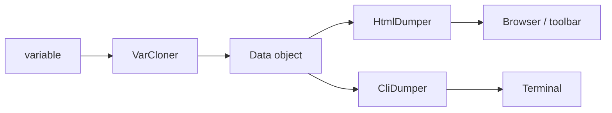

# Code Debugging (VarDumper, Debug, Stopwatch)

!!! tip "In a nutshell"
    VarDumper est un `var_dump` plus intelligent qui clone une valeur dans un
    snapshot immuable `Data`, puis le rend via un dumper CLI ou HTML. Stopwatch
    chronomètre des events nommés pour le profiler. À retenir pour l'examen :
    `dd()` dumpe puis quitte ; `dump()` continue l'exécution.

!!! example "Real-world analogy"
    VarDumper fonctionne comme un photographe de scène de crime. Le cloner prend une
    photographie immuable d'une valeur à un instant précis (le snapshot `Data`) afin que
    les enquêteurs puissent l'étudier plus tard sans perturber la scène en direct ; le
    dumper décide ensuite d'imprimer cette photo pour le mur (HtmlDumper dans le
    navigateur) ou de la décrire par radio (CliDumper dans le terminal). `dump()`
    photographie et continue de travailler sur la scène, tandis que `dd()` photographie
    et s'en va immédiatement. Stopwatch est le chronomètre à part qui mesure chaque
    étape étiquetée de l'enquête.

!!! abstract "Learning objectives"
    À la fin de ce chapitre, vous saurez :

    - [ ] Utiliser `dump()`/`dd()` et expliquer la pipeline cloner→dumper de VarDumper.
    - [ ] Décrire l'objet `Data` et comment les dumps arrivent dans la toolbar ou en CLI.
    - [ ] Mesurer du code avec le composant Stopwatch et lire ses periods.

    **Syllabus:** `Miscellaneous → Code Debugging` ·
    **Level:** Advanced ·
    **Est. time:** 30 min ·
    **Prerequisites:** [Architecture](../architecture/index.md)

---

## Theory

VarDumper est un `var_dump` plus intelligent : il produit une sortie structurée,
stylée et dépliable au clic, et s'intègre au profiler. `dump()` enregistre une
variable ; `dd()` (« dump and die ») dumpe puis appelle `exit`. Le composant
Stopwatch mesure le temps écoulé et la mémoire pour des **events** nommés, et
alimente la timeline du profiler.

```php
$user = $repository->find(42);

// var_dump() alternative: styled, structured, profiler-aware
dump($user);      // records the variable, execution continues
dump($user, $id); // several values at once

dd($user); // "dump and die": dumps, then exits
// this line is never reached
```

## Deep Dive — how it works internally

!!! question "Predict first"
    Vous appelez `dd($order)` dans un controller qui retourne du JSON. Que reçoit
    le client, et le reste de l'action s'exécute-t-il ?

??? note "Reveal"
    `dd()` dumpe puis appelle `exit` — l'action s'arrête, le JSON n'est donc jamais
    retourné et le client reçoit la sortie du dump (ce qui corrompt une vraie réponse
    d'API). Utilisez plutôt `dump()` (qui continue) et lisez le résultat dans le
    panneau Debug de la toolbar.

### The VarDumper pipeline: clone → dump

`dump()` appelle `Symfony\Component\VarDumper\VarDumper::dump()`, qui utilise un
**cloner** et un **dumper** :

1. Un **cloner** (`Symfony\Component\VarDumper\Cloner\VarCloner`) parcourt la
   variable et produit un objet
   `Symfony\Component\VarDumper\Cloner\Data` immuable et limité en profondeur —
   découplant ainsi la *capture* de la valeur de son *rendu*. Les casters
   (`Symfony\Component\VarDumper\Caster\*`) personnalisent la représentation de
   certains types (closures, PDO, proxies Doctrine).
2. Un **dumper** rend le `Data` :
   `CliDumper` (terminal ANSI) ou `HtmlDumper` (navigateur/toolbar). Le dumper
   choisi est déterminé par la SAPI / le contexte.

```php
use Symfony\Component\VarDumper\Cloner\VarCloner;
use Symfony\Component\VarDumper\Dumper\CliDumper;
use Symfony\Component\VarDumper\Dumper\HtmlDumper;

$cloner = new VarCloner();         // step 1: capture
$data = $cloner->cloneVar($order); // immutable, depth-limited Data snapshot

(new CliDumper())->dump($data);    // step 2: render for the terminal...
(new HtmlDumper())->dump($data);   // ...or for the browser/toolbar
```



Parce que `Data` est un snapshot sérialisable, les dumps peuvent être
**collectés** par le `DumpDataCollector` et affichés dans le panneau Debug du
profiler, même lorsque la sortie corromprait autrement une réponse JSON.

!!! note "Source reference"
    `Symfony\Component\VarDumper\Cloner\VarCloner` et `VarDumper` —
    [symfony/symfony `8.0`](https://github.com/symfony/symfony/blob/8.0/src/Symfony/Component/VarDumper/VarDumper.php).

### The Debug tooling

`Symfony\Component\ErrorHandler\Debug::enable()` (appelé par le Runtime en mode
debug) enregistre l'ErrorHandler et le DebugClassLoader (qui signale l'usage de
classes dépréciées ou avec une casse incorrecte). Voir
[Error Handling](error-handling.md).

```php
use Symfony\Component\ErrorHandler\Debug;

// Called for you by the Runtime when APP_DEBUG=1:
Debug::enable(); // registers ErrorHandler + DebugClassLoader (deprecations, case checks)
```

### Stopwatch

`Symfony\Component\Stopwatch\Stopwatch::start($name, $category)` retourne un
`StopwatchEvent` ; `stop($name)` clôt la dernière period. Un event contient une
ou plusieurs `StopwatchPeriod`s et expose `getDuration()` (ms) et `getMemory()`.
Les events sont regroupés en **sections** pour des mesures imbriquées (le
profiler utilise une section par request). Dans le framework, autowirez
`Symfony\Component\Stopwatch\Stopwatch` (le service `debug.stopwatch` ;
présent uniquement en debug).

```php
use Symfony\Component\Stopwatch\Stopwatch;

$stopwatch = new Stopwatch(); // framework: autowire Stopwatch (debug.stopwatch)

$event = $stopwatch->start('import', 'business'); // returns a StopwatchEvent
// ... code to measure ...
$stopwatch->stop('import'); // closes the last StopwatchPeriod

$event->getDuration(); // sum of all periods, in milliseconds
$event->getMemory();   // memory usage, in bytes
```

## Configuration & code

=== "PHP Attributes"

    ```php
    <?php
    declare(strict_types=1);

    namespace App\Service;

    use Symfony\Component\Stopwatch\Stopwatch;

    final class ReportBuilder
    {
        public function __construct(private readonly Stopwatch $stopwatch) {}

        public function build(): array
        {
            $this->stopwatch->start('report', 'business');
            $data = $this->crunch();
            $event = $this->stopwatch->stop('report');
            dump($event->getDuration()); // milliseconds

            return $data;
        }

        private function crunch(): array { return []; }
    }
    ```

=== "Console"

    ```console
    $ php bin/console server:dump   # collect dumps from a running app
    ```

=== "YAML"

    ```yaml
    # config/packages/debug.yaml (dev/test only)
    when@dev:
        debug:
            dump_destination: "tcp://%env(VAR_DUMPER_SERVER)%"
    ```

## Best practices & anti-patterns

| ✅ Do | ❌ Avoid |
|---|---|
| Utiliser `dump()` et le lire dans le panneau Debug de la toolbar | Laisser un `dd()` dans du code committé |
| Autowirer `Stopwatch` pour du profiling ponctuel | Bricoler des timers `microtime()` à la main |
| Utiliser `server:dump` pour garder les dumps hors de la response | `var_dump()` dans une réponse d'API JSON |

## When (not) to use it / alternatives

VarDumper est un outil de développement — il n'est disponible en prod que si vous
exigez `symfony/var-dumper` comme dépendance non-dev, ce que vous ne devriez
normalement pas faire. Le service framework de Stopwatch n'existe qu'en debug ;
pour des métriques de production, utilisez une vraie solution d'observabilité,
pas Stopwatch.

!!! danger "Certification traps"
    - Le cloner produit un objet `Data` ; le dumper le rend — la capture et le
      rendu sont des étapes **séparées**.
    - `dd()` dumpe **et quitte** ; `dump()` poursuit l'exécution.
    - `debug.stopwatch` n'existe que lorsque le profiler/debug est activé.
    - Les durées de Stopwatch sont en **millisecondes**.

!!! warning "Common mistakes"
    - Injecter `Stopwatch` en prod où le service est absent → erreur de câblage.
    - S'attendre à voir la sortie de `dump()` en ligne dans une réponse d'API
      (elle part vers le collector).

## Exercises

1. **(Advanced)** Chronométrez une méthode avec Stopwatch et dumpez la durée.
2. **(Advanced)** Expliquez pourquoi VarDumper sépare le clonage du dump.

??? success "Solutions"

    **1.** Voir `ReportBuilder` ci-dessus — `start('report')` … `stop('report')`
    puis `dump($event->getDuration())`.

    **2.** Cloner dans un snapshot `Data` immuable signifie que la valeur peut
    être rendue plus tard, par différents dumpers, et collectée en toute sécurité
    par le profiler sans relire un état vivant (potentiellement modifié).

## Certification questions

??? question "Q1. Which object does VarCloner produce?"
    - [x] A. `Data` ✅
    - [ ] B. `Response`
    - [ ] C. `FlattenException`

    **Why:** Le cloner construit un objet `Data` immuable que les dumpers rendent.
    **Ref:** [VarDumper](https://symfony.com/doc/8.0/components/var_dumper.html).

??? question "Q2. What does `dd()` do that `dump()` does not?"
    - [x] A. Stops execution (`exit`) after dumping ✅
    - [ ] B. Dumps to a file
    - [ ] C. Serializes to JSON

    **Why:** `dd()` = dump and die. **Ref:** [The dump() function](https://symfony.com/doc/8.0/components/var_dumper.html#the-dump-function).

??? question "Q3. Stopwatch `getDuration()` is expressed in…"
    - [x] A. milliseconds ✅
    - [ ] B. seconds
    - [ ] C. microseconds

    **Why:** Les durées sont en millisecondes. **Ref:** [Stopwatch](https://symfony.com/doc/8.0/components/stopwatch.html).

## Key takeaways

- VarDumper : `VarCloner` → `Data` → `CliDumper`/`HtmlDumper` ; les casters personnalisent les types.
- `dump()` continue ; `dd()` quitte. Les dumps sont collectés dans le profiler.
- Stopwatch mesure des events/periods nommés (ms + mémoire) ; `debug.stopwatch` en debug uniquement.

## Last-minute revision

!!! tip "Cheat sheet"
    - Clone (`VarCloner`) vs dump (`Cli`/`Html` `Dumper`) ; `Data` est le snapshot.
    - `dump()` / `dd()` ; `server:dump` vers un serveur TCP.
    - `Stopwatch::start()/stop()` → `StopwatchEvent::getDuration()` (ms).

## Connections

- **Depends on:** [Error Handling](error-handling.md) — `Debug::enable()` câble à la fois l'ErrorHandler et VarDumper en mode debug.
- **Reused in:** [Profiler](profiler.md) — les dumps sont collectés par le `DumpDataCollector` et le Stopwatch alimente la timeline.
- **Confused with:** [Clock](clock.md) — Stopwatch mesure le temps écoulé (wall time) ; utilisez `MonotonicClock` pour des durées robustes.

## Official References
- [Official docs — VarDumper](https://symfony.com/doc/8.0/components/var_dumper.html)
- [Official docs — Stopwatch](https://symfony.com/doc/8.0/components/stopwatch.html)
- [Symfony source — VarCloner](https://github.com/symfony/symfony/blob/8.0/src/Symfony/Component/VarDumper/Cloner/VarCloner.php)

## Video references

!!! tip "Watch & learn"
    Ce sont des chaînes vidéo officielles, mises à jour en continu — cherchez-y
    "Symfony components" pour consolider ce chapitre. Nous lions des chaînes stables
    plutôt que des vidéos individuelles afin que les références ne périment jamais.

    - [SymfonyCasts screencasts](https://symfonycasts.com/tracks/symfony) — tutoriels scénarisés à suivre en codant.
    - [Symfony official YouTube](https://www.youtube.com/@SymfonyOfficial) — conférences et keynotes SymfonyCon.
    - [Official docs for this topic](https://symfony.com/doc/8.0/components/var_dumper.html) — certaines pages de la doc Symfony intègrent un screencast.

## Confidence check

Je suis prêt quand je peux :

- [ ] expliquer **pourquoi** VarDumper sépare le clonage du rendu
- [ ] utiliser `dump()`/`dd()` et chronométrer du code avec `Stopwatch` dans Symfony 8
- [ ] déboguer une réponse d'API corrompue par un `dd()` oublié
- [ ] repérer le piège : `dd()` quitte, `dump()` continue ; les durées sont en ms
- [ ] décrire la pipeline `VarCloner` → `Data` → `Cli/Html Dumper`

---

<small>Related: [Profiler](profiler.md) · [Error Handling](error-handling.md) · [Clock](clock.md)</small>
