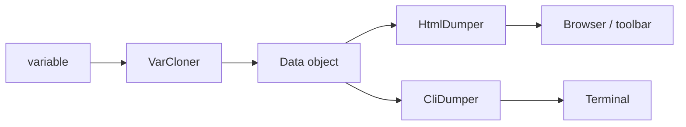

# Code Debugging (VarDumper, Debug, Stopwatch)

!!! tip "In a nutshell"
    VarDumper is a smarter `var_dump` that clones a value into an immutable
    `Data` snapshot, then renders it with a CLI or HTML dumper. Stopwatch times
    named events for the profiler. Exam gold: `dd()` dumps and exits; `dump()`
    keeps running.

!!! abstract "Learning objectives"
    By the end of this chapter you can:

    - [ ] Use `dump()`/`dd()` and explain the VarDumper cloner→dumper pipeline.
    - [ ] Describe the `Data` object and how dumps reach the toolbar vs CLI.
    - [ ] Measure code with the Stopwatch component and read its periods.

    **Syllabus:** `Miscellaneous → Code Debugging` ·
    **Level:** Advanced ·
    **Est. time:** 30 min ·
    **Prerequisites:** [Architecture](../architecture/index.md)

---

## Theory

VarDumper is a smarter `var_dump`: it renders structured, styled, click-to-expand
output and integrates with the profiler. `dump()` records a variable; `dd()`
("dump and die") dumps then `exit`s. The Stopwatch component measures elapsed
time and memory for named **events**, powering the profiler's timeline.

## Deep Dive — how it works internally

### The VarDumper pipeline: clone → dump

`dump()` calls `Symfony\Component\VarDumper\VarDumper::dump()`, which uses a
**cloner** and a **dumper**:

1. A **cloner** (`Symfony\Component\VarDumper\Cloner\VarCloner`) walks the
   variable and produces an immutable, depth-limited
   `Symfony\Component\VarDumper\Cloner\Data` object — decoupling *capturing* the
   value from *rendering* it. Casters
   (`Symfony\Component\VarDumper\Caster\*`) customise how specific types
   (closures, PDO, Doctrine proxies) are represented.
2. A **dumper** renders the `Data`:
   `CliDumper` (ANSI terminal) or `HtmlDumper` (browser/toolbar). The chosen
   dumper is decided by the SAPI / context.



Because `Data` is a serializable snapshot, dumps can be **collected** by the
`DumpDataCollector` and shown in the profiler's Debug panel even when the output
would otherwise corrupt a JSON response.

!!! note "Source reference"
    `Symfony\Component\VarDumper\Cloner\VarCloner` and `VarDumper` —
    [symfony/symfony `8.0`](https://github.com/symfony/symfony/blob/8.0/src/Symfony/Component/VarDumper/VarDumper.php).

### The Debug tooling

`Symfony\Component\ErrorHandler\Debug::enable()` (called by the Runtime in debug
mode) registers the ErrorHandler and DebugClassLoader (which flags deprecated /
case-mismatched class usage). See [Error Handling](error-handling.md).

### Stopwatch

`Symfony\Component\Stopwatch\Stopwatch::start($name, $category)` returns a
`StopwatchEvent`; `stop($name)` closes the last period. An event holds one or
more `StopwatchPeriod`s and exposes `getDuration()` (ms) and `getMemory()`.
Events are grouped into **sections** for nested measurement (the profiler uses a
section per request). In the framework, autowire
`Symfony\Component\Stopwatch\Stopwatch` (the `debug.stopwatch` service; only
present in debug).

## Configuration & code

=== "PHP Attributes"

    ```php
    <?php
    declare(strict_types=1);

    namespace App\Service;

    use Symfony\Component\Stopwatch\Stopwatch;

    final class ReportBuilder
    {
        public function __construct(private readonly Stopwatch $stopwatch) {}

        public function build(): array
        {
            $this->stopwatch->start('report', 'business');
            $data = $this->crunch();
            $event = $this->stopwatch->stop('report');
            dump($event->getDuration()); // milliseconds

            return $data;
        }

        private function crunch(): array { return []; }
    }
    ```

=== "Console"

    ```console
    $ php bin/console server:dump   # collect dumps from a running app
    ```

=== "YAML"

    ```yaml
    # config/packages/debug.yaml (dev/test only)
    when@dev:
        debug:
            dump_destination: "tcp://%env(VAR_DUMPER_SERVER)%"
    ```

## Best practices & anti-patterns

| ✅ Do | ❌ Avoid |
|---|---|
| Use `dump()` and read it in the toolbar Debug panel | Leaving `dd()` in committed code |
| Autowire `Stopwatch` for ad-hoc profiling | Hand-rolling `microtime()` timers |
| Use `server:dump` to keep dumps out of the response | `var_dump()` into a JSON API response |

## When (not) to use it / alternatives

VarDumper is a dev tool — it is available in prod only if you require
`symfony/var-dumper` as a non-dev dependency, which you normally should not.
Stopwatch's framework service exists only in debug; for production metrics use
proper observability, not Stopwatch.

!!! danger "Certification traps"
    - The cloner produces a `Data` object; the dumper renders it — capture and
      render are **separate** steps.
    - `dd()` dumps **and exits**; `dump()` continues execution.
    - `debug.stopwatch` exists only when the profiler/debug is enabled.
    - Stopwatch durations are in **milliseconds**.

!!! warning "Common mistakes"
    - Injecting `Stopwatch` in prod where the service is absent → wiring error.
    - Expecting `dump()` output inline in an API response (it goes to the collector).

## Exercises

1. **(Advanced)** Time a method with Stopwatch and dump the duration.
2. **(Advanced)** Explain why VarDumper separates cloning from dumping.

??? success "Solutions"

    **1.** See `ReportBuilder` above — `start('report')` … `stop('report')` then
    `dump($event->getDuration())`.

    **2.** Cloning into an immutable `Data` snapshot means the value can be
    rendered later, by different dumpers, and safely collected by the profiler
    without re-reading (possibly changed) live state.

## Certification questions

??? question "Q1. Which object does VarCloner produce?"
    - [x] A. `Data` ✅
    - [ ] B. `Response`
    - [ ] C. `FlattenException`

    **Why:** The cloner builds an immutable `Data` object that dumpers render.
    **Ref:** [VarDumper](https://symfony.com/doc/current/components/var_dumper.html).

??? question "Q2. What does `dd()` do that `dump()` does not?"
    - [x] A. Stops execution (`exit`) after dumping ✅
    - [ ] B. Dumps to a file
    - [ ] C. Serializes to JSON

    **Why:** `dd()` = dump and die. **Ref:** [The dump() function](https://symfony.com/doc/current/components/var_dumper.html#the-dump-function).

??? question "Q3. Stopwatch `getDuration()` is expressed in…"
    - [x] A. milliseconds ✅
    - [ ] B. seconds
    - [ ] C. microseconds

    **Why:** Durations are milliseconds. **Ref:** [Stopwatch](https://symfony.com/doc/current/components/stopwatch.html).

## Key takeaways

- VarDumper: `VarCloner` → `Data` → `CliDumper`/`HtmlDumper`; casters customise types.
- `dump()` continues; `dd()` exits. Dumps are collected into the profiler.
- Stopwatch measures named events/periods (ms + memory); `debug.stopwatch` in debug only.

## Last-minute revision

!!! tip "Cheat sheet"
    - Clone (`VarCloner`) vs dump (`Cli`/`Html` `Dumper`); `Data` is the snapshot.
    - `dump()` / `dd()`; `server:dump` to a TCP server.
    - `Stopwatch::start()/stop()` → `StopwatchEvent::getDuration()` (ms).

## Official References
- [Official docs — VarDumper](https://symfony.com/doc/current/components/var_dumper.html)
- [Official docs — Stopwatch](https://symfony.com/doc/current/components/stopwatch.html)
- [Symfony source — VarCloner](https://github.com/symfony/symfony/blob/8.0/src/Symfony/Component/VarDumper/Cloner/VarCloner.php)

---

<small>Related: [Profiler](profiler.md) · [Error Handling](error-handling.md) · [Clock](clock.md)</small>
