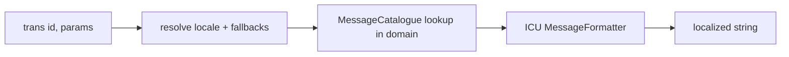

# Internationalization (Translation & Intl)

!!! tip "In a nutshell"
    Translation associe des ids de message à des chaînes localisées par locale
    et par domaine ; Intl expose le jeu de données ICU embarqué (noms de pays,
    de devises, de locales). À retenir pour l'examen : Symfony 8 utilise ICU
    MessageFormat (`{count, plural, ...}`) pour les pluriels, et une traduction
    manquante retourne l'id du message, pas une erreur.

!!! example "Real-world analogy"
    Translation est l'audioguide multilingue d'un musée. Chaque œuvre a un code
    (l'id du message), et le guide joue la phrase correspondante dans la langue
    choisie, en se rabattant sur une langue régionale puis une langue par défaut
    quand la vôtre n'a pas d'enregistrement (le fallback de locale). Si aucun
    enregistrement n'existe nulle part, il lit simplement le code à voix haute au
    lieu de rester muet (une clé manquante retourne l'id). En suivant la
    grammaire propre à chaque langue, il dit correctement « 1 painting » ou
    « 3 paintings » (les règles de pluriel ICU), tandis qu'Intl est le livret
    pré-imprimé des noms de pays, de devises et de langues fourni avec le musée.

!!! abstract "Learning objectives"
    À la fin de ce chapitre, vous saurez :

    - [ ] Traduire avec `TranslatorInterface::trans()`, des paramètres et des domaines.
    - [ ] Utiliser ICU MessageFormat pour la pluralisation et les règles select.
    - [ ] Configurer le fallback de locale et interroger le composant de données Intl.

    **Syllabus:** `Miscellaneous → Internationalization` ·
    **Level:** Advanced ·
    **Est. time:** 40 min ·
    **Prerequisites:** [Twig](../twig/index.md), [Routing locale](../routing/locale.md)

---

## Pour les nuls

### L'idée en une phrase
La traduction associe un identifiant de message à une chaîne localisée par langue — et si aucune traduction n'existe, Symfony affiche l'identifiant lui-même plutôt que de planter.

### Imagine dans la vraie vie
La traduction est un audioguide multilingue de musée. Chaque exposition a un code (l'identifiant du message), et le guide joue la phrase correspondante dans ta langue choisie, se repliant sur une langue régionale puis par défaut quand ta langue exacte n'a pas d'enregistrement. Si aucun enregistrement n'existe nulle part, il lit simplement le code à voix haute au lieu de se taire.

### Dans Symfony
```twig
{{ 'produit.ajoute_panier'|trans }}
```
Si la clé `produit.ajoute_panier` n'existe dans aucun fichier de traduction, la page affiche littéralement "produit.ajoute_panier" — un signal visible immédiat qu'une traduction manque, plutôt qu'une erreur ou un texte vide.

### Exemple simple
```yaml
# messages.fr.yaml
produit.ajoute_panier: "Ajouté au panier"
```

### Comment le mémoriser 🧠
Symfony 8 utilise le **format ICU MessageFormat** (`{count, plural, ...}`) pour la pluralisation — c'est la seule voie, `transchoice` n'existe plus.

---


## Theory

Deux composants coopèrent. **Translation** associe des clés de message à des
chaînes localisées par **locale** et **domaine**, avec la pluralisation ICU.
**Intl** expose le jeu de données ICU — noms de pays, de langues, de locales,
de devises et de fuseaux horaires — pour que vous n'ayez pas à livrer vos
propres listes.

## Deep Dive — how it works internally

!!! question "Predict first"
    Vous appelez `trans('welcome_msg')` mais aucun catalogue ne définit cette clé
    pour la locale active ni pour aucun fallback. Exception, chaîne vide, ou
    autre chose ?

??? note "Reveal"
    Vous obtenez **l'id du message lui-même** (`"welcome_msg"`) — jamais
    d'exception. Les traductions manquantes sont retournées telles quelles (et
    journalisées en dev), si bien que la page s'affiche quand même tout en
    révélant le manque.

### Translator

`Symfony\Contracts\Translation\TranslatorInterface::trans(string $id, array $parameters = [], ?string $domain = null, ?string $locale = null): string`.
Le `Symfony\Component\Translation\Translator` du framework :

1. résout la locale (argument → locale de la request courante → défaut),
2. charge les catalogues (`MessageCatalogue`) pour cette locale et ses **fallbacks**,
3. cherche `$id` dans `$domain` (par défaut `messages`),
4. formate le résultat via l'`IntlFormatter` (ICU) en substituant `$parameters`.

Les catalogues sont chargés depuis les fichiers
`translations/<domain>.<locale>.<format>` (`yaml`, `xlf`/XLIFF, `php`) par des
loaders, puis mis en cache (compilés) par locale.

```php
// trans(string $id, array $parameters = [], ?string $domain = null, ?string $locale = null)
$text = $translator->trans('order.summary', ['name' => 'Ada'], 'checkout', 'fr');
// 1. locale: the explicit 'fr' argument wins over the request locale
// 2. the fr MessageCatalogue (+ fallbacks) is loaded from translations/checkout.fr.yaml
// 3. "order.summary" is looked up in the "checkout" domain
// 4. parameters are substituted by the ICU IntlFormatter
```



### ICU MessageFormat & pluralization

Le Symfony moderne utilise **ICU MessageFormat** pour les pluriels/select à la
place de l'ancienne syntaxe à pipes. L'id du message désigne un pattern ICU
(souvent via le suffixe de domaine `+intl-icu`, p. ex.
`messages+intl-icu.en.yaml`) :

```text
{count, plural,
    =0 {No apples}
    one {One apple}
    other {# apples}
}
```

Passez `['count' => 3]` ; ICU choisit la bonne catégorie de pluriel selon la
locale (`one`, `few`, `many`, `other` varient selon la langue).
`{gender, select, …}` gère le choix par valeur.

```php
// Patterns live in translations/messages+intl-icu.<locale>.yaml
$translator->trans('apple_count', ['count' => 3]); // "3 apples" (plural rule)

// invite: "{gender, select, female {She comes} male {He comes} other {They come}}"
$translator->trans('invite', ['gender' => 'female']); // "She comes"
```

### Domains & fallback

- Les **domaines** regroupent les messages (`messages`, `validators`,
  `security`, personnalisés).
- Les **locales de fallback** (`framework.translator.fallbacks`) sont essayées
  dans l'ordre quand une clé est absente pour la locale active
  (p. ex. `fr_CA` → `fr` → `en`).
- Les traductions manquantes retournent l'**id** lui-même (et sont
  journalisées en dev).

```yaml
# config/packages/translation.yaml
framework:
    translator:
        fallbacks: ['fr', 'en']   # tried in order: fr_CA -> fr -> en
```

### Intl data component

!!! quote "Hors périmètre"
    **Les utilitaires du composant Intl utilisés pour accéder aux données
    ICU ne sont pas inclus dans l'examen.** Les classes de lookup statiques
    ci-dessous (`Countries`, `Languages`, `Locales`, `Currencies`,
    `Timezones`) sont du contenu additionnel / d'approfondissement, hors du
    programme officiel de la certification Symfony 8 — voir
    `specs/TraceabilityMatrix.md`. Elles ne sont pas testées dans les
    examens générés.

`Symfony\Component\Intl` fournit des classes statiques :
`Countries::getName('FR')`, `Languages::getName('de')`, `Locales::getName('pt_BR')`,
`Currencies::getSymbol('EUR')`, `Timezones`. Elles lisent les données ICU
embarquées et respectent la locale courante ou demandée pour les noms
d'affichage.

```php
use Symfony\Component\Intl\Countries;
use Symfony\Component\Intl\Currencies;
use Symfony\Component\Intl\Languages;
use Symfony\Component\Intl\Locales;
use Symfony\Component\Intl\Timezones;

Countries::getName('FR');           // "France" (in the current locale)
Languages::getName('de');           // "German"
Locales::getName('pt_BR');          // "Portuguese (Brazil)"
Currencies::getSymbol('EUR');       // "€"
Timezones::getName('Europe/Paris'); // "Central European Time (Paris)"
Countries::getName('FR', 'de');     // "Frankreich" — explicit display locale
```

!!! note "Source reference"
    `Symfony\Component\Intl\Countries` —
    [symfony/symfony `8.0`](https://github.com/symfony/symfony/blob/8.0/src/Symfony/Component/Intl/Countries.php).

## Configuration & code

=== "PHP Attributes"

    ```php
    <?php
    declare(strict_types=1);

    namespace App\Controller;

    use Symfony\Component\Intl\Countries;
    use Symfony\Contracts\Translation\TranslatorInterface;

    final class GreetController
    {
        public function __construct(private readonly TranslatorInterface $translator) {}

        public function __invoke(): string
        {
            $msg = $this->translator->trans('apple_count', ['count' => 3], 'messages');
            $country = Countries::getName('FR'); // "France" (in current locale)

            return $msg.' — '.$country;
        }
    }
    ```

=== "YAML"

    ```yaml
    # translations/messages+intl-icu.en.yaml
    apple_count: >-
        {count, plural, =0 {No apples} one {One apple} other {# apples}}
    # config/packages/translation.yaml
    framework:
        default_locale: en
        translator:
            fallbacks: ['en']
    ```

=== "Console"

    ```console
    $ php bin/console translation:extract --force en
    $ php bin/console debug:translation en
    ```

## Best practices & anti-patterns

| ✅ Do | ❌ Avoid |
|---|---|
| Utiliser ICU MessageFormat pour les pluriels | La syntaxe de pluralisation à pipe `|`, supprimée |
| Regrouper les messages en domaines | Un unique catalogue `messages` géant |
| Configurer des locales de fallback | Des chaînes anglaises codées en dur dans les templates |
| Utiliser les classes `Intl` pour les noms de pays/devises | Livrer vos propres listes ISO |

## When (not) to use it / alternatives

Utilisez Translation pour tout texte visible par l'utilisateur dans une
application multilingue ; utilisez Intl dès que vous avez besoin de noms
localisés de pays/langues/devises ou de données de formatage de nombres/dates.
Pour la détection de locale depuis l'URL ou les en-têtes, voir
[Routing locale](../routing/locale.md) ; pour `trans` dans les templates, voir
[Twig translations](../twig/translations.md).

!!! danger "Certification traps"
    - Symfony 8 utilise **ICU MessageFormat** ; l'ancienne syntaxe à pipe
      `apples|apple|apples` est du legacy — utilisez `{count, plural, …}`.
    - Une traduction manquante retourne l'**id du message**, pas une erreur.
    - Le domaine par défaut est **`messages`** ; `validators`/`security` sont séparés.
    - Les catégories de pluriel (`one/few/many/other`) **dépendent de la locale** — c'est ICU qui décide.
    - `TranslatorInterface` vit dans `Symfony\Contracts\Translation`.

!!! warning "Common mistakes"
    - Oublier le suffixe `+intl-icu`, si bien que le formatage ICU n'est pas appliqué.
    - Supposer que chaque langue n'a que singulier/pluriel (beaucoup ont davantage de catégories).

## Exercises

1. **(Advanced)** Écrivez un message ICU qui dit "No apples / One apple / N apples".
2. **(Advanced)** Obtenez le nom localisé du pays `FR` et le symbole de la devise `EUR`.

??? success "Solutions"

    **1.** `{count, plural, =0 {No apples} one {One apple} other {# apples}}` dans un
    fichier `messages+intl-icu.<locale>.yaml`, appelé avec `['count' => n]`.

    **2.** `Countries::getName('FR')` et `Currencies::getSymbol('EUR')`.

## Certification questions

??? question "Q1. Which syntax does Symfony 8 use for pluralization?"
    - [x] A. ICU MessageFormat `{count, plural, …}` ✅
    - [ ] B. `singular|plural` pipe syntax
    - [ ] C. `%count%` only

    **Why:** ICU MessageFormat est le mécanisme actuel ; la syntaxe à pipe est du legacy.
    **Ref:** [Pluralization](https://symfony.com/doc/8.0/translation/message_format.html).

??? question "Q2. What is returned when a translation key is missing?"
    - [x] A. The message id itself ✅
    - [ ] B. An empty string
    - [ ] C. A `TranslationException`

    **Why:** Le translator retourne l'id non traduit (journalisé en dev).
    **Ref:** [Translations](https://symfony.com/doc/8.0/translation.html).

??? question "Q3. Which class gives a localized country name?"
    - [x] A. `Symfony\Component\Intl\Countries` ✅
    - [ ] B. `Symfony\Component\Locale\Country`
    - [ ] C. `Symfony\Component\Translation\Countries`

    **Why:** `Countries::getName()` lit les données ICU embarquées. **Ref:** [Intl](https://symfony.com/doc/8.0/components/intl.html).

## Key takeaways

- `trans($id, $params, $domain, $locale)` ; domaine par défaut `messages`.
- ICU MessageFormat gère plural/select ; les catégories dépendent de la locale.
- Les locales de fallback comblent les manques ; les clés manquantes retournent l'id.
- Intl (`Countries`/`Languages`/`Locales`/`Currencies`) expose les données ICU.

## Last-minute revision

!!! tip "Cheat sheet"
    - `TranslatorInterface::trans()` depuis `Symfony\Contracts\Translation`.
    - Fichiers : `translations/<domain>[+intl-icu].<locale>.{yaml,xlf,php}`.
    - ICU : `{count, plural, one {…} other {# …}}`, `{v, select, …}`.
    - Intl : `Countries`, `Languages`, `Locales`, `Currencies`, `Timezones`.

## Connections

- **Depends on:** [Routing locale](../routing/locale.md) — la locale active détermine le catalogue sélectionné.
- **Reused in:** [Twig translations](../twig/translations.md) — `trans` dans les templates ; [Serializer](serializer.md) — Intl formate les noms de devises/pays dans les payloads.
- **Confused with:** l'ancienne syntaxe à pipe `apples|apple` — Symfony 8 utilise ICU MessageFormat.

## Official References
- [Official docs — Translations](https://symfony.com/doc/8.0/translation.html)
- [Official docs — Message format](https://symfony.com/doc/8.0/translation/message_format.html)
- [Official docs — Intl](https://symfony.com/doc/8.0/components/intl.html)
- [Symfony source — Translator](https://github.com/symfony/symfony/blob/8.0/src/Symfony/Component/Translation/Translator.php)

## Video references

!!! tip "Watch & learn"
    Voici des chaînes vidéo officielles, mises à jour en continu — cherchez-y
    "Symfony components" pour consolider ce chapitre. Nous lions des chaînes
    stables plutôt que des vidéos individuelles afin que les références ne se
    périment jamais.

    - [SymfonyCasts screencasts](https://symfonycasts.com/tracks/symfony) — tutoriels scénarisés à suivre en codant.
    - [Symfony official YouTube](https://www.youtube.com/@SymfonyOfficial) — conférences et keynotes SymfonyCon.
    - [Official docs for this topic](https://symfony.com/doc/8.0/translation/message_format.html) — certaines pages de la doc Symfony intègrent un screencast.

## Confidence check

Je suis prêt quand je peux :

- [ ] expliquer **pourquoi** ICU MessageFormat remplace l'ancienne pluralisation à pipe
- [ ] traduire avec paramètres/domaines et écrire un pluriel ICU en Symfony 8
- [ ] déboguer un cas « la traduction affiche l'id » (clé manquante/fallback/`+intl-icu`)
- [ ] repérer le piège : une clé manquante retourne l'id ; les catégories de pluriel dépendent de la locale
- [ ] décrire la résolution de locale + fallback et les classes de données `Intl`

---

<small>Related: [Twig translations](../twig/translations.md) · [Routing locale](../routing/locale.md) · [Serializer](serializer.md)</small>
