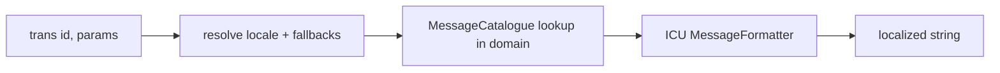

# Internationalization (Translation & Intl)

!!! abstract "Learning objectives"
    By the end of this chapter you can:

    - [ ] Translate with `TranslatorInterface::trans()`, parameters and domains.
    - [ ] Use ICU MessageFormat for pluralization and select rules.
    - [ ] Configure locale fallback and query the Intl data component.

    **Syllabus:** `Miscellaneous → Internationalization` ·
    **Level:** Advanced ·
    **Est. time:** 40 min ·
    **Prerequisites:** [Twig](../twig/index.md), [Routing locale](../routing/locale.md)

---

## Theory

Two components cooperate. **Translation** maps message keys to localized strings
per **locale** and **domain**, with ICU pluralization. **Intl** exposes the ICU
dataset — country, language, locale, currency and timezone names — so you don't
ship your own lists.

## Deep Dive — how it works internally

### Translator

`Symfony\Contracts\Translation\TranslatorInterface::trans(string $id, array $parameters = [], ?string $domain = null, ?string $locale = null): string`.
The framework's `Symfony\Component\Translation\Translator`:

1. resolves the locale (argument → current request locale → default),
2. loads catalogues (`MessageCatalogue`) for that locale and its **fallbacks**,
3. looks up `$id` in `$domain` (default `messages`),
4. formats the result via the `IntlFormatter` (ICU) substituting `$parameters`.

Catalogues are loaded from `translations/<domain>.<locale>.<format>` files
(`yaml`, `xlf`/XLIFF, `php`) by loaders, then cached (compiled) per locale.



### ICU MessageFormat & pluralization

Modern Symfony uses **ICU MessageFormat** for plurals/select instead of the old
pipe syntax. The message id names an ICU pattern (often via the `+intl-icu`
domain suffix, e.g. `messages+intl-icu.en.yaml`):

```text
{count, plural,
    =0 {No apples}
    one {One apple}
    other {# apples}
}
```

Pass `['count' => 3]`; ICU picks the correct plural category for the locale
(`one`, `few`, `many`, `other` vary by language). `{gender, select, …}` handles
choice by value.

### Domains & fallback

- **Domains** group messages (`messages`, `validators`, `security`, custom).
- **Fallback locales** (`framework.translator.fallbacks`) are tried in order when
  a key is missing for the active locale (e.g. `fr_CA` → `fr` → `en`).
- Missing translations return the **id** itself (and are logged in dev).

### Intl data component

`Symfony\Component\Intl` provides static classes:
`Countries::getName('FR')`, `Languages::getName('de')`, `Locales::getName('pt_BR')`,
`Currencies::getSymbol('EUR')`, `Timezones`. They read the bundled ICU data and
respect the current/requested locale for display names.

!!! note "Source reference"
    `Symfony\Component\Translation\Translator::trans()` —
    [symfony/symfony `8.0`](https://github.com/symfony/symfony/blob/8.0/src/Symfony/Component/Translation/Translator.php).

## Configuration & code

=== "PHP Attributes"

    ```php
    <?php
    declare(strict_types=1);

    namespace App\Controller;

    use Symfony\Component\Intl\Countries;
    use Symfony\Contracts\Translation\TranslatorInterface;

    final class GreetController
    {
        public function __construct(private readonly TranslatorInterface $translator) {}

        public function __invoke(): string
        {
            $msg = $this->translator->trans('apple_count', ['count' => 3], 'messages');
            $country = Countries::getName('FR'); // "France" (in current locale)

            return $msg.' — '.$country;
        }
    }
    ```

=== "YAML"

    ```yaml
    # translations/messages+intl-icu.en.yaml
    apple_count: >-
        {count, plural, =0 {No apples} one {One apple} other {# apples}}
    # config/packages/translation.yaml
    framework:
        default_locale: en
        translator:
            fallbacks: ['en']
    ```

=== "Console"

    ```console
    $ php bin/console translation:extract --force en
    $ php bin/console debug:translation en
    ```

## Best practices & anti-patterns

| ✅ Do | ❌ Avoid |
|---|---|
| Use ICU MessageFormat for plurals | The removed `|`-pipe pluralization syntax |
| Group messages into domains | One giant `messages` catalogue |
| Configure fallback locales | Hardcoding English strings in templates |
| Use `Intl` classes for country/currency names | Shipping your own ISO lists |

## When (not) to use it / alternatives

Use Translation for any user-facing text in a multilingual app; use Intl whenever
you need localized country/language/currency names or number/date formatting
data. For locale detection from URL/headers see [Routing locale](../routing/locale.md);
for `trans` in templates see [Twig translations](../twig/translations.md).

!!! danger "Certification traps"
    - Symfony 8 uses **ICU MessageFormat**; the old `apples|apple|apples` pipe
      syntax is legacy — use `{count, plural, …}`.
    - A missing translation returns the **message id**, not an error.
    - The default domain is **`messages`**; `validators`/`security` are separate.
    - Plural categories (`one/few/many/other`) are **locale-dependent** — ICU decides.
    - `TranslatorInterface` lives in `Symfony\Contracts\Translation`.

!!! warning "Common mistakes"
    - Forgetting the `+intl-icu` suffix so ICU formatting isn't applied.
    - Assuming every language has just singular/plural (many have more categories).

## Exercises

1. **(Advanced)** Write an ICU message that says "No apples / One apple / N apples".
2. **(Advanced)** Get the localized name of country `FR` and currency symbol for `EUR`.

??? success "Solutions"

    **1.** `{count, plural, =0 {No apples} one {One apple} other {# apples}}` in a
    `messages+intl-icu.<locale>.yaml` file, called with `['count' => n]`.

    **2.** `Countries::getName('FR')` and `Currencies::getSymbol('EUR')`.

## Certification questions

??? question "Q1. Which syntax does Symfony 8 use for pluralization?"
    - [x] A. ICU MessageFormat `{count, plural, …}` ✅
    - [ ] B. `singular|plural` pipe syntax
    - [ ] C. `%count%` only

    **Why:** ICU MessageFormat is the current mechanism; the pipe syntax is legacy.
    **Ref:** [Pluralization](https://symfony.com/doc/current/translation/message_format.html).

??? question "Q2. What is returned when a translation key is missing?"
    - [x] A. The message id itself ✅
    - [ ] B. An empty string
    - [ ] C. A `TranslationException`

    **Why:** The translator returns the untranslated id (logged in dev).
    **Ref:** [Translations](https://symfony.com/doc/current/translation.html).

??? question "Q3. Which class gives a localized country name?"
    - [x] A. `Symfony\Component\Intl\Countries` ✅
    - [ ] B. `Symfony\Component\Locale\Country`
    - [ ] C. `Symfony\Component\Translation\Countries`

    **Why:** `Countries::getName()` reads bundled ICU data. **Ref:** [Intl](https://symfony.com/doc/current/components/intl.html).

## Key takeaways

- `trans($id, $params, $domain, $locale)`; default domain `messages`.
- ICU MessageFormat handles plural/select; categories are locale-specific.
- Fallback locales fill gaps; missing keys return the id.
- Intl (`Countries`/`Languages`/`Locales`/`Currencies`) exposes ICU data.

## Last-minute revision

!!! tip "Cheat sheet"
    - `TranslatorInterface::trans()` from `Symfony\Contracts\Translation`.
    - Files: `translations/<domain>[+intl-icu].<locale>.{yaml,xlf,php}`.
    - ICU: `{count, plural, one {…} other {# …}}`, `{v, select, …}`.
    - Intl: `Countries`, `Languages`, `Locales`, `Currencies`, `Timezones`.

## References

- [Official docs — Translations](https://symfony.com/doc/current/translation.html)
- [Official docs — Message format](https://symfony.com/doc/current/translation/message_format.html)
- [Official docs — Intl](https://symfony.com/doc/current/components/intl.html)
- [Symfony source — Translator](https://github.com/symfony/symfony/blob/8.0/src/Symfony/Component/Translation/Translator.php)

---

<small>Related: [Twig translations](../twig/translations.md) · [Routing locale](../routing/locale.md) · [Serializer](serializer.md)</small>
