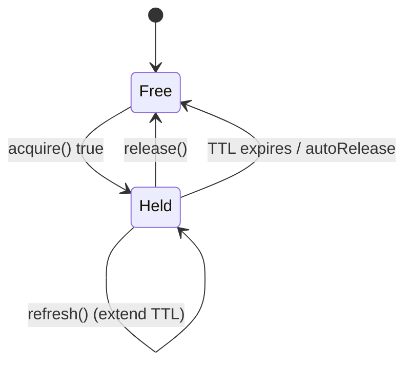

# Lock Component

!!! tip "In a nutshell"
    Lock stops two processes doing the same critical work at once: get a
    `LockInterface` from `LockFactory`, `acquire()`, work, `release()`. Exam
    gold: `acquire()` is **non-blocking** by default (returns `false` if held),
    and local stores (Flock/Semaphore) only guard a single machine.

!!! example "Real-world analogy"
    A lock is the **"occupied" sign on a bathroom door**. `acquire()` tries the
    door: if it's free you flip the sign and go in; if it already reads occupied
    you get a plain "no" (`false`) and move on — you don't queue unless you ask to
    (blocking). `release()` flips it back to vacant, and the **TTL** is a spring
    that pops the sign to vacant after a while so a fainted occupant can't lock
    everyone out forever (`refresh()` resets that spring).

!!! abstract "Learning objectives"
    By the end of this chapter you can:

    - [ ] Create locks with `LockFactory` and acquire/release/refresh them.
    - [ ] Choose blocking vs non-blocking acquisition and a suitable store.
    - [ ] Use expiring (auto-refreshing) and shared/read-write locks safely.

    **Syllabus:** `Miscellaneous → Lock` ·
    **Level:** Advanced → Expert ·
    **Est. time:** 35 min ·
    **Prerequisites:** [Dependency Injection](../dependency-injection/index.md)

---

## Theory

The Lock component prevents two processes from doing the same critical work at
once (e.g. two cron runs, two workers). You get a `LockInterface` from a
`LockFactory` for a named **resource**, `acquire()` it, do the work, then
`release()`. A **store** backs the lock; its scope (local vs shared) decides
whether mutual exclusion holds across servers.

## Deep Dive — how it works internally

!!! question "Predict first"
    Two cron runs start at once. Each does `if (!$lock->acquire()) return;` with a
    default `acquire()`. Does the second one block, throw, or return immediately?

??? note "Reveal"
    It returns **`false` immediately** — `acquire()` is non-blocking by default, so
    the second run skips the work. Pass `acquire(true)` only when the work must
    eventually run (then it waits instead of bailing).

### Factory, lock, store

| Role | FQCN |
|---|---|
| Factory | `Symfony\Component\Lock\LockFactory` |
| Lock | `Symfony\Component\Lock\LockInterface` (impl `Lock`) |
| Store contract | `Symfony\Component\Lock\PersistingStoreInterface` |
| Key | `Symfony\Component\Lock\Key` |

`LockFactory::createLock(string $resource, ?float $ttl = 300.0, bool $autoRelease = true)`
returns a `Lock`. Internally a `Key` identifies the resource; the store persists
that key's ownership. `autoRelease` releases the lock when the `Lock` object is
destroyed (end of request/script).

### Acquire: blocking vs non-blocking

- `acquire(false)` — **non-blocking** (default): returns `true` if acquired,
  `false` immediately if already held. Use this to skip work another process is
  doing.
- `acquire(true)` — **blocking**: waits until the lock is free (the store must
  support blocking, or the component retries). Use when the work must eventually
  run.



### Expiring locks & auto-refresh

A lock has a **TTL** so a crashed process doesn't hold it forever. For work that
may exceed the TTL, call `refresh()` periodically to extend it. Without refresh,
the store may consider the lock expired and let another process acquire it —
breaking mutual exclusion. Choose a TTL comfortably above expected runtime, and
`refresh()` in long loops.

### Stores

| Store | Scope |
|---|---|
| `FlockStore` | Local filesystem (single server) |
| `SemaphoreStore` | Local, SysV semaphores |
| `RedisStore` | Distributed (shared) |
| `MemcachedStore` | Distributed |
| `PostgreSqlStore` / `DoctrineDbalStore` | Database-backed |
| `ZookeeperStore` | Distributed coordination |
| `InMemoryStore` | Per-process (tests) |

Local stores (`Flock`, `Semaphore`) only guarantee exclusion **on one machine**.
For multi-server deployments use a shared store (Redis, DB). `CombinedStore` with
a quorum can span multiple Redis servers.

### Shared (read/write) locks

`SharedLockInterface` adds `acquireRead()`: many readers may hold the lock
simultaneously, but a writer's `acquire()` is exclusive. Not all stores support
shared locks (Flock does; Redis via the component's implementation).

!!! note "Source reference"
    `Symfony\Component\Lock\LockFactory` and `Lock::acquire()` —
    [symfony/symfony `8.0`](https://github.com/symfony/symfony/blob/8.0/src/Symfony/Component/Lock/Lock.php).

### Null behavior

Lock signals contention with a **boolean, not null**: `acquire(false)` returns
`false` when the resource is already held and `true` when you got it —
`createLock()` always returns a `Lock`, never null. The common bug is treating
`acquire()` like something that throws or returns null on "busy": it doesn't, so
`if (!$lock->acquire()) { return; }` is the correct guard. (Blocking
`acquire(true)` instead waits and ultimately returns `true` or throws
`LockConflictedException`.) Because `false` is an ordinary value, forgetting to
check it means you march into the critical section unprotected.

!!! note "Null in real life"
    A busy door doesn't give you *nothing* — it gives you a clear "occupied"
    (`false`). Reading that plain "no" as "I guess it's fine" is how two people
    end up in the same stall.

## Configuration & code

=== "PHP Attributes"

    ```php
    <?php
    declare(strict_types=1);

    namespace App\Command;

    use Symfony\Component\Lock\LockFactory;

    final class ReportGenerator
    {
        public function __construct(private readonly LockFactory $lockFactory) {}

        public function run(): void
        {
            $lock = $this->lockFactory->createLock('report-nightly', ttl: 120);
            if (!$lock->acquire()) {
                return; // another run holds it — skip
            }
            try {
                // ... long work; extend if needed:
                $lock->refresh();
            } finally {
                $lock->release();
            }
        }
    }
    ```

=== "YAML"

    ```yaml
    # config/packages/lock.yaml
    framework:
        lock:
            default: '%env(LOCK_DSN)%'   # e.g. redis://localhost, flock, semaphore
    ```

=== "Console"

    ```console
    $ php bin/console debug:container lock.factory
    ```

## Best practices & anti-patterns

| ✅ Do | ❌ Avoid |
|---|---|
| `release()` in a `finally` block | Leaking held locks on exceptions |
| Use a **shared** store for multi-server exclusion | `FlockStore` across many machines |
| Set TTL > expected runtime and `refresh()` | A too-short TTL that expires mid-work |
| Non-blocking `acquire()` to skip duplicate work | Blocking forever with no timeout |

## When (not) to use it / alternatives

Use Lock to serialise critical sections across processes (cron, workers,
deploys). For rate limiting, use the RateLimiter component; for single-process
concurrency you don't need Lock. Don't rely on a local store for a horizontally
scaled app.

!!! danger "Certification traps"
    - `acquire()` defaults to **non-blocking**; pass `true` for blocking.
    - Locks have a **TTL** (default 300 s) — long jobs must `refresh()`.
    - `FlockStore`/`SemaphoreStore` are **local only**; use Redis/DB for distributed.
    - `autoRelease` frees the lock when the `Lock` object is garbage-collected.
    - Shared locks need `SharedLockInterface` and a supporting store.

!!! warning "Common mistakes"
    - Assuming a filesystem lock protects across servers.
    - Not releasing in `finally`, so a thrown exception strands the lock until TTL.

## Exercises

1. **(Advanced)** Ensure a nightly report command runs only once even if triggered twice.
2. **(Expert)** Explain why a long job with a 120 s lock TTL must call `refresh()`.

??? success "Solutions"

    **1.** See `ReportGenerator::run()` — non-blocking `acquire()` returns early if
    another run holds `report-nightly`.

    **2.** After 120 s the store treats the lock as expired and another process
    could acquire it, breaking exclusion. `refresh()` extends the TTL so the owner
    keeps the lock while still working.

## Certification questions

??? question "Q1. `LockInterface::acquire()` with no argument is…"
    - [x] A. non-blocking — returns false immediately if held ✅
    - [ ] B. blocking until free
    - [ ] C. throws if held

    **Why:** The default is non-blocking; `acquire(true)` blocks. **Ref:** [Lock](https://symfony.com/doc/current/lock.html#blocking-locks).

??? question "Q2. Which store works across multiple servers?"
    - [ ] A. `FlockStore`
    - [ ] B. `SemaphoreStore`
    - [x] C. `RedisStore` ✅

    **Why:** Flock/Semaphore are local; Redis (and DB) stores are shared.
    **Ref:** [Lock stores](https://symfony.com/doc/current/components/lock.html#available-stores).

??? question "Q3. Why call `refresh()` during a long critical section?"
    - [x] A. To extend the lock's TTL before it expires ✅
    - [ ] B. To reacquire after release
    - [ ] C. To switch stores

    **Why:** `refresh()` prolongs the TTL so the lock isn't considered stale mid-job.
    **Ref:** [Expiring locks](https://symfony.com/doc/current/components/lock.html#expiring-locks).

## Key takeaways

- `LockFactory::createLock($resource, $ttl)` → `acquire()`/`release()`/`refresh()`.
- Non-blocking by default; `acquire(true)` blocks.
- Store scope matters: local (Flock/Semaphore) vs shared (Redis/DB).
- TTL + `refresh()` prevent both deadlocks and premature expiry.

## Last-minute revision

!!! tip "Cheat sheet"
    - `createLock(name, ttl=300, autoRelease=true)`.
    - `acquire(bool $blocking=false)`, `release()`, `refresh()`, `isAcquired()`.
    - Shared: `SharedLockInterface::acquireRead()`.
    - DSN: `flock`, `semaphore`, `redis://…`, `%env(LOCK_DSN)%`.

## Connections

- **Depends on:** [Dependency Injection](../dependency-injection/index.md) — `LockFactory` is autowired from the configured store DSN.
- **Reused in:** [Messenger](messenger.md) — serialise duplicate worker runs; [Process](process.md) — guard shared external tools.
- **Confused with:** [Cache](cache.md) stampede protection — Lock enforces strict mutual exclusion; the cache only reduces duplicate recompute.

## Official References
- [Official docs — Lock](https://symfony.com/doc/current/lock.html)
- [Official docs — Lock component](https://symfony.com/doc/current/components/lock.html)
- [Symfony source — Lock](https://github.com/symfony/symfony/blob/8.0/src/Symfony/Component/Lock/Lock.php)

## Video references

!!! tip "Watch & learn"
    These are official, continuously-updated video channels — search them for
    "Symfony components" to reinforce this chapter. We link stable channels rather than
    individual videos so the references never rot.

    - [SymfonyCasts screencasts](https://symfonycasts.com/tracks/symfony) — scripted, code-along tutorials.
    - [Symfony official YouTube](https://www.youtube.com/@SymfonyOfficial) — SymfonyCon conference talks & keynotes.
    - [Official docs for this topic](https://symfony.com/doc/current/lock.html#blocking-locks) — some Symfony doc pages embed a screencast.

## Confidence check

I'm ready when I can:

- [ ] explain **why** a distributed store is needed for multi-server exclusion
- [ ] acquire/release/refresh a lock in Symfony 8, releasing in `finally`
- [ ] debug a lock lost mid-job (TTL expired, no `refresh()`) or Flock across servers
- [ ] spot the trick: `acquire()` is non-blocking and returns `false`, not null
- [ ] describe how a `Key` + store persist ownership and TTL

---

<small>Related: [Cache](cache.md) · [Process](process.md) · [Messenger](messenger.md)</small>
