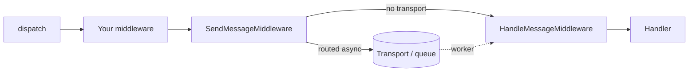
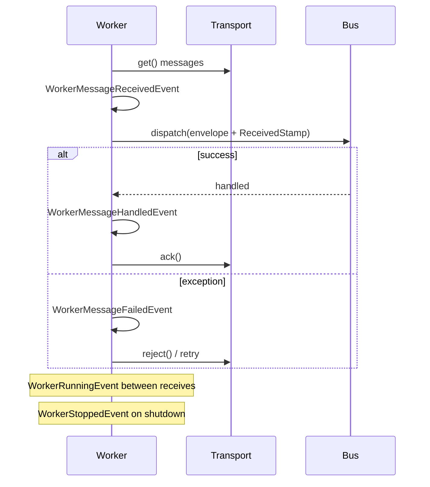
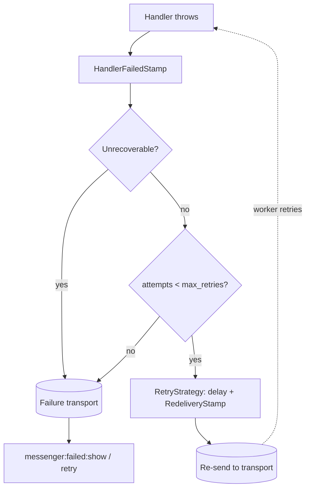

# Messenger Component

!!! tip "In a nutshell"
    Messenger envoie des objets PHP simples (messages) à travers un bus vers des
    handlers, afin que le travail lent s'exécute plus tard dans un worker en arrière-plan
    plutôt que pendant la request. Or de l'examen : `dispatch()` retourne une
    **`Envelope`** (jamais la valeur du handler), et dès qu'un message est routé
    vers un transport, `SendMessageMiddleware` **arrête** le bus, si bien que le
    handler s'exécute dans le worker, pas dans le processus courant.

!!! example "Real-world analogy"
    Messenger est un **bureau de poste**. `dispatch()` revient à **déposer une
    lettre dans la boîte** — vous obtenez un accusé (l'`Envelope`), pas une
    réponse. Le **transport** est la file et la salle de tri où les lettres
    attendent ; le **worker** est le facteur qui les récupère plus tard et les
    livre ; le **handler** est le destinataire qui finit par agir sur la lettre.
    Vous n'attendez pas au guichet que le destinataire la lise — cela se passe
    plus tard, ailleurs.

!!! abstract "Learning objectives"
    À la fin de ce chapitre, vous saurez :

    - [ ] Modéliser un message + handler avec `#[AsMessageHandler]` et le dispatcher via `MessageBusInterface`.
    - [ ] Expliquer le **middleware pipeline**, les envelopes et les **stamps** les plus importants.
    - [ ] Configurer les **transports**, router les messages et raisonner sur la livraison sync vs async.
    - [ ] Retracer le **cycle de vie du worker** `messenger:consume` et les events qu'il dispatche.
    - [ ] Configurer les **retries** et le **failure transport**, et utiliser `DispatchAfterCurrentBusStamp`.

    **Syllabus:** `Miscellaneous → Messenger` ·
    **Level:** Expert ·
    **Est. time:** 75 min ·
    **Prerequisites:** [DI & Tags](../dependency-injection/index.md), [Console](../console/index.md), [Events](../architecture/events.md)

---

## Theory

Messenger vous permet d'envoyer des **messages** à travers un **message bus** ;
le bus les fait passer par une pile de **middleware** et appelle finalement un
ou plusieurs **handlers**. Un message est n'importe quel objet PHP simple (un
DTO). Rien n'est couplé à HTTP — le même message peut être traité de manière
**synchrone** dans le processus courant ou de manière **asynchrone** par un
**worker** en arrière-plan qui consomme depuis un **transport** (file d'attente).

Les trois rôles que vous écrivez :

| Rôle | Ce que c'est |
|---|---|
| **Message** | Un objet PHP simple et sérialisable qui porte une intention/des données |
| **Handler** | Un service callable/invokable qui agit sur un type de message |
| **Bus** | `MessageBusInterface::dispatch()` — le point d'entrée, qui retourne une `Envelope` |

Tout ce qui circule dans le bus est enveloppé dans une **`Envelope`** décorée
de **stamps** (des métadonnées : quel transport, quand livrer, les résultats, le
nombre de tentatives…).

```php
use Symfony\Component\Messenger\Attribute\AsMessageHandler;
use Symfony\Component\Messenger\MessageBusInterface;

final readonly class SmsNotification           // Message: a plain DTO
{
    public function __construct(public string $content) {}
}

#[AsMessageHandler]
final class SmsNotificationHandler             // Handler: acts on one message type
{
    public function __invoke(SmsNotification $message): void { /* ... */ }
}

// Bus: dispatch() wraps the DTO in an Envelope (stamps carry the metadata)
$envelope = $bus->dispatch(new SmsNotification('hello'));
```

## Deep Dive — how it works internally

!!! question "Predict first"
    Vous `dispatch()` un message routé vers un transport `async`, puis lisez
    immédiatement `$envelope->last(HandledStamp::class)`. Obtenez-vous le
    résultat du handler, `null`, ou une exception ?

??? note "Reveal"
    `null`. `SendMessageMiddleware` a sérialisé et mis le message en file, puis a
    **arrêté** le bus — aucun handler ne s'est exécuté dans ce processus, donc
    aucun `HandledStamp` n'existe et le nullsafe `?->` produit `null`. Le
    résultat n'apparaît qu'après qu'un **worker** a consommé le message, et
    encore : dans le processus du worker, pas le vôtre.

### The core classes

| Rôle | FQCN |
|---|---|
| Contrat du bus | `Symfony\Component\Messenger\MessageBusInterface` |
| Bus par défaut | `Symfony\Component\Messenger\MessageBus` |
| Envelope | `Symfony\Component\Messenger\Envelope` |
| Marqueur de stamp | `Symfony\Component\Messenger\Stamp\StampInterface` |
| Attribut de handler | `Symfony\Component\Messenger\Attribute\AsMessageHandler` |
| Contrat de middleware | `Symfony\Component\Messenger\Middleware\MiddlewareInterface` |
| Pile de middleware | `Symfony\Component\Messenger\Middleware\StackInterface` |
| Middleware de traitement | `Symfony\Component\Messenger\Middleware\HandleMessageMiddleware` |
| Middleware d'envoi | `Symfony\Component\Messenger\Middleware\SendMessageMiddleware` |
| Contrat de transport | `Symfony\Component\Messenger\Transport\TransportInterface` |
| Contrat de serializer | `Symfony\Component\Messenger\Transport\Serialization\SerializerInterface` |
| Worker | `Symfony\Component\Messenger\Worker` |

### The dispatch pipeline

`MessageBus::dispatch()` enveloppe le message dans une `Envelope` (sauf s'il en
est déjà une) et le pousse à travers une **pile ordonnée de middleware**. Chaque
middleware appelle `$stack->next()->handle($envelope, $stack)` : la pile forme
donc une chaîne en **poupées russes** — un middleware peut agir avant *et*
après le reste du pipeline.

```php
use Symfony\Component\Messenger\Envelope;
use Symfony\Component\Messenger\Middleware\MiddlewareInterface;
use Symfony\Component\Messenger\Middleware\StackInterface;

final class AuditMiddleware implements MiddlewareInterface
{
    public function handle(Envelope $envelope, StackInterface $stack): Envelope
    {
        // code here runs BEFORE the rest of the pipeline
        $envelope = $stack->next()->handle($envelope, $stack);
        // code here runs AFTER (russian-doll, on the way back out)
        return $envelope;
    }
}
```



Les deux middleware intégrés qui font pivot s'exécutent près de la fin :

1. **`SendMessageMiddleware`** — si le message est **routé vers un transport**,
   il ajoute un `SentStamp`, sérialise et envoie l'envelope, puis **arrête** le
   pipeline (le handler n'est *pas* appelé dans ce processus). S'il n'est routé
   que vers `sync` (ou pas routé du tout), il laisse passer.
2. **`HandleMessageMiddleware`** — localise les handlers pour le type de message
   et les invoque, en ajoutant un `HandledStamp` par handler avec la valeur de
   retour.

```php
use Symfony\Component\Messenger\Stamp\HandledStamp;
use Symfony\Component\Messenger\Stamp\SentStamp;

$envelope = $bus->dispatch(new SendReminder(userId: 42));

// Routed async: SendMessageMiddleware enqueued it and stopped the pipeline
$envelope->last(SentStamp::class);    // SentStamp — proof it was sent to a transport
$envelope->last(HandledStamp::class); // null — HandleMessageMiddleware never ran here

// Routed to sync (or not routed): HandleMessageMiddleware calls the handler,
// so last(HandledStamp::class)->getResult() holds the return value instead
```

!!! note "Source reference"
    `Symfony\Component\Messenger\MessageBus::dispatch()` et les middleware dans
    `.../Middleware/` —
    [symfony/symfony `8.0`](https://github.com/symfony/symfony/blob/8.0/src/Symfony/Component/Messenger/MessageBus.php).

### Buses: command, query, event

Messenger fournit **un** bus par défaut (`messenger.bus.default`), mais vous
pouvez en définir plusieurs. La convention (non imposée par le composant) en
utilise trois :

- **Command bus** — un seul handler, pas de valeur de retour, souvent async.
- **Query bus** — exactement un handler, retourne un résultat (lu via le
  `HandledStamp`).
- **Event bus** — de zéro à plusieurs handlers, en mode fire-and-forget.

Chaque bus est un `MessageBus` indépendant avec sa **propre liste de
middleware** : un command bus peut donc envelopper les handlers dans une
transaction Doctrine tandis qu'un event bus ne le fait pas.

```yaml
# config/packages/messenger.yaml
framework:
    messenger:
        default_bus: command.bus       # instead of messenger.bus.default
        buses:
            command.bus:
                middleware: [doctrine_transaction]  # own middleware list
            query.bus: ~               # one handler; result read via HandledStamp
            event.bus:
                default_middleware:
                    allow_no_handlers: true          # fire-and-forget
```

### Envelopes & stamps

Une `Envelope` est immuable : `with()` retourne une *nouvelle* envelope avec un
stamp ajouté ; `last(StampClass::class)` lit le stamp le plus récent d'un type
donné. Les stamps clés :

```php
use Symfony\Component\Messenger\Envelope;
use Symfony\Component\Messenger\Stamp\DelayStamp;

$envelope = new Envelope(new SendReminder(userId: 42));
$delayed = $envelope->with(new DelayStamp(5_000)); // with() returns a NEW envelope
$envelope->last(DelayStamp::class);                // null — original unchanged
$delayed->last(DelayStamp::class);                 // the DelayStamp instance
```

| Stamp | Rôle |
|---|---|
| `Stamp\SentStamp` | Marque que le message a été envoyé à un transport (async) |
| `Stamp\HandledStamp` | Porte la valeur de retour d'un handler + le nom du handler |
| `Stamp\DelayStamp` | Retarde la livraison de N **millisecondes** |
| `Stamp\ReceivedStamp` | Posé par le worker après réception depuis un transport |
| `Stamp\BusNameStamp` | Enregistre quel bus l'a dispatché |
| `Stamp\TransportMessageIdStamp` | Identifiant de message attribué par le broker |
| `Stamp\DispatchAfterCurrentBusStamp` | Diffère le dispatch jusqu'à la fin du traitement en cours |
| `Stamp\HandlerFailedStamp` | Enveloppe les exceptions lancées par les handlers |
| `Stamp\RedeliveryStamp` | Comptabilité des retries (nombre de tentatives, erreur) |

```php
<?php
declare(strict_types=1);

use Symfony\Component\Messenger\Envelope;
use Symfony\Component\Messenger\MessageBusInterface;
use Symfony\Component\Messenger\Stamp\DelayStamp;
use Symfony\Component\Messenger\Stamp\HandledStamp;

/** @var MessageBusInterface $bus */
$envelope = $bus->dispatch(new SendReminder(userId: 42), [
    new DelayStamp(5_000), // deliver 5 s later (milliseconds!)
]);

// Read a query-bus result:
$result = $envelope->last(HandledStamp::class)?->getResult();
```

### Transports & the serializer

Un **transport** est défini par un **DSN** et implémente `TransportInterface`
(un receiver + un sender). Familles de transports intégrées (framework-bundle) :

| Schéma DSN | Transport |
|---|---|
| `sync://` | En mémoire, traité immédiatement dans le même processus |
| `doctrine://` | Table de base de données jouant le rôle de file |
| `amqp://` | Broker RabbitMQ / AMQP |
| `redis://` | Streams Redis |
| `in-memory://` | Transport de test, garde les messages en mémoire |

Par défaut, le **serializer PHP** (`Transport\Serialization\PhpSerializer`)
applique `serialize()` à l'envelope. Le transport serializer basé sur le
**Symfony Serializer** est recommandé pour l'interopérabilité entre
langages/applications.

```yaml
# config/packages/messenger.yaml
framework:
    messenger:
        transports:
            async:
                dsn: '%env(MESSENGER_TRANSPORT_DSN)%'  # builds a TransportInterface
                # replace the default PhpSerializer (PHP serialize()) for interop:
                serializer: messenger.transport.symfony_serializer
```

### Worker lifecycle

`messenger:consume <transport>` construit un `Worker` qui boucle : **recevoir →
pousser dans le bus (avec un `ReceivedStamp`) → ack en cas de succès / reject en
cas d'échec**. Events dispatchés autour de chaque étape :

```console
# Starts a Worker: receive → dispatch (with ReceivedStamp) → ack/reject loop
$ php bin/console messenger:consume async -vv --time-limit=3600
```



Les events du worker (namespace `Symfony\Component\Messenger\Event\`) :
`WorkerStartedEvent`, `WorkerMessageReceivedEvent`, `WorkerMessageHandledEvent`,
`WorkerMessageFailedEvent`, `WorkerRunningEvent`, `WorkerStoppedEvent`,
`WorkerRateLimitedEvent`.

```php
use Symfony\Component\EventDispatcher\Attribute\AsEventListener;
use Symfony\Component\Messenger\Event\WorkerMessageFailedEvent;

#[AsEventListener]
final class LogFailedMessage
{
    public function __invoke(WorkerMessageFailedEvent $event): void
    {
        // fired by the Worker when handling a received message threw
        $event->getThrowable(); // the handler exception
    }
}
```

!!! note "Source reference"
    `Symfony\Component\Messenger\Worker::run()` —
    [symfony/symfony `8.0`](https://github.com/symfony/symfony/blob/8.0/src/Symfony/Component/Messenger/Worker.php).

### Retries & the failure transport

Quand un handler lance une exception, `HandleMessageMiddleware` enveloppe
l'erreur dans un `HandlerFailedStamp`. La logique de retry du worker (une
`RetryStrategyInterface`, par défaut `MultiplierRetryStrategy`) décide s'il faut
**réessayer** : elle renvoie l'envelope avec un `RedeliveryStamp` et un délai
exponentiel. Une fois `max_retries` épuisé, l'envelope est envoyée vers le
**failure transport** configuré, inspectée avec `messenger:failed:show` et
rejouée avec `messenger:failed:retry`.

```yaml
# config/packages/messenger.yaml
framework:
    messenger:
        failure_transport: failed   # inspect with messenger:failed:show / retry
        transports:
            async:
                dsn: '%env(MESSENGER_TRANSPORT_DSN)%'
                retry_strategy:     # default: MultiplierRetryStrategy
                    max_retries: 3  # exhausted → failure transport
                    delay: 1000     # ms; each retry re-sent with a RedeliveryStamp
                    multiplier: 2   # exponential backoff
```

Lancer `UnrecoverableMessageHandlingException` court-circuite complètement les
retries et va directement vers le failure transport.

```php
use Symfony\Component\Messenger\Exception\UnrecoverableMessageHandlingException;

#[AsMessageHandler]
final class ChargeCardHandler
{
    public function __invoke(ChargeCard $message): void
    {
        if ($message->amount <= 0) {
            // no retry — goes straight to the failure transport
            throw new UnrecoverableMessageHandlingException('Invalid amount');
        }
    }
}
```



### Dispatch-after-current-bus

Ajouter `DispatchAfterCurrentBusStamp` à un message dispatché *à l'intérieur*
d'un handler diffère sa livraison jusqu'à ce que le message **en cours** soit
traité avec succès. Cela évite de dispatcher un event « email de confirmation »
avant que la transaction de base de données englobante ne soit commitée.

```php
use Symfony\Component\Messenger\Envelope;
use Symfony\Component\Messenger\Stamp\DispatchAfterCurrentBusStamp;

// Inside a handler: defer until the current message finishes successfully
$this->eventBus->dispatch(
    (new Envelope(new OrderPlacedEvent($orderId)))
        ->with(new DispatchAfterCurrentBusStamp())
);
```

### Null behavior

Un handler qui ne retourne rien (`void`) ou explicitement `null` produit tout de
même un `HandledStamp` — son résultat est simplement `null`. Donc `dispatch()`
ne retourne **jamais** null : il retourne toujours l'`Envelope`. Quand vous
lisez un résultat de query avec
`$envelope->last(HandledStamp::class)?->getResult()`, deux nulls différents se
cachent ici : `last()` retourne `null` quand **aucun stamp de ce type n'existe**
(par exemple le message a été routé en async et n'a pas encore été traité dans
ce processus), tandis que `getResult()` retourne `null` quand le handler n'a
véritablement rien retourné. Le nullsafe `?->` protège du premier cas ; ne
confondez pas « pas traité ici » avec « traité, a retourné null ».

```php
$envelope = $bus->dispatch(new GetInvoiceTotal(orderId: 7)); // always an Envelope
$stamp = $envelope->last(HandledStamp::class); // null: no handler ran in this process
$total = $stamp?->getResult();                 // null may also mean "handler returned null"
```

!!! note "Null in real life"
    Ici, null est comme un accusé de réception dont la ligne « réponse » est
    restée vide — la lettre a bien été livrée (vous tenez l'envelope), le
    destinataire n'a simplement rien renvoyé.

!!! info "Expert note"
    La pile de middleware est **par bus**, pas globale. Un geste senior classique
    consiste à donner au command bus un middleware transactionnel alors que
    l'event bus n'en a pas — ainsi les events dispatchés dans un handler avec
    `DispatchAfterCurrentBusStamp` ne partent qu'*après* le commit de la
    transaction englobante. L'ordre compte aussi : `SendMessageMiddleware` doit
    se trouver **après** votre middleware transactionnel, sinon vous mettez en
    file du travail qui référence des lignes jamais commitées.

??? example "Debugging story"
    **Symptôme :** un handler `SendReminder` s'est exécuté deux fois en
    production pour quelques messages. **Diagnostic :** deux programmes
    supervisor avaient chacun démarré `messenger:consume` contre le *même*
    transport `doctrine://`, et le handler n'était **pas idempotent** — une
    première tentative lente a dépassé la fenêtre de visibilité, si bien que la
    ligne a été redélivrée (`RedeliveryStamp` tentative 2) alors que la tentative
    1 tournait encore. Confirmé en loggant
    `$envelope->last(RedeliveryStamp::class)?->getRetryCount()` dans un listener
    de `WorkerMessageReceivedEvent`. **Correctif :** rendre les handlers
    idempotents (déduplication sur une clé métier) et plafonner la concurrence.
    **À éviter :** traiter une file comme du « exactly-once » — le contrat de
    livraison est **at-least-once**.

??? abstract "Source-code tour"
    - `Symfony\Component\Messenger\MessageBus::dispatch()` enveloppe le message
      dans une `Symfony\Component\Messenger\Envelope` et pilote une
      `Middleware\StackInterface` ordonnée (poupées russes `->next()->handle()`).
    - `Middleware\SendMessageMiddleware` consulte les senders du routing ; si
      l'un correspond, il ajoute un `Stamp\SentStamp` et **retourne aussitôt**
      (handler sauté).
    - `Middleware\HandleMessageMiddleware` demande à
      `Handler\HandlersLocatorInterface` (implémentation `Handler\HandlersLocator`)
      les handlers, invoque chacun, et ajoute un `Stamp\HandledStamp` avec la
      valeur de retour + le nom du handler.
    - `Worker::run()` boucle sur `Transport\TransportInterface::get()` →
      re-dispatch avec un `Stamp\ReceivedStamp` → `ack()`/`reject()`, en
      déclenchant les events `Event\WorkerMessage*` autour de chaque étape.
    - `Transport\Serialization\SerializerInterface` (par défaut `PhpSerializer`)
      encode/décode l'envelope et ses stamps à travers la frontière de processus.

## Configuration & code

=== "PHP Attributes"

    ```php
    <?php
    declare(strict_types=1);

    namespace App\Message;

    final readonly class SendReminder
    {
        public function __construct(public int $userId) {}
    }
    ```

    ```php
    <?php
    declare(strict_types=1);

    namespace App\MessageHandler;

    use App\Message\SendReminder;
    use Symfony\Component\Messenger\Attribute\AsMessageHandler;

    #[AsMessageHandler]
    final class SendReminderHandler
    {
        public function __invoke(SendReminder $message): void
        {
            // ... do the work; runs in the worker when routed async
        }
    }
    ```

=== "YAML"

    ```yaml
    # config/packages/messenger.yaml
    framework:
        messenger:
            failure_transport: failed
            transports:
                async:
                    dsn: '%env(MESSENGER_TRANSPORT_DSN)%'
                    retry_strategy:
                        max_retries: 3
                        delay: 1000
                        multiplier: 2
                failed: 'doctrine://default?queue_name=failed'
                sync: 'sync://'
            routing:
                'App\Message\SendReminder': async
    ```

=== "Console"

    ```console
    $ php bin/console messenger:consume async -vv --limit=10 --time-limit=3600
    $ php bin/console messenger:failed:show
    $ php bin/console messenger:failed:retry
    $ php bin/console messenger:stop-workers
    ```

## Best practices & anti-patterns

| ✅ À faire | ❌ À éviter |
|---|---|
| Garder les messages petits : des DTO sérialisables et immuables | Passer des entités ou des closures dans un message |
| Router le travail lent/à effets de bord vers un transport async | Faire l'envoi d'emails/les appels HTTP en synchrone dans la request |
| Utiliser `--limit`/`--time-limit` + un supervisor pour recycler les workers | Des workers éternels qui fuient de la mémoire indéfiniment |
| Configurer un `failure_transport` et le surveiller | Perdre silencieusement des messages en cas d'échec |
| Utiliser `DispatchAfterCurrentBusStamp` pour les events post-commit | Dispatcher des events en pleine transaction |

## When (not) to use it / alternatives

Utilisez Messenger quand le travail peut être **différé, réessayé ou découplé**
(emails, webhooks, traitement vidéo, events inter-services). Pour du travail qui
doit se terminer avant la response, routez-le vers `sync://` (vous conservez le
middleware + la découverte des handlers) ou appelez un service directement.
`kernel.terminate` est un hook après-response plus léger quand vous n'avez
besoin ni de durabilité ni de retries.

!!! danger "Certification traps"
    - `DelayStamp` s'exprime en **millisecondes**, pas en secondes.
    - Quand un message est **routé vers un transport**, `SendMessageMiddleware`
      **arrête** le bus — le handler ne s'exécute **pas** dans le processus qui dispatche.
    - Un résultat de **query** se lit depuis le `HandledStamp` via
      `$envelope->last(HandledStamp::class)->getResult()`, il n'est pas retourné par `dispatch()`.
    - `dispatch()` retourne une **`Envelope`**, jamais directement la valeur du handler.
    - `sync://` exécute quand même tout le middleware pipeline — ce n'est pas « pas de bus ».
    - Les retries épuisés partent vers le **failure transport** ; lancer
      `UnrecoverableMessageHandlingException` court-circuite les retries.

!!! warning "Common mistakes"
    - Oublier `#[AsMessageHandler]` (ou l'import `use` du handler), donc aucun handler trouvé → `NoHandlerForMessageException`.
    - Supposer qu'un handler s'exécute immédiatement quand le message est routé en async.
    - Confondre `WorkerMessageHandledEvent` (succès) avec `WorkerMessageFailedEvent`.

## Exercises

1. **(Expert)** Routez `App\Message\SendReminder` vers un transport `async` avec
   5 retries et un multiplicateur ×2, puis consommez-le avec une limite de temps
   d'une heure.
2. **(Expert)** Étant donné un message de query, écrivez le code qui le dispatche
   et extrait la valeur de retour du handler.
3. **(Expert)** Expliquez pourquoi un email « commande passée » dispatché dans un
   handler de commande devrait porter `DispatchAfterCurrentBusStamp`.

??? success "Solutions"

    **1.** Définissez `retry_strategy: { max_retries: 5, multiplier: 2 }` sur le
    transport `async` et routez le message vers lui (voir le YAML ci-dessus) ;
    lancez `php bin/console messenger:consume async --time-limit=3600`.

    **2.**
    ```php
    <?php
    declare(strict_types=1);

    use Symfony\Component\Messenger\MessageBusInterface;
    use Symfony\Component\Messenger\Stamp\HandledStamp;

    /** @var MessageBusInterface $queryBus */
    $envelope = $queryBus->dispatch(new GetInvoiceTotal(orderId: 7));
    $total = $envelope->last(HandledStamp::class)?->getResult();
    ```

    **3.** L'email ne doit partir que si la commande est réellement persistée.
    Avec le stamp, le message est dispatché **après** que le handler courant se
    termine avec succès : un rollback empêche donc un email de confirmation
    trompeur.

## Certification questions

??? question "Q1. What does `MessageBusInterface::dispatch()` return?"
    - [ ] A. The handler's return value
    - [x] B. An `Envelope` ✅
    - [ ] C. `void`

    **Why:** `dispatch()` retourne toujours l'`Envelope` (éventuellement
    estampillée) ; le résultat vit dans un `HandledStamp`. **Ref:** [Messenger](https://symfony.com/doc/current/messenger.html).

??? question "Q2. A message is routed to an async transport. During `dispatch()`, the handler…"
    - [x] A. does not run — `SendMessageMiddleware` sends it and stops the bus ✅
    - [ ] B. runs immediately, then is also queued
    - [ ] C. runs only if the transport is `sync`

    **Why:** Pour les transports async, le message est sérialisé et mis en file ;
    un worker le traite plus tard. **Ref:** [Messenger transports](https://symfony.com/doc/current/messenger.html#transports-async-queued-messages).

??? question "Q3. `DelayStamp(5000)` delays delivery by…"
    - [ ] A. 5000 seconds
    - [x] B. 5000 milliseconds (5 s) ✅
    - [ ] C. 5000 microseconds

    **Why:** `DelayStamp` prend des millisecondes. **Ref:** [Delaying messages](https://symfony.com/doc/current/messenger.html#delaying-messages).

??? question "Q4. After retries are exhausted, a failing message goes to…"
    - [x] A. the configured failure transport ✅
    - [ ] B. the sync transport
    - [ ] C. the dead PHP error log only

    **Why:** `failure_transport` stocke les messages définitivement échoués pour
    inspection/rejeu. **Ref:** [Failure transport](https://symfony.com/doc/current/messenger.html#saving-retrying-failed-messages).

??? question "Q5. Which middleware invokes the handler?"
    - [ ] A. `SendMessageMiddleware`
    - [x] B. `HandleMessageMiddleware` ✅
    - [ ] C. `ValidationMiddleware`

    **Why:** `HandleMessageMiddleware` résout les handlers et les appelle, en
    ajoutant un `HandledStamp`. **Ref:** [Messenger middleware](https://symfony.com/doc/current/messenger.html#middleware).

??? question "Q6. How do you skip retries and send straight to the failure transport?"
    - [x] A. Throw `UnrecoverableMessageHandlingException` ✅
    - [ ] B. Return `false` from the handler
    - [ ] C. Add a `DelayStamp(0)`

    **Why:** Cette exception marque l'échec comme non réessayable. **Ref:** [Retries & failures](https://symfony.com/doc/current/messenger.html#retries-failures).

## Key takeaways

- Message (DTO) → bus → pile de middleware → handler ; le tout enveloppé dans une `Envelope` + stamps.
- `SendMessageMiddleware` (route/envoie) et `HandleMessageMiddleware` (appelle les handlers) sont les pivots.
- Les transports se configurent par DSN : `sync`, `doctrine`, `amqp`, `redis`, `in-memory`.
- Le worker boucle recevoir→dispatcher→ack/reject et déclenche les events `WorkerMessage*`.
- Les retries utilisent `RedeliveryStamp` + une `RetryStrategy` ; épuisés → failure transport.

## Last-minute revision

!!! tip "Cheat sheet"
    - `#[AsMessageHandler]` sur un service `__invoke(MessageType $m)`.
    - `dispatch($msg, [$stamps]): Envelope` — résultat via `->last(HandledStamp::class)->getResult()`.
    - `DelayStamp` = **millisecondes**. Routé async ⇒ handler sauté dans le processus courant.
    - Consommer : `messenger:consume <transport> --limit --time-limit --memory-limit`.
    - Échecs : `messenger:failed:show|retry|remove` ; `UnrecoverableMessageHandlingException` = pas de retry.
    - Events : `WorkerStarted/MessageReceived/MessageHandled/MessageFailed/Running/Stopped`.

## Connections

- **Depends on:** [DI: Tags](../dependency-injection/tags.md) — les handlers et middleware sont découverts via des service locators taggés, pas par câblage manuel.
- **Reused in:** [Mailer](mailer.md) — `SendEmailMessage` voyage via Messenger pour l'envoi async ; [Console](../console/index.md) — le worker *est* la commande `messenger:consume`.
- **Builds on:** [Events](../architecture/events.md) — le worker déclenche les events `WorkerMessage*` via le même EventDispatcher que vous connaissez déjà.
- **Confused with:** [Events](../architecture/events.md) — l'event *dispatcher* exécute les listeners de manière synchrone dans le processus ; le *message bus* peut différer le travail vers un autre processus.

## Official References
- [Official docs — Messenger](https://symfony.com/doc/current/messenger.html)
- [Official docs — Messenger: sync & queued](https://symfony.com/doc/current/messenger.html#transports-async-queued-messages)
- [Symfony source — MessageBus](https://github.com/symfony/symfony/blob/8.0/src/Symfony/Component/Messenger/MessageBus.php)
- [Symfony source — Worker](https://github.com/symfony/symfony/blob/8.0/src/Symfony/Component/Messenger/Worker.php)
- [Symfony source — Stamps](https://github.com/symfony/symfony/tree/8.0/src/Symfony/Component/Messenger/Stamp)

## Video references

!!! tip "Watch & learn"
    Voici des chaînes vidéo officielles et mises à jour en continu — cherchez-y
    "Symfony components" pour consolider ce chapitre. Nous lions des chaînes
    stables plutôt que des vidéos individuelles pour que les références ne
    périment jamais.

    - [SymfonyCasts screencasts](https://symfonycasts.com/tracks/symfony) — tutoriels scénarisés, à coder en suivant.
    - [Symfony official YouTube](https://www.youtube.com/@SymfonyOfficial) — conférences et keynotes SymfonyCon.
    - [Official docs for this topic](https://symfony.com/doc/current/messenger.html) — certaines pages de la doc Symfony intègrent un screencast.

## Confidence check

Je suis prêt quand je peux :

- [ ] expliquer **pourquoi** un bus + des transports découplent le travail lent/à effets de bord de la request
- [ ] câbler un message + `#[AsMessageHandler]` et le router vers un transport async dans Symfony 8
- [ ] déboguer un message qui « ne s'exécute jamais » (handler manquant, worker qui ne consomme pas, mauvais routing)
- [ ] repérer le piège : `dispatch()` retourne une `Envelope`, et async ⇒ pas de `HandledStamp` dans le processus courant
- [ ] retracer en interne la pile de middleware et la boucle recevoir→traiter→ack de `Worker::run()`

---

<small>Related: [Mailer](mailer.md) · [Console](../console/index.md) · [Events](../architecture/events.md) · [Serializer](serializer.md)</small>
