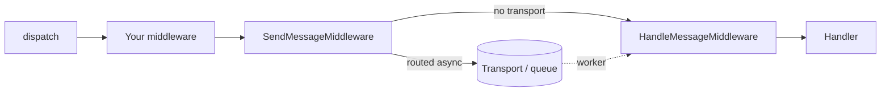
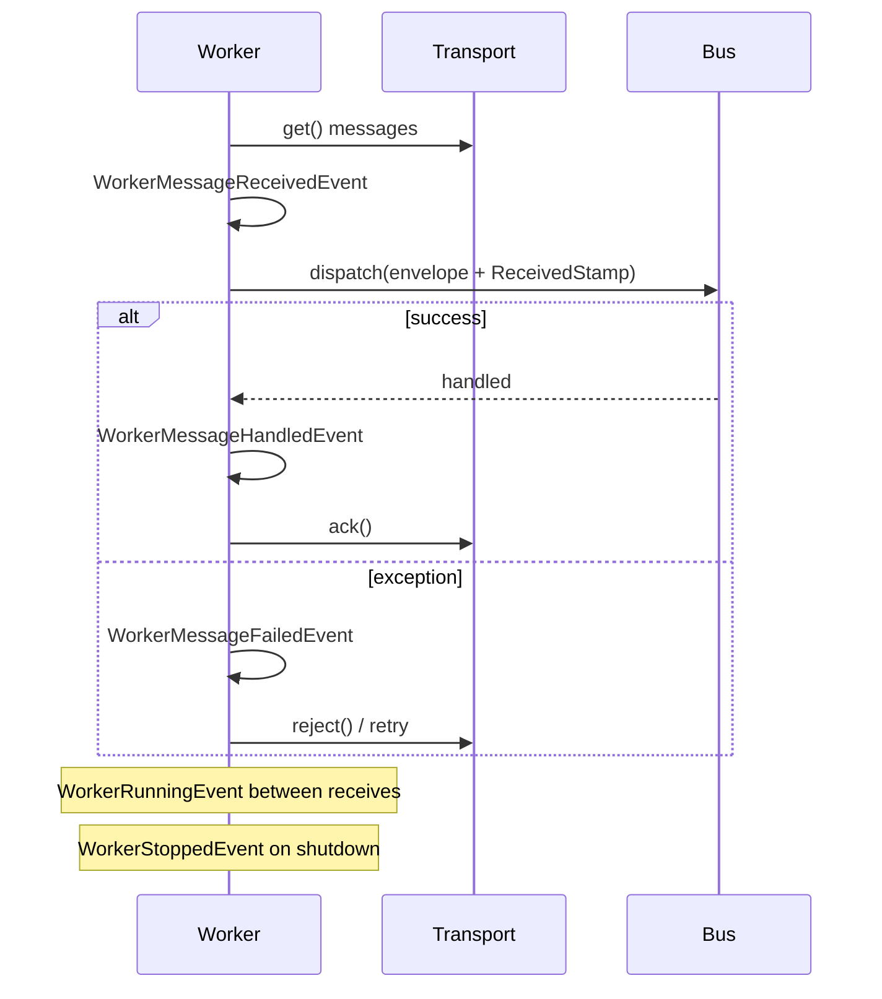
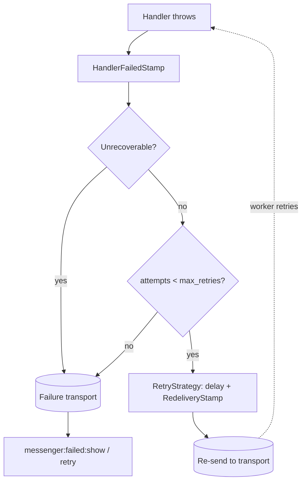

# Messenger Component

!!! tip "In a nutshell"
    Messenger sends plain PHP objects (messages) through a bus to handlers, so
    slow work runs later in a background worker instead of during the request.
    Exam gold: `dispatch()` returns an **`Envelope`** (never the handler's value),
    and once a message is routed to a transport `SendMessageMiddleware` **stops**
    the bus so the handler runs in the worker, not in-process.

!!! abstract "Learning objectives"
    By the end of this chapter you can:

    - [ ] Model a message + handler with `#[AsMessageHandler]` and dispatch it via `MessageBusInterface`.
    - [ ] Explain the **middleware pipeline**, envelopes and the most important **stamps**.
    - [ ] Configure **transports**, route messages, and reason about sync vs async delivery.
    - [ ] Trace the `messenger:consume` **worker lifecycle** and its dispatched events.
    - [ ] Configure **retries** and the **failure transport**, and use `DispatchAfterCurrentBusStamp`.

    **Syllabus:** `Miscellaneous → Messenger` ·
    **Level:** Expert ·
    **Est. time:** 75 min ·
    **Prerequisites:** [DI & Tags](../dependency-injection/index.md), [Console](../console/index.md), [Events](../architecture/events.md)

---

## Theory

Messenger lets you send **messages** through a **message bus**; the bus runs them
through a **middleware** stack and finally calls one or more **handlers**. A
message is any plain PHP object (a DTO). Nothing is coupled to HTTP — the same
message can be handled **synchronously** in-process or **asynchronously** by a
background **worker** consuming from a **transport** (queue).

The three roles you write:

| Role | What it is |
|---|---|
| **Message** | A plain, serializable PHP object carrying intent/data |
| **Handler** | A callable/invokable service that acts on one message type |
| **Bus** | `MessageBusInterface::dispatch()` — entry point that returns an `Envelope` |

Everything travelling through the bus is wrapped in an **`Envelope`** decorated
with **stamps** (metadata: which transport, when to deliver, results, retry
count…).

## Deep Dive — how it works internally

### The core classes

| Role | FQCN |
|---|---|
| Bus contract | `Symfony\Component\Messenger\MessageBusInterface` |
| Default bus | `Symfony\Component\Messenger\MessageBus` |
| Envelope | `Symfony\Component\Messenger\Envelope` |
| Stamp marker | `Symfony\Component\Messenger\Stamp\StampInterface` |
| Handler attribute | `Symfony\Component\Messenger\Attribute\AsMessageHandler` |
| Middleware contract | `Symfony\Component\Messenger\Middleware\MiddlewareInterface` |
| Middleware stack | `Symfony\Component\Messenger\Middleware\StackInterface` |
| Handle middleware | `Symfony\Component\Messenger\Middleware\HandleMessageMiddleware` |
| Send middleware | `Symfony\Component\Messenger\Middleware\SendMessageMiddleware` |
| Transport contract | `Symfony\Component\Messenger\Transport\TransportInterface` |
| Serializer contract | `Symfony\Component\Messenger\Transport\Serialization\SerializerInterface` |
| Worker | `Symfony\Component\Messenger\Worker` |

### The dispatch pipeline

`MessageBus::dispatch()` wraps the message in an `Envelope` (unless already one)
and pushes it through an **ordered middleware stack**. Each middleware calls
`$stack->next()->handle($envelope, $stack)`, so the stack is a **russian-doll**
chain: middleware can act before *and* after the rest of the pipeline.



The two pivotal built-in middlewares run near the end:

1. **`SendMessageMiddleware`** — if the message is **routed to a transport**, it
   adds a `SentStamp`, serializes and sends the envelope, then **stops** the
   pipeline (the handler is *not* called in this process). If routed only to
   `sync` (or not routed), it passes through.
2. **`HandleMessageMiddleware`** — locates handlers for the message type and
   invokes them, adding a `HandledStamp` per handler with the return value.

!!! note "Source reference"
    `Symfony\Component\Messenger\MessageBus::dispatch()` and the middleware in
    `.../Middleware/` —
    [symfony/symfony `8.0`](https://github.com/symfony/symfony/blob/8.0/src/Symfony/Component/Messenger/MessageBus.php).

### Buses: command, query, event

Messenger ships **one** default bus (`messenger.bus.default`) but you can define
several. Convention (not enforced by the component) uses three:

- **Command bus** — one handler, no return value, often async.
- **Query bus** — exactly one handler, returns a result (read via the
  `HandledStamp`).
- **Event bus** — zero-to-many handlers, fire-and-forget.

Each bus is an independent `MessageBus` with its **own middleware list**, so a
command bus can wrap handlers in a Doctrine transaction while an event bus does
not.

### Envelopes & stamps

An `Envelope` is immutable: `with()` returns a *new* envelope with an added
stamp; `last(StampClass::class)` reads the most recent stamp of a type. Key
stamps:

| Stamp | Purpose |
|---|---|
| `Stamp\SentStamp` | Marks the message was sent to a transport (async) |
| `Stamp\HandledStamp` | Carries a handler's return value + handler name |
| `Stamp\DelayStamp` | Delay delivery by N **milliseconds** |
| `Stamp\ReceivedStamp` | Set by the worker after receiving from a transport |
| `Stamp\BusNameStamp` | Records which bus dispatched it |
| `Stamp\TransportMessageIdStamp` | Broker-assigned message id |
| `Stamp\DispatchAfterCurrentBusStamp` | Defer dispatch until the current handling finishes |
| `Stamp\HandlerFailedStamp` | Wraps exceptions thrown by handlers |
| `Stamp\RedeliveryStamp` | Retry bookkeeping (attempt count, error) |

```php
<?php
declare(strict_types=1);

use Symfony\Component\Messenger\Envelope;
use Symfony\Component\Messenger\MessageBusInterface;
use Symfony\Component\Messenger\Stamp\DelayStamp;
use Symfony\Component\Messenger\Stamp\HandledStamp;

/** @var MessageBusInterface $bus */
$envelope = $bus->dispatch(new SendReminder(userId: 42), [
    new DelayStamp(5_000), // deliver 5 s later (milliseconds!)
]);

// Read a query-bus result:
$result = $envelope->last(HandledStamp::class)?->getResult();
```

### Transports & the serializer

A **transport** is defined by a **DSN** and implements `TransportInterface`
(a receiver + sender). Built-in transport families (framework-bundle):

| DSN scheme | Transport |
|---|---|
| `sync://` | In-memory, handled immediately in the same process |
| `doctrine://` | Database table acting as a queue |
| `amqp://` | RabbitMQ / AMQP broker |
| `redis://` | Redis streams |
| `in-memory://` | Test transport, keeps messages in memory |

By default the **PHP serializer** (`Transport\Serialization\PhpSerializer`)
`serialize()`s the envelope. The **Symfony Serializer** transport serializer is
recommended for interop across languages/apps.

### Worker lifecycle

`messenger:consume <transport>` builds a `Worker` that loops: **receive → push
through the bus (with `ReceivedStamp`) → ack on success / reject on failure**.
Events dispatched around each step:



Worker events (namespace `Symfony\Component\Messenger\Event\`):
`WorkerStartedEvent`, `WorkerMessageReceivedEvent`, `WorkerMessageHandledEvent`,
`WorkerMessageFailedEvent`, `WorkerRunningEvent`, `WorkerStoppedEvent`,
`WorkerRateLimitedEvent`.

!!! note "Source reference"
    `Symfony\Component\Messenger\Worker::run()` —
    [symfony/symfony `8.0`](https://github.com/symfony/symfony/blob/8.0/src/Symfony/Component/Messenger/Worker.php).

### Retries & the failure transport

When a handler throws, `HandleMessageMiddleware` wraps the error in a
`HandlerFailedStamp`. The worker's retry logic (a `RetryStrategyInterface`,
default `MultiplierRetryStrategy`) decides whether to **retry**: it re-sends the
envelope with a `RedeliveryStamp` and an exponential delay. Once `max_retries`
is exhausted, the envelope is sent to the configured **failure transport**,
inspected with `messenger:failed:show` and retried with
`messenger:failed:retry`.

Throwing `UnrecoverableMessageHandlingException` skips retries entirely and goes
straight to the failure transport.



### Dispatch-after-current-bus

Adding `DispatchAfterCurrentBusStamp` to a message dispatched *inside* a handler
defers its delivery until the **current** message finishes handling
successfully. This prevents dispatching an "email confirmation" event before the
surrounding database transaction commits.

## Configuration & code

=== "PHP Attributes"

    ```php
    <?php
    declare(strict_types=1);

    namespace App\Message;

    final readonly class SendReminder
    {
        public function __construct(public int $userId) {}
    }
    ```

    ```php
    <?php
    declare(strict_types=1);

    namespace App\MessageHandler;

    use App\Message\SendReminder;
    use Symfony\Component\Messenger\Attribute\AsMessageHandler;

    #[AsMessageHandler]
    final class SendReminderHandler
    {
        public function __invoke(SendReminder $message): void
        {
            // ... do the work; runs in the worker when routed async
        }
    }
    ```

=== "YAML"

    ```yaml
    # config/packages/messenger.yaml
    framework:
        messenger:
            failure_transport: failed
            transports:
                async:
                    dsn: '%env(MESSENGER_TRANSPORT_DSN)%'
                    retry_strategy:
                        max_retries: 3
                        delay: 1000
                        multiplier: 2
                failed: 'doctrine://default?queue_name=failed'
                sync: 'sync://'
            routing:
                'App\Message\SendReminder': async
    ```

=== "Console"

    ```console
    $ php bin/console messenger:consume async -vv --limit=10 --time-limit=3600
    $ php bin/console messenger:failed:show
    $ php bin/console messenger:failed:retry
    $ php bin/console messenger:stop-workers
    ```

## Best practices & anti-patterns

| ✅ Do | ❌ Avoid |
|---|---|
| Keep messages small, serializable, immutable DTOs | Passing entities or closures in a message |
| Route slow/side-effecting work to an async transport | Doing email/HTTP work synchronously in the request |
| Use `--limit`/`--time-limit` + a supervisor to recycle workers | Long-lived workers that leak memory forever |
| Configure a `failure_transport` and monitor it | Silently losing messages on failure |
| Use `DispatchAfterCurrentBusStamp` for post-commit events | Dispatching events mid-transaction |

## When (not) to use it / alternatives

Use Messenger when work can be **deferred, retried or decoupled** (emails,
webhooks, video processing, cross-service events). For work that must complete
before the response, route it to `sync://` (still gets middleware + handler
discovery) or call a service directly. `kernel.terminate` is a lighter
after-response hook when you don't need durability or retries.

!!! danger "Certification traps"
    - `DelayStamp` is in **milliseconds**, not seconds.
    - When a message is **routed to a transport**, `SendMessageMiddleware`
      **stops** the bus — the handler does **not** run in the dispatching process.
    - A **query** result is read from the `HandledStamp` via
      `$envelope->last(HandledStamp::class)->getResult()`, not returned by `dispatch()`.
    - `dispatch()` returns an **`Envelope`**, never the handler's value directly.
    - `sync://` still runs the full middleware pipeline — it is not "no bus".
    - Exhausted retries go to the **failure transport**; throwing
      `UnrecoverableMessageHandlingException` skips retries.

!!! warning "Common mistakes"
    - Forgetting `#[AsMessageHandler]` (or the handler `use` import) so no handler is found → `NoHandlerForMessageException`.
    - Assuming a handler runs immediately when the message is routed async.
    - Confusing `WorkerMessageHandledEvent` (success) with `WorkerMessageFailedEvent`.

## Exercises

1. **(Expert)** Route `App\Message\SendReminder` to an `async` transport with 5
   retries and a 2× multiplier, then consume it with a 1-hour time limit.
2. **(Expert)** Given a query message, write the code that dispatches it and
   extracts the handler's return value.
3. **(Expert)** Explain why an "order placed" email dispatched inside an order
   handler should carry `DispatchAfterCurrentBusStamp`.

??? success "Solutions"

    **1.** Set `retry_strategy: { max_retries: 5, multiplier: 2 }` on the `async`
    transport and route the message to it (see YAML above); run
    `php bin/console messenger:consume async --time-limit=3600`.

    **2.**
    ```php
    <?php
    declare(strict_types=1);

    use Symfony\Component\Messenger\MessageBusInterface;
    use Symfony\Component\Messenger\Stamp\HandledStamp;

    /** @var MessageBusInterface $queryBus */
    $envelope = $queryBus->dispatch(new GetInvoiceTotal(orderId: 7));
    $total = $envelope->last(HandledStamp::class)?->getResult();
    ```

    **3.** The email should only be sent if the order actually persists. With the
    stamp, the message is dispatched **after** the current handler finishes
    successfully, so a rollback prevents a misleading confirmation email.

## Certification questions

??? question "Q1. What does `MessageBusInterface::dispatch()` return?"
    - [ ] A. The handler's return value
    - [x] B. An `Envelope` ✅
    - [ ] C. `void`

    **Why:** `dispatch()` always returns the (possibly stamped) `Envelope`; the
    result lives in a `HandledStamp`. **Ref:** [Messenger](https://symfony.com/doc/current/messenger.html).

??? question "Q2. A message is routed to an async transport. During `dispatch()`, the handler…"
    - [x] A. does not run — `SendMessageMiddleware` sends it and stops the bus ✅
    - [ ] B. runs immediately, then is also queued
    - [ ] C. runs only if the transport is `sync`

    **Why:** For async transports the message is serialized and enqueued; a worker
    handles it later. **Ref:** [Messenger transports](https://symfony.com/doc/current/messenger.html#transports-async-queued-messages).

??? question "Q3. `DelayStamp(5000)` delays delivery by…"
    - [ ] A. 5000 seconds
    - [x] B. 5000 milliseconds (5 s) ✅
    - [ ] C. 5000 microseconds

    **Why:** `DelayStamp` takes milliseconds. **Ref:** [Delaying messages](https://symfony.com/doc/current/messenger.html#delaying-messages).

??? question "Q4. After retries are exhausted, a failing message goes to…"
    - [x] A. the configured failure transport ✅
    - [ ] B. the sync transport
    - [ ] C. the dead PHP error log only

    **Why:** `failure_transport` stores permanently-failed messages for
    inspection/retry. **Ref:** [Failure transport](https://symfony.com/doc/current/messenger.html#saving-retrying-failed-messages).

??? question "Q5. Which middleware invokes the handler?"
    - [ ] A. `SendMessageMiddleware`
    - [x] B. `HandleMessageMiddleware` ✅
    - [ ] C. `ValidationMiddleware`

    **Why:** `HandleMessageMiddleware` resolves handlers and calls them, adding a
    `HandledStamp`. **Ref:** [Messenger middleware](https://symfony.com/doc/current/messenger.html#middleware).

??? question "Q6. How do you skip retries and send straight to the failure transport?"
    - [x] A. Throw `UnrecoverableMessageHandlingException` ✅
    - [ ] B. Return `false` from the handler
    - [ ] C. Add a `DelayStamp(0)`

    **Why:** That exception marks the failure as non-retryable. **Ref:** [Retries & failures](https://symfony.com/doc/current/messenger.html#retries-failures).

## Key takeaways

- Message (DTO) → bus → middleware stack → handler; everything wrapped in an `Envelope` + stamps.
- `SendMessageMiddleware` (routes/sends) and `HandleMessageMiddleware` (calls handlers) are the pivots.
- Transports are DSN-configured: `sync`, `doctrine`, `amqp`, `redis`, `in-memory`.
- Worker loops receive→dispatch→ack/reject and fires `WorkerMessage*` events.
- Retries use `RedeliveryStamp` + a `RetryStrategy`; exhausted → failure transport.

## Last-minute revision

!!! tip "Cheat sheet"
    - `#[AsMessageHandler]` on an `__invoke(MessageType $m)` service.
    - `dispatch($msg, [$stamps]): Envelope` — result via `->last(HandledStamp::class)->getResult()`.
    - `DelayStamp` = **milliseconds**. Routed async ⇒ handler skipped in-process.
    - Consume: `messenger:consume <transport> --limit --time-limit --memory-limit`.
    - Failure: `messenger:failed:show|retry|remove`; `UnrecoverableMessageHandlingException` = no retry.
    - Events: `WorkerStarted/MessageReceived/MessageHandled/MessageFailed/Running/Stopped`.

## Official References
- [Official docs — Messenger](https://symfony.com/doc/current/messenger.html)
- [Official docs — Messenger: sync & queued](https://symfony.com/doc/current/messenger.html#transports-async-queued-messages)
- [Symfony source — MessageBus](https://github.com/symfony/symfony/blob/8.0/src/Symfony/Component/Messenger/MessageBus.php)
- [Symfony source — Worker](https://github.com/symfony/symfony/blob/8.0/src/Symfony/Component/Messenger/Worker.php)
- [Symfony source — Stamps](https://github.com/symfony/symfony/tree/8.0/src/Symfony/Component/Messenger/Stamp)

---

<small>Related: [Mailer](mailer.md) · [Console](../console/index.md) · [Events](../architecture/events.md) · [Serializer](serializer.md)</small>
