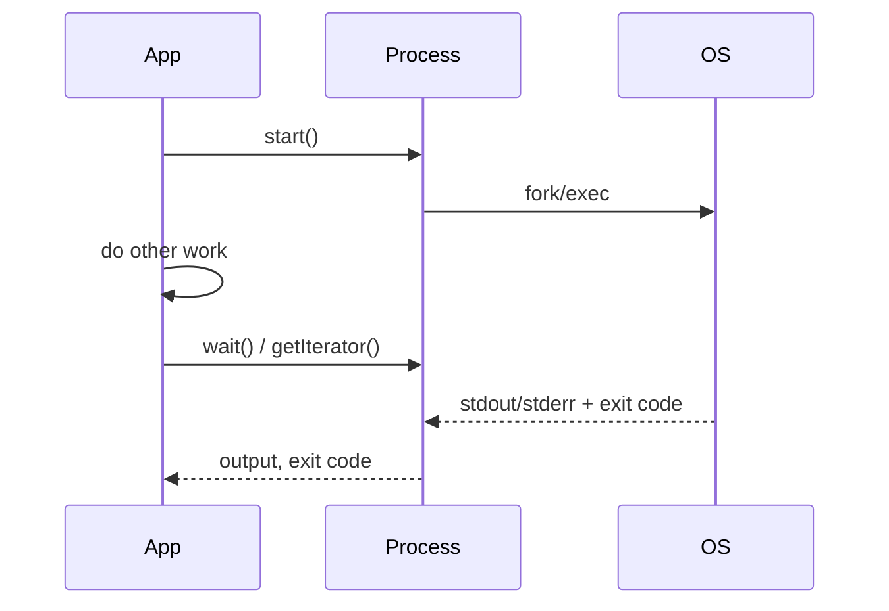

# Process Component

!!! tip "In a nutshell"
    Process exécute des commandes OS dans des sous-processus, proprement et sur
    toutes les plateformes. Construisez-le avec un tableau d'arguments pour que
    chacun soit auto-échappé, puis `run()` (bloquant) ou `start()`/`wait()`
    (asynchrone). Or de l'examen : `fromShellCommandline()` n'est PAS échappé
    (risque d'injection), et le timeout par défaut est de 60 secondes.

!!! example "Real-world analogy"
    Process, c'est **confier une course à un assistant**. Écrire la commande
    sous forme de tableau met **chaque mot dans son propre sac étiqueté**
    (auto-échappé, aucune mauvaise lecture) — au lieu de lui crier une seule
    chaîne shell qu'il pourrait mal interpréter (`fromShellCommandline`). Soit
    il part faire la course pendant que vous attendez (`run()`), soit il s'en va
    pendant que vous continuez à travailler et vous vérifiez plus tard
    (`start()`/`wait()`), puis il rapporte ce qui a été dit (stdout) et si tout
    s'est bien passé (exit code).

!!! abstract "Learning objectives"
    À la fin de ce chapitre, vous saurez :

    - [ ] Exécuter un sous-processus avec `Process` et lire la sortie/l'exit code.
    - [ ] Choisir entre `run()` et `start()`/`wait()` et streamer la sortie.
    - [ ] Définir des timeouts et gérer `ProcessFailedException` ; éviter les pièges du shell.

    **Syllabus:** `Miscellaneous → Process` ·
    **Level:** Advanced ·
    **Est. time:** 30 min ·
    **Prerequisites:** [Console](../console/index.md)

---

## Pour les nuls

### L'idée en une phrase
Construis toujours une commande shell avec un tableau d'arguments — chaque élément est automatiquement échappé, ce qu'une simple chaîne shell n'offre jamais.

### Imagine dans la vraie vie
Process, c'est **confier une course à un assistant**. Écrire la commande sous forme de tableau met **chaque mot dans son propre sac étiqueté** (auto-échappé, rien de mal interprété) — contre aboyer une seule chaîne shell qu'il pourrait mal interpréter.

### Dans Symfony
```php
new Process(['ls', '-la', $dossierUtilisateur]); // sûr même si $dossierUtilisateur contient des espaces ou `;`
```

### Exemple simple
```php
$process = new Process(['git', 'log', '--oneline']);
$process->run();
echo $process->getOutput();
```

### Comment le mémoriser 🧠
`fromShellCommandline()` n'échappe **rien** — c'est un risque d'injection de commande si tu y insères une valeur utilisateur. Préfère toujours le constructeur avec un tableau d'arguments.

---


## Theory

Le composant Process exécute des commandes OS dans des sous-processus,
proprement et sur toutes les plateformes. Construisez
`Symfony\Component\Process\Process` avec un **tableau d'arguments** (chacun
auto-échappé), puis exécutez de manière synchrone ou asynchrone et inspectez
l'exit code, stdout et stderr.

```php
use Symfony\Component\Process\Process;

$process = new Process(['ls', '-la']); // array form: each argument auto-escaped
$process->run();                       // blocking; returns the exit code

$process->isSuccessful();              // true when exit code === 0
$process->getOutput();                 // stdout
$process->getErrorOutput();            // stderr
```

## Deep Dive — how it works internally

!!! question "Predict first"
    `Process::fromShellCommandline("git log $userInput")` s'exécute avec un
    `$userInput` contrôlé par un attaquant. Quel est le risque, et
    `new Process(['git', 'log', $userInput])` se comporterait-il de la même
    façon ?

??? note "Reveal"
    La forme shell est une **injection de commande** — elle passe par `/bin/sh`
    sans échappement. La forme tableau auto-échappe chaque élément, donc
    `$userInput` devient un seul argument littéral, pas de la syntaxe shell.
    Préférez le constructeur en tableau pour toute entrée non fiable.

### Two ways to construct

- `new Process(['git', 'log', '--oneline'])` — la forme tableau. Chaque élément
  est un argument séparé, **automatiquement échappé**. Préférez-la.
- `Process::fromShellCommandline('echo "$FOO"')` — une chaîne shell brute
  exécutée via `/bin/sh`. Elle prend en charge les fonctionnalités du shell
  (pipes, redirections, expansion de variables) mais l'échappement est à votre
  charge — **risque d'injection de commande** si vous interpolez une entrée non
  fiable.

```php
// Array form — auto-escaped, safe with untrusted input
$safe = new Process(['git', 'log', $userInput]); // $userInput = one literal argument

// Shell string — runs through /bin/sh, NOT escaped (pipes work, injection risk)
$shell = Process::fromShellCommandline('git log | head -n 5');
```

### Sync vs async

- `run(?callable $callback = null): int` — démarre et **bloque** jusqu'à la fin
  du processus, en retournant l'exit code. Un callback optionnel reçoit les
  fragments de sortie au fil de l'eau.
- `start(?callable $callback = null): void` puis `wait()` — démarre le processus
  en mode **non bloquant** ; faites autre chose et appelez `wait()` (ou
  interrogez `isRunning()`) plus tard.
- `mustRun()` — comme `run()` mais lève
  `Symfony\Component\Process\Exception\ProcessFailedException` sur un exit
  non nul.

```php
// Blocking: run() returns the exit code once the process ends
$exitCode = $process->run();

// Non-blocking: start(), keep working, then wait() (or poll isRunning())
$process->start();
while ($process->isRunning()) {
    // ... do other work ...
}
$process->wait();

// mustRun(): like run() but throws ProcessFailedException on non-zero exit
$other = new Process(['pg_dump', 'app']);
$other->mustRun();
```



### Reading output

`getOutput()` / `getErrorOutput()` retournent les buffers complets ;
`getIncrementalOutput()` ne retourne que les nouvelles données depuis le dernier
appel. `getIterator()` streame les fragments de sortie de manière lazy (idéal
pour les commandes longues / les sorties volumineuses, sans tout mettre en
mémoire). `getExitCode()` retourne le code ; `isSuccessful()` équivaut à
`code === 0`.

```php
$process->getOutput();            // full stdout buffer
$process->getErrorOutput();       // full stderr buffer
$process->getIncrementalOutput(); // only what is new since the last call
$process->getExitCode();          // int (null while still running)
$process->isSuccessful();         // exit code === 0

foreach ($process->getIterator() as $type => $chunk) {
    echo $chunk;                  // streamed lazily, no full buffering
}
```

### Timeouts

`setTimeout(float $seconds)` limite la durée totale d'exécution ;
`setIdleTimeout()` limite le temps sans sortie. Dépasser l'un ou l'autre lève
`Symfony\Component\Process\Exception\ProcessTimedOutException`. **Vous devez
appeler `checkTimeout()` périodiquement** dans une boucle asynchrone, ou
utiliser `wait()`/`run()` qui vérifient pour vous. Le timeout par défaut est de
60 s ; `setTimeout(null)` le désactive.

```php
$process->setTimeout(120);     // max total runtime in seconds (default 60)
$process->setIdleTimeout(10);  // max seconds without any new output
// $process->setTimeout(null); // disables the timeout entirely

$process->start();
while ($process->isRunning()) {
    $process->checkTimeout();  // throws ProcessTimedOutException when exceeded
    usleep(100_000);
}
```

!!! note "Source reference"
    `Symfony\Component\Process\Process` —
    [symfony/symfony `8.0`](https://github.com/symfony/symfony/blob/8.0/src/Symfony/Component/Process/Process.php).

## Configuration & code

=== "PHP Attributes"

    ```php
    <?php
    declare(strict_types=1);

    namespace App\Service;

    use Symfony\Component\Process\Exception\ProcessFailedException;
    use Symfony\Component\Process\Process;

    final class Backup
    {
        public function dump(string $target): string
        {
            $process = new Process(['pg_dump', '--file', $target, 'app']);
            $process->setTimeout(120);
            $process->run();

            if (!$process->isSuccessful()) {
                throw new ProcessFailedException($process);
            }

            return $process->getOutput();
        }
    }
    ```

=== "Console"

    ```console
    $ php bin/console app:backup   # a command wrapping the Process above
    ```

=== "YAML"

    ```yaml
    # No YAML config: Process is instantiated in code, not a service you configure.
    ```

## Best practices & anti-patterns

| ✅ Do | ❌ Avoid |
|---|---|
| Utiliser le constructeur en **tableau** (auto-échappement) | Construire des chaînes shell à partir d'entrées utilisateur |
| Définir un `setTimeout()` explicite | Se reposer silencieusement sur le défaut de 60 s |
| Streamer avec `getIterator()` pour les sorties volumineuses | Mettre des gigaoctets en buffer avec `getOutput()` |
| Utiliser `mustRun()`/`ProcessFailedException` pour le flux de contrôle | Ignorer les exit codes non nuls |

## When (not) to use it / alternatives

Utilisez Process pour les outils CLI que vous devez invoquer (traitement
d'images, git, dumps). Pour le travail à différer/réessayer, dispatchez un
message [Messenger](../messenger/index.md) au lieu de bloquer la request. N'utilisez
jamais `fromShellCommandline` avec une entrée non fiable.

!!! danger "Certification traps"
    - Les arguments en tableau sont **auto-échappés** ; `fromShellCommandline` ne l'est **pas** — risque d'injection.
    - `run()` bloque ; `start()` retourne immédiatement et nécessite `wait()`.
    - Le timeout par défaut est de **60 secondes** ; `null` le désactive.
    - `mustRun()` lève `ProcessFailedException` en cas d'échec ; `run()` retourne le code.
    - Dans les boucles asynchrones, vous devez appeler `checkTimeout()` vous-même.

!!! warning "Common mistakes"
    - Passer une commande entière comme un seul élément du tableau (`['git log']`) au lieu de `['git', 'log']`.
    - Oublier que `getOutput()` met tout en buffer en mémoire.

## Exercises

1. **(Advanced)** Exécutez `pg_dump` avec un timeout de 120 s et levez une exception en cas d'échec.
2. **(Advanced)** Streamez la sortie d'une commande longue ligne par ligne sans
   tout mettre en buffer.

??? success "Solutions"

    **1.** Voir `Backup::dump()` ci-dessus.

    **2.**
    ```php
    <?php
    declare(strict_types=1);

    use Symfony\Component\Process\Process;

    $p = new Process(['tail', '-f', '/var/log/app.log']);
    $p->setTimeout(null);
    $p->start();
    foreach ($p as $type => $chunk) {
        echo $chunk; // streamed as it arrives
    }
    ```

## Certification questions

??? question "Q1. Which constructor auto-escapes each argument?"
    - [x] A. `new Process(['ls', '-la'])` ✅
    - [ ] B. `Process::fromShellCommandline('ls -la')`
    - [ ] C. both equally

    **Why:** La forme tableau échappe chaque élément ; la forme shell ne le fait pas.
    **Ref:** [Process](https://symfony.com/doc/8.0/components/process.html).

??? question "Q2. What does `run()` return?"
    - [x] A. The process exit code ✅
    - [ ] B. The stdout string
    - [ ] C. `void`

    **Why:** `run()` retourne l'exit code entier ; utilisez `getOutput()` pour stdout.
    **Ref:** [Process](https://symfony.com/doc/8.0/components/process.html#usage).

??? question "Q3. The default process timeout is…"
    - [x] A. 60 seconds ✅
    - [ ] B. unlimited
    - [ ] C. 30 seconds

    **Why:** Le défaut est de 60 s ; passez `null` pour le désactiver. **Ref:** [Process timeout](https://symfony.com/doc/8.0/components/process.html#process-timeout).

## Key takeaways

- Préférez le constructeur en tableau (auto-échappé) à `fromShellCommandline`.
- `run()` bloque ; `start()`+`wait()` est asynchrone ; `mustRun()` lève une exception en cas d'échec.
- Lisez via `getOutput()`, `getIncrementalOutput()`, ou streamez avec `getIterator()`.
- Timeout par défaut de 60 s ; `ProcessTimedOutException` / `ProcessFailedException`.

## Last-minute revision

!!! tip "Cheat sheet"
    - `new Process([...])` vs `Process::fromShellCommandline('...')` (dangereux avec des entrées).
    - `run(): int`, `start()`/`wait()`, `mustRun()`.
    - `getOutput()`, `getErrorOutput()`, `getExitCode()`, `isSuccessful()`, `getIterator()`.
    - `setTimeout(120)` / `setIdleTimeout()` / 60 s par défaut.

## Connections

- **Depends on:** [Console](../console/index.md) — les commandes enveloppent fréquemment `Process` pour invoquer le shell.
- **Reused in:** [Messenger](../messenger/index.md) — différez/réessayez un long travail shell sous forme de message ; [Filesystem & Finder](filesystem-finder.md) découvre les fichiers que vous traitez.
- **Confused with:** exécuter le travail en ligne — pour les tâches différables/réessayables, dispatchez un message au lieu de bloquer la request.

## Official References
- [Official docs — Process](https://symfony.com/doc/8.0/components/process.html)
- [Symfony source — Process](https://github.com/symfony/symfony/blob/8.0/src/Symfony/Component/Process/Process.php)

## Video references

!!! tip "Watch & learn"
    Voici des chaînes vidéo officielles, mises à jour en continu — cherchez-y
    "Symfony components" pour renforcer ce chapitre. Nous lions des chaînes stables
    plutôt que des vidéos individuelles pour que les références ne périment jamais.

    - [SymfonyCasts screencasts](https://symfonycasts.com/tracks/symfony) — des tutoriels scénarisés à suivre en codant.
    - [Symfony official YouTube](https://www.youtube.com/@SymfonyOfficial) — conférences et keynotes SymfonyCon.
    - [Official docs for this topic](https://symfony.com/doc/8.0/components/process.html) — certaines pages de la doc Symfony embarquent un screencast.

## Confidence check

Je suis prêt quand je peux :

- [ ] expliquer **pourquoi** le constructeur en tableau est plus sûr que `fromShellCommandline`
- [ ] exécuter des processus sync/async et lire la sortie/l'exit code dans Symfony 8
- [ ] déboguer un processus bloqué/tué (timeout par défaut de 60 s, `checkTimeout()` manquant)
- [ ] repérer le piège : les arguments en tableau s'auto-échappent, pas les chaînes shell ; timeout par défaut de 60 s
- [ ] décrire `run()` vs `start()`/`wait()` et le streaming avec `getIterator()`

---

<small>Related: [Console](../console/index.md) · [Messenger](../messenger/index.md) · [Lock](../appendices/out-of-syllabus/lock.md)</small>
