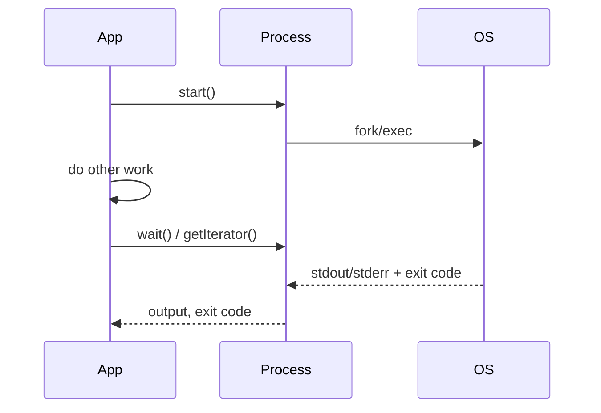

# Process Component

!!! abstract "Learning objectives"
    By the end of this chapter you can:

    - [ ] Run a subprocess with `Process` and read output/exit code.
    - [ ] Choose between `run()` and `start()`/`wait()` and stream output.
    - [ ] Set timeouts and handle `ProcessFailedException`; avoid shell pitfalls.

    **Syllabus:** `Miscellaneous → Process` ·
    **Level:** Advanced ·
    **Est. time:** 30 min ·
    **Prerequisites:** [Console](../console/index.md)

---

## Theory

The Process component runs OS commands in sub-processes cleanly across platforms.
Construct `Symfony\Component\Process\Process` with an **array of arguments**
(each auto-escaped), then run synchronously or asynchronously and inspect the
exit code, stdout and stderr.

## Deep Dive — how it works internally

### Two ways to construct

- `new Process(['git', 'log', '--oneline'])` — the array form. Each element is a
  separate, **automatically escaped** argument. Prefer this.
- `Process::fromShellCommandline('echo "$FOO"')` — a raw shell string run through
  `/bin/sh`. It supports shell features (pipes, redirections, variable
  expansion) but you are responsible for escaping — **command-injection risk** if
  you interpolate untrusted input.

### Sync vs async

- `run(?callable $callback = null): int` — starts and **blocks** until the
  process ends, returning the exit code. An optional callback receives streamed
  output chunks.
- `start(?callable $callback = null): void` then `wait()` — starts the process
  **non-blocking**; do other work and `wait()` (or poll `isRunning()`) later.
- `mustRun()` — like `run()` but throws
  `Symfony\Component\Process\Exception\ProcessFailedException` on a non-zero exit.



### Reading output

`getOutput()` / `getErrorOutput()` return the full buffers; `getIncrementalOutput()`
returns only new data since the last call. `getIterator()` streams output chunks
lazily (great for long-running commands / large output without buffering it all
in memory). `getExitCode()` returns the code; `isSuccessful()` is `code === 0`.

### Timeouts

`setTimeout(float $seconds)` limits total runtime; `setIdleTimeout()` limits time
without output. Exceeding either throws
`Symfony\Component\Process\Exception\ProcessTimedOutException`. **You must call
`checkTimeout()` periodically** in an async loop, or use `wait()`/`run()` which
check for you. Default timeout is 60 s; `setTimeout(null)` disables it.

!!! note "Source reference"
    `Symfony\Component\Process\Process` —
    [symfony/symfony `8.0`](https://github.com/symfony/symfony/blob/8.0/src/Symfony/Component/Process/Process.php).

## Configuration & code

=== "PHP Attributes"

    ```php
    <?php
    declare(strict_types=1);

    namespace App\Service;

    use Symfony\Component\Process\Exception\ProcessFailedException;
    use Symfony\Component\Process\Process;

    final class Backup
    {
        public function dump(string $target): string
        {
            $process = new Process(['pg_dump', '--file', $target, 'app']);
            $process->setTimeout(120);
            $process->run();

            if (!$process->isSuccessful()) {
                throw new ProcessFailedException($process);
            }

            return $process->getOutput();
        }
    }
    ```

=== "Console"

    ```console
    $ php bin/console app:backup   # a command wrapping the Process above
    ```

=== "YAML"

    ```yaml
    # No YAML config: Process is instantiated in code, not a service you configure.
    ```

## Best practices & anti-patterns

| ✅ Do | ❌ Avoid |
|---|---|
| Use the **array** constructor (auto-escaping) | Building shell strings from user input |
| Set an explicit `setTimeout()` | Relying on the 60 s default silently |
| Stream with `getIterator()` for large output | Buffering gigabytes with `getOutput()` |
| Use `mustRun()`/`ProcessFailedException` for control flow | Ignoring non-zero exit codes |

## When (not) to use it / alternatives

Use Process for CLI tools you must shell out to (image processing, git, dumps).
For work that should be deferred/retried, dispatch a
[Messenger](messenger.md) message instead of blocking the request. Never use
`fromShellCommandline` with untrusted input.

!!! danger "Certification traps"
    - Array args are **auto-escaped**; `fromShellCommandline` is **not** — injection risk.
    - `run()` blocks; `start()` returns immediately and needs `wait()`.
    - Default timeout is **60 seconds**; `null` disables it.
    - `mustRun()` throws `ProcessFailedException` on failure; `run()` returns the code.
    - In async loops you must call `checkTimeout()` yourself.

!!! warning "Common mistakes"
    - Passing a whole command as one array element (`['git log']`) instead of `['git', 'log']`.
    - Forgetting that `getOutput()` buffers everything in memory.

## Exercises

1. **(Advanced)** Run `pg_dump` with a 120 s timeout and throw on failure.
2. **(Advanced)** Stream a long-running command's output line-by-line without
   buffering it all.

??? success "Solutions"

    **1.** See `Backup::dump()` above.

    **2.**
    ```php
    <?php
    declare(strict_types=1);

    use Symfony\Component\Process\Process;

    $p = new Process(['tail', '-f', '/var/log/app.log']);
    $p->setTimeout(null);
    $p->start();
    foreach ($p as $type => $chunk) {
        echo $chunk; // streamed as it arrives
    }
    ```

## Certification questions

??? question "Q1. Which constructor auto-escapes each argument?"
    - [x] A. `new Process(['ls', '-la'])` ✅
    - [ ] B. `Process::fromShellCommandline('ls -la')`
    - [ ] C. both equally

    **Why:** The array form escapes each element; the shell form does not.
    **Ref:** [Process](https://symfony.com/doc/current/components/process.html).

??? question "Q2. What does `run()` return?"
    - [x] A. The process exit code ✅
    - [ ] B. The stdout string
    - [ ] C. `void`

    **Why:** `run()` returns the integer exit code; use `getOutput()` for stdout.
    **Ref:** [Process](https://symfony.com/doc/current/components/process.html#usage).

??? question "Q3. The default process timeout is…"
    - [x] A. 60 seconds ✅
    - [ ] B. unlimited
    - [ ] C. 30 seconds

    **Why:** The default is 60 s; pass `null` to disable. **Ref:** [Process timeout](https://symfony.com/doc/current/components/process.html#process-timeout).

## Key takeaways

- Prefer the array constructor (auto-escaped) over `fromShellCommandline`.
- `run()` blocks; `start()`+`wait()` is async; `mustRun()` throws on failure.
- Read via `getOutput()`, `getIncrementalOutput()`, or stream with `getIterator()`.
- Default 60 s timeout; `ProcessTimedOutException` / `ProcessFailedException`.

## Last-minute revision

!!! tip "Cheat sheet"
    - `new Process([...])` vs `Process::fromShellCommandline('...')` (unsafe with input).
    - `run(): int`, `start()`/`wait()`, `mustRun()`.
    - `getOutput()`, `getErrorOutput()`, `getExitCode()`, `isSuccessful()`, `getIterator()`.
    - `setTimeout(120)` / `setIdleTimeout()` / default 60 s.

## References

- [Official docs — Process](https://symfony.com/doc/current/components/process.html)
- [Symfony source — Process](https://github.com/symfony/symfony/blob/8.0/src/Symfony/Component/Process/Process.php)

---

<small>Related: [Console](../console/index.md) · [Messenger](messenger.md) · [Lock](lock.md)</small>
