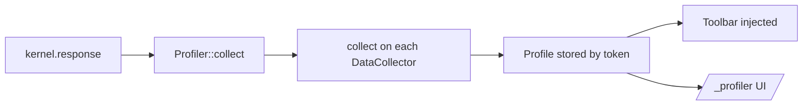

# Web Profiler & Data Collectors

!!! tip "In a nutshell"
    Le profiler stocke un profil par request (temps, requêtes SQL, logs) alimenté
    par des data collectors et affiche la debug toolbar. À retenir pour l'examen :
    la collecte a lieu sur `kernel.response` (les late collectors à terminate),
    `$this->data` doit être sérialisable, et c'est un outil réservé au dev,
    désactivé en prod.

!!! example "Real-world analogy"
    Le profiler est la boîte noire d'un avion. Tout au long de chaque vol (request),
    un ensemble de capteurs (les data collectors) relève les temps, la consommation de
    carburant, les requêtes et les events, et l'enregistreur écrit un instantané par vol
    à un moment fixe, proche de l'atterrissage (sur `kernel.response`). Ce qu'il stocke
    doit être de simples relevés enregistrés, pas du câblage vivant — la valeur d'une
    jauge dérivée, jamais le capteur lui-même (les données doivent être sérialisables).
    Les enquêteurs peuvent ensuite retrouver n'importe quel vol par son immatriculation
    pour le rejouer (`/_profiler/{token}`), et toute cette instrumentation lourde est
    retirée de l'avion de production, plus léger.

!!! abstract "Learning objectives"
    À la fin de ce chapitre, vous saurez :

    - [ ] Expliquer l'architecture profiler/toolbar et le moment où les données sont collectées.
    - [ ] Construire un `DataCollectorInterface` personnalisé + son panneau de template.
    - [ ] Désactiver le profiler en prod et raisonner sur son surcoût.

    **Syllabus:** `Miscellaneous → Web Profiler` ·
    **Level:** Advanced ·
    **Est. time:** 35 min ·
    **Prerequisites:** [Request Handling](../architecture/request-handling.md)

---

## Theory

Le **Web Profiler** stocke un **profil** par request — temps, requêtes DB, logs,
events, sécurité, cache — et affiche la **Web Debug Toolbar** en bas des
responses HTML. Chaque panneau est alimenté par un **data collector**. C'est un
outil de développement, désactivé en prod. (Pour exploiter les profils dans les
tests, voir [The Profiler Object](../testing/profiler.md).)

## Deep Dive — how it works internally

!!! question "Predict first"
    Votre collector personnalisé stocke la connexion PDO vivante dans `$this->data`
    pour que le panneau puisse l'interroger. La request échoue avec une erreur de
    sérialisation. Pourquoi ?

??? note "Reveal"
    Les profils sont **sérialisés** vers le stockage (clonés via VarDumper). Une
    connexion/ressource PDO vivante n'est pas sérialisable. Stockez plutôt des
    instantanés scalaires/tableaux — exactement les données que le panneau affichera.

### Collection lifecycle

Les `Symfony\Bundle\FrameworkBundle`/`WebProfilerBundle` enregistrent un
`Symfony\Component\HttpKernel\Profiler\Profiler` et un listener sur
`kernel.response`. Chaque collector enregistré implémente
`Symfony\Component\HttpKernel\DataCollector\DataCollectorInterface` :

```php
public function collect(Request $request, Response $response, ?\Throwable $exception = null): void;
public function getName(): string;
public function reset(): void;
```

Sur `kernel.response`, `Profiler::collect()` appelle le `collect()` de chaque
collector ; le `Profile` résultant (un ensemble de collectors avec leur
`$this->data`) est sauvegardé dans un backend de stockage
(`FileProfilerStorage` par défaut), indexé par un token. La toolbar est injectée
dans le HTML par `WebDebugToolbarListener` (une sub-request la rend). L'interface
complète du profiler à `/_profiler/{token}` lit les profils stockés.

```php
// kernel.response: Profiler::collect() runs every collector's collect(),
// then the Profile ($this->data of all collectors) is saved by
// FileProfilerStorage under a token (the toolbar link you see).
$profile = $profiler->loadProfile($token);          // what /_profiler/{token} reads
$collector = $profile->getCollector('app.tenant');  // one panel's data
// The toolbar itself is injected by WebDebugToolbarListener via a sub-request
```



Les collectors étendent généralement
`Symfony\Component\HttpKernel\DataCollector\DataCollector` (qui fournit un
tableau `$this->data` sérialisé via le cloner de VarDumper, afin qu'il survive
au stockage). `reset()` remet l'état à zéro entre les requests dans les workers
de longue durée.

```php
use Symfony\Component\HttpKernel\DataCollector\DataCollector;

final class ApiCallsCollector extends DataCollector
{
    public function collect(Request $request, Response $response, ?\Throwable $exception = null): void
    {
        // $this->data is cloned by VarDumper — store serializable snapshots only
        $this->data['calls'] = $this->client->getCallCount();
    }

    public function getName(): string { return 'app.api_calls'; }

    public function reset(): void
    {
        $this->data = []; // clear state between requests in long-running workers
    }
}
```

!!! note "Source reference"
    `Symfony\Component\HttpKernel\DataCollector\DataCollectorInterface` et
    `Profiler` —
    [symfony/symfony `8.0`](https://github.com/symfony/symfony/blob/8.0/src/Symfony/Component/HttpKernel/DataCollector/DataCollectorInterface.php).

### Late collectors

`LateDataCollectorInterface::lateCollect()` s'exécute plus tard (à
`kernel.terminate` via le profiler) pour les données indisponibles pendant
`kernel.response` (p. ex. la liste finale des dumps, les appels au cache).
Implémentez-la quand votre métrique n'est complète qu'après la response.

```php
use Symfony\Component\HttpKernel\DataCollector\LateDataCollectorInterface;

final class CacheStatsCollector extends DataCollector implements LateDataCollectorInterface
{
    public function collect(Request $request, Response $response, ?\Throwable $exception = null): void
    {
        // kernel.response — too early: cache calls may still happen
    }

    public function lateCollect(): void
    {
        // kernel.terminate — totals are final now
        $this->data['hits'] = $this->pool->getHits();
    }
}
```

### Custom template

Le panneau d'un collector est un template Twig étendant
`@WebProfiler/Profiler/layout.html.twig`, associé via l'attribut `template` du
tag de service `data_collector`. Il affiche le badge de la toolbar
(`block toolbar`) et le panneau (`block panel`).

```twig
{# templates/data_collector/tenant.html.twig — referenced by the
   data_collector tag's "template" attribute #}



    {# the small badge shown in the debug toolbar #}
    Tenant: {{ collector.tenant }}
    {{ include('@WebProfiler/Profiler/toolbar_item.html.twig', { link: true }) }}



    <h2>Tenant</h2>
    <p>{{ collector.tenant }}</p>

```

## Configuration & code

=== "PHP Attributes"

    ```php
    <?php
    declare(strict_types=1);

    namespace App\DataCollector;

    use Symfony\Component\HttpFoundation\Request;
    use Symfony\Component\HttpFoundation\Response;
    use Symfony\Component\HttpKernel\DataCollector\DataCollector;

    final class TenantCollector extends DataCollector
    {
        public function collect(Request $request, Response $response, ?\Throwable $exception = null): void
        {
            $this->data = ['tenant' => $request->headers->get('X-Tenant', 'none')];
        }

        public function getTenant(): string
        {
            return $this->data['tenant'];
        }

        public function getName(): string
        {
            return 'app.tenant';
        }
    }
    ```

=== "YAML"

    ```yaml
    # config/services.yaml (autoconfigure tags the collector automatically)
    services:
        App\DataCollector\TenantCollector:
            tags:
                - { name: data_collector, template: 'data_collector/tenant.html.twig', id: 'app.tenant' }
    ```

=== "Console"

    ```console
    $ php bin/console debug:container --tag=data_collector
    ```

## Best practices & anti-patterns

| ✅ Do | ❌ Avoid |
|---|---|
| Ne stocker que des données sérialisables dans `$this->data` | Conserver des objets/ressources vivants |
| Implémenter `reset()` pour la réutilisation des workers | Accumuler de l'état entre les requests |
| Utiliser `LateDataCollectorInterface` pour les données post-response | Collecter trop tôt des données incomplètes |
| Garder le profiler **désactivé** en prod | Livrer `web-profiler-bundle` en prod hors dépendances dev |

## When (not) to use it / alternatives

Ajoutez un collector personnalisé pour exposer des diagnostics propres à
l'application (tenant courant, feature flags, temps des API externes) pendant le
développement. N'activez jamais le profiler en production — il ajoute un surcoût
de stockage + mémoire et peut divulguer des données internes. Pour
l'observabilité en prod, utilisez de vraies métriques/du tracing.

!!! danger "Certification traps"
    - La collecte a lieu sur **`kernel.response`** ; les late collectors s'exécutent à terminate.
    - Le profiler est un outil de **dev** — désactivé en prod (`framework.profiler` désactivé).
    - `$this->data` doit être sérialisable (cloné via VarDumper) pour survivre au stockage.
    - Le tag `data_collector` a besoin d'un `template` pour qu'une toolbar/un panneau apparaisse.

!!! warning "Common mistakes"
    - Stocker un PDO/une entité dans `$this->data` → échec de sérialisation.
    - S'attendre à des données du profiler dans les responses de prod.

## Exercises

1. **(Advanced)** Écrivez un collector qui capture le header `X-Tenant` et exposez-le.
2. **(Advanced)** Expliquez pourquoi `$this->data` ne peut pas contenir une connexion à la base de données.

??? success "Solutions"

    **1.** Voir `TenantCollector` ci-dessus, plus le tag `data_collector` avec un template.

    **2.** Les profils sont sérialisés vers le stockage ; une connexion/ressource
    vivante n'est pas sérialisable, stockez donc des données scalaires/tableaux
    (clonables par VarDumper) à la place.

## Certification questions

??? question "Q1. When does the profiler collect data for a request?"
    - [x] A. On `kernel.response` (late collectors at terminate) ✅
    - [ ] B. On `kernel.request`
    - [ ] C. Only in the CLI

    **Why:** `Profiler::collect()` s'exécute sur l'event de response ; la collecte
    tardive à terminate. **Ref:** [Profiler](https://symfony.com/doc/8.0/profiler.html).

??? question "Q2. Which tag registers a custom data collector?"
    - [x] A. `data_collector` ✅
    - [ ] B. `kernel.collector`
    - [ ] C. `profiler.panel`

    **Why:** Le tag `data_collector` (avec un `template`) câble le collector +
    le panneau. **Ref:** [Creating a data collector](https://symfony.com/doc/8.0/profiler/data_collector.html).

??? question "Q3. Should the profiler run in production?"
    - [ ] A. Yes, for monitoring
    - [x] B. No — it is a dev tool and is disabled in prod ✅
    - [ ] C. Only for admins

    **Why:** Il ajoute un surcoût et expose les rouages internes ; gardez-le
    désactivé en prod. **Ref:** [Profiler](https://symfony.com/doc/8.0/profiler.html).

## Key takeaways

- Les collectors implémentent `DataCollectorInterface` ; les données sont stockées dans `$this->data`.
- Collecte sur `kernel.response` ; `LateDataCollectorInterface` à terminate.
- Enregistrement avec le tag `data_collector` + un template Twig de panneau.
- Réservé au dev ; désactivez-le en prod pour la performance et la sécurité.

## Last-minute revision

!!! tip "Cheat sheet"
    - `collect(Request, Response, ?Throwable)`, `getName()`, `reset()`.
    - Étendre `DataCollector` ; stocker un `$this->data` sérialisable.
    - Tag `data_collector` + `template:` ; interface du profiler à `/_profiler`.
    - `LateDataCollectorInterface::lateCollect()` pour les données post-response.

## Connections

- **Depends on:** [Request Handling](../architecture/request-handling.md) — la collecte s'accroche à `kernel.response` ; [Debugging](debugging.md) — les dumps alimentent le panneau Debug.
- **Reused in:** [The Profiler Object](../testing/profiler.md) — les tests fonctionnels lisent les profils stockés pour vérifier les requêtes/e-mails.
- **Confused with:** l'observabilité en production — le profiler est un outil réservé au dev, pas un backend de métriques.

## Official References
- [Official docs — Profiler](https://symfony.com/doc/8.0/profiler.html)
- [Official docs — Custom data collector](https://symfony.com/doc/8.0/profiler/data_collector.html)
- [Symfony source — DataCollectorInterface](https://github.com/symfony/symfony/blob/8.0/src/Symfony/Component/HttpKernel/DataCollector/DataCollectorInterface.php)

## Video references

!!! tip "Watch & learn"
    Voici des chaînes vidéo officielles, mises à jour en continu — cherchez-y
    "Symfony components" pour consolider ce chapitre. Nous lions des chaînes stables
    plutôt que des vidéos individuelles afin que les références ne périment jamais.

    - [SymfonyCasts screencasts](https://symfonycasts.com/tracks/symfony) — tutoriels scénarisés à suivre en codant.
    - [Symfony official YouTube](https://www.youtube.com/@SymfonyOfficial) — conférences et keynotes SymfonyCon.
    - [Official docs for this topic](https://symfony.com/doc/8.0/profiler.html) — certaines pages de la doc Symfony intègrent un screencast.

## Confidence check

Je suis prêt(e) quand je peux :

- [ ] expliquer **pourquoi** les profils sont stockés par request, indexés par token
- [ ] écrire un `DataCollector` + son template de panneau et le tagger dans Symfony 8
- [ ] déboguer un échec de sérialisation dû à un `$this->data` non sérialisable
- [ ] repérer le piège : collecte sur `kernel.response`, late collectors à terminate ; réservé au dev
- [ ] décrire quand utiliser `LateDataCollectorInterface`

---

<small>Related: [Debugging](debugging.md) · [The Profiler Object](../testing/profiler.md) · [Error Handling](error-handling.md)</small>
