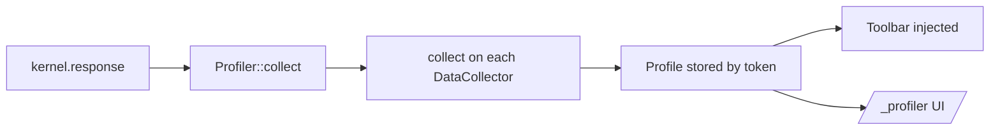

# Web Profiler & Data Collectors

!!! tip "In a nutshell"
    The profiler stores one profile per request (timing, queries, logs) fed by
    data collectors and shows the debug toolbar. Exam gold: collection happens
    on `kernel.response` (late collectors at terminate), `$this->data` must be
    serializable, and it is a dev-only tool disabled in prod.

!!! example "Real-world analogy"
    The profiler is an aircraft's flight recorder. Throughout each flight (request) a set
    of sensors (data collectors) note timings, fuel burn, queries and events, and the
    recorder writes one snapshot per flight at a fixed moment near landing (on
    `kernel.response`). What it stores must be plain recorded readings, not live wiring — a
    tapped-off gauge value, never the sensor itself (the data must be serializable).
    Investigators later pull up any flight by its tail number to replay it (`/_profiler/{token}`),
    and this heavy instrumentation is stripped out of the lightweight production aircraft.

!!! abstract "Learning objectives"
    By the end of this chapter you can:

    - [ ] Explain the profiler/toolbar architecture and when data is collected.
    - [ ] Build a custom `DataCollectorInterface` + template panel.
    - [ ] Disable the profiler in prod and reason about its overhead.

    **Syllabus:** `Miscellaneous → Web Profiler` ·
    **Level:** Advanced ·
    **Est. time:** 35 min ·
    **Prerequisites:** [Request Handling](../architecture/request-handling.md)

---

## Theory

The **Web Profiler** stores a **profile** per request — timing, DB queries, logs,
events, security, cache — and renders the **Web Debug Toolbar** at the bottom of
HTML responses. Each panel is fed by a **data collector**. It is a dev tool,
disabled in prod. (For consuming profiles in tests, see
[The Profiler Object](../testing/profiler.md).)

## Deep Dive — how it works internally

!!! question "Predict first"
    Your custom collector stores the live PDO connection in `$this->data` so the
    panel can query it. The request errors with a serialization failure. Why?

??? note "Reveal"
    Profiles are **serialized** to storage (cloned via VarDumper). A live PDO
    connection/resource isn't serializable. Store scalar/array snapshots instead —
    exactly the data the panel will render.

### Collection lifecycle

The `Symfony\Bundle\FrameworkBundle`/`WebProfilerBundle` register a
`Symfony\Component\HttpKernel\Profiler\Profiler` and a listener on
`kernel.response`. Each registered collector implements
`Symfony\Component\HttpKernel\DataCollector\DataCollectorInterface`:

```php
public function collect(Request $request, Response $response, ?\Throwable $exception = null): void;
public function getName(): string;
public function reset(): void;
```

On `kernel.response`, `Profiler::collect()` calls every collector's `collect()`;
the resulting `Profile` (a set of collectors with their `$this->data`) is saved
to a storage backend (`FileProfilerStorage` by default) keyed by a token. The
toolbar is injected into the HTML by `WebDebugToolbarListener` (a sub-request
renders it). The full profiler UI at `/_profiler/{token}` reads stored profiles.

```php
// kernel.response: Profiler::collect() runs every collector's collect(),
// then the Profile ($this->data of all collectors) is saved by
// FileProfilerStorage under a token (the toolbar link you see).
$profile = $profiler->loadProfile($token);          // what /_profiler/{token} reads
$collector = $profile->getCollector('app.tenant');  // one panel's data
// The toolbar itself is injected by WebDebugToolbarListener via a sub-request
```



Collectors typically extend
`Symfony\Component\HttpKernel\DataCollector\DataCollector` (which provides a
`$this->data` array serialized via VarDumper's cloner, so it survives storage).
`reset()` clears state between requests in long-running workers.

```php
use Symfony\Component\HttpKernel\DataCollector\DataCollector;

final class ApiCallsCollector extends DataCollector
{
    public function collect(Request $request, Response $response, ?\Throwable $exception = null): void
    {
        // $this->data is cloned by VarDumper — store serializable snapshots only
        $this->data['calls'] = $this->client->getCallCount();
    }

    public function getName(): string { return 'app.api_calls'; }

    public function reset(): void
    {
        $this->data = []; // clear state between requests in long-running workers
    }
}
```

!!! note "Source reference"
    `Symfony\Component\HttpKernel\DataCollector\DataCollectorInterface` and
    `Profiler` —
    [symfony/symfony `8.0`](https://github.com/symfony/symfony/blob/8.0/src/Symfony/Component/HttpKernel/DataCollector/DataCollectorInterface.php).

### Late collectors

`LateDataCollectorInterface::lateCollect()` runs later (at `kernel.terminate`
via the profiler) for data not available during `kernel.response` (e.g. the final
list of dumps, cache calls). Implement it when your metric is only complete
post-response.

```php
use Symfony\Component\HttpKernel\DataCollector\LateDataCollectorInterface;

final class CacheStatsCollector extends DataCollector implements LateDataCollectorInterface
{
    public function collect(Request $request, Response $response, ?\Throwable $exception = null): void
    {
        // kernel.response — too early: cache calls may still happen
    }

    public function lateCollect(): void
    {
        // kernel.terminate — totals are final now
        $this->data['hits'] = $this->pool->getHits();
    }
}
```

### Custom template

A collector's panel is a Twig template extending
`@WebProfiler/Profiler/layout.html.twig`, associated via the
`data_collector` service tag's `template` attribute. It renders the toolbar
badge (`block toolbar`) and the panel (`block panel`).

```twig
{# templates/data_collector/tenant.html.twig — referenced by the
   data_collector tag's "template" attribute #}



    {# the small badge shown in the debug toolbar #}
    Tenant: {{ collector.tenant }}
    {{ include('@WebProfiler/Profiler/toolbar_item.html.twig', { link: true }) }}



    <h2>Tenant</h2>
    <p>{{ collector.tenant }}</p>

```

## Configuration & code

=== "PHP Attributes"

    ```php
    <?php
    declare(strict_types=1);

    namespace App\DataCollector;

    use Symfony\Component\HttpFoundation\Request;
    use Symfony\Component\HttpFoundation\Response;
    use Symfony\Component\HttpKernel\DataCollector\DataCollector;

    final class TenantCollector extends DataCollector
    {
        public function collect(Request $request, Response $response, ?\Throwable $exception = null): void
        {
            $this->data = ['tenant' => $request->headers->get('X-Tenant', 'none')];
        }

        public function getTenant(): string
        {
            return $this->data['tenant'];
        }

        public function getName(): string
        {
            return 'app.tenant';
        }
    }
    ```

=== "YAML"

    ```yaml
    # config/services.yaml (autoconfigure tags the collector automatically)
    services:
        App\DataCollector\TenantCollector:
            tags:
                - { name: data_collector, template: 'data_collector/tenant.html.twig', id: 'app.tenant' }
    ```

=== "Console"

    ```console
    $ php bin/console debug:container --tag=data_collector
    ```

## Best practices & anti-patterns

| ✅ Do | ❌ Avoid |
|---|---|
| Store only serializable data in `$this->data` | Keeping live objects/resources |
| Implement `reset()` for worker reuse | Accumulating state across requests |
| Use `LateDataCollectorInterface` for post-response data | Collecting incomplete data early |
| Keep the profiler **off** in prod | Shipping `web-profiler-bundle` to prod as non-dev |

## When (not) to use it / alternatives

Add a custom collector to surface app-specific diagnostics (current tenant,
feature flags, external API timings) during development. Never enable the
profiler in production — it adds storage + memory overhead and can leak internal
data. For prod observability use proper metrics/tracing.

!!! danger "Certification traps"
    - Collection happens on **`kernel.response`**; late collectors run at terminate.
    - The profiler is a **dev** tool — disabled in prod (`framework.profiler` off).
    - `$this->data` must be serializable (cloned via VarDumper) to survive storage.
    - `data_collector` tag needs a `template` for a toolbar/panel to appear.

!!! warning "Common mistakes"
    - Storing a PDO/entity in `$this->data` → serialization failure.
    - Expecting profiler data in prod responses.

## Exercises

1. **(Advanced)** Write a collector capturing the `X-Tenant` header and expose it.
2. **(Advanced)** Explain why `$this->data` cannot hold a database connection.

??? success "Solutions"

    **1.** See `TenantCollector` above plus the `data_collector` tag with a template.

    **2.** Profiles are serialized to storage; a live connection/resource is not
    serializable, so store scalar/array data (VarDumper-clonable) instead.

## Certification questions

??? question "Q1. When does the profiler collect data for a request?"
    - [x] A. On `kernel.response` (late collectors at terminate) ✅
    - [ ] B. On `kernel.request`
    - [ ] C. Only in the CLI

    **Why:** `Profiler::collect()` runs on the response event; late collection at
    terminate. **Ref:** [Profiler](https://symfony.com/doc/8.0/profiler.html).

??? question "Q2. Which tag registers a custom data collector?"
    - [x] A. `data_collector` ✅
    - [ ] B. `kernel.collector`
    - [ ] C. `profiler.panel`

    **Why:** The `data_collector` tag (with a `template`) wires the collector +
    panel. **Ref:** [Creating a data collector](https://symfony.com/doc/8.0/profiler/data_collector.html).

??? question "Q3. Should the profiler run in production?"
    - [ ] A. Yes, for monitoring
    - [x] B. No — it is a dev tool and is disabled in prod ✅
    - [ ] C. Only for admins

    **Why:** It adds overhead and exposes internals; keep it off in prod.
    **Ref:** [Profiler](https://symfony.com/doc/8.0/profiler.html).

## Key takeaways

- Collectors implement `DataCollectorInterface`; data stored in `$this->data`.
- Collection on `kernel.response`; `LateDataCollectorInterface` at terminate.
- Register with the `data_collector` tag + a Twig panel template.
- Dev-only; disable in prod for performance and safety.

## Last-minute revision

!!! tip "Cheat sheet"
    - `collect(Request, Response, ?Throwable)`, `getName()`, `reset()`.
    - Extend `DataCollector`; store serializable `$this->data`.
    - Tag `data_collector` + `template:`; profiler UI at `/_profiler`.
    - `LateDataCollectorInterface::lateCollect()` for post-response data.

## Connections

- **Depends on:** [Request Handling](../architecture/request-handling.md) — collection hooks `kernel.response`; [Debugging](debugging.md) — dumps feed the Debug panel.
- **Reused in:** [The Profiler Object](../testing/profiler.md) — functional tests read stored profiles to assert queries/emails.
- **Confused with:** production observability — the profiler is a dev-only tool, not a metrics backend.

## Official References
- [Official docs — Profiler](https://symfony.com/doc/8.0/profiler.html)
- [Official docs — Custom data collector](https://symfony.com/doc/8.0/profiler/data_collector.html)
- [Symfony source — DataCollectorInterface](https://github.com/symfony/symfony/blob/8.0/src/Symfony/Component/HttpKernel/DataCollector/DataCollectorInterface.php)

## Video references

!!! tip "Watch & learn"
    These are official, continuously-updated video channels — search them for
    "Symfony components" to reinforce this chapter. We link stable channels rather than
    individual videos so the references never rot.

    - [SymfonyCasts screencasts](https://symfonycasts.com/tracks/symfony) — scripted, code-along tutorials.
    - [Symfony official YouTube](https://www.youtube.com/@SymfonyOfficial) — SymfonyCon conference talks & keynotes.
    - [Official docs for this topic](https://symfony.com/doc/8.0/profiler.html) — some Symfony doc pages embed a screencast.

## Confidence check

I'm ready when I can:

- [ ] explain **why** profiles are stored per request keyed by token
- [ ] write a `DataCollector` + panel template and tag it in Symfony 8
- [ ] debug a serialization failure from non-serializable `$this->data`
- [ ] spot the trick: collection on `kernel.response`, late collectors at terminate; dev-only
- [ ] describe when to use `LateDataCollectorInterface`

---

<small>Related: [Debugging](debugging.md) · [The Profiler Object](../testing/profiler.md) · [Error Handling](error-handling.md)</small>
