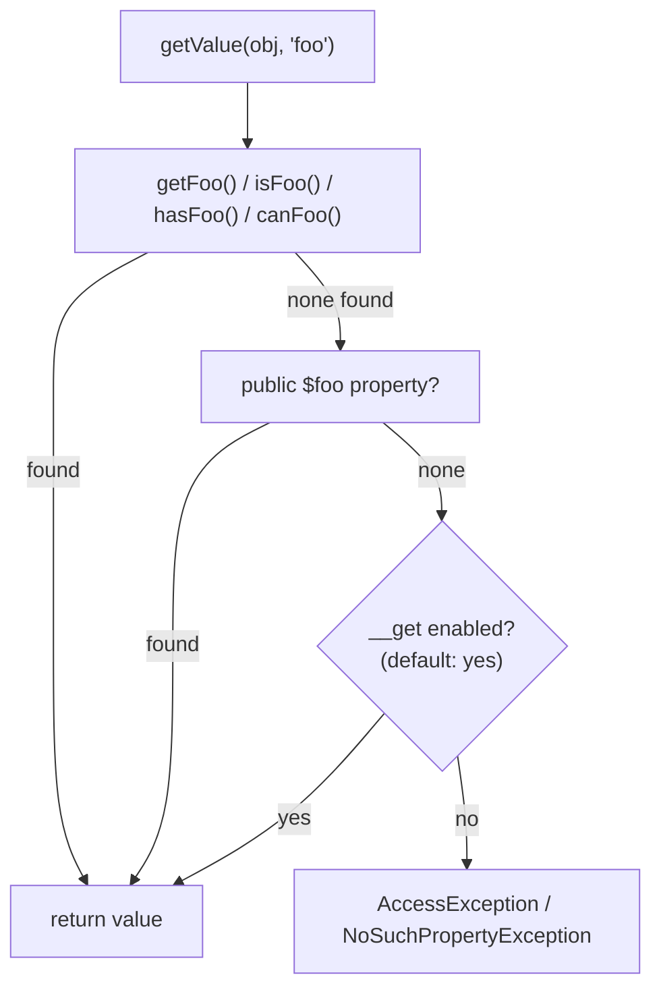

# Composant PropertyAccess

!!! tip "In a nutshell"
    `PropertyAccessor` lit/écrit les propriétés d'objets et de tableaux via
    un **chemin en chaîne** (`'user.address[0].city'`) au lieu de getters
    codés en dur. Il essaie les **getters dans un ordre fixe — `get`, `is`,
    `has`, `can`** — avant même de toucher `__get`/`__set`/`__call`, et ces
    fallbacks magiques ne sont **pas tous activés par défaut** (`__call` est
    désactivé sauf si vous le demandez). C'est ce qui fait fonctionner Forms
    et le Serializer.

!!! example "Real-world analogy"
    Un chemin de propriété est une étiquette d'expédition avec une chaîne
    d'adresses de réexpédition : `warehouse.shelf[3].bin`. Le coursier
    (`PropertyAccessor`) ne sait pas et ne se soucie pas de savoir si
    "shelf" est un champ public, une méthode `getShelf()`, ou un flag
    `isShelf()` — il essaie les formats d'étiquette standards dans un ordre
    fixe et livre à celui qui existe. Seulement si vous avez explicitement
    autorisé "demander à l'accueil" (`enableMagicCall()`) tombera-t-il en
    repli sur une réceptionniste `__call()` qui pourrait même ne pas
    connaître le colis.

!!! abstract "Learning objectives"
    À la fin de ce chapitre, vous saurez :

    - [ ] Lire et écrire des données imbriquées d'objet/tableau avec un chemin de propriété en chaîne.
    - [ ] Expliquer l'ordre de résolution des getters et les règles de fallback des méthodes magiques.
    - [ ] Configurer un `PropertyAccessor` avec `PropertyAccessorBuilder`.

    **Syllabus:** `Miscellaneous → PropertyAccess component` ·
    **Level:** Advanced / Expert ·
    **Est. time:** 25 min ·
    **Prerequisites:** [OOP](../php-web-security/oop.md), [Serializer component](serializer.fr.md)

    **Examen Symfony 8 :** OUI

---

## Pour les nuls

### L'idée en une phrase
`PropertyAccessor` lit et écrit des propriétés via un simple chemin en texte (`'user.address.city'`) — sans jamais avoir à écrire de getters à la main.

### Imagine dans la vraie vie
Un chemin de propriété est une étiquette d'expédition avec une chaîne d'adresses de réexpédition : `entrepot.etagere[3].casier`. Le coursier (`PropertyAccessor`) ne sait ni ne se soucie de savoir si "etagere" est un champ public, une méthode `getEtagere()`, ou un flag `isEtagere()` — il essaie les formats standards dans un ordre fixe.

### Dans Symfony
C'est exactement ce mécanisme qui permet à un `ChoiceType` de formulaire de lire `$produit->getCategorie()->getNom()` juste en configurant `'choice_label' => 'categorie.nom'` — sans jamais écrire ce code manuellement.

### Exemple simple
```php
$nom = $propertyAccessor->getValue($produit, 'categorie.nom'); // appelle getCategorie()->getNom()
```

### Comment le mémoriser 🧠
L'ordre des getters essayés est fixe : **`get`, `is`, `has`, `can`** — et les méthodes magiques (`__call`) ne sont **pas** activées par défaut, il faut explicitement appeler `enableMagicCall()`.

## Theory

`Symfony\Component\PropertyAccess\PropertyAccessor` lit et écrit une valeur
sur un objet ou un tableau en utilisant une chaîne de **chemin de
propriété** au lieu d'appeler directement un getter/setter. Un chemin
enchaîne des noms de propriété avec `.` et des indices de tableau avec
`[]` : `'person.addresses[0].city'` lit/écrit d'abord la propriété
`addresses` sur `person` (un tableau), puis l'index `0`, puis la propriété
`city` sur cet élément. Cette indirection est ce qui permet à Forms de
lier un champ texte à
`$order->getCustomer()->getAddress()->city` sans que personne n'écrive
cette chaîne à la main.

```php
use Symfony\Component\PropertyAccess\PropertyAccess;

$accessor = PropertyAccess::createPropertyAccessor();

$accessor->getValue($order, 'customer.address.city');       // lit à travers la chaîne
$accessor->setValue($order, 'customer.address.city', 'Lyon'); // écrit à travers la chaîne
```

!!! question "Predict first"
    Une classe a une propriété privée `$active` et une méthode
    `isActive(): bool` mais pas de `getActive()`. Est-ce que
    `$accessor->getValue($obj, 'active')` fonctionne ?

??? note "Reveal"
    **Oui.** La résolution du getter essaie `get`, `is`, `has`, `can` dans
    cet ordre — `isActive()` correspond. `PropertyAccessor` n'exige jamais
    un préfixe spécifique ; il essaie les quatre avant d'abandonner.

## Deep Dive — how it works internally

### The getter/setter lookup order

Pour une propriété nommée `foo`, la lecture essaie, **dans cet ordre
fixe** : `getFoo()`, `isFoo()`, `hasFoo()`, `canFoo()`, puis une propriété
publique `$foo`, puis (seulement si activé) `__get('foo')`. L'écriture
essaie `setFoo($v)`, puis une propriété publique `$foo`, puis (seulement
si activé) `__set('foo', $v)` ou `__call('setFoo', [$v])`.

```php
final class Invoice
{
    private bool $paid = false;

    public function isPaid(): bool { return $this->paid; }   // trouvé par "is"
    // pas de getPaid(), pas de setPaid() — lecture seule via PropertyAccessor
}

$accessor->getValue(new Invoice(), 'paid'); // false — isPaid() a matché
```

### Magic methods are opt-in, and not all at once

Le défaut de `PropertyAccessorBuilder` active `__get`/`__set` mais **pas**
`__call` — vous devez explicitement appeler `enableMagicCall()` pour
laisser un chemin retomber sur une méthode magique `__call()` (par ex. une
classe utilisant `__call()` pour émuler des setters). Cette asymétrie est
un piège d'examen fréquent.

```php
use Symfony\Component\PropertyAccess\PropertyAccessorBuilder;

$accessor = (new PropertyAccessorBuilder())
    ->enableMagicCall()                    // opt-in : fallback __call()
    ->enableExceptionOnInvalidIndex()      // opt-in : lève au lieu de renvoyer null
    ->getPropertyAccessor();
```



!!! note "Source reference"
    `Symfony\Component\PropertyAccess\PropertyAccessor::getValue()` et
    `Symfony\Component\PropertyInfo\Extractor\ReflectionExtractor::$defaultAccessorPrefixes`
    (`['get', 'is', 'has', 'can']`) —
    [symfony/symfony `8.0`](https://github.com/symfony/symfony/blob/8.0/src/Symfony/Component/PropertyAccess/PropertyAccessor.php).

### Who consumes it

Les Forms lient le `property_path` de chaque champ via un
`PropertyAccessor` (`DataMapper`) ; l'`ObjectNormalizer` du Serializer
l'utilise (via `AllowExtraAttributes`/`ObjectToPopulate`) pour réécrire des
valeurs dénormalisées sur un graphe d'objets. Ni l'un ni l'autre ne
réimplémente la résolution getter/setter — les deux délèguent à ce
composant.

### Null behavior

`isReadable()`/`isWritable()` renvoient un simple `bool` et **ne lèvent
jamais** — c'est le moyen sûr de sonder un chemin avant d'y toucher.
`getValue()` elle-même lève
`Symfony\Component\PropertyAccess\Exception\NoSuchPropertyException`
(étend `AccessException`) quand aucun getter/propriété/méthode magique ne
correspond — elle ne renvoie **pas** `null` pour une propriété manquante.
Une propriété qui existe mais n'a jamais reçu de valeur (une propriété
typée sans défaut) lève l'exception plus spécifique
`UninitializedPropertyException`, aussi une `AccessException`, distinguant
"n'existe pas" de "existe mais jamais assignée".

```php
$accessor->isReadable($obj, 'nope');   // false — sonde sûre, ne lève jamais
$accessor->getValue($obj, 'nope');     // lève NoSuchPropertyException — jamais null

class Draft { public string $title; }  // typée, sans défaut — non initialisée tant que non assignée
$accessor->getValue(new Draft(), 'title'); // lève UninitializedPropertyException
```

!!! note "Null in real life"
    Demander "cette étiquette peut-elle être livrée ?" (`isReadable()`)
    obtient toujours un simple oui/non. Tenter réellement une livraison à
    une adresse qui n'existe pas sur la chaîne (`getValue()`) rapporte un
    colis retourné, pas une enveloppe vide — l'exception, pas `null`, est le
    signal d'échec.

## Configuration & code

=== "Basic paths"

    ```php
    <?php
    declare(strict_types=1);

    use Symfony\Component\PropertyAccess\PropertyAccess;

    $accessor = PropertyAccess::createPropertyAccessor();

    $data = ['user' => ['name' => 'Ada', 'roles' => ['admin', 'editor']]];

    $accessor->getValue($data, '[user][name]');     // 'Ada' — syntaxe tableau
    $accessor->getValue($data, '[user][roles][0]'); // 'admin'
    $accessor->setValue($data, '[user][name]', 'Grace');
    ```

=== "Builder with magic methods"

    ```php
    <?php
    declare(strict_types=1);

    use Symfony\Component\PropertyAccess\PropertyAccessorBuilder;

    final class LegacyBag
    {
        private array $data = [];

        public function __call(string $name, array $args): mixed
        {
            // Émule setX()/getX() pour des clés arbitraires — nécessite enableMagicCall()
            if (str_starts_with($name, 'set')) {
                $this->data[lcfirst(substr($name, 3))] = $args[0];
                return null;
            }
            return $this->data[lcfirst(substr($name, 3))] ?? null;
        }
    }

    $accessor = (new PropertyAccessorBuilder())->enableMagicCall()->getPropertyAccessor();
    $accessor->setValue($bag = new LegacyBag(), 'color', 'blue'); // routé via __call
    ```

## Best practices & anti-patterns

| ✅ Do | ❌ Avoid |
|---|---|
| `isReadable()`/`isWritable()` avant un chemin optionnel | Envelopper `getValue()` dans un try/catch comme seule protection |
| N'activer que les méthodes magiques dont vous avez réellement besoin | Activer `enableMagicCall()` "au cas où" |
| Utiliser la syntaxe tableau `[key]` pour les données tableau | Mélanger syntaxe point et crochets pour le même tableau |
| Laisser Forms/Serializer l'utiliser implicitement | Réimplémenter la traque de getter à la main |

## When (not) to use it / alternatives

Utilisez `PropertyAccessor` quand un chemin est **dynamique** — construit
depuis un nom de champ de formulaire, une clé de config, ou un mapping du
Serializer. Si vous avez déjà un objet concret et connaissez la propriété
à la compilation, appelez directement le getter/setter : c'est plus
rapide et typé par PHP lui-même, sans coût d'analyse de chemin.

!!! danger "Certification traps"
    - L'ordre de résolution du getter est exactement **`get`, `is`, `has`,
      `can`** — pas alphabétique, pas juste `get`.
    - `__get`/`__set` sont activés **par défaut** ; `__call` ne l'est
      **pas** — `enableMagicCall()` est requis pour l'utiliser.
    - `getValue()` sur une propriété manquante **lève**
      `NoSuchPropertyException`, elle ne renvoie pas `null`.
    - `isReadable()`/`isWritable()` ne lèvent jamais — c'est le
      pré-contrôle sûr, distinct de la lecture/écriture réelle.
    - Une propriété typée non initialisée lève `UninitializedPropertyException`,
      pas `NoSuchPropertyException` — la propriété existe, elle n'a juste pas encore de valeur.

!!! warning "Common mistakes"
    - Supposer qu'une propriété manquante renvoie `null` au lieu de lever.
    - Oublier que les chemins tableau utilisent `[key]`, pas `.key`.
    - Activer chaque flag de méthode magique au lieu de seulement ce dont une classe précise a besoin.

## Exercises

1. **(Advanced)** Lisez `'address.city'` sur un objet qui n'expose que
   `getAddress(): Address` et une propriété publique `Address::$city` —
   aucun setter nécessaire.
2. **(Expert)** Écrivez une classe dont les propriétés ne sont accessibles
   que via `__call()`, et configurez un `PropertyAccessor` capable de la
   lire/écrire.

??? success "Solutions"

    **1.**
    ```php
    $accessor->getValue($order, 'address.city');
    // getAddress() correspond au préfixe "get", puis $city est lue comme propriété publique.
    ```

    **2.** Implémentez `__call()` gérant les appels `getX()`/`setX()` (voir
    l'onglet "Builder with magic methods"), puis construisez l'accessor avec
    `(new PropertyAccessorBuilder())->enableMagicCall()->getPropertyAccessor()`
    — sans cet appel, `__call` n'est jamais essayé.

## Certification questions

*Question d'entraînement inspirée du syllabus — jamais une question officielle de l'examen.*

??? question "Q1. Dans quel ordre PropertyAccessor essaie-t-il les préfixes de méthode getter ?"
    - [x] A. `get`, `is`, `has`, `can` ✅
    - [ ] B. `is`, `get`, `has`, `can`
    - [ ] C. Alphabétique : `can`, `get`, `has`, `is`
    - [ ] D. Seulement `get`, rien d'autre

    **Why:** `ReflectionExtractor::$defaultAccessorPrefixes` fixe exactement
    cet ordre. **Ref:** [PropertyAccess](https://symfony.com/doc/8.0/components/property_access.html).

??? question "Q2. Quelle méthode magique est désactivée par défaut dans PropertyAccessorBuilder ?"
    - [ ] A. `__get`
    - [ ] B. `__set`
    - [x] C. `__call` ✅
    - [ ] D. Les trois sont activées par défaut

    **Why:** les flags par défaut sont `MAGIC_GET | MAGIC_SET` ; `__call`
    nécessite explicitement `enableMagicCall()`.
    **Ref:** [PropertyAccess — magic methods](https://symfony.com/doc/8.0/components/property_access.html#magic-getters-and-setters).

??? question "Q3. `getValue()` sur une propriété qui n'existe pas sur la cible…"
    - [x] A. Lève `NoSuchPropertyException` ✅
    - [ ] B. Renvoie `null`
    - [ ] C. Renvoie `false`
    - [ ] D. Renvoie une chaîne vide

    **Why:** contrairement à un accès tableau `??`, `PropertyAccessor`
    traite une propriété manquante comme une erreur, pas comme un résultat null.
    **Ref:** [Symfony source — NoSuchPropertyException](https://github.com/symfony/symfony/blob/8.0/src/Symfony/Component/PropertyAccess/Exception/NoSuchPropertyException.php).

??? question "Q4. Que fait `isReadable($obj, $path)` si le chemin est invalide ?"
    - [x] A. Renvoie `false` — elle ne lève jamais ✅
    - [ ] B. Lève la même exception que `getValue()`
    - [ ] C. Renvoie `null`
    - [ ] D. Émet un warning et renvoie `true`

    **Why:** `isReadable()`/`isWritable()` sont les sondes sûres, renvoyant
    toujours un simple booléen. **Ref:** [PropertyAccess](https://symfony.com/doc/8.0/components/property_access.html).

## Key takeaways

- Un chemin de propriété enchaîne `.` pour les propriétés et `[]` pour l'accès tableau/index.
- L'ordre du getter est fixe : `get` → `is` → `has` → `can`, puis une
  propriété publique, puis (si activé) `__get`.
- `__get`/`__set` sont activés par défaut ; `__call` nécessite `enableMagicCall()`.
- `getValue()` lève sur une propriété manquante ; `isReadable()`/`isWritable()`
  sont les sondes qui ne lèvent jamais.
- Forms et le Serializer délèguent tous deux à ce composant en interne.

## Last-minute revision

!!! tip "Cheat sheet"
    - `PropertyAccess::createPropertyAccessor()` — défaut : magic get/set activé, call désactivé.
    - Ordre du getter : `get`, `is`, `has`, `can`.
    - Chemins : `a.b` (propriété), `a[0]` (tableau/index), mixable : `a[0].b`.
    - Exceptions : `NoSuchPropertyException` (manquante), `UninitializedPropertyException`
      (typée, non assignée) — les deux étendent `AccessException`.
    - `isReadable()`/`isWritable()` ne lèvent jamais ; `getValue()`/`setValue()` le font.

## Connections

- **Depends on:** [OOP](../php-web-security/oop.md) — conventions
  getter/setter et méthodes magiques.
- **Reused in:** [Forms — Form component](../forms/creation.md),
  [Serializer component](serializer.fr.md) — les deux lient des chemins
  dynamiques via ce composant plutôt que des accesseurs codés en dur.
- **Confused with:** [Serializer component](serializer.fr.md) — le
  Serializer convertit entre objets PHP et formats (JSON/XML) ; PropertyAccess
  ne fait que lire/écrire un seul chemin une fois que vous avez déjà l'objet/tableau cible.

## Official References
- [Official Symfony docs — PropertyAccess](https://symfony.com/doc/8.0/components/property_access.html)
- [Symfony source — PropertyAccessor](https://github.com/symfony/symfony/blob/8.0/src/Symfony/Component/PropertyAccess/PropertyAccessor.php)
- [Symfony source — PropertyAccessorBuilder](https://github.com/symfony/symfony/blob/8.0/src/Symfony/Component/PropertyAccess/PropertyAccessorBuilder.php)

## Video references

!!! tip "Watch & learn"
    Ce sont des chaînes vidéo officielles, mises à jour en continu — cherchez-y
    "PropertyAccess Symfony" pour renforcer ce chapitre. Nous lions des
    chaînes stables plutôt que des vidéos individuelles pour que les
    références ne deviennent jamais obsolètes.

    - [SymfonyCasts screencasts](https://symfonycasts.com/tracks/symfony) — tutoriels scénarisés, en code.
    - [Symfony official YouTube](https://www.youtube.com/@SymfonyOfficial) — conférences et keynotes SymfonyCon.
    - [Official docs for this topic](https://symfony.com/doc/8.0/components/property_access.html) — certaines pages de doc Symfony embarquent un screencast.

## Confidence check

Je suis prêt quand je peux :

- [ ] expliquer **pourquoi** un chemin de propriété dynamique a besoin de son propre composant plutôt que de simples getters
- [ ] lire/écrire des chemins imbriqués et configurer les fallbacks de méthodes magiques en Symfony 8
- [ ] déboguer un chemin qui lève au lieu de renvoyer la valeur attendue
- [ ] repérer le piège : `__call` est opt-in, l'ordre du getter est fixe, manquant ≠ null
- [ ] expliquer comment Forms et le Serializer délèguent tous deux à ce composant

---

<small>Related: [Serializer component](serializer.fr.md) · [Forms — Creation](../forms/creation.md) · [OOP](../php-web-security/oop.md)</small>
