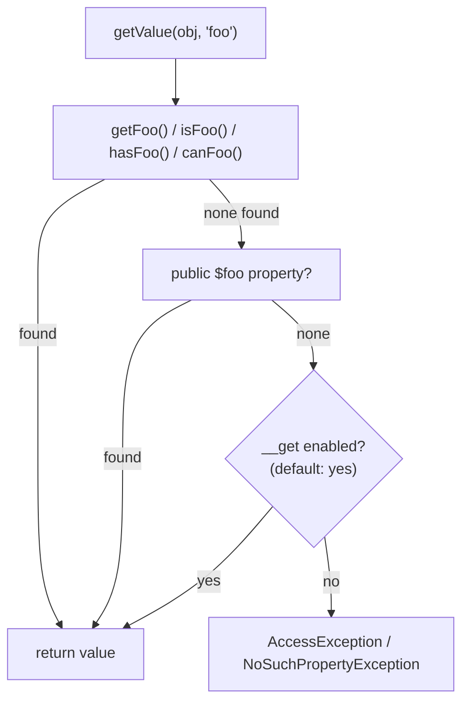

# PropertyAccess Component

!!! tip "In a nutshell"
    `PropertyAccessor` reads/writes object and array properties through a
    **string path** (`'user.address[0].city'`) instead of hard-coded
    getters. It tries **getters in a fixed order — `get`, `is`, `has`,
    `can`** — before ever touching `__get`/`__set`/`__call`, and those magic
    fallbacks are **not all enabled by default** (`__call` is off unless you
    ask for it). This is what powers Forms and the Serializer.

!!! example "Real-world analogy"
    A property path is a shipping label with a chain of forwarding
    addresses: `warehouse.shelf[3].bin`. The courier (`PropertyAccessor`)
    doesn't know or care whether "shelf" is a public field, a `getShelf()`
    method, or an `isShelf()` flag — it tries the standard label formats in
    a fixed order and delivers to whichever one exists. Only if you've
    explicitly authorized "ask the front desk" (`enableMagicCall()`) will it
    fall back to buzzing a `__call()` receptionist who might not even know
    the package.

!!! abstract "Learning objectives"
    By the end of this chapter you can:

    - [ ] Read and write nested object/array data with a string property path.
    - [ ] Explain the getter-lookup order and the magic-method fallback rules.
    - [ ] Configure a `PropertyAccessor` with `PropertyAccessorBuilder`.

    **Syllabus:** `Miscellaneous → PropertyAccess component` ·
    **Level:** Advanced / Expert ·
    **Est. time:** 25 min ·
    **Prerequisites:** [OOP](../php-web-security/oop.md), [Serializer component](serializer.md)

---

## Theory

`Symfony\Component\PropertyAccess\PropertyAccessor` reads and writes a value
on an object or array using a **property path** string instead of calling a
getter/setter directly. A path chains property names with `.` and array
indices with `[]`: `'person.addresses[0].city'` first reads/writes property
`addresses` on `person` (an array), then index `0`, then property `city` on
that element. This indirection is what lets Forms bind a text field to
`$order->getCustomer()->getAddress()->city` without anyone writing that
chain by hand.

```php
use Symfony\Component\PropertyAccess\PropertyAccess;

$accessor = PropertyAccess::createPropertyAccessor();

$accessor->getValue($order, 'customer.address.city');       // reads through the chain
$accessor->setValue($order, 'customer.address.city', 'Lyon'); // writes through the chain
```

!!! question "Predict first"
    A class has a private `$active` property and a method `isActive(): bool`
    but no `getActive()`. Does `$accessor->getValue($obj, 'active')` work?

??? note "Reveal"
    **Yes.** The getter lookup tries `get`, `is`, `has`, `can` in that
    order — `isActive()` matches. `PropertyAccessor` never requires a
    specific prefix; it tries all four before giving up.

## Deep Dive — how it works internally

### The getter/setter lookup order

For a property named `foo`, reading tries, **in this fixed order**:
`getFoo()`, `isFoo()`, `hasFoo()`, `canFoo()`, then a public `$foo` property,
then (only if enabled) `__get('foo')`. Writing tries `setFoo($v)`, then a
public `$foo` property, then (only if enabled) `__set('foo', $v)` or
`__call('setFoo', [$v])`.

```php
final class Invoice
{
    private bool $paid = false;

    public function isPaid(): bool { return $this->paid; }   // matched by "is"
    // no getPaid(), no setPaid() — read-only through PropertyAccessor
}

$accessor->getValue(new Invoice(), 'paid'); // false — isPaid() matched
```

### Magic methods are opt-in, and not all at once

`PropertyAccessorBuilder`'s default enables `__get`/`__set` but **not**
`__call` — you must explicitly call `enableMagicCall()` to let a path fall
back to a magic `__call()` method (e.g. a class using `__call()` to emulate
setters). This asymmetry is a frequent exam trap.

```php
use Symfony\Component\PropertyAccess\PropertyAccessorBuilder;

$accessor = (new PropertyAccessorBuilder())
    ->enableMagicCall()                    // opt-in: __call() fallback
    ->enableExceptionOnInvalidIndex()      // opt-in: throw instead of returning null
    ->getPropertyAccessor();
```



!!! note "Source reference"
    `Symfony\Component\PropertyAccess\PropertyAccessor::getValue()` and
    `Symfony\Component\PropertyInfo\Extractor\ReflectionExtractor::$defaultAccessorPrefixes`
    (`['get', 'is', 'has', 'can']`) —
    [symfony/symfony `8.0`](https://github.com/symfony/symfony/blob/8.0/src/Symfony/Component/PropertyAccess/PropertyAccessor.php).

### Who consumes it

Forms bind each field's `property_path` through a `PropertyAccessor`
(`DataMapper`); the Serializer's `ObjectNormalizer` uses it (via
`AllowExtraAttributes`/`ObjectToPopulate`) to write denormalized values back
onto an object graph. Neither reimplements getter/setter resolution — both
delegate to this component.

### Null behavior

`isReadable()`/`isWritable()` return a plain `bool` and **never throw** —
they are the safe way to probe a path before touching it. `getValue()`
itself throws `Symfony\Component\PropertyAccess\Exception\NoSuchPropertyException`
(extends `AccessException`) when no getter/property/magic-method matches —
it does **not** return `null` for a missing property. A property that
exists but was never assigned a value (a typed property with no default)
throws the more specific `UninitializedPropertyException`, also an
`AccessException`, distinguishing "doesn't exist" from "exists but never
set."

```php
$accessor->isReadable($obj, 'nope');   // false — safe probe, never throws
$accessor->getValue($obj, 'nope');     // throws NoSuchPropertyException — never null

class Draft { public string $title; }  // typed, no default — uninitialized until set
$accessor->getValue(new Draft(), 'title'); // throws UninitializedPropertyException
```

!!! note "Null in real life"
    Asking "can this label be delivered?" (`isReadable()`) always gets a
    plain yes/no. Actually attempting delivery to an address that doesn't
    exist on the chain (`getValue()`) gets a bounced package, not a blank
    envelope — the exception, not `null`, is the failure signal.

## Configuration & code

=== "Basic paths"

    ```php
    <?php
    declare(strict_types=1);

    use Symfony\Component\PropertyAccess\PropertyAccess;

    $accessor = PropertyAccess::createPropertyAccessor();

    $data = ['user' => ['name' => 'Ada', 'roles' => ['admin', 'editor']]];

    $accessor->getValue($data, '[user][name]');     // 'Ada' — array syntax
    $accessor->getValue($data, '[user][roles][0]'); // 'admin'
    $accessor->setValue($data, '[user][name]', 'Grace');
    ```

=== "Builder with magic methods"

    ```php
    <?php
    declare(strict_types=1);

    use Symfony\Component\PropertyAccess\PropertyAccessorBuilder;

    final class LegacyBag
    {
        private array $data = [];

        public function __call(string $name, array $args): mixed
        {
            // Emulates setX()/getX() for arbitrary keys — needs enableMagicCall()
            if (str_starts_with($name, 'set')) {
                $this->data[lcfirst(substr($name, 3))] = $args[0];
                return null;
            }
            return $this->data[lcfirst(substr($name, 3))] ?? null;
        }
    }

    $accessor = (new PropertyAccessorBuilder())->enableMagicCall()->getPropertyAccessor();
    $accessor->setValue($bag = new LegacyBag(), 'color', 'blue'); // routed via __call
    ```

## Best practices & anti-patterns

| ✅ Do | ❌ Avoid |
|---|---|
| `isReadable()`/`isWritable()` before an optional path | Wrapping `getValue()` in try/catch as your only guard |
| Enable only the magic methods you actually need | Enabling `enableMagicCall()` "just in case" |
| Use array syntax `[key]` for array data | Mixing dot and bracket syntax for the same array |
| Let Forms/Serializer use it implicitly | Reimplementing getter-chasing by hand |

## When (not) to use it / alternatives

Use `PropertyAccessor` when a path is **dynamic** — built from a form field
name, a config key, or a Serializer mapping. If you already have a concrete
object and know the property at compile time, call the getter/setter
directly: it's faster and type-checked by PHP itself, with no path-parsing
overhead.

!!! danger "Certification traps"
    - Getter lookup order is exactly **`get`, `is`, `has`, `can`** — not
      alphabetical, not just `get`.
    - `__get`/`__set` are enabled **by default**; `__call` is **not** —
      `enableMagicCall()` is required to use it.
    - `getValue()` on a missing property **throws**
      `NoSuchPropertyException`, it does not return `null`.
    - `isReadable()`/`isWritable()` never throw — they are the safe
      pre-check, distinct from actually reading/writing.
    - An uninitialized typed property throws `UninitializedPropertyException`,
      not `NoSuchPropertyException` — the property exists, it just has no value yet.

!!! warning "Common mistakes"
    - Assuming a missing property returns `null` instead of throwing.
    - Forgetting that array paths use `[key]`, not `.key`.
    - Enabling every magic-method flag instead of only what a specific class needs.

## Exercises

1. **(Advanced)** Read `'address.city'` off an object that only exposes
   `getAddress(): Address` and a public `Address::$city` — no setter needed.
2. **(Expert)** Write a class whose properties are only reachable via
   `__call()`, and configure a `PropertyAccessor` that can read/write it.

??? success "Solutions"

    **1.**
    ```php
    $accessor->getValue($order, 'address.city');
    // getAddress() matches the "get" prefix, then $city is read as a public property.
    ```

    **2.** Implement `__call()` handling `getX()`/`setX()` calls (see the
    "Builder with magic methods" tab), then build the accessor with
    `(new PropertyAccessorBuilder())->enableMagicCall()->getPropertyAccessor()`
    — without that call, `__call` is never tried.

## Certification questions

??? question "Q1. In which order does PropertyAccessor try getter method prefixes?"
    - [x] A. `get`, `is`, `has`, `can` ✅
    - [ ] B. `is`, `get`, `has`, `can`
    - [ ] C. Alphabetical: `can`, `get`, `has`, `is`
    - [ ] D. Only `get`, nothing else

    **Why:** `ReflectionExtractor::$defaultAccessorPrefixes` fixes this exact
    order. **Ref:** [PropertyAccess](https://symfony.com/doc/current/components/property_access.html).

??? question "Q2. Which magic method is disabled by default in PropertyAccessorBuilder?"
    - [ ] A. `__get`
    - [ ] B. `__set`
    - [x] C. `__call` ✅
    - [ ] D. All three are enabled by default

    **Why:** the default flags are `MAGIC_GET | MAGIC_SET`; `__call` requires
    `enableMagicCall()` explicitly.
    **Ref:** [PropertyAccess — magic methods](https://symfony.com/doc/current/components/property_access.html#magic-getters-and-setters).

??? question "Q3. `getValue()` on a property that does not exist on the target…"
    - [x] A. Throws `NoSuchPropertyException` ✅
    - [ ] B. Returns `null`
    - [ ] C. Returns `false`
    - [ ] D. Returns an empty string

    **Why:** unlike an array-access `??`, `PropertyAccessor` treats a
    missing property as an error, not a null result.
    **Ref:** [Symfony source — NoSuchPropertyException](https://github.com/symfony/symfony/blob/8.0/src/Symfony/Component/PropertyAccess/Exception/NoSuchPropertyException.php).

??? question "Q4. What does `isReadable($obj, $path)` do if the path is invalid?"
    - [x] A. Returns `false` — it never throws ✅
    - [ ] B. Throws the same exception as `getValue()`
    - [ ] C. Returns `null`
    - [ ] D. Emits a warning and returns `true`

    **Why:** `isReadable()`/`isWritable()` are the safe probes, always
    returning a plain boolean. **Ref:** [PropertyAccess](https://symfony.com/doc/current/components/property_access.html).

## Key takeaways

- A property path chains `.` for properties and `[]` for array/index access.
- Getter order is fixed: `get` → `is` → `has` → `can`, then a public
  property, then (if enabled) `__get`.
- `__get`/`__set` are on by default; `__call` needs `enableMagicCall()`.
- `getValue()` throws on a missing property; `isReadable()`/`isWritable()`
  are the non-throwing probes.
- Forms and the Serializer both delegate to this component internally.

## Last-minute revision

!!! tip "Cheat sheet"
    - `PropertyAccess::createPropertyAccessor()` — default: magic get/set on, call off.
    - Getter order: `get`, `is`, `has`, `can`.
    - Paths: `a.b` (property), `a[0]` (array/index), can mix: `a[0].b`.
    - Exceptions: `NoSuchPropertyException` (missing), `UninitializedPropertyException`
      (typed, unset) — both extend `AccessException`.
    - `isReadable()`/`isWritable()` never throw; `getValue()`/`setValue()` do.

## Connections

- **Depends on:** [OOP](../php-web-security/oop.md) — getter/setter
  conventions and magic methods.
- **Reused in:** [Forms — Form component](../forms/creation.md),
  [Serializer component](serializer.md) — both bind dynamic paths through
  this component instead of hard-coded accessors.
- **Confused with:** [Serializer component](serializer.md) — the Serializer
  converts between PHP objects and formats (JSON/XML); PropertyAccess only
  reads/writes a single path once you already have the target object/array.

## Official References
- [Official Symfony docs — PropertyAccess](https://symfony.com/doc/current/components/property_access.html)
- [Symfony source — PropertyAccessor](https://github.com/symfony/symfony/blob/8.0/src/Symfony/Component/PropertyAccess/PropertyAccessor.php)
- [Symfony source — PropertyAccessorBuilder](https://github.com/symfony/symfony/blob/8.0/src/Symfony/Component/PropertyAccess/PropertyAccessorBuilder.php)

## Video references

!!! tip "Watch & learn"
    These are official, continuously-updated video channels — search them for
    "PropertyAccess Symfony" to reinforce this chapter. We link stable channels rather than
    individual videos so the references never rot.

    - [SymfonyCasts screencasts](https://symfonycasts.com/tracks/symfony) — scripted, code-along tutorials.
    - [Symfony official YouTube](https://www.youtube.com/@SymfonyOfficial) — SymfonyCon conference talks & keynotes.
    - [Official docs for this topic](https://symfony.com/doc/current/components/property_access.html) — some Symfony doc pages embed a screencast.

## Confidence check

I'm ready when I can:

- [ ] explain **why** a dynamic property path needs its own component instead of plain getters
- [ ] read/write nested paths and configure magic-method fallbacks in Symfony 8
- [ ] debug a path that throws instead of returning the expected value
- [ ] spot the trap: `__call` is opt-in, the getter order is fixed, missing ≠ null
- [ ] explain how Forms and the Serializer both delegate to this component

---

<small>Related: [Serializer component](serializer.md) · [Forms — Creation](../forms/creation.md) · [OOP](../php-web-security/oop.md)</small>
