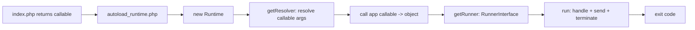

# Runtime Component

!!! tip "In a nutshell"
    Le Runtime découple votre point d'entrée de la manière dont l'application est
    exécutée, si bien que le même `index.php` démarre sous PHP-FPM, en CLI, sous
    Swoole ou RoadRunner. À retenir pour l'examen : `public/index.php` **retourne**
    un callable (il n'appelle jamais `handle()`), le runtime par défaut est
    `SymfonyRuntime`, et `APP_RUNTIME` le sélectionne.

!!! example "Real-world analogy"
    Le Runtime est l'équipe technique d'un théâtre, et votre `index.php` n'est que le
    texte de la pièce. Le même texte se joue à l'identique dans un amphithéâtre en plein
    air (PHP-FPM), un petit studio (le CLI) ou une installation de tournée (Swoole,
    RoadRunner), car c'est l'équipe — et non le texte — qui gère les lumières, le son et
    le rideau : planter le décor et saluer (`handle()`, `send()`, `terminate()`).
    L'auteur se contente de remettre le texte (retourne un callable) et laisse l'équipe
    faire tourner la salle ; si l'auteur s'empare de la console lumière en pleine scène
    (appelle `handle()` lui-même), le spectacle est joué deux fois.

!!! abstract "Learning objectives"
    À la fin de ce chapitre, vous saurez :

    - [ ] Expliquer le flux du point d'entrée à travers `autoload_runtime.php`.
    - [ ] Décrire `RuntimeInterface`, `SymfonyRuntime` et `GenericRuntime`.
    - [ ] Sélectionner un runtime avec `APP_RUNTIME` et savoir ce que le callable peut retourner.

    **Syllabus:** `Miscellaneous → Runtime` ·
    **Level:** Expert ·
    **Est. time:** 30 min ·
    **Prerequisites:** [Request Handling](../architecture/request-handling.md)

---

## Theory

Le composant Runtime découple le **point d'entrée** de votre application (le
callable retourné dans `public/index.php` ou `bin/console`) de la mécanique de
son exécution — créer la `Request`, envoyer la `Response`, lire l'environnement
et les arguments. Cela permet à la *même* application de démarrer sous PHP-FPM,
en CLI ou sous des runtimes alternatifs (Swoole, RoadRunner) en ne remplaçant
que le runtime.

```php
// public/index.php — the whole entry point
require_once dirname(__DIR__).'/vendor/autoload_runtime.php';

return static function (array $context) {
    // the runtime creates the Request and sends the Response — not you
    return new App\Kernel($context['APP_ENV'], (bool) $context['APP_DEBUG']);
};
```

## Deep Dive — how it works internally

!!! question "Predict first"
    Votre `public/index.php` construit un `Kernel` et appelle lui-même
    `$kernel->handle(...)`, puis la page revient blanche ou dupliquée. Qu'attendait
    le Runtime à la place ?

??? note "Reveal"
    Il attend que vous **retourniez** un callable qui *produit* l'objet
    application — le runtime (via `autoload_runtime.php`) résout ses arguments et
    exécute `handle()`, `send()` et `terminate()` pour vous. Appeler `handle()`
    vous-même l'exécute deux fois.

### The entry-point flow

`public/index.php` inclut `vendor/autoload_runtime.php` et **retourne** un
callable. `autoload_runtime.php` (généré par le plugin Composer) assure
l'orchestration :



1. `autoload_runtime.php` instancie le runtime désigné par `APP_RUNTIME`
   (par défaut `Symfony\Component\Runtime\SymfonyRuntime`).
2. `RuntimeInterface::getResolver($callable)` construit un `ResolverInterface`
   qui **autowire les arguments du callable** — p. ex. `array $context` (depuis
   `$_SERVER`), `Request`, `Command`, `InputInterface`, `OutputInterface`.
3. Le callable est invoqué et retourne un **objet application** (un `Kernel`,
   une `Response`, une `Command`, un `int` ou un callable).
4. `RuntimeInterface::getRunner($app)` retourne un
   `Symfony\Component\Runtime\RunnerInterface` ; son `run(): int` exécute
   l'application et retourne le code de sortie (pour un `Kernel` : `handle()` →
   `send()` → `terminate()`).

```php
use Symfony\Component\Runtime\SymfonyRuntime;

// What autoload_runtime.php does, simplified:
$runtime = new SymfonyRuntime();                         // class named by APP_RUNTIME
$app = require 'public/index.php';                       // the returned callable
[$app, $args] = $runtime->getResolver($app)->resolve();  // autowire array $context, Request…
$application = $app(...$args);                           // e.g. a Kernel
exit($runtime->getRunner($application)->run());          // handle() → send() → terminate()
```

!!! note "Source reference"
    `Symfony\Component\Runtime\RuntimeInterface`, `SymfonyRuntime`, `GenericRuntime` —
    [symfony/symfony `8.0`](https://github.com/symfony/symfony/blob/8.0/src/Symfony/Component/Runtime/RuntimeInterface.php).

### The two built-in runtimes

- **`GenericRuntime`** — ne connaît que les superglobales/l'environnement PHP ;
  exécute tout objet application via les `RunnerInterface`s correspondants. Le
  runtime de base, agnostique du framework.
- **`SymfonyRuntime`** — étend `GenericRuntime` avec des resolvers et runners
  conscients de Symfony : il peut injecter une `Request`, un `SymfonyStyle`, les
  `Input`/`Output` de la console, et exécuter un `HttpKernelInterface`/`Kernel`
  ou une `Application`/`Command` de console.

```php
// SymfonyRuntime resolvers can inject Symfony objects into the callable:
return static function (Request $request): Response {
    // the SymfonyRuntime runner will send() this Response for you
    return new Response('Hello '.$request->query->get('name', 'world'));
};
// GenericRuntime only resolves plain values (array $context from $_SERVER, etc.)
```

### Selecting a runtime

Définissez `APP_RUNTIME` (variable d'environnement) ou la clé
`extra.runtime.class` de `composer.json` vers une classe `RuntimeInterface`
personnalisée. Les runtimes de serveurs alternatifs (RoadRunner, Swoole)
fournissent leur propre classe de runtime vers laquelle pointer `APP_RUNTIME` —
aucun changement dans `index.php`.

```console
# APP_RUNTIME selects the RuntimeInterface implementation — index.php unchanged
$ APP_RUNTIME='Runtime\Swoole\Runtime' php public/index.php

# or in composer.json: "extra": { "runtime": { "class": "Runtime\\Swoole\\Runtime" } }
```

### What the callable may return

| Type de retour | Comportement du runner |
|---|---|
| `Kernel` / `HttpKernelInterface` | Crée la `Request`, `handle`, `send`, `terminate` |
| `Response` | L'envoie via `send()` |
| `Command` / `Application` | Exécutée comme une commande de console |
| `int` | Utilisé directement comme code de sortie |
| `callable` | Invoqué, son résultat traité récursivement |

## Configuration & code

=== "PHP Attributes"

    ```php
    <?php
    // public/index.php
    declare(strict_types=1);

    use App\Kernel;

    require_once dirname(__DIR__).'/vendor/autoload_runtime.php';

    return static function (array $context): Kernel {
        return new Kernel($context['APP_ENV'], (bool) $context['APP_DEBUG']);
    };
    ```

    ```php
    <?php
    // bin/console
    declare(strict_types=1);

    use App\Kernel;
    use Symfony\Bundle\FrameworkBundle\Console\Application;

    require_once dirname(__DIR__).'/vendor/autoload_runtime.php';

    return static function (array $context): Application {
        return new Application(new Kernel($context['APP_ENV'], (bool) $context['APP_DEBUG']));
    };
    ```

=== "YAML"

    ```yaml
    # Not YAML — configured via env/composer.json:
    # APP_RUNTIME=Symfony\Component\Runtime\SymfonyRuntime
    ```

=== "Console"

    ```console
    $ APP_RUNTIME='App\Runtime\MyRuntime' php bin/console cache:clear
    ```

## Best practices & anti-patterns

| ✅ Do | ❌ Avoid |
|---|---|
| Garder `index.php`/`console` minimaux — retourner simplement un callable | Bootstrapper/gérer les requests manuellement |
| Laisser le resolver injecter `array $context`, etc. | Lire `$_SERVER` dans le callable |
| Changer de runtime via `APP_RUNTIME` pour Swoole/RoadRunner | Modifier `index.php` selon l'environnement |

## When (not) to use it / alternatives

Vous n'écrivez presque jamais de runtime ; vous vous appuyez sur
`SymfonyRuntime`. Ne fournissez un `RuntimeInterface` personnalisé que pour
intégrer un serveur PHP alternatif ou changer la façon dont l'objet application
est créé/exécuté. Le composant est transparent pour les applications standard.

!!! danger "Certification traps"
    - `public/index.php` **retourne** un callable ; il n'appelle pas `handle()` lui-même.
    - Le runtime par défaut est **`SymfonyRuntime`** (étend `GenericRuntime`).
    - `APP_RUNTIME` (ou `extra.runtime.class`) sélectionne la classe de runtime.
    - Le resolver **autowire** les arguments du callable (p. ex. `array $context`).
    - `autoload_runtime.php` est généré par le plugin runtime de Composer.

!!! warning "Common mistakes"
    - Oublier de `return` la closure depuis `index.php`.
    - S'attendre à appeler `Request::createFromGlobals()` dans votre code — le runtime s'en charge.

## Exercises

1. **(Expert)** Écrivez le `public/index.php` retournant un `Kernel` via le runtime.
2. **(Expert)** Expliquez comment la même application tourne sous un runtime Swoole
   sans modifier `index.php`.

??? success "Solutions"

    **1.** Voir l'extrait `index.php` ci-dessus — incluez `autoload_runtime.php` et
    retournez une closure qui construit le `Kernel` à partir de `$context`.

    **2.** Pointez `APP_RUNTIME` vers la classe du runtime Swoole.
    `autoload_runtime.php` l'instancie ; son runner garde le kernel en mémoire et
    lui transmet les requests depuis l'event loop de Swoole — le callable retourné
    reste inchangé.

## Certification questions

??? question "Q1. What does `public/index.php` return?"
    - [x] A. A callable that produces the app object (e.g. a `Kernel`) ✅
    - [ ] B. A `Response`
    - [ ] C. Nothing — it echoes output

    **Why:** Le runtime invoque le callable retourné, en résolvant ses arguments.
    **Ref:** [Runtime](https://symfony.com/doc/8.0/components/runtime.html).

??? question "Q2. Which env var selects the runtime class?"
    - [x] A. `APP_RUNTIME` ✅
    - [ ] B. `APP_ENV`
    - [ ] C. `SYMFONY_RUNTIME`

    **Why:** `APP_RUNTIME` (ou `extra.runtime.class` de composer) choisit le runtime.
    **Ref:** [Runtime](https://symfony.com/doc/8.0/components/runtime.html#using-the-runtime).

??? question "Q3. `SymfonyRuntime` extends which class?"
    - [x] A. `GenericRuntime` ✅
    - [ ] B. `HttpKernel`
    - [ ] C. `Kernel`

    **Why:** `SymfonyRuntime` ajoute des resolvers/runners conscients de Symfony
    par-dessus `GenericRuntime`. **Ref:** [Runtime source](https://github.com/symfony/symfony/blob/8.0/src/Symfony/Component/Runtime/SymfonyRuntime.php).

## Key takeaways

- Les points d'entrée retournent un callable ; `autoload_runtime.php` l'exécute.
- `RuntimeInterface` : `getResolver()` (autowire des arguments) + `getRunner()` (exécution).
- `SymfonyRuntime` (par défaut) étend `GenericRuntime` ; sélection via `APP_RUNTIME`.
- Le runtime crée la `Request`, envoie la `Response`, appelle `terminate()`.

## Last-minute revision

!!! tip "Cheat sheet"
    - `require vendor/autoload_runtime.php; return fn(array $context) => new Kernel(...)`.
    - `RuntimeInterface::getResolver()` + `getRunner()` ; `RunnerInterface::run(): int`.
    - Env `APP_RUNTIME` / `extra.runtime.class`. Par défaut `SymfonyRuntime`.

## Connections

- **Depends on:** [Request Handling](../architecture/request-handling.md) — le runner pilote `handle()`→`send()`→`terminate()`.
- **Reused in:** [Deployment](deployment.md) — changez de runtime (Swoole/RoadRunner) via `APP_RUNTIME` ; [Configuration](configuration.md) fournit `$context`.
- **Confused with:** le `Kernel` lui-même — le runtime *exécute* le kernel ; il n'est pas le kernel.

## Official References
- [Official docs — Runtime](https://symfony.com/doc/8.0/components/runtime.html)
- [Symfony source — RuntimeInterface](https://github.com/symfony/symfony/blob/8.0/src/Symfony/Component/Runtime/RuntimeInterface.php)
- [Symfony source — SymfonyRuntime](https://github.com/symfony/symfony/blob/8.0/src/Symfony/Component/Runtime/SymfonyRuntime.php)

## Video references

!!! tip "Watch & learn"
    Voici des chaînes vidéo officielles, mises à jour en continu — cherchez-y
    "Symfony components" pour consolider ce chapitre. Nous lions des chaînes stables
    plutôt que des vidéos individuelles afin que les références ne périment jamais.

    - [SymfonyCasts screencasts](https://symfonycasts.com/tracks/symfony) — tutoriels scénarisés à suivre en codant.
    - [Symfony official YouTube](https://www.youtube.com/@SymfonyOfficial) — conférences et keynotes SymfonyCon.
    - [Official docs for this topic](https://symfony.com/doc/8.0/components/runtime.html) — certaines pages de la doc Symfony intègrent un screencast.

## Confidence check

Je suis prêt(e) quand je peux :

- [ ] expliquer **pourquoi** retourner un callable découple le point d'entrée du serveur
- [ ] écrire `public/index.php`/`bin/console` retournant un callable dans Symfony 8
- [ ] déboguer une response blanche/dupliquée causée par un appel manuel à `handle()`
- [ ] repérer le piège : `index.php` retourne un callable ; le runtime par défaut est `SymfonyRuntime`
- [ ] décrire `getResolver()` (autowire des arguments) + `getRunner()` (exécution)

---

<small>Related: [Request Handling](../architecture/request-handling.md) · [Configuration](configuration.md) · [Deployment](deployment.md)</small>
