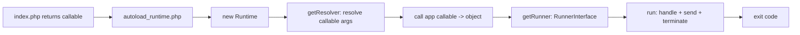

# Runtime Component

!!! tip "In a nutshell"
    The Runtime decouples your entry point from how the app is run, so the same
    `index.php` boots under PHP-FPM, CLI, Swoole or RoadRunner. Exam gold:
    `public/index.php` **returns** a callable (it never calls `handle()`), the
    default runtime is `SymfonyRuntime`, and `APP_RUNTIME` selects it.

!!! example "Real-world analogy"
    The Runtime is the stage crew of a theatre, and your `index.php` is only the play's
    script. The same script performs unchanged in an open-air amphitheatre (PHP-FPM), a
    tiny studio (the CLI), or a touring setup (Swoole, RoadRunner), because the crew — not
    the script — handles the lights, sound and curtain: setting the scene and taking the
    bows (`handle()`, `send()`, `terminate()`). The playwright merely hands over the script
    (returns a callable) and lets the crew run the venue; if the playwright grabs the
    lighting board mid-scene (calls `handle()` themselves), the show gets staged twice.

!!! abstract "Learning objectives"
    By the end of this chapter you can:

    - [ ] Explain the entry-point flow through `autoload_runtime.php`.
    - [ ] Describe `RuntimeInterface`, `SymfonyRuntime` and `GenericRuntime`.
    - [ ] Select a runtime with `APP_RUNTIME` and know what the callable may return.

    **Syllabus:** `Miscellaneous → Runtime` ·
    **Level:** Expert ·
    **Est. time:** 30 min ·
    **Prerequisites:** [Request Handling](../architecture/request-handling.md)

---

## Theory

The Runtime component decouples your app's **entry point** (the returned
callable in `public/index.php` or `bin/console`) from the mechanics of running
it — creating the `Request`, sending the `Response`, reading env/args. This lets
the *same* app boot under PHP-FPM, the CLI, or alternative runtimes (Swoole,
RoadRunner) by only swapping the runtime.

## Deep Dive — how it works internally

!!! question "Predict first"
    Your `public/index.php` builds a `Kernel` and calls `$kernel->handle(...)`
    itself, then the page comes back blank or duplicated. What did the Runtime
    expect instead?

??? note "Reveal"
    It expects you to **return** a callable that *produces* the app object — the
    runtime (via `autoload_runtime.php`) resolves its arguments and runs `handle()`,
    `send()` and `terminate()` for you. Calling `handle()` yourself double-runs it.

### The entry-point flow

`public/index.php` requires `vendor/autoload_runtime.php` and **returns** a
callable. `autoload_runtime.php` (generated by the Composer plugin) does the
orchestration:



1. `autoload_runtime.php` instantiates the runtime named by `APP_RUNTIME`
   (default `Symfony\Component\Runtime\SymfonyRuntime`).
2. `RuntimeInterface::getResolver($callable)` builds a `ResolverInterface` that
   **autowires the callable's arguments** — e.g. `array $context` (from
   `$_SERVER`), `Request`, `Command`, `InputInterface`, `OutputInterface`.
3. The callable is invoked and returns an **application object** (a `Kernel`,
   `Response`, `Command`, `int`, or a callable).
4. `RuntimeInterface::getRunner($app)` returns a
   `Symfony\Component\Runtime\RunnerInterface`; its `run(): int` executes the
   app and returns the exit code (for `Kernel`: `handle()` → `send()` →
   `terminate()`).

!!! note "Source reference"
    `Symfony\Component\Runtime\RuntimeInterface`, `SymfonyRuntime`, `GenericRuntime` —
    [symfony/symfony `8.0`](https://github.com/symfony/symfony/blob/8.0/src/Symfony/Component/Runtime/RuntimeInterface.php).

### The two built-in runtimes

- **`GenericRuntime`** — knows PHP superglobals/env only; runs any app object via
  matching `RunnerInterface`s. The base, framework-agnostic runtime.
- **`SymfonyRuntime`** — extends `GenericRuntime` with Symfony-aware resolvers and
  runners: it can inject a `Request`, `SymfonyStyle`, console `Input`/`Output`,
  and run a `HttpKernelInterface`/`Kernel` or a console `Application`/`Command`.

### Selecting a runtime

Set `APP_RUNTIME` (env var) or the `extra.runtime.class` key in `composer.json`
to a custom `RuntimeInterface` class. Alternative-server runtimes (RoadRunner,
Swoole) ship their own runtime class you point `APP_RUNTIME` at — no change to
`index.php`.

### What the callable may return

| Return type | Runner behaviour |
|---|---|
| `Kernel` / `HttpKernelInterface` | Create `Request`, `handle`, `send`, `terminate` |
| `Response` | `send()` it |
| `Command` / `Application` | Run as a console command |
| `int` | Used directly as the exit code |
| `callable` | Invoked, its result handled recursively |

## Configuration & code

=== "PHP Attributes"

    ```php
    <?php
    // public/index.php
    declare(strict_types=1);

    use App\Kernel;

    require_once dirname(__DIR__).'/vendor/autoload_runtime.php';

    return static function (array $context): Kernel {
        return new Kernel($context['APP_ENV'], (bool) $context['APP_DEBUG']);
    };
    ```

    ```php
    <?php
    // bin/console
    declare(strict_types=1);

    use App\Kernel;
    use Symfony\Bundle\FrameworkBundle\Console\Application;

    require_once dirname(__DIR__).'/vendor/autoload_runtime.php';

    return static function (array $context): Application {
        return new Application(new Kernel($context['APP_ENV'], (bool) $context['APP_DEBUG']));
    };
    ```

=== "YAML"

    ```yaml
    # Not YAML — configured via env/composer.json:
    # APP_RUNTIME=Symfony\Component\Runtime\SymfonyRuntime
    ```

=== "Console"

    ```console
    $ APP_RUNTIME='App\Runtime\MyRuntime' php bin/console cache:clear
    ```

## Best practices & anti-patterns

| ✅ Do | ❌ Avoid |
|---|---|
| Keep `index.php`/`console` tiny — just return a callable | Bootstrapping/handling manually |
| Let the resolver inject `array $context` etc. | Reading `$_SERVER` in the callable |
| Swap runtimes via `APP_RUNTIME` for Swoole/RoadRunner | Editing `index.php` per environment |

## When (not) to use it / alternatives

You almost never write a runtime; you rely on `SymfonyRuntime`. Provide a custom
`RuntimeInterface` only to integrate an alternative PHP server or to change how
the app object is created/run. The component is transparent for standard apps.

!!! danger "Certification traps"
    - `public/index.php` **returns** a callable; it does not call `handle()` itself.
    - Default runtime is **`SymfonyRuntime`** (extends `GenericRuntime`).
    - `APP_RUNTIME` (or `extra.runtime.class`) selects the runtime class.
    - The resolver **autowires** the callable's arguments (e.g. `array $context`).
    - `autoload_runtime.php` is generated by the Composer runtime plugin.

!!! warning "Common mistakes"
    - Forgetting to `return` the closure from `index.php`.
    - Expecting `Request::createFromGlobals()` in your code — the runtime does it.

## Exercises

1. **(Expert)** Write the `public/index.php` returning a `Kernel` via the runtime.
2. **(Expert)** Explain how the same app runs under a Swoole runtime without
   changing `index.php`.

??? success "Solutions"

    **1.** See the `index.php` snippet above — require `autoload_runtime.php` and
    return a closure that builds the `Kernel` from `$context`.

    **2.** Point `APP_RUNTIME` at the Swoole runtime class. `autoload_runtime.php`
    instantiates it; its runner keeps the kernel in memory and feeds it requests
    from the Swoole event loop — the returned callable is unchanged.

## Certification questions

??? question "Q1. What does `public/index.php` return?"
    - [x] A. A callable that produces the app object (e.g. a `Kernel`) ✅
    - [ ] B. A `Response`
    - [ ] C. Nothing — it echoes output

    **Why:** The runtime invokes the returned callable, resolving its arguments.
    **Ref:** [Runtime](https://symfony.com/doc/current/components/runtime.html).

??? question "Q2. Which env var selects the runtime class?"
    - [x] A. `APP_RUNTIME` ✅
    - [ ] B. `APP_ENV`
    - [ ] C. `SYMFONY_RUNTIME`

    **Why:** `APP_RUNTIME` (or composer `extra.runtime.class`) chooses the runtime.
    **Ref:** [Runtime](https://symfony.com/doc/current/components/runtime.html#using-the-runtime).

??? question "Q3. `SymfonyRuntime` extends which class?"
    - [x] A. `GenericRuntime` ✅
    - [ ] B. `HttpKernel`
    - [ ] C. `Kernel`

    **Why:** `SymfonyRuntime` adds Symfony-aware resolvers/runners on top of
    `GenericRuntime`. **Ref:** [Runtime source](https://github.com/symfony/symfony/blob/8.0/src/Symfony/Component/Runtime/SymfonyRuntime.php).

## Key takeaways

- Entry points return a callable; `autoload_runtime.php` runs it.
- `RuntimeInterface`: `getResolver()` (autowire args) + `getRunner()` (execute).
- `SymfonyRuntime` (default) extends `GenericRuntime`; select via `APP_RUNTIME`.
- The runtime creates the `Request`, sends the `Response`, calls `terminate()`.

## Last-minute revision

!!! tip "Cheat sheet"
    - `require vendor/autoload_runtime.php; return fn(array $context) => new Kernel(...)`.
    - `RuntimeInterface::getResolver()` + `getRunner()`; `RunnerInterface::run(): int`.
    - `APP_RUNTIME` env / `extra.runtime.class`. Default `SymfonyRuntime`.

## Connections

- **Depends on:** [Request Handling](../architecture/request-handling.md) — the runner drives `handle()`→`send()`→`terminate()`.
- **Reused in:** [Deployment](deployment.md) — swap runtimes (Swoole/RoadRunner) via `APP_RUNTIME`; [Configuration](configuration.md) supplies `$context`.
- **Confused with:** the `Kernel` itself — the runtime *runs* the kernel; it isn't the kernel.

## Official References
- [Official docs — Runtime](https://symfony.com/doc/current/components/runtime.html)
- [Symfony source — RuntimeInterface](https://github.com/symfony/symfony/blob/8.0/src/Symfony/Component/Runtime/RuntimeInterface.php)
- [Symfony source — SymfonyRuntime](https://github.com/symfony/symfony/blob/8.0/src/Symfony/Component/Runtime/SymfonyRuntime.php)

## Video references

!!! tip "Watch & learn"
    These are official, continuously-updated video channels — search them for
    "Symfony components" to reinforce this chapter. We link stable channels rather than
    individual videos so the references never rot.

    - [SymfonyCasts screencasts](https://symfonycasts.com/tracks/symfony) — scripted, code-along tutorials.
    - [Symfony official YouTube](https://www.youtube.com/@SymfonyOfficial) — SymfonyCon conference talks & keynotes.
    - [Official docs for this topic](https://symfony.com/doc/current/components/runtime.html) — some Symfony doc pages embed a screencast.

## Confidence check

I'm ready when I can:

- [ ] explain **why** returning a callable decouples the entry point from the server
- [ ] write `public/index.php`/`bin/console` returning a callable in Symfony 8
- [ ] debug a blank/duplicated response from calling `handle()` manually
- [ ] spot the trick: `index.php` returns a callable; default runtime is `SymfonyRuntime`
- [ ] describe `getResolver()` (autowire args) + `getRunner()` (execute)

---

<small>Related: [Request Handling](../architecture/request-handling.md) · [Configuration](configuration.md) · [Deployment](deployment.md)</small>
