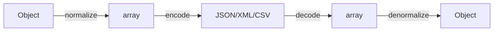

# Serializer Component

!!! tip "In a nutshell"
    Le Serializer transforme les objets en JSON/XML/CSV et inversement en deux étapes :
    les normalizers (objet ↔ tableau) puis les encoders (tableau ↔ chaîne). À retenir pour
    l'examen : `serialize()` = normaliser puis encoder, et `#[Groups]` ne filtre les champs
    que lorsque vous passez `['groups' => [...]]` dans le contexte.

!!! example "Real-world analogy"
    Sérialiser, c'est **faire sa valise** ; désérialiser, c'est la défaire.
    Les normalizers **plient vos objets dans un format plat et standard** (des tableaux) ;
    les encoders **compressent la valise en une seule chaîne** (JSON/XML/CSV) pour le voyage.
    À destination, vous décompressez (decode) puis dépliez (denormalize) pour retrouver
    des objets. `#[Groups]`, c'est décider quels articles vous emportez réellement pour ce voyage.

!!! abstract "Learning objectives"
    À la fin de ce chapitre, vous saurez :

    - [ ] Expliquer l'architecture normalizer + encoder et le flux serialize/deserialize.
    - [ ] Contrôler la sortie avec `#[Groups]`, `#[SerializedName]`, `#[Ignore]` et le contexte.
    - [ ] Choisir entre `ObjectNormalizer` et `PropertyNormalizer` et gérer les références circulaires.

    **Syllabus:** `Miscellaneous → Serializer` ·
    **Level:** Advanced → Expert ·
    **Est. time:** 45 min ·
    **Prerequisites:** [Dependency Injection](../dependency-injection/index.md)

---

## Theory

La sérialisation convertit un graphe d'objets vers un format (JSON, XML, CSV, YAML) et
inversement. Symfony scinde ce processus en deux étapes :

1. Les **normalizers** convertissent les objets ↔ **tableaux/scalaires** (la forme intermédiaire).
2. Les **encoders** convertissent cette forme intermédiaire ↔ une **chaîne** dans un format donné.

`serialize()` = normalize → encode ; `deserialize()` = decode → denormalize.

```php
use Symfony\Component\Serializer\Encoder\JsonEncoder;
use Symfony\Component\Serializer\Normalizer\ObjectNormalizer;
use Symfony\Component\Serializer\Serializer;

$serializer = new Serializer([new ObjectNormalizer()], [new JsonEncoder()]);

// serialize() = normalize (object → array) then encode (array → JSON string)
$json = $serializer->serialize($user, 'json');

// deserialize() = decode (JSON → array) then denormalize (array → object)
$user = $serializer->deserialize($json, UserDto::class, 'json');
```

## Deep Dive — how it works internally

!!! question "Predict first"
    Un `UserDto` porte `#[Groups(['read'])]` sur `$name`. Vous appelez
    `serialize($dto, 'json')` **sans** contexte. Quels champs se retrouvent dans le JSON ?

??? note "Reveal"
    **Tous** les champs lisibles (seul `#[Ignore]` est exclu). Le filtrage par groupes ne
    s'active que lorsque vous passez `['groups' => ['read']]` dans le contexte ; sans groupes,
    les attributs `#[Groups]` sont ignorés et chaque propriété est émise.

### The two-stage pipeline



`Symfony\Component\Serializer\Serializer` détient une liste ordonnée de
`NormalizerInterface`/`DenormalizerInterface` et d'`EncoderInterface`/`DecoderInterface`.
Pour une valeur donnée, il choisit le **premier** normalizer dont
`supportsNormalization()` retourne true, et l'encoder correspondant au format
demandé.

```php
use Symfony\Component\Serializer\Encoder\JsonEncoder;
use Symfony\Component\Serializer\Encoder\XmlEncoder;
use Symfony\Component\Serializer\Normalizer\DateTimeNormalizer;
use Symfony\Component\Serializer\Normalizer\ObjectNormalizer;
use Symfony\Component\Serializer\Serializer;

$serializer = new Serializer(
    [new DateTimeNormalizer(), new ObjectNormalizer()], // Normalizer/DenormalizerInterface list
    [new JsonEncoder(), new XmlEncoder()],              // Encoder/DecoderInterface list
);
// For a \DateTimeImmutable, DateTimeNormalizer::supportsNormalization() matches first;
// the encoder is picked by the requested format ('json', 'xml', ...)
```

| Role | FQCN |
|---|---|
| Facade | `Symfony\Component\Serializer\Serializer` |
| Object normalizer | `Symfony\Component\Serializer\Normalizer\ObjectNormalizer` |
| Property normalizer | `Symfony\Component\Serializer\Normalizer\PropertyNormalizer` |
| Array denormalizer | `Symfony\Component\Serializer\Normalizer\ArrayDenormalizer` |
| JSON encoder | `Symfony\Component\Serializer\Encoder\JsonEncoder` |
| XML encoder | `Symfony\Component\Serializer\Encoder\XmlEncoder` |
| CSV encoder | `Symfony\Component\Serializer\Encoder\CsvEncoder` |

### ObjectNormalizer vs PropertyNormalizer

- **`ObjectNormalizer`** (par défaut) lit/écrit via les **getters/setters/hassers/issers**
  et le constructeur. Il respecte le composant `PropertyAccess`. Le plus flexible.
- **`PropertyNormalizer`** lit/écrit **directement les propriétés** de l'objet (y compris
  privées, via la réflexion), en ignorant les accesseurs.
- `GetSetMethodNormalizer` n'utilise que les méthodes get/set.

```php
use Symfony\Component\Serializer\Normalizer\GetSetMethodNormalizer;
use Symfony\Component\Serializer\Normalizer\ObjectNormalizer;
use Symfony\Component\Serializer\Normalizer\PropertyNormalizer;

// ObjectNormalizer (default): getters/setters/hassers/issers + constructor,
// resolved through the PropertyAccess component
(new ObjectNormalizer())->normalize($user);       // calls getName(), isAdmin()...

// PropertyNormalizer: reflection on properties, even private — accessors ignored
(new PropertyNormalizer())->normalize($user);

// GetSetMethodNormalizer: strictly get*/set* methods
(new GetSetMethodNormalizer())->normalize($user);
```

### Attributes that shape output

- `#[Groups(['read'])]` — inclut une propriété uniquement lorsque ce groupe figure dans le
  contexte (`['groups' => ['read']]`). Permet la (dé)sérialisation partielle.
- `#[SerializedName('full_name')]` — renomme une propriété dans la sortie.
- `#[Ignore]` — ne (dé)sérialise jamais cette propriété.
- `#[Context(...)]` / `#[MaxDepth(2)]` — contexte par propriété et limites de profondeur.

Les métadonnées sont lues par la `ClassMetadataFactory` depuis les attributs (Symfony 8
utilise les attributs PHP, pas les annotations).

```php
use Symfony\Component\Serializer\Attribute\Context;
use Symfony\Component\Serializer\Attribute\Groups;
use Symfony\Component\Serializer\Attribute\Ignore;
use Symfony\Component\Serializer\Attribute\MaxDepth;
use Symfony\Component\Serializer\Attribute\SerializedName;
use Symfony\Component\Serializer\Normalizer\DateTimeNormalizer;

final class ArticleDto
{
    #[Groups(['read'])]           // emitted only with ['groups' => ['read']] in context
    #[SerializedName('headline')] // renamed in the payload
    public string $title;

    #[Ignore]                     // never (de)serialized
    public string $internalToken;

    #[Context([DateTimeNormalizer::FORMAT_KEY => 'Y-m-d'])] // per-property context
    public \DateTimeImmutable $publishedAt;

    #[MaxDepth(2)]                // depth limit (needs enable_max_depth)
    public ?ArticleDto $parent = null;
}
```

### Context

Le tableau `$context` ajuste le comportement : `groups`, `AbstractObjectNormalizer::SKIP_NULL_VALUES`,
`DateTimeNormalizer::FORMAT_KEY`, `AbstractNormalizer::ATTRIBUTES` (liste blanche
de champs), `AbstractNormalizer::IGNORED_ATTRIBUTES`, et
`AbstractNormalizer::CIRCULAR_REFERENCE_HANDLER`.

```php
use Symfony\Component\Serializer\Normalizer\AbstractNormalizer;
use Symfony\Component\Serializer\Normalizer\AbstractObjectNormalizer;
use Symfony\Component\Serializer\Normalizer\DateTimeNormalizer;

$json = $serializer->serialize($user, 'json', [
    'groups' => ['read'],                                       // activate #[Groups]
    AbstractObjectNormalizer::SKIP_NULL_VALUES => true,         // drop null keys
    DateTimeNormalizer::FORMAT_KEY => \DateTimeInterface::ATOM, // date format
    AbstractNormalizer::ATTRIBUTES => ['name', 'email'],        // field whitelist
    AbstractNormalizer::IGNORED_ATTRIBUTES => ['passwordHash'], // field blacklist
    AbstractNormalizer::CIRCULAR_REFERENCE_HANDLER => fn ($o) => $o->getId(),
]);
```

### Circular references

Un graphe parent→enfant→parent bouclerait indéfiniment. `ObjectNormalizer` détecte ce cas
via une **limite de références circulaires** (1 par défaut) et lève une
`CircularReferenceException`, sauf si vous définissez un
`CIRCULAR_REFERENCE_HANDLER` (par exemple retourner l'id de l'entité) ou limitez la
profondeur avec `#[MaxDepth]` + le contexte `enable_max_depth`.

```php
// Option A: handler — replace the repeated object instead of throwing
// CircularReferenceException (ObjectNormalizer's limit defaults to 1)
$context = [
    AbstractNormalizer::CIRCULAR_REFERENCE_HANDLER => fn (object $o) => $o->getId(),
];

// Option B: cap the graph with #[MaxDepth(1)] on the property, then enable it
$context = [AbstractObjectNormalizer::ENABLE_MAX_DEPTH => true]; // 'enable_max_depth'

$json = $serializer->serialize($category, 'json', $context);
```

!!! note "Source reference"
    `Symfony\Component\Serializer\Serializer::serialize()` et
    `AbstractObjectNormalizer` (gestion des références circulaires) —
    [symfony/symfony `8.0`](https://github.com/symfony/symfony/blob/8.0/src/Symfony/Component/Serializer/Serializer.php).

### Null behavior

Par défaut, une propriété `null` **est** sérialisée : `ObjectNormalizer` émet
`"nickname":null` dans la sortie. Pour supprimer entièrement les valeurs null, passez la
clé de contexte `AbstractObjectNormalizer::SKIP_NULL_VALUES` (l'option de contexte par
défaut `skip_null_values`) — les clés à valeur null sont alors omises du payload.
Dans l'autre sens, une clé JSON **absente** se dénormalise vers la valeur par défaut de la
propriété (ou `null` pour une propriété typée nullable sans valeur par défaut) ; un
`null` présent la met à null. Le bug classique : activer `skip_null_values`, puis un
consommateur qui traite une clé absente comme une erreur au lieu de « la valeur était null ».

```php
$dto = new UserDto(name: 'Ada', nickname: null);

$serializer->serialize($dto, 'json');
// {"name":"Ada","nickname":null}  — ObjectNormalizer emits null by default

$serializer->serialize($dto, 'json', [
    AbstractObjectNormalizer::SKIP_NULL_VALUES => true, // = 'skip_null_values'
]);
// {"name":"Ada"} — the null-valued key is omitted entirely
```

!!! note "Null in real life"
    Une propriété null est un **emplacement vide dans la valise** : `skip_null_values`
    décide si vous emballez cet emplacement en le laissant visiblement vide, ou si vous
    l'omettez carrément du bagage.

!!! info "Expert note"
    L'**ordre des normalizers compte**. Le `Serializer` choisit le *premier* normalizer
    dont `supportsNormalization()` retourne true : un normalizer personnalisé trop large,
    enregistré avec une priorité élevée, peut donc masquer silencieusement `ObjectNormalizer`.
    Les normalizers intégrés comme `DateTimeNormalizer` et `BackedEnumNormalizer` sont
    ordonnés par la priorité du tag `serializer.normalizer` — inspectez `debug:container`
    quand le type de sortie semble incorrect.

??? example "Debugging story"
    **Symptôme :** une API retournait par intermittence `{}` pour certaines entités.
    **Diagnostic :** ces objets étaient des **proxies lazy de Doctrine** ; `ObjectNormalizer`
    lisait le proxy non initialisé avant son aller-retour en base, si bien que les getters ne
    retournaient rien. **Correctif :** initialiser d'abord l'association (ou, mieux, sérialiser
    un DTO simple que vous contrôlez) et ajouter des groupes pour ne demander que les champs
    chargés. **À éviter :** sérialiser directement des entités — mappez-les vers un DTO.

??? abstract "Source-code tour"
    - `Symfony\Component\Serializer\Serializer` détient des listes ordonnées de
      `Normalizer\NormalizerInterface` + `Encoder\EncoderInterface` et
      délègue via `supports*()`.
    - `serialize()` = `normalize()` (objet → tableau via le premier normalizer
      correspondant) puis `encode()` (tableau → chaîne via l'encoder du format).
    - `Normalizer\ObjectNormalizer` lit les métadonnées depuis
      `Mapping\Factory\ClassMetadataFactory` pour appliquer `Attribute\Groups`,
      `Attribute\SerializedName`, `Attribute\Ignore`.
    - `Normalizer\AbstractObjectNormalizer` suit la limite de références circulaires et
      invoque le `CIRCULAR_REFERENCE_HANDLER` quand elle est dépassée.

## Configuration & code

=== "PHP Attributes"

    ```php
    <?php
    declare(strict_types=1);

    namespace App\Dto;

    use Symfony\Component\Serializer\Attribute\Groups;
    use Symfony\Component\Serializer\Attribute\Ignore;
    use Symfony\Component\Serializer\Attribute\SerializedName;

    final class UserDto
    {
        public function __construct(
            #[Groups(['read'])]
            #[SerializedName('full_name')]
            public string $name,

            #[Groups(['read', 'admin'])]
            public string $email,

            #[Ignore]
            public string $passwordHash = '',
        ) {}
    }
    ```

    ```php
    <?php
    declare(strict_types=1);

    use App\Dto\UserDto;
    use Symfony\Component\Serializer\SerializerInterface;

    /** @var SerializerInterface $serializer */
    $json = $serializer->serialize(
        new UserDto('Ada Lovelace', 'ada@example.com'),
        'json',
        ['groups' => ['read']],
    ); // {"full_name":"Ada Lovelace","email":"ada@example.com"}
    ```

=== "YAML"

    ```yaml
    # config/packages/framework.yaml
    framework:
        serializer:
            enabled: true
            default_context:
                skip_null_values: true
    ```

=== "Console"

    ```console
    $ php bin/console debug:container serializer
    ```

## Best practices & anti-patterns

| ✅ Do | ❌ Avoid |
|---|---|
| Utiliser `#[Groups]` pour des jeux de champs par endpoint | Sérialiser aveuglément des entités complètes |
| `#[Ignore]` sur les secrets (hashes de mot de passe, tokens) | Laisser fuiter des champs sensibles |
| Définir un handler de références circulaires pour les graphes | Subir une `CircularReferenceException` en prod |
| Préférer `ObjectNormalizer` sauf besoin de propriétés brutes | `PropertyNormalizer` sur des objets avec de la logique dans les accesseurs |

## When (not) to use it / alternatives

Utilisez le Serializer pour les API et l'échange de données. Pour du JSON simple et
entièrement maîtrisé, `json_encode` peut suffire. Pour le mapping request→DTO dans les
controllers, utilisez `#[MapRequestPayload]` (construit sur le Serializer). Les graphes
d'objets profonds gagnent à combiner groupes + max-depth pour garder des payloads bornés.

!!! danger "Certification traps"
    - `serialize()` = normalize **puis** encode ; `deserialize()` = decode **puis** denormalize.
    - `#[Groups]` ne filtre que lorsque `groups` est passé dans le **contexte**.
    - `ObjectNormalizer` utilise les accesseurs ; `PropertyNormalizer` utilise directement les propriétés.
    - La **limite de références circulaires par défaut est 1** — définissez un handler ou `#[MaxDepth]`.
    - Symfony 8 utilise les **attributs** PHP (`Symfony\Component\Serializer\Attribute\*`), pas les annotations.

!!! warning "Common mistakes"
    - Oublier de passer `['groups' => [...]]` et obtenir tous les champs.
    - Attendre des propriétés privées en sortie avec `ObjectNormalizer` sans getter.

## Exercises

1. **(Advanced)** Sérialisez un DTO en n'exposant que le groupe `read`, en renommant `name`
   en `full_name` et en masquant `passwordHash`.
2. **(Expert)** Expliquez deux façons de sérialiser un graphe d'objets auto-référencé
   sans exception.

??? success "Solutions"

    **1.** Voir `UserDto` + l'appel `serialize(..., ['groups' => ['read']])` ci-dessus.

    **2.** (a) Définir `AbstractNormalizer::CIRCULAR_REFERENCE_HANDLER` dans le contexte pour
    retourner, par exemple, l'id de l'objet ; ou (b) annoter les relations avec `#[MaxDepth(n)]`
    et passer `['enable_max_depth' => true]`.

## Certification questions

??? question "Q1. In `serialize()`, which runs first?"
    - [x] A. Normalizer, then encoder ✅
    - [ ] B. Encoder, then normalizer
    - [ ] C. They run in parallel

    **Why:** Les objets sont normalisés en tableaux, puis encodés en chaîne.
    **Ref:** [Serializer](https://symfony.com/doc/current/components/serializer.html).

??? question "Q2. Which normalizer reads private properties directly?"
    - [ ] A. `ObjectNormalizer`
    - [x] B. `PropertyNormalizer` ✅
    - [ ] C. `GetSetMethodNormalizer`

    **Why:** `PropertyNormalizer` utilise la réflexion sur les propriétés, en contournant les accesseurs.
    **Ref:** [Normalizers](https://symfony.com/doc/current/serializer.html#normalizers).

??? question "Q3. `#[Groups(['read'])]` takes effect when…"
    - [x] A. `['groups' => ['read']]` is passed in the context ✅
    - [ ] B. always, regardless of context
    - [ ] C. only during deserialization

    **Why:** Le filtrage par groupes ne s'applique que lorsque les groupes correspondants figurent dans le contexte.
    **Ref:** [Serialization groups](https://symfony.com/doc/current/serializer.html#using-serialization-groups-attributes).

## Key takeaways

- Deux étapes : les normalizers (objet↔tableau) + les encoders (tableau↔chaîne).
- `serialize` = normalize→encode ; `deserialize` = decode→denormalize.
- `#[Groups]`, `#[SerializedName]`, `#[Ignore]` et le contexte ajustent la sortie.
- `ObjectNormalizer` (accesseurs) vs `PropertyNormalizer` (propriétés).
- Références circulaires : la limite est 1 → utilisez un handler ou `#[MaxDepth]`.

## Last-minute revision

!!! tip "Cheat sheet"
    - `serialize($data, 'json', $context)` / `deserialize($str, Type::class, 'json')`.
    - Clés de contexte : `groups`, `skip_null_values`, `datetime_format`, `enable_max_depth`.
    - Namespace des attributs : `Symfony\Component\Serializer\Attribute`.
    - Encoders : `JsonEncoder`, `XmlEncoder`, `CsvEncoder`, `YamlEncoder`.

## Connections

- **Depends on:** [Dependency Injection](../dependency-injection/index.md) — les normalizers et encoders sont des services taggés injectés par autowiring dans le `serializer`.
- **Reused in:** [Messenger](messenger.md) — un serializer de transport peut utiliser le Serializer pour encoder les envelopes entre langages ; [Mailer](mailer.md) partage le même câblage DI.
- **Confused with:** le `json_encode` de PHP — le Serializer ajoute la normalisation, les groupes et la dénormalisation vers des objets typés.

## Official References
- [Official docs — Serializer](https://symfony.com/doc/current/serializer.html)
- [Official docs — Serializer component](https://symfony.com/doc/current/components/serializer.html)
- [Symfony source — Serializer](https://github.com/symfony/symfony/blob/8.0/src/Symfony/Component/Serializer/Serializer.php)

## Video references

!!! tip "Watch & learn"
    Ce sont des chaînes vidéo officielles, mises à jour en continu — cherchez-y
    "Symfony components" pour consolider ce chapitre. Nous référençons des chaînes stables
    plutôt que des vidéos individuelles afin que les références ne périment jamais.

    - [SymfonyCasts screencasts](https://symfonycasts.com/tracks/symfony) — tutoriels scénarisés, à coder en suivant.
    - [Symfony official YouTube](https://www.youtube.com/@SymfonyOfficial) — conférences et keynotes de SymfonyCon.
    - [Official docs for this topic](https://symfony.com/doc/current/components/serializer.html) — certaines pages de la doc Symfony intègrent un screencast.

## Confidence check

Je suis prêt quand je peux :

- [ ] expliquer **pourquoi** les normalizers et les encoders sont des étapes séparées
- [ ] contrôler la sortie avec `#[Groups]`/`#[SerializedName]`/`#[Ignore]` + le contexte dans Symfony 8
- [ ] déboguer « tous les champs ont fuité » (contexte `groups` oublié) et une `CircularReferenceException`
- [ ] repérer le piège : `#[Groups]` ne filtre que lorsque `groups` est dans le contexte
- [ ] décrire comment le `Serializer` sélectionne un normalizer via `supportsNormalization()`

---

<small>Related: [Messenger](messenger.md) · [Mailer](mailer.md) · [Intl](intl.md)</small>
