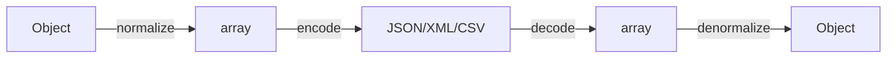

# Serializer Component

!!! abstract "Learning objectives"
    By the end of this chapter you can:

    - [ ] Explain the normalizer + encoder architecture and the serialize/deserialize flow.
    - [ ] Control output with `#[Groups]`, `#[SerializedName]`, `#[Ignore]` and context.
    - [ ] Choose between `ObjectNormalizer` and `PropertyNormalizer` and handle circular refs.

    **Syllabus:** `Miscellaneous → Serializer` ·
    **Level:** Advanced → Expert ·
    **Est. time:** 45 min ·
    **Prerequisites:** [Dependency Injection](../dependency-injection/index.md)

---

## Theory

Serialization converts an object graph into a format (JSON, XML, CSV, YAML) and
back. Symfony splits this in two stages:

1. **Normalizers** turn objects ↔ **arrays/scalars** (the intermediate form).
2. **Encoders** turn that intermediate form ↔ a **string** in a format.

`serialize()` = normalize → encode; `deserialize()` = decode → denormalize.

## Deep Dive — how it works internally

### The two-stage pipeline



`Symfony\Component\Serializer\Serializer` holds an ordered list of
`NormalizerInterface`/`DenormalizerInterface` and `EncoderInterface`/`DecoderInterface`.
For a given value it picks the **first** normalizer whose
`supportsNormalization()` returns true, and the encoder matching the requested
format.

| Role | FQCN |
|---|---|
| Facade | `Symfony\Component\Serializer\Serializer` |
| Object normalizer | `Symfony\Component\Serializer\Normalizer\ObjectNormalizer` |
| Property normalizer | `Symfony\Component\Serializer\Normalizer\PropertyNormalizer` |
| Array denormalizer | `Symfony\Component\Serializer\Normalizer\ArrayDenormalizer` |
| JSON encoder | `Symfony\Component\Serializer\Encoder\JsonEncoder` |
| XML encoder | `Symfony\Component\Serializer\Encoder\XmlEncoder` |
| CSV encoder | `Symfony\Component\Serializer\Encoder\CsvEncoder` |

### ObjectNormalizer vs PropertyNormalizer

- **`ObjectNormalizer`** (default) reads/writes through **getters/setters/hassers/issers**
  and the constructor. Respects the `PropertyAccess` component. Most flexible.
- **`PropertyNormalizer`** reads/writes object **properties directly** (including
  private, via reflection), ignoring accessors.
- `GetSetMethodNormalizer` uses only get/set methods.

### Attributes that shape output

- `#[Groups(['read'])]` — include a property only when that group is in the
  context (`['groups' => ['read']]`). Enables partial (de)serialization.
- `#[SerializedName('full_name')]` — rename a property in the output.
- `#[Ignore]` — never (de)serialize this property.
- `#[Context(...)]` / `#[MaxDepth(2)]` — per-property context and depth limits.

Metadata is read by `ClassMetadataFactory` from attributes (Symfony 8 uses PHP
attributes, not annotations).

### Context

The `$context` array tunes behaviour: `groups`, `AbstractObjectNormalizer::SKIP_NULL_VALUES`,
`DateTimeNormalizer::FORMAT_KEY`, `AbstractNormalizer::ATTRIBUTES` (field
whitelist), `AbstractNormalizer::IGNORED_ATTRIBUTES`, and
`AbstractNormalizer::CIRCULAR_REFERENCE_HANDLER`.

### Circular references

A parent→child→parent graph would loop forever. `ObjectNormalizer` detects this
via a **circular reference limit** (default 1) and throws
`CircularReferenceException` unless you set a
`CIRCULAR_REFERENCE_HANDLER` (e.g. return the entity id) or limit depth with
`#[MaxDepth]` + `enable_max_depth` context.

!!! note "Source reference"
    `Symfony\Component\Serializer\Serializer::serialize()` and
    `AbstractObjectNormalizer` (circular-ref handling) —
    [symfony/symfony `8.0`](https://github.com/symfony/symfony/blob/8.0/src/Symfony/Component/Serializer/Serializer.php).

## Configuration & code

=== "PHP Attributes"

    ```php
    <?php
    declare(strict_types=1);

    namespace App\Dto;

    use Symfony\Component\Serializer\Attribute\Groups;
    use Symfony\Component\Serializer\Attribute\Ignore;
    use Symfony\Component\Serializer\Attribute\SerializedName;

    final class UserDto
    {
        public function __construct(
            #[Groups(['read'])]
            #[SerializedName('full_name')]
            public string $name,

            #[Groups(['read', 'admin'])]
            public string $email,

            #[Ignore]
            public string $passwordHash = '',
        ) {}
    }
    ```

    ```php
    <?php
    declare(strict_types=1);

    use App\Dto\UserDto;
    use Symfony\Component\Serializer\SerializerInterface;

    /** @var SerializerInterface $serializer */
    $json = $serializer->serialize(
        new UserDto('Ada Lovelace', 'ada@example.com'),
        'json',
        ['groups' => ['read']],
    ); // {"full_name":"Ada Lovelace","email":"ada@example.com"}
    ```

=== "YAML"

    ```yaml
    # config/packages/framework.yaml
    framework:
        serializer:
            enabled: true
            default_context:
                skip_null_values: true
    ```

=== "Console"

    ```console
    $ php bin/console debug:container serializer
    ```

## Best practices & anti-patterns

| ✅ Do | ❌ Avoid |
|---|---|
| Use `#[Groups]` for per-endpoint field sets | Serializing full entities blindly |
| `#[Ignore]` secrets (password hashes, tokens) | Leaking sensitive fields |
| Set a circular-reference handler for graphs | Hitting `CircularReferenceException` in prod |
| Prefer `ObjectNormalizer` unless you need raw properties | `PropertyNormalizer` on objects with logic in accessors |

## When (not) to use it / alternatives

Use the Serializer for APIs and data exchange. For simple, fully-controlled JSON,
`json_encode` may suffice. For request→DTO mapping in controllers use
`#[MapRequestPayload]` (built on the Serializer). Deep object graphs benefit from
groups + max-depth to keep payloads bounded.

!!! danger "Certification traps"
    - `serialize()` = normalize **then** encode; `deserialize()` = decode **then** denormalize.
    - `#[Groups]` filters only when `groups` is passed in the **context**.
    - `ObjectNormalizer` uses accessors; `PropertyNormalizer` uses properties directly.
    - Default **circular reference limit is 1** — set a handler or `#[MaxDepth]`.
    - Symfony 8 uses PHP **attributes** (`Symfony\Component\Serializer\Attribute\*`), not annotations.

!!! warning "Common mistakes"
    - Forgetting to pass `['groups' => [...]]` and getting all fields.
    - Expecting private properties out with `ObjectNormalizer` and no getter.

## Exercises

1. **(Advanced)** Serialize a DTO exposing only the `read` group, renaming `name`
   to `full_name` and hiding `passwordHash`.
2. **(Expert)** Explain two ways to serialize a self-referencing object graph
   without an exception.

??? success "Solutions"

    **1.** See `UserDto` + the `serialize(..., ['groups' => ['read']])` call above.

    **2.** (a) Set `AbstractNormalizer::CIRCULAR_REFERENCE_HANDLER` in context to
    return, e.g., the object id; or (b) annotate relations with `#[MaxDepth(n)]`
    and pass `['enable_max_depth' => true]`.

## Certification questions

??? question "Q1. In `serialize()`, which runs first?"
    - [x] A. Normalizer, then encoder ✅
    - [ ] B. Encoder, then normalizer
    - [ ] C. They run in parallel

    **Why:** Objects are normalized to arrays, then encoded to a string.
    **Ref:** [Serializer](https://symfony.com/doc/current/components/serializer.html).

??? question "Q2. Which normalizer reads private properties directly?"
    - [ ] A. `ObjectNormalizer`
    - [x] B. `PropertyNormalizer` ✅
    - [ ] C. `GetSetMethodNormalizer`

    **Why:** `PropertyNormalizer` uses reflection on properties, bypassing accessors.
    **Ref:** [Normalizers](https://symfony.com/doc/current/serializer.html#normalizers).

??? question "Q3. `#[Groups(['read'])]` takes effect when…"
    - [x] A. `['groups' => ['read']]` is passed in the context ✅
    - [ ] B. always, regardless of context
    - [ ] C. only during deserialization

    **Why:** Group filtering only applies when the matching groups are in context.
    **Ref:** [Serialization groups](https://symfony.com/doc/current/serializer.html#using-serialization-groups-attributes).

## Key takeaways

- Two stages: normalizers (object↔array) + encoders (array↔string).
- `serialize` = normalize→encode; `deserialize` = decode→denormalize.
- `#[Groups]`, `#[SerializedName]`, `#[Ignore]`, context tune the output.
- `ObjectNormalizer` (accessors) vs `PropertyNormalizer` (properties).
- Circular refs: limit is 1 → use a handler or `#[MaxDepth]`.

## Last-minute revision

!!! tip "Cheat sheet"
    - `serialize($data, 'json', $context)` / `deserialize($str, Type::class, 'json')`.
    - Context keys: `groups`, `skip_null_values`, `datetime_format`, `enable_max_depth`.
    - Attributes namespace: `Symfony\Component\Serializer\Attribute`.
    - Encoders: `JsonEncoder`, `XmlEncoder`, `CsvEncoder`, `YamlEncoder`.

## References

- [Official docs — Serializer](https://symfony.com/doc/current/serializer.html)
- [Official docs — Serializer component](https://symfony.com/doc/current/components/serializer.html)
- [Symfony source — Serializer](https://github.com/symfony/symfony/blob/8.0/src/Symfony/Component/Serializer/Serializer.php)

---

<small>Related: [Messenger](messenger.md) · [Mailer](mailer.md) · [Intl](intl.md)</small>
