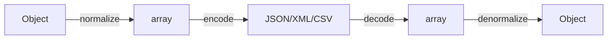

# Serializer Component

!!! tip "In a nutshell"
    The Serializer turns objects into JSON/XML/CSV and back in two stages:
    normalizers (object ↔ array) then encoders (array ↔ string). Exam gold:
    `serialize()` = normalize then encode, and `#[Groups]` only filters fields
    when you pass `['groups' => [...]]` in the context.

!!! example "Real-world analogy"
    Serializing is **packing a suitcase**; deserializing is unpacking it.
    Normalizers **fold your objects into a flat, standard layout** (arrays);
    encoders **zip the suitcase into one string** (JSON/XML/CSV) for travel. At
    the destination you unzip (decode) then unfold (denormalize) back into
    objects. `#[Groups]` is deciding which items you actually pack for this trip.

!!! abstract "Learning objectives"
    By the end of this chapter you can:

    - [ ] Explain the normalizer + encoder architecture and the serialize/deserialize flow.
    - [ ] Control output with `#[Groups]`, `#[SerializedName]`, `#[Ignore]` and context.
    - [ ] Choose between `ObjectNormalizer` and `PropertyNormalizer` and handle circular refs.

    **Syllabus:** `Miscellaneous → Serializer` ·
    **Level:** Advanced → Expert ·
    **Est. time:** 45 min ·
    **Prerequisites:** [Dependency Injection](../dependency-injection/index.md)

---

## Theory

Serialization converts an object graph into a format (JSON, XML, CSV, YAML) and
back. Symfony splits this in two stages:

1. **Normalizers** turn objects ↔ **arrays/scalars** (the intermediate form).
2. **Encoders** turn that intermediate form ↔ a **string** in a format.

`serialize()` = normalize → encode; `deserialize()` = decode → denormalize.

```php
use Symfony\Component\Serializer\Encoder\JsonEncoder;
use Symfony\Component\Serializer\Normalizer\ObjectNormalizer;
use Symfony\Component\Serializer\Serializer;

$serializer = new Serializer([new ObjectNormalizer()], [new JsonEncoder()]);

// serialize() = normalize (object → array) then encode (array → JSON string)
$json = $serializer->serialize($user, 'json');

// deserialize() = decode (JSON → array) then denormalize (array → object)
$user = $serializer->deserialize($json, UserDto::class, 'json');
```

## Deep Dive — how it works internally

!!! question "Predict first"
    A `UserDto` carries `#[Groups(['read'])]` on `$name`. You call
    `serialize($dto, 'json')` with **no** context. Which fields land in the JSON?

??? note "Reveal"
    **All** readable ones (only `#[Ignore]` is dropped). Group filtering activates
    only when you pass `['groups' => ['read']]` in the context; with no groups the
    `#[Groups]` attributes are ignored and every property is emitted.

### The two-stage pipeline



`Symfony\Component\Serializer\Serializer` holds an ordered list of
`NormalizerInterface`/`DenormalizerInterface` and `EncoderInterface`/`DecoderInterface`.
For a given value it picks the **first** normalizer whose
`supportsNormalization()` returns true, and the encoder matching the requested
format.

```php
use Symfony\Component\Serializer\Encoder\JsonEncoder;
use Symfony\Component\Serializer\Encoder\XmlEncoder;
use Symfony\Component\Serializer\Normalizer\DateTimeNormalizer;
use Symfony\Component\Serializer\Normalizer\ObjectNormalizer;
use Symfony\Component\Serializer\Serializer;

$serializer = new Serializer(
    [new DateTimeNormalizer(), new ObjectNormalizer()], // Normalizer/DenormalizerInterface list
    [new JsonEncoder(), new XmlEncoder()],              // Encoder/DecoderInterface list
);
// For a \DateTimeImmutable, DateTimeNormalizer::supportsNormalization() matches first;
// the encoder is picked by the requested format ('json', 'xml', ...)
```

| Role | FQCN |
|---|---|
| Facade | `Symfony\Component\Serializer\Serializer` |
| Object normalizer | `Symfony\Component\Serializer\Normalizer\ObjectNormalizer` |
| Property normalizer | `Symfony\Component\Serializer\Normalizer\PropertyNormalizer` |
| Array denormalizer | `Symfony\Component\Serializer\Normalizer\ArrayDenormalizer` |
| JSON encoder | `Symfony\Component\Serializer\Encoder\JsonEncoder` |
| XML encoder | `Symfony\Component\Serializer\Encoder\XmlEncoder` |
| CSV encoder | `Symfony\Component\Serializer\Encoder\CsvEncoder` |

### ObjectNormalizer vs PropertyNormalizer

- **`ObjectNormalizer`** (default) reads/writes through **getters/setters/hassers/issers**
  and the constructor. Respects the `PropertyAccess` component. Most flexible.
- **`PropertyNormalizer`** reads/writes object **properties directly** (including
  private, via reflection), ignoring accessors.
- `GetSetMethodNormalizer` uses only get/set methods.

```php
use Symfony\Component\Serializer\Normalizer\GetSetMethodNormalizer;
use Symfony\Component\Serializer\Normalizer\ObjectNormalizer;
use Symfony\Component\Serializer\Normalizer\PropertyNormalizer;

// ObjectNormalizer (default): getters/setters/hassers/issers + constructor,
// resolved through the PropertyAccess component
(new ObjectNormalizer())->normalize($user);       // calls getName(), isAdmin()...

// PropertyNormalizer: reflection on properties, even private — accessors ignored
(new PropertyNormalizer())->normalize($user);

// GetSetMethodNormalizer: strictly get*/set* methods
(new GetSetMethodNormalizer())->normalize($user);
```

### Attributes that shape output

- `#[Groups(['read'])]` — include a property only when that group is in the
  context (`['groups' => ['read']]`). Enables partial (de)serialization.
- `#[SerializedName('full_name')]` — rename a property in the output.
- `#[Ignore]` — never (de)serialize this property.
- `#[Context(...)]` / `#[MaxDepth(2)]` — per-property context and depth limits.

Metadata is read by `ClassMetadataFactory` from attributes (Symfony 8 uses PHP
attributes, not annotations).

```php
use Symfony\Component\Serializer\Attribute\Context;
use Symfony\Component\Serializer\Attribute\Groups;
use Symfony\Component\Serializer\Attribute\Ignore;
use Symfony\Component\Serializer\Attribute\MaxDepth;
use Symfony\Component\Serializer\Attribute\SerializedName;
use Symfony\Component\Serializer\Normalizer\DateTimeNormalizer;

final class ArticleDto
{
    #[Groups(['read'])]           // emitted only with ['groups' => ['read']] in context
    #[SerializedName('headline')] // renamed in the payload
    public string $title;

    #[Ignore]                     // never (de)serialized
    public string $internalToken;

    #[Context([DateTimeNormalizer::FORMAT_KEY => 'Y-m-d'])] // per-property context
    public \DateTimeImmutable $publishedAt;

    #[MaxDepth(2)]                // depth limit (needs enable_max_depth)
    public ?ArticleDto $parent = null;
}
```

### Context

The `$context` array tunes behaviour: `groups`, `AbstractObjectNormalizer::SKIP_NULL_VALUES`,
`DateTimeNormalizer::FORMAT_KEY`, `AbstractNormalizer::ATTRIBUTES` (field
whitelist), `AbstractNormalizer::IGNORED_ATTRIBUTES`, and
`AbstractNormalizer::CIRCULAR_REFERENCE_HANDLER`.

```php
use Symfony\Component\Serializer\Normalizer\AbstractNormalizer;
use Symfony\Component\Serializer\Normalizer\AbstractObjectNormalizer;
use Symfony\Component\Serializer\Normalizer\DateTimeNormalizer;

$json = $serializer->serialize($user, 'json', [
    'groups' => ['read'],                                       // activate #[Groups]
    AbstractObjectNormalizer::SKIP_NULL_VALUES => true,         // drop null keys
    DateTimeNormalizer::FORMAT_KEY => \DateTimeInterface::ATOM, // date format
    AbstractNormalizer::ATTRIBUTES => ['name', 'email'],        // field whitelist
    AbstractNormalizer::IGNORED_ATTRIBUTES => ['passwordHash'], // field blacklist
    AbstractNormalizer::CIRCULAR_REFERENCE_HANDLER => fn ($o) => $o->getId(),
]);
```

### Circular references

A parent→child→parent graph would loop forever. `ObjectNormalizer` detects this
via a **circular reference limit** (default 1) and throws
`CircularReferenceException` unless you set a
`CIRCULAR_REFERENCE_HANDLER` (e.g. return the entity id) or limit depth with
`#[MaxDepth]` + `enable_max_depth` context.

```php
// Option A: handler — replace the repeated object instead of throwing
// CircularReferenceException (ObjectNormalizer's limit defaults to 1)
$context = [
    AbstractNormalizer::CIRCULAR_REFERENCE_HANDLER => fn (object $o) => $o->getId(),
];

// Option B: cap the graph with #[MaxDepth(1)] on the property, then enable it
$context = [AbstractObjectNormalizer::ENABLE_MAX_DEPTH => true]; // 'enable_max_depth'

$json = $serializer->serialize($category, 'json', $context);
```

!!! note "Source reference"
    `Symfony\Component\Serializer\Serializer::serialize()` and
    `AbstractObjectNormalizer` (circular-ref handling) —
    [symfony/symfony `8.0`](https://github.com/symfony/symfony/blob/8.0/src/Symfony/Component/Serializer/Serializer.php).

### Null behavior

By default a `null` property **is** serialized: `ObjectNormalizer` emits
`"nickname":null` in the output. To drop nulls entirely, pass the
`AbstractObjectNormalizer::SKIP_NULL_VALUES` context key (the `skip_null_values`
default-context option) — then null-valued keys are omitted from the payload.
Going the other way, a **missing** JSON key denormalizes to the property's
default (or `null` for a nullable typed property with no default); a present
`null` sets it to null. The classic bug: enabling `skip_null_values`, then a
consumer treating an absent key as an error rather than "the value was null".

```php
$dto = new UserDto(name: 'Ada', nickname: null);

$serializer->serialize($dto, 'json');
// {"name":"Ada","nickname":null}  — ObjectNormalizer emits null by default

$serializer->serialize($dto, 'json', [
    AbstractObjectNormalizer::SKIP_NULL_VALUES => true, // = 'skip_null_values'
]);
// {"name":"Ada"} — the null-valued key is omitted entirely
```

!!! note "Null in real life"
    A null property is an **empty slot in the suitcase**: `skip_null_values`
    decides whether you pack that slot as visibly empty or leave it out of the bag
    altogether.

!!! info "Expert note"
    Normalizer **order matters**. The `Serializer` picks the *first* normalizer
    whose `supportsNormalization()` returns true, so a broad custom normalizer
    registered with a high priority can silently shadow `ObjectNormalizer`.
    Built-ins like `DateTimeNormalizer` and `BackedEnumNormalizer` are ordered by
    the `serializer.normalizer` tag priority — inspect `debug:container` when the
    output type looks wrong.

??? example "Debugging story"
    **Symptom:** an API intermittently returned `{}` for some entities.
    **Diagnosis:** those objects were **Doctrine lazy proxies**; `ObjectNormalizer`
    read the uninitialised proxy before its DB round-trip, so the getters returned
    nothing. **Fix:** initialise the association first (or, better, serialize a
    plain DTO you control) and add groups so only loaded fields are requested.
    **Avoid:** serializing entities directly — map to a DTO.

??? abstract "Source-code tour"
    - `Symfony\Component\Serializer\Serializer` holds ordered
      `Normalizer\NormalizerInterface` + `Encoder\EncoderInterface` lists and
      dispatches by `supports*()`.
    - `serialize()` = `normalize()` (object → array via the first matching
      normalizer) then `encode()` (array → string via the format's encoder).
    - `Normalizer\ObjectNormalizer` reads metadata from
      `Mapping\Factory\ClassMetadataFactory` to apply `Attribute\Groups`,
      `Attribute\SerializedName`, `Attribute\Ignore`.
    - `Normalizer\AbstractObjectNormalizer` tracks the circular-reference limit and
      invokes the `CIRCULAR_REFERENCE_HANDLER` when it is exceeded.

## Configuration & code

=== "PHP Attributes"

    ```php
    <?php
    declare(strict_types=1);

    namespace App\Dto;

    use Symfony\Component\Serializer\Attribute\Groups;
    use Symfony\Component\Serializer\Attribute\Ignore;
    use Symfony\Component\Serializer\Attribute\SerializedName;

    final class UserDto
    {
        public function __construct(
            #[Groups(['read'])]
            #[SerializedName('full_name')]
            public string $name,

            #[Groups(['read', 'admin'])]
            public string $email,

            #[Ignore]
            public string $passwordHash = '',
        ) {}
    }
    ```

    ```php
    <?php
    declare(strict_types=1);

    use App\Dto\UserDto;
    use Symfony\Component\Serializer\SerializerInterface;

    /** @var SerializerInterface $serializer */
    $json = $serializer->serialize(
        new UserDto('Ada Lovelace', 'ada@example.com'),
        'json',
        ['groups' => ['read']],
    ); // {"full_name":"Ada Lovelace","email":"ada@example.com"}
    ```

=== "YAML"

    ```yaml
    # config/packages/framework.yaml
    framework:
        serializer:
            enabled: true
            default_context:
                skip_null_values: true
    ```

=== "Console"

    ```console
    $ php bin/console debug:container serializer
    ```

## Best practices & anti-patterns

| ✅ Do | ❌ Avoid |
|---|---|
| Use `#[Groups]` for per-endpoint field sets | Serializing full entities blindly |
| `#[Ignore]` secrets (password hashes, tokens) | Leaking sensitive fields |
| Set a circular-reference handler for graphs | Hitting `CircularReferenceException` in prod |
| Prefer `ObjectNormalizer` unless you need raw properties | `PropertyNormalizer` on objects with logic in accessors |

## When (not) to use it / alternatives

Use the Serializer for APIs and data exchange. For simple, fully-controlled JSON,
`json_encode` may suffice. For request→DTO mapping in controllers use
`#[MapRequestPayload]` (built on the Serializer). Deep object graphs benefit from
groups + max-depth to keep payloads bounded.

!!! danger "Certification traps"
    - `serialize()` = normalize **then** encode; `deserialize()` = decode **then** denormalize.
    - `#[Groups]` filters only when `groups` is passed in the **context**.
    - `ObjectNormalizer` uses accessors; `PropertyNormalizer` uses properties directly.
    - Default **circular reference limit is 1** — set a handler or `#[MaxDepth]`.
    - Symfony 8 uses PHP **attributes** (`Symfony\Component\Serializer\Attribute\*`), not annotations.

!!! warning "Common mistakes"
    - Forgetting to pass `['groups' => [...]]` and getting all fields.
    - Expecting private properties out with `ObjectNormalizer` and no getter.

## Exercises

1. **(Advanced)** Serialize a DTO exposing only the `read` group, renaming `name`
   to `full_name` and hiding `passwordHash`.
2. **(Expert)** Explain two ways to serialize a self-referencing object graph
   without an exception.

??? success "Solutions"

    **1.** See `UserDto` + the `serialize(..., ['groups' => ['read']])` call above.

    **2.** (a) Set `AbstractNormalizer::CIRCULAR_REFERENCE_HANDLER` in context to
    return, e.g., the object id; or (b) annotate relations with `#[MaxDepth(n)]`
    and pass `['enable_max_depth' => true]`.

## Certification questions

??? question "Q1. In `serialize()`, which runs first?"
    - [x] A. Normalizer, then encoder ✅
    - [ ] B. Encoder, then normalizer
    - [ ] C. They run in parallel

    **Why:** Objects are normalized to arrays, then encoded to a string.
    **Ref:** [Serializer](https://symfony.com/doc/current/components/serializer.html).

??? question "Q2. Which normalizer reads private properties directly?"
    - [ ] A. `ObjectNormalizer`
    - [x] B. `PropertyNormalizer` ✅
    - [ ] C. `GetSetMethodNormalizer`

    **Why:** `PropertyNormalizer` uses reflection on properties, bypassing accessors.
    **Ref:** [Normalizers](https://symfony.com/doc/current/serializer.html#normalizers).

??? question "Q3. `#[Groups(['read'])]` takes effect when…"
    - [x] A. `['groups' => ['read']]` is passed in the context ✅
    - [ ] B. always, regardless of context
    - [ ] C. only during deserialization

    **Why:** Group filtering only applies when the matching groups are in context.
    **Ref:** [Serialization groups](https://symfony.com/doc/current/serializer.html#using-serialization-groups-attributes).

## Key takeaways

- Two stages: normalizers (object↔array) + encoders (array↔string).
- `serialize` = normalize→encode; `deserialize` = decode→denormalize.
- `#[Groups]`, `#[SerializedName]`, `#[Ignore]`, context tune the output.
- `ObjectNormalizer` (accessors) vs `PropertyNormalizer` (properties).
- Circular refs: limit is 1 → use a handler or `#[MaxDepth]`.

## Last-minute revision

!!! tip "Cheat sheet"
    - `serialize($data, 'json', $context)` / `deserialize($str, Type::class, 'json')`.
    - Context keys: `groups`, `skip_null_values`, `datetime_format`, `enable_max_depth`.
    - Attributes namespace: `Symfony\Component\Serializer\Attribute`.
    - Encoders: `JsonEncoder`, `XmlEncoder`, `CsvEncoder`, `YamlEncoder`.

## Connections

- **Depends on:** [Dependency Injection](../dependency-injection/index.md) — normalizers and encoders are tagged services autowired into the `serializer`.
- **Reused in:** [Messenger](../messenger/index.md) — a transport serializer can use the Serializer to encode envelopes across languages; [Mailer](mailer.md) shares the same DI wiring.
- **Confused with:** PHP's `json_encode` — the Serializer adds normalization, groups, and denormalization back into typed objects.

## Official References
- [Official docs — Serializer](https://symfony.com/doc/current/serializer.html)
- [Official docs — Serializer component](https://symfony.com/doc/current/components/serializer.html)
- [Symfony source — Serializer](https://github.com/symfony/symfony/blob/8.0/src/Symfony/Component/Serializer/Serializer.php)

## Video references

!!! tip "Watch & learn"
    These are official, continuously-updated video channels — search them for
    "Symfony components" to reinforce this chapter. We link stable channels rather than
    individual videos so the references never rot.

    - [SymfonyCasts screencasts](https://symfonycasts.com/tracks/symfony) — scripted, code-along tutorials.
    - [Symfony official YouTube](https://www.youtube.com/@SymfonyOfficial) — SymfonyCon conference talks & keynotes.
    - [Official docs for this topic](https://symfony.com/doc/current/components/serializer.html) — some Symfony doc pages embed a screencast.

## Confidence check

I'm ready when I can:

- [ ] explain **why** normalizers and encoders are separate stages
- [ ] control output with `#[Groups]`/`#[SerializedName]`/`#[Ignore]` + context in Symfony 8
- [ ] debug "all fields leaked" (forgot the `groups` context) and a `CircularReferenceException`
- [ ] spot the trick: `#[Groups]` filters only when `groups` is in the context
- [ ] describe how `Serializer` selects a normalizer via `supportsNormalization()`

---

<small>Related: [Messenger](../messenger/index.md) · [Mailer](mailer.md) · [Intl](intl.md)</small>
