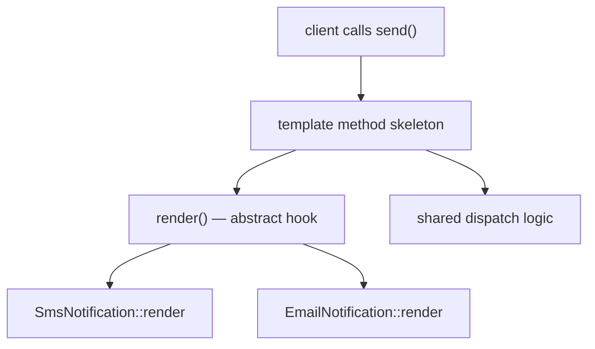

# Abstract Classes

!!! tip "In a nutshell"
    Une classe abstraite ne peut pas être instanciée ; elle mélange un état
    partagé et des méthodes que les sous-classes doivent implémenter. Fait clé :
    une seule méthode `abstract` oblige à déclarer toute la classe `abstract`,
    et vous ne pouvez faire `extends` que d'une seule classe.

!!! example "Real-world analogy"
    Pensez au manuel opérationnel d'une franchise. Il fixe les parties communes
    dont hérite chaque succursale — l'image de marque, la procédure d'ouverture,
    la disposition de la caisse — mais laisse délibérément certaines étapes en
    blanc : « préparer la spécialité locale » est une consigne que chaque
    succursale *doit* compléter. Vous ne pouvez pas ouvrir « la franchise »
    elle-même comme boutique, seulement une succursale concrète qui complète
    chaque étape laissée en blanc, et chaque succursale appartient à exactement
    une chaîne — reflet de l'héritage simple d'un unique parent abstrait.

!!! abstract "Learning objectives"
    À la fin de ce chapitre, vous saurez :

    - [ ] Expliquer ce que les classes et méthodes `abstract` imposent à la compilation.
    - [ ] Choisir entre une classe abstraite et une interface pour une conception donnée.
    - [ ] Implémenter le pattern **template method** de manière idiomatique.

    **Syllabus:** `PHP → Abstract classes` ·
    **Level:** Advanced ·
    **Est. time:** 25 min ·
    **Prerequisites:** [Interfaces](interfaces.md)

---

## Pour les nuls

### L'idée en une phrase
Une classe abstraite est un plan à moitié rempli : elle fixe le socle commun, mais laisse volontairement des cases vides que chaque sous-classe doit compléter.

### Imagine dans la vraie vie
Le manuel d'une franchise de restauration fixe tout ce qui est commun (logo, procédure d'ouverture, disposition de caisse) mais laisse une case obligatoire : "préparez ici votre spécialité locale". Tu ne peux jamais ouvrir "la franchise" elle-même comme boutique — seulement une succursale concrète qui a rempli chaque case obligatoire.

### Dans Symfony
`AbstractController` en est l'exemple le plus fréquent : il fournit des méthodes toutes faites (`render()`, `redirectToRoute()`...) mais reste, par construction, un socle à étendre — jamais instancié directement par l'application.

### Exemple simple
```php
abstract class Forme {
    abstract public function aire(): float; // case vide, à remplir
}
class Cercle extends Forme {
    public function __construct(private float $rayon) {}
    public function aire(): float { return M_PI * $this->rayon ** 2; }
}
```

### Comment le mémoriser 🧠
**Une seule** méthode abstraite oblige **toute** la classe à être `abstract` — c'est tout ou rien, comme un formulaire qui devient "brouillon" tant qu'une seule case obligatoire manque.


## Theory

Une **classe abstraite** ne peut pas être instanciée directement. Elle peut
mélanger des membres concrets (avec état et implémentation) et des **méthodes
abstraites** (signature seulement) que les sous-classes concrètes **doivent**
implémenter. C'est l'outil de l'**implémentation partielle + état partagé**,
alors qu'une interface est un contrat pur.

| Question | Abstract class | Interface |
|---|---|---|
| Instanciable ? | Non | Non |
| Peut porter un état ? | Oui | Non (constantes uniquement) |
| Héritage multiple ? | Non (un seul parent) | Oui |
| Peut définir un constructeur ? | Oui | Non |
| Corps de méthodes ? | Oui + abstract | Aucun |

!!! question "Predict first"
    Une classe concrète étend une classe abstraite mais oublie d'implémenter une
    méthode abstraite. Erreur à la compilation, erreur à l'exécution, ou `null`
    silencieux ?

??? note "Reveal"
    Erreur fatale au moment de la définition de la classe : une classe avec une
    méthode abstraite non implémentée doit elle-même être déclarée `abstract`.
    PHP refuse de laisser instancier un type à moitié défini.

## Deep Dive — how it works internally

### What `abstract` enforces

Déclarer une méthode `abstract` interdit tout corps et oblige les sous-classes
à implémenter une méthode à **signature compatible** (en respectant la variance
vue dans [interfaces.md](interfaces.md)). Une classe avec *au moins une* méthode
abstraite doit elle-même être `abstract`. Instancier une classe abstraite est
une `Error` fatale.

```php
<?php
declare(strict_types=1);

abstract class Notification
{
    // Concrete shared state + logic.
    public function __construct(protected string $to) {}

    // Subclasses must supply the channel-specific piece.
    abstract protected function render(): string;

    // Template method: fixed algorithm, variable steps.
    final public function send(): void
    {
        $body = $this->render();
        error_log("→ {$this->to}: {$body}");
    }
}

final class SmsNotification extends Notification
{
    protected function render(): string
    {
        return "SMS to {$this->to}";
    }
}
```

### The template method pattern

`Notification::send()` ci-dessus **est** la template method : elle définit le
squelette fixe d'un algorithme (`render()` puis l'envoi) et délègue l'étape
variable aux sous-classes via une méthode abstraite. Marquer `send()` `final`
empêche les sous-classes de casser les invariants de l'algorithme.



L'`AbstractController` de Symfony, `AbstractType` (Forms) et de nombreuses
classes de base sont des classes abstraites qui fournissent des helpers
partagés tout en vous obligeant à compléter les spécificités.

!!! note "Source reference"
    `Symfony\Bundle\FrameworkBundle\Controller\AbstractController` est une base
    abstraite avec des helpers concrets (`render`, `json`, `denyAccessUnlessGranted`) —
    [symfony/symfony `8.0`](https://github.com/symfony/symfony/blob/8.0/src/Symfony/Bundle/FrameworkBundle/Controller/AbstractController.php).

## Configuration & code

=== "PHP Attributes"

    ```php
    <?php
    declare(strict_types=1);

    abstract class Report
    {
        abstract public function rows(): iterable;

        // Concrete helper reused by every report.
        public function count(): int
        {
            return iterator_count(
                is_array($r = $this->rows()) ? new \ArrayIterator($r) : $r
            );
        }
    }
    ```

=== "Console"

    ```console
    $ php -r 'abstract class A{} new A();'
    PHP Fatal error:  Uncaught Error: Cannot instantiate abstract class A
    ```

## Best practices & anti-patterns

| ✅ Do | ❌ Avoid |
|---|---|
| Classe abstraite pour état partagé + squelette | Hiérarchies abstraites profondes |
| `final` sur la template method | Squelettes d'algorithme redéfinissables |
| Interface pour le contrat public | Classe abstraite là où une interface suffit |
| Composer plutôt qu'hériter quand c'est possible | Forcer l'héritage pour réutiliser du code |

## When (not) to use it / alternatives

- Choisissez une **classe abstraite** quand les sous-classes partagent
  état/logique et un squelette d'algorithme fixe (template method).
- Choisissez une **interface** quand seul un contrat est nécessaire, ou quand
  les classes ont besoin d'un héritage de type multiple.
- Préférez la **composition / les traits** ([traits.md](traits.md)) quand la
  réutilisation est horizontale et non une relation « is-a ».

!!! danger "Certification traps"
    - Une classe avec **une seule** méthode abstraite doit être déclarée
      `abstract`, sinon c'est une erreur fatale.
    - Les classes abstraites **peuvent** avoir des constructeurs, des propriétés
      et des constantes — pas les interfaces.
    - La redéfinition d'une méthode abstraite doit respecter les règles de
      variance (retour covariant, paramètres contravariants).
    - Vous ne pouvez faire `extends` que d'**une seule** classe abstraite mais
      `implements` de plusieurs interfaces.

!!! warning "Common mistakes"
    - Essayer d'instancier une classe abstraite (`Error` fatale).
    - Déclarer une méthode abstraite avec un corps (erreur de parsing).

## Exercises

1. **(Advanced)** Convertissez une classe de base `Exporter` avec une étape de
   format codée en dur en une template method avec un hook abstrait `format()`.
2. **(Advanced)** Expliquez pourquoi la template method est souvent `final`.

??? success "Solutions"

    **1.**
    ```php
    <?php
    declare(strict_types=1);

    abstract class Exporter
    {
        abstract protected function format(array $data): string;

        final public function export(array $data): string
        {
            $payload = $this->format($data);      // variable step
            return "BEGIN\n{$payload}\nEND";      // fixed skeleton
        }
    }
    ```

    **2.** `final` empêche les sous-classes de redéfinir le squelette et de
    violer les invariants de l'algorithme — elles ne peuvent personnaliser que
    les hooks abstraits.

## Certification questions

??? question "Q1. A concrete class inherits an abstract method but does not implement it. Result?"
    - [x] A. Fatal error unless the class is declared `abstract` ✅
    - [ ] B. It silently returns null
    - [ ] C. It runs fine
    - [ ] D. A deprecation notice

    **Why:** Les méthodes abstraites non implémentées obligent la classe à être
    abstraite elle aussi.
    **Ref:** [Abstract classes](https://www.php.net/manual/en/language.oop5.abstract.php).

??? question "Q2. Which can an abstract class have that an interface cannot?"
    - [x] A. Properties and a constructor ✅
    - [ ] B. Multiple parents
    - [ ] C. Public method signatures
    - [ ] D. Constants

    **Why:** Les classes abstraites portent un état et des constructeurs ; les
    interfaces sont des contrats.
    **Ref:** [Interfaces](https://www.php.net/manual/en/language.oop5.interfaces.php).

??? question "Q3. The template method pattern is best expressed by…"
    - [x] A. A concrete (often `final`) method calling abstract hooks ✅
    - [ ] B. An interface with no bodies
    - [ ] C. A trait with static methods
    - [ ] D. A closure

    **Why:** Le pattern fixe un squelette d'algorithme et délègue certaines
    étapes aux sous-classes. **Ref:** [Abstract classes](https://www.php.net/manual/en/language.oop5.abstract.php).

??? question "Q4. How many abstract classes can a class extend?"
    - [ ] A. Any number
    - [x] B. Exactly one ✅
    - [ ] C. Zero
    - [ ] D. Two

    **Why:** PHP a un héritage de classe simple ; les interfaces sont le
    mécanisme d'héritage multiple. **Ref:** [Inheritance](https://www.php.net/manual/en/language.oop5.inheritance.php).

## Key takeaways

- Classes abstraites = implémentation partielle + état partagé ; non instanciables.
- Toute méthode abstraite rend la classe entière abstraite.
- Template method : squelette fixe (souvent `final`) + hooks abstraits.
- Un seul parent abstrait, plusieurs interfaces.

## Last-minute revision

!!! tip "Cheat sheet"
    - Méthode `abstract` = pas de corps ; la sous-classe doit implémenter (la variance s'applique).
    - Peut avoir ctor/propriétés/constantes ; ne peut pas être instanciée avec `new`.
    - Template method : squelette `final` → hooks abstraits.
    - `extends` une classe, `implements` plusieurs interfaces.

## Connections

- **Depends on:** [Interfaces](interfaces.md) — la redéfinition d'une méthode abstraite obéit aux mêmes règles de variance ; une interface est l'alternative contrat pur.
- **Reused in:** [OOP](oop.md) — la template method s'appuie sur `final`, la visibilité et l'héritage.
- **Confused with:** [Traits](traits.md) — réutilisation horizontale par copie vs un parent « is-a » portant un état partagé.

## Official References
- [PHP: Class Abstraction](https://www.php.net/manual/en/language.oop5.abstract.php)
- [PHP: Object Inheritance](https://www.php.net/manual/en/language.oop5.inheritance.php)
- [Symfony source — AbstractController](https://github.com/symfony/symfony/blob/8.0/src/Symfony/Bundle/FrameworkBundle/Controller/AbstractController.php)

## Video references

!!! tip "Watch & learn"
    Voici des chaînes vidéo officielles, mises à jour en continu — cherchez-y
    "PHP & web security" pour consolider ce chapitre. Nous lions des chaînes
    stables plutôt que des vidéos individuelles afin que les références ne
    périment jamais.

    - [SymfonyCasts screencasts](https://symfonycasts.com/tracks/symfony) — tutoriels scénarisés à suivre en codant.
    - [Symfony official YouTube](https://www.youtube.com/@SymfonyOfficial) — conférences et keynotes SymfonyCon.
    - [Official docs for this topic](https://symfony.com/doc/8.0/index.html) — certaines pages de la doc Symfony intègrent un screencast.

## Confidence check

Je suis prêt quand je peux :

- [ ] expliquer **pourquoi** les classes abstraites existent (implémentation partielle + état partagé)
- [ ] implémenter une template method (squelette `final` + hook abstrait) dans Symfony 8
- [ ] déboguer l'erreur fatale issue d'une méthode abstraite non implémentée
- [ ] repérer le piège : étendre deux classes, ou une méthode abstraite dotée d'un corps
- [ ] expliquer comment la variance s'applique quand une sous-classe implémente une méthode abstraite

---

<small>Related: [Interfaces](interfaces.md) · [Traits](traits.md) · [OOP](oop.md)</small>
