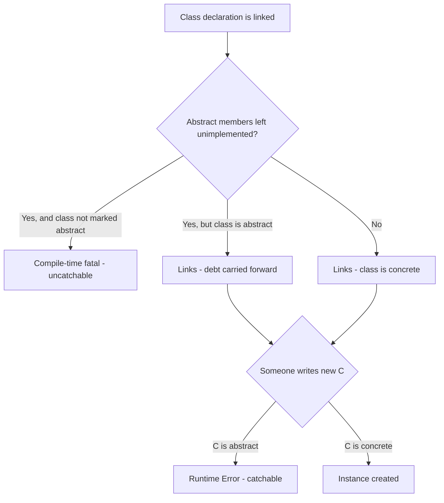
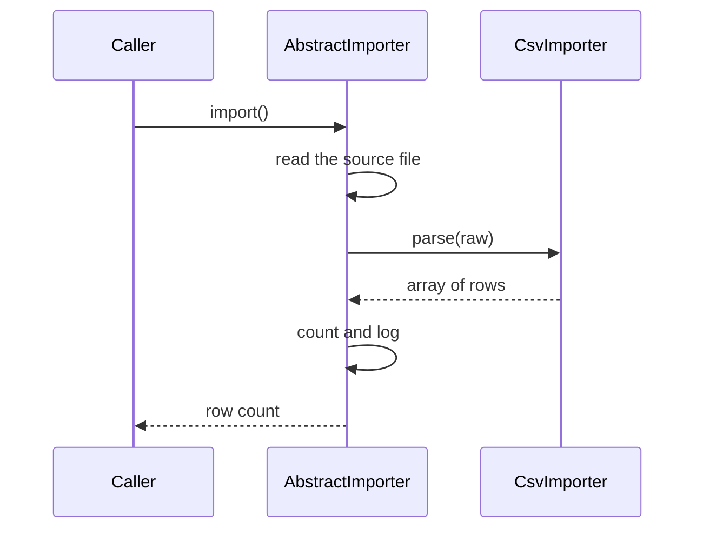

# Abstract Classes

!!! tip "In a nutshell"
    An abstract class is a **partially written class**: it carries state, a constructor
    and finished methods, plus members it deliberately leaves undefined. Two facts do most
    of the exam work. First, a class holding **one** unimplemented abstract member must
    itself be declared `abstract` — and that failure is a **compile-time** fatal. Second,
    `new AbstractThing()` is a different failure: a **runtime** `Error` you can actually
    catch. Since PHP 8.4 a class may also declare abstract **properties**, not just methods.

!!! example "Real-world analogy"
    A franchise operations manual fixes everything the brand shares — signage, opening
    procedure, till layout — but leaves one step deliberately blank: "prepare the local
    specialty here". Three consequences map exactly onto the language. You cannot open
    "the franchise" itself as a shop, only a branch that has filled in every mandatory
    blank. A branch belongs to exactly one chain, never two. And a branch may add extra
    optional steps of its own, but it may not narrow a step the manual promised customers.

!!! abstract "Learning objectives"
    By the end of this chapter you can:

    - [ ] State exactly what `abstract` forbids on a class, a method and a property, and **when** each violation fires.
    - [ ] Apply signature-compatibility rules — variance, visibility, optional parameters — when implementing an abstract member.
    - [ ] Choose between an abstract class, an interface and a trait, including where PHP 8.4 blurs the first two.
    - [ ] Implement the **template method** pattern the way Symfony's `Abstract*` base classes do.

    **Syllabus:** `PHP → Abstract Classes` ·
    **Level:** Advanced / Expert ·
    **Est. time:** 40 min ·
    **Prerequisites:** [OOP](oop.md) · [Interfaces](interfaces.md)

    **Examen Symfony 8 :** OUI

---

## Prerequisites

You need classes, visibility and inheritance from [OOP](oop.md), and the variance rules from
[Interfaces](interfaces.md) — implementing an abstract method obeys exactly the same
signature-compatibility rules as implementing an interface method. Everything below targets
**PHP 8.4**, which matters here because abstract *properties* only exist from 8.4.0.

## The problem we are solving

Two importers, one for CSV and one for JSON. Both must open the file, count the rows, wrap
the work in a transaction, and log the outcome. Only the parsing step differs.

Copy the shared code into both and the two copies drift: someone fixes the transaction
handling in one and forgets the other. Put the shared code in a plain parent class with a
`parse()` method that returns `[]`, and a subclass that *forgets* to override it silently
imports nothing — a bug that produces a green build and an empty database.

What you actually want is a parent that **carries the shared code** and **refuses to compile**
a child that has not supplied the missing step:

```php
abstract class Importer
{
    abstract protected function parse(string $raw): array;   // no body: the mandatory blank
}
```

That single keyword converts a runtime bug into a load-time error. Everything else in this
chapter is a consequence of it.

## 🧠 Pour les nuls

**C'est quoi ?** Une classe abstraite est une classe **volontairement incomplète**. Elle
contient du vrai code (des propriétés, un constructeur, des méthodes qui fonctionnent), mais
aussi des membres déclarés `abstract` : une signature suivie d'un point-virgule, sans corps.
Tant qu'une seule de ces cases reste vide, PHP interdit de créer un objet de cette classe.

**Pourquoi ça existe ?** Pour **partager du code entre plusieurs classes tout en imposant
qu'elles complètent la partie qui leur est propre**. Sans `abstract`, tu as deux mauvaises
options : dupliquer le code commun (il va diverger), ou mettre une méthode vide dans le parent
(une sous-classe distraite hérite alors d'un comportement silencieusement faux). `abstract`
transforme cet oubli en erreur immédiate au chargement de la classe.

**🏠 Analogie de la vraie vie :** Le **formulaire Cerfa pré-imprimé**. Le formulaire fournit
déjà le texte fixe, la mise en page, les règles de calcul — tout ce qui ne change pas d'un
dossier à l'autre. Mais il comporte des champs obligatoires laissés en blanc. Trois règles
en découlent, et ce sont exactement celles du langage : on ne dépose pas le formulaire vierge
lui-même (`new` interdit), on ne dépose qu'une copie remplie (la sous-classe concrète), et un
dossier se rattache à un seul formulaire de base (`extends` unique).

**Symfony dans la vraie vie :** Formulaire pré-imprimé → `AbstractController`, qui apporte
`render()`, `redirectToRoute()`, `denyAccessUnlessGranted()` / Copie remplie →
`class BlogController extends AbstractController` / Champ obligatoire vide → une méthode
`abstract` que Symfony t'oblige à écrire, comme `authenticate()` quand tu étends
`AbstractAuthenticator` / Interdiction de déposer le vierge → Symfony n'instancie jamais
`AbstractController` lui-même.

**💻 Exemple Symfony extrêmement simple :**
```php
abstract class Rapport
{
    abstract protected function lignes(): array;          // le champ obligatoire

    final public function afficher(): string              // le texte pré-imprimé
    {
        return implode("\n", $this->lignes());
    }
}

final class RapportVentes extends Rapport
{
    protected function lignes(): array { return ['ligne 1', 'ligne 2']; }
}
```
Ligne 3 : la case vide, aucun corps, juste un point-virgule. Ligne 5 : le code partagé, marqué
`final` pour qu'aucune sous-classe ne réécrive le squelette. Ligne 11 : la case est remplie,
la classe devient instanciable.

**🔍 Que se passe-t-il réellement ?**
1. PHP compile `Rapport` et marque `lignes()` comme abstraite : elle existe dans la table des
   méthodes, mais sans implémentation.
2. PHP compile `RapportVentes` et fusionne les tables : la version concrète remplace l'entrée
   abstraite.
3. PHP compte les entrées abstraites restantes. Zéro → la classe est acceptée.
4. S'il en restait une et que la classe n'était pas marquée `abstract`, l'erreur fatale tombe
   ici, au chargement du fichier, avant même la première requête.
5. Au moment du `new`, PHP regarde un simple drapeau sur la classe : abstraite → `Error`
   « Cannot instantiate abstract class ». Ce second contrôle-là, tu peux l'attraper.

**⚠️ Erreur fréquente :** confondre les deux moments d'échec. Une méthode abstraite oubliée
casse le **chargement** de la classe et aucun `try/catch` n'y peut rien. Un `new` sur une
classe abstraite casse à l'**exécution** et lève une `Error` parfaitement catchable. Deuxième
piège du même genre : écrire `abstract public function f() {}`. Un corps, même vide, est
interdit sur une méthode abstraite.

**🧠 Comment le mémoriser ?** *« Une seule case vide suffit à rendre tout le formulaire
inutilisable. »* Une méthode abstraite contamine la classe entière. Et pour les deux erreurs :
**case vide = erreur de compilation, formulaire vierge déposé = erreur d'exécution.**

## Build the mental model

Hold three ideas together and every rule below follows.

**One: `abstract` is a debt recorded on the class.** Each abstract member is an entry in the
class's method table with no implementation. Inheriting the class inherits the debt. The debt
is settled by providing a compatible implementation, or carried forward by declaring the child
`abstract` too. A class is instantiable exactly when its debt is zero.

**Two: there are two independent failure moments, and confusing them is the classic trap.**
Unsettled debt is caught while **linking the class** — a fatal you cannot catch. Trying to
`new` a class that merely wears the `abstract` keyword is caught at **runtime** — a plain
`Error` you can catch. A class with zero abstract methods but marked `abstract` still cannot
be instantiated: the keyword alone blocks it.

**Three: settling the debt is a signature-compatibility problem, not a name-matching one.**
The implementation must satisfy every rule that governs any override: covariant return,
contravariant parameters, visibility equal or wider, and no new *required* parameters.



The diagram encodes the one sentence people most often get wrong: the *unimplemented member*
check happens at link time, the *instantiation* check happens at run time, and they are
separate gates. A class can pass the first and still fail the second.

!!! info "PHP 8.4 reference"
    https://www.php.net/manual/en/language.oop5.abstract.php

## Core concepts

The manual's own summary is the tightest statement of the rule: *"Classes defined as abstract
cannot be instantiated, and any class that contains at least one abstract method or property
must also be abstract."*

Four separate things carry the keyword, and they mean different things:

| Written as | Meaning | Illegal combination |
|---|---|---|
| `abstract class C` | Cannot be instantiated, even with zero abstract members | `abstract final class` |
| `abstract public function f();` | Signature only, no body, subclass must implement | `abstract private`, `abstract final`, any body |
| `abstract public string $p { get; }` | 8.4 — subclass must expose the named operation | `abstract private` property |
| *(nothing)* on an interface method | Already implicitly abstract | — |

An abstract method *"declares the method's signature and whether it is public or protected"* —
so `private` is excluded by design: a private method is invisible to the child that would have
to implement it. And `abstract final` is a contradiction the compiler rejects by name, on both
classes and methods:

```
Fatal error: Cannot use the final modifier on an abstract class
Fatal error: Cannot use the final modifier on an abstract method
```

`abstract` says "a subclass **must** replace this"; `final` says "a subclass **may not**
replace this". No class could ever satisfy both.

An abstract class is otherwise an ordinary class. It may declare a constructor, promoted
properties, constants, static methods, `final` methods, and it may implement interfaces.

!!! info "PHP 8.4 reference"
    https://www.php.net/manual/en/language.oop5.abstract.php

!!! info "PHP 8.4 reference"
    https://www.php.net/manual/en/language.oop5.final.php

## Learn by doing

One running example, one change per step. We are building the importer from the top of the
chapter.

**Step 1 — state the shared algorithm and the mandatory blank.**

```php
<?php
declare(strict_types=1);

abstract class Importer
{
    public function __construct(protected readonly string $source) {}

    abstract protected function parse(string $raw): array;

    final public function import(): int
    {
        $rows = $this->parse(file_get_contents($this->source) ?: '');

        return \count($rows);
    }
}
```

`import()` is fixed and `final`; `parse()` is the blank. Note that a concrete method may call
an abstract one — that is the entire point, and it is perfectly legal because only concrete
subclasses are ever instantiated.

**Step 2 — fill the blank.**

```php
<?php
declare(strict_types=1);

abstract class Importer
{
    abstract protected function parse(string $raw): array;
}

final class CsvImporter extends Importer
{
    protected function parse(string $raw): array
    {
        return array_map(
            static fn (string $line): array => explode(',', $line),
            explode("\n", trim($raw)),
        );
    }
}
```

The class links, and `new CsvImporter(...)` works.

**Step 3 — forget the blank, and watch *when* it breaks.** Remove `parse()` from `CsvImporter`
and PHP refuses the *declaration*:

```
Fatal error: Class CsvImporter contains 1 abstract method and must therefore be
declared abstract or implement the remaining methods (Importer::parse)
```

No object was created, no method was called. Merely autoloading the file is enough. This is
the difference that matters operationally: in a Symfony app the failure happens when the
autoloader touches the file, so it takes down every route, not one endpoint.

**Step 4 — instantiate the parent instead.** `new Importer('x')` fails differently:

```
PHP Fatal error: Uncaught Error: Cannot instantiate abstract class Importer
```

This one is a **runtime** `Error`, and it really is catchable:

```php
<?php
declare(strict_types=1);

abstract class Importer {}

try {
    $i = new Importer();
} catch (\Error $e) {
    echo $e->getMessage();   // Cannot instantiate abstract class Importer
}
```

**Step 5 — widen the visibility.** Change the child to `public function parse(...)`. Legal:
visibility may be relaxed, never restricted. Restricting it to `private` produces a different
message entirely, which is your clue about which rule you broke:

```
Fatal error: Access level to CsvImporter::parse() must be protected
(as in class Importer) or weaker
```

**Step 6 — add a parameter.** Adding an **optional** one is allowed, and is straight from the
manual: a child *"may define optional parameters which are not present in the parent's
signature"*.

```php
protected function parse(string $raw, string $delimiter = ','): array   // legal
```

Make it required and the contract breaks, because a caller using the parent's signature would
now be missing an argument:

```
Fatal error: Declaration of CsvImporter::parse(string $raw, string $delimiter): array
must be compatible with Importer::parse(string $raw): array
```

The pattern to carry into the exam: **implementing an abstract method is an override**, so
every override rule applies — variance, visibility, and optional-only extra parameters.

!!! info "PHP 8.4 reference"
    https://www.php.net/manual/en/language.oop5.inheritance.php

## How Symfony handles it

Symfony uses abstract classes in three distinct ways, and telling them apart is a genuinely
useful skill because the class names all start with the same word.

**1. Abstract with *zero* abstract methods — a helper base.**
`AbstractController` declares no abstract member at all. It is abstract purely so nobody
instantiates it as a controller, while it hands you `render()`, `json()`, `redirectToRoute()`
and `denyAccessUnlessGranted()`. It implements `ServiceSubscriberInterface` and holds one
protected property, `$container` — state an interface could not carry.

`AbstractType` in the Form component is the same shape taken further: it implements the whole
of `FormTypeInterface` with no-op or sensible defaults (`buildForm()` empty, `getParent()`
returning `FormType::class`), so a custom type overrides only what it cares about. Both are
proof that "abstract class" does not imply "has abstract methods".

**2. Abstract because an interface is only partly satisfied.**
`AbstractAuthenticator implements AuthenticatorInterface` but provides only `createToken()`.
The interface's other four methods — `supports()`, `authenticate()`,
`onAuthenticationSuccess()`, `onAuthenticationFailure()` — are left unimplemented, which is
precisely why the class *must* be abstract. Note that Symfony does **not** redeclare them as
`abstract`: an unsatisfied interface method is already an abstract requirement.
`Symfony\Component\DependencyInjection\Extension\Extension` is the same case, leaving
`ExtensionInterface::load()` to each bundle, and it also shows a `final` method
(`getProcessedConfigs()`) living happily inside an abstract class.

**3. Deliberately *not* abstract, with the trade-off documented in the source.**
`Command::execute()` could have been abstract. It is not, and the source comment says why:
*"This method is not abstract because you can use this class as a concrete class. In this case,
instead of defining the execute() method, you set the code to execute by passing a Closure to
the setCode() method."* The price is explicit — the default body throws
`LogicException('You must override the execute() method in the concrete command class.')`.
That is the whole design trade-off in one method: **abstract buys a load-time guarantee and
costs you the ability to use the class directly; a throwing default buys flexibility and
downgrades the guarantee to a runtime exception.**

!!! note "Symfony 8.0 source reference"
    https://github.com/symfony/symfony/blob/8.0/src/Symfony/Bundle/FrameworkBundle/Controller/AbstractController.php

!!! note "Symfony 8.0 source reference"
    https://github.com/symfony/symfony/blob/8.0/src/Symfony/Component/Security/Http/Authenticator/AbstractAuthenticator.php

!!! note "Symfony 8.0 source reference"
    https://github.com/symfony/symfony/blob/8.0/src/Symfony/Component/Console/Command/Command.php

!!! info "Official Symfony 8.0 reference"
    https://symfony.com/doc/8.0/controller.html#the-base-controller-class-services

## How it works internally

An abstract method is stored in the class's method table like any other method, but with no
compiled body and an "abstract" flag. Class linking then does three things in order: it copies
the parent's table into the child, lets the child's own definitions replace matching entries,
and finally **counts the entries still flagged abstract**. A non-zero count on a class that is
not itself `abstract` is the fatal you saw in step 3 — and the message literally reports the
count and names the offenders.

Three consequences, each examinable:

- **The check is per-class, at link time.** It runs once, when the declaration is compiled or
  the file autoloaded. It is not deferred to instantiation and not repeated per object.
- **Instantiation is a separate, much cheaper check.** `new` looks at one flag on the class
  entry. That is why it can throw a normal `Error` instead of aborting compilation, and why
  `abstract class A {}` with no abstract members is still un-instantiable.
- **Abstract *properties* are tracked as abstract methods.** Leave
  `abstract public string $readable { get; }` unimplemented and PHP reports:

```
Fatal error: Class C contains 1 abstract method and must therefore be declared
abstract or implement the remaining methods (C::$readable::get)
```

  The requirement is named `C::$readable::get` and counted as a *method*, which tells you
  exactly how property hooks are represented under the hood — as get/set methods attached to
  a property name.

Reflection exposes both flags independently, which is the practical way to inspect this:

```php
<?php
declare(strict_types=1);

abstract class A
{
    abstract public function f(): void;
}

$r = new ReflectionClass(A::class);
var_dump($r->isAbstract());                   // true
var_dump($r->getMethod('f')->isAbstract());   // true
var_dump($r->isInstantiable());               // false
```

!!! info "PHP 8.4 reference"
    https://www.php.net/manual/en/reflectionclass.isabstract.php

## All supported cases and variations

### Abstract properties (PHP 8.4)

This is the newest rule in the topic and the most likely fresh distractor. **As of PHP 8.4 an
abstract class may declare an abstract property, either public or protected**, stating which
operations a subclass must expose:

```php
<?php
declare(strict_types=1);

abstract class A
{
    // Extending classes must have a publicly-gettable property
    abstract public string $readable { get; }

    // Extending classes must have a protected- or public-writeable property
    abstract protected string $writeable { set; }

    // Extending classes must have a protected or public symmetric property
    abstract protected string $both { get; set; }
}
```

Four rules govern how a subclass satisfies these, and each is a possible question:

- The requirement may be met by a **plain property** or by one with **hooks** — whichever
  provides the demanded operation.
- **Widening the visibility is fine.** A `protected` requirement may be satisfied by a
  `public` property. Narrowing is not: a `protected string $readable` does **not** satisfy an
  `abstract public string $readable { get; }`.
- Satisfying a `{ get; }` requirement with a plain read-write property is valid — providing
  *more* than the contract demanded is never a violation.
- An abstract property **may supply an implementation for one hook**, but must leave `get` or
  `set` declared and undefined. Implement both and there is nothing left to be abstract about.

```php
<?php
declare(strict_types=1);

abstract class A
{
    // Default (overridable) set implementation, get still required from children
    abstract public string $foo {
        get;

        set {
            $this->foo = $value;
        }
    }
}
```

!!! info "PHP 8.4 reference"
    https://www.php.net/manual/en/language.oop5.abstract.php

!!! info "PHP 8.4 reference"
    https://www.php.net/manual/en/language.oop5.property-hooks.php

### Property variance, and the 8.4 exception

Properties are **invariant by default**: their type may not change in a child at all. The
manual gives the reason rather than a decree — *"get" operations must be covariant, and "set"
operations must be contravariant. The only way for a property to satisfy both requirements is
to be invariant.*

PHP 8.4 relaxes this exactly where one of the two operations is absent. An **abstract or
virtual** property requiring only `get` may be **covariant**; one requiring only `set` may be
**contravariant**. Once a property has both operations it is invariant again for any further
extension.

!!! info "PHP 8.4 reference"
    https://www.php.net/manual/en/language.oop5.variance.php

### Abstract classes and interfaces together

An abstract class may implement an interface and satisfy only part of it. The unsatisfied
methods stay abstract requirements **without being redeclared** — this is what
`AbstractAuthenticator` and `Extension` do. Redeclaring them `abstract` is legal but purely
documentary.

The 8.4 comparison table, corrected for the current version:

| Question | Abstract class | Interface |
|---|---|---|
| Instantiable? | No | No |
| Constructor? | **Yes** | No |
| Instance state (a real stored value)? | **Yes** | No — only a *requirement* |
| Method bodies? | **Yes**, concrete and abstract mixed | No |
| Property requirements? | Yes (8.4) | **Yes (8.4)** |
| Constants? | Yes | Yes |
| How many per class? | **Exactly one** `extends` | Many `implements` |
| Visibility of members | public / protected / private | public only |

The row people still get wrong is *property requirements*: since 8.4 both can demand a
property, so "only abstract classes can mention properties" is no longer true. The distinction
that survives is **state**: an abstract class can *store* a value and run a constructor; an
interface can only *demand an operation*.

!!! info "PHP 8.4 reference"
    https://www.php.net/manual/en/language.oop5.interfaces.php

### Where else `abstract` appears

- **Traits may declare abstract methods.** A trait's abstract method becomes a requirement on
  the class that `use`s it, reported against that class: `Class C contains 1 abstract method
  … (C::f)`. It is how a trait states "I need this from my host".
- **Anonymous classes may extend an abstract class**, which is the shortest way to write a
  one-off implementation in a test.
- **Enums may not be abstract** — `abstract enum E {}` is a parse error. Enum cases are a
  fixed, instantiable set, which is the opposite of abstraction.
- **`abstract readonly class` is legal** (8.2 readonly classes). Readonly-ness must then match
  in both directions: a non-readonly class may not extend a readonly one, and a readonly class
  may not extend a non-readonly one.

!!! info "PHP 8.4 reference"
    https://www.php.net/manual/en/language.oop5.traits.php

## Configuration & code

=== "PHP Attributes"

    ```php
    <?php
    declare(strict_types=1);

    use Symfony\Component\Console\Attribute\AsCommand;
    use Symfony\Component\Console\Command\Command;
    use Symfony\Component\Console\Input\InputInterface;
    use Symfony\Component\Console\Output\OutputInterface;

    abstract class AbstractMaintenanceCommand extends Command
    {
        // The mandatory blank each maintenance command must fill in.
        abstract protected function doMaintenance(OutputInterface $output): int;

        // Fixed skeleton: subclasses customise the step, never the wrapper.
        final protected function execute(InputInterface $input, OutputInterface $output): int
        {
            $output->writeln('<info>Starting…</info>');
            $status = $this->doMaintenance($output);
            $output->writeln('<info>Done.</info>');

            return $status;
        }
    }

    #[AsCommand(name: 'app:purge-sessions')]
    final class PurgeSessionsCommand extends AbstractMaintenanceCommand
    {
        protected function doMaintenance(OutputInterface $output): int
        {
            $output->writeln('purged');

            return Command::SUCCESS;
        }
    }
    ```

=== "Console"

    ```console
    $ php -r 'abstract class A{} new A();'
    PHP Fatal error:  Uncaught Error: Cannot instantiate abstract class A

    $ php -r 'abstract class A{abstract function f();} class B extends A{}'
    PHP Fatal error:  Class B contains 1 abstract method and must therefore be
    declared abstract or implement the remaining methods (A::f)

    $ php bin/console debug:container --show-private App\Command\PurgeSessionsCommand
    ```

!!! info "Official Symfony 8.0 reference"
    https://symfony.com/doc/8.0/console.html#console_creating-command

## Execution flow

The template method is the pattern abstract classes exist to express: a fixed algorithm in the
parent, variable steps deferred to children. Symfony's `Command::run()` is a real one — it
calls `initialize()`, then `interact()`, then `execute()`, in that order, and only the last is
mandatory in practice.



Read it as ownership rather than as timing: every box on the `Base` lane is code the parent
owns and no subclass can touch, because `import()` is `final`. Exactly one hop leaves that
lane — the call to `parse()` — and that is the only decision a subclass gets to make.

What the engine does, step by step, when the file is loaded and then used:

1. The parent declaration is compiled; `parse()` is recorded with the abstract flag.
2. The child declaration is compiled; the parent's method table is copied in.
3. The child's `parse()` replaces the abstract entry, after signature checks (variance,
   visibility, parameter count).
4. Remaining abstract entries are counted. Zero here, so the class links as concrete.
5. `new CsvImporter(...)` checks the class's abstract flag — clear — and allocates the object.
6. `import()` runs. `$this->parse()` dispatches to the child's implementation.

Step 3 is where variance errors appear, step 4 where "must therefore be declared abstract"
appears, and step 5 where "Cannot instantiate abstract class" appears. Three different
messages, three different stages.

!!! info "Official Symfony 8.0 reference"
    https://symfony.com/doc/8.0/console.html#command-lifecycle

## Default behavior

- An abstract method has **no default implementation**. There is no such thing as "abstract
  with a fallback body" — that is simply a concrete method.
- An abstract class with **no** abstract members is still not instantiable; the keyword alone
  is sufficient.
- Abstract methods default to being implementable as `public` or `protected` only, because the
  declaration itself may only be `public` or `protected`.
- A parent constructor is **not** called automatically. If the child declares its own
  `__construct()`, the parent's runs only if the child calls `parent::__construct()`.
- An abstract class that implements an interface does not need to redeclare the unimplemented
  methods; they are already requirements.
- `instanceof` works normally against an abstract class: a concrete subclass instance is an
  `instanceof` the abstract parent.

## Edge cases

- **`parent::f()` where `f()` is abstract** throws at runtime:
  `Error: Cannot call abstract method A::f()`. There is no body to call. Subclasses sometimes
  write it by reflex when refactoring a concrete method into an abstract one.
- **Constructors may be abstract**, though it is rare. `abstract public function
  __construct();` forces every subclass to declare one explicitly.
- **Abstract static methods are allowed.** Combined with `new static()` they give a typed
  factory: `abstract public static function make(): static;`. Note that calling a
  `new static()` factory *on the abstract class itself* still throws
  `Cannot instantiate abstract class`.
- **A trait's abstract method is reported against the using class**, not the trait — the error
  names `C::f`, which can be confusing when the trait lives in a different file.
- **Optional parameters may be added** by an implementation; required ones may not.
- **Providing more than the contract asks is always safe.** A `{ get; }` abstract property is
  satisfied by a fully read-write public property, exactly as a covariant return is satisfied
  by a narrower type.

## Common confusions

| These look alike | The distinction |
|---|---|
| "Class contains 1 abstract method…" vs "Cannot instantiate abstract class" | First = **link time**, uncatchable, about a missing implementation. Second = **runtime** `Error`, catchable, about the keyword. |
| Abstract class vs interface | Abstract class = shared **state** + partial code + one parent. Interface = requirements only + many parents. |
| Abstract class vs trait | An abstract class is a **type** you can type-hint and `instanceof`. A trait is horizontal copy-in and is **not** a type. |
| `abstract` method vs empty concrete method | `abstract` forces the subclass to act. `function f() {}` silently does nothing when forgotten. |
| `abstract` vs `final` | Mutually exclusive on the same declaration — "must override" against "may not override". |
| Abstract property (8.4) vs typed property | An abstract property declares a **required operation**; it stores nothing and has no default. |
| Abstract class with no abstract methods | Perfectly legal and common — `AbstractController` and `AbstractType` are both like this. |

## Best practices & anti-patterns

| ✅ Do | ❌ Avoid |
|---|---|
| `final` on the template method | An overridable algorithm skeleton |
| `protected` for hooks that are internal steps | `public` hooks that widen the class's API by accident |
| Publish an **interface** as the contract, an abstract class as a convenience base | Type-hinting the abstract class everywhere |
| Keep the hierarchy one level deep | Three-level `AbstractBaseAbstractThing` chains |
| Prefer composition when the reuse is not "is-a" | Inheriting only to share a helper method |
| Add a new **abstract** method only in a major version | Adding one to a published base class — it breaks every child at link time |

## Certification traps

!!! danger "Certification traps"
    - A class holding **one** unimplemented abstract member must be declared `abstract`. The
      failure is a **compile-time** fatal, not a runtime exception.
    - `new AbstractThing()` is a **runtime** `Error` — and it **is** catchable. Do not merge
      it with the previous trap.
    - An abstract class with **zero** abstract methods still cannot be instantiated.
    - `abstract` + `final` is rejected on both classes and methods; `abstract private` is
      rejected on methods and properties.
    - An abstract method **may not have a body**, even an empty one. The message is
      *"Abstract function A::f() cannot contain body"* — a compile-time **fatal error**, not a
      parse error.
    - Implementing an abstract method is an override: covariant return, contravariant
      parameters, visibility equal or wider, and only **optional** extra parameters.
    - **PHP 8.4 added abstract properties**, so "only methods can be abstract" is now false.
    - A concrete method may freely call an abstract one — that is the template method pattern,
      not an error.

## Common mistakes

!!! warning "Common mistakes"
    - Giving an abstract method a body, then reading the error as a syntax problem.
    - Declaring an abstract method `private` and expecting subclasses to see it.
    - Narrowing visibility when implementing — `protected` abstract implemented as `private`
      gives *"Access level … must be protected (as in class A) or weaker"*.
    - Adding a **required** parameter to the implementation and calling it "an improvement".
    - Forgetting `parent::__construct()` in the child, then debugging uninitialised
      properties.
    - Calling `parent::f()` from an implementation of an abstract `f()`.
    - Reaching for an abstract class when only a contract is needed, and burning the single
      `extends` slot a class may need for something else.

## Debugging and troubleshooting

Match the message to the stage — each one names a different rule:

| Message | Stage | What is wrong |
|---|---|---|
| `Class C contains N abstract method(s) …` | link | A member is unimplemented and `C` is not abstract |
| `Cannot instantiate abstract class C` | runtime | `new` on a class carrying the keyword |
| `Abstract function A::f() cannot contain body` | compile | A body on an abstract method |
| `Cannot use the final modifier on an abstract …` | compile | `abstract` and `final` together |
| `Abstract function A::f() cannot be declared private` | compile | Visibility too narrow to be implementable |
| `Access level to C::f() must be … or weaker` | link | The implementation narrowed visibility |
| `Declaration of C::f(…) must be compatible with A::f(…)` | link | Variance or parameter-count violation |
| `Cannot call abstract method A::f()` | runtime | A `parent::` call to something with no body |

Useful tools:

- `php -l file.php` catches only the body-on-abstract-method and parse-level problems. Missing
  implementations need the class to **load**, so `php -l` will report a clean file.
- `(new ReflectionClass($fqcn))->isInstantiable()` answers the practical question directly, and
  `getMethods(ReflectionMethod::IS_ABSTRACT)` lists what is still owed.
- In Symfony, a `Class … contains N abstract methods` error during `cache:clear` almost always
  means a service class was written against an older base class that has since gained a
  method.

!!! info "PHP 8.4 reference"
    https://www.php.net/manual/en/language.oop5.visibility.php

## Performance and security considerations

There is no runtime cost to abstraction. Method resolution through an abstract parent is the
same table lookup as through any parent, resolved once at link time; the abstract flag is
checked only by `new`. Opcache stores the linked class, so the cost is paid on the first
request of a worker, not per request.

The security angle is about **guarantees, not speed**. An abstract method is a compile-time
guarantee that a mandatory step exists; a throwing default body is only a runtime one. Where
the step is a security control — signature verification, CSRF checking, an authorisation gate
— the difference matters: a missing implementation surfaces at deploy time instead of on the
one code path an attacker exercises. That is the reasoning behind `AbstractAuthenticator`
leaving `authenticate()` unimplemented rather than shipping a permissive default, and behind
marking the template method `final` so a subclass cannot quietly skip the wrapper's checks.

## Key takeaways

- An abstract class cannot be instantiated; any class with one unimplemented abstract member
  must itself be `abstract`.
- Two failure moments: missing implementation is a **link-time** fatal; `new` on an abstract
  class is a **runtime** `Error` you can catch.
- An abstract class with zero abstract methods is still not instantiable — `AbstractController`
  and `AbstractType` are exactly that.
- Implementing an abstract member is an override: covariant return, contravariant parameters,
  visibility equal or wider, extra parameters optional only.
- `abstract` excludes `final` and `private`, and forbids a method body.
- PHP 8.4 adds abstract **properties** (`public`/`protected`), satisfied by a plain or hooked
  property that provides the demanded `get`/`set` operation.
- Template method: `final` skeleton in the parent, abstract hooks for the variable steps.

## Expert takeaways

- The engine treats an abstract member as **debt on the method table**. That single model
  explains the wording of the error ("contains 1 abstract method"), why it fires at link time,
  and why an abstract property is reported as `C::$prop::get` — hooks are methods internally.
- Choosing `abstract` over a throwing default body is choosing a compile-time guarantee over
  flexibility. Symfony makes that trade-off explicitly and documents it in `Command::execute()`.
- PHP 8.4 narrows the classic "interfaces cannot have properties" distinction: both can now
  demand a property. The durable difference is **stored state and construction**, not
  properties as such.
- An abstract class occupies the single `extends` slot forever. Publishing the contract as an
  interface and the convenience as an abstract base keeps consumers free — the shape Symfony
  uses for `AuthenticatorInterface` plus `AbstractAuthenticator`.
- Adding an abstract method to a published base class breaks every subclass at link time,
  exactly as adding a method to an interface does. Both are major-version changes.

## Last-minute revision

!!! tip "Cheat sheet"
    - One abstract member ⇒ whole class `abstract`, or **compile-time** fatal.
    - `new Abstract…` ⇒ **runtime** `Error`, catchable. Different gate, different stage.
    - Zero abstract methods + `abstract` keyword ⇒ still not instantiable.
    - `abstract` never combines with `final`; never `private`; never a body.
    - Override rules apply: return narrows, parameters widen, visibility widens, extra params
      must be optional.
    - 8.4: `abstract public string $p { get; }` — public or protected only.
    - Properties invariant, except abstract/virtual get-only (covariant) or set-only
      (contravariant).
    - Template method = `final` skeleton + `abstract` hooks.
    - `extends` one class, `implements` many interfaces.

## Connections

- **Depends on:** [Interfaces](interfaces.md) — implementing an abstract method obeys the same variance rules, and an interface is the pure-contract alternative.
- **Depends on:** [OOP](oop.md) — visibility, `final`, `static` and constructors are what an abstract class actually assembles.
- **Confused with:** [Traits](traits.md) — horizontal copy-in reuse that is not a type, versus an "is-a" parent carrying shared state.
- **Applied in:** [AbstractController](../controllers/abstract-controller.md) — the abstract base you extend in almost every Symfony controller.

## Continue your learning

1. **[Guided exercises](abstract-classes-exercises.md)** — build the base class, break it deliberately, and read every error message it produces.
2. **[Topic exam](abstract-classes-exam.md)** — every certification question for this topic, answers hidden.
3. **[Flashcards](abstract-classes-flashcards.md)** — active recall on the two failure stages, modifier conflicts and the 8.4 additions.

## Official References

- [PHP: Class Abstraction](https://www.php.net/manual/en/language.oop5.abstract.php)
- [PHP: Object Inheritance](https://www.php.net/manual/en/language.oop5.inheritance.php)
- [PHP: Final Keyword](https://www.php.net/manual/en/language.oop5.final.php)
- [PHP: Variance](https://www.php.net/manual/en/language.oop5.variance.php)
- [PHP: Property Hooks](https://www.php.net/manual/en/language.oop5.property-hooks.php)
- [PHP: Visibility](https://www.php.net/manual/en/language.oop5.visibility.php)
- [PHP: ReflectionClass::isAbstract](https://www.php.net/manual/en/reflectionclass.isabstract.php)
- [Symfony source — AbstractController](https://github.com/symfony/symfony/blob/8.0/src/Symfony/Bundle/FrameworkBundle/Controller/AbstractController.php)
- [Symfony source — AbstractType](https://github.com/symfony/symfony/blob/8.0/src/Symfony/Component/Form/AbstractType.php)
- [Symfony source — AbstractAuthenticator](https://github.com/symfony/symfony/blob/8.0/src/Symfony/Component/Security/Http/Authenticator/AbstractAuthenticator.php)
- [Symfony source — Command](https://github.com/symfony/symfony/blob/8.0/src/Symfony/Component/Console/Command/Command.php)
- [Symfony docs — The base controller class](https://symfony.com/doc/8.0/controller.html#the-base-controller-class-services)

## Video references

!!! tip "Watch & learn"
    These are official, continuously-updated video channels — search them for
    "PHP abstract classes template method" to reinforce this chapter. We link stable channels
    rather than individual videos so the references never rot.

    - [SymfonyCasts screencasts](https://symfonycasts.com/tracks/symfony) — scripted, code-along tutorials.
    - [Symfony official YouTube](https://www.youtube.com/@SymfonyOfficial) — SymfonyCon conference talks & keynotes.
    - [Official docs for this topic](https://symfony.com/doc/8.0/index.html) — some Symfony doc pages embed a screencast.

## Confidence check

I'm ready when I can:

- [ ] name the two failure stages and say which one is catchable
- [ ] explain why an abstract class with no abstract methods still cannot be instantiated
- [ ] list every modifier `abstract` refuses to combine with, and say why each is contradictory
- [ ] implement an abstract method while widening visibility and adding an optional parameter
- [ ] declare an abstract property in 8.4 and say how a subclass may satisfy it
- [ ] point at three Symfony `Abstract*` classes and say which kind each one is

---

<small>Related: [Interfaces](interfaces.md) · [Traits](traits.md) · [OOP](oop.md)</small>
</content>
</invoke>
