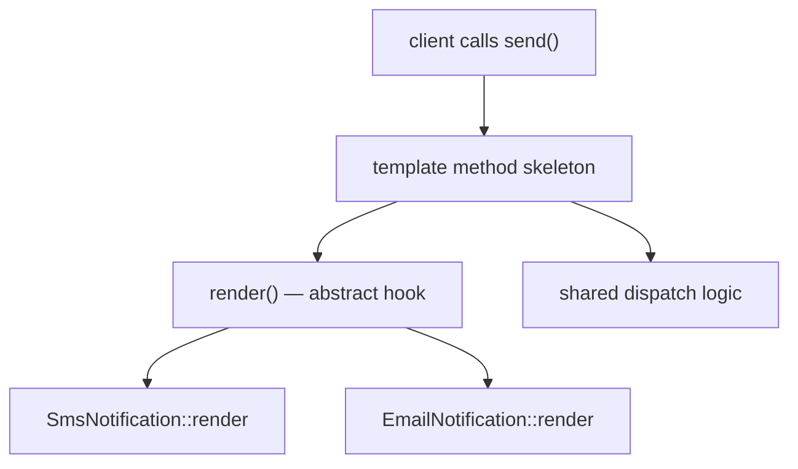

# Abstract Classes

!!! tip "In a nutshell"
    An abstract class can't be instantiated; it mixes shared state with methods
    subclasses must implement. Key fact: a single `abstract` method forces the
    whole class to be declared `abstract`, and you can `extends` only one.

!!! abstract "Learning objectives"
    By the end of this chapter you can:

    - [ ] Explain what `abstract` classes and methods enforce at compile time.
    - [ ] Choose between an abstract class and an interface for a given design.
    - [ ] Implement the **template method** pattern idiomatically.

    **Syllabus:** `PHP → Abstract classes` ·
    **Level:** Advanced ·
    **Est. time:** 25 min ·
    **Prerequisites:** [Interfaces](interfaces.md)

---

## Theory

An **abstract class** cannot be instantiated directly. It may mix concrete
members (with state and implementation) and **abstract methods** (signature only)
that concrete subclasses **must** implement. It is the tool for **partial
implementation + shared state**, whereas an interface is a pure contract.

| Question | Abstract class | Interface |
|---|---|---|
| Instantiable? | No | No |
| Can hold state? | Yes | No (constants only) |
| Multiple inheritance? | No (one parent) | Yes |
| Can define constructor? | Yes | No |
| Method bodies? | Yes + abstract | None |

## Deep Dive — how it works internally

### What `abstract` enforces

Declaring a method `abstract` forbids a body and forces subclasses to implement
a **signature-compatible** method (respecting variance from
[interfaces.md](interfaces.md)). A class with *any* abstract method must itself
be `abstract`. Instantiating an abstract class is a fatal `Error`.

```php
<?php
declare(strict_types=1);

abstract class Notification
{
    // Concrete shared state + logic.
    public function __construct(protected string $to) {}

    // Subclasses must supply the channel-specific piece.
    abstract protected function render(): string;

    // Template method: fixed algorithm, variable steps.
    final public function send(): void
    {
        $body = $this->render();
        error_log("→ {$this->to}: {$body}");
    }
}

final class SmsNotification extends Notification
{
    protected function render(): string
    {
        return "SMS to {$this->to}";
    }
}
```

### The template method pattern

`Notification::send()` above **is** the template method: it defines the fixed
skeleton of an algorithm (`render()` then dispatch) and defers the variable step
to subclasses via an abstract method. Marking `send()` `final` prevents
subclasses from breaking the algorithm's invariants.



Symfony's `AbstractController`, `AbstractType` (Forms) and many base classes are
abstract classes providing shared helpers while forcing you to fill in specifics.

!!! note "Source reference"
    `Symfony\Bundle\FrameworkBundle\Controller\AbstractController` is an abstract
    base with concrete helpers (`render`, `json`, `denyAccessUnlessGranted`) —
    [symfony/symfony `8.0`](https://github.com/symfony/symfony/blob/8.0/src/Symfony/Bundle/FrameworkBundle/Controller/AbstractController.php).

## Configuration & code

=== "PHP Attributes"

    ```php
    <?php
    declare(strict_types=1);

    abstract class Report
    {
        abstract public function rows(): iterable;

        // Concrete helper reused by every report.
        public function count(): int
        {
            return iterator_count(
                is_array($r = $this->rows()) ? new \ArrayIterator($r) : $r
            );
        }
    }
    ```

=== "Console"

    ```console
    $ php -r 'abstract class A{} new A();'
    PHP Fatal error:  Uncaught Error: Cannot instantiate abstract class A
    ```

## Best practices & anti-patterns

| ✅ Do | ❌ Avoid |
|---|---|
| Abstract class for shared state + skeleton | Deep abstract hierarchies |
| `final` on the template method | Overridable algorithm skeletons |
| Interface for the public contract | Abstract class where an interface suffices |
| Compose over inherit when possible | Forcing inheritance for code reuse |

## When (not) to use it / alternatives

- Choose an **abstract class** when subclasses share state/logic and a fixed
  algorithm skeleton (template method).
- Choose an **interface** when only a contract is needed, or when classes need
  multiple type inheritance.
- Prefer **composition / traits** ([traits.md](traits.md)) when the reuse is
  horizontal and not an "is-a" relationship.

!!! danger "Certification traps"
    - A class with **one** abstract method must be declared `abstract`, or it is a
      fatal error.
    - Abstract classes **can** have constructors, properties and constants —
      interfaces cannot.
    - Overriding an abstract method must obey variance rules (covariant return,
      contravariant params).
    - You can only `extends` **one** abstract class but `implements` many
      interfaces.

!!! warning "Common mistakes"
    - Trying to instantiate an abstract class (fatal `Error`).
    - Declaring an abstract method with a body (parse error).

## Exercises

1. **(Advanced)** Convert a base `Exporter` with a hard-coded format step into a
   template method with an abstract `format()` hook.
2. **(Advanced)** Explain why the template method is often `final`.

??? success "Solutions"

    **1.**
    ```php
    <?php
    declare(strict_types=1);

    abstract class Exporter
    {
        abstract protected function format(array $data): string;

        final public function export(array $data): string
        {
            $payload = $this->format($data);      // variable step
            return "BEGIN\n{$payload}\nEND";      // fixed skeleton
        }
    }
    ```

    **2.** `final` stops subclasses from overriding the skeleton and violating the
    algorithm's invariants — they may only customise the abstract hooks.

## Certification questions

??? question "Q1. A concrete class inherits an abstract method but does not implement it. Result?"
    - [x] A. Fatal error unless the class is declared `abstract` ✅
    - [ ] B. It silently returns null
    - [ ] C. It runs fine
    - [ ] D. A deprecation notice

    **Why:** Unimplemented abstract methods force the class to be abstract too.
    **Ref:** [Abstract classes](https://www.php.net/manual/en/language.oop5.abstract.php).

??? question "Q2. Which can an abstract class have that an interface cannot?"
    - [x] A. Properties and a constructor ✅
    - [ ] B. Multiple parents
    - [ ] C. Public method signatures
    - [ ] D. Constants

    **Why:** Abstract classes hold state and constructors; interfaces are contracts.
    **Ref:** [Interfaces](https://www.php.net/manual/en/language.oop5.interfaces.php).

??? question "Q3. The template method pattern is best expressed by…"
    - [x] A. A concrete (often `final`) method calling abstract hooks ✅
    - [ ] B. An interface with no bodies
    - [ ] C. A trait with static methods
    - [ ] D. A closure

    **Why:** The pattern fixes an algorithm skeleton and defers steps to
    subclasses. **Ref:** [Abstract classes](https://www.php.net/manual/en/language.oop5.abstract.php).

??? question "Q4. How many abstract classes can a class extend?"
    - [ ] A. Any number
    - [x] B. Exactly one ✅
    - [ ] C. Zero
    - [ ] D. Two

    **Why:** PHP has single class inheritance; interfaces are the multiple-inheritance
    mechanism. **Ref:** [Inheritance](https://www.php.net/manual/en/language.oop5.inheritance.php).

## Key takeaways

- Abstract classes = partial implementation + shared state; not instantiable.
- Any abstract method makes the whole class abstract.
- Template method: fixed skeleton (often `final`) + abstract hooks.
- One abstract parent, many interfaces.

## Last-minute revision

!!! tip "Cheat sheet"
    - `abstract` method = no body; subclass must implement (variance applies).
    - Can have ctor/props/constants; cannot be `new`-ed.
    - Template method: `final` skeleton → abstract hooks.
    - `extends` one class, `implements` many interfaces.

## Official References
- [PHP: Class Abstraction](https://www.php.net/manual/en/language.oop5.abstract.php)
- [PHP: Object Inheritance](https://www.php.net/manual/en/language.oop5.inheritance.php)
- [Symfony source — AbstractController](https://github.com/symfony/symfony/blob/8.0/src/Symfony/Bundle/FrameworkBundle/Controller/AbstractController.php)

---

<small>Related: [Interfaces](interfaces.md) · [Traits](traits.md) · [OOP](oop.md)</small>
