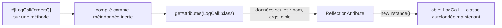

# Attributs

!!! tip "En bref"
    Un attribut (`#[...]`) est une métadonnée structurée, résolue à la
    compilation, attachée à une classe, une méthode, une propriété, un
    paramètre, une fonction ou (depuis PHP 8.3) une constante de classe. Il ne
    fait **rien par lui-même** — le lire est un choix explicite via la
    Reflection (`getAttributes()`), et l'instancier (`newInstance()`) est ce
    qui exécute réellement son constructeur. Les attributs Symfony `#[Route]`,
    `#[AsCommand]`, etc. sont consommés exactement de cette façon.

!!! example "Analogie concrète"
    Un attribut est un post-it collé sur un champ de formulaire — « à valider
    par le service juridique ». Le post-it ne change rien au remplissage du
    formulaire ; il ne compte que si *quelqu'un lit les post-it*
    (`getAttributes()`) puis *agit sur l'un d'eux* (`newInstance()`). Un
    formulaire dont personne ne consulte les post-it se comporte exactement
    comme un formulaire sans aucun post-it.

!!! abstract "Objectifs d'apprentissage"
    À la fin de ce chapitre, vous saurez :

    - [ ] Déclarer une classe d'attribut personnalisée et restreindre ses cibles autorisées.
    - [ ] Relire des attributs avec `ReflectionClass::getAttributes()` et
          comprendre *quand* la classe de l'attribut est réellement instanciée.
    - [ ] Expliquer pourquoi des attributs Symfony comme `#[Route]` ne sont que
          des métadonnées lues par Reflection, pas de la magie.

    **Syllabus :** `PHP → Attributs` ·
    **Niveau :** Avancé / Expert ·
    **Temps estimé :** 25 min ·
    **Prérequis :** [POO](oop.fr.md), [Interfaces](interfaces.fr.md)

---

## Pour les nuls

### L'idée en une phrase
Un attribut `#[...]` est une étiquette collée sur du code — elle ne fait rien toute seule, il faut que quelqu'un la lise pour qu'elle serve à quelque chose.

### Imagine dans la vraie vie
Un post-it collé sur un dossier disant "à relire par le service juridique" ne déclenche rien par magie : il faut que le service juridique passe, lise le post-it, et agisse en fonction. Sans personne pour le lire, le dossier avec post-it se comporte exactement comme un dossier sans post-it.

### Dans Symfony
`#[Route('/produits')]` au-dessus d'une méthode de contrôleur ne "route" rien par lui-même : au démarrage, Symfony lit tous ces attributs via Reflection et construit sa table de routage à partir de ce qu'il a trouvé. L'attribut est passif ; c'est Symfony qui agit dessus.

### Exemple simple
```php
#[Route('/bonjour')]
public function bonjour(): Response { return new Response('Salut !'); }
// Symfony lit cet attribut au démarrage — la méthode elle-même ignore qu'il existe
```

### Comment le mémoriser 🧠
Un attribut, c'est une **étiquette muette** : elle ne parle que si quelqu'un (Symfony, via Reflection) la lit à voix haute.


## Théorie

Un **attribut** est une métadonnée écrite `#[NomAttribut(args)]` juste
au-dessus d'une classe, d'une méthode, d'une propriété, d'une fonction, d'un
paramètre, ou (depuis PHP 8.3) d'une constante de classe. Contrairement à un
commentaire de docblock, il est **intégré à la structure compilée** — une
valeur réelle, typée, inspectable — mais par lui-même un attribut ne change
**rien** à l'exécution du code. Il n'a d'effet que lorsque quelque chose le
relit via l'API Reflection.

```php
#[Route('/orders/{id}', name: 'order_show', methods: ['GET'])]
public function show(int $id): Response { /* ... */ }
```

Ici, `Route` n'est pas une syntaxe spéciale : c'est une classe PHP ordinaire.
Le routeur de Symfony le lit via Reflection lors de la construction de la
collection de routes ; si rien n'appelait jamais `getAttributes()` sur cette
méthode, la ligne `#[Route(...)]` serait un texte inerte du point de vue de
PHP.

!!! question "Devinez d'abord"
    Vous posez `#[LogCall]` sur une méthode mais n'appelez jamais
    `getAttributes()` nulle part dans votre code. Le constructeur de
    `LogCall` s'exécute-t-il un jour ?

??? note "Réponse"
    **Non.** Un attribut n'est instancié que lorsque quelque chose appelle
    `newInstance()` sur le `ReflectionAttribute` obtenu via
    `getAttributes()`. Rien ne s'exécute automatiquement — les attributs sont
    des métadonnées inertes tant qu'un consommateur ne choisit pas de les
    lire.

## Approfondissement — le fonctionnement interne

### Déclarer une classe d'attribut

Marquez une classe avec l'attribut natif `#[\Attribute]` pour que PHP
l'accepte comme cible d'attribut. Son constructeur prend un bitmask
`int $flags` (par défaut `Attribute::TARGET_ALL`) construit à partir de ces
constantes de classe :

| Constante | Signification |
|---|---|
| `TARGET_CLASS` | Classes, interfaces, enums, traits |
| `TARGET_FUNCTION` | Fonctions nommées (hors méthodes) |
| `TARGET_METHOD` | Méthodes de classe |
| `TARGET_PROPERTY` | Propriétés de classe |
| `TARGET_CLASS_CONSTANT` | Constantes de classe (PHP 8.3+) |
| `TARGET_PARAMETER` | Paramètres de fonction/méthode |
| `TARGET_ALL` | Toutes les cibles ci-dessus (valeur par défaut) |
| `IS_REPEATABLE` | À combiner avec une cible pour autoriser la répétition |

```php
<?php
declare(strict_types=1);

namespace App\Attribute;

#[\Attribute(\Attribute::TARGET_METHOD | \Attribute::IS_REPEATABLE)]
final class LogCall
{
    public function __construct(
        public readonly string $channel = 'app',
    ) {}
}
```

Utiliser `LogCall` sur une classe ou une propriété est une erreur de
compilation (mauvaise cible) ; l'utiliser deux fois sur la même méthode
**sans** `IS_REPEATABLE` est aussi une erreur fatale — PHP rejette un
attribut non répétable dupliqué avant même que votre code ne s'exécute.

### Relire les attributs

Chaque reflector expose la même signature :
`getAttributes(?string $name = null, int $flags = 0): array<ReflectionAttribute>`.
Filtrer par `$name` avec le flag `ReflectionAttribute::IS_INSTANCEOF` capture
aussi les sous-classes, pas seulement une correspondance de classe exacte.

```php
$method = new \ReflectionMethod(OrderController::class, 'show');

foreach ($method->getAttributes(LogCall::class) as $attribute) {
    $attribute->getName();        // "App\Attribute\LogCall"
    $attribute->getArguments();   // ['channel' => 'orders'] ou mixte positionnel/nommé
    $attribute->getTarget();      // bitmask int, ex. Attribute::TARGET_METHOD
    $attribute->isRepeated();     // true si le même attribut apparaît >1 fois
    $instance = $attribute->newInstance(); // le construit MAINTENANT — autoload la classe
}
```

`getAttributes()` n'instancie jamais rien — elle expose seulement le nom, les
arguments et la cible sous forme de données. `newInstance()` est le seul
appel qui déclenche l'autoload et exécute le constructeur. Cette paresse
explique pourquoi une classe peut porter des dizaines d'attributs venant de
bibliothèques qu'elle n'utilise même pas à l'exécution : lire la liste est
gratuit ; seuls les attributs consommés coûtent à construire.



### Comment Symfony consomme les attributs

Les attributs de Symfony sont des classes ordinaires construites de la même
façon. `Route` déclare
`#[\Attribute(\Attribute::IS_REPEATABLE | \Attribute::TARGET_CLASS
| \Attribute::TARGET_METHOD)]` — répétable (une méthode peut porter deux
`#[Route]` pour deux chemins) et valide à la fois sur les classes (un
préfixe) et les méthodes. Le loader d'attributs du routeur parcourt les
contrôleurs avec `getAttributes(Route::class)` et appelle `newInstance()`
pour construire chaque objet `Route` ; rien n'est magique au-delà de la
Reflection.

!!! note "Référence source"
    `Symfony\Component\Routing\Attribute\Route` —
    [symfony/symfony `8.0`](https://github.com/symfony/symfony/blob/8.0/src/Symfony/Component/Routing/Attribute/Route.php).

### Attributs natifs de PHP

PHP fournit lui-même quelques classes d'attributs à consommer, pas à
déclarer :

| Attribut | Depuis | Cible | Rôle |
|---|---|---|---|
| `#[\Override]` | 8.3 | Méthode | Affirme que la méthode surcharge une méthode parente/d'interface |
| `#[\SensitiveParameter]` | 8.2 | Paramètre | Masque l'argument dans les traces de pile |
| `#[\AllowDynamicProperties]` | 8.2 | Classe | Réautorise les propriétés dynamiques (dépréciées par défaut) |
| `#[\ReturnTypeWillChange]` | 8.1 | Méthode | Silence une dépréciation d'élargissement de type de retour |
| `#[\Deprecated]` | 8.4 | Méthode/fonction/constante de classe | Déclare une dépréciation utilisateur (`message`, `since` optionnels) |

`#[\Override]` et les fonctionnalités PHP 8.4 (constantes typées, property
hooks) sont couvertes dans [l'API PHP](php-api.fr.md) ; ce chapitre porte sur
le *mécanisme* d'attribut lui-même, sur lequel ces fonctionnalités reposent.

### Comportement en cas d'absence

`getAttributes()` sur une cible sans attribut renvoie un **tableau vide**,
jamais `null` — un simple `foreach` est toujours sûr. Appeler
`newInstance()` sur un attribut dont la classe n'existe pas (ou n'est pas
autoloadable) lève une `Error` à cet appel précis, pas au moment où
l'attribut a été déclaré — l'échec est différé jusqu'au point
d'instanciation.

```php
foreach ($method->getAttributes(LogCall::class) as $attr) { /* 0+ fois */ }
// aucun attribut LogCall -> getAttributes() renvoie [] -> le corps ne s'exécute jamais

$attr->newInstance(); // Error levée ICI si App\Attribute\LogCall n'autoload pas
                       // — pas au moment où le fichier contenant #[LogCall] a été analysé
```

!!! note "L'absence en pratique"
    Un post-it que personne n'a écrit n'est pas un post-it manquant — c'est
    simplement une liste vide de post-it à lire. La seule façon d'« échouer »
    est de tenter d'agir sur un post-it qui référence quelque chose qui
    n'existe pas.

## Configuration & code

=== "Déclaration & lecture"

    ```php
    <?php
    declare(strict_types=1);

    namespace App\Attribute;

    #[\Attribute(\Attribute::TARGET_METHOD | \Attribute::IS_REPEATABLE)]
    final class LogCall
    {
        public function __construct(
            public readonly string $channel = 'app',
        ) {}
    }
    ```

=== "Consommateur"

    ```php
    <?php
    declare(strict_types=1);

    namespace App\Logging;

    use App\Attribute\LogCall;

    final class LogCallCompilerPass
    {
        /** @return LogCall[] */
        public function attributesOn(string $class, string $method): array
        {
            $reflection = new \ReflectionMethod($class, $method);

            return array_map(
                static fn (\ReflectionAttribute $a) => $a->newInstance(),
                $reflection->getAttributes(LogCall::class),
            );
        }
    }
    ```

## Bonnes pratiques et anti-patterns

| ✅ À faire | ❌ À éviter |
|---|---|
| Restreindre `TARGET_*` à ce qui a du sens | Laisser `TARGET_ALL` par défaut pour un concept réservé aux méthodes |
| Utiliser `IS_REPEATABLE` quand >1 occurrence a un sens | Répéter un attribut non répétable (erreur fatale) |
| Lire les attributs une fois, à la compilation/au boot | Appeler `getAttributes()`/`newInstance()` à chaque requête |
| Garder le constructeur de l'attribut sans effet de bord | Faire des I/O dans le `__construct()` d'un attribut |

## Quand (ne pas) l'utiliser / alternatives

Utilisez un attribut pour des **métadonnées structurelles déclaratives**
lues une fois (par un compiler pass, un loader, ou le framework) — routes,
commandes, tags de service, contraintes de validation. Préférez une simple
interface ou méthode quand le comportement doit s'exécuter à chaque appel :
un attribut ne porte que des données, il n'est pas lui-même invoqué.

!!! danger "Pièges de certification"
    - Un attribut ne fait **rien** tant que quelque chose n'appelle pas
      `getAttributes()` **et** `newInstance()` — le déclarer seul n'a aucun
      effet à l'exécution.
    - `getAttributes()` renvoie des *données* (nom, arguments, cible) ; seul
      `newInstance()` construit l'objet et autoload sa classe.
    - La cible par défaut est `Attribute::TARGET_ALL` ; omettre les flags ne
      signifie **pas** « aucune cible autorisée ».
    - Deux attributs non répétables de la même classe sur une même cible
      provoquent une erreur fatale, pas un écrasement silencieux.
    - `ReflectionAttribute::IS_INSTANCEOF` capture les sous-classes de
      `$name`, pas seulement une correspondance de classe exacte.

!!! warning "Erreurs fréquentes"
    - Croire que le constructeur d'un attribut s'exécute automatiquement à
      l'analyse — il ne s'exécute que sur un `newInstance()` explicite.
    - Oublier `IS_REPEATABLE` et être surpris par une erreur fatale à la
      deuxième utilisation de l'attribut sur la même cible.

## Exercices

1. **(Avancé)** Déclarez un attribut `#[Cacheable(ttl: 60)]` valide
   uniquement sur les méthodes, et relisez-le via Reflection sans
   l'instancier.
2. **(Expert)** Rendez `#[Cacheable]` répétable et écrivez le code qui liste
   chaque occurrence sur une méthode avec ses arguments.

??? success "Solutions"

    **1.**
    ```php
    #[\Attribute(\Attribute::TARGET_METHOD)]
    final class Cacheable
    {
        public function __construct(public readonly int $ttl = 0) {}
    }

    $attrs = (new \ReflectionMethod(Service::class, 'find'))
        ->getAttributes(Cacheable::class); // données seules — rien n'est instancié encore
    ```

    **2.** Ajoutez `\Attribute::IS_REPEATABLE` aux flags, puis
    `foreach ($attrs as $a) { $a->getArguments(); }` lit chaque occurrence
    sans appeler `newInstance()`.

## Questions de certification

??? question "Q1. Quand le constructeur de `LogCall` s'exécute-t-il si `#[LogCall]` est posé sur une méthode ?"
    - [ ] A. Immédiatement à l'analyse du fichier
    - [ ] B. La première fois que la méthode est appelée
    - [x] C. Seulement quand quelque chose appelle `newInstance()` sur l'attribut lu ✅
    - [ ] D. Jamais — les attributs ne peuvent pas être instanciés

    **Pourquoi :** les attributs sont des métadonnées inertes ;
    `getAttributes()` renvoie des données, `newInstance()` est le seul appel
    qui construit l'objet. **Réf :** [PHP : Attributs](https://www.php.net/manual/en/language.attributes.php).

??? question "Q2. Que renvoie `getAttributes()` quand aucun attribut correspondant n'est présent ?"
    - [x] A. Un tableau vide ✅
    - [ ] B. `null`
    - [ ] C. `false`
    - [ ] D. Lève `ReflectionException`

    **Pourquoi :** un attribut absent est représenté par une liste vide,
    jamais `null` — un simple `foreach` est toujours sûr.
    **Réf :** [PHP : ReflectionClass::getAttributes](https://www.php.net/manual/en/reflectionclass.getattributes.php).

??? question "Q3. Que se passe-t-il si un attribut non répétable est appliqué deux fois à la même méthode ?"
    - [ ] A. La seconde application écrase silencieusement la première
    - [x] B. PHP lève une erreur fatale avant l'exécution du code ✅
    - [ ] C. `getAttributes()` ne renvoie que la première
    - [ ] D. Les deux s'appliquent, fusionnées en une instance

    **Pourquoi :** `IS_REPEATABLE` doit être présent pour qu'une cible porte
    plusieurs fois le même attribut ; sinon il est rejeté d'emblée.
    **Réf :** [PHP : Attributs — Attributs répétés](https://www.php.net/manual/en/language.attributes.reflection.php).

??? question "Q4. Quels flags déclare `Symfony\Component\Routing\Attribute\Route` ?"
    - [ ] A. `TARGET_ALL` uniquement
    - [x] B. `IS_REPEATABLE \| TARGET_CLASS \| TARGET_METHOD` ✅
    - [ ] C. `TARGET_METHOD` uniquement, non répétable
    - [ ] D. `TARGET_PROPERTY \| TARGET_PARAMETER`

    **Pourquoi :** `Route` est valide sur les classes (un préfixe de chemin)
    et les méthodes, et répétable pour qu'une action expose deux chemins.
    **Réf :** [Source Symfony — Route](https://github.com/symfony/symfony/blob/8.0/src/Symfony/Component/Routing/Attribute/Route.php).

## Ce qu'il faut retenir

- Un attribut est une métadonnée inerte : il ne fait rien tant qu'il n'est
  pas lu via Reflection.
- `getAttributes()` renvoie des données (nom/arguments/cible) ;
  `newInstance()` est le seul appel qui construit l'objet et autoload sa
  classe.
- `Attribute::TARGET_*` restreint où un attribut peut être utilisé ;
  `IS_REPEATABLE` autorise plus d'une occurrence sur la même cible.
- Les attributs Symfony (`#[Route]`, `#[AsCommand]`, etc.) sont des classes
  d'attribut ordinaires — les loaders du framework sont le « quelque chose »
  qui les lit et les instancie.

## Révision de dernière minute

!!! tip "Fiche de révision"
    - Déclarer : `#[\Attribute(TARGET_* | IS_REPEATABLE)]` au-dessus de la classe.
    - Lire : `getAttributes(?string $name = null, int $flags = 0): array`.
    - `ReflectionAttribute` : `getName()`, `getArguments()`, `getTarget()`,
      `isRepeated()`, `newInstance()`.
    - `ReflectionAttribute::IS_INSTANCEOF` — capture aussi les sous-classes.
    - Les constantes de classe peuvent porter des attributs depuis PHP **8.3**.

## Connexions

- **Dépend de :** [POO](oop.fr.md) — une classe d'attribut est une classe
  ordinaire avec un constructeur.
- **Réutilisé dans :** [Routing](../routing/configuration.fr.md), [Console](../console/custom-commands.fr.md),
  [Injection de dépendances](../dependency-injection/registration.fr.md) — `#[Route]`,
  `#[AsCommand]`, `#[Autowire]` sont tous consommés exactement ainsi.
- **À ne pas confondre avec :** [l'API PHP](php-api.fr.md) — ce chapitre-là
  couvre `#[\Override]` et d'autres fonctionnalités du langage ; celui-ci
  couvre le mécanisme d'attribut lui-même.

## Références officielles
- [Manuel PHP — Attributs](https://www.php.net/manual/en/language.attributes.php)
- [Manuel PHP — API Reflection et attributs](https://www.php.net/manual/en/language.attributes.reflection.php)
- [Source Symfony — attribut Route](https://github.com/symfony/symfony/blob/8.0/src/Symfony/Component/Routing/Attribute/Route.php)

## Références vidéo

!!! tip "Regarder pour progresser"
    Ce sont des chaînes vidéo officielles, mises à jour en continu —
    cherchez-y « PHP attributes » pour renforcer ce chapitre. Nous renvoyons
    vers des chaînes stables plutôt que des vidéos individuelles pour que les
    références ne deviennent jamais obsolètes.

    - [Screencasts SymfonyCasts](https://symfonycasts.com/tracks/symfony) — tutoriels scriptés en code.
    - [YouTube officiel Symfony](https://www.youtube.com/@SymfonyOfficial) — conférences et keynotes SymfonyCon.
    - [Documentation officielle du sujet](https://www.php.net/manual/en/language.attributes.php) — la page du manuel PHP sur les attributs.

## Auto-évaluation

Je suis prêt(e) quand je peux :

- [ ] expliquer **pourquoi** un attribut seul n'a aucun effet à l'exécution
- [ ] déclarer un attribut ciblé et répétable et le relire en Symfony 8
- [ ] déboguer un code qui attendait de `getAttributes()` qu'elle instancie quelque chose
- [ ] repérer le piège : la cible par défaut est `TARGET_ALL`, pas « aucune »
- [ ] expliquer comment `#[Route]`/`#[AsCommand]` de Symfony sont lus via Reflection, sans magie

---

<small>Voir aussi : [POO](oop.fr.md) · [API PHP](php-api.fr.md) · [Interfaces](interfaces.fr.md)</small>
