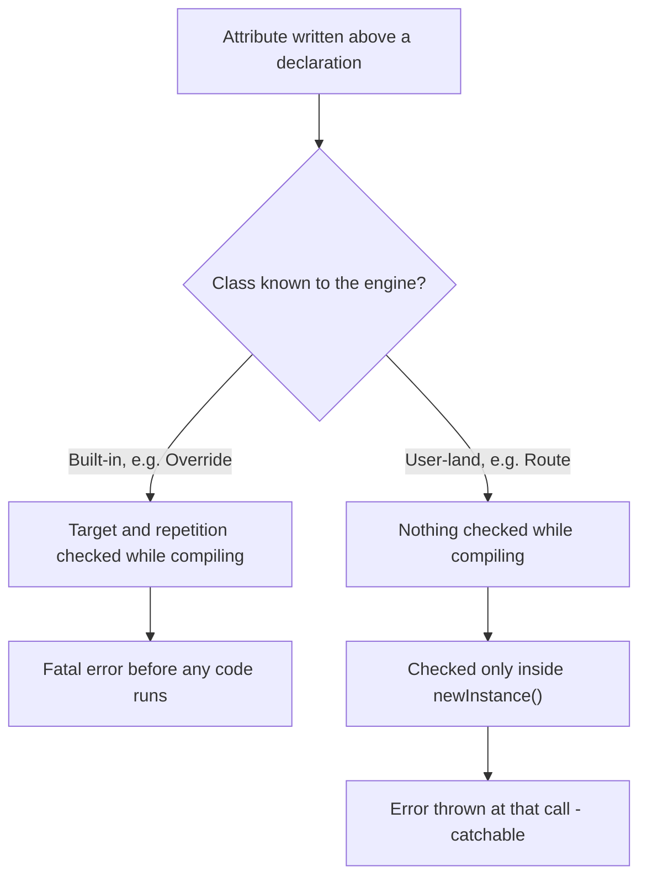
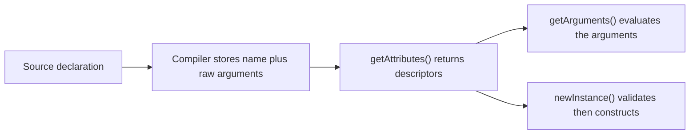

# Attributes

!!! tip "In a nutshell"
    An attribute (`#[...]`) is structured metadata the compiler stores next to a
    declaration. It is **inert**: `getAttributes()` hands you descriptors made of a
    name plus unevaluated arguments, and `newInstance()` is the single call that
    autoloads the attribute class, checks its `TARGET_*` flags and repeatability,
    and runs its constructor. The exam hinge: for **user-land** attributes every one
    of those checks is deferred to `newInstance()` — only the engine's own built-ins
    such as `#[\Override]` are validated at compile time.

!!! example "Real-world analogy"
    An attribute is an airport **baggage tag**. Printing it changes nothing about
    the bag; the tag simply travels attached to it. The data only becomes useful
    when a handler *scans* it (`getAttributes()`), and the bag only moves when the
    sorting system *acts* on what it read (`newInstance()`). And here is the part
    people get wrong: a tag printed for a destination the airline does not serve is
    **not** rejected by the printer. It is rejected by the first machine that tries
    to act on it — exactly like a user-land attribute on a target its flags forbid.

!!! abstract "Learning objectives"
    By the end of this chapter you can:

    - [ ] Declare an attribute class, combine `TARGET_*` flags with `IS_REPEATABLE`,
          and say precisely which declarations each flag covers.
    - [ ] Distinguish `getAttributes()` (data), `getArguments()` (evaluated
          arguments) and `newInstance()` (validation + construction), and state
          **when** each error surfaces.
    - [ ] Explain how Symfony reads `#[Route]`, `#[AsCommand]`, `#[AsEventListener]`
          and `#[Autoconfigure]` with Reflection, and why `IS_INSTANCEOF` matters.

    **Syllabus:** `PHP → Attributes` ·
    **Level:** Advanced / Expert ·
    **Est. time:** 45 min ·
    **Prerequisites:** [OOP](oop.md), [Interfaces](interfaces.md)

    **Examen Symfony 8 :** OUI

---

## Prerequisites

You should be comfortable with classes, constructors and promoted properties from
[OOP](oop.md), and with the idea of a contract from [Interfaces](interfaces.md).
Everything below targets **PHP 8.4**; attributes themselves landed in **PHP 8.0**,
and three later versions changed details that are prime distractor material.

## The problem we are solving

Before PHP 8, configuration that belonged *next to the code* had nowhere to live
except a docblock:

```php
/**
 * @Route("/orders/{id}", name="order_show")
 */
public function show(int $id): Response { /* ... */ }
```

A docblock is a **string**. To use it, a framework had to fetch the raw comment
through Reflection and parse it with a hand-written tokenizer — Doctrine's
annotation reader was thousands of lines of exactly that. Nothing was checked: a
typo in `name=` was discovered at runtime, an IDE could not rename the class, and
`opcache.save_comments=0` silently deleted your entire configuration.

An attribute solves this by making the metadata part of the **language**:

```php
#[Route('/orders/{id}', name: 'order_show', methods: ['GET'])]
public function show(int $id): Response { /* ... */ }
```

`Route` is now a real class name resolved through `use` statements and namespaces.
The compiler parses the arguments, so a syntax mistake is a parse error. And what
you get back through Reflection is structured data, not text to re-parse. The rest
of this chapter is about the cost of that deal: because the metadata is stored
rather than executed, **something has to read it**, and almost every attribute bug
comes from a wrong assumption about *when* that reading happens.

!!! info "PHP 8.4 reference"
    https://www.php.net/manual/en/language.attributes.overview.php

## 🧠 Pour les nuls

**C'est quoi ?** Un attribut `#[...]` est une **fiche de consignes** que le
compilateur PHP range à côté d'une classe, d'une méthode, d'une propriété, d'un
paramètre, d'une fonction ou d'une constante de classe. Il ne contient aucun code
qui s'exécute : il contient un **nom de classe** et des **arguments**.

**Pourquoi ça existe ?** Avant PHP 8, ce genre d'information vivait dans un
commentaire `/** @Route(...) */`. Un commentaire n'est que du texte : le
framework devait le relire caractère par caractère, aucune faute de frappe
n'était détectée, et une option d'OPcache pouvait supprimer les commentaires —
donc supprimer la configuration. L'attribut règle ça en faisant entrer la donnée
dans le langage lui-même.

**🏠 Analogie de la vraie vie :** la **fiche de consignes accrochée à un colis**
dans un entrepôt. Le colis circule exactement pareil, avec ou sans fiche. Tant
que personne ne décroche la fiche, elle ne produit rien. Et surtout : si la fiche
dit « à réfrigérer » alors que le colis contient des livres, l'entrepôt ne s'en
rend pas compte au moment où on l'accroche — l'erreur n'apparaît qu'au moment où
un opérateur essaie **d'appliquer** la consigne. C'est très exactement le
comportement de PHP avec les attributs que tu écris toi-même.

**Symfony dans la vraie vie :** la fiche → l'attribut (`#[Route('/produits')]`) /
l'opérateur qui décroche la fiche → `getAttributes()` / l'opérateur qui applique
la consigne → `newInstance()` / l'entrepôt → le routeur de Symfony, qui parcourt
tes contrôleurs au démarrage et construit sa table de routage à partir de ce
qu'il a lu.

**💻 Exemple Symfony extrêmement simple :**
```php
#[Route('/bonjour', name: 'bonjour')]
public function bonjour(): Response
{
    return new Response('Salut !');
}
```
Ligne 1 : la fiche de consignes. La méthode elle-même ignore totalement qu'elle
existe : tu peux appeler `$controleur->bonjour()` directement, l'attribut ne
change rien. C'est Symfony qui, au démarrage, lit la fiche et crée la route.

**🔍 Que se passe-t-il réellement ?**
1. PHP compile le fichier et range « classe `Route` + arguments » à côté de la méthode.
2. Rien ne s'exécute : la classe `Route` n'est même pas chargée.
3. Symfony fait `$methode->getAttributes(Route::class, ...)` et récupère des
   descripteurs (nom + arguments), toujours sans construire d'objet.
4. Symfony appelle `newInstance()` sur chaque descripteur.
5. **Là seulement** PHP charge la classe `Route`, vérifie que la cible est
   autorisée, vérifie la répétition, puis exécute le constructeur.
6. Symfony reçoit un objet `Route` et ajoute la route à sa collection.

**⚠️ Erreur fréquente :** croire qu'un attribut « s'exécute ». Il ne s'exécute
jamais tout seul. Le corollaire piège l'examen : si tu poses un attribut sur une
cible interdite par ses `TARGET_*`, ton fichier se compile **sans la moindre
erreur**. Le message « cannot target class » n'arrive qu'à l'appel de
`newInstance()` — donc peut-être jamais, si personne ne lit cet attribut.

**🧠 Comment le mémoriser ?** *« La fiche ne se lit pas toute seule, et personne
ne la relit avant de l'appliquer. »* Deux verbes, deux moments : **lire**
(`getAttributes()`, gratuit) puis **appliquer** (`newInstance()`, où tout est
vérifié et où tout peut casser).

## Build the mental model

Hold three ideas together and every rule below follows.

**One: the compiler stores, it does not evaluate.** Writing `#[Route('/x')]`
appends a record — a class name plus an argument list kept as unevaluated constant
expressions — to the compiled declaration. The class `Route` is not autoloaded,
its constructor is not called, and its flags are not consulted.

**Two: reading is deliberately split in two.** `getAttributes()` gives you a
`ReflectionAttribute`, a *descriptor*. Only `newInstance()` turns a descriptor into
an object. The manual states the reason plainly: separating the two gives the
consumer control over error handling — missing attribute classes, mistyped
arguments, missing values — because validation happens at the moment you ask for
the instance.

**Three: user-land and built-in attributes are validated at different times.** The
compiler knows its own attributes (`#[\Attribute]`, `#[\Override]`,
`#[\SensitiveParameter]`, …) and checks their targets while compiling. It knows
nothing about `#[Route]`, so it checks nothing.



The diagram carries one load-bearing fact, repeated here in prose so it is never
only in a picture: **a misplaced built-in attribute is a fatal error at compile
time, while a misplaced user-land attribute is an `Error` thrown by
`newInstance()`** — and therefore invisible until someone reads it.

!!! info "PHP 8.4 reference"
    https://www.php.net/manual/en/language.attributes.classes.php

## Core concepts

### Syntax

An attribute declaration opens with `#[` and closes with `]`. Inside, one or more
attributes may be listed, separated by commas. The name may be unqualified,
qualified or fully qualified and is resolved exactly like any other class name, so
`use` statements apply. Arguments are optional, enclosed in parentheses, and may be
**literal values or constant expressions** only — in both positional and named form.

```php
<?php
namespace App;

use App\Attribute\Tag;

#[Tag]                              // no arguments, no parentheses
#[\App\Attribute\Tag]               // fully qualified
#[Tag('audit')]                     // positional
#[Tag(name: 'audit')]               // named
#[Tag(Tag::DEFAULT_NAME)]           // constant expression
#[Tag(10 * 2)]                      // evaluated constant expression
#[Tag('a'), Tag('b')]               // two attributes in one group
class Invoice {}
```

Since **PHP 8.1** a `new` expression is also a legal attribute argument, as part of
the *new in initializers* change — this is why `#[Assert\Callback(new Expression(...))]`
style arguments are possible at all.

!!! info "PHP 8.4 reference"
    https://www.php.net/manual/en/language.attributes.syntax.php

### Declaring an attribute class

A class becomes usable as an attribute by carrying `#[\Attribute]` itself. The
`Attribute` class takes one constructor argument, `int $flags`, defaulting to
`Attribute::TARGET_ALL`. `Attribute` is `final` and is itself declared
`#[Attribute(Attribute::TARGET_CLASS)]`, so `#[\Attribute]` above a *function* is
an immediate fatal error.

```php
<?php
declare(strict_types=1);

namespace App\Attribute;

#[\Attribute(\Attribute::TARGET_METHOD | \Attribute::IS_REPEATABLE)]
final class LogCall
{
    public function __construct(
        public readonly string $channel = 'app',
    ) {}
}
```

The `Attribute` class exposes exactly eight constants — seven targets plus the
repeatability flag:

| Constant | Value | Covers |
|---|---|---|
| `TARGET_CLASS` | 1 | Classes, **interfaces, traits and enums** |
| `TARGET_FUNCTION` | 2 | Named functions, **closures and arrow functions** |
| `TARGET_METHOD` | 4 | Methods |
| `TARGET_PROPERTY` | 8 | Properties |
| `TARGET_CLASS_CONSTANT` | 16 | Class constants **and enum cases** |
| `TARGET_PARAMETER` | 32 | Function and method parameters |
| `TARGET_ALL` | 63 | The six targets above, combined |
| `IS_REPEATABLE` | 64 | Allows the same attribute more than once |

Two numeric facts are worth memorising because they are decidable in one second:
`TARGET_ALL` is `63`, the sum of the six target bits, and `IS_REPEATABLE` is `64`,
a **separate** bit. So `TARGET_ALL` does *not* make an attribute repeatable, and
`#[\Attribute]` with no arguments means "usable anywhere, once per declaration".

!!! info "PHP 8.4 reference"
    https://www.php.net/manual/en/language.attributes.classes.php

### Reading attributes back

Every reflector that can carry attributes exposes the same signature:

```php
public function getAttributes(
    ?string $name = null,
    int $flags = 0,
): array   // array<ReflectionAttribute>
```

The reflectors are `ReflectionClass` (and `ReflectionObject`, `ReflectionEnum`),
`ReflectionMethod`, `ReflectionFunction`, `ReflectionProperty`,
`ReflectionClassConstant` (and `ReflectionEnumUnitCase` / `ReflectionEnumBackedCase`)
and `ReflectionParameter` — one per target in the table above.

`$flags` is only consulted **when `$name` is provided**, and
`ReflectionAttribute::IS_INSTANCEOF` is the only value it accepts; it switches
filtering from an exact class match to an `instanceof` check.

```php
$method = new \ReflectionMethod(OrderController::class, 'show');

foreach ($method->getAttributes(LogCall::class) as $attribute) {
    $attribute->getName();        // 'App\Attribute\LogCall' — a string
    $attribute->getArguments();   // [0 => 'orders'] or ['channel' => 'orders']
    $attribute->getTarget();      // 4 — Attribute::TARGET_METHOD
    $attribute->isRepeated();     // true when the same class appears >1 time here
    $log = $attribute->newInstance();   // constructs it NOW
}
```

`ReflectionAttribute` implements `Reflector`, has a **private constructor** (you
never build one yourself), and since **PHP 8.4** exposes a public `string $name`
property alongside `getName()`, purely to improve `var_dump()` output.

!!! info "PHP 8.4 reference"
    https://www.php.net/manual/en/class.reflectionattribute.php

## Learn by doing

Build one attribute and watch each guarantee appear — or fail to appear. Every step
changes exactly one thing.

**Step 1 — declare it, deliberately over-restricted.**

```php
#[\Attribute(\Attribute::TARGET_METHOD)]
final class Cacheable
{
    public function __construct(public readonly int $ttl = 60) {}
}
```

**Step 2 — use it on the wrong target on purpose.**

```php
#[Cacheable(300)]      // on a CLASS, but the flags allow methods only
final class ProductRepository {}
```

Run `php -l` on the file. It passes. Load the class. It loads. Instantiate it. It
works. Nothing complains, because nothing has read the attribute yet.

**Step 3 — read it as data.**

```php
$attrs = (new \ReflectionClass(ProductRepository::class))
    ->getAttributes(Cacheable::class);

count($attrs);              // 1
$attrs[0]->getName();       // 'Cacheable'
$attrs[0]->getArguments();  // [0 => 300]
$attrs[0]->getTarget();     // 1 — TARGET_CLASS, where it was USED
```

Still no complaint. Note what `getTarget()` means: it reports **where this
attribute was written**, not what its flags allow. Here it is `1` even though
`Cacheable` only permits `4`.

**Step 4 — ask for the object, and watch it break.**

```
Error: Attribute "Cacheable" cannot target class (allowed targets: method)
```

That is an `Error` thrown by `newInstance()`, at that line, in a normal call stack.
You can `try`/`catch` it — which you could never do with a compile-time fatal.

**Step 5 — repeat it without `IS_REPEATABLE`.** Put two `#[Cacheable]` on one
method. `getAttributes()` returns **two** entries and `isRepeated()` is `true` on
both. Only `newInstance()` refuses:

```
Error: Attribute "Cacheable" must not be repeated
```

**Step 6 — add the flag.** Change the declaration to
`#[\Attribute(\Attribute::TARGET_METHOD | \Attribute::IS_REPEATABLE)]` and the same
code now returns two independent `Cacheable` objects.

The pattern to carry into the exam: **`getAttributes()` never validates anything.
`newInstance()` validates everything.**

## How Symfony handles it

Symfony's attributes are ordinary classes with ordinary flags. Nothing about them
is special-cased by PHP; the framework is simply the "someone" that reads the tags.

| Symfony 8.0 attribute | Declared flags |
|---|---|
| `Routing\Attribute\Route` | `IS_REPEATABLE \| TARGET_CLASS \| TARGET_METHOD` |
| `Console\Attribute\AsCommand` | `TARGET_CLASS` |
| `EventDispatcher\Attribute\AsEventListener` | `TARGET_CLASS \| TARGET_METHOD \| IS_REPEATABLE` |
| `DependencyInjection\Attribute\Autoconfigure` | `TARGET_CLASS \| IS_REPEATABLE` |
| `DependencyInjection\Attribute\AutoconfigureTag` | `TARGET_CLASS \| IS_REPEATABLE` |
| `DependencyInjection\Attribute\Autowire` | `TARGET_PARAMETER \| TARGET_PROPERTY` |

Each row explains a product decision. `Route` is repeatable so one action can serve
two paths, and allowed on classes so a controller can declare a prefix. `AsCommand`
is class-only and the class is `final` — a command is one class, once. `Autowire`
allows both parameters *and* properties precisely because a promoted constructor
property is visible from both sides (see [Edge cases](#edge-cases)).

The routing loader is the clearest example of the two-step read. Its private
helper filters with `IS_INSTANCEOF` and yields instances:

```php
foreach ($reflection->getAttributes(
    $this->routeAttributeClass,
    \ReflectionAttribute::IS_INSTANCEOF,
) as $attribute) {
    yield $attribute->newInstance();
}
```

`IS_INSTANCEOF` is what lets you subclass `Route` (or swap the class entirely with
`setRouteAttributeClass()`) and still be found. Two behaviours in that loader are
worth knowing exactly, because both are visible in the source:

- On a **non-invokable** controller, only the **first** class-level `#[Route]` is
  read, and it supplies the prefix, name prefix, defaults, requirements, methods
  and host for every action.
- On an **invokable** controller that produced no method routes, **every**
  class-level `#[Route]` becomes a real route.

!!! note "Symfony 8.0 source reference"
    https://github.com/symfony/symfony/blob/8.0/src/Symfony/Component/Routing/Loader/AttributeClassLoader.php

The dependency-injection container does the same thing for autoconfiguration:
`RegisterAutoconfigureAttributesPass` calls
`$class->getAttributes(Autoconfigure::class, \ReflectionAttribute::IS_INSTANCEOF)`
and then `newInstance()`. Because `AutoconfigureTag` **extends** `Autoconfigure`,
one `IS_INSTANCEOF` query finds both — a textbook use of the flag.

!!! note "Symfony 8.0 source reference"
    https://github.com/symfony/symfony/blob/8.0/src/Symfony/Component/DependencyInjection/Compiler/RegisterAutoconfigureAttributesPass.php

!!! info "Official Symfony 8.0 reference"
    https://symfony.com/doc/8.0/reference/attributes.html

## How it works internally

Follow one attribute from source to object.



1. **Compilation.** The attribute is attached to the compiled declaration as a name
   plus an argument list held as *unevaluated* constant expressions. Two mistakes
   are caught here even for user-land attributes, because they are pure syntax:
   a duplicate named parameter, and a positional argument placed after a named one.
2. **`getAttributes()`.** Returns `ReflectionAttribute` descriptors. No autoloading,
   no constructor, no flag check. This is why a class may carry attributes from
   libraries that are not even installed at runtime: listing them is free.
3. **`getArguments()`.** Evaluates the stored constant expressions and returns them
   as an array — **positional arguments at integer keys, named arguments at string
   keys**, in source order. The attribute class is still never touched.
4. **`newInstance()`.** Performs, strictly in this order: resolve the attribute
   class (autoloading it), verify the class actually carries `#[Attribute]`, verify
   the target is permitted by its flags, verify repetition is permitted, then invoke
   the constructor with the evaluated arguments.

That ordering is directly observable in the messages, and it is exam-grade material:

| Failure | Message | Raised by |
|---|---|---|
| Class cannot be autoloaded | `Attribute class "X" not found` | `newInstance()` |
| Class lacks `#[Attribute]` | `Attempting to use non-attribute class "X" as attribute` | `newInstance()` |
| Target not permitted | `Attribute "X" cannot target class (allowed targets: method)` | `newInstance()` |
| Repeated without the flag | `Attribute "X" must not be repeated` | `newInstance()` |
| Missing constructor argument | `ArgumentCountError` | the constructor |
| Wrong argument type | `TypeError` | the constructor |

Two consequences that surprise almost everyone:

- **Nothing is memoised.** Calling `newInstance()` twice on the same
  `ReflectionAttribute` returns two *different* objects — `$a !== $b`. Frameworks
  therefore cache the result themselves; Symfony reads attributes during container
  compilation and route dumping, not per request.
- **`getArguments()` re-evaluates.** If an argument is a `new` expression, every
  call to `getArguments()` constructs a fresh object, and so does every
  `newInstance()`.

!!! info "PHP 8.4 reference"
    https://www.php.net/manual/en/language.attributes.reflection.php

## All supported cases and variations

### Where attributes may be written

The six targets map to concrete syntax positions. Several of them cover more than
their name suggests:

| Written on | Reported `getTarget()` | Read with |
|---|---|---|
| Class | `1` | `ReflectionClass` |
| Interface, trait, enum | `1` | `ReflectionClass` / `ReflectionEnum` |
| Anonymous class | `1` | `ReflectionClass` |
| Named function | `2` | `ReflectionFunction` |
| Closure, arrow function | `2` | `ReflectionFunction` |
| Method | `4` | `ReflectionMethod` |
| Property | `8` | `ReflectionProperty` |
| Class constant | `16` | `ReflectionClassConstant` |
| Enum case | `16` | `ReflectionEnumUnitCase` / `…BackedCase` |
| Parameter | `32` | `ReflectionParameter` |

Note carefully: **class constants have been a valid attribute target since PHP 8.0**,
not 8.3 — `TARGET_CLASS_CONSTANT` was part of the original feature. What arrived in
8.3 is the unrelated `#[\Override]` attribute. Enum cases reuse the class-constant
target because that is what an enum case is.

### Attribute inheritance — there is none

This is the variation most often assumed rather than checked:

```php
#[Tag('parent')]
class ParentC
{
    #[Tag('method')]
    public function m(): void {}
}

class ChildC extends ParentC {}
```

- `(new \ReflectionClass(ChildC::class))->getAttributes()` returns **`[]`**.
  Class-level attributes are **not** inherited by subclasses.
- `(new \ReflectionMethod(ChildC::class, 'm'))->getAttributes()` returns **one**
  entry — because it is literally the same method, inherited whole.
- Attributes on an **interface** are likewise not visible on its implementers.
- Attributes on a **trait** method travel with the method into the using class.

This is exactly why Symfony's `#[Autoconfigure]` on a base type is implemented as a
container `registerForAutoconfiguration()` rule rather than by walking subclasses:
PHP would not report the attribute on the children at all.

### Repeatability

Without `IS_REPEATABLE`, `getAttributes()` still returns every occurrence and
`isRepeated()` returns `true` on each; only `newInstance()` refuses. With the flag,
each occurrence is an independent descriptor producing an independent object.

### `IS_INSTANCEOF`

```php
$rc->getAttributes(Autoconfigure::class);                          // exact class
$rc->getAttributes(Autoconfigure::class, \ReflectionAttribute::IS_INSTANCEOF);
```

The first form finds `#[Autoconfigure]` only. The second also finds
`#[AutoconfigureTag]`, which extends it. Passing the flag with `$name = null` does
nothing at all — the parameter is documented as applying only when a name is given.

### Built-in attributes

A stock PHP 8.4 build ships exactly six classes carrying `#[Attribute]`, which you
can enumerate yourself (see the exercises):

| Attribute | Since | Declared flags | Handled by |
|---|---|---|---|
| `#[\Attribute]` | 8.0 | `TARGET_CLASS` | compiler |
| `#[\ReturnTypeWillChange]` | 8.1 | `TARGET_METHOD` | compiler |
| `#[\AllowDynamicProperties]` | 8.2 | `TARGET_CLASS` | compiler |
| `#[\SensitiveParameter]` | 8.2 | `TARGET_PARAMETER` | engine, on throw |
| `#[\Override]` | 8.3 | `TARGET_METHOD` | compiler, at link time |
| `#[\Deprecated]` | 8.4 | `TARGET_METHOD \| TARGET_FUNCTION \| TARGET_CLASS_CONSTANT` | engine, on use |

These are the exception that proves the rule. They **do** act without anyone calling
`getAttributes()`: `#[\Override]` fatals at link time when no parent method matches,
and `#[\Deprecated]` emits `E_USER_DEPRECATED` when the function is called. That is
a privilege of the engine, not something a user-land attribute can imitate.

!!! info "PHP 8.4 reference"
    https://www.php.net/manual/en/language.attributes.classes.php

## Configuration & code

=== "Declaring"

    ```php
    <?php
    declare(strict_types=1);

    namespace App\Attribute;

    #[\Attribute(\Attribute::TARGET_METHOD | \Attribute::IS_REPEATABLE)]
    final class LogCall
    {
        public function __construct(
            public readonly string $channel = 'app',
            public readonly int $level = 200,
        ) {}
    }
    ```

=== "Consuming"

    ```php
    <?php
    declare(strict_types=1);

    namespace App\Logging;

    use App\Attribute\LogCall;

    final class LogCallReader
    {
        /** @return list<LogCall> */
        public function read(string $class, string $method): array
        {
            $reflection = new \ReflectionMethod($class, $method);

            return array_map(
                static fn (\ReflectionAttribute $a): LogCall => $a->newInstance(),
                $reflection->getAttributes(
                    LogCall::class,
                    \ReflectionAttribute::IS_INSTANCEOF,
                ),
            );
        }
    }
    ```

=== "Symfony service"

    ```php
    <?php
    declare(strict_types=1);

    namespace App\Controller;

    use Symfony\Component\HttpFoundation\Response;
    use Symfony\Component\Routing\Attribute\Route;

    #[Route('/orders', name: 'order_')]
    final class OrderController
    {
        #[Route('/{id}', name: 'show', methods: ['GET'])]
        #[Route('/legacy/{id}', name: 'show_legacy', methods: ['GET'])]
        public function show(int $id): Response
        {
            return new Response((string) $id);
        }
    }
    ```

=== "Console"

    ```console
    $ php bin/console debug:router order_show
    $ php bin/console debug:container --tag=console.command
    $ php -r 'var_dump((new ReflectionClass("Attribute"))->getConstants());'
    ```

## Execution flow

1. The file is compiled. Each attribute is stored on its declaration as a name plus
   unevaluated constant-expression arguments.
2. Built-in attributes only are validated now: target, repetition, and their own
   extra rules (`#[\Override]` also checks the parent method at link time).
3. Application code obtains a reflector for the declaration.
4. `getAttributes()` returns descriptors, filtered by name and optionally by
   `IS_INSTANCEOF`. No class is loaded.
5. `getArguments()`, if called, evaluates the argument expressions.
6. `newInstance()` resolves and autoloads the attribute class.
7. It verifies the class carries `#[Attribute]`.
8. It verifies the usage target is within the declared flags.
9. It verifies repetition is allowed.
10. It calls the constructor with the evaluated arguments and returns a new object.
11. The consumer — Symfony's router, container, console — stores what it built. In
    Symfony that result is cached in the compiled container or route dump, so steps
    3–10 do not run again on the next request.

## Default behavior

- `#[\Attribute]` with no arguments means `TARGET_ALL` (63) and **not repeatable**.
- `getAttributes()` on a declaration with no attributes returns an **empty array**,
  never `null`, so a bare `foreach` is always safe.
- `$flags` defaults to `0` — exact class matching — and is ignored when `$name` is
  `null`.
- An attribute never runs, never registers itself, and never affects execution.
- Argument order in `getArguments()` is source order; positional arguments keep
  integer keys and named arguments string keys.
- `newInstance()` returns a **new** object on every call.

## Edge cases

- **Promoted constructor properties are seen twice.** An attribute written on a
  promoted parameter is visible from `ReflectionParameter` with target `32` **and**
  from `ReflectionProperty` with target `8`. If its flags allow only
  `TARGET_PARAMETER`, `newInstance()` succeeds from the parameter side and throws
  `cannot target property` from the property side. This is precisely why Symfony's
  `#[Autowire]` declares `TARGET_PARAMETER | TARGET_PROPERTY`.
- **`#[\Attribute]` on a non-class is a compile-time fatal**, because `Attribute` is
  itself declared `TARGET_CLASS`. It is the one attribute mistake you cannot defer.
- **An attribute referencing a class that does not exist compiles fine.**
  `getAttributes()` reports it and `getName()` returns the unresolved string;
  `newInstance()` throws `Attribute class "X" not found`.
- **A plain class used as an attribute** throws
  `Attempting to use non-attribute class "X" as attribute` — the `#[Attribute]`
  marker, not the shape of the class, is what makes it legal.
- **`#[\Attribute(0)]`** is syntactically valid and permits nothing: every
  `newInstance()` fails with `allowed targets:` followed by an empty list.
- **Anonymous classes, closures and arrow functions can carry attributes**, read
  through `ReflectionClass` and `ReflectionFunction` respectively.
- **Enum cases use `TARGET_CLASS_CONSTANT`**, not a target of their own.

## Common confusions

| These look alike | The distinction |
|---|---|
| `getAttributes()` vs `newInstance()` | Descriptors vs a constructed object. Only the second validates and autoloads. |
| `getArguments()` vs `newInstance()` | Arguments as an array vs the object built from them. `getArguments()` never touches the attribute class. |
| `getTarget()` vs the `TARGET_*` flags | `getTarget()` is where the attribute **was written**; the flags are where it **may be** written. |
| `TARGET_ALL` (63) vs `IS_REPEATABLE` (64) | Separate bits. "Allowed everywhere" still means "once per declaration". |
| Exact filter vs `IS_INSTANCEOF` | Exact class match vs `instanceof`, which also matches subclasses. |
| Attribute vs annotation | A resolved class with typed arguments vs a parsed docblock string. |
| Attribute vs interface | Metadata attached to a declaration vs a contract that forces methods to exist. |
| Built-in vs user-land attribute | Validated by the compiler vs validated by `newInstance()`. |

## Best practices & anti-patterns

| ✅ Do | ❌ Avoid |
|---|---|
| Restrict `TARGET_*` to what the concept means | Leaving the default `TARGET_ALL` on a method-only idea |
| Add `IS_REPEATABLE` when several occurrences are meaningful | Discovering the "must not be repeated" `Error` in production |
| Read attributes once at boot or container-compile time | Calling `getAttributes()`/`newInstance()` on every request |
| Keep attribute constructors pure: assign and validate | Performing I/O or side effects in an attribute constructor |
| Use readonly promoted properties for the payload | Mutable attribute state shared between consumers |
| Filter with `IS_INSTANCEOF` when subclassing is expected | Exact-matching a base class and silently missing subclasses |
| Use an attribute for declarative structure | Using an attribute where behaviour must run on every call — that is an interface |

## Certification traps

!!! danger "Certification traps"
    - A **user-land** attribute on a forbidden target is **not** a compile error.
      `newInstance()` throws `Error: Attribute "X" cannot target …`. Only built-in
      attributes are checked by the compiler.
    - Repeating a non-repeatable attribute is likewise detected by `newInstance()`,
      not at parse time — and `getAttributes()` still returns **all** occurrences.
    - `TARGET_ALL` is `63`; `IS_REPEATABLE` is `64` and is *not* included in it.
    - `getAttributes()` returns `[]`, never `null`, when nothing matches.
    - `$flags` is ignored unless `$name` is passed, and `IS_INSTANCEOF` is its only
      accepted value.
    - Class-level attributes are **not inherited** by subclasses or implementers.
    - Class constants are a legal target since **8.0**, not 8.3.
    - `newInstance()` is not cached — two calls, two objects.
    - `getTarget()` reports the site of use, never the allowed flags.

## Common mistakes

!!! warning "Common mistakes"
    - Expecting an attribute constructor to run at parse time, on autoload, or when
      the annotated method is called. None of those happen.
    - Believing `php -l` or a successful class load proves the attributes are valid.
      It proves only that the syntax parses.
    - Filtering with the exact class name and wondering why a subclassed attribute
      is missing — `IS_INSTANCEOF` was needed.
    - Putting an attribute on a parent class and expecting children to report it.
    - Forgetting that `getArguments()` gives raw arguments: defaults declared in the
      constructor are **absent** from that array until `newInstance()` applies them.
    - Doing expensive work in an attribute constructor, which then runs once per
      `newInstance()` call.

## Debugging and troubleshooting

Read the message and it tells you which stage failed:

```
Error: Attribute "Cacheable" cannot target class (allowed targets: method)
```

The first parenthesised list is the attribute's **declared** flags; the words before
it are where you actually wrote it. Fix one side or the other.

Useful moves, none of them magic:

- `(new \ReflectionClass(X::class))->getAttributes()` then `getName()` on each —
  proves whether PHP even recorded the attribute you think you wrote.
- `$attr->getTarget()` compared with the constants in
  `(new \ReflectionClass(\Attribute::class))->getConstants()` — turns `1` / `4` / `32`
  into a name.
- Wrap `newInstance()` in `try { } catch (\Error $e) { }` while exploring: unlike a
  compile-time fatal, this one is catchable.
- In Symfony, `php bin/console debug:router` and `debug:container` show the *result*
  of attribute reading. If a route is missing, the attribute was never read — check
  that the controller is in a directory the routing loader scans.
- Remember the container is compiled: after changing an attribute that feeds the
  container, clear the cache, or you are debugging yesterday's read.

## Performance and security considerations

Attributes cost nothing to declare. They are stored in the compiled representation,
so with OPcache enabled they are loaded with the rest of the script — and unlike
docblock annotations they survive `opcache.save_comments=0`, which is the concrete
robustness win over the annotation era.

The cost is entirely on the reading side. `getAttributes()` is cheap;
`newInstance()` autoloads a class and runs a constructor, and it does so **every
time**. Reading attributes inside a hot path — a controller, an event listener, a
Doctrine hydration loop — turns a boot-time cost into a per-request one. Symfony
reads them during container compilation and route dumping precisely so production
never pays.

The security angle is narrow but real. Attribute arguments are compile-time constant
expressions, so no user input can reach them; there is no attribute equivalent of an
injection. But `newInstance()` **autoloads a class name that came from source code**,
so reading attributes on arbitrary classes — say, a directory of uploaded or
generated PHP files — executes their autoloading and their constructors. Only ever
scan code you control. Note as well that `#[\SensitiveParameter]` is a genuine
security tool: it redacts the marked argument from stack traces and exception
messages, which is how you keep a password out of a production log.

!!! info "PHP 8.4 reference"
    https://www.php.net/manual/en/reflectionattribute.newinstance.php

## Key takeaways

- An attribute is compiled metadata: a class name plus constant-expression
  arguments. It never runs by itself.
- `getAttributes()` returns descriptors and validates nothing; `getArguments()`
  evaluates the arguments; `newInstance()` autoloads, validates target and
  repetition, then constructs — and returns a new object every call.
- For user-land attributes every failure is an `Error` at `newInstance()`; only
  built-ins such as `#[\Override]` are checked by the compiler.
- `TARGET_ALL` is 63 and `IS_REPEATABLE` is a separate bit, 64; `TARGET_CLASS`
  covers interfaces, traits and enums, and `TARGET_CLASS_CONSTANT` covers enum cases.
- Attributes are not inherited by subclasses or implementers; `IS_INSTANCEOF` filters
  by `instanceof` and only works when a name is passed.
- Symfony's `#[Route]`, `#[AsCommand]`, `#[AsEventListener]`, `#[Autoconfigure]` and
  `#[Autowire]` are plain attribute classes read through exactly this API.

## Expert takeaways

- The split between descriptor and instance exists so the consumer owns error
  handling: a missing class, a wrong target or a bad argument becomes a catchable
  `Error` at a point you chose, instead of a fatal you cannot intercept.
- Deferred validation is the price of zero-cost declaration. It is why an attribute
  nobody reads can be wrong forever, and why a static analyser — not the runtime —
  is what catches a misplaced `#[Route]`.
- `IS_INSTANCEOF` is what makes attribute hierarchies usable; `AutoconfigureTag
  extends Autoconfigure` is found by a single `Autoconfigure` query because of it.
- Promoted constructor properties expose one written attribute through two
  reflectors with two different targets, so an attribute intended for promoted
  properties needs both `TARGET_PARAMETER` and `TARGET_PROPERTY`.
- Built-in attributes act without a reader because the compiler special-cases them;
  no user-land attribute can obtain that behaviour, which is the structural reason
  frameworks need a boot-time scan.

## Last-minute revision

!!! tip "Cheat sheet"
    - Declare: `#[\Attribute(TARGET_* | IS_REPEATABLE)]`; default is `TARGET_ALL`, not repeatable.
    - `TARGET_ALL = 63`, `IS_REPEATABLE = 64` — separate bits.
    - Read: `getAttributes(?string $name = null, int $flags = 0): array`; flags need `$name`.
    - `ReflectionAttribute`: `getName()`, `getArguments()`, `getTarget()`, `isRepeated()`, `newInstance()`, plus `$name` (8.4).
    - Wrong target / repetition → `Error` at **`newInstance()`** for user-land attributes.
    - `#[\Override]`, `#[\Attribute]`, `#[\SensitiveParameter]` → checked by the compiler.
    - Class constants targetable since **8.0**; `new` in arguments since **8.1**.
    - Attributes are **not** inherited by subclasses.

## Connections

- **Depends on:** [OOP](oop.md) — an attribute class is a plain class whose
  constructor arguments are the attribute's payload.
- **Reused in:** [Routing](../routing/configuration.md),
  [Console](../console/custom-commands.md),
  [Dependency Injection](../dependency-injection/registration.md) — `#[Route]`,
  `#[AsCommand]` and `#[Autowire]` are consumed exactly as described here.
- **Confused with:** [Interfaces](interfaces.md) — an interface forces methods to
  exist and is checked at link time; an attribute attaches data and is checked only
  when read.
- **See also:** [PHP API](php-api.md) for `#[\Override]` and the other language
  features that ride on this mechanism.

## Continue your learning

1. **[Guided exercises](attributes-exercises.md)** — declare, misplace, repeat and enumerate attributes, and watch exactly when each failure appears.
2. **[Topic exam](attributes-exam.md)** — every certification question for this topic, answers hidden.
3. **[Flashcards](attributes-flashcards.md)** — active recall on flags, targets, timing and the Symfony consumers.

## Official References

- [PHP: Attributes overview](https://www.php.net/manual/en/language.attributes.overview.php)
- [PHP: Attribute syntax](https://www.php.net/manual/en/language.attributes.syntax.php)
- [PHP: Reading attributes with the Reflection API](https://www.php.net/manual/en/language.attributes.reflection.php)
- [PHP: Declaring attribute classes](https://www.php.net/manual/en/language.attributes.classes.php)
- [PHP: The ReflectionAttribute class](https://www.php.net/manual/en/class.reflectionattribute.php)
- [PHP: ReflectionAttribute::newInstance](https://www.php.net/manual/en/reflectionattribute.newinstance.php)
- [PHP: ReflectionClass::getAttributes](https://www.php.net/manual/en/reflectionclass.getattributes.php)
- [Symfony 8.0: Attributes overview](https://symfony.com/doc/8.0/reference/attributes.html)
- [Symfony source — Route attribute](https://github.com/symfony/symfony/blob/8.0/src/Symfony/Component/Routing/Attribute/Route.php)
- [Symfony source — AttributeClassLoader](https://github.com/symfony/symfony/blob/8.0/src/Symfony/Component/Routing/Loader/AttributeClassLoader.php)

## Video references

!!! tip "Watch & learn"
    These are official, continuously-updated video channels — search them for
    "PHP attributes" to reinforce this chapter. We link stable channels rather than
    individual videos so the references never rot.

    - [SymfonyCasts screencasts](https://symfonycasts.com/tracks/symfony) — scripted, code-along tutorials.
    - [Symfony official YouTube](https://www.youtube.com/@SymfonyOfficial) — SymfonyCon conference talks & keynotes.
    - [Official docs for this topic](https://www.php.net/manual/en/language.attributes.php) — the PHP manual chapter on attributes.

## Confidence check

I'm ready when I can:

- [ ] explain **why** an attribute alone has no runtime effect
- [ ] state exactly which errors `newInstance()` raises, and in which order
- [ ] justify why a misplaced `#[Route]` compiles but a misplaced `#[\Override]` does not
- [ ] pick the right `TARGET_*` combination for a promoted constructor property
- [ ] use `IS_INSTANCEOF` and say when the `$flags` argument is ignored
- [ ] explain how Symfony's router and container read attributes at compile time

---

<small>Related: [OOP](oop.md) · [PHP API](php-api.md) · [Interfaces](interfaces.md)</small>
