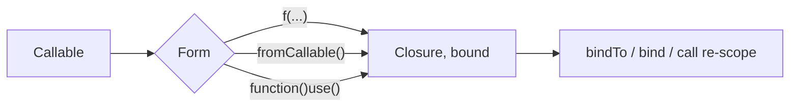

# Anonymous Functions & Closures

!!! tip "In a nutshell"
    Une closure est un objet `Closure` portant un `$this` lié et un scope.
    Accroche pour l'examen : `use ($x)` capture **par valeur au moment de la
    définition** (ajoutez `&` pour une référence), tandis que les arrow
    functions `fn` auto-capturent par valeur uniquement.

!!! example "Real-world analogy"
    Capturer avec `use ($x)` revient à prendre une photographie d'une valeur :
    quelle que soit l'évolution de la scène ensuite, le tirage développé montre
    toujours l'instant du déclic — capture *par valeur au moment de la
    définition*. Capturer avec `use (&$x)` est au contraire un flux vidéo en
    direct qui continue de refléter les changements ultérieurs du même sujet.
    Une arrow function prend toujours la photo automatiquement et ne peut jamais
    maintenir le flux en direct.

!!! abstract "Learning objectives"
    À la fin de ce chapitre, vous saurez :

    - [ ] Distinguer fonctions anonymes, closures et arrow functions.
    - [ ] Capturer des variables avec `use` (par valeur vs référence) et l'auto-capture.
    - [ ] Relier `$this` avec `bindTo`/`Closure::bind` et utiliser les first-class callables.

    **Syllabus:** `PHP → Anonymous functions & closures` ·
    **Level:** Advanced / Expert ·
    **Est. time:** 30 min ·
    **Prerequisites:** [OOP](oop.md)

---

## Theory

Une **fonction anonyme** est une fonction sans nom, représentée à l'exécution
par une instance de la classe `Closure`. Quand elle *capture* des variables du
scope englobant, c'est une **closure**. Les **arrow functions** (`fn`) sont une
forme concise qui capture le scope parent **automatiquement, par valeur**.

```php
$anon = function (string $n) { return 'Hi '.$n; };  // anonymous function

$prefix  = 'Hi ';
$closure = function (string $n) use ($prefix) { return $prefix.$n; }; // captures
$arrow   = fn (string $n) => $prefix.$n;  // fn auto-captures $prefix by value

$anon instanceof Closure;    // true — all three are Closure instances
```

| Form | Capture | Body | `$this` |
|---|---|---|---|
| `function () use ($x) {}` | `use` explicite | Bloc | Lié si dans une méthode |
| `fn () => $x` | Automatique (par valeur) | Expression unique | Lié si dans une méthode |
| `strlen(...)` | — | First-class callable | Lié à la source |

!!! question "Predict first"
    `$x = 10; $f = fn () => $x; $x = 99;` — est-ce que `$f()` retourne `10` ou `99` ?

??? note "Reveal"
    `10`. Les arrow functions (comme `use ($x)`) capturent **par valeur au
    moment de la définition**. Seul `use (&$x)` — impossible avec `fn` —
    verrait le `99` ultérieur.

## Deep Dive — how it works internally

### Capture semantics

`function () use ($x)` copie `$x` **par valeur** au moment de la définition.
Préfixez avec `&` pour capturer **par référence**. Les arrow functions capturent
toujours par valeur et ne peuvent pas utiliser `&`.

```php
<?php
declare(strict_types=1);

$base = 10;
$byValue = fn (int $n) => $n + $base;   // $base copied now
$byRef   = function (int $n) use (&$base) { return $n + $base; };

$base = 100;
$byValue(1);   // 11  (captured 10)
$byRef(1);     // 101 (sees updated $base)
```

### Binding `$this` and scope

Une `Closure` porte un **objet lié** (`$this`) et un **scope** (qui contrôle
l'accès `private`/`protected`). Vous pouvez la relier avec :

- `Closure::bind($closure, $newThis, $scope)` — statique, retourne une nouvelle closure.
- `$closure->bindTo($newThis, $scope)` — méthode d'instance, même effet.
- `$closure->call($newThis, ...$args)` — lier **et** invoquer en une seule étape.

```php
$peek = function () { return $this->n; };
$counter = new Counter();

$b1 = Closure::bind($peek, $counter, Counter::class);  // static, new closure
$b2 = $peek->bindTo($counter, Counter::class);         // instance, same effect

$peek->call($counter);   // bind + invoke in one step (scope = Counter)
```

```php
<?php
declare(strict_types=1);

final class Counter { private int $n = 41; }

$peek = function () { return $this->n; };      // needs private access
$bound = Closure::bind($peek, new Counter(), Counter::class);
$bound();   // 42-ish: reads the private property via the granted scope
```

C'est le fait de passer `Counter::class` comme scope qui accorde l'accès à la
propriété `private`. Les arrow functions et closures définies **à l'intérieur**
d'une méthode sont déjà liées à cette instance.

### First-class callable syntax & `fromCallable`

`f(...)` (8.1) crée une `Closure` à partir de n'importe quel callable. Avant
8.1 on utilisait `Closure::fromCallable()`, qui reste valide et accepte les
callables sous forme de chaîne/tableau.

```php
<?php
declare(strict_types=1);

$a = strtoupper(...);                       // first-class callable (8.1+)
$b = Closure::fromCallable('strtoupper');   // equivalent, older syntax
$c = $service->handle(...);                 // bound instance method
```



!!! note "Source reference"
    Symfony passe des closures comme factories lazy et listeners d'events ; le
    container enveloppe les closures de services via `Symfony\Component\DependencyInjection\Argument\ServiceClosureArgument` —
    [symfony/symfony `8.0`](https://github.com/symfony/symfony/blob/8.0/src/Symfony/Component/DependencyInjection/Argument/ServiceClosureArgument.php).

## Configuration & code

=== "PHP Attributes"

    ```php
    <?php
    declare(strict_types=1);

    $prices = [10, 20, 30];
    $withTax = array_map(fn (int $p) => (int) round($p * 1.2), $prices);
    // [12, 24, 36]
    ```

=== "Console"

    ```console
    $ php -r '$f = strlen(...); var_dump($f("abc"));'
    int(3)
    ```

## Best practices & anti-patterns

| ✅ Do | ❌ Avoid |
|---|---|
| `fn` pour les petites transformations pures | Logique multi-instructions entassée dans un `fn` |
| `f(...)` plutôt que des callables chaîne | Chaînes `'Class::method'` |
| Capture par valeur par défaut | Effets de bord involontaires avec `use (&$x)` |
| `bindTo` pour accorder un scope délibérément | Divulguer l'état private partout |

## When (not) to use it / alternatives

- Utilisez les **arrow functions** pour des transformations à une expression
  qui lisent quelques variables externes.
- Utilisez les **closures complètes** quand vous avez besoin de plusieurs
  instructions, d'une capture par référence, ou d'aucune auto-capture.
- Utilisez les **first-class callables** pour passer des méthodes/fonctions de
  façon typée.

!!! danger "Certification traps"
    - `fn` capture **par valeur automatiquement** ; il ne peut pas capturer par
      référence et n'a pas de liste `use`.
    - `use ($x)` lie **au moment de la définition**, pas de l'appel (sauf `&`).
    - L'accès private d'une closure dépend de son **scope**, fixé à la création
      ou via `bindTo`/`bind` — pas de l'endroit où elle est *appelée*.
    - `Closure::bind` est statique et retourne une **nouvelle** closure ;
      l'originale est inchangée.

!!! warning "Common mistakes"
    - S'attendre à ce que `fn` voie les mutations ultérieures d'une variable capturée (il a capturé une copie).
    - Oublier l'argument de scope de `bind`, si bien que l'accès private échoue.

## Exercises

1. **(Advanced)** Montrez une closure dont le résultat diffère selon que la
   capture est par valeur ou par référence après modification de la variable
   externe.
2. **(Expert)** Reliez une closure pour lire une propriété `private` d'une
   autre classe.

??? success "Solutions"

    **1.** Voir l'exemple `$byValue`/`$byRef` ci-dessus : après `$base = 100`,
    la capture par valeur retourne 11, celle par référence retourne 101.

    **2.**
    ```php
    <?php
    declare(strict_types=1);

    final class Box { private string $secret = 'hidden'; }

    $reader = fn () => $this->secret;
    $bound = Closure::bind($reader, new Box(), Box::class);
    echo $bound();   // "hidden"
    ```

## Certification questions

??? question "Q1. When does `function () use ($x) {}` capture `$x`?"
    - [x] A. At definition time, by value ✅
    - [ ] B. At call time
    - [ ] C. By reference always
    - [ ] D. Never — it reads live

    **Why:** `use` copie par valeur au moment où la closure est définie ;
    ajoutez `&` pour une référence. **Ref:** [Anonymous functions](https://www.php.net/manual/en/functions.anonymous.php).

??? question "Q2. Which is true of arrow functions?"
    - [x] A. They auto-capture the enclosing scope by value ✅
    - [ ] B. They require a `use` list
    - [ ] C. They can capture by reference
    - [ ] D. They may contain multiple statements

    **Why:** `fn` auto-capture par valeur, expression unique seulement.
    **Ref:** [Arrow functions](https://www.php.net/manual/en/functions.arrow.php).

??? question "Q3. What does `Closure::bind($c, $obj, Foo::class)` return?"
    - [x] A. A new closure bound to `$obj` with `Foo`'s scope ✅
    - [ ] B. `void`; it mutates `$c`
    - [ ] C. The result of calling `$c`
    - [ ] D. A `callable` string

    **Why:** Elle retourne une nouvelle closure ; le scope accorde l'accès aux
    membres private/protected de `Foo`. **Ref:** [Closure::bind](https://www.php.net/manual/en/closure.bind.php).

??? question "Q4. `$fn = trim(...);` produces…"
    - [ ] A. A string `'trim'`
    - [x] B. A `Closure` wrapping `trim` ✅
    - [ ] C. The trimmed value
    - [ ] D. An error before 8.4

    **Why:** La syntaxe first-class callable (8.1+) produit une `Closure`.
    **Ref:** [First-class callable syntax](https://www.php.net/manual/en/functions.first_class_callable_syntax.php).

## Key takeaways

- Les closures sont des instances de `Closure` portant un `$this` lié et un scope.
- `use` = par valeur à la définition (ou `&` pour une référence) ; `fn` = auto par valeur.
- Reliez avec `bindTo`/`bind`/`call` ; le scope contrôle l'accès private.
- `f(...)` et `Closure::fromCallable()` construisent des closures à partir de tout callable.

## Last-minute revision

!!! tip "Cheat sheet"
    - `fn (x) => expr` — auto-capture par valeur, expression unique, pas de `&`.
    - `function () use (&$x) {}` — par référence.
    - `bindTo($obj, $scope)` / `bind()` (statique) / `call($obj)`.
    - `strlen(...)` == `Closure::fromCallable('strlen')`.

## Connections

- **Depends on:** [OOP](oop.md) — une closure est un objet `Closure` portant un `$this` lié et un scope.
- **Reused in:** [SPL](spl.md) — les générateurs et les callables s'appuient sur les closures ; [PHP API](php-api.md) couvre la syntaxe first-class callable.
- **Confused with:** [Traits](traits.md) — `use` à l'intérieur d'une classe importe un trait, pas une liste de capture de closure.

## Official References
- [PHP: Anonymous functions](https://www.php.net/manual/en/functions.anonymous.php)
- [PHP: Arrow functions](https://www.php.net/manual/en/functions.arrow.php)
- [PHP: Closure class](https://www.php.net/manual/en/class.closure.php)
- [Symfony source — ServiceClosureArgument](https://github.com/symfony/symfony/blob/8.0/src/Symfony/Component/DependencyInjection/Argument/ServiceClosureArgument.php)

## Video references

!!! tip "Watch & learn"
    Voici des chaînes vidéo officielles, mises à jour en continu — cherchez-y
    "PHP & web security" pour consolider ce chapitre. Nous lions des chaînes
    stables plutôt que des vidéos individuelles afin que les références ne
    périment jamais.

    - [SymfonyCasts screencasts](https://symfonycasts.com/tracks/symfony) — tutoriels scénarisés à suivre en codant.
    - [Symfony official YouTube](https://www.youtube.com/@SymfonyOfficial) — conférences et keynotes SymfonyCon.
    - [Official docs for this topic](https://symfony.com/doc/current/index.html) — certaines pages de la doc Symfony intègrent un screencast.

## Confidence check

Je suis prêt quand je peux :

- [ ] expliquer **pourquoi** c'est le scope (et non le site d'appel) qui contrôle l'accès private d'une closure
- [ ] implémenter `bindTo`/`Closure::bind` et les first-class callables dans Symfony 8
- [ ] déboguer un `fn` qui « ignore » une mutation ultérieure (il a capturé une copie)
- [ ] repérer le piège : un `fn` capturant par référence (impossible) ou un `use` liant au moment de l'appel
- [ ] expliquer comment `Closure::bind` retourne une *nouvelle* closure et accorde un scope

---

<small>Related: [PHP API](php-api.md) · [OOP](oop.md) · [SPL](spl.md)</small>
