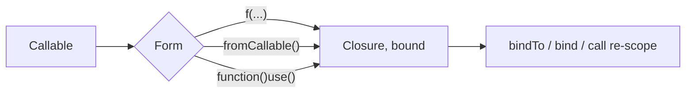

# Anonymous Functions & Closures

!!! tip "In a nutshell"
    A closure is a `Closure` object carrying a bound `$this` and a scope. Exam
    hook: `use ($x)` captures **by value at definition time** (add `&` for a
    reference), while arrow functions `fn` auto-capture by value only.

!!! abstract "Learning objectives"
    By the end of this chapter you can:

    - [ ] Distinguish anonymous functions, closures and arrow functions.
    - [ ] Capture variables with `use` (by value vs reference) and auto-capture.
    - [ ] Rebind `$this` with `bindTo`/`Closure::bind` and use first-class callables.

    **Syllabus:** `PHP → Anonymous functions & closures` ·
    **Level:** Advanced / Expert ·
    **Est. time:** 30 min ·
    **Prerequisites:** [OOP](oop.md)

---

## Theory

An **anonymous function** is a function with no name, represented at runtime as
an instance of the `Closure` class. When it *captures* variables from the
enclosing scope it is a **closure**. **Arrow functions** (`fn`) are a concise
form that captures the parent scope **automatically, by value**.

| Form | Capture | Body | `$this` |
|---|---|---|---|
| `function () use ($x) {}` | Explicit `use` | Block | Bound if in a method |
| `fn () => $x` | Automatic (by value) | Single expr | Bound if in a method |
| `strlen(...)` | — | First-class callable | Bound to source |

!!! question "Predict first"
    `$x = 10; $f = fn () => $x; $x = 99;` — does `$f()` return `10` or `99`?

??? note "Reveal"
    `10`. Arrow functions (like `use ($x)`) capture **by value at definition
    time**. Only `use (&$x)` — impossible with `fn` — would see the later `99`.

## Deep Dive — how it works internally

### Capture semantics

`function () use ($x)` copies `$x` **by value** at definition time. Prefix with
`&` to capture **by reference**. Arrow functions always capture by value and
cannot use `&`.

```php
<?php
declare(strict_types=1);

$base = 10;
$byValue = fn (int $n) => $n + $base;   // $base copied now
$byRef   = function (int $n) use (&$base) { return $n + $base; };

$base = 100;
$byValue(1);   // 11  (captured 10)
$byRef(1);     // 101 (sees updated $base)
```

### Binding `$this` and scope

A `Closure` carries a **bound object** (`$this`) and a **scope** (which controls
`private`/`protected` access). Rebind with:

- `Closure::bind($closure, $newThis, $scope)` — static, returns a new closure.
- `$closure->bindTo($newThis, $scope)` — instance method, same effect.
- `$closure->call($newThis, ...$args)` — bind **and** invoke in one step.

```php
<?php
declare(strict_types=1);

final class Counter { private int $n = 41; }

$peek = function () { return $this->n; };      // needs private access
$bound = Closure::bind($peek, new Counter(), Counter::class);
$bound();   // 42-ish: reads the private property via the granted scope
```

Passing `Counter::class` as scope is what grants access to the `private`
property. Arrow functions and closures defined **inside** a method are already
bound to that instance.

### First-class callable syntax & `fromCallable`

`f(...)` (8.1) creates a `Closure` from any callable. Before 8.1 you used
`Closure::fromCallable()`, which is still valid and accepts string/array
callables.

```php
<?php
declare(strict_types=1);

$a = strtoupper(...);                       // first-class callable (8.1+)
$b = Closure::fromCallable('strtoupper');   // equivalent, older syntax
$c = $service->handle(...);                 // bound instance method
```



!!! note "Source reference"
    Symfony passes closures as lazy factories and event listeners; the container
    wraps service closures via `Symfony\Component\DependencyInjection\Argument\ServiceClosureArgument` —
    [symfony/symfony `8.0`](https://github.com/symfony/symfony/blob/8.0/src/Symfony/Component/DependencyInjection/Argument/ServiceClosureArgument.php).

## Configuration & code

=== "PHP Attributes"

    ```php
    <?php
    declare(strict_types=1);

    $prices = [10, 20, 30];
    $withTax = array_map(fn (int $p) => (int) round($p * 1.2), $prices);
    // [12, 24, 36]
    ```

=== "Console"

    ```console
    $ php -r '$f = strlen(...); var_dump($f("abc"));'
    int(3)
    ```

## Best practices & anti-patterns

| ✅ Do | ❌ Avoid |
|---|---|
| `fn` for tiny pure maps | Multi-statement logic crammed into `fn` |
| `f(...)` over string callables | `'Class::method'` strings |
| Capture by value by default | Unintended `use (&$x)` side effects |
| `bindTo` to grant scope deliberately | Leaking private state everywhere |

## When (not) to use it / alternatives

- Use **arrow functions** for one-expression transforms that read a couple of
  outer variables.
- Use **full closures** when you need multiple statements, by-reference capture,
  or no auto-capture.
- Use **first-class callables** to pass methods/functions type-safely.

!!! danger "Certification traps"
    - `fn` captures **by value automatically**; it cannot capture by reference
      and has no `use` list.
    - `use ($x)` binds **at definition time**, not call time (unless `&`).
    - A closure's private access depends on its **scope**, set at creation or via
      `bindTo`/`bind` — not on where it is *called*.
    - `Closure::bind` is static and returns a **new** closure; the original is
      unchanged.

!!! warning "Common mistakes"
    - Expecting `fn` to see later mutations of a captured variable (it captured a copy).
    - Forgetting the scope argument to `bind`, so private access fails.

## Exercises

1. **(Advanced)** Show a closure whose result differs when captured by value vs
   by reference after the outer variable changes.
2. **(Expert)** Rebind a closure to read a `private` property of another class.

??? success "Solutions"

    **1.** See the `$byValue`/`$byRef` example above: after `$base = 100`,
    by-value returns 11, by-reference returns 101.

    **2.**
    ```php
    <?php
    declare(strict_types=1);

    final class Box { private string $secret = 'hidden'; }

    $reader = fn () => $this->secret;
    $bound = Closure::bind($reader, new Box(), Box::class);
    echo $bound();   // "hidden"
    ```

## Certification questions

??? question "Q1. When does `function () use ($x) {}` capture `$x`?"
    - [x] A. At definition time, by value ✅
    - [ ] B. At call time
    - [ ] C. By reference always
    - [ ] D. Never — it reads live

    **Why:** `use` copies by value when the closure is defined; add `&` for a
    reference. **Ref:** [Anonymous functions](https://www.php.net/manual/en/functions.anonymous.php).

??? question "Q2. Which is true of arrow functions?"
    - [x] A. They auto-capture the enclosing scope by value ✅
    - [ ] B. They require a `use` list
    - [ ] C. They can capture by reference
    - [ ] D. They may contain multiple statements

    **Why:** `fn` auto-captures by value, single expression only.
    **Ref:** [Arrow functions](https://www.php.net/manual/en/functions.arrow.php).

??? question "Q3. What does `Closure::bind($c, $obj, Foo::class)` return?"
    - [x] A. A new closure bound to `$obj` with `Foo`'s scope ✅
    - [ ] B. `void`; it mutates `$c`
    - [ ] C. The result of calling `$c`
    - [ ] D. A `callable` string

    **Why:** It returns a new closure; the scope grants access to `Foo`'s
    private/protected members. **Ref:** [Closure::bind](https://www.php.net/manual/en/closure.bind.php).

??? question "Q4. `$fn = trim(...);` produces…"
    - [ ] A. A string `'trim'`
    - [x] B. A `Closure` wrapping `trim` ✅
    - [ ] C. The trimmed value
    - [ ] D. An error before 8.4

    **Why:** First-class callable syntax (8.1+) yields a `Closure`.
    **Ref:** [First-class callable syntax](https://www.php.net/manual/en/functions.first_class_callable_syntax.php).

## Key takeaways

- Closures are `Closure` instances carrying a bound `$this` and a scope.
- `use` = by value at definition (or `&` for reference); `fn` = auto by value.
- Rebind with `bindTo`/`bind`/`call`; scope controls private access.
- `f(...)` and `Closure::fromCallable()` build closures from any callable.

## Last-minute revision

!!! tip "Cheat sheet"
    - `fn (x) => expr` — auto-capture by value, single expr, no `&`.
    - `function () use (&$x) {}` — by reference.
    - `bindTo($obj, $scope)` / `bind()` (static) / `call($obj)`.
    - `strlen(...)` == `Closure::fromCallable('strlen')`.

## Connections

- **Depends on:** [OOP](oop.md) — a closure is a `Closure` object carrying a bound `$this` and a scope.
- **Reused in:** [SPL](spl.md) — generators and callables lean on closures; [PHP API](php-api.md) covers the first-class callable syntax.
- **Confused with:** [Traits](traits.md) — `use` inside a class imports a trait, not a closure capture list.

## Official References
- [PHP: Anonymous functions](https://www.php.net/manual/en/functions.anonymous.php)
- [PHP: Arrow functions](https://www.php.net/manual/en/functions.arrow.php)
- [PHP: Closure class](https://www.php.net/manual/en/class.closure.php)
- [Symfony source — ServiceClosureArgument](https://github.com/symfony/symfony/blob/8.0/src/Symfony/Component/DependencyInjection/Argument/ServiceClosureArgument.php)

## Confidence check

I'm ready when I can:

- [ ] explain **why** scope (not the call site) controls a closure's private access
- [ ] implement `bindTo`/`Closure::bind` and first-class callables in Symfony 8
- [ ] debug a `fn` that "ignores" a later mutation (it captured a copy)
- [ ] spot the trick: `fn` capturing by reference (it cannot) or `use` binding at call time
- [ ] explain how `Closure::bind` returns a *new* closure and grants a scope

---

<small>Related: [PHP API](php-api.md) · [OOP](oop.md) · [SPL](spl.md)</small>
