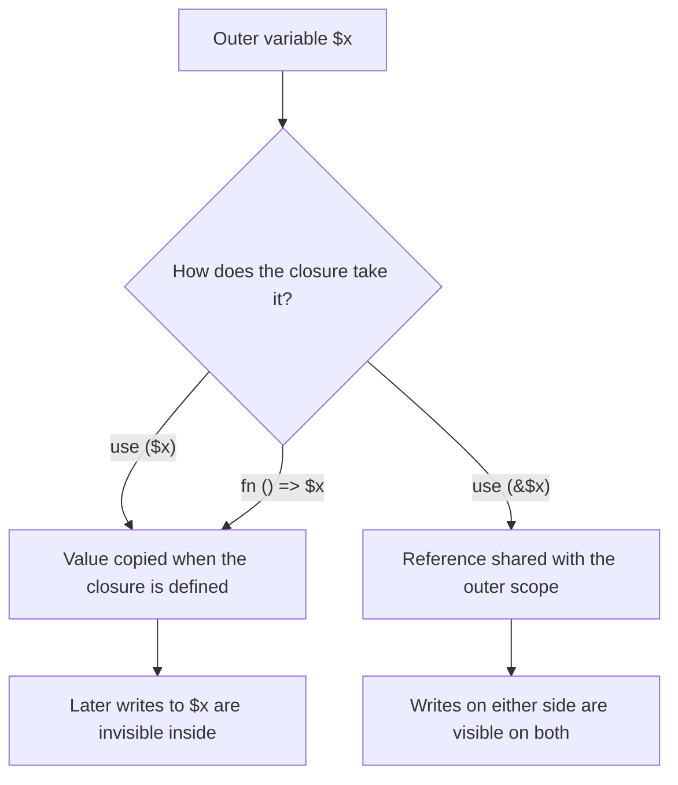
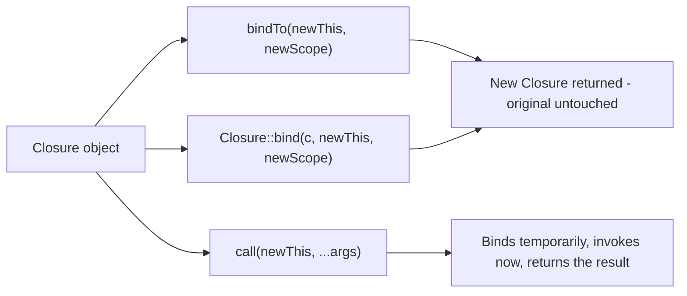

# Anonymous Functions & Closures

!!! tip "In a nutshell"
    Every anonymous function — `function () {}`, `fn () => …`, `strlen(...)` — is an
    instance of the `final` class `Closure`, and it carries three things: **captured
    variables**, a **bound `$this`**, and a **class scope**. The exam hinges on two
    facts: `use ($x)` copies **at definition time** (`use (&$x)` shares a reference,
    `fn` can only copy), and it is the **scope**, not `$this`, that unlocks `private`
    members.

!!! example "Real-world analogy"
    Think of a courier picking up a parcel before leaving. `use ($x)` is the courier
    photocopying the document and taking the copy: whatever the office edits afterwards,
    the copy in the van is frozen. `use (&$x)` is the courier taking the original folder
    with a shared key, so edits made on either side are seen by both. An arrow function
    is a courier who always photocopies, automatically, and is not allowed to take
    originals. And the badge the courier wears — the **scope** — is what decides which
    locked cabinets can be opened once they arrive, regardless of whose building it is.

!!! abstract "Learning objectives"
    By the end of this chapter you can:

    - [ ] Tell anonymous functions, closures, arrow functions and first-class callables apart, and name the single class behind all of them.
    - [ ] Capture by value and by reference, and explain exactly **when** the capture happens.
    - [ ] Rebind a closure with `bindTo`, `Closure::bind` and `call`, and predict private-member access from the **scope** alone.
    - [ ] Recognise closures in Symfony 8 — service closures, lazy event listeners, Twig extension callbacks.

    **Syllabus:** `PHP → Anonymous functions & closures` ·
    **Level:** Advanced / Expert ·
    **Est. time:** 45 min ·
    **Prerequisites:** [OOP](oop.md)

    **Examen Symfony 8 :** OUI

---

## Prerequisites

You should be comfortable with classes, visibility and `$this` from [OOP](oop.md), and
with the `callable` pseudo-type from [PHP API](php-api.md). Everything here targets
**PHP 8.4**: arrow functions arrived in 7.4, first-class callable syntax in 8.1, and
`Closure::getCurrent()` does **not** exist yet on this baseline — all three are dates the
exam likes to move around.

## The problem we are solving

A sort, a filter, a lazy factory and an event listener all need the same thing: a piece of
behaviour passed around as a value. PHP has had `callable` strings and arrays forever, but
they are blind — `'App\Foo::bar'` is a string until the moment it explodes, and it carries
no context whatsoever.

Consider a discount engine. The rule changes per campaign, so it cannot be hard-coded:

```php
$rate = 0.15;

$discount = function (int $cents) use ($rate): int {
    return (int) round($cents * (1 - $rate));
};
```

Two things just happened that a plain function cannot do. The behaviour became a **value**
you can store, pass and return; and it **carried `$rate` with it**, so the caller does not
need to know that a rate exists at all. That second half — a function plus the environment
it remembers — is what the word *closure* actually means.

## 🧠 Pour les nuls

**C'est quoi ?** Une closure, c'est une fonction **sans nom** que l'on range dans une
variable, et qui **emporte avec elle** quelques variables du code environnant. En PHP, elle
n'est pas magique : c'est un objet, instance de la classe `Closure`.

**Pourquoi ça existe ?** Parce qu'il faut souvent passer un *comportement* en paramètre :
trier, filtrer, réagir à un événement, fabriquer un service au dernier moment. Sans closure,
il faudrait créer une classe entière pour trois lignes de logique, et trouver un moyen de lui
transmettre les valeurs dont elle a besoin.

**🏠 Analogie de la vraie vie :** le **sac à dos du livreur**. Avant de partir, le livreur
glisse dans son sac une **photocopie** du bon de commande : `use ($bon)`. Le bureau peut
raturer l'original toute la journée, la photocopie dans le sac ne bougera pas. S'il emporte
le **classeur original** au lieu d'une copie — `use (&$bon)` — alors chaque correction faite
au bureau apparaît dans son classeur, et chaque annotation qu'il écrit apparaît au bureau.
Et son **badge** (le *scope*) décide des armoires fermées à clé qu'il pourra ouvrir en
arrivant : le badge, pas l'adresse de livraison.

**Symfony dans la vraie vie :** Photocopie dans le sac → `use ($x)` / Classeur original →
`use (&$x)` / Badge d'accès → le *scope*, qui autorise la lecture des propriétés `private` /
Livreur qui part chercher le colis seulement si on le lui demande → la *service closure*
Symfony, qui construit le service au premier appel seulement.

**💻 Exemple Symfony extrêmement simple :**
```php
$tva = 0.2;

$prixTtc = fn (int $ht): int => (int) round($ht * (1 + $tva));

echo $prixTtc(100);   // 120
```
Ligne 3 : `fn` capture `$tva` **tout seul**, par valeur. Aucune liste `use` à écrire — et
aucun moyen d'exiger une référence : c'est photocopie obligatoire.

**🔍 Que se passe-t-il réellement ?**
1. PHP rencontre le mot-clé `function` ou `fn` et crée un objet `Closure`.
2. Il copie immédiatement la valeur des variables capturées dans cet objet.
3. Si le code se trouve dans une méthode, il attache aussi `$this` et la classe (le *scope*).
4. La variable `$prixTtc` contient maintenant un objet, pas un résultat.
5. `$prixTtc(100)` exécute le corps avec les valeurs figées à l'étape 2.
6. `bindTo()` fabrique une **nouvelle** closure : l'originale n'est modifiée en rien.

**⚠️ Erreur fréquente :** croire qu'une closure lit la variable extérieure au moment de
l'appel. Faux : la copie a lieu à la **définition**. Écrire `$x = 1; $f = fn () => $x;
$x = 99;` puis appeler `$f()` renvoie `1`, et beaucoup de développeurs perdent une heure
là-dessus.

**🧠 Comment le mémoriser ?** *« Photocopie par défaut, classeur original avec `&`, badge
pour ouvrir les armoires. »* Trois mots : **copie**, **référence**, **scope**.

## Build the mental model

Hold three ideas together and the whole topic collapses into something small.

**One: it is an object.** `function () {}` is an *expression* that evaluates to an instance
of `Closure`. That is why you can store it, type-hint it, pass it, return it, and why
`$f instanceof Closure` is `true` for an arrow function and for `strlen(...)` alike. It is
also why `Closure` is `final` and its constructor is `private`: you never build one with
`new`.

**Two: capture is a copy taken at definition time.** The moment PHP evaluates the
`function` expression, it reads every variable in the `use` list and stores the value inside
the closure object. The capture is not deferred, not lazy, not re-read at call time. Adding
`&` swaps the copy for a shared reference — the only mechanism that makes the closure and
the outer scope see each other's writes.

**Three: `$this` and scope are two separate slots.** A closure remembers *which object* it
runs against (`$this`, the bound object) and *which class it counts as a member of* (the
scope). Private access is decided by the **scope** alone. Two closures with the same body,
same `$this` and different scopes behave differently — that is the single most examinable
fact in this chapter.



The diagram states the only branch that matters: `fn` and `use ($x)` land on exactly the
same node, because an arrow function is documented as *roughly equivalent to performing a
`use($x)` for every variable `$x` used inside it*. Only the `&` form takes the other path.

!!! info "PHP 8.4 reference"
    https://www.php.net/manual/en/functions.arrow.php

## Core concepts

An **anonymous function** is a function with no declared name. PHP converts the expression
into a `Closure` instance. When it inherits variables from the enclosing scope through
`use`, people call it a **closure** — although the manual treats the two words as synonyms
and states plainly that "anonymous functions, also known as closures".

An **arrow function** (`fn`, PHP 7.4) is the same machinery with a fixed shape:
`fn (argument_list) => expr`, a single expression, and automatic by-value capture of every
outer variable the expression mentions.

**First-class callable syntax** (`f(...)`, PHP 8.1) turns any callable into a `Closure`
using the scope at the point where it is written.

```php
$anon = function (string $n): string { return 'Hi '.$n; };

$prefix  = 'Hi ';
$closure = function (string $n) use ($prefix): string { return $prefix.$n; };
$arrow   = fn (string $n): string => $prefix.$n;
$fcc     = strtoupper(...);

var_dump($anon instanceof Closure, $arrow instanceof Closure, $fcc instanceof Closure);
// true, true, true
```

| Form | Capture | Body | Auto-bound `$this` | Since |
|---|---|---|---|---|
| `function () use ($x) {}` | Explicit, by value | Any number of statements | Yes, inside a method | 5.3 |
| `function () use (&$x) {}` | Explicit, by reference | Any number of statements | Yes, inside a method | 5.3 |
| `fn () => $x` | Automatic, by value only | One expression | Yes, inside a method | **7.4** |
| `static function () {}` / `static fn () =>` | As above | As above | **No — never bindable** | 5.4 / 7.4 |
| `f(...)` | — (wraps an existing callable) | — | Bound to the source | **8.1** |

Note the return type position for a full closure: it comes **after** the `use` clause,
`function () use ($x): string { … }`. Writing it before the `use` list is a parse error.

!!! info "PHP 8.4 reference"
    https://www.php.net/manual/en/functions.anonymous.php

!!! info "PHP 8.4 reference"
    https://www.php.net/manual/en/class.closure.php

## Learn by doing

One running example: an order total with a pluggable discount. Each step changes exactly
one thing.

**Step 1 — behaviour as a value.** Store a rule in a variable and apply it.

```php
$total = 10_000;                        // cents
$apply = fn (int $cents): int => $cents;
echo $apply($total);                    // 10000
```

**Step 2 — capture the campaign rate.** The rule now needs outside data.

```php
$rate  = 0.15;
$apply = fn (int $cents): int => (int) round($cents * (1 - $rate));
echo $apply(10_000);                    // 8500
```

`$rate` was never passed as an argument. The arrow function captured it automatically, by
value, the instant the expression was evaluated.

**Step 3 — change the rate afterwards, and watch nothing happen.**

```php
$rate = 0.50;
echo $apply(10_000);                    // still 8500, not 5000
```

This is the behaviour that costs people an hour of debugging. The closure holds a copy of
`0.15`; reassigning `$rate` afterwards edits a different storage slot.

**Step 4 — switch to a reference and re-run.** Only a full closure can do this.

```php
$rate  = 0.15;
$apply = function (int $cents) use (&$rate): int {
    return (int) round($cents * (1 - $rate));
};

$rate = 0.50;
echo $apply(10_000);                    // 5000 — the reference tracks the change
```

**Step 5 — accumulate, which is what `&` is really for.** Capturing by reference lets the
closure write *out*, not just read fresh values in:

```php
$audit = [];
$apply = function (int $cents) use (&$audit, $rate): int {
    $out = (int) round($cents * (1 - $rate));
    $audit[] = "$cents -> $out";
    return $out;
};
$apply(10_000);
count($audit);   // 1 — the outer array really grew
```

Without the `&`, `$audit` inside the closure would be a private copy and the outer array
would still be empty after the call.

**Step 6 — reach for a method instead of a body.** Once the rule lives on a service, stop
writing a wrapper closure:

```php
$apply = $discountPolicy->applyTo(...);   // Closure bound to $discountPolicy
```

The pattern to carry into the exam: **`use`/`fn` decide what the closure *remembers*;
`(...)` decides what the closure *is*.**

!!! info "PHP 8.4 reference"
    https://www.php.net/manual/en/functions.first_class_callable_syntax.php

## How Symfony handles it

Symfony 8 uses closures in three visible places, and each maps to one of the mechanisms
above.

**Service closures — laziness by contract.** Injecting a `\Closure` instead of a service
defers construction until the closure is called. The docs are explicit that "the service is
instantiated the first time the closure is called, while all subsequent calls return the
same instance, unless the service is not shared" — the closure memoizes.

```yaml
# config/services.yaml
services:
    App\Service\MyService:
        arguments: [!service_closure '@mailer']

    # '@>mailer' is the documented shortcut for the same thing
    App\Service\AnotherService:
        arguments: ['@>mailer']
```

The receiving class type-hints `\Closure`, never `callable` — for a language reason covered
below — and invokes it with the parenthesis form:

```php
public function __construct(
    private \Closure $mailer,
) {
}

private function getMailer(): MailerInterface
{
    return ($this->mailer)();
}
```

The same wiring exists as an attribute, `#[AutowireServiceClosure('some.service')]` on a
`private \Closure $resolver` parameter, and internally both produce a
`ServiceClosureArgument`, whose own docblock calls it "a service wrapped in a memoizing
closure".

!!! info "Official Symfony 8.0 reference"
    https://symfony.com/doc/8.0/service_container/service_closures.html

!!! note "Symfony 8.0 source reference"
    https://github.com/symfony/symfony/blob/8.0/src/Symfony/Component/DependencyInjection/Argument/ServiceClosureArgument.php

**Event listeners — by-reference capture in production code.** `EventDispatcher` stores
listeners as callables and, when it optimises a listener list, builds a `static` closure
that captures both the listener slot and its own slot **by reference**, so that the first
invocation can replace itself with the resolved callable:

```php
$closure = static function (...$args) use (&$listener, &$closure) {
    if ($listener[0] instanceof \Closure) {
        $listener[0] = $listener[0]();
        $listener[1] ??= '__invoke';
    }
    ($closure = $listener(...))(...$args);
};
```

Three chapter concepts in five lines: `static` (no `$this` needed, so refuse to carry one),
`use (&…)` (the closure must *write back*, not just read), and `$listener(...)` (first-class
callable applied to an array callable). This is the strongest argument that by-reference
capture is a tool, not a smell.

!!! note "Symfony 8.0 source reference"
    https://github.com/symfony/symfony/blob/8.0/src/Symfony/Component/EventDispatcher/EventDispatcher.php

**Twig extensions — first-class callables everywhere.** The Twig bridge registers filters
and functions by handing Twig a bound closure over one of its own methods:

```php
public function getFilters(): array
{
    return [
        new TwigFilter('trans', $this->trans(...)),
    ];
}
```

`$this->trans(...)` keeps the scope of the extension class, which is why a `private` helper
method can be exposed this way while a `'ClassName::method'` string could not.

!!! note "Symfony 8.0 source reference"
    https://github.com/symfony/symfony/blob/8.0/src/Symfony/Bridge/Twig/Extension/TranslationExtension.php

## How it works internally

A `Closure` object holds four things, and every API in this chapter manipulates one of them:

| Slot | Set when | Changed by |
|---|---|---|
| Captured variables | At the `function`/`fn` expression | Never — fixed for the object's life |
| Bound object (`$this`) | Automatically inside a non-static method | `bindTo`, `Closure::bind`, `call` |
| Scope (class it counts as a member of) | The class the expression is written in | `bindTo`, `Closure::bind`, `call` |
| `static` flag | The `static` keyword | Never |

The capture is eager, and the engine proves it: capturing an undefined variable emits
`Warning: Undefined variable $undef` on the **definition** line, before the closure has ever
been invoked.

Rebinding never mutates. `bindTo()` and `Closure::bind()` *duplicate* the closure — same
body, same captured variables, new bound object and/or new scope — and return the new
instance, or `null` on failure. `call()` is the shortcut that binds and invokes in one step
and returns the closure's own return value.



The two left branches produce a value you must assign; the right branch produces the result
of a call. Discarding the return of `bindTo()` is the classic no-op bug.

The `newScope` parameter defaults to the string `"static"`, which means *keep the current
scope*. That default is the reason so many rebinding attempts fail: giving a new object
without a new scope changes `$this` but not the access rights.

!!! info "PHP 8.4 reference"
    https://www.php.net/manual/en/closure.bindto.php

!!! info "PHP 8.4 reference"
    https://www.php.net/manual/en/closure.call.php

## All supported cases and variations

### Capture rules and their hard limits

`use` accepts a comma-separated list, each entry optionally prefixed with `&`, and — since
**PHP 8.0.0** — a trailing comma that is simply ignored. Three things may never appear in
that list, all of them **compile-time** errors since PHP 7.1:

- a superglobal — `use ($_GET)` is rejected;
- `$this` — `Cannot use $this as lexical variable` (it is already available implicitly);
- a name already used as a parameter — `function ($x) use ($x)` gives
  `Cannot use lexical variable $x as a parameter name`.

An important non-limit: capturing an **object** by value copies the *handle*, not the
object. Mutating the object afterwards is visible inside the closure; only *reassigning the
variable* to a different object is not.

```php
<?php
declare(strict_types=1);

final class Box { public int $n = 1; }

$box = new Box();
$read = function () use ($box): int { return $box->n; };

$box->n = 42;
echo $read();          // 42 — same object, mutated

$box = new Box();      // variable now points elsewhere
echo $read();          // still 42 — the closure kept the old handle
```

!!! info "PHP 8.4 reference"
    https://www.php.net/manual/en/functions.anonymous.php

### Arrow functions: what they can and cannot do

`fn` supports full signatures — types, defaults, variadics, by-reference **parameters**, and
by-reference **returns**. The manual lists all of these as valid:

```php
fn (array $x) => $x;
static fn ($x): int => $x;
fn ($x = 42) => $x;
fn (&$x) => $x;        // by-reference PARAMETER, not by-reference capture
fn &($x) => $x;        // by-reference RETURN
fn ($x, ...$rest) => $rest;
```

`fn (&$x)` is the trap on that list. It makes the *argument* a reference; it says nothing
about capture, which remains by value in every case. Arrow functions also nest, each level
capturing by value: `fn ($x) => fn ($y) => $x * $y + $z` works and `$z` is captured through
both levels.

The one thing `fn` genuinely cannot do: modify an outer variable. `$fn = fn () => $x++;`
increments the copy, and the outer `$x` is unchanged.

!!! info "PHP 8.4 reference"
    https://www.php.net/manual/en/functions.arrow.php

### Static anonymous functions

Prefixing with `static` prevents the automatic binding of the current class. A static
closure has no `$this`, and **an object may not be bound to it at runtime**: `bindTo()`
returns `null` and PHP emits `Warning: Cannot bind an instance to a static closure`. Its
*scope* may still be changed, which is exactly how you grant a static closure access to
private **static** members:

```php
<?php
declare(strict_types=1);

final class A
{
    private static int $counter = 7;
}

$peek  = static function (): int { return A::$counter; };
$bound = Closure::bind($peek, null, A::class);   // null object, real scope

echo $bound();   // 7
```

!!! info "PHP 8.4 reference"
    https://www.php.net/manual/en/functions.anonymous.php#functions.anonymous-functions.static

### `Closure::fromCallable()` versus `f(...)`

Both produce a `Closure` and both use the scope at the point of creation — the manual states
that as of PHP 8.1.0 the first-class callable syntax "has the same semantics as this
method". They differ in ergonomics and failure mode:

| | `Closure::fromCallable($c)` | `expr(...)` |
|---|---|---|
| Since | 7.1 | **8.1** |
| Input | A runtime `callable` value (string, array, object) | A call expression written in the source |
| Static analysis | Opaque — the callable is data | Visible — the target is resolved by the parser |
| Not callable in scope | Throws `TypeError` | Compile error or `Error`, depending on the case |

`(...)` accepts every callable shape: `strlen(...)`, `$obj(...)` for an invokable,
`$obj->method(...)`, `$obj->$name(...)`, `Foo::staticMethod(...)`, `'strlen'(...)`,
`[$obj, 'method'](...)` and `[Foo::class, 'staticmethod'](...)`.

Two forms are refused outright, both at **compile time**:

- `new Foo(...)` — `Cannot create Closure for new expression`; object creation is not a call;
- `$obj?->method(...)` — `Cannot combine nullsafe operator with Closure creation`.

!!! info "PHP 8.4 reference"
    https://www.php.net/manual/en/closure.fromcallable.php

### `callable` is not a property type

`callable` is valid as a parameter and as a return type, but **not** as a property type —
`public callable $c;` is a fatal error, and the manual instructs you to "use a `Closure` type
declaration" instead. That is precisely why Symfony's service-closure documentation writes
`private \Closure $mailer` and never `private callable $mailer`.

!!! info "PHP 8.4 reference"
    https://www.php.net/manual/en/language.types.callable.php

## Configuration & code

=== "PHP Attributes"

    ```php
    <?php
    declare(strict_types=1);

    namespace App\Service;

    use Symfony\Component\DependencyInjection\Attribute\AutowireServiceClosure;
    use Symfony\Component\Mailer\MailerInterface;

    final class MessageGenerator
    {
        public function __construct(
            #[AutowireServiceClosure('mailer')]
            private \Closure $mailerResolver,
        ) {
        }

        public function notify(): void
        {
            // The mailer is built here, on first call, and memoized.
            $mailer = ($this->mailerResolver)();
        }
    }
    ```

=== "YAML"

    ```yaml
    # config/services.yaml
    services:
        App\Service\MyService:
            arguments: [!service_closure '@mailer']

        App\Service\AnotherService:
            arguments: ['@>mailer']
    ```

=== "Console"

    ```console
    $ php -r '$f = strlen(...); var_dump($f("abc"));'
    int(3)

    $ php -r '$x=1; $f=fn()=>$x; $x=99; var_dump($f());'
    int(1)
    ```

!!! info "Official Symfony 8.0 reference"
    https://symfony.com/doc/8.0/service_container/autowiring.html#autowiring-closures

## Execution flow

1. The engine reaches a `function`/`fn` expression, or a `(...)` call expression.
2. A `Closure` object is allocated.
3. Every `use` entry is read **now**: a by-value entry is copied, a `&` entry becomes a
   shared reference. An arrow function does this implicitly for each outer variable its
   expression mentions.
4. If the expression sits inside a non-static method, `$this` is bound and the scope is set
   to the declaring class. Inside a **static** method, there is no `$this`, but the scope is
   still the class.
5. `static function`/`static fn` skips the binding in step 4 and marks the closure static.
6. The object is stored in the variable. Nothing has executed yet.
7. On invocation, the body runs with the captured values, with `$this` = the bound object,
   and with member visibility resolved against the **scope**.
8. `bindTo`/`bind` re-run steps 4–6 on a *duplicate*; `call` does so temporarily, for the
   duration of a single invocation.

## Default behavior

- Capture is **by value** unless you write `&`. Arrow functions have no other mode.
- `newScope` defaults to `"static"`, meaning *keep the closure's current scope*.
- A closure written inside a non-static method is automatically bound **and** scoped to
  that class — no `bindTo` needed to read its own privates.
- A closure written at file scope has no bound object and no scope, so `$this` inside it is
  an `Error` at call time.
- `Closure` is `final` and its constructor is `private`: `new Closure()` raises
  `Error: Instantiation of class Closure is not allowed`.
- `func_get_args()` and friends work inside both closures and arrow functions.

!!! info "PHP 8.4 reference"
    https://www.php.net/manual/en/closure.construct.php

## Edge cases

- **`bindTo()` returns `null` on failure**, and the failure is silent unless you look. Two
  common causes: binding an object to a `static` closure, and unbinding a closure that uses
  `$this` (`Cannot unbind $this of closure using $this`).
- **New object, old scope.** `$c->bindTo(new B())` on a closure created inside `A` swaps
  `$this` but keeps `A` as the scope; reading `B`'s private property then throws
  `Error: Cannot access private property B::$v` at call time — not at bind time.
- **`Closure::call()` sets the scope too.** It binds `$this` *and* the scope to the class of
  the object passed, so it reads private members that `bindTo($obj)` alone would refuse.
- **Closures cannot be serialized.** `serialize($closure)` throws
  `Exception: Serialization of 'Closure' is not allowed`, which rules them out of sessions,
  cache payloads and queued messages.
- **Recursion needs a reference on 8.4.** `$f = function ($n) use (&$f) { … $f($n - 1); }`
  is the working idiom; `use ($f)` captures the not-yet-assigned value.
  `Closure::getCurrent()` solves this natively, but it is **PHP 8.5**, so it is unavailable
  on this baseline.
- **An internal class may not be used as `newScope`.** The manual forbids passing an
  internal class (or an object of one) as the scope argument.
- **`create_function()` is gone.** Deprecated in 7.2, **removed in 8.0** — any answer option
  mentioning it as a live alternative is describing PHP 7.

!!! info "PHP 8.4 reference"
    https://www.php.net/manual/en/closure.bind.php

## Common confusions

| These look alike | The distinction |
|---|---|
| `use ($x)` vs `use (&$x)` | Copy taken at definition vs shared reference; only `&` propagates writes in either direction. |
| `fn () => $x` vs `function () use (&$x)` | Arrow functions capture by value **only**; by-reference capture requires a full closure. |
| `fn (&$x)` vs `use (&$x)` | The first is a by-reference **parameter**; the second is a by-reference **capture**. Unrelated features. |
| Bound object vs scope | `$this` says *which instance*; scope says *which class's privates are visible*. Private access follows the scope. |
| `bindTo()` vs `call()` | `bindTo()` returns a new closure and runs nothing; `call()` binds temporarily and returns the call's result. |
| `Closure::bind()` vs `$c->bindTo()` | Same operation, static vs instance form. Neither mutates `$c`. |
| `Closure::fromCallable()` vs `f(...)` | Identical semantics since 8.1; the first takes a runtime callable value, the second a source-level call expression. |
| `$this->fn()` vs `($this->fn)()` | The first looks for a **method** named `fn`; the second invokes the closure stored in the **property**. |
| `use` in a closure vs `use` in a class | Lexical capture vs [trait](traits.md) import — same keyword, unrelated meanings. |
| `callable` vs `\Closure` | `callable` is a pseudo-type usable on parameters/returns only; `\Closure` is a real class and the only one allowed on a property. |

## Best practices & anti-patterns

| ✅ Do | ❌ Avoid |
|---|---|
| `fn` for one-expression transforms | Cramming multi-step logic into an arrow function |
| `$service->method(...)` | `'App\Service::method'` callable strings |
| Capture by value by default | Reaching for `&` when a return value would do |
| `&` deliberately, for accumulators and self-replacing callbacks | `use (&$x)` "just in case" — it turns a pure callback into shared state |
| `private \Closure $factory` | `private callable $factory` (fatal error) |
| Assign the result of `bindTo()` | Calling `$c->bindTo($o);` as a statement and expecting `$c` to change |
| `Closure::bind($c, $o, C::class)` with an explicit scope | Omitting the scope and wondering why `private` access fails |

## Certification traps

!!! danger "Certification traps"
    - `use ($x)` captures **at definition time**, by value. Reassigning `$x` afterwards is
      invisible inside the closure.
    - `fn` auto-captures **by value only**. It has no `use` list and no by-reference capture
      — but `fn (&$x)` is legal, because that is a by-reference *parameter*.
    - `bindTo()` and `Closure::bind()` return a **new** closure and can return **`null`**;
      neither mutates the original.
    - `newScope` defaults to `"static"` (keep the current scope), so passing only a new
      object does **not** grant access to that object's private members.
    - Private access follows the **scope**, never the call site and never `$this` alone.
    - A `static` closure can never receive a bound object; `bindTo($obj)` yields `null`.
    - `new Foo(...)` and `$obj?->method(...)` are **compile-time** errors, not runtime ones.
    - `callable` cannot type a property; `\Closure` can.
    - `Closure::getCurrent()` is PHP **8.5** — not available in 8.4.

## Common mistakes

!!! warning "Common mistakes"
    - Expecting `fn` to observe a later mutation of a captured variable — it captured a copy.
    - Writing `$c->bindTo($obj);` on its own line and never assigning the result.
    - Forgetting the scope argument, then blaming `readonly` or visibility for the failure.
    - Calling `$this->handler()` when `handler` is a `\Closure` **property** — PHP looks for
      a method and reports `Call to undefined method`.
    - Capturing a loop variable by reference and being surprised that every closure sees the
      final iteration value.
    - Typing a callback property `callable` and hitting `Property X::$c cannot have type
      callable` at load time.
    - Trying to `serialize()` a closure to put it in a session or a queued message.

## Debugging and troubleshooting

Read the message literally — each one points at a specific slot:

| Message | What it means |
|---|---|
| `Undefined variable $x` on the definition line | A `use` entry that does not exist yet. Capture is eager. |
| `Using $this when not in object context` | The closure is `static`, or it was defined outside a class. |
| `Cannot access private property B::$v` | The bound object is a `B` but the **scope** is still something else. |
| `Cannot bind an instance to a static closure` | `static` closure + `bindTo($obj)`; the result is `null`. |
| `Cannot unbind $this of closure using $this` | `bindTo(null)` on a closure whose body uses `$this`. |
| `Call to undefined method D::fn()` | You wrote `$this->fn()` for a closure property; use `($this->fn)()`. |
| `Property Z::$c cannot have type callable` | Type the property `\Closure`. |
| `Cannot create Closure for new expression` | `new Foo(...)` — not a call, so not first-class-callable-able. |

Inspection tools that answer "what does this closure actually carry":

```php
$r = new ReflectionFunction($closure);

$r->getClosureThis();          // the bound object, or null
$r->getClosureScopeClass();    // ReflectionClass of the scope, or null
$r->isStatic();                // true for `static function` / `static fn`
$r->getClosureUsedVariables(); // captured names => values (PHP 8.1+)
```

In a Symfony app, `php bin/console debug:container --show-arguments <id>` reveals whether an
argument was wired as a service closure rather than the service itself.

!!! info "PHP 8.4 reference"
    https://www.php.net/manual/en/class.closure.php

## Performance and security considerations

Every closure expression allocates an object, and every captured variable is stored in it.
That cost is negligible per call site and *not* negligible when you build closures inside a
hot loop: hoist the definition out of the loop and let the arguments vary instead. An arrow
function is not faster than a full closure — it is the same object with a different syntax.

By-reference capture is the real performance-and-correctness hazard: it keeps the outer
variable alive for as long as the closure lives, which is how a long-lived listener can pin
a large array in memory. Symfony's own by-reference listener closures are deliberate and
scoped to a single dispatch table.

On security, three concrete points. First, closures **cannot be serialized**, and that is a
feature: it prevents arbitrary code from riding inside a session payload or a queued
message. Second, `create_function()` — which built functions from strings, `eval`-style —
was deprecated in 7.2 and **removed in 8.0**; nothing in modern PHP should build behaviour
from user input. Third, `bindTo`/`bind` with an explicit scope is a deliberate hole in
encapsulation: it is the right tool inside a test helper or a hydrator, and the wrong tool
in application code, because it lets any caller read state a class declared `private`.

!!! info "PHP 8.4 reference"
    https://www.php.net/manual/en/function.create-function.php

## Key takeaways

- Anonymous functions, arrow functions and `f(...)` all produce instances of the `final`
  class `Closure`; its constructor is `private`.
- `use ($x)` copies at **definition time**; `use (&$x)` shares a reference; `fn`
  auto-captures by value and cannot do otherwise.
- A closure carries a **bound object** and a **scope**; private access is decided by the
  scope alone.
- `bindTo`/`Closure::bind` return a **new** closure (or `null`); `call()` binds and invokes
  in one step and also sets the scope.
- `newScope` defaults to `"static"` — keep the current scope — which is why rebinding alone
  rarely grants private access.
- Symfony injects `\Closure` for lazy, memoized services, and registers Twig callbacks with
  `$this->method(...)`.

## Expert takeaways

- Capture is eager and provable: a `use` of an undefined variable warns on the *definition*
  line, not on the call.
- By-value capture of an object copies the handle, so mutation is visible and reassignment
  is not — the distinction people mistake for "objects are always by reference".
- Static closures exist to refuse `$this`, and `bindTo()` on one returns `null` rather than
  throwing, which makes the bug silent unless the result is checked.
- `Closure::call()` differs from `bindTo()` in more than convenience: it sets the scope from
  the object, so it reads privates that `bindTo($obj)` would refuse.
- `(...)` is resolved by the parser and captures the scope at the point where it is written
  — the reason a `private` method can be exposed as a Twig filter with `$this->m(...)` but
  never with a `'Class::m'` string.
- By-reference capture is a legitimate engineering tool: Symfony's `EventDispatcher` uses a
  self-replacing `static` closure over `&$listener` and `&$closure` to make listener
  resolution lazy and one-shot.

## Last-minute revision

!!! tip "Cheat sheet"
    - `use ($x)` = copy at definition · `use (&$x)` = live reference · `fn` = copy, always.
    - `fn (&$x)` is a by-reference **parameter**, not a capture. `fn` has no `use` list.
    - Return type goes **after** the `use` clause.
    - Forbidden in `use`: superglobals, `$this`, a name shared with a parameter.
    - `bindTo`/`bind` → new closure or `null`. `call($obj, …)` → binds, sets scope, invokes.
    - `newScope` default is `"static"` = keep the current scope.
    - `static` closure: no `$this` ever; `bindTo($obj)` → `null`.
    - `new Closure()`, `serialize($closure)`, `new Foo(...)`, `$o?->m(...)` — all rejected.
    - `callable` on a property = fatal; use `\Closure`.
    - Symfony: `!service_closure '@id'` / `'@>id'` / `#[AutowireServiceClosure]`, invoked as
      `($this->prop)()`.

## Connections

- **Depends on:** [OOP](oop.md) — a closure is an object with a bound `$this` and a class scope.
- **Reused in:** [PHP API](php-api.md) — first-class callable syntax and the `callable` pseudo-type; [SPL](spl.md) — iterators and callbacks consume closures.
- **Confused with:** [Traits](traits.md) — `use` inside a class body imports a trait; `use` after a function signature captures variables.

## Continue your learning

1. **[Guided exercises](closures-exercises.md)** — capture, rebind, break it on purpose, and read every error the engine gives you.
2. **[Topic exam](closures-exam.md)** — every certification question for this topic, answers hidden.
3. **[Flashcards](closures-flashcards.md)** — active recall on capture timing, binding, scope and the version boundaries.

## Official References

- [PHP: Anonymous functions](https://www.php.net/manual/en/functions.anonymous.php)
- [PHP: Arrow functions](https://www.php.net/manual/en/functions.arrow.php)
- [PHP: First class callable syntax](https://www.php.net/manual/en/functions.first_class_callable_syntax.php)
- [PHP: The Closure class](https://www.php.net/manual/en/class.closure.php)
- [PHP: Closure::bindTo](https://www.php.net/manual/en/closure.bindto.php)
- [PHP: Closure::bind](https://www.php.net/manual/en/closure.bind.php)
- [PHP: Closure::call](https://www.php.net/manual/en/closure.call.php)
- [PHP: Closure::fromCallable](https://www.php.net/manual/en/closure.fromcallable.php)
- [PHP: Callable type](https://www.php.net/manual/en/language.types.callable.php)
- [Symfony 8.0: Service closures](https://symfony.com/doc/8.0/service_container/service_closures.html)
- [Symfony source — ServiceClosureArgument](https://github.com/symfony/symfony/blob/8.0/src/Symfony/Component/DependencyInjection/Argument/ServiceClosureArgument.php)
- [Symfony source — EventDispatcher](https://github.com/symfony/symfony/blob/8.0/src/Symfony/Component/EventDispatcher/EventDispatcher.php)

## Video references

!!! tip "Watch & learn"
    These are official, continuously-updated video channels — search them for
    "PHP closures arrow functions" to reinforce this chapter. We link stable channels rather
    than individual videos so the references never rot.

    - [SymfonyCasts screencasts](https://symfonycasts.com/tracks/symfony) — scripted, code-along tutorials.
    - [Symfony official YouTube](https://www.youtube.com/@SymfonyOfficial) — SymfonyCon conference talks & keynotes.
    - [Official docs for this topic](https://symfony.com/doc/8.0/index.html) — some Symfony doc pages embed a screencast.

## Confidence check

I'm ready when I can:

- [ ] explain **why** capture is eager, and prove it with the undefined-variable warning
- [ ] state what `bindTo()` returns, and the two cases where it returns `null`
- [ ] predict private-member access from the scope alone, ignoring `$this` and the call site
- [ ] list what `fn` can do (types, defaults, variadics, by-ref params) and the one thing it cannot
- [ ] wire a Symfony service closure and invoke it with `($this->prop)()`

---

<small>Related: [PHP API](php-api.md) · [OOP](oop.md) · [SPL](spl.md)</small>
