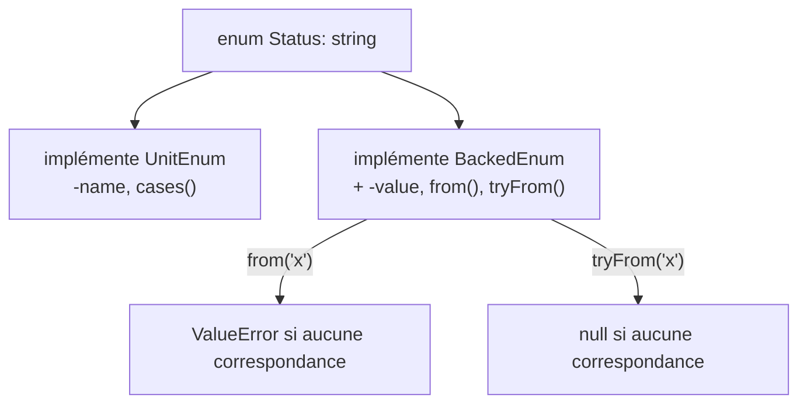

# Enums

!!! tip "En bref"
    Un enum (8.1) est un type de premier ordre dont les cases sont des
    singletons. Les enums **purs** n'ont que des cases ; les enums **backés**
    associent chaque case à un `int`/`string` et ajoutent `from()`/`tryFrom()`.
    Fait à haute valeur : `from()` **lève** `\ValueError` sur une valeur
    inconnue, `tryFrom()` renvoie `null` — et le routing de Symfony transforme
    ce même échec en **404**, pas en 500.

!!! example "Analogie concrète"
    Une case d'enum est un jour férié fixé au calendrier : il n'existe qu'un
    seul objet « Noël », jamais une seconde copie — comparer deux références
    à cette case avec `===` correspond donc toujours, comme demander « est-ce
    le même jour férié ? » a toujours une seule bonne réponse. Un enum backé
    imprime en plus son code officiel (`->value`) à côté du nom, ce qui
    permet de retrouver un jour férié **par ce code** (`from()`/`tryFrom()`)
    aussi bien que par son nom.

!!! abstract "Objectifs d'apprentissage"
    À la fin de ce chapitre, vous saurez :

    - [ ] Distinguer les enums purs et backés et les interfaces que chacun implémente.
    - [ ] Choisir entre `from()` et `tryFrom()` et prédire le mode d'échec de chacun.
    - [ ] Expliquer comment Symfony consomme les enums backés en routing et en formulaires.

    **Syllabus :** `PHP → Enums` ·
    **Niveau :** Avancé / Expert ·
    **Temps estimé :** 25 min ·
    **Prérequis :** [POO](oop.fr.md), [Interfaces](interfaces.fr.md)

---

## Pour les nuls

### L'idée en une phrase
Un enum est une liste fermée de valeurs nommées et fixes — comme les jours de la semaine, on ne peut jamais en "inventer" un huitième par erreur.

### Imagine dans la vraie vie
Pense aux boutons d'un ascenseur : RDC, 1, 2, 3. Impossible d'appuyer sur "4.5" — seuls les boutons qui existent physiquement sont utilisables. Un enum, c'est exactement ça : un jeu de valeurs prédéfinies, et rien d'autre n'est possible.

### Dans Symfony
Symfony s'appuie sur les enums pour des états fermés : le statut d'une commande (brouillon/publié), un rôle, une méthode HTTP. Dès qu'un contrôleur ou un formulaire attend un enum, Symfony refuse automatiquement toute valeur qui n'existe pas dans la liste — sans code de validation supplémentaire à écrire.

### Exemple simple
```php
enum Statut: string {
    case Brouillon = 'brouillon';
    case Publie = 'publie';
}

$s = Statut::from('publie'); // Statut::Publie
```

### Comment le mémoriser 🧠
`from()` = **f**âché : il explose (throw) si la valeur n'existe pas. `tryFrom()` = il **try** gentiment et répond juste "non" (`null`) sans drame.


## Théorie

Un **enum** (`enum Nom { ... }`, PHP 8.1+) est un type dont les instances —
ses **cases** — sont fixées, connues à la compilation, et chacune un
**singleton** : il n'existe qu'un seul objet `Status::Draft` dans tout le
processus. Un enum **pur** n'a que des cases ; un enum **backé**
(`enum Nom: string` ou `: int`) associe chaque case à une valeur scalaire.

```php
enum Level                 // enum pur : cases seules, aucune valeur scalaire
{
    case Low;
    case High;
}

enum Status: string        // enum backé : chaque case associée à une string
{
    case Draft = 'draft';
    case Published = 'published';
}
```

!!! question "Devinez d'abord"
    `Status::from('unknown')` contre `Status::tryFrom('unknown')` — l'un
    lève une exception, l'autre non. Lequel est lequel, et que renvoie le
    sûr des deux ?

??? note "Réponse"
    `from()` **lève** `\ValueError` sur une valeur sans case correspondante ;
    `tryFrom()` renvoie `null` à la place. Aucun des deux ne construit
    jamais une « nouvelle » case — chaque instance renvoyée est l'un des
    singletons fixes de l'enum.

## Approfondissement — le fonctionnement interne

### Les deux interfaces

Chaque enum implémente `UnitEnum` (`->name`, `cases()`). Un enum **backé**
implémente en plus `BackedEnum`, ajoutant un `->value` en lecture seule et
les fabriques statiques `from()`/`tryFrom()`.

```php
enum Suit: string implements HasColor   // un enum peut implémenter des interfaces
{
    case Hearts = 'H';
    case Spades = 'S';

    public function color(): string    // et déclarer des méthodes
    {
        return match ($this) {
            self::Hearts => 'red',
            self::Spades => 'black',
        };
    }
}

Suit::Hearts instanceof UnitEnum;    // true  — tout enum
Suit::Hearts instanceof BackedEnum;  // true  — seulement les enums backés
Level::Low instanceof BackedEnum;    // false — Level est pur

Suit::from('H');           // Suit::Hearts
Suit::tryFrom('X');        // null — pas d'exception
Suit::cases();             // [Suit::Hearts, Suit::Spades], ordre de déclaration
Suit::Hearts === Suit::from('H'); // true — les cases sont des singletons, l'identité tient
```

Un enum peut déclarer des **constantes**, des **méthodes**, et implémenter
des **interfaces**, mais ne peut pas porter d'état d'instance (non
constant) — il n'y a rien qui puisse diverger entre deux « copies » de
`Suit::Hearts`, puisqu'il n'en existe qu'une seule. C'est exactement ce qui
rend la comparaison d'identité `===` toujours sûre pour les cases d'enum,
contrairement aux objets ordinaires.



### Les enums backés dans Symfony

Symfony s'appuie sur `BackedEnum` à deux endroits que l'examen affectionne :

- **Routing** — un argument de contrôleur typé comme un enum backé est
  résolu par `BackedEnumValueResolver` (priorité 100, voir
  [Value Resolvers](../controllers/value-resolvers.fr.md)). Il appelle en
  interne `$enumType::from($value)` et **intercepte** le `\ValueError`/
  `TypeError` résultant pour le transformer en `NotFoundHttpException` —
  une valeur d'enum invalide dans l'URL est une **404**, pas une exception
  non gérée.
- **Formulaires** — `Symfony\Component\Form\Extension\Core\Type\EnumType`
  est un `ChoiceType` spécialisé pour les enums : son option requise
  `class` nomme l'enum, `choices` est auto-peuplée depuis `::cases()`, et
  pour un enum backé la valeur soumise fait l'aller-retour via le scalaire
  associé.

```php
#[Route('/orders/{status}')]
public function byStatus(Status $status): Response
{
    // BackedEnumValueResolver a déjà exécuté Status::from($routeValue) pour vous ;
    // une valeur non reconnue n'atteint jamais cette ligne — c'est une 404 en amont.
    return new Response($status->value);
}
```

!!! note "Référence source"
    `Symfony\Component\HttpKernel\Controller\ArgumentResolver\BackedEnumValueResolver`
    et `Symfony\Component\Form\Extension\Core\Type\EnumType` —
    [symfony/symfony `8.0`](https://github.com/symfony/symfony/tree/8.0/src/Symfony/Component/HttpKernel/Controller/ArgumentResolver/BackedEnumValueResolver.php).

### Comportement en cas d'absence

`tryFrom()` est la **seule** partie de cette API qui renvoie `null` sur un
échec ; tout le reste lève une exception ou renvoie une vraie valeur.
`from()` lève `\ValueError`, jamais `null` — traiter son retour comme
nullable est un bug qui attend une valeur de route/query jamais testée.
`cases()` ne renvoie jamais un tableau vide pour un enum déclaré avec au
moins une case ; un enum à zéro case est légal en PHP mais sans intérêt,
donc un `cases()` vide signifie presque toujours que vous avez interrogé la
mauvaise classe.

```php
$status = Status::tryFrom($input) ?? Status::Draft; // sûr : coalescence vers un vrai défaut

$status = Status::from($input); // soit un vrai Status, soit un ValueError levé —
                                 // JAMAIS null ; n'écrivez pas `$status ??= ...` après ceci
```

!!! note "L'absence en pratique"
    `tryFrom()` renvoyant `null` est le calendrier qui hausse les épaules
    « aucun jour férié n'a ce code » — une réponse normale et attendue à
    vérifier. `from()` refusant de répondre du tout (en levant une
    exception) est le calendrier qui refuse même de hausser les épaules :
    vous avez demandé quelque chose de si clairement faux qu'un `null`
    silencieux masquerait un vrai bug.

## Configuration & code

=== "Déclaration"

    ```php
    <?php
    declare(strict_types=1);

    enum Status: string
    {
        case Draft = 'draft';
        case Published = 'published';

        public const DEFAULT = self::Draft;

        public function label(): string
        {
            return ucfirst($this->value);
        }
    }
    ```

=== "Routing (BackedEnumValueResolver)"

    ```php
    <?php
    declare(strict_types=1);

    use Symfony\Component\Routing\Attribute\Route;

    #[Route('/orders/{status}', name: 'orders_by_status')]
    public function byStatus(Status $status): Response
    {
        return new Response($status->label());
    }
    ```

=== "Formulaires (EnumType)"

    ```yaml
    # Un champ de formulaire lié à un enum backé :
    # $builder->add('status', EnumType::class, ['class' => Status::class]);
    ```

## Bonnes pratiques et anti-patterns

| ✅ À faire | ❌ À éviter |
|---|---|
| `tryFrom()` + coalescence pour une entrée non fiable | `from()` sur une entrée utilisateur non validée sans `catch` |
| `===` pour comparer les cases (toujours sûr) | Comparer des cases d'enum avec `==` par habitude |
| Typer directement l'enum dans les routes | Mapper soi-même les chaînes vers les cases à la main |
| `EnumType` pour un champ lié à un enum | Un `ChoiceType` avec des `choices` recopiant l'enum à la main |

## Quand (ne pas) l'utiliser / alternatives

Utilisez un enum pour un **ensemble fermé et connu de valeurs** — statut,
rôle, couleur, méthode HTTP. Préférez un enum backé dès que la valeur doit
faire l'aller-retour via une colonne de base de données, un paramètre de
route, du JSON, ou un champ de formulaire. Utilisez plutôt un ensemble de
constantes de classe (ou un objet valeur) quand l'ensemble est réellement
ouvert ou nécessite un état par instance, ce que les cases d'enum ne peuvent
pas porter.

!!! danger "Pièges de certification"
    - `from()` **lève** `\ValueError` ; `tryFrom()` renvoie **`null`** — ils
      ne sont pas interchangeables, et l'examen teste précisément cette
      distinction.
    - Un argument de route typé comme un enum backé transforme une valeur
      invalide en **404** (`NotFoundHttpException`), pas en erreur non
      interceptée.
    - Seuls les enums **backés** implémentent `BackedEnum` ; les enums purs
      n'implémentent que `UnitEnum` et n'ont pas de `->value`.
    - Les cases d'enum ne peuvent porter aucun état non constant — seulement
      des constantes et des méthodes.
    - L'option `class` d'`EnumType` est **requise** ; `choices` est dérivée
      automatiquement de `::cases()`.

!!! warning "Erreurs fréquentes"
    - Traiter le retour de `from()` comme nullable et le coalescer après
      coup — il ne renvoie jamais `null`, il lève une exception.
    - Comparer des cases d'enum avec `==` par habitude venant des objets
      classiques (les deux fonctionnent pour les enums, mais `===` est la
      forme idiomatique, toujours sûre).
    - Oublier qu'un enum pur n'a aucun `->value`.

## Exercices

1. **(Avancé)** Déclarez un `enum Role: int` backé avec trois cases et une
   méthode `label()` utilisant `match($this)`.
2. **(Expert)** Câblez un argument de contrôleur `#[Route('/roles/{role}')]`
   typé `Role` et expliquez précisément quel statut HTTP produit un
   `{role}` inconnu, et pourquoi.

??? success "Solutions"

    **1.**
    ```php
    enum Role: int
    {
        case Viewer = 0;
        case Editor = 1;
        case Admin = 2;

        public function label(): string
        {
            return match ($this) {
                self::Viewer => 'Viewer',
                self::Editor => 'Editor',
                self::Admin  => 'Admin',
            };
        }
    }
    ```

    **2.** `public function show(Role $role): Response { ... }` — un
    `{role}` inconnu fait appeler `Role::from($value)` par
    `BackedEnumValueResolver`, ce qui lève `\ValueError` ; le resolver
    l'intercepte et lève `NotFoundHttpException`, donc la réponse est
    **404**, jamais une 500.

## Questions de certification

??? question "Q1. Que fait `Status::from('missing')` quand aucune case ne correspond ?"
    - [ ] A. Renvoie `null`
    - [x] B. Lève `\ValueError` ✅
    - [ ] C. Renvoie une nouvelle case anonyme
    - [ ] D. Renvoie `false`

    **Pourquoi :** `from()` est stricte — une valeur non reconnue lève
    `\ValueError` ; seule `tryFrom()` renvoie `null`.
    **Réf :** [PHP : Enums backés](https://www.php.net/manual/en/language.enumerations.backed.php).

??? question "Q2. Quelle interface seuls les enums backés implémentent-ils ?"
    - [x] A. `BackedEnum` ✅
    - [ ] B. `UnitEnum`
    - [ ] C. `Stringable`
    - [ ] D. `Countable`

    **Pourquoi :** tout enum implémente `UnitEnum` ; seul un enum backé
    implémente en plus `BackedEnum` et expose `->value`.
    **Réf :** [PHP : Enumerations](https://www.php.net/manual/en/language.enumerations.php).

??? question "Q3. Un argument de route typé comme un enum backé reçoit une valeur invalide. Que se passe-t-il ?"
    - [x] A. `BackedEnumValueResolver` transforme l'échec en 404 ✅
    - [ ] B. Un `\ValueError` non intercepté produit une 500
    - [ ] C. L'argument vaut `null`
    - [ ] D. La route retombe silencieusement sur la première case

    **Pourquoi :** le resolver appelle `from()` et intercepte lui-même
    `\ValueError`/`TypeError`, levant `NotFoundHttpException`.
    **Réf :** [Source Symfony — BackedEnumValueResolver](https://github.com/symfony/symfony/tree/8.0/src/Symfony/Component/HttpKernel/Controller/ArgumentResolver/BackedEnumValueResolver.php).

??? question "Q4. Qu'une case d'enum ne peut-elle PAS avoir ?"
    - [ ] A. Des méthodes
    - [ ] B. Des constantes
    - [ ] C. Des interfaces implémentées
    - [x] D. Un état d'instance non constant ✅

    **Pourquoi :** les cases sont des singletons ; autoriser un état
    mutable par instance casserait la garantie que `===` identifie toujours
    la même case.
    **Réf :** [PHP : Enumerations](https://www.php.net/manual/en/language.enumerations.php).

## Ce qu'il faut retenir

- Les enums purs implémentent `UnitEnum` ; les enums backés implémentent en
  plus `BackedEnum` et ajoutent `->value`/`from()`/`tryFrom()`.
- `from()` lève `\ValueError` sur un échec ; `tryFrom()` renvoie `null` —
  pas interchangeables.
- Les cases sont des singletons : la comparaison d'identité `===` est
  toujours sûre.
- `BackedEnumValueResolver` de Symfony transforme une mauvaise valeur de
  route en 404 ; `EnumType` lie un enum backé à un champ via `::cases()`.

## Révision de dernière minute

!!! tip "Fiche de révision"
    - `enum X { case A; }` — pur. `enum X: string { case A = 'a'; }` — backé.
    - `UnitEnum` : `->name`, `cases()`. `BackedEnum` (backé seulement) :
      `->value`, `from()` (lève), `tryFrom()` (null).
    - Argument de route, enum backé, mauvaise valeur → **404** via
      `BackedEnumValueResolver`.
    - Option `class` d'`EnumType::class` (requise) → `choices` depuis `::cases()`.

## Connexions

- **Dépend de :** [POO](oop.fr.md) — un enum peut implémenter des
  interfaces et déclarer des méthodes.
- **Réutilisé dans :** [Value Resolvers](../controllers/value-resolvers.fr.md) —
  `BackedEnumValueResolver` à la priorité 100 ; [Formulaires — Types intégrés](../forms/built-in-types.fr.md) —
  `EnumType`.
- **À ne pas confondre avec :** [l'API PHP](php-api.fr.md) — `match`
  (largement utilisé avec les enums) et les autres fonctionnalités du
  langage 8.0+ y sont couvertes ; ce chapitre-ci porte sur le type enum
  lui-même.

## Références officielles
- [Manuel PHP — Enumerations](https://www.php.net/manual/en/language.enumerations.php)
- [Manuel PHP — Enums backés](https://www.php.net/manual/en/language.enumerations.backed.php)
- [Source Symfony — BackedEnumValueResolver](https://github.com/symfony/symfony/tree/8.0/src/Symfony/Component/HttpKernel/Controller/ArgumentResolver/BackedEnumValueResolver.php)
- [Source Symfony — EnumType](https://github.com/symfony/symfony/blob/8.0/src/Symfony/Component/Form/Extension/Core/Type/EnumType.php)

## Références vidéo

!!! tip "Regarder pour progresser"
    Ce sont des chaînes vidéo officielles, mises à jour en continu —
    cherchez-y « PHP enums » pour renforcer ce chapitre. Nous renvoyons vers
    des chaînes stables plutôt que des vidéos individuelles pour que les
    références ne deviennent jamais obsolètes.

    - [Screencasts SymfonyCasts](https://symfonycasts.com/tracks/symfony) — tutoriels scriptés en code.
    - [YouTube officiel Symfony](https://www.youtube.com/@SymfonyOfficial) — conférences et keynotes SymfonyCon.
    - [Documentation officielle du sujet](https://www.php.net/manual/en/language.enumerations.php) — la page du manuel PHP sur les enumerations.

## Auto-évaluation

Je suis prêt(e) quand je peux :

- [ ] expliquer **pourquoi** les cases d'enum sont des singletons et ce que cela garantit pour `===`
- [ ] choisir correctement entre `from()` et `tryFrom()` pour une entrée non fiable en Symfony 8
- [ ] déboguer un code qui traite à tort le retour de `from()` comme nullable
- [ ] repérer le piège : une valeur de route invalide pour un enum backé est une 404, pas une 500
- [ ] expliquer comment `EnumType` dérive ses choix de `::cases()`

---

<small>Voir aussi : [POO](oop.fr.md) · [API PHP](php-api.fr.md) · [Value Resolvers](../controllers/value-resolvers.fr.md)</small>
