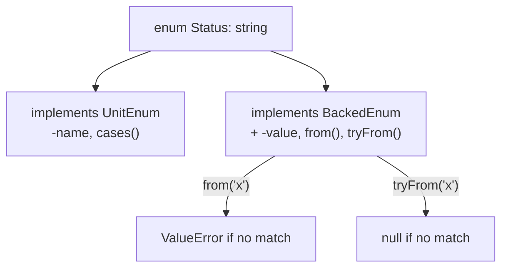

# Enums

!!! tip "In a nutshell"
    An enum (8.1) is a first-class type whose cases are singletons. **Pure**
    enums have only cases; **backed** enums map each case to an `int`/`string`
    and add `from()`/`tryFrom()`. Highest-yield fact: `from()` **throws**
    `\ValueError` on an unknown value, `tryFrom()` returns `null` — and
    Symfony's routing turns that same failure into a **404**, not a 500.

!!! example "Real-world analogy"
    An enum case is a national holiday on a fixed calendar: there is exactly
    one "Christmas Day" object, never a second copy — so comparing two
    references to it with `===` always matches, the way asking "is this the
    same holiday?" always has one right answer. A backed enum additionally
    prints its official date code (`->value`) next to the name, so you can
    look a holiday up **by that code** (`from()`/`tryFrom()`) as well as by
    name.

!!! abstract "Learning objectives"
    By the end of this chapter you can:

    - [ ] Distinguish pure and backed enums and the interfaces each implements.
    - [ ] Choose between `from()` and `tryFrom()` and predict the failure mode of each.
    - [ ] Explain how Symfony consumes backed enums in routing and forms.

    **Syllabus:** `PHP → Enums` ·
    **Level:** Advanced / Expert ·
    **Est. time:** 25 min ·
    **Prerequisites:** [OOP](oop.md), [Interfaces](interfaces.md)

---

## Theory

An **enum** (`enum Name { ... }`, PHP 8.1+) is a type whose instances — its
**cases** — are fixed, known at compile time, and each a **singleton**: there
is exactly one `Status::Draft` object anywhere in the process. A **pure**
enum has only cases; a **backed** enum (`enum Name: string` or `: int`) maps
every case to a scalar value.

```php
enum Level                 // pure enum: cases only, no scalar value
{
    case Low;
    case High;
}

enum Status: string        // backed enum: each case maps to a string
{
    case Draft = 'draft';
    case Published = 'published';
}
```

!!! question "Predict first"
    `Status::from('unknown')` vs `Status::tryFrom('unknown')` — one throws,
    one doesn't. Which is which, and what does the safe one return?

??? note "Reveal"
    `from()` **throws** `\ValueError` on a value with no matching case;
    `tryFrom()` returns `null` instead. Neither ever constructs a "new" case
    — every returned instance is one of the enum's fixed singletons.

## Deep Dive — how it works internally

### The two interfaces

Every enum implements `UnitEnum` (`->name`, `cases()`). A **backed** enum
additionally implements `BackedEnum`, adding a read-only `->value` and the
static `from()`/`tryFrom()` factories.

```php
enum Suit: string implements HasColor   // enums may implement interfaces
{
    case Hearts = 'H';
    case Spades = 'S';

    public function color(): string    // and declare methods
    {
        return match ($this) {
            self::Hearts => 'red',
            self::Spades => 'black',
        };
    }
}

Suit::Hearts instanceof UnitEnum;    // true  — every enum
Suit::Hearts instanceof BackedEnum;  // true  — only backed enums
Level::Low instanceof BackedEnum;    // false — Level is pure

Suit::from('H');           // Suit::Hearts
Suit::tryFrom('X');        // null — no exception
Suit::cases();             // [Suit::Hearts, Suit::Spades], declaration order
Suit::Hearts === Suit::from('H'); // true — cases are singletons, identity holds
```

Enums may declare **constants**, **methods**, and implement **interfaces**,
but they cannot hold (non-constant) instance state — there is nothing to
diverge between two "copies" of `Suit::Hearts`, because there is only one.
That is exactly what makes `===` identity comparison always safe for enum
cases, unlike ordinary objects.



### Backed enums in Symfony

Symfony leans on `BackedEnum` in two places the exam favors:

- **Routing** — a controller argument type-hinted as a backed enum is
  resolved by `BackedEnumValueResolver` (priority 100, see
  [Value Resolvers](../controllers/value-resolvers.md)). It calls
  `$enumType::from($value)` internally and **catches** the resulting
  `\ValueError`/`TypeError`, converting it into a
  `NotFoundHttpException` — an invalid enum value in the URL is a **404**,
  not an unhandled exception.
- **Forms** — `Symfony\Component\Form\Extension\Core\Type\EnumType` is a
  `ChoiceType` specialised for enums: its required `class` option names the
  enum, `choices` is auto-populated from `::cases()`, and for backed enums
  the submitted value round-trips through the backing scalar.

```php
#[Route('/orders/{status}')]
public function byStatus(Status $status): Response
{
    // BackedEnumValueResolver already ran Status::from($routeValue) for you;
    // an unmatched value never reaches this line — it is a 404 upstream.
    return new Response($status->value);
}
```

!!! note "Source reference"
    `Symfony\Component\HttpKernel\Controller\ArgumentResolver\BackedEnumValueResolver`
    and `Symfony\Component\Form\Extension\Core\Type\EnumType` —
    [symfony/symfony `8.0`](https://github.com/symfony/symfony/blob/8.0/src/Symfony/Component/HttpKernel/Controller/ArgumentResolver/BackedEnumValueResolver.php).

### Null behavior

`tryFrom()` is the **only** part of this API that returns `null` on a miss;
everything else either throws or returns a real value. `from()` throws
`\ValueError`, never `null` — treating its return as nullable is a bug
waiting for a route/query value nobody tested. `cases()` never returns an
empty array for a declared enum with at least one case; an enum with zero
cases is legal PHP but pointless, so an empty `cases()` result almost always
means you queried the wrong class.

```php
$status = Status::tryFrom($input) ?? Status::Draft; // safe: null-coalesce a real default

$status = Status::from($input); // either a real Status, or a thrown ValueError —
                                 // NEVER null; don't write `$status ??= ...` after this
```

!!! note "Null in real life"
    `tryFrom()` handing back `null` is the calendar shrugging "no holiday has
    that code" — a normal, expected answer to check for. `from()` refusing
    to answer at all (throwing) is the calendar refusing to even shrug: you
    asked for something so clearly wrong that a silent `null` would hide a
    real bug.

## Configuration & code

=== "Declaration"

    ```php
    <?php
    declare(strict_types=1);

    enum Status: string
    {
        case Draft = 'draft';
        case Published = 'published';

        public const DEFAULT = self::Draft;

        public function label(): string
        {
            return ucfirst($this->value);
        }
    }
    ```

=== "Routing (BackedEnumValueResolver)"

    ```php
    <?php
    declare(strict_types=1);

    use Symfony\Component\Routing\Attribute\Route;

    #[Route('/orders/{status}', name: 'orders_by_status')]
    public function byStatus(Status $status): Response
    {
        return new Response($status->label());
    }
    ```

=== "Forms (EnumType)"

    ```yaml
    # A form field bound to a backed enum:
    # $builder->add('status', EnumType::class, ['class' => Status::class]);
    ```

## Best practices & anti-patterns

| ✅ Do | ❌ Avoid |
|---|---|
| `tryFrom()` + null-coalesce for untrusted input | `from()` on unvalidated user input without a catch |
| `===` to compare cases (always safe) | Comparing enum cases with `==` out of old habit |
| Type-hint the enum directly in routes | Manually mapping strings to enum cases yourself |
| `EnumType` for enum-backed form fields | A `ChoiceType` with hand-written `choices` mirroring the enum |

## When (not) to use it / alternatives

Use an enum for a **closed, known set of values** — status, role, suit,
HTTP method. Prefer a backed enum whenever the value must round-trip through
a database column, a route parameter, JSON, or a form. Use a plain class
constant set (or a value object) instead when the set is genuinely open-ended
or needs per-instance state, which enum cases cannot hold.

!!! danger "Certification traps"
    - `from()` **throws** `\ValueError`; `tryFrom()` returns **`null`** — they
      are not interchangeable, and the exam tests exactly this distinction.
    - A route argument type-hinted as a backed enum turns an invalid value
      into a **404** (`NotFoundHttpException`), not an uncaught error.
    - Only **backed** enums implement `BackedEnum`; pure enums implement only
      `UnitEnum` and have no `->value`.
    - Enum cases cannot hold non-constant state — only constants and methods.
    - `EnumType`'s `class` option is **required**; `choices` is derived from
      `::cases()` automatically.

!!! warning "Common mistakes"
    - Treating `from()`'s return as nullable and null-coalescing after it —
      it never returns `null`, it throws.
    - Comparing enum cases with `==` instead of `===` out of habit from plain
      objects (both work for enums, but `===` is the idiomatic, always-safe form).
    - Forgetting that a pure enum has no `->value` at all.

## Exercises

1. **(Advanced)** Declare a backed `enum Role: int` with three cases and a
   `label()` method using `match($this)`.
2. **(Expert)** Wire a `#[Route('/roles/{role}')]` controller argument typed
   `Role` and explain exactly what HTTP status an unknown `{role}` produces
   and why.

??? success "Solutions"

    **1.**
    ```php
    enum Role: int
    {
        case Viewer = 0;
        case Editor = 1;
        case Admin = 2;

        public function label(): string
        {
            return match ($this) {
                self::Viewer => 'Viewer',
                self::Editor => 'Editor',
                self::Admin  => 'Admin',
            };
        }
    }
    ```

    **2.** `public function show(Role $role): Response { ... }` — an unknown
    `{role}` makes `BackedEnumValueResolver` call `Role::from($value)`, which
    throws `\ValueError`; the resolver catches it and raises
    `NotFoundHttpException`, so the response is **404**, never a 500.

## Certification questions

??? question "Q1. `Status::from('missing')` when no case matches does what?"
    - [ ] A. Returns `null`
    - [x] B. Throws `\ValueError` ✅
    - [ ] C. Returns a new anonymous case
    - [ ] D. Returns `false`

    **Why:** `from()` is strict — an unmatched value is a thrown
    `\ValueError`; only `tryFrom()` returns `null`.
    **Ref:** [PHP: Backed enumerations](https://www.php.net/manual/en/language.enumerations.backed.php).

??? question "Q2. Which interface do only backed enums implement?"
    - [x] A. `BackedEnum` ✅
    - [ ] B. `UnitEnum`
    - [ ] C. `Stringable`
    - [ ] D. `Countable`

    **Why:** every enum implements `UnitEnum`; only a backed enum
    additionally implements `BackedEnum` and exposes `->value`.
    **Ref:** [PHP: Enumerations](https://www.php.net/manual/en/language.enumerations.php).

??? question "Q3. A route argument type-hinted as a backed enum receives an invalid value. What happens?"
    - [x] A. `BackedEnumValueResolver` converts the failure into a 404 ✅
    - [ ] B. An uncaught `\ValueError` produces a 500
    - [ ] C. The argument resolves to `null`
    - [ ] D. The route silently falls back to the first case

    **Why:** the resolver calls `from()` and catches `\ValueError`/`TypeError`
    itself, raising `NotFoundHttpException`.
    **Ref:** [Symfony source — BackedEnumValueResolver](https://github.com/symfony/symfony/blob/8.0/src/Symfony/Component/HttpKernel/Controller/ArgumentResolver/BackedEnumValueResolver.php).

??? question "Q4. What can an enum case NOT have?"
    - [ ] A. Methods
    - [ ] B. Constants
    - [ ] C. Implemented interfaces
    - [x] D. Non-constant instance state ✅

    **Why:** cases are singletons; allowing mutable per-instance state would
    break the guarantee that `===` always identifies the same case.
    **Ref:** [PHP: Enumerations](https://www.php.net/manual/en/language.enumerations.php).

## Key takeaways

- Pure enums implement `UnitEnum`; backed enums additionally implement
  `BackedEnum` and add `->value`/`from()`/`tryFrom()`.
- `from()` throws `\ValueError` on a miss; `tryFrom()` returns `null` — not
  interchangeable.
- Cases are singletons: `===` identity comparison is always safe.
- Symfony's `BackedEnumValueResolver` turns a bad route value into a 404;
  `EnumType` binds a backed enum to a form field via `::cases()`.

## Last-minute revision

!!! tip "Cheat sheet"
    - `enum X { case A; }` — pure. `enum X: string { case A = 'a'; }` — backed.
    - `UnitEnum`: `->name`, `cases()`. `BackedEnum` (backed only): `->value`,
      `from()` (throws), `tryFrom()` (null).
    - Route argument, backed enum, bad value → **404** via `BackedEnumValueResolver`.
    - `EnumType::class` form option: `class` (required) → `choices` from `::cases()`.

## Connections

- **Depends on:** [OOP](oop.md) — enums may implement interfaces and declare methods.
- **Reused in:** [Value Resolvers](../controllers/value-resolvers.md) —
  `BackedEnumValueResolver` at priority 100; [Forms — Built-in Types](../forms/built-in-types.md) —
  `EnumType`.
- **Confused with:** [PHP API](php-api.md) — `match` (used heavily with
  enums) and other 8.0+ language features live there; this chapter is the
  enum type itself.

## Official References
- [PHP manual — Enumerations](https://www.php.net/manual/en/language.enumerations.php)
- [PHP manual — Backed enumerations](https://www.php.net/manual/en/language.enumerations.backed.php)
- [Symfony source — BackedEnumValueResolver](https://github.com/symfony/symfony/blob/8.0/src/Symfony/Component/HttpKernel/Controller/ArgumentResolver/BackedEnumValueResolver.php)
- [Symfony source — EnumType](https://github.com/symfony/symfony/blob/8.0/src/Symfony/Component/Form/Extension/Core/Type/EnumType.php)

## Video references

!!! tip "Watch & learn"
    These are official, continuously-updated video channels — search them for
    "PHP enums" to reinforce this chapter. We link stable channels rather than
    individual videos so the references never rot.

    - [SymfonyCasts screencasts](https://symfonycasts.com/tracks/symfony) — scripted, code-along tutorials.
    - [Symfony official YouTube](https://www.youtube.com/@SymfonyOfficial) — SymfonyCon conference talks & keynotes.
    - [Official docs for this topic](https://www.php.net/manual/en/language.enumerations.php) — the PHP manual page for enumerations.

## Confidence check

I'm ready when I can:

- [ ] explain **why** enum cases are singletons and what that guarantees for `===`
- [ ] choose `from()` vs `tryFrom()` correctly for untrusted input in Symfony 8
- [ ] debug code that wrongly treats `from()`'s return as nullable
- [ ] spot the trap: an invalid backed-enum route value is a 404, not a 500
- [ ] explain how `EnumType` derives its choices from `::cases()`

---

<small>Related: [OOP](oop.md) · [PHP API](php-api.md) · [Value Resolvers](../controllers/value-resolvers.md)</small>
