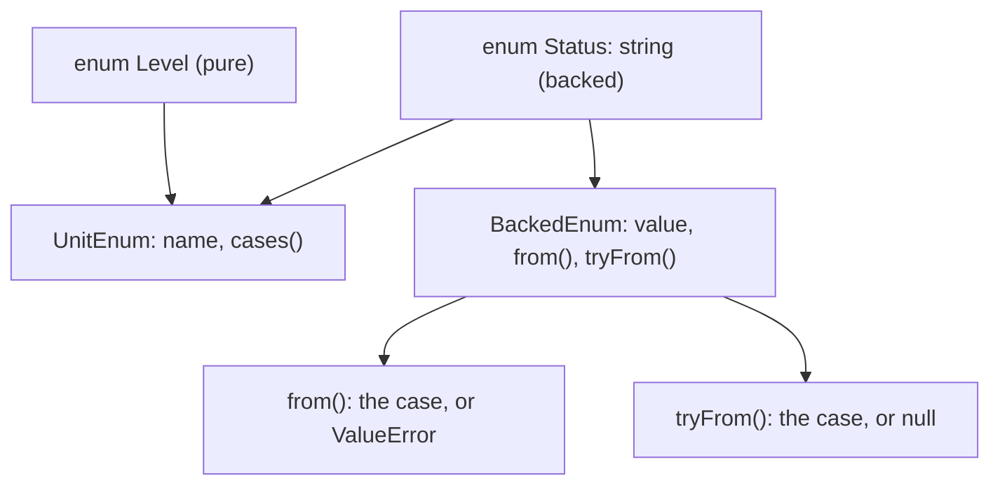
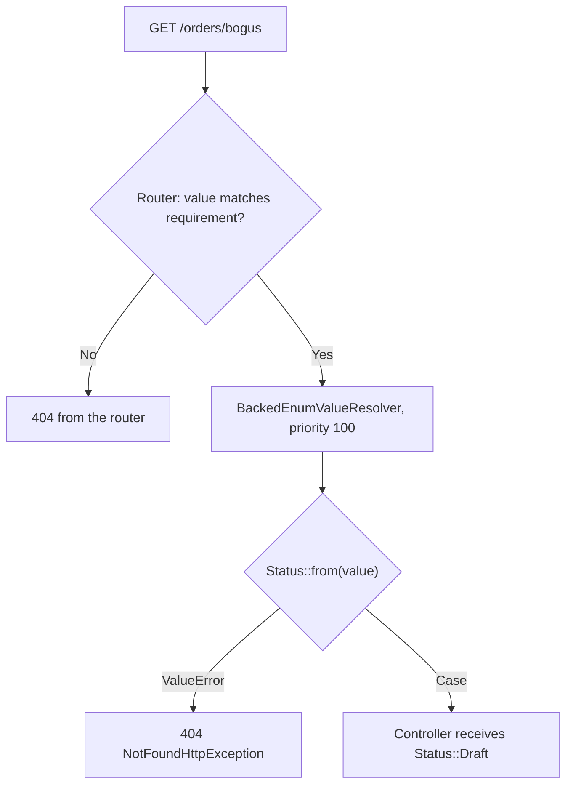

# Enums

!!! tip "In a nutshell"
    An enum (PHP 8.1+) is a type whose values are a fixed, closed list, and whose cases are
    **singleton objects**. **Pure** enums have cases only; **backed** enums map each case to a
    unique `int` or `string` and gain `->value`, `from()` and `tryFrom()`. Highest-yield fact:
    `from()` **throws `\ValueError`** on an unknown value while `tryFrom()` returns **`null`** —
    and every Symfony integration built on `from()` (routing, `#[MapQueryParameter]`, the
    Serializer) catches that error and turns it into a **404** or a validation failure, never an
    unhandled 500.

!!! example "Real-world analogy"
    An enum case is a parcel-tracking status. There is exactly one "Delivered" status in the
    carrier's system — not one copy per parcel — so asking "is this the same status?" always has
    one right answer, which is why `===` is safe. A backed enum additionally prints the short
    scan code next to the human name (`DLV` ↔ `Delivered`), so you can look a status up **by
    code** (`from()` / `tryFrom()`) as well as by name. A pure enum is the same board without the
    scan codes: perfectly usable inside the warehouse, useless the moment the value has to travel
    on a label.

!!! abstract "Learning objectives"
    By the end of this chapter you can:

    - [ ] Distinguish pure and backed enums, and name exactly what `UnitEnum` and `BackedEnum` add.
    - [ ] Choose between `from()` and `tryFrom()`, and predict the failure mode of each under
          strict and weak typing.
    - [ ] State what an enum may contain (methods, static methods, constants, interfaces, traits,
          attributes) and what it may never contain (state, inheritance, `new`, cloning).
    - [ ] Explain why cases are singletons and what that guarantees for `===`, `match` and
          serialization.
    - [ ] Wire an enum through Symfony: routing requirements, value resolvers, `EnumType`,
          Doctrine `enumType` and the Serializer.

    **Syllabus:** `PHP → Enums` ·
    **Level:** Advanced / Expert ·
    **Est. time:** 45 min ·
    **Prerequisites:** [OOP](oop.md), [Interfaces](interfaces.md), [Attributes](attributes.md)

    **Examen Symfony 8 :** OUI

---

## Prerequisites

You should be comfortable with classes, constants, visibility and interfaces from
[OOP](oop.md) and [Interfaces & Type Declarations](interfaces.md), and know how `match` differs
from `switch` (see [PHP API](php-api.md)). Everything below targets **PHP 8.4** — the language
version Symfony 8 requires — and **Symfony 8.0**.

## The problem we are solving

An order has a status. Before enums, you modelled it with strings:

```php
final class Order
{
    public string $status = 'draft';
}

$order->status = 'publised';   // typo: silently accepted, breaks reporting later
```

Nothing stops a typo, nothing lists the legal values, and every consumer re-invents its own
validation. Class constants improve discoverability but not safety:

```php
final class Status
{
    public const DRAFT = 'draft';
    public const PUBLISHED = 'published';
}

function publish(string $status): void {}   // still accepts any string at all
```

The type declaration is still `string`, so the engine cannot help. What you actually want is a
**type whose set of values is closed**, so that "invalid states are unrepresentable" — the phrase
the PHP manual itself uses. That is an enum:

```php
enum Status: string
{
    case Draft = 'draft';
    case Published = 'published';
}

function publish(Status $status): void {}   // only two values can ever arrive
```

Passing anything else is a `TypeError` raised by the engine, with no validation code of your own.

!!! info "PHP 8.4 reference"
    https://www.php.net/manual/en/language.enumerations.overview.php

## 🧠 Pour les nuls

**C'est quoi ?** Un enum est un **type dont la liste des valeurs est fermée** : tu déclares une
fois pour toutes les valeurs possibles (`Draft`, `Published`, `Archived`) et le langage refuse
tout le reste. Chaque valeur s'appelle un **cas** (`case`), et chaque cas est un **objet unique**
créé par PHP : il n'en existe qu'un seul exemplaire dans tout le programme.

**Pourquoi ça existe ?** Parce qu'une chaîne de caractères accepte n'importe quoi. Avec
`string $statut`, la faute de frappe `'publié '` passe, arrive en base, et le bug se révèle trois
semaines plus tard dans un rapport. Avec un enum, l'erreur est refusée immédiatement, par le
moteur PHP, sans une seule ligne de validation.

**🏠 Analogie de la vraie vie :** le **suivi de colis**. Le transporteur n'a qu'une poignée de
statuts : « En préparation », « Expédié », « Livré ». Il n'existe pas deux statuts « Livré » : il
y en a un seul, partagé par tous les colis — c'est la notion de *singleton*. Sur l'étiquette, ce
statut est imprimé sous forme de code court (`DLV`) : c'est la **valeur** d'un enum *backed*.
Scanner un code connu rend le statut correspondant (`from('DLV')`) ; scanner un code inexistant
(`from('ZZZ')`) fait hurler la machine (une exception `\ValueError`), alors que la version douce
(`tryFrom('ZZZ')`) répond simplement « inconnu » (`null`).

**Symfony dans la vraie vie :** dès qu'une action de contrôleur déclare un argument typé avec un
enum *backed*, Symfony va chercher le paramètre de route correspondant et appelle `from()` à ta
place. Si la valeur de l'URL n'existe pas dans la liste, le visiteur reçoit une **404** — pas une
page d'erreur. Le même enum sert ensuite de liste déroulante dans un formulaire (`EnumType`) et de
colonne en base (option `enumType` de Doctrine) : une seule déclaration, trois usages.

**💻 Exemple minimal :**
```php
enum Statut: string
{
    case Brouillon = 'brouillon';
    case Publie = 'publie';
}

$s = Statut::from('publie');            // Statut::Publie
$t = Statut::tryFrom('inconnu');        // null, aucune exception
var_dump($s === Statut::Publie);        // true : c'est le même objet
```
Ligne 3 : le nom du cas (`Brouillon`) et sa valeur stockée (`'brouillon'`) sont deux choses
différentes. Ligne 8 : `from()` rend **le** cas existant, jamais une copie.

**🔍 Que se passe-t-il réellement ?**

1. PHP lit `enum Statut: string` et fabrique une **classe finale** portant ce nom.
2. Chaque `case` devient une constante de cette classe, dont la valeur est l'unique instance
   correspondante — d'où le singleton.
3. Le moteur ajoute automatiquement l'interface `UnitEnum` (propriété `name`, méthode `cases()`),
   et, parce qu'un type de valeur est déclaré, l'interface `BackedEnum` (propriété `value`,
   méthodes `from()` et `tryFrom()`).
4. `from('publie')` consulte la table valeur → cas ; si la valeur n'y est pas, une exception
   `\ValueError` est levée.
5. `===` compare deux adresses d'objets : comme il n'y a qu'un objet par cas, la réponse est
   toujours juste.

**⚠️ Erreur fréquente :** lire `->value` sur un enum **pur** (déclaré sans `: string` ni `: int`).
Ce n'est pas une erreur fatale : PHP émet un simple avertissement « Undefined property » et
l'expression vaut `null`. Le `null` file alors en base ou dans une réponse JSON sans rien casser
tout de suite — c'est le bug le plus discret de ce chapitre.

**🧠 Comment le mémoriser ?** *« `from()` est furieux, il explose ; `tryFrom()` essaie, il répond
`null`. »* Et pour la distinction des deux familles : *« pur = un nom ; backed = un nom **et** un
code-barres. »*

## Build the mental model

Two ideas explain almost every rule in this chapter.

**One: an enum is a final class whose cases are constants holding singleton instances.** That is
not a metaphor — the manual shows the equivalent (non-runnable) class structure, with each case as
a `public const` holding one instance and a private constructor. Everything that follows from
"there is exactly one `Status::Draft` object" is therefore a hard guarantee: `===` is exact,
`match` is reliable, deserialization returns the same object, and no `clone` or `new` can produce
a rival copy.

**Two: the backing type is what puts a case on an interface.** Declaring `enum Status: string`
does not merely attach a scalar; it makes the engine apply `BackedEnum`, and it is that interface
— not the value itself — that Symfony's routing, Doctrine mapping and Serializer test for.



Read the diagram as one sentence: every enum gets `UnitEnum`; only a backed enum additionally gets
`BackedEnum`, whose two factories differ solely in how they report a miss. A pure enum therefore
has no `->value`, no `from()` and no `tryFrom()` — calling `Level::from('x')` fails with
`Error: Call to undefined method Level::from()`.

!!! info "PHP 8.4 reference"
    https://www.php.net/manual/en/class.unitenum.php

## Core concepts

### Pure enums

A **pure case** carries no data. An enum containing only pure cases is a **pure enum**:

```php
enum Level
{
    case Low;
    case High;
}

echo Level::High->name;   // "High" — the only property a pure case has
```

Cases follow the same naming rules as any PHP label, and an enum may declare zero or more of them
(a zero-case enum is legal, if useless).

### Backed enums

Declaring a backing type makes every case carry a unique scalar:

```php
enum Suit: string
{
    case Hearts = 'H';
    case Diamonds = 'D';
    case Clubs = 'C';
    case Spades = 'S';
}

echo Suit::Clubs->value;   // "C"
```

Three rules are examinable and absolute:

- the backing type is `int` **or** `string`, one at a time — `int|string` is a fatal error;
- **every** case must define its value explicitly; there are no auto-generated sequences;
- values must be **unique**; duplicates raise
  `Error: Duplicate value in enum Suit for cases Hearts and Spades` when the enum is loaded.

Since PHP 8.2 a case value may be any constant scalar *expression* (before 8.2 it had to be a
literal or a literal expression, so `1 + 1` was allowed but `1 + SOME_CONST` was not).

!!! info "PHP 8.4 reference"
    https://www.php.net/manual/en/language.enumerations.backed.php

### The engine-provided API

| Member | Available on | Returns | On a miss |
|---|---|---|---|
| `->name` | every case | `string`, read-only | — |
| `->value` | backed cases | `int\|string`, read-only | — |
| `X::cases()` | every enum | packed array of cases, declaration order | — |
| `X::from($v)` | backed enums | the case | throws `\ValueError` |
| `X::tryFrom($v)` | backed enums | the case | returns `null` |

!!! question "Predict first"
    `Status::from('unknown')` vs `Status::tryFrom('unknown')` — one throws, one does not. Which
    is which, and what does the safe one return?

??? note "Reveal"
    `from()` **throws** `\ValueError` (`"unknown" is not a valid backing value for enum Status`);
    `tryFrom()` returns `null`. Neither ever constructs a "new" case — every returned instance is
    one of the enum's fixed singletons.

`UnitEnum` and `BackedEnum` are applied by the engine, may not be implemented by user-defined
classes, and their methods may not be overridden: they exist purely for type checks. Declaring
your own `cases()`, `from()` or `tryFrom()` is a fatal error (`Cannot redeclare Suit::cases()`).

!!! info "PHP 8.4 reference"
    https://www.php.net/manual/en/class.backedenum.php

## Learn by doing

Build one enum and add exactly one capability per step.

**Step 1 — the closed list.** Start with the values and nothing else.

```php
enum Status: string
{
    case Draft = 'draft';
    case Published = 'published';
    case Archived = 'archived';
}
```

Already useful: `function publish(Status $s)` can now receive only these three values.

**Step 2 — add behaviour, not data.** A case cannot hold a label, but the enum can compute one.
Inside a method, `$this` is the case:

```php
public function label(): string
{
    return match ($this) {
        self::Draft => 'Draft',
        self::Published => 'Published',
        self::Archived => 'Archived',
    };
}
```

Note the deliberate absence of `default`: adding a fourth case now makes this `match` throw
`\UnhandledMatchError` at exactly the place that needs updating.

**Step 3 — satisfy a contract.** Enums may implement interfaces, and every case then passes that
type check. On a backed enum, `implements` comes *after* the backing type:

```php
enum Status: string implements HasLabel { /* ... */ }
```

**Step 4 — alias a case with a constant.** Constants are allowed, and one may refer to a case:

```php
public const DEFAULT = self::Draft;   // Status::DEFAULT === Status::Draft
```

**Step 5 — add an alternative constructor.** `from()` covers the backing value; any other lookup
key needs a static method of your own:

```php
public static function fromLabel(string $label): self
{
    foreach (self::cases() as $case) {
        if ($case->label() === $label) {
            return $case;
        }
    }

    throw new \ValueError(\sprintf('"%s" is not a valid label', $label));
}
```

**Step 6 — try to add state, and watch it fail.** The natural next move is a property:

```php
public string $badgeColor = 'grey';   // Fatal: Enum Status cannot include properties
```

This is the wall that defines the type: an enum models *identity*, never *state*. Everything a
case appears to "carry" is derived — from `name`, from `value`, from a method, or from an
attribute read through reflection.

!!! info "PHP 8.4 reference"
    https://www.php.net/manual/en/language.enumerations.methods.php

## How Symfony handles it

Symfony consumes `BackedEnum` in five places the exam favours.

### Routing and controller arguments

A controller argument type-hinted as a backed enum is resolved by `BackedEnumValueResolver`,
registered with **priority 100** on the `controller.argument_value_resolver` tag. It reads the
**request attribute** of the same name (that is, a route path parameter), calls
`$enumType::from($value)` and catches `\ValueError|\TypeError`, rethrowing
`NotFoundHttpException`:

```php
#[Route('/cards/{suit}', name: 'cards_by_suit')]
public function list(Suit $suit): Response
{
    // Suit::from($routeValue) already ran; an unmatched value never gets here.
    return new Response($suit->value);
}
```

To restrict the accepted subset **at routing time**, use `EnumRequirement`, which compiles the
cases' values into a `preg_quote()`d alternation:

```php
#[Route('/cards/{suit}', requirements: [
    'suit' => new EnumRequirement([Suit::Diamonds, Suit::Spades]),
])]
public function list(Suit $suit): Response { /* ... */ }
```

Passing the class-string instead — `new EnumRequirement(Suit::class)` — allows every case.

!!! info "Official Symfony 8.0 reference"
    https://symfony.com/doc/8.0/controller/value_resolver.html#built-in-value-resolvers

!!! note "Symfony 8.0 source reference"
    https://github.com/symfony/symfony/blob/8.0/src/Symfony/Component/Routing/Requirement/EnumRequirement.php

### Query parameters

`#[MapQueryParameter]` supports backed enums as well. `QueryParameterValueResolver` filters the
raw value according to the backing type, calls `from()`, converts a `\ValueError` to `null`, and
then throws an `HttpException` using `MapQueryParameter::$validationFailedStatusCode` — whose
default is `Response::HTTP_NOT_FOUND`:

```php
public function list(#[MapQueryParameter] ?Status $status = null): Response
{
    return new Response($status?->value ?? 'all');
}
```

!!! note "Symfony 8.0 source reference"
    https://github.com/symfony/symfony/blob/8.0/src/Symfony/Component/HttpKernel/Attribute/MapQueryParameter.php

### Forms

`EnumType` is a `ChoiceType` specialised for enums. Its `class` option is **required** and
validated with `enum_exists(...)`; `choices` defaults to `$options['class']::cases()`;
`choice_label` uses each case's `name`, or `TranslatableInterface::trans()` when the enum
implements it; `choice_value` is derived from `->value` **only** for backed enums.

```php
$builder->add('status', EnumType::class, ['class' => Status::class]);
```

!!! info "Official Symfony 8.0 reference"
    https://symfony.com/doc/8.0/reference/forms/types/enum.html

### Doctrine

`#[ORM\Column(enumType: Suit::class)]` binds a column to an enum. Only **backed** enums may be
used for entity properties, because Doctrine persists their scalar values. Note that `enumType`
and `type` are different options: `type` is the column type, `enumType` the PHP enum used to
hydrate it.

!!! info "Official Symfony 8.0 reference"
    https://symfony.com/doc/8.0/doctrine.html#entity-field-types

### Serializer

`BackedEnumNormalizer` normalizes a case to its `int|string` value and denormalizes with
`from()`, converting a failure into `NotNormalizableValueException` that carries the
deserialization path. Set the context option `BackedEnumNormalizer::ALLOW_INVALID_VALUES` to
receive `null` instead — including when the incoming data is neither an `int` nor a `string`.

!!! note "Symfony 8.0 source reference"
    https://github.com/symfony/symfony/blob/8.0/src/Symfony/Component/Serializer/Normalizer/BackedEnumNormalizer.php

### Templates

Twig reaches enums through the `enum()` function (Twig 3.15+):

```twig
{{ enum('App\\Enum\\Status').Published.value }}
{{ case.name }}
```

!!! info "Twig 3.x reference"
    https://twig.symfony.com/doc/3.x/functions/enum.html

## How it works internally

An enum declaration compiles to a **final class**. Each case becomes a class constant whose value
is the single instance for that case, built by the engine with a private constructor you cannot
call. `ReflectionClass::isFinal()` returns `true`, and `class_exists()` returns `true` as well —
an enum *is* a class; `enum_exists()` is the narrower test that returns `true` only for enums.

Three consequences follow, and each is examinable:

- **Case identity is pointer identity.** `Suit::Hearts === Suit::from('H')` compares two
  references to the same object, which is why `===` is exact and why
  `in_array($case, $cases, true)` and `match` behave predictably.
- **Validation happens at class-link time.** Duplicate backing values, a property (inline or via a
  trait), a redeclared `cases()`, an illegal backing type — all are raised when the enum is
  loaded, before any call. In a Symfony app that means "the moment the autoloader touches the
  file".
- **Enums are final for a reason, not by taste.** If `MoreErrorCode extends ErrorCode` were
  possible, a `match` written against `ErrorCode` and statically proven exhaustive would suddenly
  meet an unknown case at runtime. Forbidding inheritance is what keeps exhaustiveness a real
  guarantee.

Serialization gets its own format: enums use the `"E"` code recording the **case name**
(`E:11:"Suit:Hearts";`), so `unserialize()` restores the *existing* singleton rather than building
an object — `unserialize(serialize(Suit::Hearts)) === Suit::Hearts` is `true`. A serialized value
naming an unknown enum or case emits a warning and returns `false`, and `unserialize()`'s
`allowed_classes` option does not affect enums at all.

!!! info "PHP 8.4 reference"
    https://www.php.net/manual/en/language.enumerations.serialization.php

## All supported cases and variations

### What an enum may contain

The manual's own list, verbatim in substance:

- public, private and protected **methods** (private and protected are equivalent in practice,
  since inheritance is impossible);
- public, private and protected **static methods** — the idiomatic place for alternative
  constructors;
- public, private and protected **constants**, and a constant may refer to a case
  (`public const Huge = self::Large;`);
- **any number of interfaces**, declared after the backing type on a backed enum;
- **traits**, provided they declare no properties;
- **attributes** on the enum (`Attribute::TARGET_CLASS`) and on its cases
  (`Attribute::TARGET_CLASS_CONSTANT`, since cases are class constants);
- the magic methods `__call()`, `__callStatic()` and `__invoke()`;
- `__CLASS__` and `__FUNCTION__`, which behave normally. `::class` on the enum type or on a case
  both evaluate to the enum type name.

### What an enum may never contain

- constructors and destructors;
- inheritance — an enum may neither `extends` another type nor be extended (`final enum` is a
  *parse error*, because enums are already final);
- instance or static **properties** (`Enum X cannot include properties`);
- cloning (`Error: Trying to clone an uncloneable object of class Suit`);
- instantiation: `new Suit()` and `ReflectionClass::newInstanceWithoutConstructor()` both fail
  with `Error: Cannot instantiate enum Suit`;
- any magic method outside the three allowed ones — which is why an enum can never be
  `Stringable`, and `(string) Suit::Hearts` throws
  `Error: Object of class Suit could not be converted to string`.

!!! info "PHP 8.4 reference"
    https://www.php.net/manual/en/language.enumerations.object-differences.php

### Enum values in constant expressions

Because cases *are* constants, they may be used as static values in most constant expressions:
class-constant values, property defaults, static-variable defaults, parameter defaults and global
constants. What is refused is anything requiring execution — a method call, a property fetch, or
an `ArrayAccess` offset:

```php
class Foo
{
    const DOWN = Direction::Down;        // allowed
    const UP = Direction::Up['short'];   // Error: Cannot use [] on objects
}                                        // in constant expression
```

The same offset written outside a constant expression is perfectly legal. Note also that an enum
case value may not be built from another enum case, though an ordinary constant may refer to one.

!!! info "PHP 8.4 reference"
    https://www.php.net/manual/en/language.enumerations.expressions.php

### Reflection

`ReflectionEnum` extends the class reflection API with `isBacked()`, `getBackingType()`,
`getCases()`, `getCase()` and `hasCase()`. A case reflects as `ReflectionEnumBackedCase` (with
`getBackingValue()`) or `ReflectionEnumUnitCase`, and `getValue()` returns the case instance
itself. This is how per-case attributes are read back:

```php
$case = (new \ReflectionEnum(Status::class))->getCase('Draft');
$label = $case->getAttributes(Label::class)[0]->newInstance();
```

!!! info "PHP 8.4 reference"
    https://www.php.net/manual/en/class.reflectionenum.php

## Configuration & code

=== "Declaration"

    ```php
    <?php
    declare(strict_types=1);

    namespace App\Enum;

    enum Status: string
    {
        case Draft = 'draft';
        case Published = 'published';
        case Archived = 'archived';

        public const DEFAULT = self::Draft;

        public function label(): string
        {
            return match ($this) {
                self::Draft => 'Draft',
                self::Published => 'Published',
                self::Archived => 'Archived',
            };
        }

        public function isEditable(): bool
        {
            return self::Archived !== $this;
        }
    }
    ```

=== "Routing"

    ```php
    <?php
    declare(strict_types=1);

    namespace App\Controller;

    use App\Enum\Status;
    use Symfony\Component\HttpFoundation\Response;
    use Symfony\Component\Routing\Attribute\Route;
    use Symfony\Component\Routing\Requirement\EnumRequirement;

    final class OrderController
    {
        #[Route('/orders/{status}', name: 'orders_by_status', requirements: [
            'status' => new EnumRequirement(Status::class),
        ])]
        public function byStatus(Status $status): Response
        {
            return new Response($status->label());
        }
    }
    ```

=== "Form"

    ```php
    <?php
    declare(strict_types=1);

    namespace App\Form;

    use App\Enum\Status;
    use Symfony\Component\Form\AbstractType;
    use Symfony\Component\Form\Extension\Core\Type\EnumType;
    use Symfony\Component\Form\FormBuilderInterface;

    final class OrderType extends AbstractType
    {
        public function buildForm(FormBuilderInterface $b, array $options): void
        {
            $b->add('status', EnumType::class, [
                'class' => Status::class,
            ]);
        }
    }
    ```

=== "Doctrine"

    ```php
    <?php
    declare(strict_types=1);

    namespace App\Entity;

    use App\Enum\Status;
    use Doctrine\ORM\Mapping as ORM;

    #[ORM\Entity]
    class Order
    {
        #[ORM\Column(type: 'string', length: 20, enumType: Status::class)]
        private Status $status = Status::DEFAULT;
    }
    ```

=== "Console"

    ```console
    $ php bin/console debug:router orders_by_status
    $ php bin/console debug:form 'App\Form\OrderType'
    $ php bin/console debug:container --tag=controller.argument_value_resolver
    ```

## Execution flow

For a request to `/orders/{status}` where the argument is typed with a backed enum:

1. The router matches the path. If a requirement (`EnumRequirement` or a hand-written pattern)
   rejects the segment, matching fails here → **404 from the router**, no controller involved.
2. On a match, the value is stored as a **request attribute** named after the placeholder.
3. `ArgumentResolver` walks its resolvers by priority; `BackedEnumValueResolver` sits at
   **priority 100**.
4. The resolver checks `is_subclass_of($argument->getType(), \BackedEnum::class)`. A pure enum, or
   any other type, fails this guard and the resolver declines.
5. It declines as well for a **variadic** argument, and when the request attribute is absent —
   which lets `DefaultValueResolver` supply the argument's default value instead.
6. If the attribute is already a `BackedEnum` instance it is passed through unchanged; if it is
   `null`, `null` is passed; if it is neither `int` nor `string`, a `LogicException` is thrown.
7. Otherwise `$enumType::from($value)` runs. Success yields the case; `\ValueError` or
   `\TypeError` is caught and rethrown as `NotFoundHttpException` → **404**.
8. The controller executes with a real case, so no defensive check is needed inside it.



The diagram makes the key point visible: **two different components can answer 404**, at two
different moments. Knowing which one answered is the difference between fixing a requirement and
fixing an enum.

!!! note "Symfony 8.0 source reference"
    https://github.com/symfony/symfony/blob/8.0/src/Symfony/Component/HttpKernel/Controller/ArgumentResolver/BackedEnumValueResolver.php

## Default behavior

- Enums are **implicitly final**; `final enum` does not parse.
- Cases are **singletons**; `===` and `==` both work between cases, and `===` is the idiomatic
  form.
- `cases()` returns cases in **declaration order**, as a packed array.
- `from()` and `tryFrom()` follow normal weak/strong typing: in weak mode an `int`, `string` or
  `float` is coerced to the backing type; under `strict_types=1` a mismatch is a `\TypeError`, as
  is a `float` in all circumstances. Any other parameter type is a `TypeError` in both modes.
- `tryFrom()` is the **only** part of this API that returns `null` on a miss. `from()` throws,
  never returns `null`, so `Status::from($x) ?? $default` is dead code.
- A backed enum JSON-encodes to its scalar value; a pure enum has **no** default JSON
  serialization and `json_encode()` fails on it.
- `serialize()` works for both kinds, storing the case name under the `E` code.
- Reading an undeclared property such as `->value` on a pure case is a **warning**, not an error,
  and evaluates to `null`.

```php
$status = Status::tryFrom($input) ?? Status::Draft;  // safe: a real default

$status = Status::from($input);   // a real Status, or a thrown ValueError —
                                  // NEVER null; `?? …` after this is dead code
```

!!! note "Null in real life"
    `tryFrom()` handing back `null` is the tracking system shrugging "no status has that code" —
    a normal answer to check for. `from()` refusing to answer at all is the system refusing to
    even shrug: you asked for something so clearly wrong that a silent `null` would hide a real
    bug.

## Edge cases

- **Zero-case enum.** Syntactically valid, and `cases()` returns `[]`. An empty result from a
  declared enum almost always means you queried the wrong class.
- **Relational comparison.** `Suit::Hearts < Suit::Spades` and `>` are **always `false`** —
  comparisons that are not meaningful on objects. Sorting cases requires `->value` or the
  declaration index.
- **Loose comparison to the scalar.** `Suit::Hearts == 'H'` is `false`; only `->value` compares
  equal.
- **Enum as an array key.** `$a[Suit::Hearts] = 1;` throws
  `TypeError: Cannot access offset of type Suit on array`. Key on `->value`, or use
  `SplObjectStorage` / `array_column(..., null, 'value')`.
- **Weak-mode float coercion.** `Num::from(1.5)` on an `int`-backed enum coerces to `1` with a
  deprecation notice about lost precision — a genuinely surprising success.
- **Non-numeric string in weak mode.** `Num::tryFrom('abc')` still throws `\TypeError`;
  `tryFrom()` rescues bad *values*, never bad *types*.
- **`defined()` / `constant()` on a case.** Both work
  (`constant('Suit::Hearts') === Suit::Hearts`), which is how you resolve a case from a dynamic
  **name**; the manual discourages it in favour of backed enums and `from()`.
- **`var_export()`** of a case emits `\Suit::Hearts`, so exported configuration round-trips.
- **Attributes on cases** need `Attribute::TARGET_CLASS_CONSTANT`, not `TARGET_CLASS` — the latter
  targets the enum type itself.

## Common confusions

| These look alike | The distinction |
|---|---|
| `from()` vs `tryFrom()` | Throws `\ValueError` vs returns `null`. Trusted vs untrusted input. |
| `->name` vs `->value` | The case's identifier (every enum) vs its backing scalar (backed only). |
| `UnitEnum` vs `BackedEnum` | Every enum vs backed only; `BackedEnum` extends `UnitEnum`. |
| Pure enum vs backed enum | No scalar at all vs a unique explicit `int`/`string` per case. |
| Enum constant vs enum case | `const X = self::Y;` is an **alias**; a case is a distinct value. |
| `enum_exists()` vs `class_exists()` | Both `true` for an enum; only `enum_exists()` is `false` for a plain class. |
| `EnumRequirement` vs the value resolver | Routing-time pattern (404 from the router) vs argument-time `from()` (404 from the resolver). |
| `enumType` vs `type` in `#[ORM\Column]` | PHP enum used to hydrate vs the database column type. |
| `serialize()` vs `json_encode()` | Works on both kinds (stores the name) vs backed only (stores the value). |

## Best practices & anti-patterns

| ✅ Do | ❌ Avoid |
|---|---|
| `tryFrom()` + `??` for untrusted input | `from()` on unvalidated input with no `try`/`catch` |
| `===` to compare cases | `==` against the backing scalar, which is always `false` |
| Type-hint the enum directly in controllers | Hand-mapping strings to cases in the controller |
| `EnumRequirement` to restrict accepted values | Validating the subset inside the action |
| `EnumType` with `class` | A `ChoiceType` with hand-written `choices` mirroring the enum |
| `match ($this)` with **no** `default` | A `default` arm that silently swallows a new case |
| A method or an attribute for per-case data | Trying to add a property (fatal) or a parallel array |

Use an enum for a **closed, known set of values**: status, role, suit, HTTP method. Prefer a
**backed** enum whenever the value must round-trip through a database column, a route parameter,
JSON or a form. Reach for a plain class-constant set or a value object instead when the set is
genuinely open-ended or needs per-instance state — which enum cases can never hold.

## Certification traps

!!! danger "Certification traps"
    - `from()` **throws `\ValueError`**; `tryFrom()` returns **`null`**. Not interchangeable, and
      `from()` never returns `null`.
    - Under `declare(strict_types=1)`, `from()` with the wrong scalar type throws
      **`\TypeError`**, not `\ValueError` — the value is never even looked up.
    - Only **backed** enums implement `BackedEnum`. A pure enum has no `->value`, and reading it
      is a **warning plus `null`**, not an `Error`.
    - A route argument typed as a backed enum turns an invalid value into a **404**
      (`NotFoundHttpException`), never an unhandled 500. `#[MapQueryParameter]` defaults to 404
      too.
    - Enum cases cannot hold state — no properties, inline **or via a trait**.
    - `final enum` is a **parse error**: enums are already final.
    - The backing type is `int` or `string`, never a union, and values are never auto-generated.
    - Declaring `cases()`, `from()` or `tryFrom()` yourself is a **fatal error**.
    - `EnumType`'s `class` option is **required**; `choices` comes from `::cases()`.
    - Doctrine's `enumType` requires a **backed** enum.
    - Attributes on cases need `Attribute::TARGET_CLASS_CONSTANT`.

## Common mistakes

!!! warning "Common mistakes"
    - Treating `from()`'s return as nullable and null-coalescing after it — it throws instead.
    - Comparing a case to its backing scalar with `==` and expecting `true`.
    - Sorting cases with `<`/`>`, which silently does nothing.
    - Reading `->value` on a value that may be a pure enum, and shipping the resulting `null`.
    - Adding a `default` arm to a `match` over an enum "just in case", which removes the very
      safety net that makes enums worth using.
    - Duplicating a backing value to create an alias, instead of declaring a constant.
    - Expecting `tryFrom()` to absorb a `TypeError`.
    - Type-hinting a **pure** enum in a controller argument and wondering why the request fails to
      resolve rather than 404-ing.

## Debugging and troubleshooting

Read the error message: for enums it names the rule, not your intent.

| Message | What it really means |
|---|---|
| `"X" is not a valid backing value for enum Suit` | `from()` on an unknown value — use `tryFrom()` for untrusted input |
| `Suit::from(): Argument #1 ($value) must be of type string, int given` | Strict types + wrong scalar type; cast before calling |
| `Enum Suit cannot include properties` | A property, inline or inherited from a used trait |
| `Duplicate value in enum Suit for cases A and B` | Two cases share a backing value; alias with a constant instead |
| `Cannot redeclare Suit::cases()` | You defined an engine-provided method; rename yours |
| `Call to undefined method Level::from()` | `Level` is a **pure** enum |
| `Warning: Undefined property: Level::$value` | Same cause, silent version — the expression is `null` |
| `Unhandled match case of type Suit` | A case was added and this `match` was not updated — by design |
| `Cannot instantiate enum Suit` | `new` or `newInstanceWithoutConstructor()` on an enum |

Useful commands and calls:

- `php -l file.php` catches syntax errors, but **not** enum rules — those need the class to load.
- `var_dump(Suit::cases())` shows names, values and declaration order in one shot.
- `array_column(Suit::cases(), 'value', 'name')` builds a name → value map for debugging output.
- `php bin/console debug:router <name>` shows the compiled requirement produced by
  `EnumRequirement`.
- `php bin/console debug:container --tag=controller.argument_value_resolver` lists the resolvers
  and their priorities, confirming `BackedEnumValueResolver` at 100.

## Performance and security considerations

Enums are cheap: each case is created once when the class is loaded, so `cases()`, `from()` and
identity comparison are lookups, not construction. `from()` uses an internal value → case table,
so it does not scan the case list. The one real cost to notice is `\ValueError` construction with
its stack trace, which makes `from()` in a tight loop over untrusted data measurably slower than
`tryFrom()` — another reason the two are not interchangeable.

The security angle is a validation boundary. A parameter typed with an enum is validated by the
engine itself: an unexpected value cannot enter the function at all, which removes a whole class
of "unchecked string flows into SQL or a template" bugs (see
[Web security fundamentals](web-security.md)). Two cautions:

- **Do not leak backing values you did not intend to expose.** A backed enum JSON-encodes to its
  raw value, so `enum Role: string { case Admin = 'ROLE_SUPER_ADMIN'; }` publishes that string in
  any API response containing the case.
- **Validate at the edge, not in the middle.** Use `tryFrom()` (or `EnumRequirement`, or
  `#[MapQueryParameter]`) at the boundary so the rest of the application can rely on the type
  instead of re-checking strings.

## Key takeaways

- Pure enums implement `UnitEnum` (`name`, `cases()`); backed enums additionally implement
  `BackedEnum` (`value`, `from()`, `tryFrom()`).
- `from()` throws `\ValueError` on a miss and `\TypeError` on a wrong type under strict mode;
  `tryFrom()` returns `null` on a miss only.
- Cases are singletons of a final class, so `===` is exact and survives `from()`, `cases()` and
  serialization.
- An enum may have methods, static methods, constants, interfaces, traits and attributes — never
  properties, inheritance, `new` or `clone`.
- The backing type is `int` or `string`, values are explicit and unique, and `cases()` preserves
  declaration order.
- Symfony turns an invalid backed-enum value into a **404** in routing and in
  `#[MapQueryParameter]`; `EnumType` builds a form from `::cases()`; Doctrine maps it with
  `enumType`; the Serializer normalizes it to its scalar.

## Expert takeaways

- Every restriction on enums descends from one invariant — a case is a stateless singleton. No
  properties, no cloning, no `new`, no inheritance are consequences, not separate rules.
- Finality is a type-safety feature: it is what makes an exhaustive `match` over `cases()` a
  guarantee rather than a hope, which is exactly the argument the manual gives.
- The backing type is an *interface selector*. Every framework integration tests
  `is_subclass_of($type, \BackedEnum::class)`, so "pure vs backed" decides which Symfony features
  are even reachable.
- `serialize()` and `json_encode()` diverge on purpose: the `E` code preserves **identity** by
  name, JSON preserves **value** by scalar. A pure enum has an identity but no value, so only the
  first works.
- Three Symfony layers wrap the same `from()` call in different error policies: the router rejects
  before it (`EnumRequirement`), the value resolvers convert `\ValueError` into a 404, and the
  Serializer converts it into a `NotNormalizableValueException` with a path. Same engine failure,
  three deliberate translations.

## Last-minute revision

!!! tip "Cheat sheet"
    - `enum X { case A; }` — pure. `enum X: string { case A = 'a'; }` — backed. `int`/`string`
      only, values explicit and unique.
    - `UnitEnum`: `->name`, `cases()` (declaration order). `BackedEnum` (backed only): `->value`,
      `from()` (**throws `\ValueError`**), `tryFrom()` (**`null`**).
    - Strict types: wrong scalar type → `\TypeError` before any lookup.
    - Allowed: methods, static methods, constants (may alias a case), interfaces, traits without
      properties, attributes, `__call`/`__callStatic`/`__invoke`.
    - Forbidden: properties, `__construct`, inheritance, `final enum`, `clone`, `new`,
      redeclaring `cases()`/`from()`/`tryFrom()`.
    - `===` yes; `==` against the scalar is `false`; `<`/`>` always `false`.
    - `serialize()` → `E:11:"Suit:Hearts";` and identity survives. `json_encode()` → scalar for
      backed, **failure** for pure.
    - Symfony: `BackedEnumValueResolver` (priority 100) → 404; `EnumRequirement` → 404 at routing;
      `#[MapQueryParameter]` → 404 by default; `EnumType` needs `class`; Doctrine needs `enumType`
      and a backed enum.

## Connections

- **Depends on:** [OOP](oop.md) — enums are final classes with constants and methods;
  [Interfaces](interfaces.md) — `UnitEnum`/`BackedEnum` and user interfaces on enums.
- **Reused in:** [Value Resolvers](../controllers/value-resolvers.md) —
  `BackedEnumValueResolver` at priority 100; [Forms — Built-in Types](../forms/built-in-types.md)
  — `EnumType`.
- **Confused with:** [PHP API](php-api.md) — `match` and the other 8.1–8.4 language features live
  there; this chapter is the enum type itself. [Attributes](attributes.md) — the target flags used
  to annotate cases.

## Continue your learning

1. **[Guided exercises](enums-exercises.md)** — build the status enum, break it deliberately, and
   read every load-time error it can produce.
2. **[Topic exam](enums-exam.md)** — every certification question for this topic, answers hidden.
3. **[Flashcards](enums-flashcards.md)** — active recall on the API, the object rules and the five
   Symfony integrations.

## Official References

- [PHP manual — Enumerations](https://www.php.net/manual/en/language.enumerations.php)
- [PHP manual — Backed enumerations](https://www.php.net/manual/en/language.enumerations.backed.php)
- [PHP manual — Differences from objects](https://www.php.net/manual/en/language.enumerations.object-differences.php)
- [PHP manual — Value listing](https://www.php.net/manual/en/language.enumerations.listing.php)
- [PHP manual — Serialization](https://www.php.net/manual/en/language.enumerations.serialization.php)
- [PHP manual — The BackedEnum interface](https://www.php.net/manual/en/class.backedenum.php)
- [PHP manual — ReflectionEnum](https://www.php.net/manual/en/class.reflectionenum.php)
- [Symfony docs — Value resolvers](https://symfony.com/doc/8.0/controller/value_resolver.html#built-in-value-resolvers)
- [Symfony docs — Backed enum route parameters](https://symfony.com/doc/8.0/routing.html#backed-enum-parameters)
- [Symfony docs — EnumType field](https://symfony.com/doc/8.0/reference/forms/types/enum.html)
- [Symfony docs — Doctrine entity field types](https://symfony.com/doc/8.0/doctrine.html#entity-field-types)
- [Symfony source — BackedEnumValueResolver](https://github.com/symfony/symfony/blob/8.0/src/Symfony/Component/HttpKernel/Controller/ArgumentResolver/BackedEnumValueResolver.php)
- [Symfony source — EnumType](https://github.com/symfony/symfony/blob/8.0/src/Symfony/Component/Form/Extension/Core/Type/EnumType.php)
- [Symfony source — EnumRequirement](https://github.com/symfony/symfony/blob/8.0/src/Symfony/Component/Routing/Requirement/EnumRequirement.php)

## Video references

!!! tip "Watch & learn"
    These are official, continuously-updated video channels — search them for
    "PHP enums" to reinforce this chapter. We link stable channels rather than
    individual videos so the references never rot.

    - [SymfonyCasts screencasts](https://symfonycasts.com/tracks/symfony) — scripted, code-along tutorials.
    - [Symfony official YouTube](https://www.youtube.com/@SymfonyOfficial) — SymfonyCon conference talks & keynotes.
    - [Official docs for this topic](https://www.php.net/manual/en/language.enumerations.php) — the PHP manual page for enumerations.

## Confidence check

I'm ready when I can:

- [ ] explain **why** enum cases are singletons and what that guarantees for `===` and `match`
- [ ] choose `from()` vs `tryFrom()` for trusted and untrusted input, in strict and weak mode
- [ ] recite what an enum may and may not contain, and derive both lists from one invariant
- [ ] predict the failure of reading `->value` on a pure enum, and why it is dangerous
- [ ] name the component that answers 404 for a bad enum value in a route and in a query string

---

<small>Related: [OOP](oop.md) · [PHP API](php-api.md) · [Value Resolvers](../controllers/value-resolvers.md)</small>
