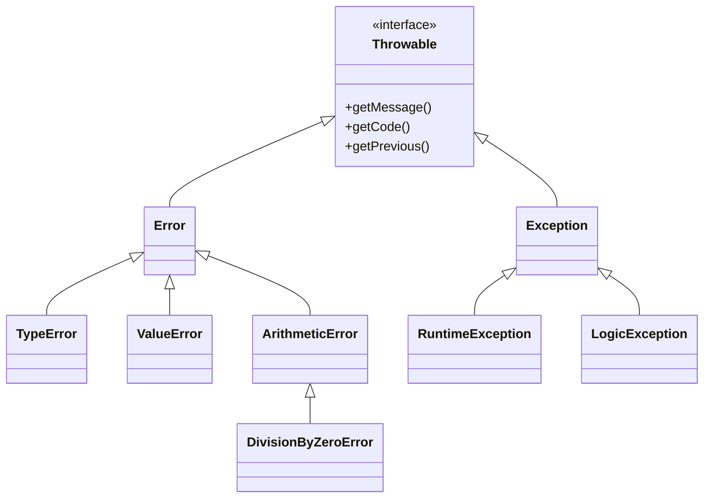

# Exception & Error Handling

!!! tip "In a nutshell"
    Depuis PHP 7, `Error` et `Exception` implémentent tous deux `Throwable`. Le
    fait le plus rentable à retenir : `catch (\Exception)` laisse passer les fautes
    du moteur comme `TypeError` — attrapez `\Throwable` pour couvrir les deux, et
    souvenez-vous que `finally` s'exécute toujours.

!!! example "Real-world analogy"
    Imaginez les systèmes de sécurité d'un immeuble. Une `Exception` est une alarme
    incendie que vous déclenchez volontairement pour une situation récupérable —
    on évacue, on gère, on reprend — tandis qu'une `Error` est la structure elle-même
    qui cède, comme une poutre porteuse qui se fissure (une faute au niveau du moteur).
    Un filet qui n'attrape que les alarmes déclenchées (`catch (\Exception)`) rate la
    poutre qui s'effondre ; il vous faut le filet plus large `\Throwable` pour attraper
    les deux. Et `finally` est le gardien qui ferme les portes à la fin, quoi qu'il
    soit arrivé.

!!! abstract "Learning objectives"
    À la fin de ce chapitre, vous saurez :

    - [ ] Naviguer dans la hiérarchie `Throwable` (`Error` vs `Exception`).
    - [ ] Utiliser `try`/`catch`/`finally`, le multi-catch et le chaînage d'exceptions.
    - [ ] Configurer les niveaux d'erreur et enregistrer `set_error_handler`/`set_exception_handler`.

    **Syllabus:** `PHP → Exception & error handling` ·
    **Level:** Advanced / Expert ·
    **Est. time:** 30 min ·
    **Prerequisites:** [OOP](oop.md)

---

## Theory

Depuis PHP 7, les **exceptions** et les **erreurs** internes implémentent toutes
deux l'interface `Throwable`. Les deux branches sont `Exception` (problèmes
applicatifs récupérables que vous lancez et attrapez) et `Error` (fautes au
niveau du moteur comme `TypeError`, `ParseError`, `DivisionByZeroError`). Les
**niveaux d'erreur** historiques (`E_WARNING`, `E_NOTICE`, `E_DEPRECATED`…)
constituent un mécanisme distinct, plus ancien.

```php
try {
    intdiv(1, 0);                        // engine fault → DivisionByZeroError
} catch (\Error $e) {                    // TypeError, ParseError… extend Error
}

try {
    throw new \RuntimeException('oops'); // application-level Exception branch
} catch (\Exception $e) {
}

$e instanceof \Throwable;                // true — both branches implement it

error_reporting(E_ALL & ~E_DEPRECATED);  // legacy error levels: separate world
```



!!! question "Predict first"
    Un bloc `catch (\Exception $e)` entoure `intdiv(1, 0)`. Attrape-t-il la faute ?

??? note "Reveal"
    Non. `intdiv(1, 0)` lance une `DivisionByZeroError`, qui étend `Error`, pas
    `Exception`. Seul `catch (\Throwable)` (ou `\DivisionByZeroError`) l'attrape.

## Deep Dive — how it works internally

### `Error` vs `Exception`

- `Error` et ses enfants (`TypeError`, `ValueError`, `ArgumentCountError`,
  `ArithmeticError`, `AssertionError`, `ParseError`) signalent des fautes du
  **programmeur/moteur**. En général, vous ne les attrapez **pas** dans le flux
  normal.
- `Exception` et ses enfants (`RuntimeException`, `LogicException`,
  `InvalidArgumentException`, `JsonException`…) signalent des conditions
  **applicatives**.

Pour tout attraper, typez `\Throwable`. Attraper `\Exception` n'attrapera **pas**
une `Error`.

```php
try {
    strlen([]);                 // TypeError — Error branch, engine fault
} catch (\Exception $e) {
    // never reached: \Exception does not catch an Error
} catch (\Throwable $t) {
    // reached: \Throwable catches BOTH branches
}

throw new \InvalidArgumentException('bad'); // Exception branch (LogicException)
```

### try / catch / finally

`finally` s'exécute **toujours** — après un `catch` correspondant, après un throw
non attrapé (avant que la propagation ne continue), et même après un `return`
dans le `try`. Un `return` dans `finally` écrase un `return`/throw du bloc `try`
(un anti-pattern qui avale silencieusement les exceptions).

```php
<?php
declare(strict_types=1);

try {
    $data = json_decode($raw, true, flags: \JSON_THROW_ON_ERROR);
} catch (\JsonException $e) {
    throw new \RuntimeException('Bad payload', previous: $e);   // chaining
} finally {
    fclose($handle);   // always runs — cleanup
}
```

### Multi-catch & chaining

Attrapez plusieurs types sans lien de parenté dans un seul bloc avec `|`.
**Chaînez** les exceptions en passant l'originale comme `previous`, ce qui
préserve la cause racine et sa stack trace via `getPrevious()`.

```php
<?php
declare(strict_types=1);

try {
    // ...
} catch (\TypeError | \ValueError $e) {
    // one handler for both
}
```

Depuis PHP 8.0, vous pouvez omettre la variable dans `catch (\Throwable)` quand
vous n'en avez pas besoin.

### Error levels & handlers

- `error_reporting(E_ALL)` et `display_errors` contrôlent ce qui apparaît.
- `set_error_handler(callable)` convertit les erreurs traditionnelles
  (warnings/notices) vers votre propre traitement — couramment en
  `ErrorException`. Il n'attrape **pas** les fatales de classe `E_ERROR` ni les
  exceptions.
- `set_exception_handler(callable)` gère les exceptions **non attrapées** en
  dernier recours avant la mort du script.
- `register_shutdown_function()` + `error_get_last()` attrapent les erreurs
  fatales.

```php
<?php
declare(strict_types=1);

set_error_handler(static function (int $level, string $msg, string $file, int $line): bool {
    throw new \ErrorException($msg, 0, $level, $file, $line);
});
```

!!! note "Source reference"
    Le `Symfony\Component\ErrorHandler\ErrorHandler` de Symfony transforme les
    erreurs PHP en exceptions et les affiche —
    [symfony/symfony `8.0`](https://github.com/symfony/symfony/blob/8.0/src/Symfony/Component/ErrorHandler/ErrorHandler.php).

## Configuration & code

=== "PHP Attributes"

    ```php
    <?php
    declare(strict_types=1);

    final class InsufficientFundsException extends \DomainException
    {
        public function __construct(
            public readonly int $shortfall,
            ?\Throwable $previous = null,
        ) {
            parent::__construct("Short by {$shortfall}", previous: $previous);
        }
    }
    ```

=== "Console"

    ```console
    $ php -r 'try { intdiv(1,0); } catch (\DivisionByZeroError $e) { echo $e::class; }'
    DivisionByZeroError
    ```

## Best practices & anti-patterns

| ✅ Do | ❌ Avoid |
|---|---|
| Attraper `\Throwable` à la frontière | Attraper `\Exception` et rater `Error` |
| Chaîner avec `previous:` | Perdre la cause racine |
| Classes d'exception métier dédiées | Lancer une `\Exception` brute |
| `finally` pour le nettoyage | `return` dans `finally` |

## When (not) to use it / alternatives

- Lancez des exceptions pour des conditions **exceptionnelles**, pas pour le
  flux de contrôle ordinaire.
- Utilisez les sous-classes de `LogicException` pour les bugs (erreurs de
  programmeur) et celles de `RuntimeException` pour les conditions d'exécution.
- N'attrapez pas les types `Error` pour « continuer quand même » — corrigez
  plutôt la cause racine.

!!! danger "Certification traps"
    - `catch (\Exception)` n'attrape **pas** `\Error` (par ex. `TypeError`) ;
      utilisez `\Throwable` pour attraper les deux.
    - `finally` s'exécute **toujours** ; un `return` à cet endroit écrase le
      return du `try`.
    - `set_error_handler` ne gère **pas** les exceptions ni les fatales `E_ERROR`.
    - Sous `declare(strict_types=1)`, un argument scalaire du mauvais type lance
      une `TypeError` (une `Error`), pas une `Exception`.
    - `DivisionByZeroError` est une `Error`, pas une `Exception`.

!!! warning "Common mistakes"
    - Avaler les exceptions avec un `catch` vide.
    - Croire que la suppression `@` arrête une exception lancée (elle ne fait
      taire que les erreurs).

## Exercises

1. **(Advanced)** Écrivez un handler qui convertit les warnings en
   `ErrorException`.
2. **(Expert)** Montrez pourquoi `catch (\Exception $e)` n'attrape pas
   `intdiv(1, 0)` et corrigez-le.

??? success "Solutions"

    **1.** Voir l'exemple `set_error_handler` ci-dessus — lancer une
    `ErrorException` vous permet de traiter uniformément les anciens warnings
    avec `try/catch`.

    **2.** `intdiv(1, 0)` lance une `DivisionByZeroError`, qui étend `Error`, pas
    `Exception`. Attrapez `\DivisionByZeroError` ou `\Throwable` :
    ```php
    <?php
    try { intdiv(1, 0); }
    catch (\Throwable $e) { /* caught */ }
    ```

## Certification questions

??? question "Q1. Which catches BOTH a `TypeError` and a `RuntimeException`?"
    - [ ] A. `catch (\Exception $e)`
    - [x] B. `catch (\Throwable $e)` ✅
    - [ ] C. `catch (\Error $e)`
    - [ ] D. `catch (\LogicException $e)`

    **Why:** Seul `\Throwable` est l'ancêtre commun d'`Error` et d'`Exception`.
    **Ref:** [Throwable](https://www.php.net/manual/en/class.throwable.php).

??? question "Q2. A `return` statement inside `finally`…"
    - [x] A. Overrides any return/throw from the `try` block ✅
    - [ ] B. Is a syntax error
    - [ ] C. Is ignored
    - [ ] D. Runs before `try`

    **Why:** `finally` s'exécute en dernier et son `return` l'emporte — d'où le
    fait qu'il soit déconseillé.
    **Ref:** [try/finally](https://www.php.net/manual/en/language.exceptions.php).

??? question "Q3. `set_error_handler()` can handle…"
    - [x] A. Warnings/notices/deprecations (most non-fatal errors) ✅
    - [ ] B. Uncaught exceptions
    - [ ] C. Fatal `E_ERROR`
    - [ ] D. Parse errors

    **Why:** Il intercepte les erreurs traditionnelles, pas les exceptions ni
    les fatales ; utilisez `set_exception_handler` / les fonctions de shutdown
    pour celles-ci.
    **Ref:** [set_error_handler](https://www.php.net/manual/en/function.set-error-handler.php).

??? question "Q4. Under `strict_types=1`, passing a string to an `int` parameter throws…"
    - [x] A. `TypeError` (an `Error`) ✅
    - [ ] B. `InvalidArgumentException`
    - [ ] C. A warning
    - [ ] D. `ValueError`

    **Why:** Le typage strict rejette le mauvais type scalaire avec une
    `TypeError`.
    **Ref:** [Type declarations](https://www.php.net/manual/en/language.types.declarations.php).

## Key takeaways

- `Throwable` = `Error` ∪ `Exception` ; attrapez `\Throwable` pour couvrir les deux.
- `finally` s'exécute toujours ; évitez d'y placer un `return`.
- Chaînez avec `previous:` pour conserver la cause racine.
- `set_error_handler` ≠ exceptions ≠ fatales — des mécanismes différents.

## Last-minute revision

!!! tip "Cheat sheet"
    - `Error` : `TypeError`, `ValueError`, `DivisionByZeroError`, `ParseError`.
    - `Exception` : `RuntimeException`, `LogicException`, `JsonException`.
    - Multi-catch : `catch (A | B $e)` ; variable optionnelle (8.0+).
    - `set_error_handler` → warnings ; `set_exception_handler` → throws non attrapés.

## Connections

- **Dépend de :** [OOP](oop.md) — la hiérarchie `Throwable` n'est qu'un héritage ordinaire plus une interface.
- **Réutilisé dans :** [Web Security](web-security.md) — une gestion d'erreurs maîtrisée évite de divulguer les détails internes ; l'étape [Security](../security/index.md) affiche les échecs de façon sûre.
- **À ne pas confondre avec :** [Interfaces](interfaces.md) — `Throwable` est une interface, donc `Error` et `Exception` sont deux branches qui l'implémentent.

## Official References
- [PHP: Exceptions](https://www.php.net/manual/en/language.exceptions.php)
- [PHP: Predefined Exceptions](https://www.php.net/manual/en/reserved.exceptions.php)
- [PHP: Errors in PHP 7+](https://www.php.net/manual/en/language.errors.php7.php)
- [Symfony source — ErrorHandler](https://github.com/symfony/symfony/blob/8.0/src/Symfony/Component/ErrorHandler/ErrorHandler.php)

## Video references

!!! tip "Watch & learn"
    Voici des chaînes vidéo officielles, mises à jour en continu — cherchez-y
    « PHP & web security » pour consolider ce chapitre. Nous référençons des
    chaînes stables plutôt que des vidéos individuelles afin que les références
    ne périment jamais.

    - [SymfonyCasts screencasts](https://symfonycasts.com/tracks/symfony) — tutoriels scénarisés à suivre en codant.
    - [Symfony official YouTube](https://www.youtube.com/@SymfonyOfficial) — conférences et keynotes SymfonyCon.
    - [Official docs for this topic](https://symfony.com/doc/current/index.html) — certaines pages de la doc Symfony intègrent un screencast.

## Confidence check

Je suis prêt quand je peux :

- [ ] expliquer **pourquoi** `Error` et `Exception` sont séparés sous `Throwable`
- [ ] implémenter des exceptions chaînées et `set_error_handler`→`ErrorException` dans Symfony 8
- [ ] déboguer un bug « rien n'est attrapé » dû à un `catch` de `\Exception` au lieu de `\Throwable`
- [ ] repérer le piège : un `return` dans `finally` qui écrase le return du `try`
- [ ] expliquer comment `finally` s'exécute au return, au throw et en fin normale

---

<small>Related: [OOP](oop.md) · [PHP API](php-api.md) · [Web Security](web-security.md)</small>
