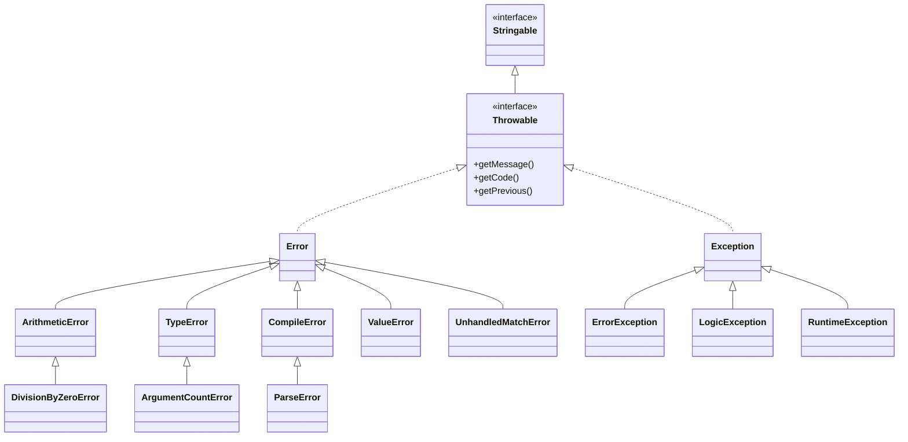
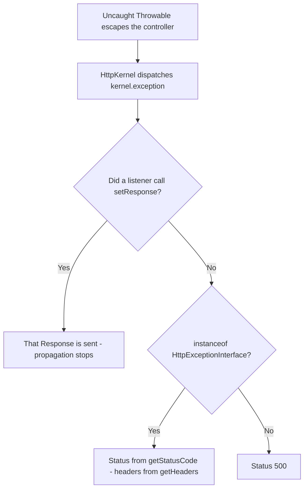
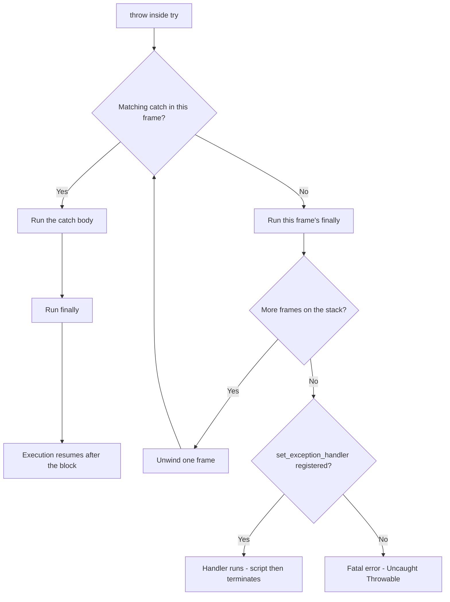

# Exception & Error Handling

!!! tip "In a nutshell"
    `Throwable` is the root, and `Error` and `Exception` are **siblings** under it,
    not parent and child. The highest-yield consequence: `catch (\Exception)` never
    catches a `TypeError` or a `DivisionByZeroError`. `finally` always runs, and a
    `return` inside it **overrides** whatever `try` was about to return or throw.

!!! example "Real-world analogy"
    Think of a building's alert chain. Pulling the fire alarm is an `Exception`:
    a deliberate signal about a situation someone can handle. A load-bearing beam
    cracking is an `Error`: the structure itself failing, nobody signalled it on
    purpose. Both trigger the same siren wiring — that wiring is `Throwable` — but a
    responder briefed only for pulled alarms walks straight past the cracking beam.
    `finally` is the caretaker who locks the doors on the way out whatever happened,
    and `$previous` is the incident report that staples the original cause to the
    escalated one so the investigation still finds the beam.

!!! abstract "Learning objectives"
    By the end of this chapter you can:

    - [ ] Place any built-in throwable in the `Throwable` / `Error` / `Exception` tree and predict which `catch` matches it.
    - [ ] Reason precisely about `try` / `catch` / `finally` ordering, including `finally` overriding a `return` and a `finally` that throws.
    - [ ] Use multi-catch, variable-less `catch`, `throw` as an expression and `$previous` chaining.
    - [ ] Design custom exceptions, and separate `set_error_handler` from `set_exception_handler` from shutdown handling.
    - [ ] Explain how Symfony turns an uncaught throwable into an HTTP status code.

    **Syllabus:** `PHP → Exception & error handling` ·
    **Level:** Advanced / Expert ·
    **Est. time:** 45 min ·
    **Prerequisites:** [OOP](oop.md) · [Interfaces](interfaces.md)

    **Examen Symfony 8 :** OUI

---

## Prerequisites

You need classes, inheritance and visibility from [OOP](oop.md), plus the idea that an
**interface is a contract implemented by unrelated classes** from
[Interfaces](interfaces.md) — because `Throwable` is exactly that, and the fact that
`Error` and `Exception` are two *separate* implementers of one interface is the single
idea the whole chapter rests on.

Everything here targets **PHP 8.4**. Several details in this chapter changed in 8.0 and
8.4, and version-shifted statements are prime distractor material.

## The problem we are solving

A function that cannot do its job has to tell its caller something. Return codes do not
work: `saveUser()` returning `false` says nothing about *why*, forces every caller to
check, and a caller that forgets simply continues with corrupt state.

```php
$user = findUser($id);       // false? null? which failure?
$user->activate();           // and now: "Call to a member function on null"
```

Exceptions invert the responsibility. The failing code **announces** the failure, and the
runtime unwinds the stack until someone is prepared to handle it. Nobody can silently
ignore it: if no one handles it, the program stops instead of corrupting data.

PHP 7 extended that machinery to the engine's own faults — a wrong argument type, a
division by zero, an unmatched `match` — so the same `try` / `catch` mechanism now covers
both worlds. The catch (pun intended) is that it kept them in **two separate class
branches**, and that split is what this chapter is really about.

!!! info "PHP 8.4 reference"
    https://www.php.net/manual/en/language.exceptions.php

## 🧠 Pour les nuls

**C'est quoi ?** Une exception est un **signal d'échec** qu'une portion de code envoie
quand elle ne peut pas finir son travail. Le programme arrête la ligne en cours, remonte
les appels un par un, et cherche quelqu'un capable de traiter le signal. `Throwable` est
l'interface commune à tout ce qui peut être lancé ; `Exception` et `Error` sont ses deux
familles, côte à côte, pas l'une dans l'autre.

**Pourquoi ça existe ?** Parce qu'un code retour `false` ne dit ni ce qui a raté, ni
pourquoi, et qu'un appelant distrait peut l'ignorer. Une exception, elle, ne peut pas être
ignorée : si personne ne la traite, le programme s'arrête au lieu de continuer avec des
données fausses.

**🏠 Analogie de la vraie vie :** Le **circuit d'alerte d'un immeuble**. Quelqu'un tire
l'alarme au 3e étage → le signal monte étage par étage jusqu'au premier agent formé pour
ce type d'alerte. C'est l'exception qui remonte la pile d'appels. Deux natures d'alerte
existent : celle qu'un occupant déclenche volontairement (`Exception`) et celle qui vient
du bâtiment lui-même, une poutre qui craque (`Error`). Le même câblage transporte les deux
— ce câblage, c'est `Throwable`. Le gardien qui ferme les portes en partant, quoi qu'il se
soit passé, c'est `finally`. Et le rapport d'incident qui agrafe la cause d'origine au
dossier transmis, c'est `$previous`.

**Symfony dans la vraie vie :** Alarme tirée → `throw new NotFoundHttpException()` /
Agent formé pour ce type d'alerte → un listener sur `kernel.exception` / Aucun agent
disponible → le kernel produit une réponse 500 / Rapport d'incident agrafé →
`previous: $e` que le profiler affiche en cascade.

**💻 Exemple extrêmement simple :**
```php
try {
    intdiv(1, 0);                 // le moteur lance DivisionByZeroError
} catch (\Exception $e) {
    echo 'jamais atteint';        // DivisionByZeroError n'est pas une Exception
} catch (\Throwable $e) {
    echo 'attrapé';               // Throwable couvre les deux familles
} finally {
    echo ' et nettoyage';         // s'exécute dans tous les cas
}
```
Ligne 4 : ce bloc est ignoré, car `DivisionByZeroError` descend de `Error`. Ligne 6 : ce
bloc gagne, parce que `Throwable` est l'ancêtre commun. Ligne 8 : ce bloc s'exécute même
si un `catch` relance, même si `try` fait un `return`.

**🔍 Que se passe-t-il réellement ?**
1. Le moteur crée un objet `DivisionByZeroError` avec message, fichier et ligne.
2. Il arrête l'exécution de l'instruction en cours.
3. Il compare l'objet au **premier** `catch` du bloc : `Exception` ? non → suivant.
4. Il compare au deuxième : `Throwable` ? oui → ce bloc s'exécute.
5. Le bloc `finally` s'exécute juste après, avant de reprendre le flux normal.
6. Si aucun `catch` n'avait correspondu, l'objet serait remonté d'un cran dans la pile,
   en exécutant au passage chaque `finally` rencontré.
7. Arrivé au sommet sans preneur : le gestionnaire de `set_exception_handler()` s'il
   existe, sinon erreur fatale « Uncaught ... ».

**⚠️ Erreur fréquente :** écrire `catch (\Exception $e)` en croyant tout attraper. Une
`TypeError`, une `DivisionByZeroError` ou une `ArgumentCountError` passent à travers ce
filet, car elles descendent de `Error`. Pour un filet réellement universel, il faut
`catch (\Throwable $e)`.

**🧠 Comment le mémoriser ?** *« `Throwable` est le câble, `Error` et `Exception` sont
deux prises différentes branchées dessus. »* Brancher son écouteur sur une seule prise ne
capte pas l'autre.

## Build the mental model

Two ideas, and every rule in this chapter follows from them.

**One: the hierarchy is a Y, not a line.** `Throwable` is an interface at the top.
`Error` and `Exception` are two independent classes that implement it. Neither extends the
other. So `catch` is nothing more than an `instanceof` test, and `TypeError instanceof
Exception` is `false`.



Read the diagram as a set-membership map: `catch (X)` matches when the thrown object is an
`instanceof X`. `\Throwable` covers the whole tree, `\Error` covers the left arm only, and
`\Exception` the right arm only. Two placements are routinely misremembered:
`ArgumentCountError` is a child of **`TypeError`** (not of `Error` directly), and
`ParseError` is a child of **`CompileError`**. Note also that `Throwable` itself extends
`Stringable`, as of PHP 8.0.0 — which is why every throwable has a usable `__toString()`.

**Two: a throw is a controlled unwind, not a jump.** The engine walks up the call stack
frame by frame looking for the first matching `catch`. Along the way it executes **every**
`finally` it passes through. That is why `finally` is the right place for cleanup and the
wrong place for a `return`.

!!! info "PHP 8.4 reference"
    https://www.php.net/manual/en/language.errors.php7.php

## Core concepts

**Throwing.** The thrown object must be an `instanceof Throwable`; throwing anything else
is a PHP Fatal Error. Since **PHP 8.0.0**, `throw` is an *expression*, so it can sit
anywhere an expression can — inside `??`, `?:`, an arrow function or a `match` arm.

**Catching.** A `catch` block names one or more types and optionally a variable. The
**first** matching block wins; later blocks are simply not consulted. Since **PHP 7.1.0**
a single block can list several types with `|`; since **PHP 8.0.0** the variable is
optional.

**`finally`.** Runs after `try` and after any `catch`, on every exit path. Each `try` must
have at least one `catch` **or** a `finally` — `try` alone is a syntax error.

**Chaining.** Every throwable constructor accepts a third argument, `?Throwable $previous`.
Passing the caught exception preserves the root cause, retrievable with `getPrevious()`.

```php
<?php
declare(strict_types=1);

function loadConfig(string $raw): array
{
    try {
        return json_decode($raw, true, flags: \JSON_THROW_ON_ERROR);
    } catch (\JsonException $e) {
        // Translate a low-level failure into a domain-level one, keeping the cause.
        throw new \RuntimeException('Configuration is not valid JSON', previous: $e);
    }
}
```

The caller now sees a meaningful `RuntimeException`, and a debugger following
`getPrevious()` still reaches the original `JsonException` with its own message, file and
line. Discarding `$e` here would erase the only evidence of what actually broke.

!!! info "PHP 8.4 reference"
    https://www.php.net/manual/en/language.exceptions.php

## Learn by doing

One realistic scenario, changed one step at a time: a small importer that reads a payload
and stores an amount.

**Step 1 — the failure nobody expected.** The importer trusts its input.

```php
<?php
declare(strict_types=1);

function importAmount(string $payload): int
{
    $data = json_decode($payload, true, flags: \JSON_THROW_ON_ERROR);

    return intdiv($data['total'], $data['count']);
}
```

Two very different failures live in this function. A malformed payload throws a
`JsonException` — the `Exception` branch. A payload with `"count": 0` throws a
`DivisionByZeroError` — the `Error` branch.

**Step 2 — the net that looks right and is not.**

```php
try {
    importAmount($payload);
} catch (\Exception $e) {
    // catches the JsonException…
}
```

Feed it `{"total": 10, "count": 0}` and the process dies with:

```
PHP Fatal error: Uncaught DivisionByZeroError: Division by zero
```

The `catch` never matched, because `DivisionByZeroError` extends `ArithmeticError` extends
`Error`, and `Error` is not an `Exception`. This is the mistake the chapter exists to
prevent.

**Step 3 — widen the net deliberately.** Two options, and they are not equivalent:

```php
catch (\JsonException | \DivisionByZeroError $e)   // precise: handle these two
catch (\Throwable $e)                              // total: handle anything
```

Prefer the precise form inside business code, and keep `\Throwable` for the outermost
boundary — a queue worker loop, a CLI command, a framework kernel — where the job is to
log and keep the process alive rather than to recover.

**Step 4 — add cleanup, and watch the trap appear.**

```php
function importAmount(string $payload): int
{
    $lock = acquireLock();

    try {
        return doImport($payload);
    } finally {
        releaseLock($lock);          // runs on return AND on throw
    }
}
```

There is no `catch` here at all, and that is deliberate: the exception still propagates to
the caller, but the lock is released on its way out. `try` + `finally` with no `catch` is
legal and is the canonical cleanup shape.

**Step 5 — the one line that breaks it.** Change `releaseLock($lock);` to
`return releaseLock($lock);` and the function stops throwing entirely: it returns the
cleanup value and the exception vanishes. The manual states this precisely — the `try`
block's `return` is *evaluated* when reached, but the value is returned only after
`finally` runs, and if `finally` itself returns, **that** value wins.

**Step 6 — put the meaning back in.** Wrap, do not swallow:

```php
try {
    return doImport($payload);
} catch (\Throwable $e) {
    throw new ImportFailed('Import aborted', previous: $e);
} finally {
    releaseLock($lock);
}
```

The caller now gets one domain-level type it can reason about, the original cause is still
attached, and the lock is released in every case.

!!! info "PHP 8.4 reference"
    https://www.php.net/manual/en/language.exceptions.php#language.exceptions.finally

## How Symfony handles it

In a Symfony application every failure is an exception, including a 404. When a throwable
escapes a controller, `HttpKernel` catches it and dispatches the **`kernel.exception`**
event carrying an `ExceptionEvent`. A listener may call `setResponse()` — which stops
propagation immediately — or `setThrowable()` to replace the exception.

If no listener produces a response, the status code is decided by one interface:

```php
interface HttpExceptionInterface extends \Throwable
{
    public function getStatusCode(): int;
    public function getHeaders(): array;
}
```

Note what that declaration is: an **interface extending `Throwable`**. A class may not
implement `Throwable` directly, but an interface may extend it — which is exactly how
Symfony attaches HTTP semantics to an exception without dictating its base class.



`HttpException` is the concrete base: `class HttpException extends \RuntimeException
implements HttpExceptionInterface`. Its subclasses are what you throw in practice —
`NotFoundHttpException` (404), `AccessDeniedHttpException` (403),
`BadRequestHttpException` (400) and the rest — and `HttpException::fromStatusCode()`
selects the right one for a given code.

An exception you own does **not** have to extend anything Symfony provides. The
`#[WithHttpStatus]` attribute maps a plain exception class — or an interface it
implements — to a status code and headers:

```php
<?php
declare(strict_types=1);

namespace App\Exception;

use Symfony\Component\HttpKernel\Attribute\WithHttpStatus;

#[WithHttpStatus(422, ['Retry-After' => 10])]
final class InvalidImportPayload extends \DomainException
{
}
```

`ErrorListener` applies it only when the throwable is not already an
`HttpExceptionInterface`, wrapping it in an `HttpException` whose `previous` is your
original exception — so nothing is lost.

!!! info "Official Symfony 8.0 reference"
    https://symfony.com/doc/8.0/reference/events.html#kernel-exception

!!! note "Symfony 8.0 source reference"
    https://github.com/symfony/symfony/blob/8.0/src/Symfony/Component/HttpKernel/Exception/HttpExceptionInterface.php

!!! note "Symfony 8.0 source reference"
    https://github.com/symfony/symfony/blob/8.0/src/Symfony/Component/HttpKernel/EventListener/ErrorListener.php

## How it works internally

A `throw` does three things: it instantiates the throwable (capturing file, line and a
backtrace at construction time, not at throw time), aborts the current statement, and
starts unwinding.

Unwinding is a loop over stack frames. In each frame the engine tests the thrown object
against each `catch` clause **in written order** and takes the first `instanceof` match.
No match means the frame's `finally` runs and the engine moves one frame up.



Three consequences fall out of that loop, and all three are examinable:

- **Catch order is significant.** `catch (\Throwable)` written before `catch
  (\LogicException)` makes the second block dead code. PHP raises no error for this; you
  simply never reach it. Order specific types first.
- **`finally` runs during unwinding, not only on success.** Nested `finally` blocks fire
  from the innermost outwards as the stack unwinds past them.
- **The engine's own faults enter the same loop.** A `TypeError` raised by the engine
  unwinds identically to an exception you threw yourself. The only difference is which arm
  of the tree it sits on.

Two hard rules the engine enforces at class-declaration time:

- A **class cannot implement `Throwable` directly**. `class Bad implements \Throwable`
  fails with `Class Bad cannot implement interface Throwable, extend Exception or Error
  instead`. Extend `Exception` (or `Error`) instead. Interfaces, by contrast, *may*
  extend `Throwable`.
- **Throwables cannot be cloned.** `Exception::__clone()` is `final private`, so
  `clone $e` fails at runtime.

!!! info "PHP 8.4 reference"
    https://www.php.net/manual/en/class.throwable.php

## All supported cases and variations

### The `Error` branch, in full

The manual lists the `Error` hierarchy explicitly, and this is the list to memorise:

| Class | Parent | Typical trigger |
|---|---|---|
| `ArithmeticError` | `Error` | `intdiv(\PHP_INT_MIN, -1)`, a negative bit shift |
| `DivisionByZeroError` | `ArithmeticError` | `1/0`, `1%0`, `intdiv(1, 0)` |
| `AssertionError` | `Error` | a failed `assert()` |
| `CompileError` | `Error` | compile-time problems raised as throwables |
| `ParseError` | `CompileError` | malformed code in `eval()` |
| `TypeError` | `Error` | wrong argument/return type |
| `ArgumentCountError` | `TypeError` | too few arguments to a function |
| `ValueError` | `Error` | correct type, impossible value |
| `UnhandledMatchError` | `Error` | a `match` with no matching arm and no `default` |
| `FiberError` | `Error` | invalid fiber operation |

`TypeError` versus `ValueError` is the distinction people lose: the *type* is wrong versus
the *value* is wrong. `array_chunk($a, 0)` is a `ValueError` — the argument is a perfectly
good `int`, but zero is not a possible chunk size.

!!! info "PHP 8.4 reference"
    https://www.php.net/manual/en/language.errors.php7.php

### The SPL `Exception` branch, in full

SPL defines exactly eleven standard exception classes in two families:

| Family | Members |
|---|---|
| `LogicException` (a bug in the code) | `BadFunctionCallException` → `BadMethodCallException`, `DomainException`, `InvalidArgumentException`, `LengthException`, `OutOfRangeException` |
| `RuntimeException` (a condition at run time) | `OutOfBoundsException`, `OverflowException`, `RangeException`, `UnderflowException`, `UnexpectedValueException` |

The trap is the near-identical pair: **`OutOfRangeException` is a `LogicException`**
(an index the programmer should have known was invalid, detectable at compile time),
while **`OutOfBoundsException` is a `RuntimeException`** (a key that turned out not to
exist at run time).

!!! info "PHP 8.4 reference"
    https://www.php.net/manual/en/spl.exceptions.php

### `catch` syntax variations

```php
try { risky(); }
catch (\JsonException $e) { /* one type, with a variable */ }
catch (\TypeError | \ValueError $e) { /* multi-catch, since 7.1.0 */ }
catch (\RuntimeException) { /* no variable, since 8.0.0 */ }
finally { /* always */ }
```

`throw` as an expression (since 8.0.0) unlocks three idioms worth recognising on sight:

```php
$config = $options['dsn'] ?? throw new \InvalidArgumentException('dsn is required');
$name    = $user->name ?: throw new \LogicException('anonymous user');
$status  = match ($code) {
    200, 201 => 'ok',
    default  => throw new \UnexpectedValueException("unknown code $code"),
};
```

### Custom exception design

```php
<?php
declare(strict_types=1);

final class InsufficientFunds extends \DomainException
{
    public function __construct(
        public readonly int $shortfallCents,
        ?\Throwable $previous = null,
    ) {
        parent::__construct("Short by {$shortfallCents} cents", 0, $previous);
    }
}
```

Three deliberate choices. It extends `\DomainException` (a `LogicException`) because an
overdraft is a rule violation, not an infrastructure failure. It calls
`parent::__construct()`, which the manual explicitly recommends so message, code and
previous are populated. And it carries **structured data** (`$shortfallCents`) so a
handler can act on the number instead of parsing the message string.

!!! info "PHP 8.4 reference"
    https://www.php.net/manual/en/language.exceptions.php#language.exceptions.extending

### Errors versus exceptions: the legacy mechanism

Traditional PHP diagnostics (`E_WARNING`, `E_NOTICE`, `E_DEPRECATED`, …) are a **separate,
older system** that predates throwables and is still used by most internal functions.
Three distinct hooks cover three distinct populations:

| Hook | Handles | Does **not** handle |
|---|---|---|
| `set_error_handler()` | Traditional diagnostics: warnings, notices, deprecations, `trigger_error()` | Exceptions, and `E_ERROR`, `E_PARSE`, `E_CORE_ERROR`, `E_CORE_WARNING`, `E_COMPILE_ERROR`, `E_COMPILE_WARNING` |
| `set_exception_handler()` | **Uncaught** throwables, as a last resort before termination | Anything already caught, and traditional diagnostics |
| `register_shutdown_function()` + `error_get_last()` | Post-mortem inspection of a fatal error | Nothing can resume execution at this point |

The signature is
`set_error_handler(?callable $callback, int $error_levels = E_ALL): ?callable`. It returns
the **previous** handler, and handlers form a stack that `restore_error_handler()` pops.
Two behaviours surprise people:

- `error_reporting()` has **no effect** on whether your handler is called. The handler
  runs regardless; only the `$error_levels` mask filters it.
- Returning `false` from the handler lets the standard PHP handler run afterwards.
  Returning `true` (or nothing) suppresses it.

The classic bridge between the two worlds converts diagnostics into throwables:

```php
<?php
declare(strict_types=1);

set_error_handler(static function (int $level, string $message, string $file, int $line): bool {
    throw new \ErrorException($message, 0, $level, $file, $line);
});
```

`ErrorException` extends `Exception` and adds `getSeverity()`, which returns the original
`E_*` level — the only place the legacy level survives inside the throwable world.

!!! info "PHP 8.4 reference"
    https://www.php.net/manual/en/function.set-error-handler.php

### The `@` operator

`@` suppresses the **display** of diagnostics produced by an expression. It has no effect
on thrown exceptions, and a registered `set_error_handler()` callback **is still called**
for suppressed diagnostics. Since PHP 8.0.0 it can no longer silence the critical errors
that terminate the script.

!!! info "PHP 8.4 reference"
    https://www.php.net/manual/en/language.operators.errorcontrol.php

## Configuration & code

=== "PHP Attributes"

    ```php
    <?php
    declare(strict_types=1);

    namespace App\Exception;

    use Psr\Log\LogLevel;
    use Symfony\Component\HttpKernel\Attribute\WithHttpStatus;
    use Symfony\Component\HttpKernel\Attribute\WithLogLevel;

    #[WithHttpStatus(422, ['X-Error-Source' => 'import'])]
    #[WithLogLevel(LogLevel::WARNING)]
    final class InvalidImportPayload extends \DomainException
    {
    }
    ```

=== "YAML"

    ```yaml
    # config/packages/exceptions.yaml
    framework:
        exceptions:
            # Order matters: the FIRST class matching `instanceof` wins.
            App\Exception\InvalidImportPayload:
                log_level: 'warning'
                status_code: 422
            Symfony\Component\HttpKernel\Exception\BadRequestHttpException:
                log_level: 'debug'
                status_code: 400
    ```

=== "Console"

    ```console
    $ php -r 'try { intdiv(1,0); } catch (\DivisionByZeroError $e) { echo $e::class; }'
    DivisionByZeroError

    $ php bin/console debug:event-dispatcher kernel.exception
    ```

Listing `Exception` before `RuntimeException` in that YAML would make the
`RuntimeException` entry dead: `RuntimeException` *is* an `Exception`, so the first entry
matches first and the loop breaks.

!!! info "Official Symfony 8.0 reference"
    https://symfony.com/doc/8.0/reference/configuration/framework.html#exceptions

## Execution flow

1. `throw <expr>` evaluates the expression, which must yield a `Throwable`.
2. The object records message, code, file, line and backtrace.
3. The current statement is abandoned.
4. Each `catch` of the enclosing `try`, in written order, is tested with `instanceof`.
5. On the first match, that block runs; other `catch` blocks are skipped.
6. `finally` for that `try` runs — after the `catch`, or instead of it if none matched.
7. With no match, the engine unwinds one frame and repeats from step 4.
8. At global scope with no match: `set_exception_handler()`'s callback runs if registered.
9. Otherwise PHP emits a fatal `Uncaught <Class>: <message>` and terminates.
10. Registered shutdown functions run last, and `error_get_last()` describes the fatal.

## Default behavior

- `Throwable` is the only type that may be thrown; anything else is a fatal error.
- `Exception::__construct(string $message = '', int $code = 0, ?Throwable $previous = null)`
  — all three parameters are optional.
- `getCode()` returns `int` for `Exception` and `Error`, but a subclass may return another
  type: `PDOException::getCode()` returns a `string` SQLSTATE.
- `getPrevious()` returns `null` when no cause was chained.
- `getMessage()`, `getCode()`, `getFile()`, `getLine()`, `getTrace()`, `getPrevious()` and
  `getTraceAsString()` are **`final`** on `Exception`; only `__toString()` is overridable.
- `set_error_handler()` defaults its `$error_levels` mask to `E_ALL`.
- An unhandled `E_WARNING` does not stop execution; execution resumes at the next
  statement.
- In PHP 8.4 `E_ALL` has the value **30719** (it was 32767 before), because `E_STRICT` is
  unused and deprecated as of 8.4.0.

## Edge cases

- **`finally` that throws wins.** If `try` and `finally` both throw, the `finally`
  exception propagates and the `try` exception becomes its `previous`. The manual's own
  example produces the chain `First → Second → Third → Fourth`.
- **`return` in `finally` overrides everything**, including a pending exception, silently
  turning a failure into a normal return.
- **`intdiv(\PHP_INT_MIN, -1)` throws `ArithmeticError`, not `DivisionByZeroError`** —
  the result is not representable as an `int`. `catch (\DivisionByZeroError)` misses it.
- **`try` without `catch` or `finally` is a syntax error.** One of the two is mandatory.
- **A `catch` block may itself throw**, and the enclosing `finally` still runs before the
  new exception propagates.
- **`ParseError` cannot be caught for the file that contains it** — the file never
  compiles. It is catchable only around `eval()` or a dynamically included file.
- **Constructor-time backtrace.** `getTrace()` reflects where the object was *created*, so
  building an exception early and throwing it later yields a misleading trace.
- **`error_reporting(0)` does not disable a custom error handler.** Only the
  `$error_levels` mask passed to `set_error_handler()` does.

## Common confusions

| These look alike | The distinction |
|---|---|
| `Error` vs `Exception` | Siblings under `Throwable`, not parent and child. Neither `catch` matches the other's branch. |
| `TypeError` vs `ValueError` | Wrong *type* vs correct type with an impossible *value*. |
| `OutOfRangeException` vs `OutOfBoundsException` | `LogicException` (bug) vs `RuntimeException` (run-time condition). |
| `set_error_handler` vs `set_exception_handler` | Legacy diagnostics vs uncaught throwables. Two mechanisms, no overlap. |
| `ErrorException` vs `Error` | `ErrorException` extends **`Exception`** and wraps a legacy diagnostic. `Error` is the engine-fault branch. |
| `throw` statement vs expression | Since 8.0.0 `throw` is an expression, usable in `??`, `?:`, `match` and arrow functions. |
| `@` vs `try`/`catch` | `@` mutes diagnostics only. It never stops an exception. |
| `finally` vs a `catch` block | `finally` never handles; it only guarantees execution. |

## Best practices & anti-patterns

| ✅ Do | ❌ Avoid |
|---|---|
| `catch (\Throwable)` at the process boundary | `catch (\Exception)` where engine errors are possible |
| Catch the narrowest type that you can actually handle | A blanket `catch (\Throwable)` inside business logic |
| Chain with `previous:` when rethrowing | Discarding the caught exception |
| `finally` for releasing locks, handles, transactions | `return` inside `finally` |
| Domain-specific exception classes carrying data | `throw new \Exception('error')` |
| Order `catch` blocks from specific to general | `catch (\Throwable)` first, making later blocks dead |
| Let `Error` types crash and fix the bug | Catching `TypeError` to "keep going" |

## Certification traps

!!! danger "Certification traps"
    - `catch (\Exception)` does **not** catch `TypeError`, `ValueError`,
      `DivisionByZeroError` or any other `Error`. Only `\Throwable` covers both branches.
    - `finally` **always** runs, and a `return` there overrides a `return` **or a pending
      throw** from `try`.
    - If `try` and `finally` both throw, the **`finally`** exception propagates and the
      `try` one becomes its `previous`.
    - A class **cannot** implement `Throwable` directly — it must extend `Exception` or
      `Error`. An **interface** may extend `Throwable`, which is what
      `HttpExceptionInterface` does.
    - `ArgumentCountError` extends `TypeError`, and `ParseError` extends `CompileError` —
      neither extends `Error` directly.
    - `set_error_handler()` cannot handle `E_ERROR`, `E_PARSE`, `E_CORE_ERROR`,
      `E_CORE_WARNING`, `E_COMPILE_ERROR` or `E_COMPILE_WARNING`, and never sees
      exceptions.
    - `error_reporting()` does **not** gate a registered error handler.
    - `@` still invokes a custom error handler, and since 8.0.0 no longer hides fatals.
    - Multi-catch `A|B` is **7.1.0**; omitting the catch variable is **8.0.0**; `throw` as
      an expression is **8.0.0**.
    - `E_ALL` is **30719** in PHP 8.4; `E_STRICT` is deprecated as of 8.4.0.

## Common mistakes

!!! warning "Common mistakes"
    - Swallowing a failure with an empty `catch` block, leaving no trace in the logs.
    - Writing `catch (\Throwable)` before a specific type and wondering why the specific
      block never runs.
    - Rethrowing without `previous:`, destroying the root cause for the profiler.
    - Using `@` as a general-purpose "make errors go away" tool.
    - Catching `Error` types to keep a request alive instead of fixing the defect.
    - Assuming `set_error_handler()` will catch a fatal error — it cannot.
    - Throwing `\Exception` directly, so every caller must catch far too widely.

## Debugging and troubleshooting

Read the fatal message positionally: `Uncaught <Class>: <message> in <file>:<line>`. The
class tells you **which branch** you were on, which usually tells you why your `catch`
missed.

```
PHP Fatal error: Uncaught TypeError: strlen(): Argument #1 ($string)
must be of type string, array given
```

`TypeError` → `Error` branch → a `catch (\Exception)` upstream was never going to match.

Practical moves, in order:

- Walk the chain: `while ($e = $e->getPrevious())` and print `$e::class`,
  `$e->getMessage()`, `$e->getFile()`, `$e->getLine()`. The **last** link is the real
  cause.
- `$e->getTraceAsString()` for a compact stack; remember it was captured at construction.
- `$e instanceof \Error` answers "engine fault or application condition?" in one test.
- In Symfony, the profiler's Exception panel renders the whole `previous` chain, and
  `php bin/console debug:event-dispatcher kernel.exception` lists the listeners in
  priority order — useful when a listener you did not expect returned a response first.
- If diagnostics vanish, check `set_error_handler()` and its `$error_levels` mask before
  blaming `error_reporting()`; a handler returning `true` also suppresses the standard
  output.

!!! info "Official Symfony 8.0 reference"
    https://symfony.com/doc/8.0/controller/error_pages.html

## Performance and security considerations

Throwing is not free: constructing a throwable captures a backtrace, which costs
proportionally to stack depth. That is a real argument against using exceptions for
ordinary control flow in a hot loop — but never an argument for returning `false` from a
function that genuinely failed. Catching is cheap; the cost is in construction.

The security angle is sharper. An exception message and stack trace expose file paths,
SQL fragments, class names and sometimes credentials. Two rules:

- In production, `display_errors` must be off and diagnostics must go to a log, never to
  the response body. Symfony's production error page deliberately shows a generic message
  for exactly this reason.
- Never echo `$e->getMessage()` into an HTTP response or a template. Log the detail, show
  the user a correlation identifier.

Symfony's `ErrorHandler` component implements this split: it converts PHP diagnostics into
`\ErrorException`, logs uncaught throwables as `E_ERROR`, and renders a detailed page only
in debug mode. See [Exception handling](../architecture/exception-handling.md) and
[Error pages](../controllers/error-pages.md) for the framework-level view.

!!! note "Symfony 8.0 source reference"
    https://github.com/symfony/symfony/blob/8.0/src/Symfony/Component/ErrorHandler/ErrorHandler.php

## Key takeaways

- `Throwable` is an interface; `Error` and `Exception` are **siblings** implementing it, so
  `catch (\Exception)` never catches an `Error`.
- `finally` always runs, including while unwinding; a `return` or a `throw` inside it
  overrides whatever `try` was doing.
- Chain with `previous:` when rethrowing, and read the chain with `getPrevious()`.
- Multi-catch `A|B` since 7.1.0; variable-less `catch` and `throw` as an expression since
  8.0.0.
- `set_error_handler` (legacy diagnostics), `set_exception_handler` (uncaught throwables)
  and shutdown functions (fatals) are three separate mechanisms.
- Symfony maps `HttpExceptionInterface::getStatusCode()` to the response status, and 500
  for anything else.

## Expert takeaways

- Catch matching is nothing more than ordered `instanceof` testing, which explains both
  the sibling split and why an over-broad first `catch` silently disables later ones.
- A class cannot implement `Throwable` because the engine needs internal state on every
  throwable; an *interface* extending `Throwable` is the supported way to add semantics,
  and Symfony's `HttpExceptionInterface` is the canonical example.
- The `finally`-throws rule is the mirror image of manual chaining: the engine itself sets
  the `try` exception as `previous` of the `finally` one, so the cause survives.
- `ErrorException` exists to bridge two eras: it carries an `E_*` severity inside the
  `Exception` branch, which is why `set_error_handler` → `throw new \ErrorException` makes
  legacy diagnostics catchable at all.
- The engine faults you should *not* catch are precisely the ones `\Throwable` at a
  boundary should still log — the goal there is observability and a clean exit, never
  recovery.

## Last-minute revision

!!! tip "Cheat sheet"
    - `Throwable` → `Error` | `Exception`. Siblings. `catch (\Exception)` misses `Error`.
    - `Error` arm: `TypeError` → `ArgumentCountError`, `ValueError`, `ArithmeticError` →
      `DivisionByZeroError`, `CompileError` → `ParseError`, `UnhandledMatchError`,
      `AssertionError`, `FiberError`.
    - `Exception` arm: `ErrorException`, `LogicException` (`Domain`, `InvalidArgument`,
      `Length`, `OutOfRange`, `BadFunctionCall` → `BadMethodCall`), `RuntimeException`
      (`OutOfBounds`, `Overflow`, `Range`, `Underflow`, `UnexpectedValue`).
    - `finally` always runs. `return` in `finally` wins. `throw` in `finally` wins, and
      the `try` exception becomes its `previous`.
    - `A|B` = 7.1.0 · variable-less `catch` = 8.0.0 · `throw` expression = 8.0.0 ·
      `Throwable extends Stringable` = 8.0.0.
    - `set_error_handler` ≠ `set_exception_handler` ≠ `register_shutdown_function`.
    - Cannot `implements \Throwable` on a class. Cannot `clone` a throwable.
    - `E_ALL` = 30719 in 8.4. `intdiv(\PHP_INT_MIN, -1)` = `ArithmeticError`.
    - Symfony: `HttpExceptionInterface::getStatusCode()`, else 500.

## Connections

- **Depends on:** [OOP](oop.md) — the hierarchy is ordinary inheritance, and [Interfaces](interfaces.md) — `Throwable` is the contract both branches implement.
- **Reused in:** [Exception handling](../architecture/exception-handling.md) and [Error pages](../controllers/error-pages.md) — how the kernel turns a throwable into a response.
- **Confused with:** [Web Security](web-security.md) — controlled error output is a security boundary, not just hygiene.

## Continue your learning

1. **[Guided exercises](exceptions-exercises.md)** — break the wrong catch, watch `finally` win, and build a boundary handler.
2. **[Topic exam](exceptions-exam.md)** — every certification question for this topic, answers hidden.
3. **[Flashcards](exceptions-flashcards.md)** — active recall on the hierarchy, ordering rules and version changes.

## Official References

- [PHP: Exceptions](https://www.php.net/manual/en/language.exceptions.php)
- [PHP: Errors in PHP 7](https://www.php.net/manual/en/language.errors.php7.php)
- [PHP: Throwable](https://www.php.net/manual/en/class.throwable.php)
- [PHP: Predefined Exceptions](https://www.php.net/manual/en/reserved.exceptions.php)
- [PHP: SPL Exceptions](https://www.php.net/manual/en/spl.exceptions.php)
- [PHP: set_error_handler](https://www.php.net/manual/en/function.set-error-handler.php)
- [PHP: set_exception_handler](https://www.php.net/manual/en/function.set-exception-handler.php)
- [PHP: Error control operators](https://www.php.net/manual/en/language.operators.errorcontrol.php)
- [Symfony: kernel.exception event](https://symfony.com/doc/8.0/reference/events.html#kernel-exception)
- [Symfony: How to customize error pages](https://symfony.com/doc/8.0/controller/error_pages.html)
- [Symfony: framework.exceptions configuration](https://symfony.com/doc/8.0/reference/configuration/framework.html#exceptions)
- [Symfony source — HttpExceptionInterface](https://github.com/symfony/symfony/blob/8.0/src/Symfony/Component/HttpKernel/Exception/HttpExceptionInterface.php)
- [Symfony source — ErrorListener](https://github.com/symfony/symfony/blob/8.0/src/Symfony/Component/HttpKernel/EventListener/ErrorListener.php)
- [Symfony source — ErrorHandler](https://github.com/symfony/symfony/blob/8.0/src/Symfony/Component/ErrorHandler/ErrorHandler.php)

## Video references

!!! tip "Watch & learn"
    These are official, continuously-updated video channels — search them for
    "PHP exceptions error handling" to reinforce this chapter. We link stable channels
    rather than individual videos so the references never rot.

    - [SymfonyCasts screencasts](https://symfonycasts.com/tracks/symfony) — scripted, code-along tutorials.
    - [Symfony official YouTube](https://www.youtube.com/@SymfonyOfficial) — SymfonyCon conference talks & keynotes.
    - [Official docs for this topic](https://symfony.com/doc/8.0/index.html) — some Symfony doc pages embed a screencast.

## Confidence check

I'm ready when I can:

- [ ] draw the `Throwable` tree from memory, including where `ArgumentCountError` and `ParseError` sit
- [ ] predict the return value of a function whose `try` and `finally` both `return`
- [ ] predict the full `previous` chain when `try` and `finally` both throw
- [ ] state exactly which error levels `set_error_handler()` cannot receive
- [ ] explain why a class cannot implement `Throwable` but `HttpExceptionInterface` can extend it
- [ ] trace an uncaught controller exception to its HTTP status code in Symfony 8.0

---

<small>Related: [OOP](oop.md) · [Interfaces](interfaces.md) · [PHP API](php-api.md) · [Web Security](web-security.md)</small>
