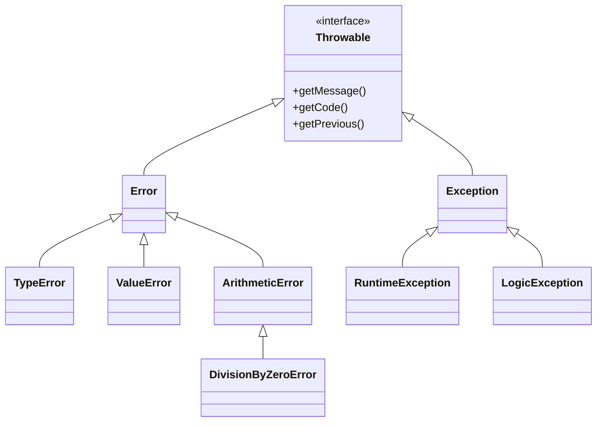

# Exception & Error Handling

!!! tip "In a nutshell"
    Since PHP 7, both `Error` and `Exception` implement `Throwable`. Highest-yield
    fact: `catch (\Exception)` misses engine faults like `TypeError` — catch
    `\Throwable` to get both, and remember `finally` always runs.

!!! example "Real-world analogy"
    Picture a building's safety systems. An `Exception` is a fire alarm you pull on
    purpose for a recoverable situation — evacuate, handle it, carry on — while an
    `Error` is the structure itself failing, like a load-bearing beam cracking
    (an engine-level fault). A net that only catches pulled alarms (`catch (\Exception)`)
    misses the collapsing beam; you need the wider `\Throwable` net to catch both. And
    `finally` is the security guard who locks up at the end no matter what happened.

!!! abstract "Learning objectives"
    By the end of this chapter you can:

    - [ ] Navigate the `Throwable` hierarchy (`Error` vs `Exception`).
    - [ ] Use `try`/`catch`/`finally`, multi-catch, and exception chaining.
    - [ ] Configure error levels and register `set_error_handler`/`set_exception_handler`.

    **Syllabus:** `PHP → Exception & error handling` ·
    **Level:** Advanced / Expert ·
    **Est. time:** 30 min ·
    **Prerequisites:** [OOP](oop.md)

---

## Theory

Since PHP 7, both **exceptions** and internal **errors** implement the
`Throwable` interface. The two branches are `Exception` (recoverable
application-level problems you throw and catch) and `Error` (engine-level faults
like `TypeError`, `ParseError`, `DivisionByZeroError`). Legacy **error levels**
(`E_WARNING`, `E_NOTICE`, `E_DEPRECATED`…) are a separate, older mechanism.



!!! question "Predict first"
    A `catch (\Exception $e)` block wraps `intdiv(1, 0)`. Does it catch the fault?

??? note "Reveal"
    No. `intdiv(1, 0)` throws `DivisionByZeroError`, which extends `Error`, not
    `Exception`. Only `catch (\Throwable)` (or `\DivisionByZeroError`) catches it.

## Deep Dive — how it works internally

### `Error` vs `Exception`

- `Error` and its children (`TypeError`, `ValueError`, `ArgumentCountError`,
  `ArithmeticError`, `AssertionError`, `ParseError`) signal **programmer/engine**
  faults. You generally **do not** catch them in normal flow.
- `Exception` and children (`RuntimeException`, `LogicException`,
  `InvalidArgumentException`, `JsonException`…) signal **application** conditions.

To catch *anything*, type-hint `\Throwable`. Catching `\Exception` will **not**
catch an `Error`.

### try / catch / finally

`finally` **always** runs — after a matching `catch`, after an uncaught throw
(before propagation continues), and even after a `return` inside `try`. A
`return` in `finally` overrides a `return`/throw from the `try` block (an
anti-pattern that silently swallows exceptions).

```php
<?php
declare(strict_types=1);

try {
    $data = json_decode($raw, true, flags: \JSON_THROW_ON_ERROR);
} catch (\JsonException $e) {
    throw new \RuntimeException('Bad payload', previous: $e);   // chaining
} finally {
    fclose($handle);   // always runs — cleanup
}
```

### Multi-catch & chaining

Catch several unrelated types in one block with `|`. **Chain** exceptions by
passing the original as `previous`, preserving the root cause and its stack
trace via `getPrevious()`.

```php
<?php
declare(strict_types=1);

try {
    // ...
} catch (\TypeError | \ValueError $e) {
    // one handler for both
}
```

Since PHP 8.0 you may omit the variable in `catch (\Throwable)` when you don't
need it.

### Error levels & handlers

- `error_reporting(E_ALL)` and `display_errors` control what surfaces.
- `set_error_handler(callable)` converts traditional errors (warnings/notices)
  into your own handling — commonly into `ErrorException`. It does **not** catch
  `E_ERROR`-class fatals or exceptions.
- `set_exception_handler(callable)` handles **uncaught** exceptions as a last
  resort before the script dies.
- `register_shutdown_function()` + `error_get_last()` catches fatal errors.

```php
<?php
declare(strict_types=1);

set_error_handler(static function (int $level, string $msg, string $file, int $line): bool {
    throw new \ErrorException($msg, 0, $level, $file, $line);
});
```

!!! note "Source reference"
    Symfony's `Symfony\Component\ErrorHandler\ErrorHandler` turns PHP errors into
    exceptions and renders them —
    [symfony/symfony `8.0`](https://github.com/symfony/symfony/blob/8.0/src/Symfony/Component/ErrorHandler/ErrorHandler.php).

## Configuration & code

=== "PHP Attributes"

    ```php
    <?php
    declare(strict_types=1);

    final class InsufficientFundsException extends \DomainException
    {
        public function __construct(
            public readonly int $shortfall,
            ?\Throwable $previous = null,
        ) {
            parent::__construct("Short by {$shortfall}", previous: $previous);
        }
    }
    ```

=== "Console"

    ```console
    $ php -r 'try { intdiv(1,0); } catch (\DivisionByZeroError $e) { echo $e::class; }'
    DivisionByZeroError
    ```

## Best practices & anti-patterns

| ✅ Do | ❌ Avoid |
|---|---|
| Catch `\Throwable` at the boundary | Catching `\Exception` and missing `Error` |
| Chain with `previous:` | Losing the root cause |
| Domain-specific exception classes | Throwing bare `\Exception` |
| `finally` for cleanup | `return` inside `finally` |

## When (not) to use it / alternatives

- Throw exceptions for **exceptional** conditions, not ordinary control flow.
- Use `LogicException` subclasses for bugs (programmer errors) and
  `RuntimeException` subclasses for runtime conditions.
- Don't catch `Error` types to "keep going" — fix the root cause instead.

!!! danger "Certification traps"
    - `catch (\Exception)` does **not** catch `\Error` (e.g. `TypeError`); use
      `\Throwable` to catch both.
    - `finally` **always** executes; a `return` there overrides `try`'s return.
    - `set_error_handler` does **not** handle exceptions or fatal `E_ERROR`.
    - Under `declare(strict_types=1)`, a wrong scalar argument throws `TypeError`
      (an `Error`), not an `Exception`.
    - `DivisionByZeroError` is an `Error`, not an `Exception`.

!!! warning "Common mistakes"
    - Swallowing exceptions with an empty `catch`.
    - Assuming `@` suppression stops a thrown exception (it only mutes errors).

## Exercises

1. **(Advanced)** Write a handler that converts warnings into `ErrorException`.
2. **(Expert)** Show why `catch (\Exception $e)` fails to catch `intdiv(1, 0)`
   and fix it.

??? success "Solutions"

    **1.** See the `set_error_handler` example above — throwing `ErrorException`
    lets you `try/catch` former warnings uniformly.

    **2.** `intdiv(1, 0)` throws `DivisionByZeroError`, which extends `Error`, not
    `Exception`. Catch `\DivisionByZeroError` or `\Throwable`:
    ```php
    <?php
    try { intdiv(1, 0); }
    catch (\Throwable $e) { /* caught */ }
    ```

## Certification questions

??? question "Q1. Which catches BOTH a `TypeError` and a `RuntimeException`?"
    - [ ] A. `catch (\Exception $e)`
    - [x] B. `catch (\Throwable $e)` ✅
    - [ ] C. `catch (\Error $e)`
    - [ ] D. `catch (\LogicException $e)`

    **Why:** Only `\Throwable` is the common ancestor of `Error` and `Exception`.
    **Ref:** [Throwable](https://www.php.net/manual/en/class.throwable.php).

??? question "Q2. A `return` statement inside `finally`…"
    - [x] A. Overrides any return/throw from the `try` block ✅
    - [ ] B. Is a syntax error
    - [ ] C. Is ignored
    - [ ] D. Runs before `try`

    **Why:** `finally` runs last and its `return` wins — hence it is discouraged.
    **Ref:** [try/finally](https://www.php.net/manual/en/language.exceptions.php).

??? question "Q3. `set_error_handler()` can handle…"
    - [x] A. Warnings/notices/deprecations (most non-fatal errors) ✅
    - [ ] B. Uncaught exceptions
    - [ ] C. Fatal `E_ERROR`
    - [ ] D. Parse errors

    **Why:** It intercepts traditional errors, not exceptions or fatals; use
    `set_exception_handler` / shutdown functions for those.
    **Ref:** [set_error_handler](https://www.php.net/manual/en/function.set-error-handler.php).

??? question "Q4. Under `strict_types=1`, passing a string to an `int` parameter throws…"
    - [x] A. `TypeError` (an `Error`) ✅
    - [ ] B. `InvalidArgumentException`
    - [ ] C. A warning
    - [ ] D. `ValueError`

    **Why:** Strict typing rejects the wrong scalar type with a `TypeError`.
    **Ref:** [Type declarations](https://www.php.net/manual/en/language.types.declarations.php).

## Key takeaways

- `Throwable` = `Error` ∪ `Exception`; catch `\Throwable` for both.
- `finally` always runs; avoid `return` inside it.
- Chain with `previous:` to keep the root cause.
- `set_error_handler` ≠ exceptions ≠ fatals — different mechanisms.

## Last-minute revision

!!! tip "Cheat sheet"
    - `Error`: `TypeError`, `ValueError`, `DivisionByZeroError`, `ParseError`.
    - `Exception`: `RuntimeException`, `LogicException`, `JsonException`.
    - Multi-catch: `catch (A | B $e)`; variable optional (8.0+).
    - `set_error_handler` → warnings; `set_exception_handler` → uncaught throws.

## Connections

- **Depends on:** [OOP](oop.md) — the `Throwable` hierarchy is ordinary inheritance plus an interface.
- **Reused in:** [Web Security](web-security.md) — controlled error handling avoids leaking internals; the [Security stage](../security/index.md) renders failures safely.
- **Confused with:** [Interfaces](interfaces.md) — `Throwable` is an interface, so `Error` and `Exception` are two branches implementing it.

## Official References
- [PHP: Exceptions](https://www.php.net/manual/en/language.exceptions.php)
- [PHP: Predefined Exceptions](https://www.php.net/manual/en/reserved.exceptions.php)
- [PHP: Errors in PHP 7+](https://www.php.net/manual/en/language.errors.php7.php)
- [Symfony source — ErrorHandler](https://github.com/symfony/symfony/blob/8.0/src/Symfony/Component/ErrorHandler/ErrorHandler.php)

## Confidence check

I'm ready when I can:

- [ ] explain **why** `Error` and `Exception` are split under `Throwable`
- [ ] implement chained exceptions and `set_error_handler`→`ErrorException` in Symfony 8
- [ ] debug a "caught nothing" bug from catching `\Exception` instead of `\Throwable`
- [ ] spot the trick: a `return` in `finally` overriding `try`'s return
- [ ] explain how `finally` runs on return, throw and normal completion

---

<small>Related: [OOP](oop.md) · [PHP API](php-api.md) · [Web Security](web-security.md)</small>
