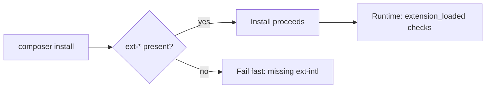

# PHP Extensions

!!! tip "In a nutshell"
    L'essentiel des capacités de PHP réside dans des **extensions** compilées ;
    Symfony déclare celles dont il a besoin comme exigences Composer `ext-*`.
    Retenez que `strlen()` compte des **octets** tandis que `mb_strlen()` compte
    des **caractères** — le piège classique de la longueur UTF-8.

!!! example "Real-world analogy"
    Une installation PHP nue est comme un atelier avec un simple établi : capable de
    peu par elle-même. Les travaux spécialisés exigent des outils électriques branchés
    — une perceuse, une scie — et ces outils sont les extensions compilées. La fiche
    technique d'un projet (les exigences `ext-*` du `composer.json`) liste les outils
    qui doivent être présents avant de commencer, de sorte que si la perceuse manque,
    on vous le dit d'emblée plutôt que de le découvrir en plein chantier.

!!! abstract "Learning objectives"
    À la fin de ce chapitre, vous saurez :

    - [ ] Nommer les extensions PHP dont Symfony dépend et ce que chacune apporte.
    - [ ] Détecter une extension chargée à l'exécution et l'exiger dans `composer.json`.
    - [ ] Expliquer pourquoi `mbstring`, `intl` et `opcache` comptent pour la justesse et la performance.

    **Syllabus:** `PHP → PHP extensions` ·
    **Level:** Advanced ·
    **Est. time:** 20 min ·
    **Prerequisites:** [Namespaces](namespaces.md)

---

## Pour les nuls

### L'idée en une phrase
PHP tout nu ne sait presque rien faire ; les extensions sont les outils qu'on branche dessus pour lui donner des capacités précises.

### Imagine dans la vraie vie
Un atelier livré avec juste un établi ne permet pas grand-chose : pour percer, il faut une perceuse ; pour scier, une scie. Ces outils, ce sont les extensions. La fiche de commande du chantier (`composer.json` et ses `ext-*`) liste les outils obligatoires avant même de démarrer — pour ne pas découvrir en plein travail que la perceuse manque.

### Dans Symfony
Symfony déclare explicitement dans `composer.json` les extensions dont il a besoin (`ext-mbstring`, `ext-intl`...) : Composer refuse l'installation si l'une d'elles manque, plutôt que de laisser planter l'application plus tard au runtime.

### Exemple simple
```php
if (!extension_loaded('intl')) {
    throw new \RuntimeException('L\'extension intl est requise.');
}
```

### Comment le mémoriser 🧠
`strlen()` compte des **octets** (aveugle aux accents), `mb_strlen()` compte des **caractères** (avec un accent = un caractère). "mb" = **m**ulti-**b**yte-conscient, l'ordinaire ne l'est pas.


## Theory

Le cœur de PHP est petit ; la plupart des capacités réelles vivent dans des
**extensions** — des modules compilés qui ajoutent des fonctions et des classes.
Symfony 8 déclare celles dont il a besoin comme **platform requirements**
Composer (`ext-*`), et le framework se dégrade ou échoue clairement quand l'une
d'elles manque.

| Extension | Provides | Symfony use |
|---|---|---|
| `mbstring` | Opérations sur chaînes multi-octets | Longueur/casse sûres en UTF-8, composant String |
| `intl` | ICU : locales, collation | Traduction, `IntlDateFormatter`, slugger |
| `ctype` | Tests de classes de caractères | Validation rapide (`ctype_digit`, …) |
| `iconv` | Conversion de jeux de caractères | Conversion d'encodage, noms de fichiers |
| `pdo` (+`pdo_*`) | Abstraction de base de données | Handler de sessions PDO, DSN de BDD |
| `opcache` | Cache de bytecode | Performance en production |
| `openssl` | Cryptographie, TLS | Secrets, hachage, clients HTTPS |
| `json` | Encodage/décodage JSON | Cœur ; toujours disponible en 8.x |
| `filter` | Filtrage de données | Validation, assainissement |

!!! question "Predict first"
    `strlen('café')` et `mb_strlen('café', 'UTF-8')` renvoient-ils le même nombre ?

??? note "Reveal"
    Non : `5` contre `4`. `strlen` compte des **octets** (é fait 2 octets en
    UTF-8) ; `mb_strlen` compte des **caractères** — le piège classique de la
    validation de longueur.

## Deep Dive — detection & requirement

### Detecting an extension

Préférez `extension_loaded('name')` pour un test booléen ;
`function_exists()`/`class_exists()` vérifient un symbole précis.
`phpversion('ext')` renvoie la version de l'extension ou `false`.

```php
<?php
declare(strict_types=1);

if (!\extension_loaded('intl')) {
    throw new \RuntimeException('The intl extension is required.');
}

$hasMb = \function_exists('mb_strlen');
```

### Requiring extensions via Composer

Déclarez `ext-*` dans `require`. `composer install` **échoue alors immédiatement**
sur un hôte qui ne les possède pas, et `--ignore-platform-req` permet de passer
outre dans les cas limites.

```json
{
    "require": {
        "php": ">=8.4",
        "ext-ctype": "*",
        "ext-iconv": "*",
        "ext-mbstring": "*",
        "ext-intl": "*"
    }
}
```

### Why they matter

- **`mbstring`** : les fonctions octet comme `strlen()` comptent des **octets**,
  pas des caractères. `mb_strlen($s, 'UTF-8')` compte des caractères —
  indispensable pour valider correctement la longueur d'une saisie non ASCII.
- **`intl`** : formatage et collation par locale, adossés à ICU. Sans elle, le
  composant Intl de Symfony se rabat sur un jeu de données embarqué, moins
  précis.
- **`opcache`** : met en cache le bytecode compilé en mémoire partagée, évitant
  la recompilation à chaque request — le plus gros gain de performance en
  production. Activez `opcache.enable=1` et, pour des déploiements immuables,
  `opcache.validate_timestamps=0`.

```php
strlen('café');              // 5 — counts BYTES (é is 2 bytes in UTF-8)
mb_strlen('café', 'UTF-8');  // 4 — counts CHARACTERS (needs ext-mbstring)
```

```ini
; php.ini — production settings
opcache.enable=1
opcache.validate_timestamps=0  ; immutable deploys: never re-stat files
```



!!! note "Source reference"
    Les polyfills de Symfony (`symfony/polyfill-mbstring`, `-intl-*`, `-ctype`)
    fournissent des solutions de repli en userland ; le composant String préfère
    l'extension native —
    [symfony/symfony `8.0`](https://github.com/symfony/symfony/blob/8.0/src/Symfony/Component/String).

## Configuration & code

=== "Console"

    ```console
    $ php -m                       # list loaded extensions
    $ php --ri opcache             # config of one extension
    $ php -r 'var_dump(extension_loaded("intl"));'
    bool(true)
    ```

=== "Symfony check"

    ```console
    $ php bin/console about        # shows PHP + extension-relevant info
    ```

## Best practices & anti-patterns

| ✅ Do | ❌ Avoid |
|---|---|
| Déclarer `ext-*` dans composer.json | Supposer qu'une extension est présente |
| `mb_*` pour le texte utilisateur | `strlen`/`substr` sur de l'UTF-8 |
| Activer `opcache` en prod | Faire tourner la prod sans cache de bytecode |
| Des gardes `extension_loaded()` | Étouffer avec `@` les erreurs de fonction manquante |

## When (not) to use it / alternatives

- Préférez l'**extension native** ; n'utilisez les polyfills Symfony que comme
  repli de portabilité (ils sont plus lents et parfois partiels).
- N'exigez que les extensions réellement utilisées — sur-déclarer des `ext-*`
  bloque des hôtes pourtant valides.

!!! danger "Certification traps"
    - `strlen()` compte des **octets** ; `mb_strlen()` compte des **caractères**.
      Un « é » UTF-8 fait 2 octets.
    - `ctype_digit('123')` est vrai, mais `ctype_digit(123)` traite les petits
      entiers comme des **codes ASCII** — un piège classique.
    - L'absence d'`intl` dégrade la précision des locales au lieu de planter
      (polyfill).
    - `opcache` met en cache le bytecode, pas les données applicatives — ce
      n'est pas un cache de données.

!!! warning "Common mistakes"
    - Tester une extension avec `function_exists` alors qu'elle ne fournit que
      des classes.
    - Livrer `opcache.validate_timestamps=1` en prod (un stat inutile par fichier).

## Exercises

1. **(Advanced)** Écrivez une garde qui exige `mbstring` **et** `intl`, avec un
   seul message clair listant ce qui manque.
2. **(Advanced)** Expliquez la différence de sortie entre `strlen('café')` et
   `mb_strlen('café', 'UTF-8')`.

??? success "Solutions"

    **1.**
    ```php
    <?php
    declare(strict_types=1);

    $missing = array_filter(
        ['mbstring', 'intl'],
        static fn (string $e): bool => !\extension_loaded($e),
    );
    if ($missing !== []) {
        throw new \RuntimeException('Missing extensions: '.implode(', ', $missing));
    }
    ```

    **2.** `strlen('café')` renvoie **5** (é fait 2 octets en UTF-8) ;
    `mb_strlen('café', 'UTF-8')` renvoie **4** (nombre de caractères).

## Certification questions

??? question "Q1. Which reliably reports whether an extension is loaded?"
    - [x] A. `extension_loaded('intl')` ✅
    - [ ] B. `include 'intl'`
    - [ ] C. `require_extension('intl')`
    - [ ] D. `ini_get('intl')`

    **Why:** `extension_loaded()` renvoie un booléen pour le module. **Ref:** [extension_loaded](https://www.php.net/manual/en/function.extension-loaded.php).

??? question "Q2. `strlen('é')` (UTF-8) returns…"
    - [ ] A. 1
    - [x] B. 2 ✅
    - [ ] C. 0
    - [ ] D. 4

    **Why:** `strlen` compte des octets ; « é » fait 2 octets en UTF-8. Utilisez
    `mb_strlen` pour les caractères. **Ref:** [mbstring](https://www.php.net/manual/en/book.mbstring.php).

??? question "Q3. What does `opcache` cache?"
    - [x] A. Compiled PHP bytecode in shared memory ✅
    - [ ] B. Database query results
    - [ ] C. HTTP responses
    - [ ] D. Rendered templates

    **Why:** OPcache stocke le bytecode précompilé des scripts, ce qui évite la
    recompilation.
    **Ref:** [OPcache](https://www.php.net/manual/en/book.opcache.php).

??? question "Q4. How do you make `composer install` fail on a host lacking `intl`?"
    - [x] A. Add `\"ext-intl\": \"*\"` to `require` ✅
    - [ ] B. Add it to `autoload`
    - [ ] C. Set an env var
    - [ ] D. Nothing — Composer detects it automatically

    **Why:** Les platform requirements `ext-*` sont vérifiées au moment de
    l'installation.
    **Ref:** [Composer platform packages](https://getcomposer.org/doc/articles/composer-platform-dependencies.md).

## Key takeaways

- Symfony a besoin de `ctype`, `iconv`, `mbstring`, `intl` (déclarées en `ext-*`).
- `extension_loaded()` est le test à l'exécution ; `ext-*` est la barrière à l'installation.
- `strlen` = octets, `mb_strlen` = caractères — crucial en UTF-8.
- `opcache` = cache de bytecode ; le premier gain de performance en production.

## Last-minute revision

!!! tip "Cheat sheet"
    - `php -m` liste les modules ; `php --ri ext` montre la config.
    - Exiger : `"ext-mbstring": "*"` etc. dans composer.json.
    - `mb_*` pour le texte ; attention au piège entier-comme-ASCII des `ctype_*`.
    - Préférer l'extension native au polyfill Symfony.

## Connections

- **Dépend de :** [Namespaces](namespaces.md) — les exigences `ext-*` vivent dans le même `composer.json` qui configure l'autoloading PSR-4.
- **Réutilisé dans :** [Web Security](web-security.md) — `openssl` et `filter` soutiennent les défenses de hachage et de validation.
- **À ne pas confondre avec :** [SPL](spl.md) — SPL fait partie du cœur, toujours disponible, pas une `ext-*` optionnelle à déclarer.

## Official References
- [PHP: Extensions overview](https://www.php.net/manual/en/extensions.php)
- [PHP: mbstring](https://www.php.net/manual/en/book.mbstring.php)
- [PHP: Intl](https://www.php.net/manual/en/book.intl.php)
- [Composer platform dependencies](https://getcomposer.org/doc/articles/composer-platform-dependencies.md)
- [Symfony source — String component](https://github.com/symfony/symfony/blob/8.0/src/Symfony/Component/String)

## Video references

!!! tip "Watch & learn"
    Voici des chaînes vidéo officielles, mises à jour en continu — cherchez-y
    « PHP & web security » pour consolider ce chapitre. Nous référençons des
    chaînes stables plutôt que des vidéos individuelles afin que les références
    ne périment jamais.

    - [SymfonyCasts screencasts](https://symfonycasts.com/tracks/symfony) — tutoriels scénarisés à suivre en codant.
    - [Symfony official YouTube](https://www.youtube.com/@SymfonyOfficial) — conférences et keynotes SymfonyCon.
    - [Official docs for this topic](https://symfony.com/doc/8.0/index.html) — certaines pages de la doc Symfony intègrent un screencast.

## Confidence check

Je suis prêt quand je peux :

- [ ] expliquer **pourquoi** Symfony déclare des platform requirements `ext-*`
- [ ] détecter une extension chargée à l'exécution et l'exiger dans un `composer.json` Symfony 8
- [ ] déboguer un bug de longueur UTF-8 causé par `strlen` au lieu de `mb_strlen`
- [ ] repérer le piège : `ctype_digit(123)` qui traite un petit entier comme un code ASCII
- [ ] expliquer ce que met en cache `opcache` (le bytecode) et pourquoi cela accélère la production

---

<small>Related: [Namespaces](namespaces.md) · [SPL](spl.md) · [Web Security](web-security.md)</small>
