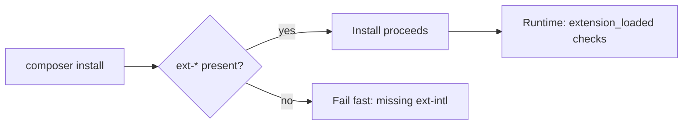

# PHP Extensions

!!! tip "In a nutshell"
    Most PHP capability lives in compiled **extensions**; Symfony declares the
    ones it needs as Composer `ext-*` requirements. Remember `strlen()` counts
    **bytes** while `mb_strlen()` counts **characters** — the UTF-8 length trap.

!!! example "Real-world analogy"
    A bare PHP install is like a workshop with just a workbench: capable of little on
    its own. Specialised jobs need power tools plugged in — a drill, a saw — and those
    tools are the compiled extensions. A project's spec sheet (`composer.json`'s
    `ext-*` requirements) lists which tools must be present before work starts, so if
    the drill is missing you are told up front rather than discovering it mid-job.

!!! abstract "Learning objectives"
    By the end of this chapter you can:

    - [ ] Name the PHP extensions Symfony relies on and what each provides.
    - [ ] Detect a loaded extension at runtime and require it in `composer.json`.
    - [ ] Explain why `mbstring`, `intl` and `opcache` matter for correctness/perf.

    **Syllabus:** `PHP → PHP extensions` ·
    **Level:** Advanced ·
    **Est. time:** 20 min ·
    **Prerequisites:** [Namespaces](namespaces.md)

---

## Theory

PHP's core is small; most real capability lives in **extensions** — compiled
modules that add functions and classes. Symfony 8 declares the ones it needs as
Composer **platform requirements** (`ext-*`), and the framework degrades or
errors clearly when one is missing.

| Extension | Provides | Symfony use |
|---|---|---|
| `mbstring` | Multibyte string ops | UTF-8 safe length/case, String component |
| `intl` | ICU: locales, collation | Translation, `IntlDateFormatter`, slugger |
| `ctype` | Character-class checks | Fast validation (`ctype_digit`, …) |
| `iconv` | Charset conversion | Encoding conversion, filenames |
| `pdo` (+`pdo_*`) | Database abstraction | Sessions PDO handler, DB DSNs |
| `opcache` | Bytecode cache | Production performance |
| `openssl` | Crypto, TLS | Secrets, hashing, HTTPS clients |
| `json` | JSON encode/decode | Core; always available in 8.x |
| `filter` | Data filtering | Validation, sanitisation |

!!! question "Predict first"
    Do `strlen('café')` and `mb_strlen('café', 'UTF-8')` return the same number?

??? note "Reveal"
    No: `5` vs `4`. `strlen` counts **bytes** (é is 2 bytes in UTF-8);
    `mb_strlen` counts **characters** — the classic length-validation trap.

## Deep Dive — detection & requirement

### Detecting an extension

Prefer `extension_loaded('name')` for a boolean check;
`function_exists()`/`class_exists()` check a specific symbol. `phpversion('ext')`
returns the extension's version or `false`.

```php
<?php
declare(strict_types=1);

if (!\extension_loaded('intl')) {
    throw new \RuntimeException('The intl extension is required.');
}

$hasMb = \function_exists('mb_strlen');
```

### Requiring extensions via Composer

Declare `ext-*` in `require`. `composer install` then **fails fast** on a host
without them, and `--ignore-platform-req` can override in edge cases.

```json
{
    "require": {
        "php": ">=8.4",
        "ext-ctype": "*",
        "ext-iconv": "*",
        "ext-mbstring": "*",
        "ext-intl": "*"
    }
}
```

### Why they matter

- **`mbstring`**: byte functions like `strlen()` count **bytes**, not
  characters. `mb_strlen($s, 'UTF-8')` counts characters — essential for
  correct length validation of non-ASCII input.
- **`intl`**: ICU-backed locale formatting/collation. Without it Symfony's
  Intl component falls back to a bundled dataset with reduced accuracy.
- **`opcache`**: caches compiled bytecode in shared memory, avoiding recompilation
  per request — the single biggest production speedup. Enable
  `opcache.enable=1` and, for immutable deploys, `opcache.validate_timestamps=0`.



!!! note "Source reference"
    Symfony's polyfills (`symfony/polyfill-mbstring`, `-intl-*`, `-ctype`) provide
    userland fallbacks; the String component prefers the native extension —
    [symfony/symfony `8.0`](https://github.com/symfony/symfony/blob/8.0/src/Symfony/Component/String).

## Configuration & code

=== "Console"

    ```console
    $ php -m                       # list loaded extensions
    $ php --ri opcache             # config of one extension
    $ php -r 'var_dump(extension_loaded("intl"));'
    bool(true)
    ```

=== "Symfony check"

    ```console
    $ php bin/console about        # shows PHP + extension-relevant info
    ```

## Best practices & anti-patterns

| ✅ Do | ❌ Avoid |
|---|---|
| Declare `ext-*` in composer.json | Assuming an extension is present |
| `mb_*` for user text | `strlen`/`substr` on UTF-8 |
| Enable `opcache` in prod | Running prod without a bytecode cache |
| `extension_loaded()` guards | `@`-suppressing missing-function errors |

## When (not) to use it / alternatives

- Prefer the **native extension**; use Symfony polyfills only as a portability
  fallback (they are slower and sometimes partial).
- Only require extensions you actually use — over-declaring `ext-*` blocks
  otherwise-valid hosts.

!!! danger "Certification traps"
    - `strlen()` counts **bytes**; `mb_strlen()` counts **characters**. A UTF-8
      "é" is 2 bytes.
    - `ctype_digit('123')` is true, but `ctype_digit(123)` treats small ints as
      **ASCII codes** — a classic gotcha.
    - Missing `intl` degrades locale accuracy rather than crashing (polyfill).
    - `opcache` caches bytecode, not application data — it is not a data cache.

!!! warning "Common mistakes"
    - Testing extensions with `function_exists` for a class-only extension.
    - Shipping `opcache.validate_timestamps=1` in prod (needless stat per file).

## Exercises

1. **(Advanced)** Write a guard that requires `mbstring` **and** `intl`, throwing
   a single clear message listing what is missing.
2. **(Advanced)** Explain the difference in output of `strlen('café')` vs
   `mb_strlen('café', 'UTF-8')`.

??? success "Solutions"

    **1.**
    ```php
    <?php
    declare(strict_types=1);

    $missing = array_filter(
        ['mbstring', 'intl'],
        static fn (string $e): bool => !\extension_loaded($e),
    );
    if ($missing !== []) {
        throw new \RuntimeException('Missing extensions: '.implode(', ', $missing));
    }
    ```

    **2.** `strlen('café')` returns **5** (é is 2 bytes in UTF-8);
    `mb_strlen('café', 'UTF-8')` returns **4** (character count).

## Certification questions

??? question "Q1. Which reliably reports whether an extension is loaded?"
    - [x] A. `extension_loaded('intl')` ✅
    - [ ] B. `include 'intl'`
    - [ ] C. `require_extension('intl')`
    - [ ] D. `ini_get('intl')`

    **Why:** `extension_loaded()` returns a bool for the module. **Ref:** [extension_loaded](https://www.php.net/manual/en/function.extension-loaded.php).

??? question "Q2. `strlen('é')` (UTF-8) returns…"
    - [ ] A. 1
    - [x] B. 2 ✅
    - [ ] C. 0
    - [ ] D. 4

    **Why:** `strlen` counts bytes; "é" is 2 bytes in UTF-8. Use `mb_strlen` for
    characters. **Ref:** [mbstring](https://www.php.net/manual/en/book.mbstring.php).

??? question "Q3. What does `opcache` cache?"
    - [x] A. Compiled PHP bytecode in shared memory ✅
    - [ ] B. Database query results
    - [ ] C. HTTP responses
    - [ ] D. Rendered templates

    **Why:** OPcache stores precompiled script bytecode, skipping recompilation.
    **Ref:** [OPcache](https://www.php.net/manual/en/book.opcache.php).

??? question "Q4. How do you make `composer install` fail on a host lacking `intl`?"
    - [x] A. Add `\"ext-intl\": \"*\"` to `require` ✅
    - [ ] B. Add it to `autoload`
    - [ ] C. Set an env var
    - [ ] D. Nothing — Composer detects it automatically

    **Why:** `ext-*` platform requirements are checked at install time.
    **Ref:** [Composer platform packages](https://getcomposer.org/doc/articles/composer-platform-dependencies.md).

## Key takeaways

- Symfony needs `ctype`, `iconv`, `mbstring`, `intl` (declared as `ext-*`).
- `extension_loaded()` is the runtime check; `ext-*` is the install-time gate.
- `strlen`=bytes, `mb_strlen`=characters — matters for UTF-8.
- `opcache` = bytecode cache; the top production speedup.

## Last-minute revision

!!! tip "Cheat sheet"
    - `php -m` lists modules; `php --ri ext` shows config.
    - Require: `"ext-mbstring": "*"` etc. in composer.json.
    - `mb_*` for text; `ctype_*` beware integer-as-ASCII gotcha.
    - Prefer native ext over Symfony polyfill.

## Connections

- **Depends on:** [Namespaces](namespaces.md) — `ext-*` requirements live in the same `composer.json` that configures PSR-4 autoloading.
- **Reused in:** [Web Security](web-security.md) — `openssl` and `filter` back hashing and validation defences.
- **Confused with:** [SPL](spl.md) — SPL is always-available core, not an optional `ext-*` you must declare.

## Official References
- [PHP: Extensions overview](https://www.php.net/manual/en/extensions.php)
- [PHP: mbstring](https://www.php.net/manual/en/book.mbstring.php)
- [PHP: Intl](https://www.php.net/manual/en/book.intl.php)
- [Composer platform dependencies](https://getcomposer.org/doc/articles/composer-platform-dependencies.md)
- [Symfony source — String component](https://github.com/symfony/symfony/blob/8.0/src/Symfony/Component/String)

## Confidence check

I'm ready when I can:

- [ ] explain **why** Symfony declares `ext-*` platform requirements
- [ ] detect a loaded extension at runtime and require it in a Symfony 8 `composer.json`
- [ ] debug a UTF-8 length bug caused by `strlen` instead of `mb_strlen`
- [ ] spot the trick: `ctype_digit(123)` treating a small int as an ASCII code
- [ ] explain what `opcache` caches (bytecode) and why it speeds up production

---

<small>Related: [Namespaces](namespaces.md) · [SPL](spl.md) · [Web Security](web-security.md)</small>
