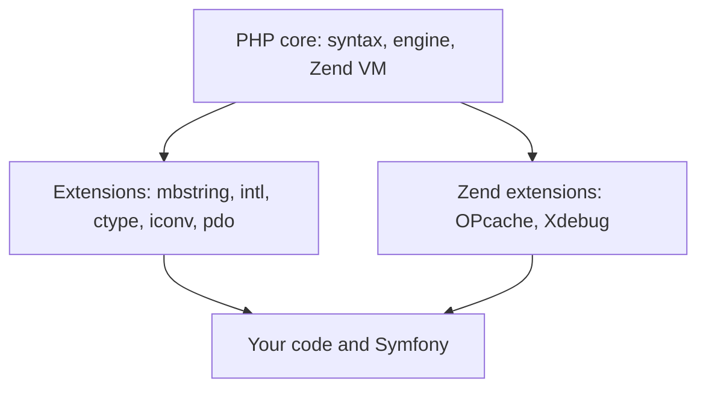
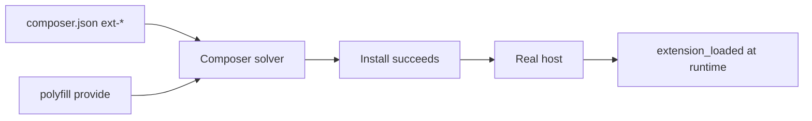
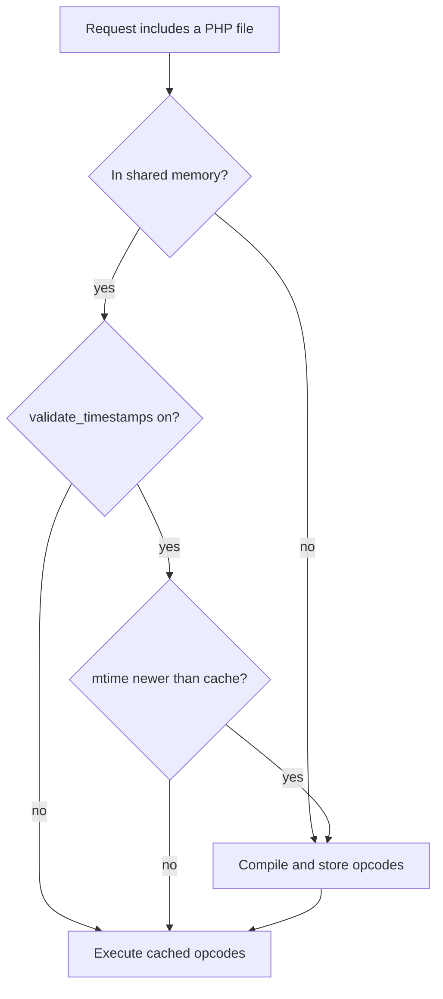
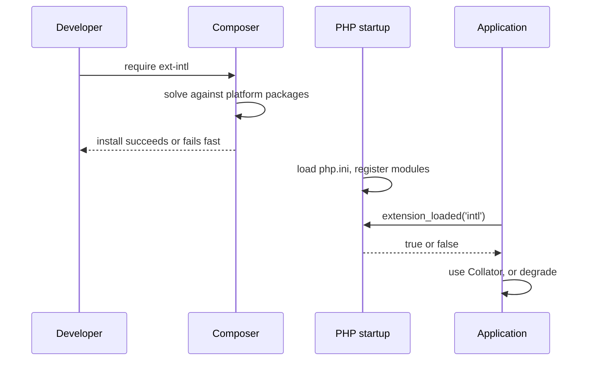

# PHP Extensions

!!! tip "In a nutshell"
    PHP's core is deliberately small; almost every capability you think of as "PHP" —
    multibyte strings, locales, database access, bytecode caching — arrives through a
    compiled **extension**. Three facts decide most questions on this topic: `strlen()`
    counts **bytes** while `mb_strlen()` counts **characters**; an `ext-*` entry in
    `composer.json` is a *gate*, never a supplier, and a polyfill's `provide` can satisfy
    it without the module being installed; and OPcache registers under the name
    **`Zend OPcache`**, caches **bytecode only**, and stops looking at your files the
    moment you set `opcache.validate_timestamps=0`.

!!! example "Real-world analogy"
    A bare PHP install is a workshop with a workbench and nothing else. Specialised jobs
    need power tools plugged in — a drill, a saw — and those tools are the compiled
    extensions. `composer.json`'s `ext-*` list is the job sheet pinned to the door: it
    refuses to let work start when a tool is missing. But the analogy has a twist that is
    the whole point of this chapter. Symfony also carries a **hand tool** in its bag for
    the most common jobs — the polyfills. When the drill is missing, the job sheet is
    satisfied anyway and the work proceeds with a screwdriver: slower, and for the locale
    tools, only able to speak English. Nothing fails; the result is quietly worse. Which
    is why the real inspection is done on site (`composer check-platform-reqs`), not on
    the job sheet.

!!! abstract "Learning objectives"
    By the end of this chapter you can:

    - [ ] Define what a PHP extension is and classify one as core, bundled, external or
          PECL.
    - [ ] Detect an extension at runtime with the right call, and explain why
          `extension_loaded('opcache')` returns `false` on a server running OPcache.
    - [ ] Explain byte / code point / grapheme semantics, and pick between `strlen`,
          `mb_strlen` and `grapheme_strlen`.
    - [ ] State what `intl` gives you (Collator, NumberFormatter, IntlDateFormatter,
          Transliterator) and exactly how Symfony degrades without it.
    - [ ] Predict the `ctype_*` surprises: empty strings, small integers, and the 8.1
          deprecation.
    - [ ] Distinguish `iconv` from `mbstring`, including `//TRANSLIT` and `//IGNORE`.
    - [ ] Declare `ext-*` platform requirements, and say why a green `composer install` is
          not proof — and which command is.
    - [ ] Configure OPcache for production and describe the deployment duty that
          `validate_timestamps=0` creates.

    **Syllabus:** `PHP → PHP extensions` ·
    **Level:** Advanced / Expert ·
    **Est. time:** 45 min ·
    **Prerequisites:** [Namespaces](namespaces.md)

    **Examen Symfony 8 :** NO — PHP extensions are not one of the nine official PHP
    subtopics listed in [PHP & Web Security](index.md). This chapter is kept as
    enrichment, because every deployment question, every "why is this string broken?"
    question and every OPcache question in later stages assumes it.

---

## Prerequisites

You should be comfortable reading a `composer.json`, as covered in
[Namespaces & Autoloading](namespaces.md) — the same file that configures PSR-4
autoloading also declares platform requirements, and the two live side by side.

Everything below targets **PHP 8.4** and **Symfony 8.0**. The version matters more here
than in most chapters, because several behaviours changed recently:

- since **PHP 8.0**, `mb_*` functions throw a `ValueError` on an invalid encoding instead
  of warning and returning `false`;
- since **PHP 8.0**, `json` is a *core* extension and can no longer be disabled at build
  time;
- since **PHP 8.1**, passing a non-string to a `ctype_*` function is deprecated;
- since **PHP 8.4**, `opcache.jit` defaults to `disable` rather than `tracing`.

## The problem we are solving

Write this in a controller and it works perfectly on your machine:

```php
<?php
declare(strict_types=1);

$name = 'Ángel';

if (\strlen($name) > 5) {
    throw new \InvalidArgumentException('Name too long.');
}
```

`Á` is two bytes in UTF-8, so `strlen('Ángel')` is **6**, and a five-letter name is
rejected as too long. Nothing crashed, no exception was logged, and the bug is invisible
to anyone testing with ASCII names. The same class of failure produces truncated words in
a database, `Äpfel` sorted after `Zebra`, English month names on a French invoice, and a
deploy that serves last week's code.

Every one of those symptoms has the same root cause: **a capability you assumed was part
of the language is actually an optional, separately-compiled module — and PHP will not
tell you when it is missing.** It will simply behave differently.

This chapter is about making that dependency explicit: naming it, detecting it, requiring
it, and knowing precisely what degrades when it is absent.

## 🧠 Pour les nuls

**C'est quoi une extension PHP ?** Un module compilé (le plus souvent écrit en C) qui
ajoute des fonctions, des classes et des réglages `php.ini` au moteur PHP au démarrage. Le
cœur du langage est minuscule : `mb_strlen()`, `Collator`, `PDO` ou OPcache ne font pas
partie de PHP « en soi », ce sont des modules branchés dessus.

**Pourquoi ça existe ?** Parce qu'un interpréteur qui embarquerait tout serait énorme,
lent à démarrer et impossible à sécuriser. En rendant chaque capacité optionnelle, PHP
laisse chaque hébergeur composer sa propre installation : un serveur d'API n'a pas besoin
du même outillage qu'un site multilingue.

**🏠 Analogie de la vraie vie :** un atelier livré avec un simple établi. Pour percer il
faut une perceuse, pour scier une scie — ce sont les extensions. La feuille de chantier
(`composer.json` et ses `ext-*`) liste les outils obligatoires avant même de commencer,
histoire de ne pas découvrir au milieu du travail que la perceuse manque. Mais attention :
Symfony garde un tournevis dans sa poche (les *polyfills*). Si la perceuse est absente, le
chantier démarre quand même, en plus lent — et pour les outils de langue, uniquement en
anglais.

**Symfony dans la vraie vie :** Symfony ne réclame presque aucune extension. Le dépôt
`symfony/symfony` ne déclare que `ext-xml`, et s'appuie sur les paquets
`symfony/polyfill-mbstring`, `-ctype`, `-intl-icu`… La documentation officielle liste
comme prérequis : Ctype, iconv, PCRE, Session, SimpleXML et Tokenizer. Ni `mbstring` ni
`intl` n'y figurent, justement parce qu'un remplaçant en PHP pur existe.

**Exemple minimal :**

```php
<?php
if (!\extension_loaded('intl')) {
    throw new \RuntimeException("L'extension intl est requise.");
}
```

**Ce qui se passe à l'intérieur :** au démarrage, PHP lit `php.ini`, charge chaque
`extension=` (module classique) et chaque `zend_extension=` (module qui s'accroche au
compilateur, comme OPcache), puis enregistre le nom de chaque module dans une table
interne. `extension_loaded()` ne fait rien de plus que consulter cette table — d'où sa
rapidité, et d'où le piège du nom : OPcache s'enregistre sous `Zend OPcache`, pas sous
`opcache`.

**⚠️ Erreur de débutant la plus fréquente :** croire que `strlen()` compte des caractères.
`strlen()` compte des **octets**, et « é » en UTF-8 en occupe deux. La validation de
longueur d'un formulaire écrite avec `strlen()` rejette donc des valeurs parfaitement
valides dès qu'il y a un accent — sans jamais lever d'erreur.

**🧠 Comment le mémoriser :** « `mb` = **m**ulti-**b**yte conscient ». `strlen` mesure le
**carton**, `mb_strlen` compte les **lettres** à l'intérieur.

## Build the mental model

Hold three layers in your head, and most of this chapter follows.



The **core** gives you syntax, the object model and the virtual machine. **Extensions**
register extra functions and classes into that engine and are loaded with `extension=`.
**Zend extensions** are a different species: they hook the engine's own machinery — the
compiler, the executor — and are loaded with `zend_extension=`. OPcache is a Zend
extension, which is why its INI directive differs and why its module name is
`Zend OPcache`. Your application sits on top and, crucially, cannot tell at a glance which
layer a given function came from.

The second model is the *contract chain*, and it is where most real incidents live:



There are **two independent checks**, not one. Composer's check is about the dependency
graph and can be satisfied by a `provide`, bypassed with `--ignore-platform-req`, or faked
with `config.platform`. The runtime check is about the machine. A green install proves the
first, never the second — which is exactly the gap `composer check-platform-reqs` exists to
close.

!!! info "Official Composer reference"
    https://getcomposer.org/doc/articles/composer-platform-dependencies.md

## Core concepts

### An extension is a registered module, not a library you include

At startup PHP reads `php.ini`, loads each configured module, and records its **module
name** in an internal registry. Everything the module declares — functions, classes,
constants, INI directives — becomes part of the engine for every request. There is no
`include`, no autoloading, and no namespace: extension symbols live in the global
namespace, which is why you write `\mb_strlen()` and not `Mb\strlen()`.

That registry is what `extension_loaded()` queries, what `php -m` prints, and what
`get_loaded_extensions()` returns as an array.

### The four membership categories

The manual's "Extension Categorization" appendix sorts every extension into four buckets:

| Category | Meaning | Example |
|---|---|---|
| **Core** | Part of PHP itself; cannot be disabled | `json` since PHP 8.0, `SPL`, `standard` |
| **Bundled** | Ships in the PHP source, optional at build time | `ctype`, `iconv`, `mbstring`, `intl`, `pdo`, `opcache` |
| **External** | Ships with PHP but needs an external library | `intl` (ICU), `pdo_pgsql` (libpq) |
| **PECL** | Distributed separately, installed on its own | `redis`, `apcu`, `xdebug`, `imagick` |

The `json` extension is the textbook illustration of the core/bundled line: the manual
states it "is a core PHP extension, so it is always enabled", but that "prior to PHP 8.0.0,
the JSON extension was bundled and compiled into PHP by default, but could be explicitly
disabled using `--disable-json`". Same extension, different category, different PHP
version.

!!! info "PHP 8.4 reference"
    https://www.php.net/manual/en/extensions.membership.php

### Defaults differ per extension, and the difference is examinable

| Extension | Build default | Switch |
|---|---|---|
| `ctype` | Enabled | `--disable-ctype` to remove; built into the Windows binary |
| `iconv` | Enabled | `--without-iconv` to remove |
| `pdo` | Enabled, with the `pdo_sqlite` driver | `--disable-pdo` |
| `mbstring` | **Not** enabled | `--enable-mbstring` to add |
| `intl` | Not enabled; requires ICU | `--enable-intl` |
| `opcache` | Shared only | `--enable-opcache`, then `zend_extension=` |

`mbstring` is the odd one out: the manual describes it as "a non-default extension. This
means it is not enabled by default." That single line explains why Symfony ships a
`mbstring` polyfill as a hard dependency and why `mbstring` is the module most likely to be
absent on an unusual host.

!!! info "PHP 8.4 reference"
    https://www.php.net/manual/en/mbstring.installation.php

## Learn by doing

Start from the question that actually matters on a server: *what do I have?*

```console
$ php -m
[PHP Modules]
ctype
iconv
intl
mbstring
PDO
pdo_mysql
...
Zend OPcache

[Zend Modules]
Zend OPcache
```

Two sections, and one name in both. Now ask PHP the same question from inside a script:

```php
<?php
declare(strict_types=1);

var_dump(\extension_loaded('intl'));          // bool(true)
var_dump(\extension_loaded('INTL'));          // bool(true)  — case-insensitive
var_dump(\extension_loaded('opcache'));       // bool(false) — NOT the module name
var_dump(\extension_loaded('Zend OPcache'));  // bool(true)
var_dump(\phpversion('intl'));                // string "8.4.19" (or false if absent)
var_dump(\get_loaded_extensions(true));       // array with "Zend OPcache"
```

Three lessons in six lines. `extension_loaded()` is case-insensitive but not fuzzy, so
`'opcache'` never matches `Zend OPcache`. `phpversion($ext)` returns a version string *or*
`false`, giving you presence and version in one call. And `get_loaded_extensions(true)`
filters to Zend extensions, mirroring the second section of `php -m`.

Now turn that into something an application can act on:

```php
<?php
declare(strict_types=1);

$required = ['mbstring', 'intl', 'pdo'];

$missing = array_values(array_filter(
    $required,
    static fn (string $name): bool => !\extension_loaded($name),
));

if ([] !== $missing) {
    throw new \RuntimeException(
        'Missing PHP extensions: '.implode(', ', $missing)
    );
}
```

Report **every** missing extension at once. A guard that throws on the first one turns a
single deployment into three deployments.

!!! info "PHP 8.4 reference"
    https://www.php.net/manual/en/function.extension-loaded.php

### Bytes, code points, graphemes

The reason `mbstring` exists is that a byte and a character stopped being the same thing
decades ago. The manual puts it plainly: when you manipulate strings in a multibyte
encoding "you need to use special functions since two or more consecutive bytes may
represent a single character", and a non-multibyte-aware function "probably fails to detect
the beginning or ending of the multibyte character and ends up with a corrupted garbage
string".

There are in fact **three** units, not two:

| Unit | What it is | Function | `'café'` | Family emoji |
|---|---|---|---|---|
| Byte | Storage | `strlen()` | 5 | 18 |
| Code point | Unicode's atomic unit | `mb_strlen()` | 4 | 5 |
| Grapheme cluster | What a human sees as one character | `grapheme_strlen()` | 4 | 1 |

The family emoji is three emoji joined by two zero-width joiners. Symfony's String
component names the same three levels `ByteString`, `CodePointString` and `UnicodeString`,
so the distinction is a framework API question as much as a PHP one.

```php
<?php
declare(strict_types=1);

$s = 'café';

var_dump(\strlen($s));                 // int(5)  — bytes
var_dump(\mb_strlen($s, 'UTF-8'));     // int(4)  — code points
var_dump(\substr($s, 0, 4));           // 4 bytes: "caf" + a broken lead byte
var_dump(\mb_substr($s, 0, 4, 'UTF-8'));  // string(5) "café"
var_dump(\strtoupper($s));             // string(5) "CAFé" — ASCII only
var_dump(\mb_strtoupper($s, 'UTF-8')); // string(5) "CAFÉ"
var_dump(\str_pad($s, 6, '*'));        // "café*"  — 5 bytes already
var_dump(\mb_str_pad($s, 6, '*'));     // "café**" — 4 characters already
```

Note the two symmetric failures on the last pair: byte functions *under-count* accented
text for padding and *over-count* it for length limits. And note `strrev()`, which has no
`mb_` counterpart at all — reversing text is not well defined on Unicode, because combining
marks must travel with their base character.

!!! info "PHP 8.4 reference"
    https://www.php.net/manual/en/book.mbstring.php

### intl: locale behaviour is data, and the data is ICU's

The `intl` extension is, in the manual's words, "a wrapper for ICU library, enabling PHP
programmers to perform various locale-aware operations". The modules you will actually
meet:

| Class | What it does |
|---|---|
| `Collator` | Locale-sensitive comparison and sorting (Unicode Collation Algorithm) |
| `NumberFormatter` | Numbers, currencies, percentages, spell-out |
| `IntlDateFormatter` | Localised dates and times |
| `MessageFormatter` | ICU MessageFormat — plurals, gender, nested choices |
| `Locale` | Parse, compose, match and look up locale identifiers |
| `Normalizer` | Unicode normalisation forms (NFC, NFD, NFKC, NFKD) |
| `Transliterator` | Script conversion, e.g. any script to Latin |

The single most convincing demonstration is sorting:

```php
<?php
declare(strict_types=1);

$words = ['Zebra', 'Äpfel', 'Apfel', 'Öl'];

sort($words);
// ['Apfel', 'Zebra', 'Äpfel', 'Öl'] — byte order: 0xC3 sorts after 'Z'

$words = ['Zebra', 'Äpfel', 'Apfel', 'Öl'];
usort($words, (new \Collator('de_DE'))->compare(...));
// ['Apfel', 'Äpfel', 'Öl', 'Zebra'] — German collation
```

`sort()` compares bytes. In UTF-8 every accented letter starts with a byte above `0x7F`, so
it lands after every unaccented one — the instantly recognisable "why is Äpfel after
Zebra?" symptom of a missing collator.

!!! info "PHP 8.4 reference"
    https://www.php.net/manual/en/class.collator.php

### ctype: fast character-class checks with two sharp edges

`ctype_*` functions answer "does every character in this string belong to class X?" and are
implemented against the C library, so they are very fast. Two documented behaviours make
them a favourite exam target.

```php
<?php
declare(strict_types=1);

var_dump(\ctype_digit('123'));  // bool(true)
var_dump(\ctype_digit(''));     // bool(false) — empty is ALWAYS false
var_dump(\ctype_digit(123));    // bool(false) — 123 is the codepoint of '{'
var_dump(\ctype_digit(1234));   // bool(true)  — outside the window, stringified
```

The manual states both rules explicitly. First: "When called with an empty string the
result will always be `false`" — deliberate, because these are validators. Second: "If an
`int` between -128 and 255 inclusive is provided, it is interpreted as the ASCII value of a
single character… Any other integer is interpreted as a string containing the decimal
digits of the integer."

And since **PHP 8.1.0**, passing a non-string argument is **deprecated**; the manual warns
that "in the future, the argument will be interpreted as a string instead of an ASCII
codepoint". So the `ctype_digit(123) === false` behaviour is transitional. Cast to
`string` and every surprise disappears.

!!! info "PHP 8.4 reference"
    https://www.php.net/manual/en/function.ctype-digit.php

### iconv versus mbstring

Both convert between character encodings; they differ in *where the tables live*.

| | `mbstring` | `iconv` |
|---|---|---|
| Implementation | Ships its own conversion tables | Binds to the system's iconv facility |
| Portability | Identical behaviour everywhere | Depends on glibc / musl / libiconv |
| Signature | `mb_convert_encoding($str, $to, $from)` | `iconv($from, $to, $str)` |
| Lossy modes | None | `//TRANSLIT`, `//IGNORE` |
| Also provides | 60+ string functions, regex, MIME | Conversion, `iconv_strlen`, MIME headers |

The **argument order is mirrored**, which is a favourite code-analysis question: the string
comes *last* for `iconv()` and *first* for `mb_convert_encoding()`.

```php
<?php
declare(strict_types=1);

$title = "Facture 5€ — café";

var_dump(@\iconv('UTF-8', 'ASCII', $title));
// bool(false) — an E_NOTICE is generated

var_dump(\iconv('UTF-8', 'ASCII//TRANSLIT', $title));
// string "Facture 5EUR -- cafe" — approximated

var_dump(\iconv('UTF-8', 'ASCII//IGNORE', $title));
// string "Facture 5  caf" — unrepresentable characters silently dropped
```

The manual documents all three modes, and adds the caveat that matters in containers: how
`//TRANSLIT` works "depends on the system's iconv implementation… Some implementations are
known to ignore `//TRANSLIT`". Alpine's musl libc is the case you will meet.

!!! info "PHP 8.4 reference"
    https://www.php.net/manual/en/function.iconv.php

### PDO is an interface; drivers are separate extensions

`pdo` defines the API. Each database needs its own driver extension — `pdo_mysql`,
`pdo_pgsql`, `pdo_sqlite`, and so on. The manual notes that PDO and `PDO_SQLITE` are enabled
by default, that other drivers must be enabled separately, and that when loaded as shared
modules "all PDO drivers must be loaded **after** PDO itself", because PDO has to be
initialised first.

```php
<?php
declare(strict_types=1);

var_dump(\PDO::getAvailableDrivers());
// array(3) { [0]=> "mysql" [1]=> "pgsql" [2]=> "sqlite" }
```

`PDO::getAvailableDrivers()` (aliased `pdo_drivers()`) "returns all currently available PDO
drivers which can be used in the DSN parameter of `PDO::__construct`", and an **empty
array** when none are. A preflight check that tests only `ext-pdo` will happily pass on a
host where every connection fails with "could not find driver".

!!! info "PHP 8.4 reference"
    https://www.php.net/manual/en/pdo.getavailabledrivers.php

### OPcache caches bytecode, and nothing else

Without OPcache, every request re-reads, re-lexes, re-parses and re-compiles every PHP file
it touches. OPcache stores the resulting **opcodes in shared memory**, so subsequent
requests jump straight to execution. Symfony's performance page describes it in the same
terms: it "caches the compiled bytecode of PHP scripts to avoid recompiling them on each
request".

It is not a data cache. Query results belong in APCu/Redis/the Cache component, HTTP
responses in a reverse proxy, Twig's compiled templates in `var/cache/` — where OPcache
then caches *those generated PHP files* as bytecode, one layer down.

!!! info "Official Symfony 8.0 reference"
    https://symfony.com/doc/8.0/performance.html#performance-use-opcache

## How Symfony handles it

Symfony's strategy is **polyfill first, extension for performance** — and that single
sentence corrects the most common misconception about this topic.

### What Symfony actually requires

The Symfony 8.0 setup page lists PHP 8.4 or higher plus six extensions, "which are
installed and enabled by default in most PHP 8 installations": **Ctype, iconv, PCRE,
Session, SimpleXML and Tokenizer**. Neither `mbstring` nor `intl` is on that list.

The monorepo's own `composer.json` agrees: the only `ext-*` requirement in
`symfony/symfony` is **`ext-xml`**. Everything else is covered by Composer dependencies on
`symfony/polyfill-ctype`, `symfony/polyfill-mbstring`, `symfony/polyfill-intl-icu`,
`-intl-grapheme`, `-intl-idn` and `-intl-normalizer`.

!!! info "Official Symfony 8.0 reference"
    https://symfony.com/doc/8.0/setup.html#symfony-tech-requirements

!!! note "Symfony 8.0 source reference"
    https://github.com/symfony/symfony/blob/8.0/composer.json

### What the polyfills do — and what they do not

`symfony/polyfill-mbstring` declares `"provide": {"ext-mbstring": "*"}`, requires
`ext-iconv`, and *suggests* `ext-mbstring` "For best performance". That `provide` is the
detail that catches people out: with the polyfill in the graph, a project requiring
`ext-mbstring` installs cleanly on a host with no mbstring module at all. And the
`ext-iconv` requirement explains the asymmetry in Symfony's documented list — `iconv` is
required precisely *because* the mbstring fallback is built on it.

The ICU polyfill is the one with a hard ceiling. Its README states it provides
`intl_is_failure()`, `intl_get_error_code()`, `intl_get_error_message()`,
`intl_error_name()`, `Collator`, `NumberFormatter`, `Locale`, `IntlDateFormatter` and
`IntlListFormatter` — and that it is **"limited to the `en` locale"**. Symfony's own
translation documentation says the same thing in application terms: the polyfills "only
support English translations, so you must install the PHP `intl` extension when translating
into other languages".

!!! info "Official Symfony 8.0 reference"
    https://symfony.com/doc/8.0/translation.html

### `symfony/intl` the component is not `ext-intl` the extension

Two things with almost the same name and completely different jobs:

- **`ext-intl`** — a compiled module wrapping ICU, providing `Collator`,
  `NumberFormatter`, `IntlDateFormatter`, `Transliterator`, …
- **`symfony/intl`** — a Composer package requiring only `php >= 8.4`, which ships ICU
  **data** as PHP arrays behind `Languages`, `Countries`, `Locales`, `Currencies` and
  `Timezones`.

This is why Symfony's `Locale`, `Country` and `Currency` validation constraints work
without the extension: `LocaleValidator` calls `Symfony\Component\Intl\Locales::exists()`,
`CountryValidator` calls `Countries::exists()`, `CurrencyValidator` calls
`Currencies::exists()`. All three read the component's data files.

!!! note "Symfony 8.0 source reference"
    https://github.com/symfony/symfony/blob/8.0/src/Symfony/Component/Validator/Constraints/LocaleValidator.php

### Where Symfony checks extensions itself

`php bin/console about` prints a PHP section whose OPcache row is produced by
`\extension_loaded('Zend OPcache')` combined with `ini_get('opcache.enable')`, and whose
Intl locale row is guarded by `class_exists(\Locale::class, false)`. When you need to settle
an argument about module names, read what the framework does.

```console
$ php bin/console about
...
 PHP
 ---
  Version       8.4.19
  Architecture  64 bits
  Intl locale   en
  Timezone      UTC (2026-08-29T00:00:00+00:00)
  OPcache       Enabled
  APCu          Not installed
```

!!! note "Symfony 8.0 source reference"
    https://github.com/symfony/symfony/blob/8.0/src/Symfony/Bundle/FrameworkBundle/Command/AboutCommand.php

## How it works internally

### Loading

At startup the SAPI parses `php.ini` and its `conf.d` fragments in order. Each
`extension=name` line loads a shared object and calls its module-startup handler, which
registers the module's functions, classes, constants and INI entries into the engine's
global tables and appends the module name to the registry. Each `zend_extension=path` line
does the same for an engine-level extension, which additionally installs hooks into the
compiler and executor.

Two consequences follow directly. First, extension symbols land in the **global namespace**
— hence `\mb_strlen()`, and hence the fallback rules from
[Namespaces & Autoloading](namespaces.md) applying to them. Second, `extension_loaded()` is
a hash lookup in that registry, not a filesystem probe, which is why it is cheap enough to
call on every request in a guard.

### How a polyfill substitutes for a module

A polyfill cannot register into the engine, so it works at the userland level instead.
`symfony/polyfill-mbstring` autoloads a `bootstrap.php` through Composer's `files`
autoloading, and that file declares each function **only if it does not already exist**:

```php
<?php
// Simplified from symfony/polyfill-mbstring/bootstrap80.php
if (!function_exists('mb_strtolower')) {
    function mb_strtolower(?string $string, ?string $encoding = null): string
    {
        return \Symfony\Polyfill\Mbstring\Mbstring::mb_strtolower(
            (string) $string,
            $encoding,
        );
    }
}
```

Three properties fall out of that pattern. The native extension always **wins**, because
`function_exists()` is true before the polyfill runs. The functions are defined at
autoload time, so `function_exists('mb_strtolower')` cannot distinguish native from
polyfilled — only `extension_loaded('mbstring')` can. And the polyfill costs a userland
function call plus PHP-level string work per invocation, which is what "For best
performance" in its `suggest` block is quietly referring to.

!!! note "Symfony 8.0 source reference"
    https://github.com/symfony/symfony/tree/8.0/src/Symfony/Component/String/AbstractUnicodeString.php

### How Symfony degrades when ICU is missing

`AbstractUnicodeString::ascii()` is the clearest example of designed degradation in the
whole framework. It appends the ICU transliteration rule `any-latin/bgn` **only** when
`function_exists('transliterator_transliterate')`. If ICU is absent it falls back to
`iconv('UTF-8', 'ASCII//TRANSLIT', …)` character by character — and if that iconv
implementation cannot transliterate either, it throws a `LogicException` whose message
recommends installing `gnu-libiconv` on Alpine Linux. As a last resort, remaining non-ASCII
characters become `?`.

So a slug endpoint on an under-provisioned host does not crash. It returns worse slugs.
That is the failure mode you must learn to recognise, because no log line announces it.

### What OPcache does per request



The diagram shows why `opcache.validate_timestamps=0` is both the biggest easy win and the
biggest operational trap. With it enabled, PHP performs a `stat()` per included file per
request, throttled by `opcache.revalidate_freq` (default `2` seconds). With it disabled,
that syscall disappears entirely — and so does any chance of PHP noticing your deploy. The
manual is explicit: "When this directive is disabled, you must reset OPcache manually via
`opcache_reset`, `opcache_invalidate` or by restarting the Web server for changes to the
filesystem to take effect."

!!! info "PHP 8.4 reference"
    https://www.php.net/manual/en/opcache.configuration.php#ini.opcache.validate-timestamps

## All supported cases and variations

### Ways to ask "is it there?"

| Call | Answers | Returns | Notes |
|---|---|---|---|
| `extension_loaded('intl')` | Is the module loaded? | `bool` | Case-insensitive; the canonical check |
| `phpversion('intl')` | Which version? | `string`\|`false` | `false` when absent or version-less |
| `get_loaded_extensions()` | Everything loaded | `string[]` | Pass `true` for Zend extensions only |
| `get_extension_funcs('mbstring')` | Which functions? | `string[]`\|`false` | Manual: argument must be lowercase |
| `function_exists('mb_strlen')` | Is this symbol defined? | `bool` | **True for polyfills too** |
| `class_exists(\Collator::class)` | Is this class defined? | `bool` | Same caveat as above |
| `php -m` | Everything loaded | console | Two sections: PHP and Zend modules |
| `php --ri "Zend OPcache"` | One module's config | console | Runtime info plus INI values |
| `composer show --platform` | Composer's view | console | The exact `ext-*` names to require |
| `composer check-platform-reqs` | Does the real host satisfy it? | exit code | Ignores `config.platform` |
| `symfony check:requirements` | Symfony's own list | exit code | Provided by the Symfony CLI |

The distinction between the two blocks in the middle is the important one. `function_exists`
and `class_exists` answer *"can I call this?"* — which is true when a polyfill has supplied
it. `extension_loaded` answers *"is the native module present?"* — which is what you want
when you are deciding whether performance or locale coverage is acceptable.

### Ways an `ext-*` requirement can pass without the extension

1. **`provide`** — another installed package declares it, as `symfony/polyfill-mbstring`
   does for `ext-mbstring`.
2. **`--ignore-platform-req=ext-intl`** — documented as ignoring a specific platform
   requirement "and force the installation even if the local machine does not fulfill it";
   `--ignore-platform-reqs` ignores all of them, and a trailing `+` ignores only the upper
   bound.
3. **`config.platform`** — Composer documents that platform package versions "can however be
   overwritten for the purposes of dependency resolution with a platform configuration".

Only `composer check-platform-reqs` sidesteps all three, because it "will ignore
`config.platform` settings and check the real platform packages".

!!! info "Official Composer reference"
    https://getcomposer.org/doc/03-cli.md#check-platform-reqs

## Configuration & code

=== "composer.json"

    ```json
    {
        "require": {
            "php": ">=8.4",
            "ext-ctype": "*",
            "ext-iconv": "*",
            "ext-mbstring": "*",
            "ext-intl": "*",
            "ext-pdo": "*"
        }
    }
    ```

    Declare only what you actually use: an over-declared `ext-*` blocks otherwise
    valid hosts for no benefit.

=== "Console"

    ```console
    $ php -m                          # every loaded module, both sections
    $ php --ri "Zend OPcache"         # one module's runtime configuration
    $ composer show --platform        # Composer's view of the environment
    $ composer check-platform-reqs --no-dev
    $ symfony check:requirements      # Symfony CLI's own requirement check
    ```

=== "Runtime guard"

    ```php
    <?php
    declare(strict_types=1);

    final class PlatformGuard
    {
        /** @param list<string> $extensions */
        public static function assert(array $extensions): void
        {
            $missing = array_values(array_filter(
                $extensions,
                static fn (string $e): bool => !\extension_loaded($e),
            ));

            if ([] !== $missing) {
                throw new \RuntimeException(
                    'Missing PHP extensions: '.implode(', ', $missing)
                );
            }
        }
    }
    ```

=== "php.ini (production)"

    ```ini
    ; Load OPcache — a Zend extension, not a regular one
    zend_extension=opcache.so

    opcache.enable=1
    opcache.memory_consumption=256
    opcache.max_accelerated_files=32531
    opcache.interned_strings_buffer=32

    ; Immutable deploys only: you now own cache invalidation
    opcache.validate_timestamps=0

    ; Preload the Symfony container graph
    opcache.preload=/path/to/project/config/preload.php
    opcache.preload_user=www-data

    realpath_cache_size=4096K
    realpath_cache_ttl=600
    ```

The OPcache values above are the ones Symfony's performance page recommends, with its own
justification for the interned-strings buffer: "the default value (8 MB) is too low for
Symfony applications, which use many fully-qualified class names".

!!! info "Official Symfony 8.0 reference"
    https://symfony.com/doc/8.0/performance.html#performance-configure-opcache

## Execution flow

Follow one extension from declaration to use.



Read it as four independent moments, each of which can go wrong on its own:

1. **Declaration.** You write `"ext-intl": "*"`. Nothing is checked yet.
2. **Resolution.** Composer matches the requirement against virtual platform packages *and*
   against any `provide` in the graph. This is where a polyfill can quietly stand in.
3. **Startup.** PHP loads modules from `php.ini`; a typo in a path fails here, silently in
   some builds, and OPcache in particular needs `zend_extension=`, not `extension=`.
4. **Runtime.** Your code asks. Only now does the application discover the truth — which is
   why the guard belongs in the entry point, not deep in a service.

## Default behavior

| Thing | Default | Source |
|---|---|---|
| `extension_loaded()` name matching | Case-insensitive | PHP manual |
| `get_loaded_extensions()` | Regular modules; `true` → Zend only | PHP manual |
| `mb_*` `encoding` argument | Internal encoding, else `default_charset` | PHP manual |
| `mb_*` invalid encoding | Throws `ValueError` (since PHP 8.0) | PHP manual |
| `ctype_*` on an empty string | `false`, always | PHP manual |
| `iconv` with no suffix | `E_NOTICE` and returns `false` | PHP manual |
| `opcache.enable` | `1` (but the module must be loaded) | PHP manual |
| `opcache.enable_cli` | `0` | PHP manual |
| `opcache.memory_consumption` | `128` (MB) | PHP manual |
| `opcache.interned_strings_buffer` | `8` (MB) | PHP manual |
| `opcache.max_accelerated_files` | `10000` | PHP manual |
| `opcache.validate_timestamps` | `1` | PHP manual |
| `opcache.revalidate_freq` | `2` (seconds) | PHP manual |
| `opcache.jit` | `disable` as of PHP 8.4.0 | PHP manual |
| PDO drivers enabled by default | PDO + `pdo_sqlite` | PHP manual |

Two of these are worth memorising as a pair. `opcache.enable` defaults to `1`, which is why
"OPcache is enabled but not working" almost always means the module was never loaded with
`zend_extension=`. And `opcache.jit` **changed default in PHP 8.4** from `tracing` to
`disable`, so a JIT that worked on 8.3 is off unless you ask for it.

!!! info "PHP 8.4 reference"
    https://www.php.net/manual/en/opcache.configuration.php

## Edge cases

- **`extension_loaded('opcache')` is `false` when OPcache is running.** The module is
  `Zend OPcache`. It appears in *both* sections of `php -m` and in both
  `get_loaded_extensions()` and `get_loaded_extensions(true)`.
- **`ctype_digit('')` is `false`.** Vacuous truth does not apply; the manual makes it a
  hard rule for the whole family.
- **`ctype_digit(123)` is `false` but `ctype_digit(1234)` is `true`.** The -128..255 window
  is a codepoint; anything outside it is stringified. Both emit a deprecation on PHP 8.1+.
- **`substr()` can produce invalid UTF-8 with no error.** Nothing validates encodings in
  byte functions; the corruption surfaces later, elsewhere.
- **`strrev()` on UTF-8 always corrupts.** Reversing `c3 a9` gives `a9 c3`, which is not
  valid in either order — and there is no `mb_strrev()` to reach for.
- **`iconv('UTF-8', 'ASCII//TRANSLIT', …)` may do nothing** on a musl-based image;
  Symfony's own String component detects this and names `gnu-libiconv` in the exception.
- **`opcache.revalidate_freq` is ignored** when `opcache.validate_timestamps` is disabled.
  Waiting never helps.
- **Preloading does not preload constants.** Functions, classes, interfaces and traits, yes;
  constants, no — the manual calls the exception out explicitly.
- **Preloading is not supported on Windows**, and preloaded scripts can only be cleared by
  restarting the PHP process.
- **CLI and web share nothing.** `opcache_reset()` from your terminal cannot clear the web
  server's cache.
- **`ext-pdo` without a driver** passes every extension check and fails every connection.

!!! info "PHP 8.4 reference"
    https://www.php.net/manual/en/opcache.preloading.php

## Common confusions

| Looks the same | Actually |
|---|---|
| `ext-intl` vs `symfony/intl` | A compiled ICU wrapper vs a Composer package of ICU **data** |
| `function_exists('mb_strlen')` vs `extension_loaded('mbstring')` | "Can I call it?" (true for polyfills) vs "is the module here?" |
| `opcache` vs `Zend OPcache` | An INI prefix vs the registered module name |
| `extension=` vs `zend_extension=` | Regular module vs engine-level hook |
| OPcache vs APCu | Bytecode cache vs user-data cache |
| `mb_convert_encoding` vs `iconv` | String first vs string last; own tables vs system tables |
| `mb_strlen` vs `grapheme_strlen` | Code points vs grapheme clusters |
| `pdo` vs `pdo_mysql` | The interface vs the driver |
| `require: ext-*` vs `check-platform-reqs` | A resolution gate vs an inspection of the real host |
| Bundled vs core | Ships with PHP but removable vs cannot be removed |

The first row deserves repeating, because it is the most expensive one to get wrong under
exam pressure: **the `Locale`, `Country` and `Currency` constraints need the *component*,
not the *extension*.**

## Best practices & anti-patterns

| ✅ Do | ❌ Avoid |
|---|---|
| Declare in `composer.json` only the `ext-*` you truly use | Copying someone else's `ext-*` block wholesale |
| Run `composer check-platform-reqs --no-dev` on the target host | Treating a green `composer install` as proof |
| Guard with `extension_loaded()` in the entry point, listing **all** missing modules | Throwing on the first missing one, one deploy at a time |
| Pass the encoding explicitly: `mb_strlen($s, 'UTF-8')` | Relying on the server's internal encoding |
| Use `mb_*` for anything a user typed or will read | `strlen`/`substr`/`strtoupper` on UTF-8 text |
| Install native `intl` whenever you serve a non-English locale | Shipping the ICU polyfill to production and hoping |
| Enable OPcache and tune it with Symfony's recommended values | Running production without a bytecode cache |
| Pair `validate_timestamps=0` with an automated cache reset | Setting it and relying on people to remember |
| Cast to `string` before every `ctype_*` call | Passing an `int` and trusting the codepoint rule |
| Check `PDO::getAvailableDrivers()`, not just `ext-pdo` | Assuming PDO implies a usable connection |

## Certification traps

!!! danger "Certification traps"
    - **`strlen()` counts bytes; `mb_strlen()` counts characters.** `strlen('café')` is `5`,
      `mb_strlen('café', 'UTF-8')` is `4`. UTF-8 `é` is two bytes.
    - **`extension_loaded('opcache')` returns `false`** on a server where OPcache runs. The
      name is `Zend OPcache`.
    - **OPcache is loaded with `zend_extension=`**, never `extension=`, because it is a Zend
      extension. `opcache.enable` already defaults to `1`.
    - **`ctype_digit(123)` is `false`** (codepoint `{`) while `ctype_digit(1234)` is `true`
      and `ctype_digit('')` is `false`.
    - **Non-string arguments to `ctype_*` are deprecated since PHP 8.1.**
    - **A green `composer install` does not prove an extension exists** — `provide`,
      `--ignore-platform-req` and `config.platform` all get past it.
    - **Symfony's documented requirements are Ctype, iconv, PCRE, Session, SimpleXML,
      Tokenizer** — not mbstring, not intl.
    - **`symfony/polyfill-intl-icu` is limited to the `en` locale.**
    - **Missing `intl` degrades output; it does not crash.** English month names and
      byte-ordered sorting, silently.
    - **OPcache caches bytecode, never application data.**
    - **`opcache.revalidate_freq` is ignored when `validate_timestamps=0`.**
    - **Preloading covers functions, classes, interfaces and traits — but not constants**,
      and is unsupported on Windows.
    - **`ext-pdo` is not a driver.** `pdo_mysql` is a separate extension, and drivers load
      *after* PDO.
    - **`mb_*` throws `ValueError` on an invalid encoding** since PHP 8.0, instead of
      warning and returning `false`.

## Common mistakes

1. **Using `function_exists()` to test for an extension.** It is true when a polyfill
   defined the function, so the check silently accepts the slow path. Worse, it is useless
   for class-only extensions — `intl` ships `Collator` as a class, so
   `function_exists('Collator')` is always `false`.
2. **Length-validating user input with `strlen()`.** Every accented character costs an
   extra byte, so the limit tightens for exactly the users who are least likely to report it
   as a bug.
3. **Truncating with `substr()`.** Produces invalid UTF-8 that fails
   `mb_check_encoding()`, corrupts a database column, and breaks `json_encode()` far from
   the scene of the crime.
4. **Passing an integer to `ctype_digit()`.** Two different rules depending on magnitude,
   plus a deprecation notice, plus behaviour PHP has announced it will change.
5. **Shipping `opcache.validate_timestamps=1` to production.** A `stat()` per included file
   per request, for files that by definition never change between deploys.
6. **Shipping `opcache.validate_timestamps=0` without an automated reset.** The mirror-image
   mistake, and a far worse one: a green deploy that serves last week's code indefinitely.
7. **Clearing the web server's OPcache from the CLI.** They are separate processes with
   separate shared memory. Restart the pool, call `opcache_reset()` over HTTP, or use a tool
   that talks to the FPM socket.
8. **Assuming `ext-pdo` gives you MySQL.** It gives you an interface.
9. **Silencing a missing function with `@`.** It converts an environment problem into a
   behavioural one, which is much harder to find.
10. **Over-declaring `ext-*`.** Requiring extensions the code never uses blocks perfectly
    good hosts and teaches the team to reach for `--ignore-platform-reqs`.

## Debugging and troubleshooting

| Symptom | Likely cause | How to confirm |
|---|---|---|
| Length validation rejects valid accented input | `strlen()` used instead of `mb_strlen()` | Compare both on the failing value |
| Mojibake or `?` in stored data | A byte function truncated a multibyte character | `bin2hex()` the value; `mb_check_encoding()` |
| `Äpfel` sorts after `Zebra` | Byte-order `sort()`, no `Collator` | `extension_loaded('intl')` |
| Dates and currencies render in English on a French page | ICU polyfill in use, native `intl` absent | `php bin/console about` → Intl locale |
| Slugs come back full of `?` | No ICU **and** an iconv without transliteration | Look for the `gnu-libiconv` `LogicException` |
| Health check says OPcache is off, but it is on | `extension_loaded('opcache')` instead of `'Zend OPcache'` | `php -m` and `php --ri "Zend OPcache"` |
| Deploy shows no change | `validate_timestamps=0` with no reset | `opcache_get_status()` over HTTP |
| `Call to undefined function mb_…` | No mbstring and no polyfill | `php -m`, then `composer show \| grep polyfill` |
| `could not find driver` | Missing `pdo_*` driver | `PDO::getAvailableDrivers()` |
| Green install, broken runtime | A `provide` satisfied `ext-*` | `composer check-platform-reqs` on the host |

A single diagnostic script that answers most of these:

```php
<?php
declare(strict_types=1);

printf("PHP            %s\n", \PHP_VERSION);
printf("mbstring       %s\n", \extension_loaded('mbstring') ? 'native' : 'polyfill/absent');
printf("intl           %s\n", \extension_loaded('intl') ? 'native' : 'polyfill/absent');
printf("iconv          %s\n", \extension_loaded('iconv') ? 'yes' : 'no');
printf("OPcache        %s\n", \extension_loaded('Zend OPcache') ? 'loaded' : 'absent');
printf("opcache.enable %s\n", (string) \ini_get('opcache.enable'));
printf("validate_ts    %s\n", (string) \ini_get('opcache.validate_timestamps'));
printf("PDO drivers    %s\n", implode(', ', \PDO::getAvailableDrivers()) ?: 'none');
printf("default_charset %s\n", (string) \ini_get('default_charset'));
```

Run it on the machine that is misbehaving, not on your laptop — the whole point of this
chapter is that the two differ.

!!! info "PHP 8.4 reference"
    https://www.php.net/manual/en/function.get-loaded-extensions.php

## Performance and security considerations

### Performance

**OPcache is the single biggest win.** Without it, every request recompiles every file it
touches. Symfony's production server checklist puts it third, right after dumping the
container into a single file, and recommends `memory_consumption=256`,
`max_accelerated_files=32531` and `interned_strings_buffer=32`, plus a `realpath` cache of
`realpath_cache_size=4096K` and `realpath_cache_ttl=600`.

**Preloading** compiles classes once at server start-up and keeps them in memory for every
request until the server restarts. Symfony generates the class list during container
compilation and exposes it through `config/preload.php`; the `container.preload` and
`container.no_preload` service tags control what goes in. The manual is careful about the
trade-off: it "trades convenience and performance… for baseline memory usage", and
"preload everything may be the easiest strategy, but not necessarily the best".

**Native extensions beat polyfills**, sometimes by an order of magnitude, because the
polyfill runs PHP-level loops where the extension runs C. `symfony/polyfill-mbstring`'s own
`suggest` block says exactly that: `ext-mbstring`, "For best performance".

**`ctype_*` beats a regex** for simple character-class checks, being a thin binding to the C
library — provided you pass it a string.

!!! info "Official Symfony 8.0 reference"
    https://symfony.com/doc/8.0/performance.html#performance-configure-realpath-cache

### Security

**Encoding validation is a security control, not a formatting nicety.** The manual
introduces `mb_check_encoding()` with the words "It is useful to prevent so-called *Invalid
Encoding Attack*": a malformed byte sequence can slip past one layer's filter and become
meaningful in another's decoder. Validate encoding at the boundary, before any escaping
discussion begins — the same defensive posture as
[Web Security Fundamentals](web-security.md).

**Truncation by bytes can create injection vectors.** Cutting a string mid-character leaves
a dangling lead byte that some consumers will merge with the following byte, producing a
character the sanitiser never saw.

**`--ignore-platform-reqs` in a deployment pipeline is a security smell.** It disables the
one automated check that a production host can run the code you built, and it does so
globally rather than for the one requirement you meant.

**`opcache.validate_timestamps=0` is also a security property.** With immutable deploys and
no timestamp validation, a file dropped into the document root is not picked up until the
cache is reset — but the same property means a genuine security patch is not picked up
either. Automate the reset.

**Only require the extensions you use.** Every module loaded is attack surface: more C code
in-process, more INI directives, more parsers exposed to untrusted input.

## Key takeaways

- PHP's core is small; capability lives in **extensions**, classified by the manual as
  core, bundled, external or PECL.
- `extension_loaded()` is the runtime check and is case-insensitive; `phpversion($ext)`
  gives presence plus version; `function_exists()` cannot tell native from polyfilled.
- OPcache registers as **`Zend OPcache`**, loads with `zend_extension=`, and caches
  **bytecode only**.
- `strlen` = bytes, `mb_strlen` = code points, `grapheme_strlen` = grapheme clusters —
  the same three levels Symfony exposes as `ByteString`, `CodePointString`,
  `UnicodeString`.
- `ctype_digit('')` is `false`; `ctype_digit(123)` is `false`; `ctype_digit(1234)` is
  `true`; non-string arguments are deprecated since PHP 8.1.
- `iconv` binds the host's conversion facility (`//TRANSLIT`, `//IGNORE`, host-dependent);
  `mbstring` ships its own tables and behaves identically everywhere.
- `pdo` is an interface; each database needs its own driver extension, loaded after PDO.
- `ext-*` in `composer.json` gates resolution, not reality; only
  `composer check-platform-reqs` inspects the real host.
- Symfony's documented requirements are Ctype, iconv, PCRE, Session, SimpleXML and
  Tokenizer — mbstring and intl are covered by polyfills, and the ICU polyfill is limited
  to the `en` locale.

## Expert takeaways

- The recurring shape of every bug in this chapter is **degradation without diagnosis**.
  Missing extensions rarely throw; they change results. That is a design choice — Symfony's
  polyfills exist to keep applications running — and it means your monitoring, not your
  error handler, is what must catch it.
- There are **two contracts** with different scopes: Composer's, about the dependency graph,
  and the runtime's, about the machine. `provide`, `--ignore-platform-req` and
  `config.platform` each break the assumption that the first implies the second, which is
  why `check-platform-reqs` exists as a separate command rather than a flag on `install`.
- `symfony/polyfill-mbstring` requiring `ext-iconv` while providing `ext-mbstring` explains
  Symfony's requirement list exactly: the fallback for the missing extension is built on one
  that must therefore be present.
- OPcache's settings are a **trade of a syscall for an operational duty**. Turning off
  `validate_timestamps` does not make PHP smarter about your deploys; it makes PHP stop
  asking, and hands you the invalidation problem. Preloading extends the same bargain to the
  process lifetime.
- The `intl` extension versus the `symfony/intl` component is the topic's most productive
  distinction: one wraps ICU code, the other ships ICU data. Knowing which one a given
  Symfony feature needs answers most "does this require intl?" questions immediately.
- PHP 8.4 moved `opcache.jit` to `disable` by default. Version-pinned defaults are exactly
  the kind of fact that separates a memorised answer from an understood one.

## Last-minute revision

!!! tip "Cheat sheet"
    - `php -m` lists modules (two sections); `php --ri "Zend OPcache"` shows one config.
    - `extension_loaded('Zend OPcache')` — **not** `'opcache'`. Case-insensitive.
    - `phpversion($ext)` → version string or `false`. `get_loaded_extensions(true)` → Zend
      only.
    - `strlen('café')` = 5 · `mb_strlen('café','UTF-8')` = 4 · `grapheme_strlen` counts
      what you see.
    - `mb_convert_encoding($str, $to, $from)` vs `iconv($from, $to, $str)` — mirrored.
    - `//TRANSLIT` approximates · `//IGNORE` drops · neither → `E_NOTICE` + `false`.
    - `ctype_digit('')` = false · `(123)` = false · `(1234)` = true · non-string deprecated
      since 8.1.
    - `mb_*` invalid encoding → `ValueError` since PHP 8.0.
    - Composer: `"ext-intl": "*"` gates · `show -p` lists · `check-platform-reqs` verifies
      the real host.
    - Polyfills: `provide` satisfies `ext-*`; `polyfill-intl-icu` is **`en` only**.
    - Symfony requires: Ctype, iconv, PCRE, Session, SimpleXML, Tokenizer. Monorepo
      declares only `ext-xml`.
    - OPcache defaults: `enable=1`, `enable_cli=0`, `memory=128`, `interned=8`,
      `max_files=10000`, `validate_timestamps=1`, `revalidate_freq=2`, `jit=disable` (8.4).
    - Symfony recommends: `memory=256`, `max_files=32531`, `interned=32`,
      `validate_timestamps=0` + reset.
    - Preload: functions/classes/interfaces/traits, **not constants**; no Windows; restart
      to clear.

## Connections

- **Depends on:** [Namespaces & Autoloading](namespaces.md) — the same `composer.json`
  declares `ext-*` beside the PSR-4 rules, and extension symbols live in the global
  namespace, so the fallback rules apply to `mb_strlen()` exactly as they do to `strlen()`.
- **Reused in:** [Web Security Fundamentals](web-security.md) — `mb_check_encoding()` is an
  input-validation control, and `openssl`/`filter` back hashing and sanitisation;
  [PHP API](php-api.md) — the language features these functions are called from.
- **Confused with:** [SPL](spl.md) — the SPL is always-available core, not an optional
  `ext-*` you must declare, even though `get_loaded_extensions()` lists it as `SPL`.

## Continue your learning

1. **[Guided exercises](extensions-exercises.md)** — inventory a real build, provoke UTF-8
   corruption on purpose, meet both `ctype` surprises, and end by explaining a green install
   on a host that cannot run the code.
2. **[Topic exam](extensions-exam.md)** — every certification question for this topic,
   answers hidden until you click.
3. **[Flashcards](extensions-flashcards.md)** — active recall on module names, defaults,
   the polyfill boundary and the OPcache deployment rule.

## Official References

- [PHP: Extensions overview](https://www.php.net/manual/en/extensions.php)
- [PHP: Extension categorization](https://www.php.net/manual/en/extensions.membership.php)
- [PHP: `extension_loaded()`](https://www.php.net/manual/en/function.extension-loaded.php)
- [PHP: `get_loaded_extensions()`](https://www.php.net/manual/en/function.get-loaded-extensions.php)
- [PHP: `phpversion()`](https://www.php.net/manual/en/function.phpversion.php)
- [PHP: `get_extension_funcs()`](https://www.php.net/manual/en/function.get-extension-funcs.php)
- [PHP: mbstring](https://www.php.net/manual/en/book.mbstring.php)
- [PHP: mbstring installation](https://www.php.net/manual/en/mbstring.installation.php)
- [PHP: `mb_strlen()`](https://www.php.net/manual/en/function.mb-strlen.php)
- [PHP: `mb_substr()`](https://www.php.net/manual/en/function.mb-substr.php)
- [PHP: `mb_convert_encoding()`](https://www.php.net/manual/en/function.mb-convert-encoding.php)
- [PHP: `mb_check_encoding()`](https://www.php.net/manual/en/function.mb-check-encoding.php)
- [PHP: Intl](https://www.php.net/manual/en/book.intl.php)
- [PHP: intl installation](https://www.php.net/manual/en/intl.installation.php)
- [PHP: `Collator`](https://www.php.net/manual/en/class.collator.php)
- [PHP: `NumberFormatter`](https://www.php.net/manual/en/class.numberformatter.php)
- [PHP: `IntlDateFormatter`](https://www.php.net/manual/en/class.intldateformatter.php)
- [PHP: `grapheme_strlen()`](https://www.php.net/manual/en/function.grapheme-strlen.php)
- [PHP: ctype](https://www.php.net/manual/en/book.ctype.php)
- [PHP: `ctype_digit()`](https://www.php.net/manual/en/function.ctype-digit.php)
- [PHP: iconv](https://www.php.net/manual/en/book.iconv.php)
- [PHP: `iconv()`](https://www.php.net/manual/en/function.iconv.php)
- [PHP: PDO](https://www.php.net/manual/en/book.pdo.php)
- [PHP: `PDO::getAvailableDrivers()`](https://www.php.net/manual/en/pdo.getavailabledrivers.php)
- [PHP: OPcache](https://www.php.net/manual/en/book.opcache.php)
- [PHP: OPcache installation](https://www.php.net/manual/en/opcache.installation.php)
- [PHP: OPcache configuration](https://www.php.net/manual/en/opcache.configuration.php)
- [PHP: OPcache preloading](https://www.php.net/manual/en/opcache.preloading.php)
- [PHP: JSON installation](https://www.php.net/manual/en/json.installation.php)
- [Composer: platform dependencies](https://getcomposer.org/doc/articles/composer-platform-dependencies.md)
- [Composer: `check-platform-reqs`](https://getcomposer.org/doc/03-cli.md#check-platform-reqs)
- [Composer: `provide` schema](https://getcomposer.org/doc/04-schema.md#provide)
- [Symfony 8.0: Setup & technical requirements](https://symfony.com/doc/8.0/setup.html#symfony-tech-requirements)
- [Symfony 8.0: Performance](https://symfony.com/doc/8.0/performance.html)
- [Symfony 8.0: Deployment](https://symfony.com/doc/8.0/deployment.html)
- [Symfony 8.0: Translation](https://symfony.com/doc/8.0/translation.html)
- [Symfony 8.0: The String component](https://symfony.com/doc/8.0/string.html)
- [Symfony 8.0: The Intl component](https://symfony.com/doc/8.0/components/intl.html)
- [Symfony source — `AbstractUnicodeString`](https://github.com/symfony/symfony/tree/8.0/src/Symfony/Component/String/AbstractUnicodeString.php)
- [Symfony source — `AboutCommand`](https://github.com/symfony/symfony/blob/8.0/src/Symfony/Bundle/FrameworkBundle/Command/AboutCommand.php)
- [Symfony source — `LocaleValidator`](https://github.com/symfony/symfony/blob/8.0/src/Symfony/Component/Validator/Constraints/LocaleValidator.php)
- [Symfony source — monorepo `composer.json`](https://github.com/symfony/symfony/blob/8.0/composer.json)
- [Symfony source — String component](https://github.com/symfony/symfony/tree/8.0/src/Symfony/Component/String)
- [Symfony Polyfill](https://github.com/symfony/polyfill)

## Video references

!!! tip "Watch & learn"
    These are official, continuously-updated video channels — search them for
    "PHP extensions OPcache intl" to reinforce this chapter. We link stable channels rather
    than individual videos so the references never rot.

    - [SymfonyCasts screencasts](https://symfonycasts.com/tracks/symfony) — scripted, code-along tutorials.
    - [Symfony official YouTube](https://www.youtube.com/@SymfonyOfficial) — SymfonyCon conference talks & keynotes.
    - [Official docs for this topic](https://symfony.com/doc/8.0/performance.html) — the production checklist this chapter follows.

## Confidence check

I'm ready when I can:

- [ ] define a PHP extension and place one in the core / bundled / external / PECL taxonomy
- [ ] choose between `extension_loaded`, `phpversion`, `function_exists` and
      `get_extension_funcs`, and say what each cannot tell me
- [ ] explain why `extension_loaded('opcache')` is `false` on a server running OPcache
- [ ] predict bytes, code points and graphemes for an accented word and for an emoji
- [ ] state what `intl` provides and exactly how Symfony degrades without it
- [ ] recite the three `ctype_digit` surprises and the 8.1 deprecation
- [ ] give `iconv`'s two suffixes, its argument order, and why its behaviour is host-dependent
- [ ] explain how a green `composer install` can lie, and name the command that cannot
- [ ] configure OPcache for production and describe the deployment duty that creates

---

<small>Related: [Namespaces](namespaces.md) · [SPL](spl.md) · [Web Security](web-security.md)</small>
