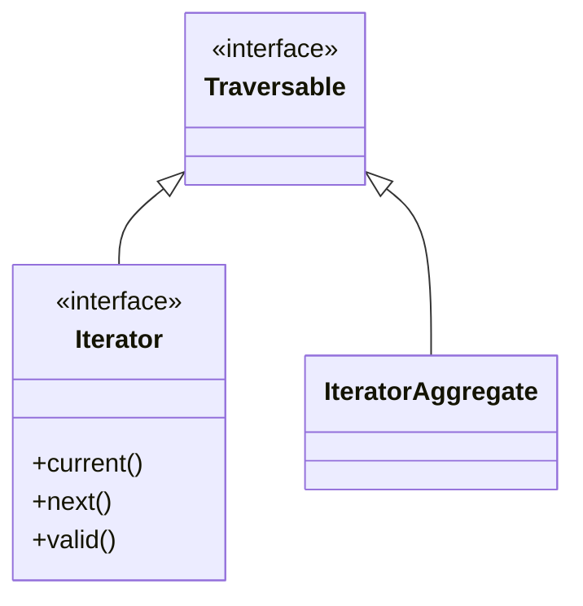

# Interfaces & Type Declarations

!!! tip "In a nutshell"
    Les interfaces sont de purs contrats, et une classe peut en implémenter
    plusieurs. Le point charnière de l'examen : lors d'une surcharge, **les types
    de retour sont covariants** (ils peuvent se restreindre) et **les types de
    paramètres sont contravariants** (ils peuvent s'élargir) — inversez-les et
    PHP produit une erreur fatale.

!!! example "Real-world analogy"
    Une interface est comme une offre d'emploi qui énonce un contrat : « renvoie un
    Vehicle, accepte un Dog ». Un candidat peut l'honorer en livrant quelque chose de
    plus spécifique — une Car particulière plutôt que n'importe quel Vehicle (un retour
    plus étroit, covariant) — et en acceptant n'importe quel Animal, pas seulement les
    chiens (un paramètre plus large, contravariant). Les deux préservent les attentes
    de chaque appelant. Inversez les règles — promettre moins que convenu au retour,
    ou exiger plus que convenu en entrée — et vous avez rompu le contrat, ce qui est
    exactement la raison pour laquelle PHP échoue fatalement.

!!! abstract "Learning objectives"
    À la fin de ce chapitre, vous saurez :

    - [ ] Déclarer des interfaces avec constantes typées et héritage multiple.
    - [ ] Expliquer les règles de **covariance** (retour) et de **contravariance** (paramètre).
    - [ ] Utiliser correctement les types union, intersection, DNF et `instanceof`.

    **Syllabus:** `PHP → Interfaces` ·
    **Level:** Advanced / Expert ·
    **Est. time:** 30 min ·
    **Prerequisites:** [OOP](oop.md)

---

## Pour les nuls

### L'idée en une phrase
Une interface est une promesse de forme ("j'aurai telle méthode qui prend tel type et rend tel autre type") — pas une implémentation.

### Imagine dans la vraie vie
Une offre d'emploi précise : "vous devrez livrer un rapport, et accepter n'importe quel type de dossier en entrée." Un candidat qui promet de livrer un rapport encore plus précis (un PDF signé, par exemple) respecte la promesse — il en fait "plus". Un candidat qui refuserait certains dossiers pourtant annoncés comme acceptés trahirait le contrat.

### Dans Symfony
Symfony s'appuie massivement sur les interfaces (`UserInterface`, `EventSubscriberInterface`...) : le framework n'a besoin de connaître que le contrat, jamais la classe concrète — c'est ce qui permet d'échanger une implémentation sans casser le reste de l'application.

### Exemple simple
```php
interface Notifieur {
    public function envoyer(string $message): bool;
}
class NotifieurEmail implements Notifieur {
    public function envoyer(string $message): bool { /* ... */ return true; }
}
```

### Comment le mémoriser 🧠
Le retour peut se **r**étrécir (covariance = plus précis, ok), le paramètre peut s'**é**largir (contravariance = plus tolérant, ok). Promettre moins au retour ou exiger plus en entrée casse le contrat — et PHP le refuse.


## Theory

Une **interface** est un contrat pur : des signatures de méthodes et des
constantes (implicitement `public` ; optionnellement **typées depuis 8.3**) sans
implémentation. Une classe peut implémenter **plusieurs** interfaces, et une
interface peut `extends` **plusieurs** interfaces parentes — c'est ainsi que PHP
obtient l'héritage multiple de *type* sans héritage multiple d'*état*.

```php
interface Timestamped
{
    public const string FORMAT = 'Y-m-d';  // constant: implicitly public, typed (8.3)

    public function touchedAt(): \DateTimeImmutable;  // signature only, no body
}

// An interface may extend SEVERAL parent interfaces…
interface Auditable extends Timestamped, \Stringable {}

// …and a class may implement MANY interfaces at once.
final class Invoice implements Timestamped, \Countable { /* ... */ }
```

| Feature | Interface | Abstract class |
|---|---|---|
| Héritage multiple | Oui | Non |
| Implémentation | Aucune (contrat seul) | Partielle autorisée |
| Propriétés | Non (constantes seulement) | Oui |
| Constructeur | Non | Oui |

!!! question "Predict first"
    Une méthode parente renvoie `Animal`. Une classe enfant la surcharge pour
    renvoyer `object` (plus large). Surcharge covariante légale, ou erreur fatale ?

??? note "Reveal"
    Erreur fatale. Les types de retour sont **covariants** — un enfant ne peut
    que *restreindre* (`Cat`), jamais élargir. Élargir romprait la
    substituabilité de Liskov, donc PHP le rejette à la compilation.

## Deep Dive — variance & type declarations

### Covariance & contravariance

Lors de la surcharge d'une méthode, PHP fait respecter le **principe de
substitution de Liskov** via des règles de variance :

- **Les types de retour sont covariants** — un enfant peut renvoyer un type
  *plus spécifique*.
- **Les types de paramètres sont contravariants** — un enfant peut accepter un
  type *plus général* (plus large).

```php
<?php
declare(strict_types=1);

interface AnimalShelter
{
    public function adopt(): object;      // returns object
}

class Animal {}
class Cat extends Animal {}

final class CatShelter implements AnimalShelter
{
    public function adopt(): Cat          // covariant: narrower return ✅
    {
        return new Cat();
    }
}
```

Élargir un type de retour ou restreindre un type de paramètre est une erreur
fatale, car cela romprait la substituabilité.



### Type declarations landscape

| Kind | Syntax | Notes |
|---|---|---|
| Scalaire | `int`, `float`, `string`, `bool` | Coercition sauf `strict_types=1` |
| Nullable | `?T` | Sucre pour `T|null` |
| Union | `A\|B` | La valeur correspond à **n'importe quel** membre |
| Intersection | `A&B` | L'objet implémente **tout** (interfaces seulement) |
| DNF | `(A&B)\|null` | Combine les deux, 8.2+ |
| `void` / `never` | — | Pas de retour / ne retourne jamais |
| `static` / `self` | — | LSB / classe déclarante |

```php
final class Repo
{
    public function flush(int $n, bool $force): void {}           // scalar + void
    public function maybe(?string $s): self { return $this; }     // ?T + self
    public function find(int|string $id): static { return $this; }// union + LSB
    public function walk(\Countable&\Traversable $c): void {}     // intersection
    public function dnf((\Countable&\Traversable)|null $c): never // DNF + never
    {
        throw new \LogicException('always throws');
    }
}
```

### `instanceof`

`instanceof` renvoie `true` pour la classe, ses parents et chaque interface
implémentée. Il fonctionne avec un nom de classe en variable et court-circuite
sur les non-objets (renvoie `false`, sans erreur).

```php
<?php
declare(strict_types=1);

use Symfony\Component\HttpFoundation\Response;

$r = new Response();
$r instanceof Response;                       // true
$r instanceof \Stringable;                    // false (Response isn't)
'x' instanceof Response;                       // false, no error
```

!!! note "Source reference"
    Symfony type des interfaces partout pour la substituabilité, par ex.
    `Symfony\Contracts\EventDispatcher\EventDispatcherInterface` —
    [symfony/symfony `8.0`](https://github.com/symfony/symfony/blob/8.0/src/Symfony/Contracts/EventDispatcher/EventDispatcherInterface.php).

## Configuration & code

=== "PHP Attributes"

    ```php
    <?php
    declare(strict_types=1);

    interface Identifiable
    {
        public const string PREFIX = 'ID-';   // typed constant (8.3)

        public function getId(): string;
    }

    interface Timestamped
    {
        public function touchedAt(): \DateTimeImmutable;
    }

    // Intersection type demands BOTH contracts.
    function audit(Identifiable&Timestamped $e): string
    {
        return $e->getId();
    }
    ```

## Best practices & anti-patterns

| ✅ Do | ❌ Avoid |
|---|---|
| Typer sur des interfaces | Typer sur des classes concrètes |
| Petites interfaces par rôle | Grosses interfaces « fourre-tout » |
| Retours covariants pour la spécificité | Élargir le type de retour d'un enfant |
| `instanceof` pour affiner le type | Comparer des chaînes avec `get_class() ===` |

## When (not) to use it / alternatives

- Utilisez une **interface** quand de nombreuses classes sans lien doivent
  partager un contrat, ou quand vous voulez un héritage multiple de type.
- Utilisez une **classe abstraite** ([abstract-classes.md](abstract-classes.md))
  quand vous avez aussi besoin d'un état partagé ou d'une implémentation
  partielle.

!!! danger "Certification traps"
    - Les types de retour sont **covariants** ; les types de paramètres sont
      **contravariants**. Les inverser est une erreur fatale.
    - Les types intersection n'acceptent **que des noms d'interfaces/classes**,
      pas des scalaires.
    - Les constantes d'interface peuvent être **surchargées** par les classes
      implémentantes, sauf si le type d'une constante typée serait violé.
    - `instanceof` sur un non-objet renvoie `false` — il ne lance rien.

!!! warning "Common mistakes"
    - Croire qu'une classe peut `extends` deux classes — seules les interfaces
      supportent l'héritage multiple.
    - Déclarer des propriétés dans une interface (illégal — constantes
      uniquement).

## Exercises

1. **(Advanced)** Concevez `Serializer` avec un `serialize(): string` et un
   sous-type qui renvoie `never` — est-ce légal ? Expliquez.
2. **(Expert)** Écrivez une fonction acceptant `(Countable&Traversable)|null`.

??? success "Solutions"

    **1.** Légal. `never` est le type *bottom* — une méthode qui ne retourne
    jamais (elle lance toujours ou termine le script) satisfait **n'importe
    quel** contrat de retour, donc `: never` est une surcharge covariante valide
    de `: string`.

    **2.**
    ```php
    <?php
    declare(strict_types=1);

    function total((\Countable&\Traversable)|null $c): int
    {
        return $c === null ? 0 : \count($c);
    }
    ```

## Certification questions

??? question "Q1. A child overrides a parent method returning `Animal`. Which return type is legal?"
    - [x] A. `Cat` (a subclass of Animal) — covariant ✅
    - [ ] B. `object` (wider)
    - [ ] C. `mixed`
    - [ ] D. `AnimalOrPlant` union that adds a type

    **Why:** Les retours sont covariants — l'enfant peut restreindre, pas
    élargir.
    **Ref:** [Covariance](https://www.php.net/manual/en/language.oop5.variance.php).

??? question "Q2. Intersection types (`A&B`) may combine…"
    - [ ] A. Any scalars and classes
    - [x] B. Only class/interface types ✅
    - [ ] C. Only scalars
    - [ ] D. Enums only

    **Why:** Les intersections exigent des types objet ; les scalaires ne sont
    pas autorisés.
    **Ref:** [Types](https://www.php.net/manual/en/language.types.declarations.php).

??? question "Q3. `'text' instanceof SomeClass` evaluates to…"
    - [ ] A. A `TypeError`
    - [x] B. `false` ✅
    - [ ] C. `true`
    - [ ] D. `null`

    **Why:** `instanceof` sur un non-objet renvoie simplement `false`.
    **Ref:** [instanceof](https://www.php.net/manual/en/language.operators.type.php).

??? question "Q4. Can one class implement two interfaces that declare the same method?"
    - [x] A. Yes, if it provides one compatible implementation ✅
    - [ ] B. No, it is always a conflict
    - [ ] C. Only with `insteadof`
    - [ ] D. Only for static methods

    **Why:** Des signatures identiques sont compatibles ; une seule
    implémentation satisfait les deux. **Ref:** [Interfaces](https://www.php.net/manual/en/language.oop5.interfaces.php).

## Key takeaways

- Retours covariants (restreindre), paramètres contravariants (élargir).
- Les interfaces offrent l'héritage multiple de type ; les classes abstraites non.
- Intersection = toutes les interfaces ; union = n'importe quel type ; DNF les combine.
- `instanceof` couvre la classe + les parents + les interfaces, `false` sur les non-objets.

## Last-minute revision

!!! tip "Cheat sheet"
    - Retour covariant, paramètre contravariant — l'inverse = erreur fatale.
    - `A&B` interfaces uniquement ; `(A&B)|null` = DNF (8.2).
    - Interface : constantes seulement (typées en 8.3), pas de propriétés, `extends` multiple.
    - `instanceof` ne lance jamais rien sur les non-objets.

## Connections

- **Dépend de :** [OOP](oop.md) — les interfaces reposent sur le modèle classes/visibilité.
- **Réutilisé dans :** [SPL](spl.md) — `Iterator`, `Countable` et `ArrayAccess` sont les interfaces que vous implémentez en pratique.
- **À ne pas confondre avec :** [Abstract Classes](abstract-classes.md) — contrat pur + héritage multiple vs état partagé + un seul parent.

## Official References
- [PHP: Interfaces](https://www.php.net/manual/en/language.oop5.interfaces.php)
- [PHP: Variance](https://www.php.net/manual/en/language.oop5.variance.php)
- [PHP: Type declarations](https://www.php.net/manual/en/language.types.declarations.php)
- [Symfony source — EventDispatcherInterface](https://github.com/symfony/symfony/blob/8.0/src/Symfony/Contracts/EventDispatcher/EventDispatcherInterface.php)

## Video references

!!! tip "Watch & learn"
    Voici des chaînes vidéo officielles, mises à jour en continu — cherchez-y
    « PHP & web security » pour consolider ce chapitre. Nous référençons des
    chaînes stables plutôt que des vidéos individuelles afin que les références
    ne périment jamais.

    - [SymfonyCasts screencasts](https://symfonycasts.com/tracks/symfony) — tutoriels scénarisés à suivre en codant.
    - [Symfony official YouTube](https://www.youtube.com/@SymfonyOfficial) — conférences et keynotes SymfonyCon.
    - [Official docs for this topic](https://symfony.com/doc/8.0/index.html) — certaines pages de la doc Symfony intègrent un screencast.

## Confidence check

Je suis prêt quand je peux :

- [ ] expliquer **pourquoi** les règles de variance existent (substituabilité de Liskov)
- [ ] implémenter plusieurs interfaces avec des déclarations de types intersection/DNF dans Symfony 8
- [ ] déboguer une erreur fatale due à un retour élargi ou un paramètre restreint
- [ ] repérer le piège : `instanceof` sur un non-objet (renvoie `false`, ne lance jamais rien)
- [ ] expliquer comment `instanceof` parcourt les parents et chaque interface implémentée

---

<small>Related: [OOP](oop.md) · [Abstract Classes](abstract-classes.md) · [PHP API](php-api.md)</small>
