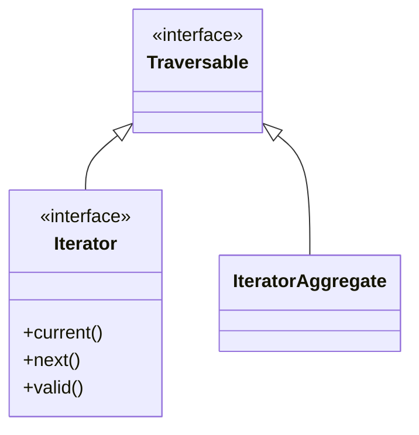

# Interfaces & Type Declarations

!!! tip "In a nutshell"
    Interfaces are pure contracts, and one class can implement many of them. The
    exam hinge: when overriding, **return types are covariant** (may narrow) and
    **parameter types are contravariant** (may widen) — reverse them and PHP fatals.

!!! abstract "Learning objectives"
    By the end of this chapter you can:

    - [ ] Declare interfaces with typed constants and multiple inheritance.
    - [ ] Explain **covariance** (return) and **contravariance** (parameter) rules.
    - [ ] Use union, intersection, DNF types and `instanceof` correctly.

    **Syllabus:** `PHP → Interfaces` ·
    **Level:** Advanced / Expert ·
    **Est. time:** 30 min ·
    **Prerequisites:** [OOP](oop.md)

---

## Theory

An **interface** is a pure contract: method signatures and constants (implicitly
`public`; optionally **typed since 8.3**) with no implementation. A class may implement
**many** interfaces, and an interface may `extends` **several** parent
interfaces — this is how PHP gets multiple inheritance of *type* without
multiple inheritance of *state*.

| Feature | Interface | Abstract class |
|---|---|---|
| Multiple inheritance | Yes | No |
| Implementation | None (contract only) | Partial allowed |
| Properties | No (constants only) | Yes |
| Constructor | No | Yes |

!!! question "Predict first"
    A parent method returns `Animal`. A child overrides it to return `object`
    (wider). Legal covariant override, or fatal error?

??? note "Reveal"
    Fatal error. Return types are **covariant** — a child may only *narrow*
    (`Cat`), never widen. Widening would break Liskov substitutability, so PHP
    rejects it at compile time.

## Deep Dive — variance & type declarations

### Covariance & contravariance

When overriding a method, PHP enforces the **Liskov Substitution Principle**
through variance rules:

- **Return types are covariant** — a child may return a *more specific* type.
- **Parameter types are contravariant** — a child may accept a *more general*
  (wider) type.

```php
<?php
declare(strict_types=1);

interface AnimalShelter
{
    public function adopt(): object;      // returns object
}

class Animal {}
class Cat extends Animal {}

final class CatShelter implements AnimalShelter
{
    public function adopt(): Cat          // covariant: narrower return ✅
    {
        return new Cat();
    }
}
```

Widening a return type or narrowing a parameter type is a fatal error, because
it would break substitutability.



### Type declarations landscape

| Kind | Syntax | Notes |
|---|---|---|
| Scalar | `int`, `float`, `string`, `bool` | Coerced unless `strict_types=1` |
| Nullable | `?T` | Sugar for `T|null` |
| Union | `A\|B` | Value matches **any** member |
| Intersection | `A&B` | Object implements **all** (interfaces only) |
| DNF | `(A&B)\|null` | Combine both, 8.2+ |
| `void` / `never` | — | No return / never returns |
| `static` / `self` | — | LSB / declaring class |

### `instanceof`

`instanceof` returns `true` for the class, its parents, and every implemented
interface. It works with a variable class name and short-circuits on non-objects
(returns `false`, no error).

```php
<?php
declare(strict_types=1);

use Symfony\Component\HttpFoundation\Response;

$r = new Response();
$r instanceof Response;                       // true
$r instanceof \Stringable;                    // false (Response isn't)
'x' instanceof Response;                       // false, no error
```

!!! note "Source reference"
    Symfony type-hints interfaces everywhere for substitutability, e.g.
    `Symfony\Contracts\EventDispatcher\EventDispatcherInterface` —
    [symfony/symfony `8.0`](https://github.com/symfony/symfony/blob/8.0/src/Symfony/Contracts/EventDispatcher/EventDispatcherInterface.php).

## Configuration & code

=== "PHP Attributes"

    ```php
    <?php
    declare(strict_types=1);

    interface Identifiable
    {
        public const string PREFIX = 'ID-';   // typed constant (8.3)

        public function getId(): string;
    }

    interface Timestamped
    {
        public function touchedAt(): \DateTimeImmutable;
    }

    // Intersection type demands BOTH contracts.
    function audit(Identifiable&Timestamped $e): string
    {
        return $e->getId();
    }
    ```

## Best practices & anti-patterns

| ✅ Do | ❌ Avoid |
|---|---|
| Type against interfaces | Type against concretions |
| Small, role-based interfaces | Fat "god" interfaces |
| Covariant returns for specificity | Widening a child's return type |
| `instanceof` for narrowing | `get_class() ===` string compares |

## When (not) to use it / alternatives

- Use an **interface** when many unrelated classes must share a contract or when
  you want multiple type inheritance.
- Use an **abstract class** ([abstract-classes.md](abstract-classes.md)) when you
  also need shared state or partial implementation.

!!! danger "Certification traps"
    - Return types are **covariant**; parameter types are **contravariant**.
      Reversing them is a fatal error.
    - Intersection types accept **only interfaces/class names**, not scalars.
    - Interface constants can be **overridden** by implementing classes unless a
      typed constant's type would be violated.
    - `instanceof` with a non-object returns `false` — it does not throw.

!!! warning "Common mistakes"
    - Thinking a class can `extends` two classes — only interfaces can be
      multiply inherited.
    - Declaring properties in an interface (illegal — constants only).

## Exercises

1. **(Advanced)** Design `Serializer` with a `serialize(): string` and a
   subtype that returns `never` — is that legal? Explain.
2. **(Expert)** Write a function accepting `(Countable&Traversable)|null`.

??? success "Solutions"

    **1.** Legal. `never` is the *bottom* type — a method that never returns
    (always throws or exits) satisfies **any** return contract, so `: never` is a
    valid covariant override of `: string`.

    **2.**
    ```php
    <?php
    declare(strict_types=1);

    function total((\Countable&\Traversable)|null $c): int
    {
        return $c === null ? 0 : \count($c);
    }
    ```

## Certification questions

??? question "Q1. A child overrides a parent method returning `Animal`. Which return type is legal?"
    - [x] A. `Cat` (a subclass of Animal) — covariant ✅
    - [ ] B. `object` (wider)
    - [ ] C. `mixed`
    - [ ] D. `AnimalOrPlant` union that adds a type

    **Why:** Returns are covariant — the child may narrow, not widen.
    **Ref:** [Covariance](https://www.php.net/manual/en/language.oop5.variance.php).

??? question "Q2. Intersection types (`A&B`) may combine…"
    - [ ] A. Any scalars and classes
    - [x] B. Only class/interface types ✅
    - [ ] C. Only scalars
    - [ ] D. Enums only

    **Why:** Intersections require object types; scalars are not allowed.
    **Ref:** [Types](https://www.php.net/manual/en/language.types.declarations.php).

??? question "Q3. `'text' instanceof SomeClass` evaluates to…"
    - [ ] A. A `TypeError`
    - [x] B. `false` ✅
    - [ ] C. `true`
    - [ ] D. `null`

    **Why:** `instanceof` on a non-object simply returns `false`.
    **Ref:** [instanceof](https://www.php.net/manual/en/language.operators.type.php).

??? question "Q4. Can one class implement two interfaces that declare the same method?"
    - [x] A. Yes, if it provides one compatible implementation ✅
    - [ ] B. No, it is always a conflict
    - [ ] C. Only with `insteadof`
    - [ ] D. Only for static methods

    **Why:** Identical signatures are compatible; a single implementation
    satisfies both. **Ref:** [Interfaces](https://www.php.net/manual/en/language.oop5.interfaces.php).

## Key takeaways

- Returns covariant (narrow), parameters contravariant (widen).
- Interfaces give multiple inheritance of type; abstract classes do not.
- Intersection = all interfaces; union = any type; DNF combines them.
- `instanceof` covers class + parents + interfaces, false on non-objects.

## Last-minute revision

!!! tip "Cheat sheet"
    - Covariant return, contravariant param — reverse = fatal error.
    - `A&B` interfaces only; `(A&B)|null` = DNF (8.2).
    - Interface: constants only (typed 8.3), no properties, multiple `extends`.
    - `instanceof` never throws on non-objects.

## Connections

- **Depends on:** [OOP](oop.md) — interfaces sit on top of the class/visibility model.
- **Reused in:** [SPL](spl.md) — `Iterator`, `Countable` and `ArrayAccess` are the interfaces you implement in practice.
- **Confused with:** [Abstract Classes](abstract-classes.md) — pure contract + multiple inheritance vs shared state + a single parent.

## Official References
- [PHP: Interfaces](https://www.php.net/manual/en/language.oop5.interfaces.php)
- [PHP: Variance](https://www.php.net/manual/en/language.oop5.variance.php)
- [PHP: Type declarations](https://www.php.net/manual/en/language.types.declarations.php)
- [Symfony source — EventDispatcherInterface](https://github.com/symfony/symfony/blob/8.0/src/Symfony/Contracts/EventDispatcher/EventDispatcherInterface.php)

## Confidence check

I'm ready when I can:

- [ ] explain **why** variance rules exist (Liskov substitutability)
- [ ] implement multiple interfaces with intersection/DNF type declarations in Symfony 8
- [ ] debug a fatal error from a widened return or a narrowed parameter
- [ ] spot the trick: `instanceof` on a non-object (returns `false`, never throws)
- [ ] explain how `instanceof` walks parents and every implemented interface

---

<small>Related: [OOP](oop.md) · [Abstract Classes](abstract-classes.md) · [PHP API](php-api.md)</small>
