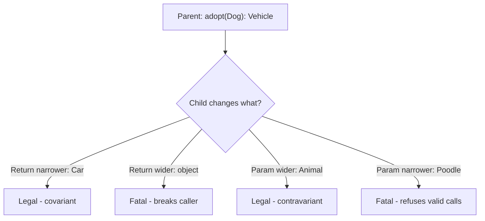

# Interfaces & Type Declarations

!!! tip "In a nutshell"
    Interfaces are pure contracts, and one class can implement many of them. The
    exam hinge: when overriding, **return types are covariant** (may narrow) and
    **parameter types are contravariant** (may widen) — reverse them and PHP fatals.
    Since PHP 8.4 an interface can also require **properties**, not just methods.

!!! example "Real-world analogy"
    An interface is like a job posting that states a contract: "returns a Vehicle,
    accepts a Dog." An applicant may honour it by delivering something more specific —
    a particular Car instead of any Vehicle (a narrower, covariant return) — and by
    agreeing to accept any Animal, not just dogs (a wider, contravariant parameter).
    Both keep every caller's expectations safe. Flip the rules — promise less than
    agreed on the return, or demand more than agreed on the input — and you have broken
    the contract, which is exactly why PHP fatals.

!!! abstract "Learning objectives"
    By the end of this chapter you can:

    - [ ] Declare interfaces with typed constants, property requirements and multiple inheritance.
    - [ ] Explain **covariance** (return) and **contravariance** (parameter) rules, and why properties are invariant.
    - [ ] Use union, intersection, DNF types and `instanceof` correctly.

    **Syllabus:** `PHP → Interfaces` ·
    **Level:** Advanced / Expert ·
    **Est. time:** 40 min ·
    **Prerequisites:** [OOP](oop.md)

    **Examen Symfony 8 :** OUI

---

## Prerequisites

You should already be comfortable with classes, visibility and inheritance from
[OOP](oop.md). Everything here targets **PHP 8.4**, which matters more than usual: two
of the rules below changed in 8.1 and 8.4 and are prime distractor material.

## The problem we are solving

Suppose a payment service must work with several providers. Type-hint the concrete
`StripeGateway` and the service is welded to Stripe — a second provider means editing the
service. What you actually depend on is a *shape*: "something I can call `charge()` on."

An interface names that shape so the dependency points at the contract, not the vendor:

```php
final class Checkout
{
    public function __construct(private PaymentGateway $gateway) {}
}
```

Any implementation now substitutes freely. That substitutability is the whole point — and
it is also why PHP polices override signatures so strictly. Every rule in this chapter
exists to keep the substitution safe.

## 🧠 Pour les nuls

**C'est quoi ?** Une interface est une **liste d'exigences sans code** : elle dit *quelles*
méthodes (et depuis PHP 8.4, quelles propriétés) une classe doit fournir, jamais *comment*.
Une classe qui `implements` une interface signe ce contrat.

**Pourquoi ça existe ?** Pour pouvoir **changer une pièce sans casser le reste**. Si ton
code exige « un objet qui sait encaisser un paiement » au lieu d'exiger « un objet Stripe »,
tu peux brancher PayPal demain sans toucher une ligne du code appelant.

**🏠 Analogie de la vraie vie :** La **prise électrique murale**. La prise ne définit pas ce
qu'est un appareil : elle impose une forme (deux trous, du 230 V). Grille-pain, lampe,
chargeur — tout ce qui respecte la forme fonctionne. La prise se moque de l'appareil, elle
n'exige que le contrat physique.

**Symfony dans la vraie vie :** Contrat de la prise → l'interface (`UserInterface`) /
Appareil branché → ta classe (`class User implements UserInterface`) / Le mur qui alimente →
Symfony, qui ne connaît jamais ta classe, seulement le contrat / Changer d'appareil sans
refaire l'installation → remplacer une implémentation sans toucher au framework.

**💻 Exemple Symfony extrêmement simple :**
```php
interface Notifier
{
    public function send(string $message): bool;   // la forme de la prise
}

final class EmailNotifier implements Notifier      // un appareil compatible
{
    public function send(string $message): bool { return true; }
}
```
Ligne 3 : l'exigence, sans corps — juste un point-virgule. Ligne 8 : la classe fournit le
corps. Si tu oublies `send()`, PHP refuse la classe **au chargement**, pas à l'exécution.

**🔍 Que se passe-t-il réellement ?**
1. PHP lit l'interface et retient la signature exigée.
2. PHP lit la classe et voit `implements Notifier`.
3. Il compare chaque méthode exigée à celle fournie.
4. Il vérifie la **variance** : le retour peut être plus précis, le paramètre plus large.
5. Si tout colle, la classe est chargée ; sinon → erreur fatale immédiate.
6. À l'exécution, `$obj instanceof Notifier` répond `true`.

**⚠️ Erreur fréquente :** croire qu'une interface peut contenir du code partagé. Non — elle
ne contient aucun corps de méthode. Dès qu'il te faut du code commun, c'est une
[classe abstraite](abstract-classes.md) qu'il te faut, et une classe ne peut en étendre
**qu'une seule**, alors qu'elle peut implémenter **autant d'interfaces que voulu**.

**🧠 Comment le mémoriser ?** *« L'interface décrit la prise, la classe fabrique
l'appareil. »* Et pour la variance : **le retour rétrécit, le paramètre s'élargit** —
donner plus, exiger moins.

## Build the mental model

Hold two ideas together and every rule below follows.

**One: an interface is a promise made to callers, not to implementers.** The caller was
promised "you will get at least a `Vehicle`". Handing back a `Car` keeps that promise —
a `Car` *is* a `Vehicle`. Handing back "any `object`" breaks it: the caller can no longer
rely on `Vehicle` behaviour.

**Two: parameters are the mirror image.** The caller was promised "you may pass a `Dog`".
An implementation accepting *any* `Animal` still honours that — every `Dog` is an `Animal`.
An implementation accepting only `Poodle` breaks it: a caller with a plain `Dog` is refused.

So the safe direction is always *be generous*: **give more specifically, demand more
loosely.** PHP enforces exactly this, and calls it covariance (returns) and contravariance
(parameters).



The diagram encodes one sentence: a child may **give more** and **ask for less**, never the
reverse. Both illegal branches are compile-time fatals, not runtime errors.

!!! info "PHP 8.4 reference"
    https://www.php.net/manual/en/language.oop5.variance.php

## Core concepts

An **interface** declares method signatures and constants (implicitly `public`; optionally
**typed since 8.3**) with no implementation. A class may implement **many** interfaces, and
an interface may `extends` **several** parents — this gives PHP multiple inheritance of
*type* without multiple inheritance of *state*.

```php
interface Timestamped
{
    public const string FORMAT = 'Y-m-d';  // constant: implicitly public, typed (8.3)

    public function touchedAt(): \DateTimeImmutable;  // signature only, no body
}

// An interface may extend SEVERAL parent interfaces…
interface Auditable extends Timestamped, \Stringable {}

// …and a class may implement MANY interfaces at once.
final class Invoice implements Timestamped, \Countable { /* ... */ }
```

| Feature | Interface | Abstract class |
|---|---|---|
| Multiple inheritance | Yes | No |
| Implementation | None (contract only) | Partial allowed |
| Properties | **Yes, as requirements (8.4+)** | Yes, with state |
| Constructor | No | Yes |

That properties row is the one most cheat sheets still get wrong — see
[All supported cases](#all-supported-cases-and-variations).

!!! info "PHP 8.4 reference"
    https://www.php.net/manual/en/language.oop5.interfaces.php

## Learn by doing

Build one contract and watch PHP police it. Each step changes exactly one thing.

**Step 1 — state the contract.** We want anything that can price a cart.

```php
interface Pricer
{
    public function price(Cart $cart): Money;
}
```

**Step 2 — satisfy it exactly.** A literal implementation compiles with no drama.

```php
final class FlatPricer implements Pricer
{
    public function price(Cart $cart): Money { return new Money(0); }
}
```

**Step 3 — narrow the return.** `TaxedMoney extends Money`, so this is *more* specific.

```php
public function price(Cart $cart): TaxedMoney   // still legal: covariant
```

PHP accepts it. Callers asked for `Money`; they get something that *is* a `Money`.

**Step 4 — widen the return, and watch it break.** Change it to `: object`:

```
Fatal error: Declaration of FlatPricer::price(Cart $cart): object must be
compatible with Pricer::price(Cart $cart): Money
```

Note *when* this appears: at **compile time**, the moment the class is loaded. No request
has to reach the method. That is why a variance mistake takes the whole app down rather
than failing one endpoint.

**Step 5 — widen the parameter.** `Cart extends Basket`, so accepting `Basket` is *looser*:

```php
public function price(Basket $cart): Money      // legal: contravariant
```

Legal, and often useful — the implementation just became reusable for plain baskets.

**Step 6 — narrow the parameter.** Ask for `PremiumCart` instead and PHP fatals again: a
caller holding an ordinary `Cart` would be turned away, and the contract said it wouldn't be.

The pattern to carry into the exam: **the direction that makes the implementation more
useful to callers is always the legal one.**

## How Symfony handles it

Symfony is built on this substitutability, which is why nearly every extension point is an
interface rather than a base class. `EventDispatcherInterface` is the canonical case: the
framework depends on the contract, so you can decorate or replace the dispatcher without
the container caring.

```php
public function __construct(
    private EventDispatcherInterface $dispatcher,   // contract, not concretion
) {}
```

The container resolves interfaces by autowiring: bind `PaymentGateway` to one service and
every constructor asking for that interface receives it — the reason
[dependency injection](../dependency-injection/autowiring.md) type-hints interfaces.

!!! note "Symfony 8.0 source reference"
    https://github.com/symfony/symfony/blob/8.0/src/Symfony/Contracts/EventDispatcher/EventDispatcherInterface.php

## How it works internally

Interface compliance is checked when the class is **linked** — at compile time for a plain
class, at autoload time in a Symfony app. The engine walks every method the interface
requires and compares signatures pairwise: parameter types must be *equal or wider*, the
return type *equal or narrower*.

Three consequences follow, and each is examinable:

- **Failures are fatal, not catchable in the ordinary sense.** A variance error is raised
  while loading the class, before any of your code runs.
- **`instanceof` is a cheap pointer check at runtime.** Once linking succeeded, the class
  carries its full interface set, so `instanceof` walks parents and interfaces without
  re-deriving anything.
- **Adding a method to a published interface is a breaking change.** Every implementer
  fails to link. This is precisely why Symfony's own
  [BC promise](../architecture/bc-promise.md) forbids it in a minor release.

## All supported cases and variations

### Interface properties (PHP 8.4)

This is the newest rule and the one most likely to appear as a distractor. **As of PHP
8.4.0, interfaces may declare properties.** The declaration must state whether the property
must be readable, writeable, or both:

```php
interface I
{
    public string $readable { get; }        // implementer must expose a public read
    public string $writeable { set; }       // implementer must expose a public write
    public string $both { get; set; }       // both required
}
```

An implementing class may satisfy these in several ways: a plain public property, a
**virtual property** implementing only the requested hook, or — for a read-only
requirement — a `readonly` property. One asymmetry is worth memorising: an interface
property that is **settable may not be satisfied by a `readonly` property**, because
`readonly` forbids the write the contract demands.

```php
final class C implements I
{
    public string $readable { get => strtoupper($this->writeable); }  // virtual, get only
    public string $writeable = '';                                    // plain public
    public string $both = '';                                         // plain public
}
```

!!! info "PHP 8.4 reference"
    https://www.php.net/manual/en/language.oop5.interfaces.php

### Property variance

Properties are **invariant by default**, and the reason is worth understanding rather than
memorising: a read is a "get" operation, which would need covariance; a write is a "set"
operation, which would need contravariance. Only invariance satisfies both at once.

PHP 8.4 changes this exactly where the ambiguity disappears: an **abstract or virtual
property that requires only `get`** may be covariant, and one requiring only `set` may be
contravariant. The moment a property has both operations it is invariant again.

!!! info "PHP 8.4 reference"
    https://www.php.net/manual/en/language.oop5.variance.php

### Satisfying two interfaces with different signatures

A class may implement two interfaces declaring the *same* method with *different* types,
provided one signature satisfies both variance rules simultaneously. This example is
straight from the manual and is excellent exam material:

```php
class Foo {}
class Bar extends Foo {}

interface A { public function myfunc(Foo $arg): Foo; }
interface B { public function myfunc(Bar $arg): Bar; }

class MyClass implements A, B
{
    public function myfunc(Foo $arg): Bar { return new Bar(); }
}
```

It links because the parameter `Foo` is wide enough for both (contravariance) and the return
`Bar` is narrow enough for both (covariance). Reverse either and it fails.

### Type declarations landscape

| Kind | Syntax | Since | Notes |
|---|---|---|---|
| Scalar | `int`, `float`, `string`, `bool` | 7.0 | Coerced unless `strict_types=1` |
| Nullable | `?T` | 7.1 | Sugar for `T\|null` |
| Union | `A\|B` | 8.0 | Value matches **any** member |
| Intersection | `A&B` | **8.1** | Object satisfies **all**; class types only |
| `never` | — | **8.1** | Return-only; bottom type |
| DNF | `(A&B)\|null` | **8.2** | Union of intersections |
| Standalone `null` / `false` / `true` | — | 8.2 | Usable alone |
| `static` / `self` | — | — | LSB / declaring class |

Two errors the engine raises by name: using a **non-class type inside an intersection** is
an error, and using `mixed` or `never` as an intersection member is an error.

!!! info "PHP 8.4 reference"
    https://www.php.net/manual/en/language.types.declarations.php

## Configuration & code

=== "PHP Attributes"

    ```php
    <?php
    declare(strict_types=1);

    interface Identifiable
    {
        public const string PREFIX = 'ID-';   // typed constant (8.3)

        public function getId(): string;
    }

    interface Timestamped
    {
        public function touchedAt(): \DateTimeImmutable;
    }

    // Intersection type demands BOTH contracts.
    function audit(Identifiable&Timestamped $e): string
    {
        return $e->getId();
    }
    ```

=== "Console"

    ```console
    $ php -l src/Contract/Pricer.php
    $ php bin/console debug:container --tag=kernel.event_subscriber
    ```

## Execution flow

1. The engine encounters `class C implements I`.
2. `I` is resolved (autoloaded if needed).
3. Every method `I` requires is looked up on `C`, including inherited ones.
4. Each signature is compared: parameters equal-or-wider, return equal-or-narrower.
5. Property requirements (8.4) are checked for the demanded `get` / `set` operations.
6. Constants are merged; `C` may override an interface constant **since 8.1**.
7. Linking succeeds and `C` records `I` in its interface set — or fatals here.
8. At runtime `instanceof I` is a set membership test against that recorded set.

## Default behavior

- Interface methods are **implicitly `public`**; writing `public` is optional and any other
  visibility is an error.
- Interface constants are implicitly `public`, and **overridable by implementers since PHP
  8.1.0** (before that, overriding was forbidden).
- An interface has no constructor, so it cannot constrain construction.
- An abstract class may implement *part* of an interface and leave the rest to children.
- `instanceof` returns `false` for a non-object left operand; it does not throw.

## Edge cases

- **`never` as an override.** A method declared `: never` legally overrides `: string`.
  `never` is the bottom type: a function that always throws or exits satisfies every return
  contract vacuously.
- **`instanceof` with a variable class name.** `$obj instanceof $className` works with a
  string variable, but the bare literal `'Foo' instanceof Bar` is `false`, never an error.
- **Interface constant collision.** Implementing two interfaces that declare the *same*
  constant with different values is a fatal error unless the class defines its own.
- **`readonly` versus a settable interface property.** A `readonly` property cannot satisfy
  a `{ set; }` requirement, though it can satisfy `{ get; }`.
- **Adding a default-valued parameter** to an implementation is allowed: extra optional
  parameters do not break the contract, since every original call still type-checks.

## Common confusions

| These look alike | The distinction |
|---|---|
| Covariance vs contravariance | Covariance = **return**, may narrow. Contravariance = **parameter**, may widen. |
| `A\|B` vs `A&B` | Union = matches **any** one. Intersection = satisfies **all**, class types only. |
| Interface vs abstract class | Contract + multiple inheritance vs shared state + one parent. |
| `never` vs `void` | `void` returns nothing and *does* return. `never` never returns at all. |
| Interface property vs class property | The interface requires an **operation** (`get`/`set`); it stores nothing. |
| `implements` vs `extends` (interfaces) | A class `implements`; an interface `extends` other interfaces. |

## Best practices & anti-patterns

| ✅ Do | ❌ Avoid |
|---|---|
| Type against interfaces | Type against concretions |
| Small, role-based interfaces | Fat "god" interfaces |
| Covariant returns for specificity | Widening a child's return type |
| `instanceof` for narrowing | `get_class() ===` string compares |
| Add a *new* interface for new behaviour | Adding a method to a published interface |

## Certification traps

!!! danger "Certification traps"
    - Return types are **covariant**; parameter types are **contravariant**. Reversing them
      is a **compile-time fatal**, not a runtime error.
    - Intersection types accept **only class/interface types** — a scalar member is an error,
      and so are `mixed` and `never`.
    - Interface constants **can** be overridden by implementers — but only **since PHP 8.1.0**.
      A question set on older behaviour is testing the version, not the concept.
    - **PHP 8.4 interfaces may declare properties.** "Interfaces cannot have properties" is
      now a false statement, and a favourite distractor.
    - `instanceof` on a non-object returns `false` — it never throws.
    - Properties are invariant *by default*; only get-only or set-only abstract/virtual
      properties (8.4) may vary.

## Common mistakes

!!! warning "Common mistakes"
    - Expecting a class to `extends` two classes — only interfaces are multiply inherited.
    - Declaring a **stateful** property in an interface: 8.4 lets you require an
      operation (`{ get; }`), not store a value or set a default.
    - Assuming a variance fatal surfaces at call time; it surfaces when the class loads.
    - Using `get_class($x) === Foo::class` where `instanceof` was meant — the former
      rejects subclasses.

## Debugging and troubleshooting

Read the fatal literally — it names both signatures:

```
Declaration of FlatPricer::price(Cart $cart): object must be
compatible with Pricer::price(Cart $cart): Money
```

The rule for reading it: the **left** side is yours, the **right** side is the contract. Ask
which side is wider. If your *return* is wider → covariance violation. If your *parameter*
is narrower → contravariance violation.

Useful checks:

- `php -l <file>` catches syntax, **not** variance — variance needs the class to load.
- `class_implements($obj)` lists every interface actually recorded, including inherited ones.
- In Symfony, `php bin/console debug:container <id>` shows what an interface resolved to.

## Performance and security considerations

`instanceof` and interface dispatch are effectively free — the interface set is computed once
at link time, so runtime checks are set lookups, not searches. Prefer `instanceof` to
string comparisons of class names: it is both faster and correct for subclasses.

The security angle is narrower but real: type declarations are a **validation boundary**. A
parameter typed `UserInterface` cannot silently receive an array from untrusted input under
`declare(strict_types=1)`. Relying on coercive mode instead lets `"0"` arrive where an `int`
was intended — see [Web security fundamentals](web-security.md).

## Key takeaways

- Returns covariant (narrow), parameters contravariant (widen); violations are fatal at load.
- Interfaces give multiple inheritance of type; abstract classes do not.
- Intersection = all, class types only; union = any; DNF combines them (8.2).
- Interface constants are overridable since 8.1; interfaces may require properties since 8.4.
- `instanceof` covers class + parents + interfaces, and is `false` on non-objects.

## Expert takeaways

- Variance is not a style rule — it is the engine enforcing Liskov substitutability, which is
  why the failure is a link-time fatal rather than a runtime exception.
- Properties are invariant because reads want covariance and writes want contravariance; 8.4
  relaxes this only where one of the two operations is absent.
- One signature can satisfy two interfaces with different types simultaneously, if it is
  contravariant enough for both parameters and covariant enough for both returns.
- Adding a method to a published interface breaks every implementer at load time — the
  concrete reason Symfony's BC promise treats interfaces as frozen.

## Last-minute revision

!!! tip "Cheat sheet"
    - Covariant return, contravariant param — reverse = fatal error at class load.
    - `A&B` class types only; `(A&B)|null` = DNF (8.2); `never` return-only (8.1).
    - Interface: constants (typed 8.3, overridable 8.1), **properties 8.4**, multiple `extends`.
    - `instanceof` never throws on non-objects.
    - `readonly` satisfies `{ get; }` but never `{ set; }`.

## Connections

- **Depends on:** [OOP](oop.md) — interfaces sit on top of the class/visibility model.
- **Reused in:** [SPL](spl.md) — `Iterator`, `Countable` and `ArrayAccess` are the interfaces you implement in practice.
- **Confused with:** [Abstract Classes](abstract-classes.md) — pure contract + multiple inheritance vs shared state + a single parent.

## Continue your learning

1. **[Guided exercises](interfaces-exercises.md)** — build the contract, break it deliberately, and read the fatals.
2. **[Topic exam](interfaces-exam.md)** — every certification question for this topic, answers hidden.
3. **[Flashcards](interfaces-flashcards.md)** — active recall on variance, type syntax and the 8.1/8.4 changes.

## Official References

- [PHP: Interfaces](https://www.php.net/manual/en/language.oop5.interfaces.php)
- [PHP: Variance](https://www.php.net/manual/en/language.oop5.variance.php)
- [PHP: Type declarations](https://www.php.net/manual/en/language.types.declarations.php)
- [PHP: Property hooks](https://www.php.net/manual/en/language.oop5.property-hooks.php)
- [Symfony source — EventDispatcherInterface](https://github.com/symfony/symfony/blob/8.0/src/Symfony/Contracts/EventDispatcher/EventDispatcherInterface.php)

## Video references

!!! tip "Watch & learn"
    These are official, continuously-updated video channels — search them for
    "PHP interfaces variance" to reinforce this chapter. We link stable channels rather than
    individual videos so the references never rot.

    - [SymfonyCasts screencasts](https://symfonycasts.com/tracks/symfony) — scripted, code-along tutorials.
    - [Symfony official YouTube](https://www.youtube.com/@SymfonyOfficial) — SymfonyCon conference talks & keynotes.
    - [Official docs for this topic](https://symfony.com/doc/8.0/index.html) — some Symfony doc pages embed a screencast.

## Confidence check

I'm ready when I can:

- [ ] explain **why** variance rules exist (Liskov substitutability)
- [ ] implement multiple interfaces with intersection/DNF type declarations in Symfony 8
- [ ] debug a fatal error from a widened return or a narrowed parameter
- [ ] state what changed for interface constants in 8.1 and interface properties in 8.4
- [ ] explain why properties are invariant, and the one 8.4 exception

---

<small>Related: [OOP](oop.md) · [Abstract Classes](abstract-classes.md) · [PHP API](php-api.md)</small>
