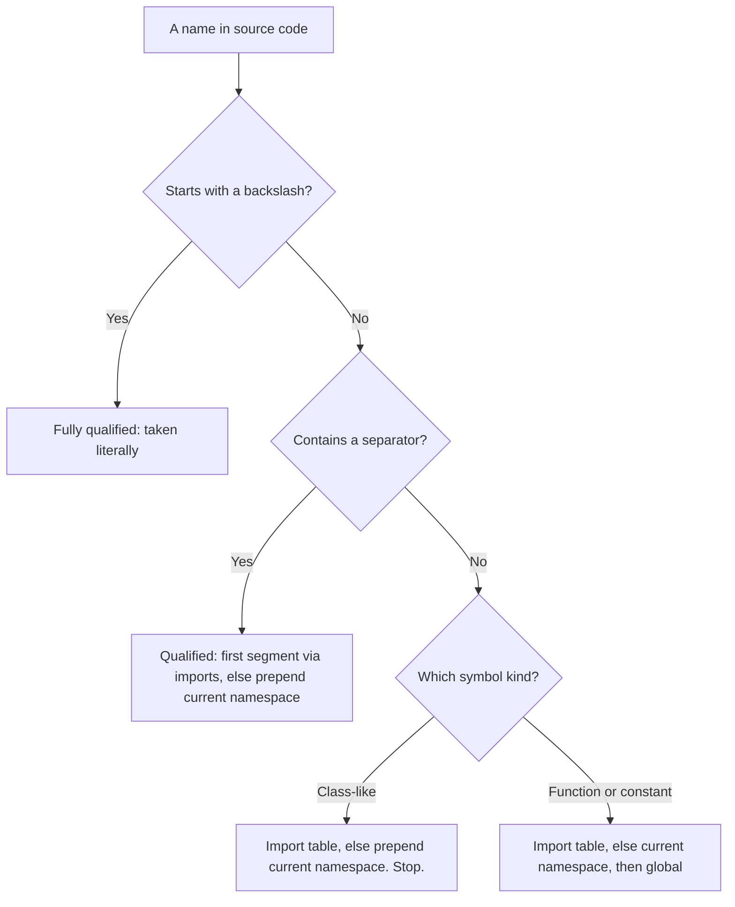
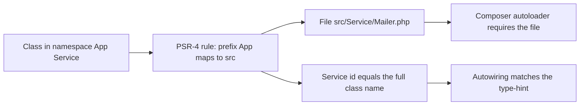
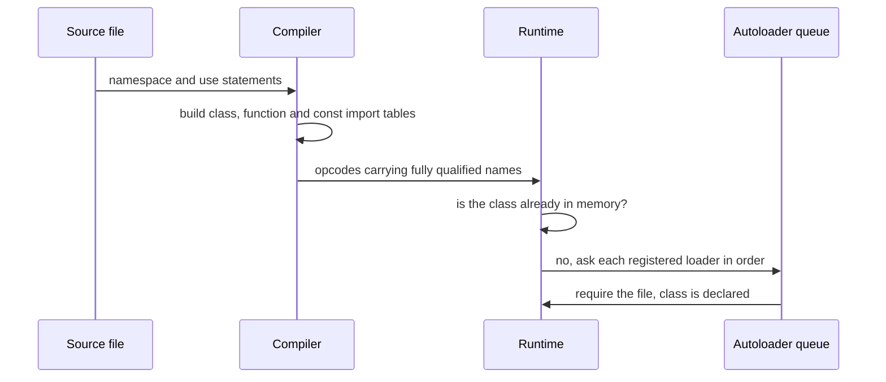

# Namespaces & Autoloading

!!! tip "In a nutshell"
    A namespace is a prefix that makes a name unique; PSR-4 turns that prefix into a
    directory so Composer can find the file without a single `require`. The rule that
    decides most exam questions: unqualified **function** and **constant** names fall
    back to the global namespace, **class names never do**. And `use` is a compile-time
    nickname — it loads nothing.

!!! example "Real-world analogy"
    A namespace is a full postal address. Two people named "John Smith" are told apart by
    street and city, just as `App\Service\Mailer` never clashes with `Acme\Mail\Mailer`.
    PSR-4 is the filing rule that maps a department name to a physical drawer, so the clerk
    — the autoloader — finds the folder without you ever quoting the path. And the fallback
    quirk fits the metaphor exactly: everyday *services* (calling `strlen`) fall back to the
    town's central switchboard when the local office has none, but a *proper name* like
    `DateTimeImmutable` never does. A person has one address, and you must give it in full.

!!! abstract "Learning objectives"
    By the end of this chapter you can:

    - [ ] Classify any name as unqualified, qualified, fully qualified or relative, and
          resolve it by the manual's rules.
    - [ ] Explain why functions and constants fall back to the global namespace while
          classes do not, and use `\`, `use`, `use function` and `use const` accordingly.
    - [ ] Predict what `use` does *not* do — no I/O, no autoload, no effect on dynamic names.
    - [ ] Map a class name to a file with PSR-4, and reason about `autoload` versus
          `autoload-dev`, `--optimize` and `--classmap-authoritative`.
    - [ ] Explain how Symfony turns `App\` → `src/` into service ids, and read the
          container exception raised when a namespace and a path disagree.

    **Syllabus:** `PHP → Namespaces` ·
    **Level:** Advanced / Expert ·
    **Est. time:** 40 min ·
    **Prerequisites:** [OOP](oop.md)

    **Examen Symfony 8 :** NO — namespaces are not one of the nine official PHP subtopics
    listed in [PHP & Web Security](index.md). This chapter is kept as a prerequisite and
    enrichment: every other PHP and Symfony chapter assumes you can read a `use` block and
    know why a service id looks like a class name.

---

## Prerequisites

You should be comfortable with classes, interfaces and static calls from [OOP](oop.md).
Everything here targets **PHP 8.4** and **Symfony 8.0** — the version matters for one
detail in particular: since PHP 8.0 an undefined constant throws an `Error` rather than
degrading to a bare-word string, and a lot of namespace material still describes the old
behaviour.

## The problem we are solving

Two libraries both want a class called `Mailer`. In a world without namespaces, the second
one to be loaded is a fatal "cannot declare class, the name is already in use". The
historical workaround was to invent long unique names by hand — `Zend_Mail_Transport_Smtp`,
`Swift_Mailer` — which fixed collisions and made every file unreadable.

Namespaces solve both halves at once. The manual states the two goals explicitly: prevent
**name collisions** between your code and internal PHP or third-party code, and provide the
ability to **alias or shorten** those long names. That is why `use … as …` is part of the
feature and not an afterthought:

```php
<?php
declare(strict_types=1);

namespace App\Notification;

use Acme\Mail\Mailer as AcmeMailer;

final class Dispatcher
{
    public function __construct(
        private Mailer $ours,          // App\Notification\Mailer
        private AcmeMailer $theirs,    // Acme\Mail\Mailer
    ) {
    }
}
```

Both `Mailer` classes coexist, and both are readable in the same constructor.

The second problem is mechanical: something must turn `App\Notification\Mailer` into a file
on disk. That is **autoloading**, and PSR-4 is the convention that makes the translation a
pure string operation.

!!! info "PHP 8.4 reference"
    https://www.php.net/manual/en/language.namespaces.rationale.php

## 🧠 Pour les nuls

**C'est quoi ?** Un namespace est un **préfixe de nom**. La classe que tu écris s'appelle
`Mailer`, mais son vrai nom complet est `App\Service\Mailer`. Un namespace n'est ni un
dossier, ni un fichier, ni un module : c'est simplement la partie gauche du nom.
L'autoloading, lui, est le mécanisme qui traduit ce nom complet en chemin de fichier pour
que PHP charge la classe tout seul.

**Pourquoi ça existe ?** Parce que deux bibliothèques différentes veulent souvent la même
classe `Mailer`, `Logger` ou `Client`. Sans préfixe, la deuxième déclaration plante. Avant
les namespaces, on écrivait `Zend_Mail_Transport_Smtp` à la main : ça marchait, mais c'était
illisible. Le namespace automatise ce préfixe, et le `use` permet de retrouver un nom court
en haut du fichier.

**🏠 Analogie de la vraie vie :** L'**adresse postale**. Il existe des dizaines de « Jean
Dupont » ; ce qui les distingue, c'est `12 rue des Lilas, Lyon`. Le nom court suffit *dans
le quartier*, mais dès qu'une lettre part d'une autre ville, il faut l'adresse complète. Le
bloc `use` en haut du fichier, c'est le carnet d'adresses : l'adresse complète est écrite
une seule fois, puis on dit « Jean » dans tout le reste de la lettre. Et le point clé : le
facteur — l'autoloader — sait où livrer **parce que l'adresse suit un plan de rues
officiel**. Ce plan, c'est PSR-4.

**Symfony dans la vraie vie :** Symfony déclare dans `composer.json` que le préfixe `App\`
correspond au dossier `src/`. Quand le code demande `App\Controller\HomeController`,
l'autoloader retire `App\`, remplace les `\` par des `/`, ajoute `.php`, et charge
`src/Controller/HomeController.php`. Mieux : le conteneur de services utilise le **nom
complet de la classe comme identifiant de service**, et l'autowiring cherche un service dont
l'identifiant correspond exactement au type déclaré. Le namespace n'est donc pas décoratif
dans Symfony : il est à la fois le chemin du fichier, l'identifiant du service et la clé de
l'autowiring.

**💻 Exemple minimal :**
```php
<?php
namespace App\Service;      // ligne 2 : le préfixe

class Mailer {}             // ligne 4 : nom complet = App\Service\Mailer
```
Ligne 2 : tout ce que ce fichier déclare ensuite porte ce préfixe. Ligne 4 : la classe
s'appelle réellement `App\Service\Mailer`, et son fichier doit être
`src/Service/Mailer.php` pour que Composer la trouve.

**🔍 Que se passe-t-il réellement ?**
1. À la **compilation**, PHP lit le `namespace` et les `use` du fichier, et remplit trois
   tables d'import : classes, fonctions, constantes.
2. Chaque nom court écrit dans le fichier est traduit en nom complet à ce moment-là. Un
   `use` ne lit aucun fichier et ne charge rien : c'est un simple renommage.
3. À l'**exécution**, quand PHP rencontre pour la première fois `new App\Service\Mailer()`,
   il constate que la classe n'est pas encore chargée.
4. Il parcourt alors la file des autoloaders enregistrés par `spl_autoload_register()`,
   dans leur ordre d'enregistrement.
5. L'autoloader de Composer applique la règle PSR-4 et fait un `require` du bon fichier.
6. La classe existe désormais en mémoire ; les références suivantes ne relancent rien.

**⚠️ Erreur fréquente du débutant :** écrire `new DateTime()` à l'intérieur d'un namespace
et s'attendre à obtenir la classe globale. Les **noms de classes ne retombent jamais** dans
l'espace global : PHP cherche `App\Service\DateTime`, ne le trouve pas, et lève
`Error: Class "App\Service\DateTime" not found`. Il faut écrire `new \DateTime()` ou ajouter
`use DateTime;`. Et pourtant `strlen('hi')` fonctionne sans rien ajouter, parce que les
**fonctions**, elles, retombent bien dans l'espace global. Cette asymétrie surprend tout le
monde une fois — et une seule, si elle est comprise ici.

**🧠 Comment le mémoriser ?** *« Les verbes retombent, les noms propres non. »* Ce qu'on
**appelle** (les fonctions) et ce qu'on **lit** (les constantes) redescendent vers l'espace
global ; ce qu'on **nomme** (les classes) doit porter son adresse complète. Et pour le
`use` : *« un surnom, pas une livraison »*.

## Build the mental model

Two ideas carry the whole chapter.

**One: a name is resolved by its shape, not by your intention.** PHP looks at whether the
name contains a separator, and whether it starts with one, and applies a different rule for
each shape. The manual uses a filesystem analogy that is worth memorising literally:

| Name shape | Example | Filesystem equivalent | Resolution |
|---|---|---|---|
| Unqualified | `Foo` | `foo.txt` | Import table for this symbol kind, else current namespace |
| Qualified | `Sub\Foo` | `subdir/foo.txt` | First segment via import table, else current namespace prepended |
| Fully qualified | `\Sub\Foo` | `/main/foo.txt` | Taken literally; imports never apply |
| Relative | `namespace\Foo` | `./foo.txt` written out | `namespace` replaced by the current namespace |

The trap hidden in that table is that **qualified is still relative**. Inside
`namespace App\Reporting;`, the name `Reporting\Formatter` resolves to
`App\Reporting\Reporting\Formatter`, not to what you meant.

**Two: PHP maintains three separate import tables.** Classes (with interfaces, traits and
enums), functions, and constants each have their own. `use C\E as F;` fills only the class
table, so a call `F()` is completely unaffected by it.



Read the diagram as one question asked three times: *what shape is the name*, then *which
table applies*, then — only for functions and constants — *is there a global fallback*. The
class branch ends without a fallback, and that missing branch is the most examined fact in
this chapter.

!!! info "PHP 8.4 reference"
    https://www.php.net/manual/en/language.namespaces.basics.php

## Core concepts

A **namespace** is a hierarchical prefix declared with the `namespace` keyword. Only four
kinds of symbol are affected by it: classes (including abstract classes, traits and enums),
interfaces, functions and constants. Variables are not.

```php
<?php
declare(strict_types=1);

namespace MyProject\Sub\Level;

const CONNECT_OK = 1;          // MyProject\Sub\Level\CONNECT_OK

class Connection {}            // MyProject\Sub\Level\Connection

function connect(): void {}    // MyProject\Sub\Level\connect
```

Three properties of the declaration matter:

- The `namespace` statement must come **first** in the file. The only construct allowed
  before it is `declare`.
- Sub-namespaces are expressed by writing the full hierarchical name, never by nesting.
- Unlike any other PHP construct, **the same namespace may be declared in many files** —
  which is exactly what lets one namespace correspond to a whole directory tree.

**Importing** is done with `use`, in three flavours matching the three tables:

```php
<?php
declare(strict_types=1);

namespace App\Service;

use App\Contract\MailerInterface;          // class-like
use App\Contract\Transport as Tx;          // aliased
use function App\Support\slugify;          // function
use const App\Support\VERSION;             // constant
use App\Contract\{Clock, Envelope};        // group use

final class Mailer implements MailerInterface
{
    public function send(Tx $transport, Clock $clock): string
    {
        return slugify(VERSION) . '@' . $clock->now()->format('c');
    }
}
```

!!! info "PHP 8.4 reference"
    https://www.php.net/manual/en/language.namespaces.importing.php

## Learn by doing

Start from the smallest thing that can go wrong, and fix it two ways.

```php
<?php
// lint-skip — intentional failure, fixed just below
declare(strict_types=1);

namespace App\Support;

$when = new DateTimeImmutable('2026-01-01');
```

Running it gives:

```text
PHP Fatal error: Uncaught Error: Class "App\Support\DateTimeImmutable" not found
```

Read the message literally: PHP did not "fail to find `DateTimeImmutable`", it failed to
find `App\Support\DateTimeImmutable`. The current namespace was prepended, because
unqualified class names have no global fallback. Two fixes, both correct:

```php
<?php
declare(strict_types=1);

namespace App\Support;

$a = new \DateTimeImmutable('2026-01-01');   // fix 1: fully qualified
```

```php
<?php
declare(strict_types=1);

namespace App\Support;

use DateTimeImmutable;                       // fix 2: import it

$b = new DateTimeImmutable('2026-01-01');
```

Now change one word and watch the rule flip:

```php
<?php
declare(strict_types=1);

namespace App\Support;

echo strlen('hello'), "\n";   // prints 5 — no import, no backslash, works
```

Nothing was imported here either, yet it works, because `strlen` is a **function**: PHP
tried `App\Support\strlen()`, did not find it, and fell back to the global one. Define a
`function strlen()` inside the namespace and the very same call silently starts using yours
— which is precisely why library code writes `\strlen()`.

!!! info "PHP 8.4 reference"
    https://www.php.net/manual/en/language.namespaces.fallback.php

## How Symfony handles it

Symfony leans on namespaces harder than most frameworks, because in a Symfony application
the fully-qualified class name serves as three keys at once.

The skeleton's `composer.json` declares one production rule and one development rule:

```json
{
    "autoload": {
        "psr-4": { "App\\": "src/" }
    },
    "autoload-dev": {
        "psr-4": { "App\\Tests\\": "tests/" }
    }
}
```

The default `config/services.yaml` then imports every class under `src/` as a service:

```yaml
services:
    _defaults:
        autowire: true
        autoconfigure: true

    App\:
        resource: '../src/'
```

The documentation's own comment on that block is the sentence to remember: it "creates a
service per class whose id is the fully-qualified class name". Autowiring then does the
obvious thing — it "looks for a service whose id exactly matches the type-hint". So the
namespace you choose *is* the container key, and a type-hint is a lookup by that key.

Autoconfiguration works on the class rather than on the name: it inspects what a class
implements, or which attributes it carries, and applies tags accordingly. But it only ever
sees classes that discovery found, and discovery is driven by the `App\` prefix.



The diagram makes the coupling explicit: one prefix rule feeds two independent consumers.
Composer answers "given this **name**, which **file**?" while Symfony's service discovery
answers "given this **file**, which **name** should it contain?". They agree only when the
namespace and the directory layout agree.

!!! info "Official Symfony 8.0 reference"
    https://symfony.com/doc/8.0/service_container.html

!!! note "Symfony 8.0 source reference"
    https://github.com/symfony/symfony/blob/8.0/src/Symfony/Component/DependencyInjection/Loader/FileLoader.php

## How it works internally

Resolution happens in two distinct phases, and almost every confusing behaviour in this
chapter comes from mixing them up.

**Compile time.** The compiler reads `namespace` and every `use` in the file and builds the
three import tables. Then, for each *literal* name in the source, it applies the resolution
rules and stores the resulting fully-qualified name in the opcodes. `Mailer::class` is
resolved here, which is why it yields the full `App\Service\Mailer` string. A `use` produces
no runtime instruction at all.

**Runtime.** Two things are deferred. First, unqualified **function and constant** names
outside the global namespace are resolved at runtime — the manual says so explicitly —
because the engine cannot know at compile time whether a namespaced function will have been
defined by then. Second, class loading: when a class name is first needed and is not in
memory, the engine walks the queue built by `spl_autoload_register()`, in registration
order, until one loader declares the class.



Notice what is absent from the sequence: the `use` statement never touches the autoloader
queue. Everything it does happens in the second step, before a single line has run.

!!! info "PHP 8.4 reference"
    https://www.php.net/manual/en/function.spl-autoload-register.php

### PSR-4, precisely

PSR-4 maps a **namespace prefix** to a **base directory**. Composer's own description of the
transformation is the one to memorise: a prefix `Foo\` pointing to `src/` means the loader
looks for `src/Bar/Baz.php` when asked for `Foo\Bar\Baz` — and "as opposed to the older
PSR-0 style, the prefix (`Foo\`) is **not** present in the file path".

Two consequences that get examined:

- Prefixes **must end with a backslash**, so that `Foo\` and `FooBar\` stay distinct.
  Symfony enforces the same invariant for service discovery and throws
  `Namespace prefix must end with a "\"` otherwise.
- Composer tries the **longest** matching prefix first, shortening the candidate segment by
  segment. That is how `App\Tests\` → `tests/` coexists with `App\` → `src/`.

The generated `vendor/composer/autoload_psr4.php` is just the merged prefix map; a
production `--optimize` run adds `vendor/composer/autoload_classmap.php`, a literal
class-name-to-path array.

!!! info "PHP 8.4 reference"
    https://www.php.net/manual/en/language.namespaces.php

## All supported cases and variations

### The four name shapes

The manual defines exactly four: unqualified (`Foo`), qualified (`Foo\Bar`), fully qualified
(`\Foo\Bar`) and relative (`namespace\Foo\Bar`). The seven resolution rules are stated
against those definitions, so classifying the name correctly is always step one.

### The three import forms, plus grouping and aliasing

`use X;`, `use function X;` and `use const X;` fill the three tables. Each supports `as` for
aliasing, and each supports the group form introduced in PHP 7.0:

```php
<?php
declare(strict_types=1);

namespace App;

use some\ns\{ClassA, ClassB, ClassC as C};
use function some\ns\{fn_a, fn_b};
use const some\ns\{ConstA, ConstB};
use My\Full\Classname as Another, My\Full\NSname;   // comma form, no prefix
```

The last line is the older "multiple use statements combined" shortcut: it is not a group
use, because it factors no prefix. What PHP has never supported in any form is a **wildcard
import** — there is no `use some\ns\*;`.

!!! info "PHP 8.4 reference"
    https://www.php.net/manual/en/migration70.new-features.php#migration70.new-features.group-use-declarations

### Importing a namespace, not just a class

`use My\Full\NSname;` imports the *namespace* — the manual lists namespaces among the
importable symbol kinds — so `NSname\subns\func()` then resolves to
`My\Full\NSname\subns\func`. This works because a qualified name has its **first segment**
translated by the import table.

### Multiple namespaces in one file

Two syntaxes exist. The simple combination syntax repeats unbracketed `namespace X;`
statements; the bracketed syntax wraps each one in braces. The manual recommends the
bracketed form and discourages the practice entirely, noting that "the primary use case is
to combine multiple PHP scripts into the same file".

```php
<?php
declare(strict_types=1);

namespace MyProject {
    const CONNECT_OK = 1;

    function connect(): string
    {
        return __FUNCTION__;
    }
}

namespace {                      // global code — bracketed syntax only
    echo strlen("hi"), "\n";
    echo MyProject\connect(), "\n";
}
```

Three constraints govern this: the two syntaxes may **never** be mixed in one file, only the
bracketed form can host unnamespaced code (in an unnamed `namespace { … }` block), and no
PHP code may sit outside the braces except an opening `declare`.

!!! info "PHP 8.4 reference"
    https://www.php.net/manual/en/language.namespaces.definitionmultiple.php

### The `namespace` operator and `__NAMESPACE__`

`__NAMESPACE__` is a string holding the current namespace name with no leading separator,
and the **empty string** in global code. The `namespace` keyword can also be used as an
operator — "the namespace equivalent of the `self` operator for classes" — to name something
in the current namespace explicitly, bypassing the import table:

```php
<?php
declare(strict_types=1);

namespace MyProject;

function describe(): string
{
    return __NAMESPACE__;
}

function helper(): string
{
    return namespace\describe();   // explicitly MyProject\describe()
}

function make(string $shortName): object
{
    $fqcn = __NAMESPACE__ . '\\' . $shortName;   // dynamic name construction

    return new $fqcn();
}
```

!!! info "PHP 8.4 reference"
    https://www.php.net/manual/en/language.namespaces.nsconstants.php

### Composer autoload variations

Beyond `psr-4`, Composer's schema supports `classmap` and `files` entries, and
`autoload-dev` for rules that must not reach production. A `psr-4` prefix accepts an
**array** of directories, and an **empty prefix** (`""`) acts as a fallback directory. This
is Composer's schema, not PHP's — the language itself knows nothing about files.

!!! info "PHP 8.4 reference"
    https://www.php.net/manual/en/language.namespaces.definition.php

## Configuration & code

=== "composer.json"

    ```json
    {
        "autoload": {
            "psr-4": { "App\\": "src/" }
        },
        "autoload-dev": {
            "psr-4": { "App\\Tests\\": "tests/" }
        },
        "config": {
            "optimize-autoloader": true
        }
    }
    ```

=== "config/services.yaml"

    ```yaml
    services:
        _defaults:
            autowire: true
            autoconfigure: true

        App\:
            resource: '../src/'
            exclude:
                - '../src/DependencyInjection/'
                - '../src/Entity/'
                - '../src/Kernel.php'
    ```

=== "Console"

    ```console
    $ composer dump-autoload --no-dev --classmap-authoritative
    $ php bin/console debug:container App\\Service\\Mailer
    $ php bin/console lint:container
    ```

The `exclude` option is optional and mostly a development-time optimisation: excluded paths
are not tracked, so editing them does not rebuild the container. A single class can also be
excluded with the `#[Exclude]` attribute instead of a glob.

!!! info "Official Symfony 8.0 reference"
    https://symfony.com/doc/8.0/performance.html

## Execution flow

1. The file is compiled. `declare` is honoured, then `namespace` establishes the prefix.
2. Every `use` adds one row to the class, function or constant import table.
3. Each literal name in the body is classified by shape and resolved to a fully-qualified
   name, which is baked into the opcodes. `::class` is resolved here too.
4. Execution starts. A class reference finds the class not yet declared.
5. The engine walks the `spl_autoload_register()` queue in registration order.
6. Composer's loader tries the longest matching PSR-4 prefix, builds a path, and `require`s
   the file if it exists; a generated class map short-circuits this to an array lookup.
7. The class is now declared; later references cost nothing.
8. Unqualified function and constant names, having no import rule, are resolved **now**:
   current namespace first, then global.

## Default behavior

- With no `namespace` declaration, everything a file declares lands in the **global**
  namespace — exactly as before namespaces existed.
- Inside a namespace, an unqualified class name means "in this namespace", full stop.
- Inside a namespace, an unqualified function or constant means "in this namespace,
  otherwise global".
- A `use` with no `as` aliases the **last segment**: `use My\Full\NSname;` is identical to
  `use My\Full\NSname as NSname;`.
- `__NAMESPACE__` is the empty string in global code.
- `spl_autoload_register()` appends to the queue; pass `prepend: true` to put a loader
  first.

## Edge cases

- **Dynamic names ignore imports entirely.** `use My\Full\Classname as Another;` then
  `$a = 'Another'; new $a;` instantiates a global class literally named `Another`.
- **Dynamic names are always fully qualified.** Inside a namespace, the string
  `'DateTimeImmutable'` reaches the global class — the current namespace is *not* prepended,
  so a leading backslash in the string is unnecessary.
- **Backslashes in double-quoted strings.** `"dangerous\name"` contains a newline. Double
  them, or use single quotes.
- **A leading backslash in `use` is legal but discouraged.** `use \My\Full\Classname;`
  parses fine; the manual calls it "unnecessary and not recommended" because import names
  are already absolute.
- **An import may not collide with a class declared in the same file** — that is a fatal
  `Cannot redeclare class … (previously declared as local import)`. The same import is fine
  when the colliding class lives in another file.
- **Nested namespaces are forbidden.** Write `namespace my\stuff\nested;` instead.
- **`null`, `true` and `false` cannot be redefined as namespaced constants**; attempting it
  is a fatal error.
- **Fully qualified names are not allowed in the `namespace` declaration itself**, because
  such a construct would be read as a relative namespace expression.

!!! info "PHP 8.4 reference"
    https://www.php.net/manual/en/language.namespaces.faq.php

## Common confusions

| These look alike | The distinction |
|---|---|
| Qualified vs fully qualified | Qualified is **relative** (current namespace prepended); only a leading `\` is absolute. |
| `use Foo;` vs `use function Foo;` | Different import tables. A class alias never affects a function call. |
| `use` vs `require` | `use` is a compile-time alias with zero I/O; `require` reads a file. |
| File-level `use X;` vs class-body `use T;` | Import versus [trait](traits.md) inclusion — same keyword, unrelated features. |
| PSR-4 vs PSR-0 | PSR-4 drops the prefix from the path; PSR-0 keeps it. |
| `--optimize` vs `--classmap-authoritative` | Level 1 builds the map; Level 2/A also forbids the PSR-4 filesystem fallback. |
| `autoload` vs `autoload-dev` | Dev rules are omitted by `--no-dev`, so test namespaces vanish in production. |
| Namespace vs directory | The language knows nothing about directories; PSR-4 is a *convention* Composer implements. |

## Best practices & anti-patterns

| ✅ Do | ❌ Avoid |
|---|---|
| One class per file, path mirroring the namespace | Several classes per file "to save a require" |
| `declare(strict_types=1);` then `namespace` | Any output or code before `namespace` |
| `use` at the top; alias only on a genuine collision | Long inline FQCNs repeated through a file |
| `\strlen()` in hot or library code | Relying on the fallback where shadowing is possible |
| `Foo::class` for dynamic names | Hand-written class-name strings with single backslashes |
| Test-only classes under `autoload-dev` | Referencing `App\Tests\…` from `src/` |
| `--no-dev --classmap-authoritative` in production | Shipping the development autoloader |

## Certification traps

!!! danger "Certification traps"
    - **Functions and constants fall back to global; classes never do.** `strlen()` works
      unqualified inside a namespace; `new DateTime()` does not.
    - **Qualified is not absolute.** Inside `namespace App\Reporting;`,
      `Reporting\Formatter` becomes `App\Reporting\Reporting\Formatter`.
    - **`use` performs no I/O.** It neither loads a file, nor instantiates, nor registers an
      autoloader.
    - **A class alias does not alias functions.** After `use C\E as F;`, the call `F()`
      resolves to `A\F()` then to the global `F()`.
    - **Dynamic names get no import translation and are always fully qualified.** This makes
      the string form succeed exactly where the literal form fails.
    - **Only `declare` may precede `namespace`** — including no stray whitespace or HTML.
    - **A leading backslash inside `use` is legal**, merely discouraged. An option calling it
      a syntax error is wrong.
    - **In PHP 8.4 an undefined constant throws `Error`**, qualified or not. The pre-8.0
      bare-word-string behaviour is gone.

## Common mistakes

!!! warning "Common mistakes"
    - Assuming `use App\Foo;` also imports `App\Foo\Bar`. It imports one name; `Foo\Bar`
      works, bare `Bar` does not.
    - Expecting a wildcard import. PHP has none — group use lists every name explicitly.
    - Putting a `use` inside a function body. Importing is compile-time and cannot be block
      scoped, so it is a parse error.
    - Expecting an `include`d file to inherit the parent's imports. Import rules are
      strictly per file.
    - Renaming a directory without renaming the namespace in a Symfony project, then reading
      the container exception as a Composer problem.
    - Repeating the prefix under the base directory: `src/App/Service/Mailer.php` is PSR-0
      thinking.

## Debugging and troubleshooting

Read the error message for the name **PHP actually built** — it tells you which rule fired:

```text
Error: Class "App\Support\DateTimeImmutable" not found
```

The prefix `App\Support\` in the message proves the current namespace was prepended, so the
name was unqualified and the fix is a leading `\` or a `use`.

```text
Error: Call to undefined function A\AO()
```

Same reading: PHP reports the current-namespace candidate, having already tried and failed
the global one.

```text
Expected to find class "App\Mailer\Mailer" in file ".../src/Mailer/Mailer.php" while
importing services from resource "../src/*", but it was not found!
Check the namespace prefix used with the resource.
```

This one names a class you never wrote, because Symfony **computed** it from the path. The
file declares a different namespace; align the two.

Useful tools:

- `php -l file.php` catches the structural errors (a `use` inside a function, mixed
  namespace syntaxes, a misplaced `declare`) but not resolution failures, which are runtime.
- `composer dump-autoload` after moving files, then inspect
  `vendor/composer/autoload_psr4.php` to see the merged prefix map.
- `php bin/console debug:container <FQCN>` to confirm a service id, and
  `php bin/console lint:container` to validate definitions.

## Performance and security considerations

The performance story is entirely about the autoloader, not the language. Name resolution
itself is a compile-time table lookup and costs nothing at runtime; the one measurable
runtime cost is the two-step lookup for unqualified functions and constants, which is why a
leading `\` shows up in hot paths — though the stronger reason to write it is determinism,
not speed.

Autoloading is where real time goes. Symfony's performance page recommends
`composer dump-autoload --no-dev --classmap-authoritative` in production: the class map
turns every lookup into an array read, and the authoritative flag removes filesystem probing
for classes that are not in the map. The trade-off is documented and real — anything that
generates classes at runtime will fail under an authoritative map.

The security angle is narrow but concrete: **never build a class name from user input**.
Because a dynamic class name is always treated as fully qualified and is never filtered by
your imports, instantiating a name taken from a request reaches any autoloadable class in
the entire dependency tree. If a user must select an implementation, map the input through
an allow-list of `::class` constants — an [enum](enums.md) or a `match` — instead of
concatenating a name.

!!! info "Official Symfony 8.0 reference"
    https://symfony.com/doc/8.0/deployment.html

## Key takeaways

- Names are resolved by shape: unqualified, qualified, fully qualified, relative. Qualified
  is still relative — only a leading `\` is absolute.
- Unqualified **functions and constants** fall back to the global namespace; **class names
  never do**.
- PHP keeps **three** import tables — classes, functions, constants — and they never leak
  into each other.
- `use` is a compile-time alias: no I/O, no autoload, no effect on dynamic names.
- PSR-4 strips the prefix, converts `\` to `/`, appends `.php`, and resolves against the
  base directory; the prefix never appears in the path.
- In Symfony, the FQCN is simultaneously the file path (via PSR-4), the service id, and the
  autowiring key.

## Expert takeaways

- The compile-time/runtime split explains every "surprising" behaviour here: literal names
  are resolved by the compiler (so imports apply), string names by the runtime (so they do
  not), and unqualified functions and constants are deliberately left to the runtime because
  their target may not exist yet.
- The global fallback exists for backwards compatibility with a pre-namespace world of
  global functions, and it is one-directional: it can never introduce a class.
- Composer answers *name → file*; Symfony's `FileLoader::registerClasses()` answers
  *file → name*. A PSR-4 rule that satisfies one can still break the other, which is why
  patching `composer.json` never fixes a service-discovery exception.
- `--classmap-authoritative` converts a performance optimisation into a correctness
  constraint: classes must exist at dump time, so runtime class generation and authoritative
  maps are mutually exclusive.
- The `namespace` operator is the only way to say "the one in *my* namespace" when an import
  has taken the short name — the exact analogue of `self::` for classes.

## Last-minute revision

!!! tip "Cheat sheet"
    - `declare` may precede `namespace`; nothing else may, not even whitespace.
    - `\Foo` absolute · `Sub\Foo` relative · `Foo` unqualified · `namespace\Foo` relative to
      the current namespace.
    - Verbs fall back, nouns do not: functions and constants reach global; classes fatal.
    - Three tables: `use` · `use function` · `use const`. Group: `use App\{A, B as C};`.
    - `use` = compile-time nickname. Autoload fires on first *use*, not on the import.
    - Dynamic class names: no alias, always fully qualified, double the `\` in strings.
    - PSR-4: strip prefix → `\` becomes `/` → add `.php`. Prefix ends with `\`.
    - Production: `composer dump-autoload --no-dev --classmap-authoritative`.
    - Symfony: `App\` → `src/`; service id = FQCN; autowiring matches the id exactly.

## Connections

- **Depends on:** [OOP](oop.md) — namespaces organise the classes, interfaces and enums you
  declare.
- **Reused in:** [Interfaces](interfaces.md) — every type-hint is a name subject to these
  resolution rules; [Extensions](extensions.md) — the same `composer.json` declares `ext-*`
  requirements beside the PSR-4 rules.
- **Confused with:** [Traits](traits.md) — a file-level `use Some\Class;` is an import,
  while a class-body `use SomeTrait;` is trait inclusion. Same keyword, unrelated features.

## Continue your learning

1. **[Guided exercises](namespaces-exercises.md)** — build a PSR-4 loader by hand, provoke
   each structural fatal, and break Symfony's service discovery on purpose.
2. **[Topic exam](namespaces-exam.md)** — every certification question for this topic,
   answers hidden until you click.
3. **[Flashcards](namespaces-flashcards.md)** — active recall on the resolution rules, the
   three import tables and the Composer flags.

## Official References

- [PHP: Namespaces](https://www.php.net/manual/en/language.namespaces.php)
- [PHP: Name resolution rules](https://www.php.net/manual/en/language.namespaces.rules.php)
- [PHP: Using namespaces — basics](https://www.php.net/manual/en/language.namespaces.basics.php)
- [PHP: Aliasing/Importing](https://www.php.net/manual/en/language.namespaces.importing.php)
- [PHP: Fallback to the global space](https://www.php.net/manual/en/language.namespaces.fallback.php)
- [PHP: Namespaces and dynamic language features](https://www.php.net/manual/en/language.namespaces.dynamic.php)
- [PHP: The namespace keyword and `__NAMESPACE__`](https://www.php.net/manual/en/language.namespaces.nsconstants.php)
- [PHP: Namespaces FAQ](https://www.php.net/manual/en/language.namespaces.faq.php)
- [PHP: `spl_autoload_register()`](https://www.php.net/manual/en/function.spl-autoload-register.php)
- [PSR-4: Autoloader](https://www.php-fig.org/psr/psr-4/)
- [Composer: `autoload` schema](https://getcomposer.org/doc/04-schema.md#psr-4)
- [Composer: autoloader optimization](https://getcomposer.org/doc/articles/autoloader-optimization.md)
- [Symfony 8.0: Service container](https://symfony.com/doc/8.0/service_container.html)
- [Symfony 8.0: Autowiring](https://symfony.com/doc/8.0/service_container/autowiring.html)
- [Symfony 8.0: Performance](https://symfony.com/doc/8.0/performance.html)
- [Symfony 8.0: Best practices for reusable bundles](https://symfony.com/doc/8.0/bundles/best_practices.html)
- [Symfony source — `FileLoader::registerClasses()`](https://github.com/symfony/symfony/blob/8.0/src/Symfony/Component/DependencyInjection/Loader/FileLoader.php)

## Video references

!!! tip "Watch & learn"
    These are official, continuously-updated video channels — search them for
    "PHP namespaces autoloading" to reinforce this chapter. We link stable channels rather
    than individual videos so the references never rot.

    - [SymfonyCasts screencasts](https://symfonycasts.com/tracks/symfony) — scripted, code-along tutorials.
    - [Symfony official YouTube](https://www.youtube.com/@SymfonyOfficial) — SymfonyCon conference talks & keynotes.
    - [Official docs for this topic](https://symfony.com/doc/8.0/index.html) — some Symfony doc pages embed a screencast.

## Confidence check

I'm ready when I can:

- [ ] classify any name as unqualified, qualified, fully qualified or relative, and resolve it
- [ ] explain **why** functions and constants fall back to global but classes do not
- [ ] state everything `use` does *not* do, and name the three import tables
- [ ] map a class to a file under PSR-4, and back again the way Symfony's discovery does
- [ ] predict the outcome of a dynamic class name built from a string inside a namespace
- [ ] choose between `--optimize` and `--classmap-authoritative`, and say what `--no-dev` drops

---

<small>Related: [OOP](oop.md) · [Interfaces](interfaces.md) · [Extensions](extensions.md)</small>
