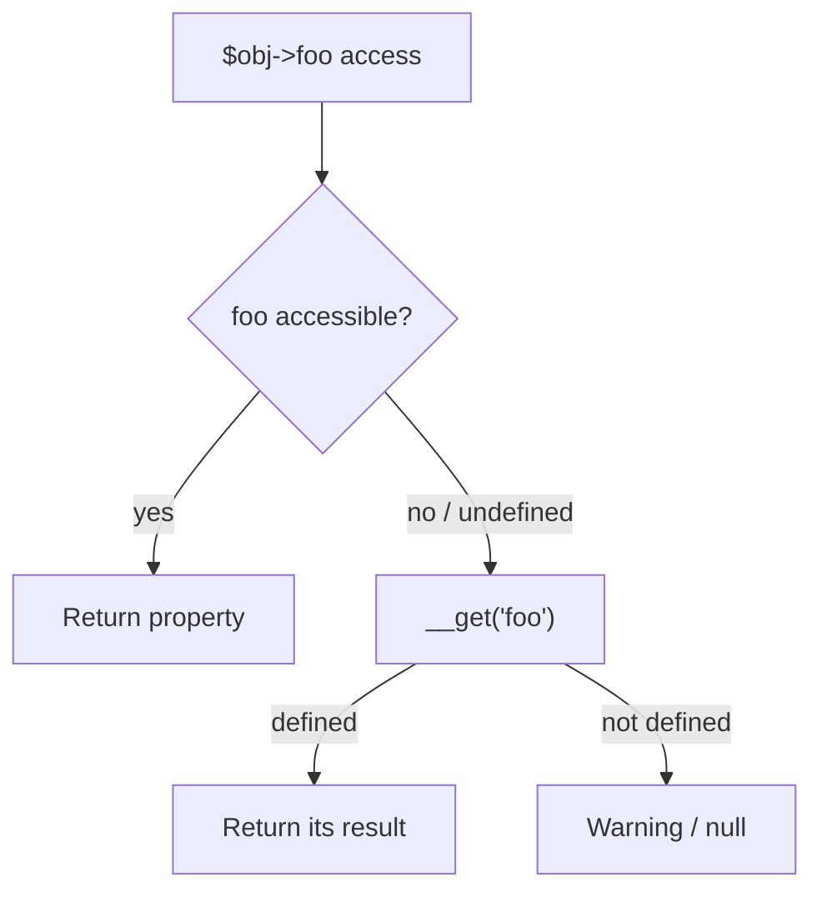

# Object-Oriented Programming

!!! tip "In a nutshell"
    Les objets PHP reposent sur l'héritage simple de classe, complété par les
    interfaces et les traits. Le fait que les examinateurs adorent : `static::`
    se résout vers la classe *appelée* à l'exécution (late static binding),
    tandis que `self::` est figé à la compilation.

!!! example "Real-world analogy"
    Imaginez un formulaire type portant l'instruction « inscrivez votre nom de
    famille ici ». Utiliser `self::`, c'est comme si l'auteur du formulaire avait
    inscrit en dur *son propre* nom — figé au moment où le formulaire a été
    rédigé. Utiliser `static::`, c'est au contraire « utilisez le nom de la
    personne qui remplit réellement ce formulaire en ce moment », résolu au
    moment de l'usage — ainsi un descendant remplissant le même formulaire obtient
    bien son propre nom. Cette résolution à l'exécution, c'est le late static
    binding.

!!! abstract "Learning objectives"
    À la fin de ce chapitre, vous saurez :

    - [ ] Appliquer correctement la visibilité, `static` et le **late static binding**.
    - [ ] Utiliser la promotion de propriétés dans le constructeur et `clone` (y compris `__clone`).
    - [ ] Expliquer les méthodes magiques courantes et leur ordre d'invocation.

    **Syllabus:** `PHP → Object-Oriented Programming` ·
    **Level:** Advanced ·
    **Est. time:** 30 min ·
    **Prerequisites:** [PHP API](php-api.md)

---

## Pour les nuls

### L'idée en une phrase
`self::` regarde toujours la classe où le code est écrit ; `static::` regarde la classe réellement utilisée au moment de l'exécution.

### Imagine dans la vraie vie
Un formulaire pré-rempli avec "signé par : [nom de l'auteur du modèle]" (`self::`) porte toujours la même signature, peu importe qui le remplit. Un formulaire avec "signé par : [nom de la personne qui remplit maintenant]" (`static::`) s'adapte à qui l'utilise réellement — même si ce formulaire a été copié depuis un modèle parent.

### Dans Symfony
La liaison statique tardive (`static::`) est ce qui permet à des méthodes "usine" définies dans une classe parente (comme certaines méthodes de service) de renvoyer correctement une instance de la sous-classe réelle, sans que le parent ait besoin de connaître ses futurs enfants.

### Exemple simple
```php
class Animal {
    public static function creer(): static { return new static(); }
}
class Chien extends Animal {}

Chien::creer(); // instance de Chien, pas d'Animal — grâce à static::
```

### Comment le mémoriser 🧠
`self` = **s**crit une fois pour toutes dans le code source. `static` = **s**'adapte à qui appelle **s**tatiquement, au moment présent.


## Theory

Le modèle objet de PHP : héritage simple de classes, implémentation multiple
d'interfaces, traits pour la réutilisation horizontale. Les membres ont une
**visibilité** (`public`/`protected`/`private`), peuvent être **d'instance** ou
**statiques**, et les classes peuvent être `final`, `abstract` ou (8.2+)
`readonly`.

```php
abstract class Shape {}            // abstract: cannot be instantiated
final class Circle extends Shape   // final: cannot be extended further
{
    public float $radius = 1.0;    // public: accessible everywhere
    protected string $unit = 'cm'; // protected: class + subclasses
    private bool $cached = false;  // private: declaring class only

    public static int $count = 0;  // static: belongs to the class itself
}
readonly class Money {}            // 8.2+: every instance property readonly
```

| Concept | En une phrase |
|---|---|
| `public` | Accessible partout |
| `protected` | Classe + sous-classes |
| `private` | Classe déclarante uniquement |
| `static` | Appartient à la classe, pas à une instance |
| `self` | La classe où le code est *écrit* |
| `static` (LSB) | La classe *appelée* à l'exécution |
| `parent` | La classe parente |

!!! question "Predict first"
    Une méthode parente fait `return new self();`. Une sous-classe
    `User extends Model` appelle `User::create()`. Quelle est la classe de
    l'objet retourné ?

??? note "Reveal"
    Un `Model` — `self` est figé à la compilation vers la classe où le code est
    écrit. Seul `new static()` (late static binding) se résout vers la classe
    appelée et retournerait un `User`.

## Deep Dive — how it works internally

### Late static binding (LSB)

`self::` se résout **à la compilation** vers la classe dans laquelle la méthode
est définie. `static::` se résout **à l'exécution** vers la classe qui a reçu
l'appel — c'est le *late static binding*. Cela compte pour l'héritage des
méthodes statiques/de fabrique.

```php
<?php
declare(strict_types=1);

class Model
{
    public static function create(): static      // return type follows LSB
    {
        return new static();                      // NOT new self()
    }

    public function whoAmI(): string
    {
        return static::class;                     // runtime class
    }
}

final class User extends Model {}

User::create();          // instance of User (thanks to LSB)
(new User())->whoAmI();  // "User"
```

Si `create()` utilisait `new self()`, `User::create()` retournerait à tort un
`Model`. Symfony utilise abondamment le LSB (par exemple les constructeurs
nommés statiques des value objects).

### Constructor property promotion

Déclarer un paramètre promu (`private int $x`) dans la signature du constructeur
déclare la propriété et l'assigne en même temps. La promotion accepte la
visibilité, `readonly`, les types, les valeurs par défaut et les attributs. Vous
ne pouvez pas promouvoir dans une méthode autre que `__construct`, et `callable`
n'est pas un type promu valide.

```php
<?php
declare(strict_types=1);

final class Point
{
    public function __construct(
        public readonly int $x = 0,
        public readonly int $y = 0,
    ) {}
}
```

### `clone` and `__clone()`

`clone` réalise une copie **superficielle** (shallow) : les propriétés de type
objet référencent toujours les mêmes objets. Implémentez `__clone()` pour
copier ces références en profondeur. Depuis PHP 8.3, `__clone()` peut modifier
les propriétés readonly de la copie fraîche.

```php
<?php
declare(strict_types=1);

final class Order
{
    public \DateTimeImmutable $createdAt;
    public \ArrayObject $lines;

    public function __clone(): void
    {
        // Deep-copy mutable references so clones don't share state.
        $this->lines = clone $this->lines;
    }
}
```

### Magic methods

| Méthode | Se déclenche quand |
|---|---|
| `__construct` / `__destruct` | Instanciation / GC |
| `__get` / `__set` | Accès à une propriété **inaccessible/non définie** |
| `__isset` / `__unset` | `isset()`/`unset()` sur une propriété inaccessible |
| `__call` / `__callStatic` | Appel d'une méthode **inaccessible/non définie** |
| `__invoke` | Objet utilisé comme fonction `$obj()` |
| `__toString` | Objet utilisé comme chaîne (implique `Stringable`) |
| `__clone` | Après que `clone` a copié l'objet |
| `__debugInfo` | `var_dump()` |

```php
class Bag
{
    private array $data = [];

    public function __get(string $k): mixed { return $this->data[$k] ?? null; }
    public function __set(string $k, mixed $v): void { $this->data[$k] = $v; }
    public function __isset(string $k): bool { return isset($this->data[$k]); }
    public function __invoke(): string { return 'called like a function'; }
}

$b = new Bag();
$b->color = 'red';   // __set (color is undefined → magic fires)
$b->color;           // __get  → 'red'
isset($b->color);    // __isset → true
$b();                // __invoke → 'called like a function'
```



!!! note "Source reference"
    Le `Symfony\Component\HttpFoundation\ParameterBag` de Symfony et ses value
    objects illustrent la promotion + le LSB —
    [symfony/symfony `8.0`](https://github.com/symfony/symfony/blob/8.0/src/Symfony/Component/HttpFoundation/ParameterBag.php).

## Configuration & code

=== "PHP Attributes"

    ```php
    <?php
    declare(strict_types=1);

    final class Temperature implements \Stringable
    {
        public function __construct(private float $celsius) {}

        public function __toString(): string
        {
            return \sprintf('%.1f°C', $this->celsius);
        }
    }

    echo new Temperature(21.5);   // "21.5°C"
    ```

=== "Console"

    ```console
    $ php -r 'class A{static function f(){return new static();}} class B extends A{} var_dump(B::f() instanceof B);'
    bool(true)
    ```

## Best practices & anti-patterns

| ✅ À faire | ❌ À éviter |
|---|---|
| `new static()` dans les fabriques héritables | `new self()` là où des sous-classes l'appellent |
| Copier en profondeur les références dans `__clone` | Se fier au clone superficiel par défaut |
| Garder les méthodes magiques rares + documentées | `__get`/`__call` comme API principale |
| `final` par défaut | Chaînes d'héritage profondes |

## When (not) to use it / alternatives

- Préférez des propriétés typées explicites à la magie `__get`/`__set` — la
  magie masque le contrat et neutralise l'analyse statique.
- Réservez les méthodes statiques aux constructeurs nommés et aux helpers purs ;
  évitez d'en faire un global déguisé (difficile à tester/mocker).

!!! danger "Certification traps"
    - `self::` se lie à la compilation ; `static::` (LSB) à l'exécution.
    - `clone` est **superficiel** — les objets imbriqués restent partagés tant
      que `__clone` ne les copie pas en profondeur.
    - `__get` ne se déclenche que pour les propriétés **inaccessibles ou non
      définies**, jamais pour les propriétés accessibles.
    - Vous ne pouvez pas promouvoir un paramètre de constructeur typé `callable`.

!!! warning "Common mistakes"
    - S'attendre à ce que `__toString` se déclenche sur `var_dump` (non — c'est `__debugInfo`).
    - Supposer que les membres `private` d'un parent sont visibles dans un enfant (ils ne le sont pas).

## Exercises

1. **(Advanced)** Ajoutez un constructeur nommé statique `fromString()` qui
   fonctionne correctement pour les sous-classes.
2. **(Advanced)** Étant donné un objet contenant un `ArrayObject`, faites en
   sorte que `clone` produise des copies indépendantes.

??? success "Solutions"

    **1.**
    ```php
    <?php
    declare(strict_types=1);

    class Uuid
    {
        private function __construct(public readonly string $value) {}

        public static function fromString(string $v): static
        {
            return new static($v);   // LSB → subclass-safe
        }
    }
    ```

    **2.** Implémentez `__clone()` et faites un `clone` de chaque propriété
    mutable, comme dans l'exemple `Order` ci-dessus.

## Certification questions

??? question "Q1. `new static()` vs `new self()` inside a parent factory method?"
    - [x] A. `static` respects the called subclass; `self` is fixed to the parent ✅
    - [ ] B. They are identical
    - [ ] C. `self` respects the subclass
    - [ ] D. Both are compile-time only

    **Why:** Le late static binding fait que `static` se résout vers la classe à l'exécution.
    **Ref:** [LSB](https://www.php.net/manual/en/language.oop5.late-static-bindings.php).

??? question "Q2. `clone $order` where `$order->lines` is an object — the clone's `lines`…"
    - [x] A. Points to the **same** object unless `__clone` copies it ✅
    - [ ] B. Is always a deep copy
    - [ ] C. Is `null`
    - [ ] D. Throws an error

    **Why:** `clone` est superficiel par défaut. **Ref:** [Object cloning](https://www.php.net/manual/en/language.oop5.cloning.php).

??? question "Q3. When does `__get()` fire?"
    - [ ] A. On every property read
    - [x] B. Only on inaccessible or undefined properties ✅
    - [ ] C. On writes
    - [ ] D. On `isset()`

    **Why:** Les propriétés accessibles sont lues directement ; `__isset` gère `isset()`.
    **Ref:** [Overloading](https://www.php.net/manual/en/language.oop5.overloading.php).

??? question "Q4. Which cannot be a promoted constructor parameter?"
    - [ ] A. `public readonly int $x`
    - [ ] B. `private ?string $s = null`
    - [x] C. `private callable $fn` ✅
    - [ ] D. `protected array $items = []`

    **Why:** `callable` n'est pas un type de propriété valide, il ne peut donc pas être promu.
    **Ref:** [Promotion](https://www.php.net/manual/en/language.oop5.decon.php#language.oop5.decon.constructor.promotion).

## Key takeaways

- `static::` = late static binding (exécution) ; `self::` = compilation.
- `clone` est superficiel — utilisez `__clone` pour des copies profondes.
- Les méthodes magiques ne se déclenchent que pour des membres inaccessibles/non définis.
- La promotion déclare + assigne ; accepte visibilité, `readonly`, valeurs par défaut.

## Last-minute revision

!!! tip "Cheat sheet"
    - `new static()` pour des fabriques sûres vis-à-vis des sous-classes.
    - Magie : `__get/__set/__isset/__unset/__call/__callStatic/__invoke/__toString/__clone`.
    - `callable` ne peut pas être promu ; readonly exige un type + pas de valeur par défaut.
    - Visibilité : private = classe déclarante uniquement ; protected = + sous-classes.

## Connections

- **Dépend de :** [PHP API](php-api.md) — la promotion, `readonly` et les enums s'appuient sur ce modèle objet.
- **Réutilisé dans :** [Traits](traits.md) & [Abstract Classes](abstract-classes.md) — tous deux étendent la manière dont les membres sont composés et hérités.
- **À ne pas confondre avec :** [Interfaces](interfaces.md) — `self`/`static` et la visibilité ici vs un pur contrat avec des règles de variance là-bas.

## Official References
- [PHP: Classes and Objects](https://www.php.net/manual/en/language.oop5.php)
- [PHP: Late Static Bindings](https://www.php.net/manual/en/language.oop5.late-static-bindings.php)
- [PHP: Object cloning](https://www.php.net/manual/en/language.oop5.cloning.php)
- [Symfony source — ParameterBag](https://github.com/symfony/symfony/blob/8.0/src/Symfony/Component/HttpFoundation/ParameterBag.php)

## Video references

!!! tip "Watch & learn"
    Voici des chaînes vidéo officielles, mises à jour en continu — cherchez-y
    « PHP & web security » pour consolider ce chapitre. Nous référençons des
    chaînes stables plutôt que des vidéos individuelles pour que les liens ne
    périment jamais.

    - [SymfonyCasts screencasts](https://symfonycasts.com/tracks/symfony) — tutoriels scénarisés à suivre en codant.
    - [Symfony official YouTube](https://www.youtube.com/@SymfonyOfficial) — conférences et keynotes de SymfonyCon.
    - [Official docs for this topic](https://symfony.com/doc/8.0/index.html) — certaines pages de la doc Symfony intègrent un screencast.

## Confidence check

Je suis prêt quand je peux :

- [ ] expliquer **pourquoi** le late static binding existe (fabriques sûres pour les sous-classes)
- [ ] implémenter `new static()` et une copie profonde dans `__clone` pour un value object Symfony 8
- [ ] déboguer une fabrique retournant la mauvaise classe parce qu'elle utilisait `new self()`
- [ ] repérer le piège : `__get` censé se déclencher sur une propriété *accessible* (il ne le fait pas)
- [ ] expliquer comment `clone` copie les références d'objets et quand `__clone` s'exécute

---

<small>Related: [PHP API](php-api.md) · [Traits](traits.md) · [Abstract Classes](abstract-classes.md)</small>
