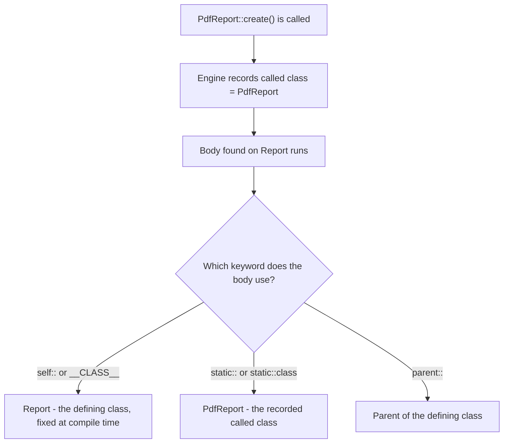
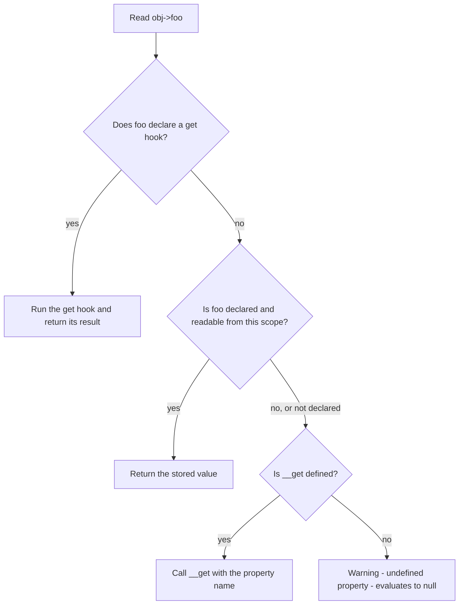
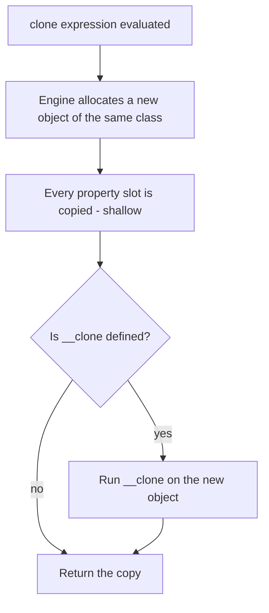

# Object-Oriented Programming

!!! tip "In a nutshell"
    PHP has single class inheritance, three visibilities, and — since 8.4 — two new
    dimensions on properties: **hooks** (`{ get; set; }`) and **asymmetric visibility**
    (`public private(set)`). The fact examiners return to every year: `static::` resolves to
    the *called* class at runtime (late static binding), while `self::` is fixed to the class
    the code was **written** in.

!!! example "Real-world analogy"
    A rubber stamp on an office form. `self::` is a stamp engraved once with the name of the
    department that printed the form — it prints that name forever, whoever picks the form
    up. `static::` is a stamp that reads the badge of the clerk currently holding it and
    prints *their* department. Copy the form into a branch office and the engraved stamp
    still says "head office", while the badge-reading stamp correctly says "branch". That
    badge lookup, performed at the moment of use rather than at printing time, is late static
    binding. And the badge only stays with the form while it is passed *internally*: hand it
    over by naming a department explicitly and the badge is replaced — which is exactly the
    forwarding / non-forwarding distinction below.

!!! abstract "Learning objectives"
    By the end of this chapter you can:

    - [ ] Apply visibility, `static`, and **late static binding**, including the
      forwarding / non-forwarding call rule.
    - [ ] Use constructor property promotion, `readonly` (with its 8.3 and 8.4 changes) and
      `clone` / `__clone()` correctly.
    - [ ] Use PHP 8.4 **property hooks** and **asymmetric visibility**, and state their limits.
    - [ ] Name every magic method, when it fires, and the rules PHP enforces on its signature.

    **Syllabus:** `PHP → Object-Oriented Programming` ·
    **Level:** Advanced / Expert ·
    **Est. time:** 45 min ·
    **Prerequisites:** [PHP API](php-api.md)

    **Examen Symfony 8 :** OUI

---

## Prerequisites

You should be comfortable with functions, types and `declare(strict_types=1)` from
[PHP API](php-api.md). Everything on this page targets **PHP 8.4**, and that matters more
here than in any other PHP chapter: property hooks, asymmetric visibility, abstract
properties, `final` properties and a change to what `readonly` implies all landed in 8.4.
Several statements that were correct in a 2023 cheat sheet are now wrong, and those are
precisely the statements a question bank likes to reuse.

## The problem we are solving

Write a value object and a base class for it, and two questions appear immediately.

The first is *who is allowed to change this*. A `Report` whose `$status` anyone can
overwrite is not a value object, it is a mutable array with extra syntax. Making the
property `private` fixes the writes but also blocks the reads, so you write a `getStatus()`
method, and now every property costs three lines of boilerplate.

The second is *who am I* inside inherited code. Put a named constructor on the base class:

```php
public static function create(): static
{
    return new static();
}
```

The method is written once, in the parent, yet it must build the **subclass** the caller
actually asked for. Nothing in the parent's source names that subclass — the information
only exists at the moment of the call.

PHP answers the first question with visibility, and since 8.4 with asymmetric visibility and
property hooks. It answers the second with late static binding. The rest of this chapter is
those two answers and their consequences.

## 🧠 Pour les nuls

**C'est quoi ?** La POO en PHP, c'est un **modèle à héritage simple** : une classe hérite
d'une seule classe parente. Deux mots-clés y règlent qui-est-qui : `self::` désigne la classe
**où le code est écrit**, `static::` désigne la classe **réellement appelée**. Et depuis
PHP 8.4, une propriété peut avoir des *hooks* (`get` / `set`) et une visibilité
**asymétrique** (lecture publique, écriture privée).

**Pourquoi ça existe ?** Parce qu'une méthode écrite dans une classe parente doit souvent
fabriquer un objet de la classe enfant, alors que le parent n'a aucune idée de qui héritera
de lui un jour. `static::` résout le nom au dernier moment, à l'exécution. Les hooks, eux,
existent pour supprimer les milliers de `getXxx()` / `setXxx()` qui n'ajoutent aucune
logique : on garde la syntaxe `$objet->prop` tout en gardant la porte ouverte pour y greffer
du comportement plus tard.

**🏠 Analogie de la vraie vie :** le **tampon encreur du bureau**. Un tampon gravé « Service
Comptabilité » (`self::`) imprime cette mention pour l'éternité, même si le formulaire part
en agence. Un tampon qui lit le badge de la personne qui l'utilise (`static::`) imprime le
service de cette personne-là. Le badge suit le formulaire tant qu'on se le passe entre
collègues (`self::`, `parent::`, `static::` — appels dits *forwarding*), mais dès qu'on écrit
explicitement « Comptabilité » sur le formulaire (`Comptabilite::methode()`), le badge est
remplacé par cette mention et l'information d'origine est perdue.

**Symfony dans la vraie vie :** Le tampon gravé → `self::` / Le tampon à badge → `static::` /
Le formulaire modèle → la classe parente / L'agence → la sous-classe. Symfony s'en sert
partout : `Symfony\Component\Uid\Uuid::fromString()` fait `return new static($uuid)` afin que
`UuidV4::fromString()` rende bien un `UuidV4`. Même mécanisme dans
`Symfony\Component\Validator\Constraint::validatedBy()`, qui renvoie
`static::class.'Validator'` : chaque contrainte trouve automatiquement son validateur sans
qu'aucune sous-classe n'ait à redéfinir la méthode.

**💻 Exemple extrêmement simple :**
```php
class Rapport {
    public static function creer(): static { return new static(); }
}
class RapportPdf extends Rapport {}

RapportPdf::creer();   // un RapportPdf, pas un Rapport
```
Ligne 2 : `new static()` demande « quelle classe a été appelée ? ». Ligne 6 : la réponse est
`RapportPdf`. Avec `new self()`, la réponse serait toujours `Rapport`.

**🔍 Que se passe-t-il réellement ?**
1. Le moteur voit `RapportPdf::creer()` et mémorise la classe appelée : `RapportPdf`.
2. Il ne trouve pas `creer()` sur `RapportPdf`, il remonte et exécute celle de `Rapport`.
3. La classe appelée reste `RapportPdf` : c'est ça, la « liaison tardive ».
4. `new static()` demande cette classe mémorisée → `RapportPdf`.
5. `new self()` ne la demande jamais : il a été résolu à la compilation en `Rapport`.
6. `static::class` et `get_called_class()` lisent exactement la même valeur mémorisée.

**⚠️ Erreur fréquente :** croire qu'une classe enfant peut lire les membres `private` du
parent. Non : `private` signifie « la classe qui déclare, et elle seule ». Pour ouvrir aux
enfants il faut `protected`. Deuxième piège classique du même genre : croire que
`clone` copie tout en profondeur — il ne copie que la surface, et les objets imbriqués
restent partagés tant que `__clone()` ne les duplique pas.

**🧠 Comment le mémoriser ?** *« `self` = **s**ource, `static` = **s**cène. »* La source, c'est
le fichier où la ligne est écrite ; la scène, c'est ce qui se joue à l'exécution. Et pour la
visibilité : *private = moi, protected = ma famille, public = tout le monde*.

## Build the mental model

Two ideas carry the whole chapter.

**One: PHP tracks a "called class" alongside the executing method.** When you write
`PdfReport::create()`, the engine records `PdfReport` as the called class, then looks the
method up along the inheritance chain and runs whatever body it finds. The body may live in
the parent, but the recorded called class does not change. `static::`, `static::class` and
`get_called_class()` all read that record. `self::` and `__CLASS__` never look at it — they
were replaced with the defining class name while the file was compiled.

The manual states the rule in terms of calls rather than keywords, and this is the version
worth memorising: late static binding stores *the class named in the last non-forwarding
call*. A **forwarding call** is one made through `self::`, `parent::`, `static::` or
`forward_static_call()`; it passes the recorded class along. Naming a class explicitly —
`Report::create()` — is a **non-forwarding call**, and it overwrites the record.



The diagram says one thing: the body is shared, but two different questions are being asked
inside it. `self::` asks "where is this line written?", `static::` asks "who was called?".

**Two: a property is no longer just a slot.** Up to PHP 8.3 a property was a named box you
could read and write, and any behaviour required a method. In 8.4 a property can carry
**hooks** that intercept the read or the write, and it can advertise **different visibility
for reading and for writing**. That is why "add a getter later" stopped being a
backward-compatibility problem: `$report->slug` can start as a stored value and become a
computed one without a single call site changing.

!!! info "PHP 8.4 reference"
    https://www.php.net/manual/en/language.oop5.late-static-bindings.php

## Core concepts

PHP's object model: single inheritance of classes, multiple interface implementation, traits
for horizontal reuse. Members carry **visibility** (`public` / `protected` / `private`), may
be **instance** or **static**, and classes may be `abstract`, `final`, or (8.2+) `readonly`.

```php
abstract class Shape {}              // abstract: cannot be instantiated

final class Circle extends Shape     // final: cannot be extended further
{
    public float $radius = 1.0;      // public: accessible everywhere
    protected string $unit = 'cm';   // protected: declaring class + subclasses + parents
    private bool $cached = false;    // private: declaring class only

    public static int $count = 0;    // static: belongs to the class, not an instance
}

readonly class Money {}              // 8.2+: every declared property becomes readonly
```

| Concept | One-liner |
|---|---|
| `public` | Accessible everywhere |
| `protected` | The class itself, plus inheriting **and parent** classes |
| `private` | The declaring class only |
| `static` | Belongs to the class — no `$this`, accessed with `::` |
| `self` | The class where the code is *written* (compile time) |
| `static` (LSB) | The class that was *called* (runtime) |
| `parent` | The parent of the class where the code is written |
| `readonly` (8.1) | Writable once, from the declaring scope; implicitly `protected(set)` **since 8.4** |
| `private(set)` (8.4) | Public read, private write — and implicitly `final` |

Two entries in that table are commonly misremembered. `protected` is *not* "class plus
children": the manual says "the class itself and by inheriting **and parent** classes". And
`readonly` was implicitly *private*-set before 8.4; from 8.4 it is implicitly
`protected(set)`, so a child class may now perform the one-time initialisation.

!!! info "PHP 8.4 reference"
    https://www.php.net/manual/en/language.oop5.visibility.php

Another rule from the same page is pure exam fodder: **objects of the same class can read
each other's `private` members.** Visibility is enforced per *class*, not per *instance*.

```php
final class Amount
{
    public function __construct(private int $cents) {}

    public function isLargerThan(self $other): bool
    {
        return $this->cents > $other->cents;   // legal: same class, other instance
    }
}
```

## Learn by doing

One object, seven edits, each changing exactly one thing. Predict before reading on.

**Step 1 — a plain class.** Explicit properties, explicit constructor.

```php
class Report
{
    public string $title;

    public function __construct(string $title)
    {
        $this->title = $title;
    }
}
```

**Step 2 — promote the constructor parameter.** A modifier in the signature declares the
property *and* assigns it, before the constructor body runs.

```php
class Report
{
    public function __construct(public string $title) {}
}
```

Nothing else changes: promoted arguments have no effect on calling code.

**Step 3 — add a named constructor with `new self()`.** This is the bug most people write
once.

```php
class Report
{
    public function __construct(public string $title) {}

    public static function untitled(): static
    {
        return new self('Untitled');      // wrong tool
    }
}

final class PdfReport extends Report {}
```

`PdfReport::untitled()` returns a **`Report`**. Worse, because the declared return type is
`static`, PHP now enforces that mismatch and you get a `TypeError` at runtime rather than a
silently wrong object:

```
Report::untitled(): Return value must be of type PdfReport, Report returned
```

Read that message carefully: the method named is `Report::untitled()` — the class where the
body is **written** — while the expected type is `PdfReport`, the class that was **called**.
The message is late static binding spelled out.

**Step 4 — change one word.**

```php
return new static('Untitled');
```

`PdfReport::untitled()` now returns a `PdfReport`. The parent never learned the child's name;
the engine simply handed over the class that was called. This is the whole of late static
binding, and it is why `static` is both a valid return type and the right one here.

**Step 5 — add a computed property with a hook (8.4).** The title has to appear as a slug.
The old answer was `getSlug()`; the 8.4 answer keeps property syntax.

```php
class Report
{
    public function __construct(public string $title) {}

    public string $slug {
        get => strtolower(str_replace(' ', '-', $this->title));
    }
}
```

`$slug` is **virtual**: it has hooks, and the hooks never touch `$this->slug`, so the object
allocates no storage for it. Reading `$report->slug` runs the expression. Writing to it is an
error, because no `set` hook exists.

**Step 6 — lock down writes with asymmetric visibility (8.4).** `$title` should be readable
by anyone and writable only from inside.

```php
class Report
{
    public function __construct(public private(set) string $title) {}

    public function rename(string $title): void
    {
        $this->title = $title;           // fine: we are inside the declaring class
    }
}
```

From outside, `$report->title = 'x'` now fails with
`Cannot modify private(set) property Report::$title from global scope`, while
`echo $report->title` still works. No getter, no setter, no boilerplate — and note the side
effect the manual warns about: **`private(set)` makes the property implicitly `final`**, so
`PdfReport` may no longer redeclare it.

**Step 7 — clone, and discover the shallow copy.** Give the report a mutable collection.

```php
class Report
{
    public \ArrayObject $sections;

    public function __construct(public string $title)
    {
        $this->sections = new \ArrayObject();
    }
}

$a = new Report('Q1');
$b = clone $a;
$b->sections[] = 'intro';
count($a->sections);   // 1 — the two reports share one ArrayObject
```

`clone` copies each property slot, not what the slots point at. Fix it in `__clone()`:

```php
public function __clone(): void
{
    $this->sections = clone $this->sections;
}
```

The mental hook for the whole sequence: **promotion changes where you write the property,
`static` changes who you build, hooks change what a read means, and `clone` changes nothing
about the objects your properties point at unless you say so.**

!!! info "PHP 8.4 reference"
    https://www.php.net/manual/en/language.oop5.decon.php#language.oop5.decon.constructor.promotion

## How Symfony handles it

Symfony leans on these mechanisms rather than reimplementing them.

**Late static binding for named constructors.** `Symfony\Component\Uid\Uuid::fromString()` is
declared `: static` and returns `new static($uuid)`, which is why `UuidV4::fromString()`
yields a `UuidV4` and not a bare `Uuid` — with a single implementation in the base class.

```php
public static function fromString(string $uuid): static
{
    // ...
    return new static($uuid);
}
```

`Symfony\Component\Validator\Constraint::validatedBy()` uses the same trick for a different
purpose: it returns `static::class.'Validator'`, so every constraint resolves to its own
validator class name without any subclass overriding the method.

!!! note "Symfony 8.0 source reference"
    https://github.com/symfony/symfony/blob/8.0/src/Symfony/Component/Uid/Uuid.php

**`__clone()` for deep copies.** `Symfony\Component\HttpFoundation\Request::__clone()` is the
canonical example in the framework: it clones each of the seven `ParameterBag`-family
properties so that a duplicated request cannot mutate the original's query, attributes,
cookies, files, server values or headers.

```php
public function __clone()
{
    $this->query = clone $this->query;
    $this->request = clone $this->request;
    // ... attributes, cookies, files, server, headers
}
```

That method is exactly what makes `Request::duplicate()` safe, and it is the reason sub-requests
in the HttpKernel do not corrupt the master request.

!!! note "Symfony 8.0 source reference"
    https://github.com/symfony/symfony/blob/8.0/src/Symfony/Component/HttpFoundation/Request.php

**Magic methods as a compatibility layer.** `Constraint` implements `__get()`, `__set()` and
`__isset()` so that constraint options behave like properties while still raising a clear
`InvalidOptionsException` for an unknown option. It is a deliberate, documented use of
overloading — not a general licence to route your own API through magic.

!!! note "Symfony 8.0 source reference"
    https://github.com/symfony/symfony/blob/8.0/src/Symfony/Component/Validator/Constraint.php

## How it works internally

**Signature compatibility is checked when the class is linked**, not when a method is called.
The manual defines a compatible override precisely: it respects the variance rules, may make
a mandatory parameter optional, may add only optional new parameters, and may relax but never
restrict visibility. This is the Liskov Substitution Principle, and PHP enforces it with a
fatal error since 8.0.

Two members are **exempt** from those rules, and both are examinable: `__construct()` and
`private` methods. A child constructor may take completely different parameters from its
parent's; a child may redeclare a parent's `private` method with any signature at all,
because the parent's version was never visible to it in the first place.

!!! info "PHP 8.4 reference"
    https://www.php.net/manual/en/language.oop5.basic.php#language.oop.lsp

**Reading a property in 8.4 walks three gates,** in this order.



The order explains a fact people find surprising: **`__get()` never fires for a property that
exists and is visible**, hooks or not. Overloading is the *fallback* path, reached only when
normal resolution fails. It also explains why an asymmetrically-visible property can reach
`__set()` from outside while `__get()` is never reached from the same place — the read gate
passed and the write gate did not.

**Cloning is a three-step operation.**



`__clone()` runs **on the new object, after the copy**, which is why `$this` inside it refers
to the clone and why the copy already holds the original's references when the method starts.

!!! info "PHP 8.4 reference"
    https://www.php.net/manual/en/language.oop5.cloning.php

## All supported cases and variations

### Late static binding: forwarding versus non-forwarding calls

This is the part of LSB most summaries omit, and the one that separates a pass from a
distinction. The recorded called class survives a *forwarding* call and is reset by a
*non-forwarding* one.

```php
<?php
declare(strict_types=1);

class A
{
    public static function who(): string { return static::class; }

    public static function viaSelf(): string { return self::who(); }    // forwarding
    public static function viaName(): string { return A::who(); }       // NOT forwarding
}

final class B extends A {}

echo B::who(), '|', B::viaSelf(), '|', B::viaName();   // B|B|A
```

`B::viaSelf()` still reports `B`: `self::who()` forwards the recorded class. `B::viaName()`
reports `A`, because naming the class explicitly starts a fresh non-forwarding call and
overwrites the record. The four forwarding forms are exactly `self::`, `parent::`, `static::`
and `forward_static_call()`.

Two smaller limits from the same page: in a **non-static** context the called class is the
class of the object, and `static::` can only be used to reach *static* properties.

!!! info "PHP 8.4 reference"
    https://www.php.net/manual/en/language.oop5.late-static-bindings.php

### Property hooks (PHP 8.4)

Hooks intercept the read (`get`) and the write (`set`) of a property. They exist on
**non-static** properties only, work on typed and untyped properties, and come in a long form
and several shorthands.

```php
<?php
declare(strict_types=1);

final class Temperature
{
    // Backed: the set hook writes through to the property itself.
    public float $celsius = 0.0 {
        set (float $value) {
            if ($value < -273.15) {
                throw new \InvalidArgumentException('below absolute zero');
            }
            $this->celsius = $value;
        }
    }

    // Virtual: no storage at all, because no hook touches $this->fahrenheit.
    public float $fahrenheit {
        get => $this->celsius * 9 / 5 + 32;
    }
}
```

A property is **backed** when at least one of its hooks references the property itself, and
**virtual** otherwise. A virtual property occupies no memory in the object, and using an
operation whose hook is absent is an error rather than a default behaviour.

The rules worth memorising, all from the manual:

- A `set` hook's parameter type must be the property's type or **wider (contravariant)** — a
  `string` property may accept `string|Stringable`, never only `array`.
- If the `set` parameter type is omitted, the value is named `$value` and takes the property
  type.
- Hooks are **incompatible with `readonly`**. `public readonly string $s { get => ... }` is a
  compile-time fatal: *Hooked properties cannot be readonly*. Use asymmetric visibility
  instead when you want to restrict a write *and* alter its behaviour.
- Hooks may be used with constructor promotion, but values passed to the constructor must
  match the **property** type regardless of what a wider `set` hook would accept.
- Hooks run in the **object's scope**, so they may call private methods and read private
  properties — and reading another hooked property from inside a hook still goes through
  that property's hooks.
- `get` may be declared `&get` to return by reference. Declaring both `get` and `&get` on one
  property is a syntax error, and `&get` together with `set` is not allowed on a *backed*
  property.
- Hooks may be `final`, and a property may be `final` (new in 8.4). Marking hooks `final` on
  an already-`final` property is redundant and silently ignored.
- A child may override individual hooks, or add hooks to a property that had none. A hook
  reaches its parent's implementation with `parent::$propName::get()`.

Serialization treats hooks inconsistently *on purpose*, and the table is memorisable:
`var_dump`, `serialize`, `unserialize`, array casting and `get_mangled_object_vars()` use the
**raw backing value**; `var_export`, `json_encode()`, `JsonSerializable` and
`get_object_vars()` go **through the `get` hook**.

```php
<?php
declare(strict_types=1);

final class P
{
    public string $raw = 'r';
    public string $full { get => 'A B'; }
}

$p = new P();
var_dump(get_object_vars($p));   // ['raw' => 'r', 'full' => 'A B']  — hook used
var_dump((array) $p);            // ['raw' => 'r']                   — raw only, no 'full'
echo json_encode($p);            // {"raw":"r","full":"A B"}         — hook used
```

!!! info "PHP 8.4 reference"
    https://www.php.net/manual/en/language.oop5.property-hooks.php

### Asymmetric property visibility (PHP 8.4)

A property may declare a separate visibility for writing:

```php
final class Report
{
    public private(set) string $title = 'draft';   // read anywhere, write in this class
    protected protected(set) int $version = 1;     // read + write in the hierarchy
}
```

The complete set of caveats, straight from the manual:

- **Only typed properties** may have a separate `set` visibility.
- `set` must be the same as or **more restrictive** than the read visibility.
  `protected public(set)` is a syntax error.
- If the read visibility is `public`, it may be omitted: `private(set)` means
  `public private(set)`.
- A `private(set)` property is **implicitly `final`** and may not be redeclared in a child.
- Taking a **reference** to the property follows the `set` visibility, not `get`, because a
  reference could be used to write.
- Writing to an **array element** of the property is internally a get *and* a set, so it also
  follows the `set` visibility.
- **No spaces**: `private( set )` is a parse error.
- A child redeclaring a non-final property may **widen** either visibility, never narrow it.

One 8.4-specific limit that is easy to get wrong because it changed later: **static
properties may not have asymmetric visibility in 8.4.** `public private(set) static string $x`
fails with *Static property may not have asymmetric visibility*. That restriction was lifted
in PHP 8.5, which is outside this certification's baseline.

!!! info "PHP 8.4 reference"
    https://www.php.net/manual/en/language.oop5.visibility.php#language.oop5.visibility-members-aviz

### `readonly` — and what 8.3 and 8.4 changed

`readonly` (8.1) prevents modification after initialisation. The details that get tested:

- It applies only to **typed** properties; use `mixed` if you genuinely want no constraint.
- **Readonly static properties are not supported.**
- An explicit **default value is not allowed** — a readonly property with a default would just
  be a constant.
- It may be initialised **once**, and only from the scope where it is declared. Before 8.4
  that scope was implicitly *private*-set; **as of 8.4 readonly is implicitly
  `protected(set)`**, so a child class may perform the initialisation.
- It may be `unset()` **only before** initialisation, from the declaring scope.
- It does not prevent **interior mutability**: an `ArrayObject` in a readonly property can
  still be modified.
- **Since 8.3, `__clone()` may reinitialise a readonly property** on the fresh copy — the one
  place a second write is legal.
- **Since 8.4, taking a reference to a readonly property inside `__clone()` is forbidden**
  (`$ref = &$this->prop`), matching the rule already in force during initialisation.
- A `readonly` **class** (8.2) marks every declared property readonly, forbids dynamic
  properties, cannot be combined with `#[\AllowDynamicProperties]` (compile-time error),
  cannot declare untyped or static properties, and can only be extended by another `readonly`
  class.
- You may not override a read-write property with a `readonly` one, or the reverse.

```php
<?php
declare(strict_types=1);

final class Snapshot
{
    public function __construct(
        public readonly string $id,
        public readonly \ArrayObject $tags,
    ) {}

    public function __clone(): void
    {
        $this->id = $this->id.'-copy';    // legal since 8.3, inside __clone only
        $this->tags = clone $this->tags;  // deep copy of the shared collection
    }
}
```

!!! info "PHP 8.4 reference"
    https://www.php.net/manual/en/language.oop5.properties.php#language.oop5.properties.readonly-properties

### `abstract` and `final`

`abstract` classes cannot be instantiated, and any class holding at least one abstract member
must itself be abstract. Since **8.4** a class may declare an **abstract property**, `public`
or `protected`, stating the required `get` and/or `set` operation:

```php
abstract class Model
{
    abstract public string $identifier { get; }
}
```

An implementer satisfies it with a plain property or with hooks. An abstract property may
provide an implementation for one operation but must leave the other declared-not-defined.

`final` forbids overriding. It applies to classes, methods, **properties (8.4)** and
**constants (8.1)**. Two corollaries: since 8.0 a `private` method may not be declared
`final` — except the constructor, since a private final constructor is the idiomatic way to
force static creation methods — and a `private(set)` property is final whether you write the
keyword or not.

!!! info "PHP 8.4 reference"
    https://www.php.net/manual/en/language.oop5.abstract.php

### Magic methods — the complete list

The manual enumerates exactly **17** magic method names, and this is the full set:
`__construct()`, `__destruct()`, `__call()`, `__callStatic()`, `__get()`, `__set()`,
`__isset()`, `__unset()`, `__serialize()`, `__unserialize()`, `__sleep()`, `__wakeup()`,
`__toString()`, `__invoke()`, `__set_state()`, `__clone()` and `__debugInfo()`.

| Method | Fires when |
|---|---|
| `__construct` / `__destruct` | Instantiation / last reference dropped or shutdown |
| `__get` / `__set` | Read / write of an **inaccessible or undeclared** property |
| `__isset` / `__unset` | `isset()`/`empty()` / `unset()` on such a property |
| `__call` / `__callStatic` | Call to an inaccessible or undeclared method, in object / static context |
| `__invoke` | The object is used as a function: `$obj(...)` |
| `__toString` | The object is used in a string context |
| `__clone` | On the new object, immediately after `clone` copies it |
| `__debugInfo` | `var_dump()` |
| `__serialize` / `__unserialize` | `serialize()` / `unserialize()` (7.4+, preferred) |
| `__sleep` / `__wakeup` | `serialize()` / `unserialize()`, legacy path |
| `__set_state` | `var_export()` output is re-imported |

Three engine rules apply to all of them:

- All magic methods **must be `public`**, except `__construct()`, `__destruct()` and
  `__clone()`. A non-public one emits an `E_WARNING` — a warning, not a fatal.
- If you declare types on a magic method, they **must match the documented signature
  exactly**, or PHP emits a fatal error (since 8.0). `__construct()` and `__destruct()` must
  declare **no** return type at all.
- If both `__serialize()` and `__sleep()` exist, only `__serialize()` runs; likewise
  `__unserialize()` wins over `__wakeup()`.

!!! info "PHP 8.4 reference"
    https://www.php.net/manual/en/language.oop5.magic.php

### Overloading: the fine print

```php
class Bag
{
    private array $data = [];

    public function __get(string $k): mixed { return $this->data[$k] ?? null; }
    public function __set(string $k, mixed $v): void { $this->data[$k] = $v; }
    public function __isset(string $k): bool { return isset($this->data[$k]); }
    public function __unset(string $k): void { unset($this->data[$k]); }
    public function __invoke(): string { return 'called like a function'; }
}

$b = new Bag();
$b->color = 'red';   // __set   (color is undeclared → the fallback path)
$b->color;           // __get   → 'red'
isset($b->color);    // __isset → true
$b();                // __invoke
```

- All four property-overloading methods must be `public`, and **none of their arguments may
  be passed by reference**.
- Property overloading works in **object context only**. Declaring one of these methods
  `static` triggers a warning and they will not fire statically.
- The **return value of `__set()` is ignored**, by design.
- `__get()` is **not** called when assignments are chained: in `$a = $obj->b = 8;` only
  `__set()` runs and `$a` receives the assigned value directly.
- PHP will **not re-enter the same overload method**: `return $this->foo;` inside `__get()`
  returns `null` and raises `E_WARNING` when `foo` is undeclared, rather than recursing.
  Different overload methods may still trigger one another.

!!! info "PHP 8.4 reference"
    https://www.php.net/manual/en/language.oop5.overloading.php

### Constructor promotion — the exact rules

Promotion (8.0) turns a constructor parameter carrying a modifier into a property plus an
assignment performed **before** the constructor body runs.

- **Any single modifier** triggers promotion, not just a visibility keyword: `readonly int $x`
  promotes on its own.
- Promoted and non-promoted parameters may be mixed freely, in any order.
- Promotion has **no effect on calling code**.
- `callable` may never be a property type, so a promoted parameter may not be `callable`
  either. Every other type declaration is allowed — use `\Closure` when you need to store one.
- **Attributes** on a promoted parameter are replicated to **both** the property and the
  parameter.
- A **default value** is replicated to the parameter **only**, never to the property.
- Naming restrictions for both properties and parameters apply.
- Promotion exists only in `__construct()`.

Related, from the same page: **`new` in initializers** (8.1) allows an object as a default
parameter value, a static variable, a global constant or an attribute argument — but not with
a dynamic class name, an anonymous class, or argument unpacking.

!!! info "PHP 8.4 reference"
    https://www.php.net/manual/en/language.oop5.decon.php

## Configuration & code

=== "PHP Attributes"

    ```php
    <?php
    declare(strict_types=1);

    final class Temperature implements \Stringable
    {
        public function __construct(private(set) float $celsius = 0.0) {}

        public float $fahrenheit {
            get => $this->celsius * 9 / 5 + 32;
        }

        public static function fromFahrenheit(float $f): static
        {
            return new static(($f - 32) * 5 / 9);
        }

        public function __toString(): string
        {
            return \sprintf('%.1f°C', $this->celsius);
        }
    }

    echo new Temperature(21.5);            // "21.5°C"
    echo Temperature::fromFahrenheit(212)->fahrenheit;   // 212
    ```

=== "Console"

    ```console
    $ php -r 'class A{static function f(){return new static();}} class B extends A{} var_dump(B::f() instanceof B);'
    bool(true)

    $ php -r 'class A{public private(set) string $s="x";} $a=new A(); $a->s="y";'
    PHP Fatal error:  Cannot modify private(set) property A::$s from global scope
    ```

## Execution flow

For `$report = PdfReport::untitled();` where `untitled()` lives on `Report`:

1. The engine resolves `PdfReport`, autoloading it and its parents if needed.
2. Both classes are **linked**: signatures, variance and visibility relaxation are verified.
   A violation is a fatal error here, before any of your code runs.
3. `PdfReport` is recorded as the **called class** for this non-forwarding static call.
4. `untitled()` is looked up on `PdfReport`, not found, and inherited from `Report`.
5. The body executes with the defining scope `Report` and the called class `PdfReport`.
6. `new static()` reads the called class and instantiates `PdfReport`.
7. Promoted parameters are assigned to properties, then the constructor body runs.
8. The declared return type `static` is checked against `PdfReport` — it matches.

## Default behavior

- A property declared with no visibility modifier is `public`; so is a method, and so is a
  class constant.
- A parent constructor is **not** called implicitly when the child defines one — you must call
  `parent::__construct()`. The same is true of destructors.
- If the child defines no constructor, the parent's is inherited like any other method.
- `clone` performs a **shallow** copy, and `__clone()` runs afterwards on the copy.
- `var_dump()` shows all public, protected and private properties unless `__debugInfo()` is
  defined.
- Any class defining `__toString()` implicitly implements `Stringable` (8.0+).
- `::class` on a **class name** is a compile-time transformation and never autoloads or
  errors; `::class` on an **object** (8.0+) resolves at runtime, equivalent to `get_class()`.
- Dynamic properties still work but are **deprecated since 8.2**; declare the property, use
  `__get()`/`__set()`, or opt in with `#[\AllowDynamicProperties]`.

## Edge cases

- **Non-forwarding calls reset LSB.** `A::who()` inside `A` reports `A` even when reached
  through `B::viaName()`. Only `self::`, `parent::`, `static::` and `forward_static_call()`
  forward the called class.
- **`__construct()` is exempt from signature compatibility.** A child constructor may declare
  entirely different parameters without any error — unique among methods.
- **`private` methods are exempt too.** A child may redeclare a parent's private method with
  any signature, because it never inherited it.
- **Constructor visibility may be restricted.** Every other member may only be *relaxed* when
  overridden; a `public` constructor may be made `private` in a child.
- **Calling a non-static method statically throws `Error`** since 8.0 (a deprecation before).
- **`clone` on a readonly property.** Reinitialising it inside `__clone()` is legal from 8.3;
  taking a reference to it there is forbidden from 8.4.
- **A hooked property cannot be `readonly`** — that combination is a compile-time fatal.
- **A `Stringable` object is rejected by a `string` parameter** under
  `declare(strict_types=1)`. Accept `string|\Stringable` when you want both.
- **`__get()` cannot recurse into itself.** Reading an undeclared property from inside
  `__get()` yields `null` plus a warning, not a second `__get()` call.
- **Static properties cannot have asymmetric visibility in 8.4**, and cannot be `readonly` at
  all.

## Common confusions

| These look alike | The distinction |
|---|---|
| `self::` vs `static::` | Defining class, fixed at compile time vs called class, resolved at runtime |
| `static` property vs `static::` | A class-level storage slot vs the late-static-binding scope |
| `private` vs `protected` | Declaring class only vs the class plus inheriting **and parent** classes |
| `readonly` vs `private(set)` | One write ever, from the declaring scope vs unlimited writes, from a restricted scope |
| Backed vs virtual property | A hook touches the property itself vs it never does, so nothing is stored |
| `__get` vs a `get` hook | Fallback for missing/invisible properties vs interception of a **declared** one |
| `__toString` vs `__debugInfo` | String context (`echo`, concatenation) vs `var_dump()` |
| `__serialize` vs `__sleep` | Modern pair, returns the data array vs legacy pair, returns property names |
| `clone` vs `__clone()` | The engine's shallow copy vs your fix-up, run on the copy afterwards |
| Promotion default vs property default | The default reaches the **parameter** only, never the property |

## Best practices & anti-patterns

| ✅ Do | ❌ Avoid |
|---|---|
| `new static()` in inheritable factories | `new self()` where subclasses call it |
| `private(set)` for read-only-to-the-world state | Hand-written `getX()` for every property |
| Deep-copy mutable references in `__clone()` | Relying on the shallow copy and sharing state |
| Keep magic methods rare, documented, typed | `__get`/`__call` as the primary public API |
| `final` by default | Deep inheritance chains |
| Virtual properties for derived values | Storing a value you can always recompute |
| `\Closure` for a stored callable | Trying to promote a `callable` parameter |

## Certification traps

!!! danger "Certification traps"
    - `self::` binds at compile time to the **defining** class; `static::` binds at runtime to
      the **called** class. A `self::` forwarding call still preserves the called class — only
      an explicitly named class resets it.
    - `clone` is **shallow**. Nested objects stay shared until `__clone()` copies them.
    - `__get()` fires only for **inaccessible or undeclared** properties — never for a
      declared, visible one, and never for a property that has a `get` hook.
    - `callable` cannot be a property type, so it cannot be promoted either.
    - A **hooked property cannot be `readonly`**, and `readonly` static properties do not exist.
    - Since **8.4**, `readonly` is implicitly `protected(set)`, not `private(set)` — a child
      class may now do the one-time initialisation.
    - `private(set)` is **implicitly `final`**; the child cannot redeclare the property.
    - `__construct()` and `private` methods are **exempt** from signature compatibility rules.
    - Magic methods must be `public` except `__construct`, `__destruct` and `__clone`;
      breaking that is an `E_WARNING`, while a wrong type declaration is a **fatal error**.
    - In 8.4, **static properties may not have asymmetric visibility**. That is an 8.5 feature
      and is out of scope here.

## Common mistakes

!!! warning "Common mistakes"
    - Expecting `__toString()` to fire on `var_dump()` — that is `__debugInfo()`.
    - Assuming a child can read a parent's `private` members. It cannot; `protected` can.
    - Forgetting `parent::__construct()` in a child constructor and wondering why parent state
      is uninitialised.
    - Declaring `private( set )` with spaces and getting a parse error.
    - Adding a `set` hook and expecting the constructor to accept the hook's wider type —
      promotion checks the **property** type.
    - Believing `(array) $obj` and `get_object_vars($obj)` agree: with hooks they do not, the
      cast uses raw values and `get_object_vars()` runs the `get` hook.
    - Using `new self()` in a named constructor declared `: static`, which turns a silent bug
      into a runtime `TypeError`.

## Debugging and troubleshooting

Read the fatal literally — PHP names the exact rule it enforced.

```
Cannot modify readonly property Report::$title
Cannot modify private(set) property Report::$title from global scope
Cannot override final property Report::$title
Hooked properties cannot be readonly
Static property may not have asymmetric visibility
Report::untitled(): Return value must be of type PdfReport, Report returned
```

The last one is the most useful diagnostic in the chapter: a `: static` return type turns a
`new self()` bug into a loud `TypeError` at the exact call site instead of an object of the
wrong class travelling through your application. Declare `: static` on every named
constructor for that reason alone.

Useful tools:

- `static::class` and `get_called_class()` print the recorded called class; `self::class` and
  `__CLASS__` print the defining class. Echo both to see which one your code is using.
- `get_object_vars($obj)` from *outside* the class shows only public members; from *inside* it
  shows everything visible in that scope — and it runs `get` hooks.
- `var_dump()` shows raw backing values, so a wrong value there with a right value in
  `json_encode()` points straight at a `get` hook.
- `php -l` catches syntax only. Visibility, hook and LSB errors need the class to **load**.
- In Symfony, `php bin/console debug:container <id>` shows the concrete class a service
  resolved to, which is often the answer to "why is `static::` reporting that name?".

## Performance and security considerations

Property access is a hash lookup on a compiled slot, and hooks turn it into a function call —
measurable only in very hot loops, and worth trading away for correctness in everything else.
Virtual properties actually *save* memory per instance, since nothing is stored. `clone` is
cheap because it is shallow; a deep `__clone()` costs whatever the nested copies cost, which
is the price of not sharing mutable state.

Overloading is the expensive path: `__get()`/`__call()` bypass the engine's fast property and
method lookups, defeat opcode specialisation, and make static analysis blind. That last point
is the security angle. A property routed through `__set()` has no type declaration, so nothing
stops untrusted input from landing in it; a typed property or a `set` hook rejects it at the
boundary. Combined with `declare(strict_types=1)`, typed properties are a genuine validation
layer — see [Web security fundamentals](web-security.md).

Visibility is an *encapsulation* boundary, not a security boundary: reflection can read
private state, and `var_dump()` prints it. Never treat `private` as a place to hide secrets
from an attacker who already runs code in your process — see [Attributes](attributes.md) for
how Symfony reads private members through reflection routinely.

## Key takeaways

- `static::` = late static binding, resolved to the **called** class; `self::` = compile-time,
  the **defining** class. `self::`, `parent::`, `static::` and `forward_static_call()` forward
  the called class; naming a class explicitly resets it.
- `clone` is shallow; `__clone()` runs on the copy afterwards and is the only place a
  `readonly` property may be written a second time (8.3+).
- Magic methods fire only for inaccessible or undeclared members, must be `public` except the
  three construct/destruct/clone cases, and must match the documented signature exactly.
- Promotion declares and assigns in one step, supports any single modifier, forbids `callable`,
  and copies a default value to the parameter only.
- PHP 8.4 adds property hooks (backed vs virtual), asymmetric visibility, abstract properties
  and `final` properties — and makes `readonly` implicitly `protected(set)`.

## Expert takeaways

- Late static binding is defined on *calls*, not keywords: the engine stores the class named
  in the last **non-forwarding** call. Everything about `static::` follows from that sentence,
  including why `self::who()` and `A::who()` behave differently from the same class.
- Property hooks and asymmetric visibility solve two different halves of encapsulation —
  *what a read or write means* versus *who may do it*. That is why hooks and `readonly` are
  mutually exclusive: `readonly` is a visibility-style restriction, so the tool for combining
  restriction with behaviour is `private(set)` plus hooks.
- `__construct()` and `private` methods being exempt from signature compatibility is not an
  oversight: neither participates in substitutability, since you never call a constructor
  polymorphically and a private method is never inherited.
- The serialization split (raw value for `var_dump`/`serialize`/array cast, `get` hook for
  `json_encode`/`get_object_vars`/`var_export`) is deliberate: debugging and persistence want
  the truth on disk, presentation wants the object's public story.
- `private(set)` being implicitly `final` is a soundness requirement, not a convenience: a
  child that could redeclare the property would be able to widen the write scope the parent
  deliberately closed.

## Last-minute revision

!!! tip "Cheat sheet"
    - `new static()` for subclass-safe factories, and always declare `: static`.
    - Forwarding: `self::` `parent::` `static::` `forward_static_call()`. Everything else resets LSB.
    - 17 magic methods; all public except `__construct`, `__destruct`, `__clone`.
    - `callable` cannot be promoted; `readonly` needs a type, forbids a default, forbids `static`.
    - 8.4: hooks (`get`/`set`, non-static, no `readonly`), `private(set)` (implicitly `final`,
      typed only, no static), abstract properties, `final` properties,
      `readonly` = implicitly `protected(set)`.
    - `var_dump`/`serialize`/`(array)` → raw value. `json_encode`/`get_object_vars`/`var_export` → `get` hook.
    - Visibility: `private` = declaring class only; `protected` = class + children **+ parents**.

## Connections

- **Depends on:** [PHP API](php-api.md) — types, `strict_types` and enums build on this object model.
- **Reused in:** [Traits](traits.md) & [Abstract Classes](abstract-classes.md) — both extend how members are composed and inherited.
- **Confused with:** [Interfaces](interfaces.md) — `self`/`static` and visibility here, versus a pure contract with variance rules there.
- **Enables:** [Attributes](attributes.md) — attributes are read off classes, properties and promoted parameters by reflection.

## Continue your learning

1. **[Guided exercises](oop-exercises.md)** — build the object step by step, break it deliberately, and read the fatals.
2. **[Topic exam](oop-exam.md)** — every certification question for this topic, answers hidden.
3. **[Flashcards](oop-flashcards.md)** — active recall on LSB, visibility, hooks and the magic methods.

## Official References

- [PHP: Classes and Objects](https://www.php.net/manual/en/language.oop5.php)
- [PHP: The Basics](https://www.php.net/manual/en/language.oop5.basic.php)
- [PHP: Visibility](https://www.php.net/manual/en/language.oop5.visibility.php)
- [PHP: Properties](https://www.php.net/manual/en/language.oop5.properties.php)
- [PHP: Property Hooks](https://www.php.net/manual/en/language.oop5.property-hooks.php)
- [PHP: Static Keyword](https://www.php.net/manual/en/language.oop5.static.php)
- [PHP: Late Static Bindings](https://www.php.net/manual/en/language.oop5.late-static-bindings.php)
- [PHP: Constructors and Destructors](https://www.php.net/manual/en/language.oop5.decon.php)
- [PHP: Object Cloning](https://www.php.net/manual/en/language.oop5.cloning.php)
- [PHP: Magic Methods](https://www.php.net/manual/en/language.oop5.magic.php)
- [PHP: Overloading](https://www.php.net/manual/en/language.oop5.overloading.php)
- [PHP: Class Abstraction](https://www.php.net/manual/en/language.oop5.abstract.php)
- [PHP: Final Keyword](https://www.php.net/manual/en/language.oop5.final.php)
- [PHP: Object Inheritance](https://www.php.net/manual/en/language.oop5.inheritance.php)
- [Symfony source — Uuid (late static binding)](https://github.com/symfony/symfony/blob/8.0/src/Symfony/Component/Uid/Uuid.php)
- [Symfony source — Request::__clone()](https://github.com/symfony/symfony/blob/8.0/src/Symfony/Component/HttpFoundation/Request.php)
- [Symfony source — Constraint (overloading + LSB)](https://github.com/symfony/symfony/blob/8.0/src/Symfony/Component/Validator/Constraint.php)

## Video references

!!! tip "Watch & learn"
    These are official, continuously-updated video channels — search them for
    "PHP 8.4 property hooks" or "late static binding" to reinforce this chapter. We link
    stable channels rather than individual videos so the references never rot.

    - [SymfonyCasts screencasts](https://symfonycasts.com/tracks/symfony) — scripted, code-along tutorials.
    - [Symfony official YouTube](https://www.youtube.com/@SymfonyOfficial) — SymfonyCon conference talks & keynotes.
    - [Official docs for this topic](https://symfony.com/doc/8.0/index.html) — some Symfony doc pages embed a screencast.

## Confidence check

I'm ready when I can:

- [ ] explain **why** late static binding exists, and name the four forwarding call forms
- [ ] implement `new static()` and a `__clone()` deep copy in a Symfony 8 value object
- [ ] debug a factory returning the wrong class because it used `new self()`
- [ ] state what a `get` hook changes about `__get()`, `var_dump()` and `json_encode()`
- [ ] list the caveats of asymmetric visibility, including the two that are 8.4-specific
- [ ] name every magic method and the three that may be non-public

---

<small>Related: [PHP API](php-api.md) · [Traits](traits.md) · [Abstract Classes](abstract-classes.md) · [Interfaces](interfaces.md)</small>
