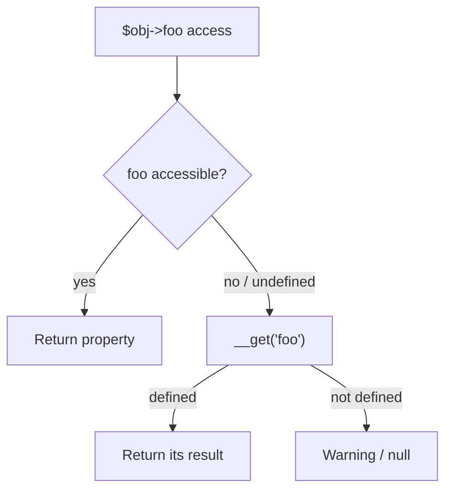

# Object-Oriented Programming

!!! tip "In a nutshell"
    PHP objects use single class inheritance plus interfaces and traits. The one
    fact examiners love: `static::` resolves to the *called* class at runtime
    (late static binding), while `self::` is fixed at compile time.

!!! example "Real-world analogy"
    Imagine a form template with the instruction "print your family name here." Using
    `self::` is like the template author hardcoding *their own* surname into the print
    — fixed the moment the template was written. Using `static::` is instead "use the
    surname of whoever is actually filling out this form right now," resolved at the
    moment of use — so a descendant filling in the same template correctly gets their
    own name. That runtime resolution is late static binding.

!!! abstract "Learning objectives"
    By the end of this chapter you can:

    - [ ] Apply visibility, `static`, and **late static binding** correctly.
    - [ ] Use constructor property promotion and `clone` (incl. `__clone`).
    - [ ] Explain the common magic methods and their invocation order.

    **Syllabus:** `PHP → Object-Oriented Programming` ·
    **Level:** Advanced ·
    **Est. time:** 30 min ·
    **Prerequisites:** [PHP API](php-api.md)

---

## Theory

PHP's object model: single inheritance of classes, multiple interface
implementation, traits for horizontal reuse. Members have **visibility**
(`public`/`protected`/`private`), may be **instance** or **static**, and classes
may be `final`, `abstract`, or (8.2+) `readonly`.

| Concept | One-liner |
|---|---|
| `public` | Accessible everywhere |
| `protected` | Class + subclasses |
| `private` | Declaring class only |
| `static` | Belongs to the class, not an instance |
| `self` | The class where the code is *written* |
| `static` (LSB) | The class that was *called* at runtime |
| `parent` | The parent class |

!!! question "Predict first"
    A parent method does `return new self();`. A subclass `User extends Model`
    calls `User::create()`. What class is the returned object?

??? note "Reveal"
    A `Model` — `self` is fixed at compile time to the class where the code is
    written. Only `new static()` (late static binding) resolves to the called
    class and would return a `User`.

## Deep Dive — how it works internally

### Late static binding (LSB)

`self::` resolves at **compile time** to the class in which the method is
defined. `static::` resolves at **runtime** to the class that received the call
— this is *late static binding*. It matters for inheritance of factory/static
methods.

```php
<?php
declare(strict_types=1);

class Model
{
    public static function create(): static      // return type follows LSB
    {
        return new static();                      // NOT new self()
    }

    public function whoAmI(): string
    {
        return static::class;                     // runtime class
    }
}

final class User extends Model {}

User::create();          // instance of User (thanks to LSB)
(new User())->whoAmI();  // "User"
```

If `create()` used `new self()`, `User::create()` would wrongly return a
`Model`. Symfony uses LSB widely (e.g. static named constructors on value
objects).

### Constructor property promotion

Declaring a promoted parameter (`private int $x`) in the constructor signature
both declares the property and assigns it. Promotion supports visibility,
`readonly`, types, defaults and attributes. You cannot promote in a non-`__construct`
method, and `callable` is not a valid promoted type.

```php
<?php
declare(strict_types=1);

final class Point
{
    public function __construct(
        public readonly int $x = 0,
        public readonly int $y = 0,
    ) {}
}
```

### `clone` and `__clone()`

`clone` performs a **shallow** copy: object-typed properties still reference the
same objects. Implement `__clone()` to deep-copy those references. As of PHP 8.3,
`__clone()` may modify readonly properties of the fresh copy.

```php
<?php
declare(strict_types=1);

final class Order
{
    public \DateTimeImmutable $createdAt;
    public \ArrayObject $lines;

    public function __clone(): void
    {
        // Deep-copy mutable references so clones don't share state.
        $this->lines = clone $this->lines;
    }
}
```

### Magic methods

| Method | Fires when |
|---|---|
| `__construct` / `__destruct` | Instantiation / GC |
| `__get` / `__set` | Access to an **inaccessible/undefined** property |
| `__isset` / `__unset` | `isset()`/`unset()` on inaccessible property |
| `__call` / `__callStatic` | Call to an **inaccessible/undefined** method |
| `__invoke` | Object used as a function `$obj()` |
| `__toString` | Object used as a string (implies `Stringable`) |
| `__clone` | After `clone` copies the object |
| `__debugInfo` | `var_dump()` |



!!! note "Source reference"
    Symfony's `Symfony\Component\HttpFoundation\ParameterBag` and value objects
    demonstrate promotion + LSB —
    [symfony/symfony `8.0`](https://github.com/symfony/symfony/blob/8.0/src/Symfony/Component/HttpFoundation/ParameterBag.php).

## Configuration & code

=== "PHP Attributes"

    ```php
    <?php
    declare(strict_types=1);

    final class Temperature implements \Stringable
    {
        public function __construct(private float $celsius) {}

        public function __toString(): string
        {
            return \sprintf('%.1f°C', $this->celsius);
        }
    }

    echo new Temperature(21.5);   // "21.5°C"
    ```

=== "Console"

    ```console
    $ php -r 'class A{static function f(){return new static();}} class B extends A{} var_dump(B::f() instanceof B);'
    bool(true)
    ```

## Best practices & anti-patterns

| ✅ Do | ❌ Avoid |
|---|---|
| `new static()` in inheritable factories | `new self()` where subclasses call it |
| Deep-copy references in `__clone` | Relying on the default shallow clone |
| Keep magic methods rare + documented | `__get`/`__call` as primary API |
| `final` by default | Deep inheritance chains |

## When (not) to use it / alternatives

- Prefer explicit typed properties over `__get`/`__set` magic — magic hides the
  contract and defeats static analysis.
- Use static methods for named constructors and pure helpers; avoid them as a
  disguised global (hard to test/mock).

!!! danger "Certification traps"
    - `self::` binds at compile time; `static::` (LSB) at runtime.
    - `clone` is **shallow** — nested objects are shared until `__clone` deep-copies.
    - `__get` only fires for **inaccessible or undefined** properties, never for
      accessible ones.
    - You cannot promote a `callable`-typed constructor parameter.

!!! warning "Common mistakes"
    - Expecting `__toString` to fire on `var_dump` (it does not — that's `__debugInfo`).
    - Assuming `private` members of a parent are visible to a child (they are not).

## Exercises

1. **(Advanced)** Add a static named constructor `fromString()` that works
   correctly for subclasses.
2. **(Advanced)** Given an object holding an `ArrayObject`, make `clone` produce
   independent copies.

??? success "Solutions"

    **1.**
    ```php
    <?php
    declare(strict_types=1);

    class Uuid
    {
        private function __construct(public readonly string $value) {}

        public static function fromString(string $v): static
        {
            return new static($v);   // LSB → subclass-safe
        }
    }
    ```

    **2.** Implement `__clone()` and `clone` each mutable property, as in the
    `Order` example above.

## Certification questions

??? question "Q1. `new static()` vs `new self()` inside a parent factory method?"
    - [x] A. `static` respects the called subclass; `self` is fixed to the parent ✅
    - [ ] B. They are identical
    - [ ] C. `self` respects the subclass
    - [ ] D. Both are compile-time only

    **Why:** Late static binding makes `static` resolve to the runtime class.
    **Ref:** [LSB](https://www.php.net/manual/en/language.oop5.late-static-bindings.php).

??? question "Q2. `clone $order` where `$order->lines` is an object — the clone's `lines`…"
    - [x] A. Points to the **same** object unless `__clone` copies it ✅
    - [ ] B. Is always a deep copy
    - [ ] C. Is `null`
    - [ ] D. Throws an error

    **Why:** `clone` is shallow by default. **Ref:** [Object cloning](https://www.php.net/manual/en/language.oop5.cloning.php).

??? question "Q3. When does `__get()` fire?"
    - [ ] A. On every property read
    - [x] B. Only on inaccessible or undefined properties ✅
    - [ ] C. On writes
    - [ ] D. On `isset()`

    **Why:** Accessible properties are read directly; `__isset` handles `isset()`.
    **Ref:** [Overloading](https://www.php.net/manual/en/language.oop5.overloading.php).

??? question "Q4. Which cannot be a promoted constructor parameter?"
    - [ ] A. `public readonly int $x`
    - [ ] B. `private ?string $s = null`
    - [x] C. `private callable $fn` ✅
    - [ ] D. `protected array $items = []`

    **Why:** `callable` is not a valid property type, so it cannot be promoted.
    **Ref:** [Promotion](https://www.php.net/manual/en/language.oop5.decon.php#language.oop5.decon.constructor.promotion).

## Key takeaways

- `static::` = late static binding (runtime); `self::` = compile-time.
- `clone` is shallow — use `__clone` for deep copies.
- Magic methods fire only for inaccessible/undefined members.
- Promotion declares + assigns; supports visibility, `readonly`, defaults.

## Last-minute revision

!!! tip "Cheat sheet"
    - `new static()` for subclass-safe factories.
    - Magic: `__get/__set/__isset/__unset/__call/__callStatic/__invoke/__toString/__clone`.
    - `callable` cannot be promoted; readonly needs a type + no default.
    - Visibility: private = declaring class only; protected = + subclasses.

## Connections

- **Depends on:** [PHP API](php-api.md) — promotion, `readonly` and enums build on this object model.
- **Reused in:** [Traits](traits.md) & [Abstract Classes](abstract-classes.md) — both extend how members are composed and inherited.
- **Confused with:** [Interfaces](interfaces.md) — `self`/`static` and visibility here vs a pure contract with variance rules there.

## Official References
- [PHP: Classes and Objects](https://www.php.net/manual/en/language.oop5.php)
- [PHP: Late Static Bindings](https://www.php.net/manual/en/language.oop5.late-static-bindings.php)
- [PHP: Object cloning](https://www.php.net/manual/en/language.oop5.cloning.php)
- [Symfony source — ParameterBag](https://github.com/symfony/symfony/blob/8.0/src/Symfony/Component/HttpFoundation/ParameterBag.php)

## Confidence check

I'm ready when I can:

- [ ] explain **why** late static binding exists (subclass-safe factories)
- [ ] implement `new static()` and a `__clone` deep-copy in a Symfony 8 value object
- [ ] debug a factory returning the wrong class because it used `new self()`
- [ ] spot the trick: `__get` claimed to fire on an *accessible* property (it does not)
- [ ] explain how `clone` copies object references and when `__clone` runs

---

<small>Related: [PHP API](php-api.md) · [Traits](traits.md) · [Abstract Classes](abstract-classes.md)</small>
