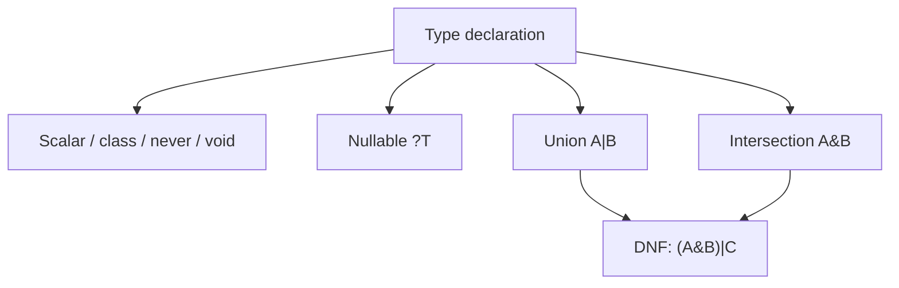

# PHP API (jusqu'à 8.4)

!!! tip "In a nutshell"
    Un tour d'horizon, version par version, de la syntaxe PHP moderne que vous
    devez reconnaître au premier coup d'œil. Retenez quelle version a apporté
    quoi — les vedettes de PHP 8.4 sont les **property hooks** et la
    **visibilité asymétrique** (`public private(set)`).

!!! example "Real-world analogy"
    Apprendre l'API PHP par version, c'est comme un mécanicien qui connaît les
    millésimes des modèles de voitures : les vitres électriques sont arrivées une
    année, l'assistance au maintien de voie une autre, et un expert date une pièce
    d'un simple regard. La certification fonctionne de la même manière — elle vous
    montre une fonctionnalité et attend que vous en nommiez le « millésime »
    (`match` et les attributs en 8.0, les enums en 8.1, les property hooks en 8.4),
    exactement comme le mécanicien situe instantanément à quelle génération
    appartient un composant.

!!! abstract "Learning objectives"
    À la fin de ce chapitre, vous saurez :

    - [ ] Identifier les fonctionnalités du langage pertinentes pour la
          certification ajoutées entre PHP 8.0 et 8.4.
    - [ ] Utiliser correctement les enums, les readonly classes, la syntaxe
          first-class callable, `match`, le nullsafe, les constantes typées et
          les types DNF.
    - [ ] Expliquer les **property hooks** et la **visibilité asymétrique**
          (PHP 8.4) et savoir quand l'examen les attend.

    **Syllabus:** `PHP → PHP API (up to 8.4)` ·
    **Level:** Advanced / Expert ·
    **Est. time:** 35 min ·
    **Prerequisites:** [OOP](oop.md)

---

## Theory

Symfony 8 exige **PHP 8.4+**. La certification vérifie que vous reconnaissez la
syntaxe moderne au premier coup d'œil et que vous en connaissez la sémantique
exacte — pas des détails obscurs, mais les fonctionnalités que vous croisez tous
les jours dans le code Symfony (attributs, enums, promotion, readonly). Ce
chapitre est un tour indexé par version des ajouts du langage qui intéressent
l'examen.

| Version | Fonctionnalités phares (pertinentes pour la certification) |
|---|---|
| 8.0 | `match`, arguments nommés, promotion de constructeur, nullsafe `?->`, attributs, types union, `Stringable`, `throw` en expression |
| 8.1 | **enums**, propriétés `readonly`, syntaxe first-class callable, `never`, types intersection purs, `new` dans les initialiseurs, `array_is_list()` |
| 8.2 | **readonly classes**, types DNF, `true`/`false`/`null` comme types autonomes, `#[\SensitiveParameter]` |
| 8.3 | **constantes de classe typées**, `#[\Override]`, `json_validate()`, récupération dynamique de constantes de classe, readonly classes anonymes |
| 8.4 | **property hooks**, **visibilité asymétrique**, `new` sans parenthèses, `#[\Deprecated]`, lazy objects |

!!! question "Predict first"
    `Suit::from('X')` vs `Suit::tryFrom('X')` quand `'X'` n'est pas un case — que
    fait chacune de ces méthodes ?

??? note "Reveal"
    `from()` lève une `\ValueError` ; `tryFrom()` retourne `null`. Préférez
    `tryFrom` sur une entrée non fiable, afin qu'une valeur inconnue ne fasse pas
    exploser la request.

## Deep Dive — the features one by one

### Enums (8.1)

Les enums forment leur propre sous-sujet de certification, avec un chapitre
complet — **[Enums](enums.fr.md)** — qui couvre les enums purs vs backés,
`UnitEnum`/`BackedEnum`, la distinction `from()`/`tryFrom()`, et comment le
routing (`BackedEnumValueResolver`) et les Forms (`EnumType`) de Symfony les
consomment. Le fait à retenir pour ce tour d'horizon des versions : `from()`
**lève** `\ValueError` sur une valeur inconnue, `tryFrom()` renvoie `null` —
un piège fréquent à l'examen.

### readonly properties (8.1) and readonly classes (8.2)

Une propriété `readonly` ne peut être initialisée qu'**une seule fois**, depuis
la portée de la classe qui la déclare, et jamais modifiée ensuite — même depuis
l'intérieur de la classe. Une `readonly class` (8.2) rend implicitement readonly
*chaque* propriété d'instance et interdit les propriétés dynamiques. Readonly
exige un type et ne peut pas avoir de valeur par défaut.

```php
<?php
declare(strict_types=1);

final readonly class Money
{
    public function __construct(
        public int $amount,
        public string $currency,
    ) {}

    public function add(int $amount): self
    {
        // Cannot mutate $this->amount — return a fresh instance instead.
        return new self($this->amount + $amount, $this->currency);
    }
}
```

Réassigner une propriété readonly lève `Error: Cannot modify readonly property`.
`clone` produit une copie dont les propriétés readonly restent gelées — avant
PHP 8.3+, vous ne pouviez pas les modifier même à l'intérieur de `__clone`.

```php
$a = new Money(100, 'EUR');
// $a->amount = 200;   // Error: Cannot modify readonly property Money::$amount

$b = clone $a;         // the copy keeps its readonly props frozen too
// PHP 8.3+ only: __clone() may reassign readonly props (deep-clone support)
```

### First-class callable syntax (8.1)

`f(...)` crée une `Closure` à partir de n'importe quel callable, sans les
anciennes formes `'strlen'` / `[$obj, 'method']` à base de chaînes et de
tableaux. C'est typé et navigable dans l'IDE.

```php
<?php
declare(strict_types=1);

$upper = strtoupper(...);            // Closure
$fn    = $service->handle(...);      // bound instance method
$stat  = Service::create(...);       // static method
array_map(strlen(...), ['a', 'bb']); // [1, 2]
```

Voir [Closures](closures.md) pour `Closure::fromCallable()` et le binding.

### Named arguments (8.0)

Passez les arguments par nom de paramètre, dans n'importe quel ordre, en sautant
les paramètres optionnels. Idéal pour des appels lisibles ; mais le **nom du
paramètre devient une partie de votre API** — renommer un paramètre est une
rupture de compatibilité (BC break).

```php
<?php
declare(strict_types=1);

htmlspecialchars($s, double_encode: false);
```

### `match` (8.0)

`match` compare en mode **strict** avec `===`, retourne une valeur, n'a pas de
fall-through, et lève une `\UnhandledMatchError` quand rien ne correspond (sauf
si une branche `default` existe). À opposer à `switch` (comparaison lâche `==`,
fall-through, instruction uniquement).

```php
<?php
declare(strict_types=1);

$label = match (true) {
    $n < 0  => 'negative',
    $n === 0 => 'zero',
    default => 'positive',
};
```

### Nullsafe operator `?->` (8.0)

Court-circuite le *reste de la chaîne* vers `null` si l'opérande est `null` ; ce
n'est pas un remplaçant de `??` et il ne peut pas être une lvalue :
`$c = $session?->getUser()?->getAddress()?->country;`.

```php
$country = $session?->getUser()?->getAddress()?->country;
// null as soon as one link is null — the rest of the chain is skipped

$name = $user?->name ?? 'anonymous';  // ?? still supplies the default
// $user?->name = 'x';                // compile error: ?-> is not an lvalue
```

### Typed class constants (8.3)

Les constantes peuvent désormais déclarer un type, appliqué aux constantes qui
les redéfinissent dans les classes enfants.

```php
<?php
declare(strict_types=1);

interface HasVersion
{
    const string VERSION = '8.0';   // child must keep a string
}
```

### `#[\Override]` (8.3)

Marque une méthode comme destinée à redéfinir une méthode d'un parent ou d'une
interface. Si ce n'est **pas** le cas, PHP lève une erreur à la compilation —
ce qui attrape les fautes de frappe et les dérives de signature.

```php
<?php
declare(strict_types=1);
// lint-skip: intentionally demonstrates a fatal error (no parent method)

class Kernel
{
    #[\Override]
    public function boot(): void {}   // errors if parent has no boot()
}
```

### `json_validate()` (8.3)

Valide une chaîne JSON **sans** construire la structure décodée — moins coûteux
en mémoire pour les gros payloads que `json_decode()` suivi d'une vérification
d'erreur.

```php
<?php
if (!json_validate($raw)) {
    throw new \JsonException('Invalid JSON');
}
```

### `new` in initializers (8.1)

`new` est autorisé dans les valeurs par défaut de paramètres et de propriétés,
les variables statiques et les arguments d'attributs — des dépendances par
défaut propres, sans la gymnastique nullable + `??` :

```php
<?php
declare(strict_types=1);

use Psr\Log\LoggerInterface;
use Psr\Log\NullLogger;

final class Reporter
{
    public function __construct(
        private LoggerInterface $logger = new NullLogger(),
    ) {}
}
```

### Property hooks (8.4)

Les hooks ajoutent un comportement **get**/**set** calculé à une propriété, sans
champ de stockage ni getter/setter explicite, remplaçant ainsi bien des
accesseurs répétitifs. Un hook peut être *virtuel* (sans stockage) ou
lire/écrire la valeur de stockage propre à la propriété (référencée par le nom
de la propriété).

```php
<?php
declare(strict_types=1);

final class Temperature
{
    public float $celsius = 0.0;

    // Virtual property computed from $celsius.
    public float $fahrenheit {
        get => $this->celsius * 9 / 5 + 32;
        set (float $f) => $this->celsius = ($f - 32) * 5 / 9;
    }
}
```

### Asymmetric visibility (8.4)

Déclarez une **visibilité différente pour l'écriture et pour la lecture** :
`public private(set)` signifie « lecture partout, écriture uniquement à
l'intérieur de la classe ». Cela offre une immuabilité vue de l'extérieur sans
recourir à un `readonly` complet.

```php
<?php
declare(strict_types=1);

final class Counter
{
    public private(set) int $value = 0;   // read public, write private

    public function increment(): void
    {
        $this->value++;                    // allowed: inside the class
    }
}
```

### DNF types (8.2)

Les types en **Disjunctive Normal Form** combinent union et intersection :
`(A&B)|null`. Les parenthèses regroupent l'intersection ; chaque groupe est
relié par un OU.

```php
<?php
declare(strict_types=1);

use Countable;
use Traversable;

function count_or_zero((Countable&Traversable)|null $c): int
{
    return $c === null ? 0 : count($c);
}
```



!!! note "Source reference"
    Symfony s'appuie sur ces fonctionnalités partout, par exemple les enums
    backed dans `Symfony\Component\Serializer\Normalizer\BackedEnumNormalizer` —
    [symfony/symfony `8.0`](https://github.com/symfony/symfony/blob/8.0/src/Symfony/Component/Serializer/Normalizer/BackedEnumNormalizer.php).

## Best practices & anti-patterns

| ✅ À faire | ❌ À éviter |
|---|---|
| `tryFrom()` pour les entrées non fiables | `from()` sur une entrée utilisateur sans `try` |
| `readonly` pour les value objects | Muter du readonly via la réflexion |
| `match` pour un mapping exhaustif | `switch` quand vous voulez du strict + un retour |
| `#[\Override]` sur les vraies redéfinitions | Une dérive de signature silencieuse |
| Property hooks pour les valeurs calculées | Dupliquer un champ + getter/setter |

## When (not) to use it / alternatives

- Utilisez les **enums** pour un ensemble fermé et connu de valeurs ; réservez
  les constantes de classe aux drapeaux libres ou aux valeurs qui doivent être
  dynamiques.
- Utilisez les **readonly classes** pour les DTO/value objects ; évitez-les pour
  les entités qui doivent muter.
- Optez pour les **property hooks** quand un getter/setter ne ferait
  qu'envelopper un champ ; gardez de simples propriétés publiques quand aucune
  logique n'est nécessaire.

!!! danger "Certification traps"
    - `match` utilise une comparaison **stricte** et lève une
      `\UnhandledMatchError` ; `switch` utilise une comparaison lâche et fait du
      fall-through.
    - `Enum::from()` lève une `\ValueError` ; `tryFrom()` retourne `null`.
    - `readonly` exige une propriété **typée** et **sans valeur par défaut** ;
      vous ne pouvez pas marquer readonly une propriété `static` ou non typée.
    - `public private(set)` se lit toujours en **public** — ne confondez pas
      avec `readonly` (qui bloque les écritures même en interne après
      l'initialisation).
    - `?->` court-circuite toute la chaîne vers `null` ; ce n'est pas `??`.

!!! warning "Common mistakes"
    - Ajouter un état mutable à une enum — les cases sont des singletons sans
      état.
    - Attendre de `json_validate()` qu'elle retourne la valeur décodée ; elle
      retourne un `bool`.
    - Utiliser `new` dans un initialiseur qui référence `$this` — interdit pour
      les valeurs par défaut de propriétés, évaluées avant la construction.

## Exercises

1. **(Advanced)** Écrivez une enum backed `HttpMethod: string` avec une méthode
   `isSafe(): bool` qui retourne true pour GET/HEAD.
2. **(Expert)** Convertissez une classe dont `getTotal()`/`setTotal()`
   enveloppent un `$total` privé en une seule propriété utilisant un
   **property hook**.
3. **(Expert)** Donnez à une classe un `public protected(set) string $id` et
   expliquez qui peut y écrire.

??? success "Solutions"

    **1.**
    ```php
    <?php
    declare(strict_types=1);

    enum HttpMethod: string
    {
        case Get = 'GET';
        case Head = 'HEAD';
        case Post = 'POST';

        public function isSafe(): bool
        {
            return match ($this) {
                self::Get, self::Head => true,
                default => false,
            };
        }
    }
    ```

    **2.**
    ```php
    <?php
    declare(strict_types=1);

    final class Cart
    {
        private float $rawTotal = 0.0;

        public float $total {
            get => $this->rawTotal;
            set (float $v) => $this->rawTotal = max(0.0, $v);
        }
    }
    ```
    Un hook supprime le getter/setter tout en conservant la logique de bornage.

    **3.** `public protected(set)` autorise la lecture depuis n'importe où mais
    l'écriture uniquement depuis l'intérieur de la classe **ou de ses
    sous-classes** (portée protected).

## Certification questions

??? question "Q1. What does `Suit::tryFrom('X')` return when `X` is not a case?"
    - [ ] A. Throws `\ValueError`
    - [x] B. `null` ✅
    - [ ] C. `false`
    - [ ] D. The first case

    **Why:** `tryFrom()` retourne `null` pour les valeurs inconnues ; seule
    `from()` lève une `\ValueError`. **Ref:** [PHP enums](https://www.php.net/manual/en/language.enumerations.backed.php).

??? question "Q2. Which statement about `match` is correct?"
    - [x] A. It compares with `===` and throws `\UnhandledMatchError` on no match ✅
    - [ ] B. It falls through like `switch`
    - [ ] C. It uses loose `==` comparison
    - [ ] D. It cannot return a value

    **Why:** `match` est strict, retourne une valeur et lève une erreur en
    l'absence de correspondance sans `default`. **Ref:** [match](https://www.php.net/manual/en/control-structures.match.php).

??? question "Q3. `public private(set) int $n;` means…"
    - [ ] A. `$n` is readonly
    - [x] B. `$n` can be read publicly but written only inside the class ✅
    - [ ] C. `$n` is invisible outside the class
    - [ ] D. `$n` is static

    **Why:** La visibilité asymétrique (8.4) définit une portée d'écriture plus
    stricte que la portée de lecture. **Ref:** [Asymmetric visibility](https://www.php.net/manual/en/language.oop5.visibility.php).

??? question "Q4. Which type declaration is a valid DNF type?"
    - [ ] A. `A|B&C`
    - [x] B. `(A&B)|null` ✅
    - [ ] C. `?A&B`
    - [ ] D. `A&?B`

    **Why:** La DNF exige que chaque intersection soit parenthésée, puis reliée
    par un OU ; un `A|B&C` nu est une erreur de parsing. **Ref:** [Types](https://www.php.net/manual/en/language.types.declarations.php).

??? question "Q5. What does `json_validate($s)` return?"
    - [ ] A. The decoded array
    - [ ] B. A `stdClass`
    - [x] C. A `bool` indicating validity ✅
    - [ ] D. `null` on success

    **Why:** Elle ne fait que signaler la validité, en consommant moins de
    mémoire qu'un décodage.
    **Ref:** [json_validate](https://www.php.net/manual/en/function.json-validate.php).

## Key takeaways

- Connaissez la **version** de chaque fonctionnalité et sa sémantique exacte ;
  l'examen sonde les cas limites.
- `match`/enum/`readonly` sont partout dans le code Symfony 8 — lisez-les
  couramment.
- Les vedettes de PHP 8.4 : **property hooks** et **visibilité asymétrique**.
- `from()` lève une exception, `tryFrom()` retourne `null` ; `match` est strict.

## Last-minute revision

!!! tip "Cheat sheet"
    - 8.1 : enums, propriété `readonly`, `f(...)`, `never`, `new` dans les
      initialiseurs.
    - 8.2 : `readonly class`, types DNF, types `true`/`false`/`null`.
    - 8.3 : constantes typées, `#[\Override]`, `json_validate()`.
    - 8.4 : property hooks, visibilité asymétrique (`private(set)`), `new` sans `()`.
    - `match`===strict + lève ; `tryFrom`=null, `from`=`\ValueError`.

## Connections

- **Depends on:** [OOP](oop.md) — la promotion, `readonly` et la visibilité sous-tendent ces fonctionnalités.
- **Reused in:** [Closures](closures.md) — la syntaxe first-class callable ; [Interfaces](interfaces.md) — constantes typées et types DNF.
- **Confused with:** [OOP](oop.md) `readonly` — avec la visibilité asymétrique `private(set)`, la *lecture* reste publique et les écritures internes restent permises.

## Official References
- [PHP: Enumerations](https://www.php.net/manual/en/language.enumerations.php)
- [PHP: Property hooks](https://www.php.net/manual/en/language.oop5.property-hooks.php)
- [PHP: Asymmetric visibility](https://www.php.net/manual/en/language.oop5.visibility.php)
- [PHP: match](https://www.php.net/manual/en/control-structures.match.php)
- [Symfony source — BackedEnumNormalizer](https://github.com/symfony/symfony/blob/8.0/src/Symfony/Component/Serializer/Normalizer/BackedEnumNormalizer.php)

## Video references

!!! tip "Watch & learn"
    Voici des chaînes vidéo officielles, mises à jour en continu — cherchez-y
    « PHP & web security » pour consolider ce chapitre. Nous lions des chaînes
    stables plutôt que des vidéos individuelles afin que les références ne se
    périment jamais.

    - [SymfonyCasts screencasts](https://symfonycasts.com/tracks/symfony) — des tutoriels scénarisés à coder en suivant.
    - [Symfony official YouTube](https://www.youtube.com/@SymfonyOfficial) — conférences et keynotes des SymfonyCon.
    - [Official docs for this topic](https://symfony.com/doc/current/index.html) — certaines pages de la doc Symfony intègrent un screencast.

## Confidence check

Je suis prêt quand je peux :

- [ ] expliquer **pourquoi** chaque fonctionnalité existe et quelle version de PHP l'a ajoutée
- [ ] utiliser les enums, `readonly`, `match`, les property hooks et `private(set)` dans Symfony 8
- [ ] déboguer une `\UnhandledMatchError` ou une `\ValueError` issue de `Enum::from()`
- [ ] repérer le piège : `match` (strict `===`) vs `switch` (lâche `==`, fall-through)
- [ ] expliquer comment un property hook calcule une valeur virtuelle sans champ de stockage

---

<small>Related: [OOP](oop.md) · [Interfaces](interfaces.md) · [Closures](closures.md)</small>
