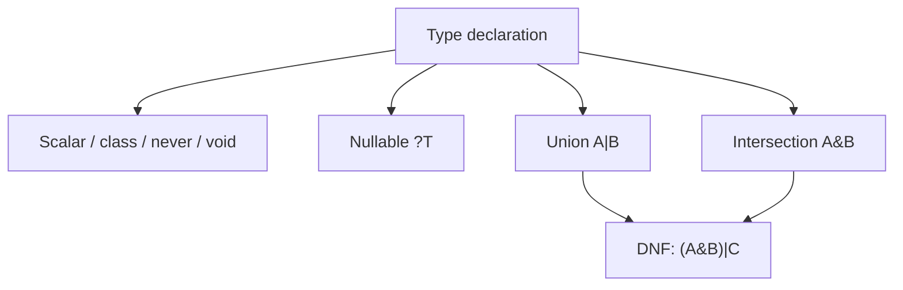

# PHP API (up to 8.4)

!!! tip "In a nutshell"
    A version-by-version tour of the modern PHP syntax you must recognise on
    sight. Remember which release added what — the PHP 8.4 headliners are
    **property hooks** and **asymmetric visibility** (`public private(set)`).

!!! abstract "Learning objectives"
    By the end of this chapter you can:

    - [ ] Identify the cert-relevant language features added in PHP 8.0 → 8.4.
    - [ ] Use enums, readonly classes, first-class callables, `match`, nullsafe,
          typed constants and DNF types correctly.
    - [ ] Explain **property hooks** and **asymmetric visibility** (PHP 8.4) and
          when the exam expects them.

    **Syllabus:** `PHP → PHP API (up to 8.4)` ·
    **Level:** Advanced / Expert ·
    **Est. time:** 35 min ·
    **Prerequisites:** [OOP](oop.md)

---

## Theory

Symfony 8 requires **PHP 8.4+**. The certification tests whether you recognise
modern syntax on sight and know its exact semantics — not obscure trivia, but the
features you meet daily in Symfony code (attributes, enums, promotion, readonly).
This chapter is a version-indexed tour of the language additions the exam cares
about.

| Version | Head-line features (cert-relevant) |
|---|---|
| 8.0 | `match`, named args, constructor promotion, nullsafe `?->`, attributes, union types, `Stringable`, `throw` as expression |
| 8.1 | **enums**, `readonly` properties, first-class callable syntax, `never`, pure intersection types, `new` in initializers, `array_is_list()` |
| 8.2 | **readonly classes**, DNF types, `true`/`false`/`null` as standalone types, `#[\SensitiveParameter]` |
| 8.3 | **typed class constants**, `#[\Override]`, `json_validate()`, dynamic class-constant fetch, anonymous readonly classes |
| 8.4 | **property hooks**, **asymmetric visibility**, `new` without parentheses, `#[\Deprecated]`, lazy objects |

!!! question "Predict first"
    `Suit::from('X')` vs `Suit::tryFrom('X')` when `'X'` is not a case — what does
    each do?

??? note "Reveal"
    `from()` throws `\ValueError`; `tryFrom()` returns `null`. Reach for `tryFrom`
    on untrusted input so an unknown value doesn't blow up the request.

## Deep Dive — the features one by one

### Enums (8.1)

Enums are a first-class type. **Pure** enums have only cases; **backed** enums
map each case to an `int` or `string` scalar and expose `from()`/`tryFrom()`
plus a read-only `->value`. Both implement `UnitEnum`; backed enums also
implement `BackedEnum`. Enums may hold constants, methods and implement
interfaces, but **cannot** have (non-constant) state — cases are singletons, so
`===` identity comparison always works.

```php
<?php
declare(strict_types=1);

enum Suit: string
{
    case Hearts = 'H';
    case Spades = 'S';

    public function color(): string
    {
        return match ($this) {
            Suit::Hearts => 'red',
            Suit::Spades => 'black',
        };
    }
}

Suit::from('H');        // Suit::Hearts
Suit::tryFrom('X');     // null (no exception)
Suit::cases();          // [Suit::Hearts, Suit::Spades]
```

`from()` throws `\ValueError` on an unknown value; `tryFrom()` returns `null`.
This distinction is a frequent exam trap. Symfony's Serializer, Forms
(`EnumType`) and routing (enum as a requirement) all lean on backed enums.

### readonly properties (8.1) and readonly classes (8.2)

A `readonly` property can be initialised **once**, from within the declaring
class scope, and never mutated afterwards — even from inside the class. A
`readonly class` (8.2) makes *every* instance property readonly implicitly and
forbids dynamic properties. Readonly requires a type and cannot have a default.

```php
<?php
declare(strict_types=1);

final readonly class Money
{
    public function __construct(
        public int $amount,
        public string $currency,
    ) {}

    public function add(int $amount): self
    {
        // Cannot mutate $this->amount — return a fresh instance instead.
        return new self($this->amount + $amount, $this->currency);
    }
}
```

Reassigning a readonly property throws `Error: Cannot modify readonly property`.
`clone` produces a copy whose readonly props are still frozen — until PHP 8.3+
you could not modify them even inside `__clone`.

### First-class callable syntax (8.1)

`f(...)` creates a `Closure` from any callable without the old
`'strlen'` / `[$obj, 'method']` string arrays. It is type-safe and
IDE-navigable.

```php
<?php
declare(strict_types=1);

$upper = strtoupper(...);            // Closure
$fn    = $service->handle(...);      // bound instance method
$stat  = Service::create(...);       // static method
array_map(strlen(...), ['a', 'bb']); // [1, 2]
```

See [Closures](closures.md) for `Closure::fromCallable()` and binding.

### Named arguments (8.0)

Pass arguments by parameter name, in any order, skipping optional ones. Great
for readable calls; but the **parameter name becomes part of your API** — renaming
a parameter is a BC break.

```php
<?php
declare(strict_types=1);

htmlspecialchars($s, double_encode: false);
```

### `match` (8.0)

`match` compares with **strict** `===`, returns a value, has no fall-through,
and throws `\UnhandledMatchError` when nothing matches (unless a `default` arm
exists). Contrast with `switch` (loose `==`, fall-through, statement only).

```php
<?php
declare(strict_types=1);

$label = match (true) {
    $n < 0  => 'negative',
    $n === 0 => 'zero',
    default => 'positive',
};
```

### Nullsafe operator `?->` (8.0)

Short-circuits the *rest of the chain* to `null` if the operand is `null`; it is
not a `??` replacement and cannot be an lvalue:
`$c = $session?->getUser()?->getAddress()?->country;`.

### Typed class constants (8.3)

Constants may now declare a type, enforced against overriding constants in
children.

```php
<?php
declare(strict_types=1);

interface HasVersion
{
    const string VERSION = '8.0';   // child must keep a string
}
```

### `#[\Override]` (8.3)

Marks a method as intended to override a parent/interface method. If it does
**not**, PHP raises a compile-time error — catching typos and signature drift.

```php
<?php
declare(strict_types=1);
// lint-skip: intentionally demonstrates a fatal error (no parent method)

class Kernel
{
    #[\Override]
    public function boot(): void {}   // errors if parent has no boot()
}
```

### `json_validate()` (8.3)

Validates a JSON string **without** building the decoded structure — cheaper on
memory for large payloads than `json_decode()` + error check.

```php
<?php
if (!json_validate($raw)) {
    throw new \JsonException('Invalid JSON');
}
```

### `new` in initializers (8.1)

`new` is allowed in parameter/property defaults, static variables and attribute
arguments — clean default dependencies without a nullable + `??` dance:

```php
<?php
declare(strict_types=1);

use Psr\Log\LoggerInterface;
use Psr\Log\NullLogger;

final class Reporter
{
    public function __construct(
        private LoggerInterface $logger = new NullLogger(),
    ) {}
}
```

### Property hooks (8.4)

Hooks add computed **get**/**set** behaviour to a property without a backing
field or explicit getter/setter, replacing many boilerplate accessors. A hook
can be *virtual* (no backing store) or read/write the property's own backing
value (referenced through the property name).

```php
<?php
declare(strict_types=1);

final class Temperature
{
    public float $celsius = 0.0;

    // Virtual property computed from $celsius.
    public float $fahrenheit {
        get => $this->celsius * 9 / 5 + 32;
        set (float $f) => $this->celsius = ($f - 32) * 5 / 9;
    }
}
```

### Asymmetric visibility (8.4)

Declare a **different visibility for writing than for reading**:
`public private(set)` means "read anywhere, write only inside the class". It
gives immutability-from-outside without full `readonly`.

```php
<?php
declare(strict_types=1);

final class Counter
{
    public private(set) int $value = 0;   // read public, write private

    public function increment(): void
    {
        $this->value++;                    // allowed: inside the class
    }
}
```

### DNF types (8.2)

**Disjunctive Normal Form** types combine union and intersection:
`(A&B)|null`. Parentheses group the intersection; each group is OR-ed.

```php
<?php
declare(strict_types=1);

use Countable;
use Traversable;

function count_or_zero((Countable&Traversable)|null $c): int
{
    return $c === null ? 0 : count($c);
}
```



!!! note "Source reference"
    Symfony leans on these features throughout, e.g. backed enums in
    `Symfony\Component\Serializer\Normalizer\BackedEnumNormalizer` —
    [symfony/symfony `8.0`](https://github.com/symfony/symfony/blob/8.0/src/Symfony/Component/Serializer/Normalizer/BackedEnumNormalizer.php).

## Best practices & anti-patterns

| ✅ Do | ❌ Avoid |
|---|---|
| `tryFrom()` for untrusted input | `from()` on user input without a `try` |
| `readonly` for value objects | Mutating readonly via reflection |
| `match` for exhaustive mapping | `switch` where you want strict + a return |
| `#[\Override]` on real overrides | Silent signature drift |
| Property hooks for computed values | Duplicating a field + getter/setter |

## When (not) to use it / alternatives

- Use **enums** for a closed, known set of values; use class constants only for
  loose flags or when values must be dynamic.
- Use **readonly classes** for DTOs/value objects; skip them for entities that
  must mutate.
- Reach for **property hooks** when a getter/setter would only wrap a field;
  keep plain public properties when no logic is needed.

!!! danger "Certification traps"
    - `match` uses **strict** comparison and throws `\UnhandledMatchError`;
      `switch` uses loose comparison and falls through.
    - `Enum::from()` throws `\ValueError`; `tryFrom()` returns `null`.
    - `readonly` needs a **typed** property and **no default**; you cannot mark a
      `static` property or an untyped one readonly.
    - `public private(set)` still reads as **public** — do not confuse with
      `readonly` (which blocks writes even internally after init).
    - `?->` short-circuits the whole chain to `null`; it is not `??`.

!!! warning "Common mistakes"
    - Adding mutable state to an enum — cases are singletons and stateless.
    - Expecting `json_validate()` to return the decoded value; it returns `bool`.
    - Using `new` in an initializer that references `$this` — not allowed for
      property defaults evaluated before construction.

## Exercises

1. **(Advanced)** Write a backed enum `HttpMethod: string` with a method
   `isSafe(): bool` returning true for GET/HEAD.
2. **(Expert)** Convert a class with `getTotal()`/`setTotal()` wrapping a private
   `$total` into a single property using a **property hook**.
3. **(Expert)** Give a class a `public protected(set) string $id` and explain who
   can write it.

??? success "Solutions"

    **1.**
    ```php
    <?php
    declare(strict_types=1);

    enum HttpMethod: string
    {
        case Get = 'GET';
        case Head = 'HEAD';
        case Post = 'POST';

        public function isSafe(): bool
        {
            return match ($this) {
                self::Get, self::Head => true,
                default => false,
            };
        }
    }
    ```

    **2.**
    ```php
    <?php
    declare(strict_types=1);

    final class Cart
    {
        private float $rawTotal = 0.0;

        public float $total {
            get => $this->rawTotal;
            set (float $v) => $this->rawTotal = max(0.0, $v);
        }
    }
    ```
    A hook removes the getter/setter while keeping the clamping logic.

    **3.** `public protected(set)` allows reads from anywhere but writes only
    from within the class **or its subclasses** (protected scope).

## Certification questions

??? question "Q1. What does `Suit::tryFrom('X')` return when `X` is not a case?"
    - [ ] A. Throws `\ValueError`
    - [x] B. `null` ✅
    - [ ] C. `false`
    - [ ] D. The first case

    **Why:** `tryFrom()` returns `null` for unknown values; only `from()` throws
    `\ValueError`. **Ref:** [PHP enums](https://www.php.net/manual/en/language.enumerations.backed.php).

??? question "Q2. Which statement about `match` is correct?"
    - [x] A. It compares with `===` and throws `\UnhandledMatchError` on no match ✅
    - [ ] B. It falls through like `switch`
    - [ ] C. It uses loose `==` comparison
    - [ ] D. It cannot return a value

    **Why:** `match` is strict, returns a value, and errors when unmatched with no
    `default`. **Ref:** [match](https://www.php.net/manual/en/control-structures.match.php).

??? question "Q3. `public private(set) int $n;` means…"
    - [ ] A. `$n` is readonly
    - [x] B. `$n` can be read publicly but written only inside the class ✅
    - [ ] C. `$n` is invisible outside the class
    - [ ] D. `$n` is static

    **Why:** Asymmetric visibility (8.4) sets a stricter write scope than read
    scope. **Ref:** [Asymmetric visibility](https://www.php.net/manual/en/language.oop5.visibility.php).

??? question "Q4. Which type declaration is a valid DNF type?"
    - [ ] A. `A|B&C`
    - [x] B. `(A&B)|null` ✅
    - [ ] C. `?A&B`
    - [ ] D. `A&?B`

    **Why:** DNF requires each intersection to be parenthesised, then OR-ed; a
    bare `A|B&C` is a parse error. **Ref:** [Types](https://www.php.net/manual/en/language.types.declarations.php).

??? question "Q5. What does `json_validate($s)` return?"
    - [ ] A. The decoded array
    - [ ] B. A `stdClass`
    - [x] C. A `bool` indicating validity ✅
    - [ ] D. `null` on success

    **Why:** It only reports validity, using less memory than decoding.
    **Ref:** [json_validate](https://www.php.net/manual/en/function.json-validate.php).

## Key takeaways

- Know each feature's **version** and exact semantics; the exam probes edges.
- `match`/enum/`readonly` are everywhere in Symfony 8 code — read them fluently.
- PHP 8.4 headline items: **property hooks** and **asymmetric visibility**.
- `from()` throws, `tryFrom()` returns `null`; `match` is strict.

## Last-minute revision

!!! tip "Cheat sheet"
    - 8.1: enums, `readonly` prop, `f(...)`, `never`, `new` in init.
    - 8.2: `readonly class`, DNF types, `true`/`false`/`null` types.
    - 8.3: typed constants, `#[\Override]`, `json_validate()`.
    - 8.4: property hooks, asymmetric visibility (`private(set)`), `new` w/o `()`.
    - `match`===strict + throws; `tryFrom`=null, `from`=`\ValueError`.

## Connections

- **Depends on:** [OOP](oop.md) — promotion, `readonly` and visibility underpin these features.
- **Reused in:** [Closures](closures.md) — first-class callable syntax; [Interfaces](interfaces.md) — typed constants and DNF types.
- **Confused with:** [OOP](oop.md) `readonly` — asymmetric visibility `private(set)` still *reads* public and allows internal writes.

## Official References
- [PHP: Enumerations](https://www.php.net/manual/en/language.enumerations.php)
- [PHP: Property hooks](https://www.php.net/manual/en/language.oop5.property-hooks.php)
- [PHP: Asymmetric visibility](https://www.php.net/manual/en/language.oop5.visibility.php)
- [PHP: match](https://www.php.net/manual/en/control-structures.match.php)
- [Symfony source — BackedEnumNormalizer](https://github.com/symfony/symfony/blob/8.0/src/Symfony/Component/Serializer/Normalizer/BackedEnumNormalizer.php)

## Confidence check

I'm ready when I can:

- [ ] explain **why** each feature exists and which PHP version added it
- [ ] use enums, `readonly`, `match`, property hooks and `private(set)` in Symfony 8
- [ ] debug an `\UnhandledMatchError` or a `\ValueError` from `Enum::from()`
- [ ] spot the trick: `match` (strict `===`) vs `switch` (loose `==`, fall-through)
- [ ] explain how a property hook computes a virtual value without a backing field

---

<small>Related: [OOP](oop.md) · [Interfaces](interfaces.md) · [Closures](closures.md)</small>
