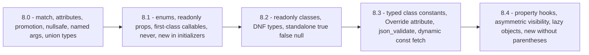
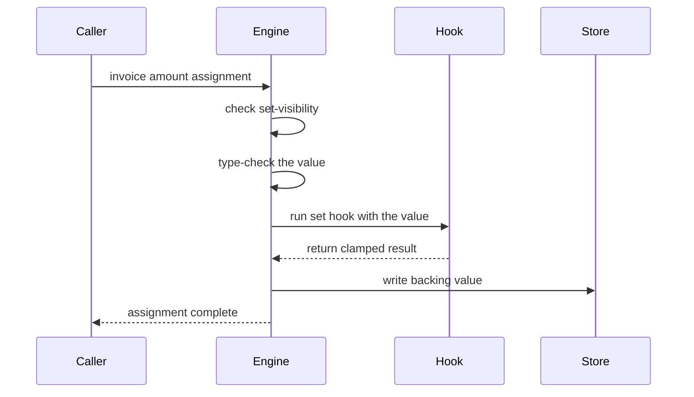

# PHP API (up to 8.4)

!!! tip "In a nutshell"
    Symfony 8 requires **PHP 8.4+**, so the exam assumes you read modern syntax on
    sight *and* can date it. The 8.4 headliners are **property hooks**, **asymmetric
    visibility** (`public private(set)`) and **native lazy objects**. The three facts
    that decide most questions: a hook makes a property *backed* the moment it touches
    the property itself, `private(set)` is not `readonly`, and since 8.4 `readonly` is
    implicitly `protected(set)` — not `private(set)`.

!!! example "Real-world analogy"
    Think of a building inspector reading a house. A three-prong grounded socket dates
    the wiring to one era, an RCD breaker to another, a heat-pump loop to the newest.
    The inspector does not memorise catalogues — they read *what is installed* and infer
    the year, then reason about what that year implies for the rest of the house. This
    chapter trains the same reflex on PHP: `match` and `#[Attr]` date a file to 8.0 or
    later, `enum` to 8.1, `readonly class` to 8.2, `#[\Override]` to 8.3, and
    `public private(set)` to 8.4 — and each of those dates tells you which rules apply.

!!! abstract "Learning objectives"
    By the end of this chapter you can:

    - [ ] Date every cert-relevant language feature added between PHP 8.0 and 8.4.
    - [ ] Use enums, `readonly`, first-class callables, `match`, nullsafe, typed
          constants, `#[\Override]`, DNF types and the 8.4 array functions correctly.
    - [ ] Explain **property hooks** (backed vs virtual), **asymmetric visibility** and
          **lazy objects**, including the traps each one carries.
    - [ ] Recognise the PHP 8.4 deprecation of **implicitly nullable parameters**.

    **Syllabus:** `PHP → PHP API (up to 8.4)` ·
    **Level:** Advanced / Expert ·
    **Est. time:** 55 min ·
    **Prerequisites:** [OOP](oop.md)

    **Examen Symfony 8 :** OUI

---

## Prerequisites

You need classes, visibility, inheritance and constructor promotion from
[OOP](oop.md), plus the type-declaration vocabulary from
[Interfaces & Type Declarations](interfaces.md). Everything below targets **PHP 8.4**,
which is the floor Symfony 8 declares in its own `composer.json`
(`"php": ">=8.4"`) and in the installation requirements.

!!! info "Official Symfony 8.0 reference"
    https://symfony.com/doc/8.0/setup.html

!!! note "Symfony 8.0 source reference"
    https://github.com/symfony/symfony/blob/8.0/composer.json

## The problem we are solving

Here is a class that a Symfony 8 codebase would genuinely contain:

```php
final class Cart
{
    private float $rawTotal = 0.0;

    public function getTotal(): float
    {
        return $this->rawTotal;
    }

    public function setTotal(float $v): void
    {
        $this->rawTotal = max(0.0, $v);
    }
}
```

Nothing here is *wrong*. But six lines exist only to guard one number, callers must
learn two method names instead of reading a property, and nothing stops an internal
method from bypassing the clamp. Each PHP release since 8.0 has removed one such tax:
`match` removed the fall-through footgun, enums removed stringly-typed constants,
`readonly` removed defensive copying, and 8.4's property hooks remove the getter/setter
pair entirely while keeping the clamp.

The exam does not ask you to admire this. It asks you *which version* removed *which*
tax, and what the replacement's exact semantics are. That pairing — feature plus
version plus edge case — is the whole chapter.

## 🧠 Pour les nuls

**C'est quoi ?** Le « PHP API » de l'examen, ce n'est pas une bibliothèque : c'est
l'inventaire des **nouveautés du langage** ajoutées de PHP 8.0 à PHP 8.4, avec pour
chacune sa version d'apparition et son comportement exact.

**Pourquoi ça existe ?** Symfony 8 impose PHP 8.4 au minimum. Le framework lui-même est
écrit avec ces nouveautés : si tu ne reconnais pas `public private(set)` ou un *property
hook*, tu ne peux pas lire le code du framework, ni comprendre les messages d'erreur
qu'il produit.

**🏠 Analogie de la vraie vie :** le **carnet d'entretien d'un immeuble**. Chaque étage
a été rénové une année différente : l'ascenseur date de 2020, l'interphone de 2021, les
compteurs individuels de 2024. Un expert entre dans le hall, regarde l'interphone et
annonce l'année sans hésiter — puis il en déduit quelles normes s'appliquent. Un
`enum` dans un fichier, c'est l'interphone de 2021 : ça date le fichier à PHP 8.1
minimum, et ça impose les règles de 8.1.

**Symfony dans la vraie vie :** le carnet d'entretien → le tableau des versions plus
bas / l'expert qui date une pièce → toi devant une question d'examen / la norme imposée
par l'année → la règle exacte (`from()` lève une erreur, `tryFrom()` renvoie `null`) /
les compteurs individuels de 2024 → les *property hooks* de PHP 8.4, la nouveauté la
plus testée parce que la plus récente.

**💻 Exemple Symfony extrêmement simple :**
```php
final class Compte
{
    // PHP 8.4 : lisible partout, modifiable uniquement dans la classe.
    public private(set) float $solde = 0.0;

    public function crediter(float $montant): void
    {
        $this->solde += $montant;   // autorisé : on est dans la classe
    }
}
```
Ligne 4 : le premier mot (`public`) règle la **lecture**, le second (`private(set)`)
règle l'**écriture**. Ligne 8 : l'écriture interne reste possible, autant de fois que
nécessaire. Dehors, `$compte->solde = 99;` provoque une erreur fatale.

**🔍 Que se passe-t-il réellement ?**
1. Le moteur compile la classe et enregistre **deux portées** pour `$solde` : une pour
   lire, une pour écrire.
2. À chaque lecture, il vérifie la portée de lecture (ici : publique, donc toujours OK).
3. À chaque écriture, il vérifie la portée d'écriture (ici : privée).
4. Si l'écriture vient de l'extérieur, il lève `Error: Cannot modify private(set)
   property`.
5. Une propriété `private(set)` devient automatiquement `final` : aucune classe fille ne
   peut la redéclarer.
6. Tout cela est vérifié **au chargement de la classe** pour la syntaxe, et **à
   l'exécution** pour chaque écriture.

**⚠️ Erreur fréquente :** confondre `private(set)` et `readonly`. `readonly` interdit
toute écriture **après la première**, même à l'intérieur de la classe. `private(set)`
autorise autant d'écritures internes qu'on veut, et ne bloque que l'extérieur. Deuxième
piège : croire qu'une propriété non typée peut recevoir `private(set)` — impossible, le
moteur exige un type.

**🧠 Comment le mémoriser ?** *« Le premier mot ouvre la porte, le second ferme le
tiroir. »* `public private(set)` = tout le monde peut regarder, seule la classe peut
ranger. Et pour la frise : **0 = match, 1 = enum, 2 = readonly class, 3 = typed const,
4 = hooks**.

## Build the mental model

Two mental structures cover almost every question in this topic.

**One: a timeline you can walk in both directions.** Given a feature, name the version;
given a version, list its headline features. The exam swaps adjacent releases
constantly — union types (8.0) versus intersection types (8.1), `readonly` properties
(8.1) versus `readonly` classes (8.2).



The diagram is the spine of the chapter: each node is one exam-sized bundle, and the
arrows are the only ordering you have to remember. Nothing in a later node existed in
an earlier one — a question that shows you `readonly class` and asks "does this run on
PHP 8.1?" is answered by the arrow alone.

**Two: every 8.4 property feature answers one of two questions.** *Who may write?* is
asymmetric visibility. *What happens on read or write?* is property hooks. They are
orthogonal, they compose, and confusing them with `readonly` — which answers *how many
times may anyone write?* — produces most of the wrong answers in this topic.

| Question the feature answers | Feature | Version |
|---|---|---|
| How many times may this be written? | `readonly` | 8.1 (property), 8.2 (class) |
| **Who** may write it? | asymmetric visibility | 8.4 |
| **What runs** on read/write? | property hooks | 8.4 |

!!! info "PHP 8.4 reference"
    https://www.php.net/manual/en/migration84.new-features.php

## Core concepts

The version table below is the cert-relevant subset — not an exhaustive changelog. Each
row is sourced from that release's "New Features" appendix in the PHP manual.

| Version | Head-line features (cert-relevant) |
|---|---|
| 8.0 | `match`, named arguments, constructor promotion, nullsafe `?->`, attributes, union types, `Stringable`, `$obj::class`, `static` return type, `throw` as an expression |
| 8.1 | **enums**, `readonly` properties, first-class callable syntax `f(...)`, `never`, pure intersection types, `new` in initializers, `final` class constants, `array_is_list()` |
| 8.2 | **readonly classes**, DNF types, `true`/`false`/`null` as standalone types, `#[\SensitiveParameter]`, constants in traits |
| 8.3 | **typed class constants**, `#[\Override]`, `json_validate()`, dynamic class-constant fetch `C::{$name}`, anonymous `readonly` classes, readonly reinitialisation in `__clone()` |
| 8.4 | **property hooks**, **asymmetric visibility**, **lazy objects**, `new Foo()->bar()` without parentheses, `#[\Deprecated]`, `array_find()`/`array_any()`/`array_all()`, implicitly nullable parameters **deprecated** |

Two rows deserve a warning label. 8.1 gave interfaces *overridable* constants at the
same time it gave them `final` ones — both halves of that change are examinable. And
8.4 is the only release in the table that **deprecates** something you will still see in
older tutorials: `function f(string $a = null)`.

!!! info "PHP 8.4 reference"
    https://www.php.net/manual/en/migration81.new-features.php

## Learn by doing

We modernise the `Cart` from the opening problem, one release at a time. Each step
changes exactly one thing, and each step is legal PHP 8.4 on its own.

**Step 1 — replace stringly-typed status with an enum (8.1).**

```php
<?php
declare(strict_types=1);

enum CartStatus: string
{
    case Open = 'open';
    case Ordered = 'ordered';

    public function isEditable(): bool
    {
        return $this === self::Open;
    }
}
```

The enum is *backed* by strings, so it round-trips to a database column. `case Open`
is a singleton object, which is why `$a === $b` is the correct comparison and why
`match ($status)` works on cases directly.

**Step 2 — read untrusted input safely.** The pair to memorise:

```php
$status = CartStatus::tryFrom($_GET['status'] ?? '') ?? CartStatus::Open;
```

`tryFrom()` returns `null` on an unknown value; `from()` throws `\ValueError`. On
PHP 8.4 the exact message is `"Z" is not a valid backing value for enum CartStatus`.

**Step 3 — collapse the getter/setter into a hook (8.4).**

```php
<?php
declare(strict_types=1);

final class Cart
{
    public float $total = 0.0 {
        set => max(0.0, $value);
    }
}
```

The getter/setter pair is gone and the clamp survived. The short `set => expr` form writes **the expression's result**
into the backing value, and when the parameter type equals the property type it may be
omitted — the incoming value is then automatically named `$value`.

**Step 4 — add a derived value, and watch "virtual" appear.**

```php
<?php
declare(strict_types=1);

final class Cart
{
    public float $total = 0.0 {
        set => max(0.0, $value);
    }

    public float $totalWithVat {
        get => $this->total * 1.2;
    }
}
```

`$totalWithVat` never mentions `$this->totalWithVat`, so it is **virtual**: it occupies
no memory in the object, and because no `set` hook is defined, writing to it errors.
`$total` *is* backed — the short `set` writes to it.

**Step 5 — lock down who may write (8.4).** Change one modifier:

```php
public private(set) float $total = 0.0 {
    set => max(0.0, $value);
}
```

Reads stay public. Writes are now refused from outside the class — but still allowed,
repeatedly, from inside. That is the precise difference from `readonly`, which would
forbid the second write even internally.

**Step 6 — try to make it `readonly` instead, and fail.**

```
Fatal error: Hooked properties cannot be readonly
```

This is a compile-time refusal, not a runtime one: hooks and `readonly` are mutually
exclusive by design, and the manual points you at asymmetric visibility as the
replacement. Step 5 was not a stylistic choice — it was the only option.

!!! info "PHP 8.4 reference"
    https://www.php.net/manual/en/language.oop5.property-hooks.php

## How Symfony handles it

Symfony 8 does not merely *tolerate* PHP 8.4 — it deleted code because of it.

**Lazy services now use native lazy objects.** Symfony's `VarExporter` component
removed `LazyGhostTrait` and `LazyProxyTrait` in 8.0, and `LazyServiceDumper` calls
`\ReflectionClass::newLazyGhost()` / `newLazyProxy()` directly. The user-visible
consequence is stated in the docs: on PHP 8.4+, lazy services support `final` and
`readonly` classes, which the old trait-based proxies could not.

```php
// Symfony 8 marks a service lazy; the container builds a native lazy ghost.
#[Autoconfigure(lazy: true)]
final class HeavyExtension {}
```

!!! info "Official Symfony 8.0 reference"
    https://symfony.com/doc/8.0/service_container/lazy_services.html

!!! note "Symfony 8.0 source reference"
    https://github.com/symfony/symfony/blob/8.0/src/Symfony/Component/DependencyInjection/LazyProxy/PhpDumper/LazyServiceDumper.php

**Enums decide HTTP status codes.** `BackedEnumValueResolver` resolves a route
parameter into a backed enum case. It deliberately calls `from()` and converts the
failure into a 404:

```php
try {
    return [$enumType::from($value)];
} catch (\ValueError|\TypeError $e) {
    throw new NotFoundHttpException(/* ... */, $e);
}
```

That is the `from()`/`tryFrom()` choice made in production: fail loudly, then translate
the failure into the right HTTP response. See
[value resolvers](../controllers/value-resolvers.md).

!!! note "Symfony 8.0 source reference"
    https://github.com/symfony/symfony/blob/8.0/src/Symfony/Component/HttpKernel/Controller/ArgumentResolver/BackedEnumValueResolver.php

**First-class callables appear throughout the source.** `ProxyHelper` uses
`->invoke(...)` to build a `Closure` from a reflection method — the 8.1 syntax, chosen
because it is statically analysable and captures the current scope.

!!! note "Symfony 8.0 source reference"
    https://github.com/symfony/symfony/blob/8.0/src/Symfony/Component/VarExporter/ProxyHelper.php

## How it works internally

**Property access stops being a memory offset.** A plain property read is a lookup at a
fixed slot in the object. Add a hook and the engine routes the operation through a
function that runs in the object's scope — which is why a hook can call private methods
and read other hooked properties, and why accessing another hooked property from inside
a hook does *not* bypass that property's own hooks.

**Backed or virtual is decided at compile time, syntactically.** The rule is literal:
a property is backed if any of its hooks references the property *itself, by exact
syntax* (`$this->foo` inside `$foo`'s hooks). Indirection does not count — writing
`$temp = __PROPERTY__; return $this->$temp;` leaves the property virtual and therefore
errors, because a virtual property has no storage to read.

**Asymmetric visibility is two stored scopes, not one.** The engine records a get-scope
and a set-scope. Every read checks the first, every write the second. Two consequences
fall out of this and are examinable: taking a **reference** to the property follows the
*set* visibility (a reference could be used to write), and writing to an **array
element** of the property also follows the set visibility, because element assignment is
internally a get followed by a set.

**Serialization sometimes bypasses hooks and sometimes does not.** The manual gives the
full list, and it is not intuitive:

| Uses the raw backing value | Goes through the `get` hook |
|---|---|
| `var_dump()`, `serialize()`, `unserialize()`, array casting, `get_mangled_object_vars()` | `var_export()`, `json_encode()`, `get_object_vars()`, `JsonSerializable` |

`__serialize()` / `__unserialize()` are custom logic and use the hooks. This table is
the reason a virtual property is invisible to `(array)` but visible to `json_encode()`.

!!! info "PHP 8.4 reference"
    https://www.php.net/manual/en/language.oop5.property-hooks.php

## All supported cases and variations

### Property hooks: every legal shape

```php
<?php
declare(strict_types=1);

final class Person
{
    private bool $modified = false;

    // Full form: both hooks, explicit set parameter, backed (touches $this->foo).
    public string $foo = 'default value' {
        get {
            return $this->modified ? $this->foo.' (modified)' : $this->foo;
        }
        set (string $value) {
            $this->foo = strtolower($value);
            $this->modified = true;
        }
    }

    // Short get: single expression, braces replaced by an arrow.
    public string $shortGet {
        get => strtoupper($this->foo);
    }

    // Short set: the expression's RESULT is written to the backing value.
    public string $shortSet = '' {
        set => trim($value);
    }
}
```

The variations the manual enumerates, and their exact rules:

- **Zero, one or both hooks** may be declared. On a *backed* property, an omitted hook
  falls back to the default read or write. On a *virtual* property, an omitted hook
  means the operation **does not exist** and using it is an error.
- **Short forms are mutually independent.** Short `get` with long `set`, short `set`
  with an explicit type — all valid combinations.
- **The `set` parameter type** must equal the property type or be **contravariant**
  (wider). A `string` property may take `string|Stringable`; it may not take `array`.
- **The parameter may be omitted** when its type equals the property type; the value is
  then named `$value`.
- **Hooks work with constructor promotion**, but the promoted constructor parameter
  keeps the *property's* declared type, not the wider type the `set` hook accepts.
- **Hooks may be `final`**, individually, and a `final` property may not be redeclared
  at all. Declaring hooks `final` on an already-`final` property is silently ignored.
- **A child may add, replace or omit individual hooks** by redeclaring the property, and
  reach the parent's behaviour with `parent::$prop::get()` / `parent::$prop::set($v)`.
  If a child adds hooks, any default value is dropped and must be redeclared.
- **`&get`** returns by reference. Declaring both `get` and `&get` on one property is a
  syntax error, and `&get` plus `set` on a *backed* property is not allowed — a
  reference write would bypass the `set` hook.
- **Hooks are non-static only**, and are **incompatible with `readonly`**.

!!! info "PHP 8.4 reference"
    https://www.php.net/manual/en/language.oop5.property-hooks.php

### Asymmetric visibility: the complete caveat list

The manual lists exactly these restrictions, and each one has a distinct fatal error:

| Rule | Fatal error when broken |
|---|---|
| Only **typed** properties may have a separate `set` visibility | `Property with asymmetric visibility C::$p must have type` |
| `set` visibility must equal or be **narrower** than the read visibility | `Visibility of property C::$p must not be weaker than set visibility` |
| **Static** properties may not have asymmetric visibility in 8.4 | `Static property C::$p may not have asymmetric visibility` |
| A `private(set)` property is automatically **`final`** | `Cannot override final property P::$p` |
| No spaces inside the modifier | parse error on `private( set )` |

Two shorthands and two knock-on effects complete the picture: `private(set)` alone means
`public private(set)`; a child may **widen** either visibility when it redeclares a
non-final property; obtaining a reference follows the `set` visibility; and writing to an
array element follows the `set` visibility too.

!!! info "PHP 8.4 reference"
    https://www.php.net/manual/en/language.oop5.visibility.php

### `readonly`: what actually changed in 8.4

This is the single most out-of-date claim in circulating cheat sheets.

- **Before 8.4**, a `readonly` property was implicitly **private-set**: only the
  declaring class could write it.
- **As of PHP 8.4.0**, `readonly` properties are implicitly **`protected(set)`**, so a
  **child class may initialise them**. You may still override that explicitly.

The rest of the rules are unchanged: `readonly` requires a **type** (use `mixed` if you
truly need none), forbids a **default value**, cannot be **static**, permits exactly one
initialisation, and does not prevent *interior* mutation of a stored object. Since 8.3,
`__clone()` may reinitialise readonly properties; since 8.4, taking a **reference** to
one inside `__clone()` is no longer allowed.

!!! info "PHP 8.4 reference"
    https://www.php.net/manual/en/language.oop5.properties.php

### `readonly` classes (8.2) and their inheritance rule

Marking a class `readonly` adds `readonly` to **every declared property** and forbids
dynamic properties — and `#[\AllowDynamicProperties]` on such a class is a compile-time
error. Because untyped and static properties cannot be `readonly`, a `readonly` class
cannot declare them either. The inheritance rule is symmetric and catches people out in
both directions:

```
Fatal error: Non-readonly class B cannot extend readonly class A
Fatal error: Readonly class B cannot extend non-readonly class A
```

Anonymous classes may be marked `readonly` as of **8.3**.

!!! info "PHP 8.4 reference"
    https://www.php.net/manual/en/language.oop5.basic.php

### Lazy objects (8.4)

Two strategies, both created through reflection:

- **Lazy ghost** — `\ReflectionClass::newLazyGhost()`. The initializer receives the
  object and initialises it **in place**, typically by calling `__construct()`. The
  ghost is indistinguishable from a normal instance, including its identity.
- **Lazy proxy** — `\ReflectionClass::newLazyProxy()`. The initializer **returns** the
  real instance. The proxy and the real object have *different identities*, which
  matters as soon as code compares objects with `===`.

Any property access triggers initialisation, including via `ReflectionProperty`. Use
`ReflectionProperty::skipLazyInitialization()` or
`setRawValueWithoutLazyInitialization()` for identifiers that are known up front. Only
user-defined classes and `stdClass` are supported.

!!! info "PHP 8.4 reference"
    https://www.php.net/manual/en/language.oop5.lazy-objects.php

### `match` (8.0), precisely

`match` compares with `===`, is an **expression** so it yields a value, never falls
through, evaluates each condition **lazily** (only until one matches), and must be
exhaustive — otherwise it throws `\UnhandledMatchError`, whose message reads
`Unhandled match case 5`. Arms may list several conditions separated by commas, which is
a logical OR. **Two `default` arms is a fatal error**, not a runtime one:

```
Fatal error: Match expressions may only contain one default arm
```

The `match (true)` idiom turns it into a chain of boolean tests, which is how you get
range branching without `if`/`elseif`.

!!! info "PHP 8.4 reference"
    https://www.php.net/manual/en/control-structures.match.php

### First-class callables (8.1), and their two hard limits

`f(...)` builds a `Closure` with the same semantics as `Closure::fromCallable()` —
crucially, it captures the **scope at the point of creation**, so `$this->privateMethod(...)`
written inside the class produces a closure that may legally call the private method
later from anywhere. Two constructs are compile-time errors:

```
Fatal error: Cannot create Closure for new expression          // new Foo(...)
Fatal error: Cannot combine nullsafe operator with Closure creation   // $obj?->m(...)
```

!!! info "PHP 8.4 reference"
    https://www.php.net/manual/en/functions.first_class_callable_syntax.php

### `new` in initializers (8.1) — where it is *not* allowed

The manual's list is exact: parameter defaults, **static variables**, global constant
initializers, and attribute arguments. Property defaults and class constants are **not**
on that list:

```
Fatal error: New expressions are not supported in this context
```

```php
<?php
declare(strict_types=1);

use Psr\Log\LoggerInterface;
use Psr\Log\NullLogger;

final class Reporter
{
    public function __construct(
        private LoggerInterface $logger = new NullLogger(),   // legal: parameter default
    ) {}
}
```

!!! info "PHP 8.4 reference"
    https://www.php.net/manual/en/migration81.new-features.php

### Type declarations: union, intersection, DNF

Union (8.0) means "any one of"; intersection (8.1) means "all of", class types only;
DNF (8.2) allows parenthesised intersections OR-ed together, e.g. `(A&B)|null`. The
engine also runs a compile-time **redundancy check** that rejects `int|string|INT`,
any use of `mixed` or `never` inside a composite, `bool` alongside `true`/`false`,
`object` alongside a class type, `iterable` alongside `array`/`Traversable`, and
`self`/`parent`/`static` inside an intersection.

```php
<?php
declare(strict_types=1);

function count_or_zero((\Countable&\Traversable)|null $c): int
{
    return $c === null ? 0 : count($c);
}
```

!!! info "PHP 8.4 reference"
    https://www.php.net/manual/en/language.types.declarations.php

### The 8.4 array predicates

Four functions land together and share one callback shape,
`callback(mixed $value, mixed $key): bool`:

| Function | Returns | Empty array |
|---|---|---|
| `array_find()` | the first matching **value**, or `null` | `null` |
| `array_find_key()` | the first matching **key**, or `null` | `null` |
| `array_any()` | `true` if at least one matches | `false` |
| `array_all()` | `true` if all match | `true` (vacuously) |

```php
<?php
declare(strict_types=1);

$animals = ['a' => 'dog', 'b' => 'goose'];

var_dump(array_find($animals, fn (string $v): bool => strlen($v) > 4));      // "goose"
var_dump(array_find_key($animals, fn (string $v): bool => strlen($v) > 4));  // "b"
var_dump(array_all([], fn (mixed $v): bool => false));                       // true
```

Short-circuiting is guaranteed: once `array_find()` matches, the callback is not called
for further elements.

!!! info "PHP 8.4 reference"
    https://www.php.net/manual/en/function.array-find.php

### `#[\Deprecated]` (8.4)

Marks **functions, methods and class constants** — nothing else. Applying it to a class
is a compile-time error naming the allowed targets. Calling the marked symbol emits
**`E_USER_DEPRECATED`** (16384), not `E_DEPRECATED`, and the message merges your
`since` and `message` arguments:

```
Function foo() is deprecated since 1.2, use bar()
```

!!! info "PHP 8.4 reference"
    https://www.php.net/manual/en/migration84.new-features.php

### Implicitly nullable parameters — deprecated in 8.4

`function f(T $a = null)` silently widened `T` to `T|null`. As of PHP 8.4 that implicit
widening is **deprecated**; write `?T` or `T|null` explicitly. The diagnostic is:

```
Deprecated: f(): Implicitly marking parameter $a as nullable is deprecated,
the explicit nullable type must be used instead
```

If such a parameter is followed by a **mandatory** one, dropping `= null` is also
required, because an optional parameter before a required one is deprecated too.

!!! info "PHP 8.4 reference"
    https://www.php.net/manual/en/migration84.deprecated.php

## Configuration & code

=== "PHP 8.4 feature stack"

    ```php
    <?php
    declare(strict_types=1);

    enum Currency: string
    {
        case Eur = 'EUR';
        case Usd = 'USD';
    }

    final class Invoice
    {
        public private(set) float $amount = 0.0 {
            set => max(0.0, $value);
        }

        public string $label {
            get => sprintf('%.2f %s', $this->amount, $this->currency->value);
        }

        public function __construct(
            public readonly Currency $currency = Currency::Eur,
        ) {}

        public function add(float $delta): void
        {
            $this->amount += $delta;
        }
    }
    ```

=== "Console"

    ```console
    $ php -v
    $ php -l src/Invoice.php
    $ php -d error_reporting=E_ALL src/script.php
    $ php bin/console about
    ```

The `Invoice` above uses four different releases at once: the enum is 8.1, `readonly`
promotion is 8.1, `sprintf` in a `get` hook and `private(set)` are 8.4. Reading it
fluently — and being able to say *why* `$label` is virtual and `$amount` is backed — is
exactly the skill the exam measures.

## Execution flow

What happens when `$invoice->amount = -5.0;` runs on the class above:

1. The engine resolves `amount` on `Invoice` and finds it has a **set-scope** of
   `private` and a `set` hook.
2. It checks the calling scope against the set-visibility. From outside the class it
   stops here with `Error: Cannot modify private(set) property`.
3. From inside, it type-checks `-5.0` against the property type `float` (the hook
   declared no wider parameter type, so the property type applies).
4. It invokes the `set` hook with `$value = -5.0`, running in the object's scope.
5. The hook is the short form, so the **expression result** — `max(0.0, -5.0)` = `0.0` —
   is written to the backing storage.
6. A later read of `$invoice->amount` has no `get` hook, so it returns the backing value
   `0.0` directly.
7. A read of `$invoice->label` has no backing storage at all: the `get` hook runs and
   computes the string on every access.



The two engine steps before the hook are the point of the diagram: visibility and type
are checked **before** your code runs, so a `set` hook can never be used to smuggle a
value past the declared type or the declared write scope.

## Default behavior

- A property without hooks is **backed**; a property whose hooks never mention it is
  **virtual**.
- On a backed property, an omitted hook means **default** read/write behaviour.
- A `set` hook parameter defaults to the property's type and to the name `$value`.
- Omitting the read visibility means `public`: `private(set)` ≡ `public private(set)`.
- `readonly` is implicitly **`protected(set)` since 8.4** (private-set before).
- `match` without a `default` arm is exhaustive-or-throw; `switch` without `default`
  silently does nothing.
- `json_validate()` uses `$depth = 512` and `$flags = 0` by default and returns `bool`.
- `array_all()` on an empty array returns `true`; `array_any()` returns `false`.

## Edge cases

- **Short `set` makes a "virtual-looking" property backed.** `set => $this->other = ...`
  still writes the *expression result* into the hooked property's own storage, so the
  property is backed and stores a value you never intended. Use the braced form
  `set { ... }` when you want a genuinely virtual write.
- **`readonly` cannot be combined with hooks** — `Hooked properties cannot be readonly`.
- **A `readonly` class and a non-readonly class cannot inherit from each other**, in
  either direction.
- **`private(set)` is implicitly `final`**, so a subclass cannot redeclare that property
  at all — not even to widen the read visibility.
- **`$obj?->method(...)`** and **`new Foo(...)`** are both compile-time errors.
- **`Enum::from()` under `strict_types=1`** raises `TypeError`, not `ValueError`, when
  the argument type is wrong (an `int` on a string-backed enum).
- **Defining `from()`, `tryFrom()` or `cases()` manually on an enum is a fatal error**,
  and a trait used inside an enum may not declare properties.
- **`array_find()` returning `null`** cannot distinguish "no match" from "matched a null
  value" — use `array_find_key()` when `null` is a legitimate element.
- **Static properties get none of the 8.4 property features**: no hooks, no `readonly`,
  no asymmetric visibility.

## Common confusions

| These look alike | The distinction |
|---|---|
| `readonly` vs `private(set)` | `readonly` = **one** write, from the declaring hierarchy. `private(set)` = **unlimited** writes, but only from inside the class. |
| Backed vs virtual property | Backed = a hook names the property itself. Virtual = it does not, and stores nothing. |
| `set { ... }` vs `set => ...` | Braces: you write wherever you like. Arrow: the result is written to the **backing value**. |
| `match` vs `switch` | `===` + expression + no fall-through + throws, vs `==` + statement + fall-through + silent. |
| `?->` vs `??` | `?->` skips the rest of the chain and yields `null`. `??` supplies a **default**. |
| Union `A\|B` vs intersection `A&B` | Any one of, vs all of (class types only). 8.0 vs **8.1**. |
| `readonly` property (8.1) vs `readonly` class (8.2) | One property vs every property plus no dynamic properties. |
| Lazy ghost vs lazy proxy | Ghost initialises **in place** and keeps its identity. Proxy **returns** a different real object. |
| `E_DEPRECATED` vs `E_USER_DEPRECATED` | `#[\Deprecated]` emits the **user** level, 16384. |

## Best practices & anti-patterns

| ✅ Do | ❌ Avoid |
|---|---|
| `tryFrom()` on untrusted input | `from()` on user input with no `catch` |
| `public private(set)` for controlled mutability | Reaching for `readonly` when repeated internal writes are needed |
| Braced `set { }` when the write goes elsewhere | Short `set =>` on a property meant to be virtual |
| `match` for exhaustive mapping | `switch` where you wanted strict comparison |
| `#[\Override]` on genuine overrides | Silent signature drift after a rename |
| Explicit `?T` in signatures | `T $x = null` (deprecated in 8.4) |
| `array_find_key()` when `null` is a valid element | `array_find()` and an `=== null` check |
| Native lazy objects for heavy services | Hand-rolled proxy classes |

## Certification traps

!!! danger "Certification traps"
    - **`readonly` is `protected(set)` as of 8.4**, not private-set. A child class *can*
      initialise it. Any answer asserting "only the declaring class" describes ≤ 8.3.
    - **Hooks and `readonly` are mutually exclusive** — a compile-time fatal, and the
      manual explicitly redirects you to asymmetric visibility.
    - **`private(set)` implies `final`.** Subclasses cannot redeclare the property.
    - **Asymmetric visibility needs a typed, non-static property**, and the set scope may
      never be *wider* than the read scope.
    - **`match` is strict `===`** and throws `\UnhandledMatchError`; two `default` arms is
      a compile-time fatal.
    - **`from()` throws `\ValueError`; `tryFrom()` returns `null`** — but under
      `strict_types=1` a wrong argument *type* raises `TypeError` instead.
    - **`new` in initializers excludes property defaults and class constants.**
    - **Intersection types are 8.1, union types are 8.0**, DNF is 8.2. Adjacent versions
      are the standard distractor pair.
    - **Implicitly nullable parameters are deprecated in 8.4** — `f(string $a = null)`
      now emits a deprecation.
    - **`#[\Deprecated]` targets functions, methods and class constants only**, and emits
      `E_USER_DEPRECATED`.

## Common mistakes

!!! warning "Common mistakes"
    - Writing `set => $this->other = $v;` and calling the property virtual — it is
      backed, and `(array)` casting will reveal the stray stored value.
    - Adding mutable state to an enum: cases are singletons, and a trait with properties
      inside an enum is a fatal error.
    - Expecting `json_validate()` to return decoded data — it returns `bool` only.
    - Marking a `static` property `readonly` or `private(set)`.
    - Assuming `(array) $obj` and `json_encode($obj)` see the same properties: the cast
      uses raw values, `json_encode()` runs the `get` hooks.
    - Letting `array_find()` stand in for "does it exist", when the matched value may be
      `null`.
    - Extending a `readonly` class with a plain class, or the reverse.

## Debugging and troubleshooting

Every fatal in this topic names the rule it enforced. Read the noun, not the line
number:

| Message | What it means |
|---|---|
| `Hooked properties cannot be readonly` | Remove `readonly`, use `private(set)`. |
| `Property with asymmetric visibility C::$p must have type` | Add a type declaration. |
| `Visibility of property C::$p must not be weaker than set visibility` | You wrote `protected public(set)`. |
| `Static property C::$p may not have asymmetric visibility` | 8.4 supports instance properties only. |
| `Cannot override final property P::$p` | The parent used `private(set)`. |
| `Cannot modify private(set) property C::$p` | Runtime write from the wrong scope. |
| `Cannot modify readonly property C::$p` | Second write to a `readonly` property. |
| `New expressions are not supported in this context` | `new` in a property default or class constant. |
| `Cannot create Closure for new expression` | `new Foo(...)`. |
| `Cannot combine nullsafe operator with Closure creation` | `$obj?->m(...)`. |
| `Match expressions may only contain one default arm` | Duplicate `default`. |
| `C::boot() has #[\Override] attribute, but no matching parent method exists` | Typo or removed parent method. |
| `Type of C::V must be compatible with I::V of type string` | Typed class constant (8.3) violated. |

Practical tooling: `php -l` catches syntax but never these — they are *compile*
diagnostics raised when the class is declared, so load the file. Run with
`-d error_reporting=E_ALL` to surface the 8.4 implicit-nullable deprecations, and cast
an object to `array` next to `json_encode()` to see instantly which properties are
backed and which are virtual.

## Performance and security considerations

**Performance.** A hooked property costs a function call where a plain property costs a
memory read, so do not hook a field that has no logic — the manual's own argument is
that you can *add* a hook later without changing callers, which is precisely why you
should not add one preemptively. A virtual property costs nothing in memory but is
recomputed on every read; cache it in a backed property if the computation is heavy.
Native lazy objects are how Symfony avoids constructing services that a request never
touches, and `json_validate()` exists specifically to avoid materialising a decoded
structure you are going to throw away.

**Security.** `#[\SensitiveParameter]` (8.2) redacts an argument from stack traces —
apply it to passwords and tokens so a leaked trace does not leak the credential.
Asymmetric visibility is a genuine integrity control: `public private(set)` prevents any
caller from writing an audited field, while still allowing reads, and it cannot be
bypassed by array-element assignment because that path also follows the set visibility.
And `tryFrom()` over `from()` on request data is a denial-of-service consideration as
much as a correctness one — see [Web security fundamentals](web-security.md).

## Key takeaways

- Symfony 8 requires **PHP 8.4+**; the exam expects you to date a feature on sight.
- 8.0 `match`/attributes · 8.1 enums/`readonly`/`f(...)` · 8.2 `readonly class`/DNF ·
  8.3 typed constants/`#[\Override]` · 8.4 hooks/asymmetric visibility/lazy objects.
- A hooked property is **backed** if a hook names it, **virtual** otherwise.
- `readonly` = one write and, **since 8.4**, `protected(set)`. `private(set)` = many
  internal writes, and implicitly `final`.
- `from()` throws `\ValueError`, `tryFrom()` returns `null`; `match` is strict and
  throws `\UnhandledMatchError`.
- `f(string $a = null)` is **deprecated in 8.4** — write `?string`.

## Expert takeaways

- Property hooks and asymmetric visibility answer different questions (*what runs* vs
  *who may write*), which is why they compose freely and why neither replaces `readonly`.
- The backed/virtual decision is **syntactic**, made at compile time: indirect access
  such as `$this->$name` does not count as touching the property, so the property stays
  virtual and the read errors.
- The serialization table is asymmetric on purpose: debugging tools show raw storage,
  presentation tools go through `get`. That is why `(array)` and `json_encode()` disagree.
- References and array-element writes both follow **set** visibility, because both can
  mutate — a rule that only makes sense once you see visibility as two scopes.
- Symfony 8 deleted `LazyGhostTrait` and `LazyProxyTrait` because PHP 8.4 made them
  redundant; the payoff is that `final` and `readonly` service classes can now be lazy.

## Last-minute revision

!!! tip "Cheat sheet"
    - 8.0 `match`, attributes, promotion, `?->`, named args, union · 8.1 enums,
      `readonly`, `f(...)`, `never`, intersection, `new` in init · 8.2 `readonly class`,
      DNF, standalone `true`/`false`/`null` · 8.3 typed constants, `#[\Override]`,
      `json_validate()` · 8.4 hooks, `private(set)`, lazy objects, `new X()->y()`.
    - Backed ⇔ a hook writes `$this->prop`. Virtual ⇔ it does not ⇔ no storage.
    - `readonly` since 8.4 = `protected(set)`; hooks + `readonly` = fatal.
    - `private(set)`: typed only, non-static, never wider than read, implicitly `final`.
    - `match` strict + throws; two `default` arms = fatal.
    - `array_all([])` is `true`; `array_any([])` is `false`; `array_find()` misses = `null`.
    - `#[\Deprecated]` → function/method/class constant → `E_USER_DEPRECATED`.
    - `T $x = null` deprecated in 8.4 → write `?T`.

## Connections

- **Depends on:** [OOP](oop.md) — promotion, visibility and `readonly` underpin every 8.4 property feature.
- **Reused in:** [Enums](enums.md) — the full `from()`/`tryFrom()` story; [Closures](closures.md) — first-class callable syntax; [Attributes](attributes.md) — `#[\Override]`, `#[\Deprecated]`, `#[\SensitiveParameter]`.
- **Confused with:** [Interfaces & Type Declarations](interfaces.md) — union/intersection/DNF and interface properties live there; this chapter dates them.
- **Applied in:** [Lazy services](../dependency-injection/lazy-services.md) and [value resolvers](../controllers/value-resolvers.md) — where Symfony 8 consumes these features directly.

## Continue your learning

1. **[Guided exercises](php-api-exercises.md)** — modernise one class release by release, then break it deliberately and read the fatals.
2. **[Topic exam](php-api-exam.md)** — every certification question for this topic, answers hidden.
3. **[Flashcards](php-api-flashcards.md)** — active recall on versions, hooks, visibility and the 8.4 deprecations.

## Official References

- [PHP: Property hooks](https://www.php.net/manual/en/language.oop5.property-hooks.php)
- [PHP: Visibility (asymmetric property visibility)](https://www.php.net/manual/en/language.oop5.visibility.php)
- [PHP: Properties (readonly)](https://www.php.net/manual/en/language.oop5.properties.php)
- [PHP: Lazy objects](https://www.php.net/manual/en/language.oop5.lazy-objects.php)
- [PHP: Enumerations](https://www.php.net/manual/en/language.enumerations.php)
- [PHP: match](https://www.php.net/manual/en/control-structures.match.php)
- [PHP: First class callable syntax](https://www.php.net/manual/en/functions.first_class_callable_syntax.php)
- [PHP: Type declarations](https://www.php.net/manual/en/language.types.declarations.php)
- [PHP 8.4: New features](https://www.php.net/manual/en/migration84.new-features.php)
- [PHP 8.4: Deprecated features](https://www.php.net/manual/en/migration84.deprecated.php)
- [PHP: array_find()](https://www.php.net/manual/en/function.array-find.php)
- [PHP: json_validate()](https://www.php.net/manual/en/function.json-validate.php)
- [Symfony 8.0: Lazy services](https://symfony.com/doc/8.0/service_container/lazy_services.html)
- [Symfony source — BackedEnumValueResolver](https://github.com/symfony/symfony/blob/8.0/src/Symfony/Component/HttpKernel/Controller/ArgumentResolver/BackedEnumValueResolver.php)
- [Symfony source — LazyServiceDumper](https://github.com/symfony/symfony/blob/8.0/src/Symfony/Component/DependencyInjection/LazyProxy/PhpDumper/LazyServiceDumper.php)

## Video references

!!! tip "Watch & learn"
    These are official, continuously-updated video channels — search them for
    "PHP 8.4 property hooks" to reinforce this chapter. We link stable channels rather
    than individual videos so the references never rot.

    - [SymfonyCasts screencasts](https://symfonycasts.com/tracks/symfony) — scripted, code-along tutorials.
    - [Symfony official YouTube](https://www.youtube.com/@SymfonyOfficial) — SymfonyCon conference talks & keynotes.
    - [Official docs for this topic](https://symfony.com/doc/8.0/index.html) — some Symfony doc pages embed a screencast.

## Confidence check

I'm ready when I can:

- [ ] place every feature in the 8.0 → 8.4 table without looking
- [ ] decide backed vs virtual from a hook's body alone
- [ ] state the three differences between `readonly` and `public private(set)`
- [ ] name the 8.4 change to `readonly`'s implicit set-visibility
- [ ] explain why `(array) $obj` and `json_encode($obj)` can disagree
- [ ] spot an implicitly nullable parameter and fix it

---

<small>Related: [OOP](oop.md) · [Interfaces & Type Declarations](interfaces.md) · [Enums](enums.md) · [Closures](closures.md)</small>
