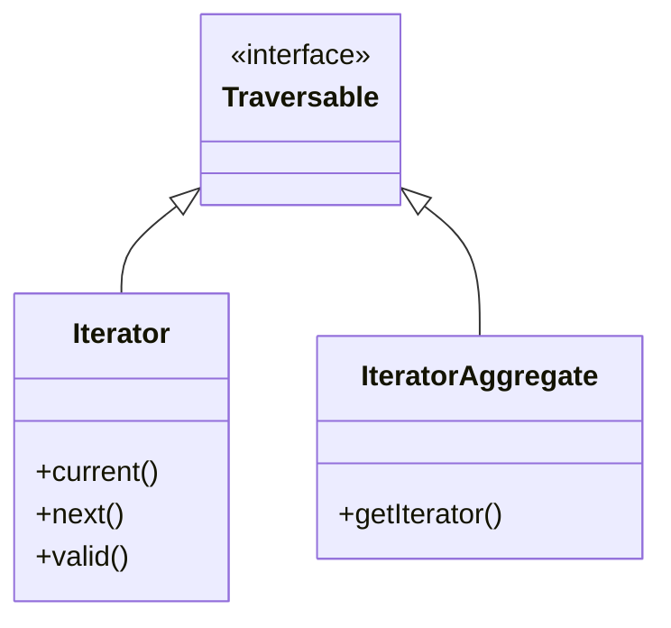

# SPL — Standard PHP Library

!!! tip "In a nutshell"
    La SPL fait en sorte que vos objets se comportent nativement — indexables,
    comptables, itérables — et fournit des piles, files et tas prêts à l'emploi.
    Point clé pour l'examen : un **generator est un `Iterator` lazy à usage
    unique** que vous ne pouvez pas rembobiner une fois consommé.

!!! example "Real-world analogy"
    Implémenter `ArrayAccess`, `Countable` et `Iterator`, c'est comme équiper votre
    appareil artisanal de la prise, des boutons et de la jauge standard pour qu'il
    fonctionne avec l'installation électrique de la maison — `$obj[$k]`,
    `count($obj)`, `foreach` — au lieu d'exiger un traitement spécial. Un
    generator, en revanche, est comme une bobine de film à usage unique : il
    produit les images paresseusement, à la demande, mais une fois le film joué
    jusqu'au bout, vous ne pouvez pas le rembobiner — pour le revoir, il faut
    enfiler une bobine neuve.

!!! abstract "Learning objectives"
    À la fin de ce chapitre, vous saurez :

    - [ ] Implémenter `ArrayAccess`, `Countable`, `Iterator` et `IteratorAggregate`.
    - [ ] Choisir entre `SplStack`/`SplQueue`/`SplHeap`/`SplPriorityQueue`/`SplObjectStorage`.
    - [ ] Expliquer les generators et en quoi ils diffèrent de la construction de tableaux.

    **Syllabus:** `PHP → SPL` ·
    **Level:** Advanced / Expert ·
    **Est. time:** 35 min ·
    **Prerequisites:** [Interfaces](interfaces.md)

---

## Theory

La **Standard PHP Library** fournit des interfaces et des classes de structures
de données qui font que vos objets se comportent comme des constructions natives
du langage — indexables (`ArrayAccess`), comptables (`Countable`), itérables
(`Iterator`/`IteratorAggregate`) — ainsi que des structures prêtes à l'emploi
(piles, files, tas).

```php
$tags = new TagCollection();    // implements the SPL interfaces (see below)

$tags[] = 'php';                // ArrayAccess  → offsetSet()
isset($tags[0]);                // ArrayAccess  → offsetExists()
count($tags);                   // Countable    → count()
foreach ($tags as $tag) {}      // IteratorAggregate → getIterator()
```

| Interface | Permet | Méthodes clés |
|---|---|---|
| `ArrayAccess` | La syntaxe `$obj[$k]` | `offsetGet/Set/Exists/Unset` |
| `Countable` | `count($obj)` | `count()` |
| `Iterator` | `foreach` (autonome) | `current/key/next/rewind/valid` |
| `IteratorAggregate` | `foreach` (délégué) | `getIterator()` |
| `Traversable` | Marqueur (base des deux) | — |

!!! question "Predict first"
    Vous parcourez un generator avec `foreach` jusqu'au bout, puis vous refaites
    un `foreach` sur le même generator. Que produit le second passage ?

??? note "Reveal"
    Rien. Un generator est un `Iterator` **à usage unique** — il ne peut pas être
    rembobiné après consommation. Construisez un tableau (ou recréez le
    generator) pour itérer deux fois.

## Deep Dive — how it works internally

### The iteration hierarchy

`Traversable` est une interface marqueur interne que vous ne pouvez pas
implémenter directement. `Iterator` et `IteratorAggregate` l'étendent toutes les
deux. `foreach` accepte tout ce qui est `Traversable`. Préférez
`IteratorAggregate` — vous déléguez à un iterator existant (souvent un
generator) au lieu d'écrire cinq méthodes à la main.



```php
<?php
declare(strict_types=1);

/** @implements \IteratorAggregate<int, string> */
final class TagCollection implements \IteratorAggregate, \Countable, \ArrayAccess
{
    /** @var array<int, string> */
    private array $tags = [];

    public function getIterator(): \Iterator
    {
        yield from $this->tags;                 // generator = an Iterator
    }

    public function count(): int
    {
        return \count($this->tags);
    }

    public function offsetExists(mixed $offset): bool
    {
        return isset($this->tags[$offset]);
    }

    public function offsetGet(mixed $offset): mixed
    {
        return $this->tags[$offset] ?? null;
    }

    public function offsetSet(mixed $offset, mixed $value): void
    {
        $offset === null ? $this->tags[] = $value : $this->tags[$offset] = $value;
    }

    public function offsetUnset(mixed $offset): void
    {
        unset($this->tags[$offset]);
    }
}
```

### SPL data structures

| Classe | Sémantique | Notes |
|---|---|---|
| `SplStack` | LIFO | Liste doublement chaînée |
| `SplQueue` | FIFO | `enqueue`/`dequeue` |
| `SplDoublyLinkedList` | Base de la pile et de la file | — |
| `SplFixedArray` | Taille fixe, clés entières | Moins de mémoire qu'un tableau |
| `SplHeap` (abstraite) | Tas ordonné | Implémentez `compare()` |
| `SplMinHeap`/`SplMaxHeap` | Min/max au sommet | Prêtes à l'emploi |
| `SplPriorityQueue` | Valeur + priorité | Non stable entre priorités égales |
| `SplObjectStorage` | Ensemble/map indexé par **objet** | Attache des données par objet |

```php
$s = new \SplStack();
$s->push('a'); $s->push('b');
$s->pop();                       // 'b' — LIFO

$q = new \SplQueue();
$q->enqueue('job1');
$q->dequeue();                   // 'job1' — FIFO

$f = new \SplFixedArray(2);      // fixed size, int keys, compact memory
$f[0] = 'x';

$pq = new \SplPriorityQueue();
$pq->insert('low', 1); $pq->insert('high', 9);
$pq->extract();                  // 'high' — highest priority first

$h = new \SplMinHeap();
$h->insert(5); $h->insert(1);
$h->top();                       // 1 — smallest on top
```

```php
<?php
declare(strict_types=1);

$storage = new \SplObjectStorage();
$user = new \stdClass();
$storage->attach($user, ['role' => 'admin']);  // object → data map
$storage->contains($user);                       // true
$data = $storage[$user];                          // ['role' => 'admin']
```

`SplObjectStorage` utilise l'**identité** de l'objet (spl_object_id) comme clé —
parfait pour répondre à « ai-je déjà vu cette instance ? » sans polluer l'objet.
La DI et le serializer de Symfony s'en servent pour suivre les objets visités et
éviter la récursion infinie.

### Generators

Une fonction contenant `yield` retourne un `Generator` (un `Iterator` natif).
Les valeurs sont produites **paresseusement**, une à la fois, si bien que vous
ne matérialisez jamais la séquence entière — un gain de mémoire énorme pour les
données volumineuses ou streamées. `yield from` délègue à un autre itérable ; un
generator peut aussi `return` une valeur finale, lue via `getReturn()`.

```php
function inner(): \Generator
{
    yield 1;
    yield 2;
    return 'done';              // final value, read via getReturn()
}

function outer(): \Generator
{
    yield 0;
    yield from inner();         // delegates to another iterable
}

foreach (outer() as $v) {}      // 0, 1, 2 — produced lazily

$g = inner();
foreach ($g as $v) {}           // consume the generator
$g->getReturn();                // 'done'
```

```php
<?php
declare(strict_types=1);

function readLines(string $path): \Generator
{
    $fh = fopen($path, 'rb');
    try {
        while (($line = fgets($fh)) !== false) {
            yield rtrim($line);                  // lazy, one line in memory
        }
    } finally {
        fclose($fh);
    }
}
```

!!! note "Source reference"
    Symfony retourne largement des `Traversable`/generators, par exemple les
    iterators de services taggés via
    `Symfony\Component\DependencyInjection\Argument\RewindableGenerator` —
    [symfony/symfony `8.0`](https://github.com/symfony/symfony/blob/8.0/src/Symfony/Component/DependencyInjection/Argument/RewindableGenerator.php).

## Configuration & code

=== "PHP Attributes"

    ```php
    <?php
    declare(strict_types=1);

    final class TaskQueue
    {
        private \SplPriorityQueue $queue;

        public function __construct()
        {
            $this->queue = new \SplPriorityQueue();
        }

        public function push(string $task, int $priority): void
        {
            $this->queue->insert($task, $priority);   // higher = first out
        }
    }
    ```

=== "Console"

    ```console
    $ php -r '$s=new SplStack(); $s->push(1); $s->push(2); echo $s->top();'
    2
    ```

## Best practices & anti-patterns

| ✅ À faire | ❌ À éviter |
|---|---|
| `IteratorAggregate` + generator | Écrire à la main les 5 méthodes d'`Iterator` |
| `SplObjectStorage` pour les ensembles d'objets | Des tableaux avec des objets en clé (illégal) |
| Des generators pour les données volumineuses/streamées | Construire des tableaux géants en mémoire |
| `SplFixedArray` pour des données numériques de taille connue | L'utiliser pour des données creuses/associatives |

## When (not) to use it / alternatives

- Utilisez les **generators** quand les données sont volumineuses, streamées, ou
  que vous n'avez pas besoin d'accès aléatoire. Utilisez des tableaux quand vous
  avez besoin de `count`, d'indexation ou de réutilisation (un generator se
  consomme une seule fois).
- Utilisez `SplPriorityQueue` pour l'ordonnancement ; notez que l'ordre entre
  priorités **égales** n'est **pas** stable.
- Préférez un simple `array` pour les petites collections simples — les
  structures SPL ajoutent un surcoût dont vous n'avez peut-être pas besoin.

!!! danger "Certification traps"
    - `IteratorAggregate::getIterator()` retourne un `Traversable` ; `Iterator`
      exige **les cinq** méthodes (`current/key/next/rewind/valid`).
    - Un **generator est à usage unique** — impossible de le rembobiner après
      itération.
    - `SplPriorityQueue` n'est **pas stable** pour des priorités égales.
    - Les clés objets sont impossibles dans les tableaux natifs — utilisez
      `SplObjectStorage`.
    - `count()` ne fonctionne que sur `Countable` (ou les tableaux) ; l'appeler
      sur un objet quelconque provoque une erreur.

!!! warning "Common mistakes"
    - Oublier la sémantique de `rewind()` en implémentant `Iterator` à la main.
    - Itérer deux fois sur un generator et n'obtenir rien la seconde fois.

## Exercises

1. **(Advanced)** Rendez une classe itérable avec `foreach` **sans** implémenter
   cinq méthodes.
2. **(Expert)** Utilisez `SplObjectStorage` pour détecter les visites d'objets
   en double.

??? success "Solutions"

    **1.** Implémentez `IteratorAggregate` et écrivez
    `yield from $this->items;` dans `getIterator()` — le generator est
    l'`Iterator`, donc vous n'écrivez qu'une seule méthode.

    **2.**
    ```php
    <?php
    declare(strict_types=1);

    $seen = new \SplObjectStorage();
    function visit(object $o, \SplObjectStorage $seen): bool
    {
        if ($seen->contains($o)) {
            return false;          // already visited
        }
        $seen->attach($o);
        return true;
    }
    ```

## Certification questions

??? question "Q1. Which methods must an `Iterator` implement?"
    - [x] A. `current`, `key`, `next`, `rewind`, `valid` ✅
    - [ ] B. `getIterator`
    - [ ] C. `count`, `offsetGet`
    - [ ] D. `next`, `prev`

    **Why:** `Iterator` définit exactement ces cinq méthodes ;
    `IteratorAggregate` n'exige que `getIterator`. **Ref:** [Iterator](https://www.php.net/manual/en/class.iterator.php).

??? question "Q2. What is true of a generator?"
    - [x] A. It is a single-use `Iterator` producing values lazily ✅
    - [ ] B. It builds the full array first
    - [ ] C. It can be rewound freely
    - [ ] D. It implements `ArrayAccess`

    **Why:** Les generators produisent paresseusement et ne peuvent pas être
    rembobinés après consommation.
    **Ref:** [Generators](https://www.php.net/manual/en/language.generators.php).

??? question "Q3. Which structure maps data keyed by an object instance?"
    - [x] A. `SplObjectStorage` ✅
    - [ ] B. `SplStack`
    - [ ] C. `SplFixedArray`
    - [ ] D. `SplQueue`

    **Why:** `SplObjectStorage` indexe par identité d'objet et peut y attacher
    des données.
    **Ref:** [SplObjectStorage](https://www.php.net/manual/en/class.splobjectstorage.php).

??? question "Q4. `SplPriorityQueue` ordering among equal priorities is…"
    - [ ] A. Guaranteed FIFO
    - [x] B. Not stable / unspecified ✅
    - [ ] C. Always LIFO
    - [ ] D. Alphabetical

    **Why:** L'ordre entre priorités égales dépend de l'implémentation et n'est
    pas stable.
    **Ref:** [SplPriorityQueue](https://www.php.net/manual/en/class.splpriorityqueue.php).

??? question "Q5. Enabling `$obj[$k]` syntax requires implementing…"
    - [x] A. `ArrayAccess` ✅
    - [ ] B. `Countable`
    - [ ] C. `Iterator`
    - [ ] D. `Stringable`

    **Why:** `ArrayAccess` fournit les méthodes offset pour la syntaxe à
    crochets.
    **Ref:** [ArrayAccess](https://www.php.net/manual/en/class.arrayaccess.php).

## Key takeaways

- `Iterator` = 5 méthodes ; `IteratorAggregate` = délégation via `getIterator()`.
- Les generators sont des iterators lazy à usage unique — excellents pour la mémoire.
- `SplObjectStorage` indexe par identité d'objet ; les tableaux ne le peuvent pas.
- Choisissez la structure SPL selon la discipline : LIFO/FIFO/tas/priorité.

## Last-minute revision

!!! tip "Cheat sheet"
    - `foreach` exige un `Traversable` (Iterator ou IteratorAggregate).
    - `count($o)` exige `Countable` ; `$o[$k]` exige `ArrayAccess`.
    - `yield` → Generator (Iterator) ; `yield from` délègue.
    - Stack=LIFO, Queue=FIFO, Heap=ordonné, PriorityQueue=valeur+priorité (instable).

## Connections

- **Depends on:** [Interfaces](interfaces.md) — la SPL est un ensemble d'interfaces (`Iterator`, `Countable`, `ArrayAccess`) que vous implémentez.
- **Reused in:** [Closures](closures.md) — generators et callables collaborent ; le `RewindableGenerator` de Symfony enveloppe les services taggés.
- **Confused with:** [OOP](oop.md) les méthodes magiques — `ArrayAccess` utilise des méthodes `offset*` explicites, pas `__get`/`__set`.

## Official References
- [PHP: SPL](https://www.php.net/manual/en/book.spl.php)
- [PHP: Predefined Interfaces](https://www.php.net/manual/en/reserved.interfaces.php)
- [PHP: Generators](https://www.php.net/manual/en/language.generators.php)
- [Symfony source — RewindableGenerator](https://github.com/symfony/symfony/blob/8.0/src/Symfony/Component/DependencyInjection/Argument/RewindableGenerator.php)

## Video references

!!! tip "Watch & learn"
    Voici des chaînes vidéo officielles, mises à jour en continu — cherchez-y
    « PHP & web security » pour consolider ce chapitre. Nous lions des chaînes
    stables plutôt que des vidéos individuelles afin que les références ne se
    périment jamais.

    - [SymfonyCasts screencasts](https://symfonycasts.com/tracks/symfony) — des tutoriels scénarisés à coder en suivant.
    - [Symfony official YouTube](https://www.youtube.com/@SymfonyOfficial) — conférences et keynotes des SymfonyCon.
    - [Official docs for this topic](https://symfony.com/doc/8.0/index.html) — certaines pages de la doc Symfony intègrent un screencast.

## Confidence check

Je suis prêt quand je peux :

- [ ] expliquer **pourquoi** `IteratorAggregate` + un generator vaut mieux qu'écrire cinq méthodes à la main
- [ ] implémenter `ArrayAccess`/`Countable`/`IteratorAggregate` dans Symfony 8
- [ ] déboguer le « rien à la seconde boucle » sur un generator
- [ ] repérer le piège : `SplPriorityQueue` instable entre priorités égales
- [ ] expliquer comment `SplObjectStorage` indexe les entrées par identité d'objet

---

<small>Related: [Interfaces](interfaces.md) · [Closures](closures.md) · [OOP](oop.md)</small>
