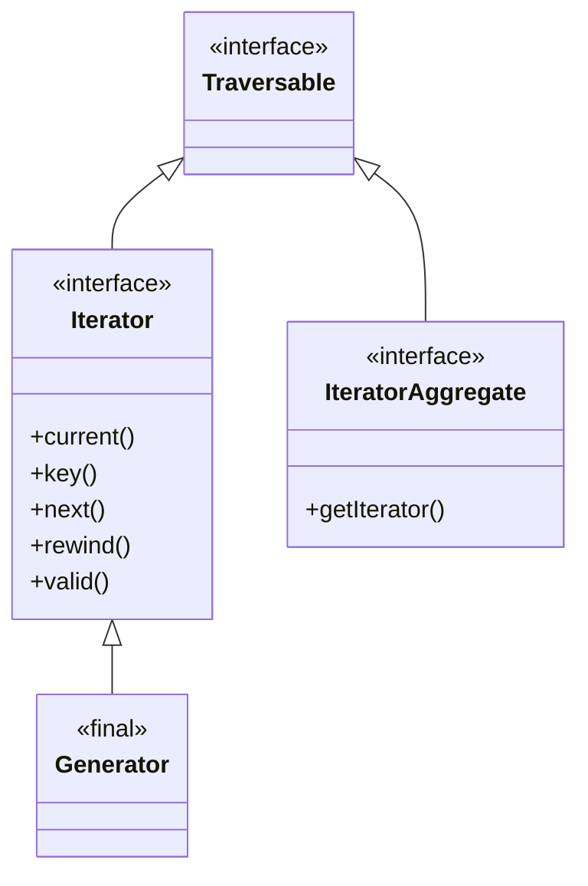
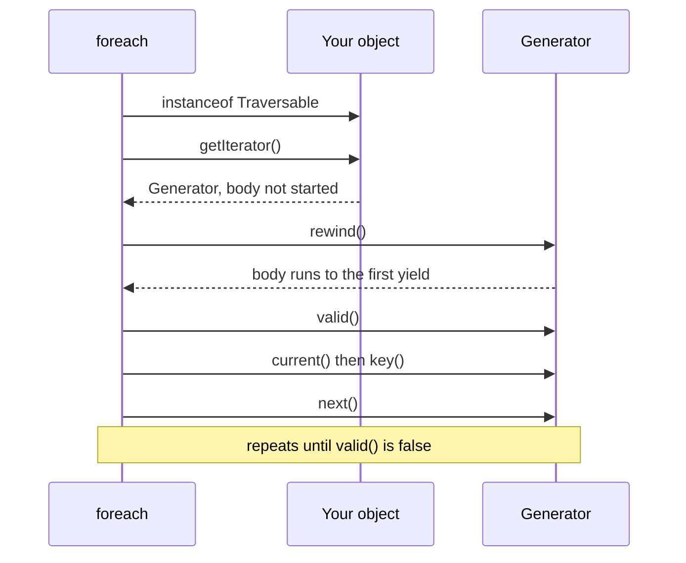

# SPL — Standard PHP Library

!!! tip "In a nutshell"
    The SPL is three things at once: **interfaces** that let your objects use native syntax
    (`foreach`, `count()`, `$obj[$k]`), ready-made **data structures** with an explicit
    discipline (LIFO, FIFO, heap, object map), and composable **iterators** that stream data
    instead of buffering it. Four facts decide most exam questions: `Iterator` needs five
    methods while `IteratorAggregate` needs one, a **generator is single-use** and traversing
    a closed one *throws*, iterating a **heap empties it** while iterating a stack does not,
    and `SplPriorityQueue` is **unstable** for equal priorities.

!!! example "Real-world analogy"
    Think of a factory floor. The **interfaces** are standard fittings: bolt the right flange
    onto your machine and it plugs into the existing conveyor (`foreach`), the existing
    counter (`count()`) and the existing pigeonhole rack (`$obj[$k]`) with no adapter. The
    **data structures** are the trolleys: a stack of trays where you always take the top one,
    a queue where the first tray in is the first out, a sorting hopper that always drops the
    heaviest part first. And a **generator** is the conveyor belt itself: parts arrive one at
    a time, you never need a warehouse to hold them all — but the belt only runs forwards,
    and once the last part has passed you cannot ask it to replay the shift. You start a new
    one.

!!! abstract "Learning objectives"
    By the end of this chapter you can:

    - [ ] Choose between `Iterator` and `IteratorAggregate`, and state the exact order in
          which `foreach` calls their methods.
    - [ ] Implement `ArrayAccess`, `Countable`, `Stringable` and `JsonSerializable`, and
          predict which method each piece of syntax triggers — including `isset()`, `empty()`
          and `??`.
    - [ ] Pick the right SPL structure (`SplStack`, `SplQueue`, `SplFixedArray`, `SplHeap`,
          `SplPriorityQueue`, `SplObjectStorage`) and say what `foreach` does to each.
    - [ ] Write generators with `yield`, `yield from`, `send()` and `getReturn()`, and explain
          why a generator is a `Traversable` you can never re-run.
    - [ ] Compose `IteratorIterator`, `LimitIterator`, `CallbackFilterIterator`,
          `RecursiveIteratorIterator` and `AppendIterator` into a lazy pipeline.
    - [ ] Recognise the same patterns in Symfony 8.0 — `Finder`, `RewindableGenerator`,
          `LazyIterator`, and the `yield from` chains in Messenger receivers.

    **Syllabus:** `PHP → SPL` ·
    **Level:** Advanced / Expert ·
    **Est. time:** 55 min ·
    **Prerequisites:** [Interfaces](interfaces.md), [OOP](oop.md), [Closures](closures.md)

    **Examen Symfony 8 :** NO — the SPL is not one of the nine official PHP subtopics listed
    in [PHP & Web Security](index.md). It is kept as an enrichment and prerequisite chapter,
    because Symfony's own collections, the Finder, the tagged-service iterators and the
    Messenger transports are built out of exactly these interfaces.

---

## Prerequisites

You should be comfortable with interfaces and type declarations from
[Interfaces](interfaces.md), with objects and identity from [OOP](oop.md), and with closures
and first-class callable syntax from [Closures](closures.md) — the SPL iterator decorators
take callables, and the lazy patterns in Symfony store a `Closure` factory.

Everything here targets **PHP 8.4**, the minimum version required by Symfony 8. That version
matters more than usual on this topic: `SplFixedArray` changed its iteration interface in 8.0,
its key error in 8.1 and its bounds exception in 8.4, and `count()` on a non-`Countable`
object became a `TypeError` in 8.0.

## The problem we are solving

Write a collection class the naive way and you immediately hit a wall:

```php
<?php
declare(strict_types=1);

final class TagCollection
{
    /** @var array<int|string, string> */
    private array $tags = [];
}

$tags = new TagCollection();
$tags[] = 'php';       // Error: Cannot use object of type TagCollection as array
```

`count($tags)` fails the same way, and `foreach ($tags as $tag)` iterates the object's
*properties* rather than its contents. The object holds a collection but does not behave like
one, so callers end up writing `$tags->getTags()[0]` and passing raw arrays around — which
defeats the point of having a class.

The second wall is memory. Reading a two-gigabyte log file into an array to filter it will
exhaust `memory_limit` long before the filtering starts, even though you only ever look at one
line at a time.

The SPL answers both. The predefined interfaces make an object *speak the language's own
syntax*; generators and iterator decorators make a sequence *flow* rather than accumulate.

## 🧠 Pour les nuls

**C'est quoi ?** La SPL (Standard PHP Library) est une boîte à outils livrée avec PHP. Elle
contient trois familles : des **interfaces** (`ArrayAccess`, `Countable`, `Iterator`,
`IteratorAggregate`) qui rendent tes objets utilisables avec la syntaxe native de PHP, des
**structures de données** toutes faites (pile, file, tas, dictionnaire d'objets), et des
**itérateurs** qui parcourent des données sans jamais tout charger en mémoire.

**Pourquoi ça existe ?** Sans elle, un objet qui contient une liste ne se comporte pas comme
une liste : `count($objet)` plante, `foreach ($objet as $x)` parcourt les propriétés au lieu du
contenu, et `$objet[0]` est une erreur fatale. La SPL fournit le contrat manquant : tu
implémentes quelques méthodes, et le moteur PHP branche sa syntaxe dessus.

**🏠 Analogie de la vraie vie :** imagine une machine à café que tu fabriques toi-même. Si tu
lui montes une prise standard, un bouton standard et un compteur standard, elle se branche sur
l'installation existante de la maison — personne n'a besoin d'un adaptateur spécial. Les
interfaces de la SPL sont exactement ces prises normalisées : `ArrayAccess` = la prise
`$objet[...]`, `Countable` = le compteur `count()`, `IteratorAggregate` = le tapis roulant
`foreach`. Et un générateur, c'est la bobine de film du cinéma de quartier : elle défile image
par image (on n'a jamais tout le film en mémoire), mais une fois arrivée à la fin, impossible
de rembobiner — il faut charger une nouvelle bobine.

**Symfony dans la vraie vie :** quand tu écris `foreach ($finder as $fichier)`, le composant
Finder ne construit jamais la liste complète des fichiers. Il implémente `IteratorAggregate` et
enchaîne des itérateurs paresseux : un fichier est lu, filtré, puis oublié. Même mécanique pour
les services taggés injectés dans un service : Symfony injecte un objet `RewindableGenerator`
qui fabrique un nouveau générateur à chaque boucle.

**Exemple minimal :**

```php
final class Tags implements IteratorAggregate, Countable
{
    /** @param list<string> $items */
    public function __construct(private array $items) {}

    public function getIterator(): Traversable
    {
        yield from $this->items;   // un générateur suffit
    }

    public function count(): int
    {
        return \count($this->items);
    }
}
```

`foreach` et `count()` fonctionnent maintenant sur l'objet lui-même.

**Ce qui se passe à l'intérieur :** quand PHP rencontre `foreach ($objet as $x)`, il regarde
d'abord si l'objet est un `Traversable`. Si c'est un `IteratorAggregate`, il appelle
`getIterator()` et parcourt le résultat. Si c'est un `Iterator`, il pilote l'objet lui-même en
appelant, dans cet ordre : `rewind()`, `valid()`, `current()`, `key()`, corps de boucle,
`next()`, `valid()`... jusqu'à ce que `valid()` réponde `false`. Un générateur, lui, est une
fonction mise en pause : appeler la fonction n'exécute rien du tout, le corps ne démarre qu'au
premier tour de boucle.

**⚠️ Erreur classique du débutant :** parcourir deux fois le même générateur. La deuxième
boucle ne renvoie pas « rien » — elle lève une exception :
`Cannot traverse an already closed generator`. La solution n'est pas de tout mettre dans un
tableau, mais d'envelopper la *fabrique* de générateur dans un `IteratorAggregate`, exactement
ce que fait Symfony.

**🧠 Comment le mémoriser :** « Une bobine, une séance. » Le générateur défile une seule fois ;
pour revoir le film, on recharge une bobine neuve — c'est-à-dire on rappelle la fonction.

## Build the mental model

The SPL has three layers, and almost every mistake comes from confusing one for another.

| Layer | What it gives you | Typical members |
|---|---|---|
| **Interfaces** | Native syntax on your own objects | `ArrayAccess`, `Countable`, `Iterator`, `IteratorAggregate`, `Stringable`, `JsonSerializable` |
| **Data structures** | A container with a fixed access discipline | `SplStack`, `SplQueue`, `SplFixedArray`, `SplHeap`, `SplPriorityQueue`, `SplObjectStorage` |
| **Iterators & generators** | Streaming, composition, laziness | `ArrayIterator`, `IteratorIterator`, `LimitIterator`, `CallbackFilterIterator`, `RecursiveIteratorIterator`, `Generator` |

The iteration layer has one root:



Read it as a rule rather than a picture: `foreach` accepts anything that is `Traversable`;
`Traversable` itself is empty and cannot be implemented by a concrete class; the only two
doors into it are `Iterator` (you drive) and `IteratorAggregate` (you delegate); and
`Generator` is a built-in `final` class already sitting behind the `Iterator` door, which is
why `yield from` inside `getIterator()` is legal and why a generator can be handed to any
decorator that demands an `Iterator`.

The type `iterable` you see all over Symfony signatures is not a fourth thing — it is the
union `array|Traversable`.

!!! info "PHP 8.4 reference"
    https://www.php.net/manual/en/class.traversable.php

## Core concepts

### The six interfaces that buy you syntax

| Interface | Unlocks | Methods you write |
|---|---|---|
| `ArrayAccess` | `$o[$k]`, `$o[] = $v`, `isset($o[$k])`, `unset($o[$k])` | `offsetExists`, `offsetGet`, `offsetSet`, `offsetUnset` |
| `Countable` | `count($o)` | `count(): int` |
| `Iterator` | `foreach` — object drives itself | `current`, `key`, `next`, `rewind`, `valid` |
| `IteratorAggregate` | `foreach` — delegated | `getIterator(): Traversable` |
| `Stringable` | `"$o"`, `string\|Stringable` parameters | `__toString(): string` |
| `JsonSerializable` | `json_encode($o)` | `jsonSerialize(): mixed` |

Two of them have a documented subtlety worth memorising now. `Stringable` is applied
**implicitly** to any class that defines `__toString()` — the manual says it "can and should be
declared explicitly", but the interface is satisfied either way. And `Iterator` and
`IteratorAggregate` are **mutually exclusive**: declaring both is a compile-time fatal error,
*Class X cannot implement both Iterator and IteratorAggregate at the same time*, because the
engine would have no rule for choosing between the object and its delegate.

!!! info "PHP 8.4 reference"
    https://www.php.net/manual/en/reserved.interfaces.php

!!! info "PHP 8.4 reference"
    https://www.php.net/manual/en/class.stringable.php

### The five interfaces the SPL adds on top

The manual's SPL interfaces page lists exactly five: `OuterIterator` (an iterator wrapping
another, with `getInnerIterator()`), `RecursiveIterator` (`hasChildren()`/`getChildren()`),
`SeekableIterator` (`seek()`), and the observer pair `SplObserver`/`SplSubject`. You rarely
implement them by hand, but they explain the class tree: `IteratorIterator` is an
`OuterIterator`, `RecursiveDirectoryIterator` is a `RecursiveIterator`, and `ArrayIterator` is
a `SeekableIterator`.

!!! info "PHP 8.4 reference"
    https://www.php.net/manual/en/spl.interfaces.php

### Generators in one paragraph

Any function containing `yield` becomes a **generator function**. Calling it executes *none* of
the body: it returns a `Generator` object, and the body runs only when something advances it.
Values are produced one at a time, keys default to `0, 1, 2…` unless you write
`yield $key => $value`, `yield from` delegates to another iterable, `return` inside a generator
sets a final value readable with `getReturn()`, and `send()` pushes a value *into* the paused
`yield` expression. The price is fixed and non-negotiable: a generator is forward-only and
single-use.

!!! info "PHP 8.4 reference"
    https://www.php.net/manual/en/language.generators.overview.php

## Learn by doing

Start from the broken class of the previous section and fix it one interface at a time,
running the file after each step. The error message changes every time, and each message names
the interface you are missing.

**Step 1 — make `foreach` work.** Add `IteratorAggregate` and a single method:

```php
<?php
declare(strict_types=1);

/** @implements IteratorAggregate<int|string, string> */
final class TagCollection implements IteratorAggregate
{
    /** @var array<int|string, string> */
    private array $tags = ['php', 'symfony'];

    public function getIterator(): Traversable
    {
        yield from $this->tags;
    }
}

foreach (new TagCollection() as $key => $tag) {
    echo "$key => $tag\n";     // 0 => php / 1 => symfony
}
```

One method, and the object is iterable. Note that `getIterator()` is itself a generator here,
so nothing is copied: `yield from` walks the internal array lazily.

**Step 2 — make `count()` work.** `count($tags)` still throws
`TypeError: count(): Argument #1 ($value) must be of type Countable|array`. Add `Countable`
and a `count(): int` method returning `\count($this->tags)`.

**Step 3 — make bracket syntax work.** `$tags[] = 'spl'` still throws
`Error: Cannot use object of type TagCollection as array`. Add `ArrayAccess` and its four
methods. The append form arrives in `offsetSet()` with `$offset === null`:

```php
public function offsetSet(mixed $offset, mixed $value): void
{
    if (null === $offset) {
        $this->tags[] = $value;

        return;
    }

    $this->tags[$offset] = $value;
}
```

**Step 4 — get the `null` case right.** Implement `offsetExists()` with `array_key_exists()`
rather than `isset()` if `null` is a legal stored value; the next section shows why that single
choice changes the result of `??`.

The [guided exercises](spl-exercises.md) walk through all four steps with the exact expected
output at each stage.

!!! info "PHP 8.4 reference"
    https://www.php.net/manual/en/class.arrayaccess.php

## How Symfony handles it

Symfony 8.0 is one of the best SPL textbooks available, because it uses every layer for a real
reason.

**`Finder` is an `IteratorAggregate` + `Countable`.** The class is declared
`class Finder implements \IteratorAggregate, \Countable`, which is what makes
`foreach ($finder as $file)` and `count($finder)` work. `count()` is implemented as
`iterator_count($this->getIterator())` — counting therefore walks the filesystem, and building
a Finder costs nothing until you iterate it.

```php
<?php
declare(strict_types=1);

use Symfony\Component\Finder\Finder;

$finder = (new Finder())->files()->in(__DIR__ . '/src')->name('*.php');

foreach ($finder as $file) {          // getIterator() runs here, not above
    echo $file->getRelativePathname(), "\n";
}
```

!!! info "Official Symfony 8.0 reference"
    https://symfony.com/doc/8.0/components/finder.html#usage

!!! note "Symfony 8.0 source reference"
    https://github.com/symfony/symfony/blob/8.0/src/Symfony/Component/Finder/Finder.php

**The directory walk is a pipeline of SPL iterators.** `Finder::searchInDirectory()` builds a
`RecursiveDirectoryIterator`, flattens it with
`new \RecursiveIteratorIterator($iterator, \RecursiveIteratorIterator::SELF_FIRST)` — `SELF_FIRST`
so that directories are visible to the exclude and depth filters before being descended into —
then wraps the result in filter iterators. When several directories are searched, each one is
appended to an `\AppendIterator` through an `\IteratorIterator`.

!!! note "Symfony 8.0 source reference"
    https://github.com/symfony/symfony/blob/8.0/src/Symfony/Component/Finder/Iterator/RecursiveDirectoryIterator.php

**`LazyIterator` defers the work.** Its entire body is:

```php
class LazyIterator implements \IteratorAggregate
{
    private \Closure $iteratorFactory;

    public function __construct(callable $iteratorFactory)
    {
        $this->iteratorFactory = $iteratorFactory(...);
    }

    public function getIterator(): \Traversable
    {
        yield from ($this->iteratorFactory)();
    }
}
```

Because `getIterator()` contains `yield`, calling it runs nothing — the expensive directory
scan happens on the first advance of the returned generator.

!!! note "Symfony 8.0 source reference"
    https://github.com/symfony/symfony/blob/8.0/src/Symfony/Component/Finder/Iterator/LazyIterator.php

**`RewindableGenerator` is the fix for single-use generators.** When you inject a tagged
iterator (`#[AutowireIterator('app.handler')]` or `!tagged_iterator`), the container does not
hand you a raw generator — that would break the second `foreach`. It hands you a
`RewindableGenerator implements \IteratorAggregate, \Countable` that stores the generator
factory as a `Closure` and calls it again for every iteration, while `count()` answers from a
stored count instead of consuming anything.

!!! info "Official Symfony 8.0 reference"
    https://symfony.com/doc/8.0/service_container/tags.html#reference-tagged-services

!!! note "Symfony 8.0 source reference"
    https://github.com/symfony/symfony/blob/8.0/src/Symfony/Component/DependencyInjection/Argument/RewindableGenerator.php

**Messenger receivers are `yield from` chains.** `AmqpReceiver::get(): iterable` is literally
`yield from $this->getFromQueues($this->connection->getQueueNames());`, which delegates again
until a `yield $envelope->with(...)`. No envelope is fetched until the worker iterates, and the
`iterable` return type keeps the door open for a transport that returns a plain array.

!!! note "Symfony 8.0 source reference"
    https://github.com/symfony/symfony/blob/8.0/src/Symfony/Component/Messenger/Bridge/Amqp/Transport/AmqpReceiver.php

**HttpFoundation bags are aggregates too.** `ParameterBag implements \IteratorAggregate,
\Countable`, with `getIterator(): \ArrayIterator` — which is why `foreach ($request->query as
$k => $v)` and `count($request->headers)` work without any accessor.

!!! note "Symfony 8.0 source reference"
    https://github.com/symfony/symfony/blob/8.0/src/Symfony/Component/HttpFoundation/ParameterBag.php

## How it works internally

### What `foreach` actually dispatches

For an object, `foreach` does not look at properties first — it checks whether the class is
`Traversable`, and only falls back to iterating public properties when it is not.



The diagram shows the aggregate path. For an `Iterator` the object *is* the iterator, so the
`getIterator()` step disappears and every call in the loop lands on your own five methods, in
this documented order: `rewind()` once, then `valid()`, `current()`, `key()`, body, `next()`,
and back to `valid()`. `valid()` therefore runs one time more than there are elements.

!!! info "PHP 8.4 reference"
    https://www.php.net/manual/en/class.iterator.php

### What a generator really is

A generator is a paused function frame. The first advance runs the body up to the first
`yield`, saves every local variable and the instruction pointer, and returns the yielded value.
The next advance restores that frame and continues. This is why:

- calling the function does nothing observable — no side effect in the body runs at call time;
- the sequence can be infinite, since only one value exists at a time;
- there is no way back: the frames before the current one are gone, so `rewind()` after an
  advance throws *Cannot rewind a generator that was already run*, and iterating a finished
  generator throws *Cannot traverse an already closed generator*;
- `send($v)` makes `$v` the value of the paused `yield` expression and returns the *next*
  yielded value — and if the generator has not started, `send()` advances it to the first
  `yield` first, so no priming call is needed.

```php
<?php
declare(strict_types=1);

function conversation(): Generator
{
    $name = yield 'What is your name?';
    $age = yield "Hello $name, how old are you?";

    return "$name is $age";
}

$c = conversation();
echo $c->current(), "\n";        // What is your name?
echo $c->send('Ada'), "\n";      // Hello Ada, how old are you?
$c->send(36);                    // generator returns, loop ends
echo $c->getReturn(), "\n";      // Ada is 36
```

!!! info "PHP 8.4 reference"
    https://www.php.net/manual/en/generator.send.php

### What `isset()`, `empty()` and `??` do to an `ArrayAccess` object

These three do **not** go through `offsetGet()` first. The manual states that `offsetExists()`
"is executed when using `isset()` or `empty()`", and adds that with `empty()`, `offsetGet()`
"will be called and checked if empty only if `offsetExists()` returns `true`". The null
coalescing operator behaves like `isset()` on its left-hand side, so it follows the same path.

| Expression | Calls |
|---|---|
| `$o['k']` | `offsetGet('k')` |
| `isset($o['k'])` | `offsetExists('k')` only |
| `empty($o['k'])` | `offsetExists('k')`, then `offsetGet('k')` if it returned `true` |
| `$o['k'] ?? $d` | `offsetExists('k')`, then `offsetGet('k')` if it returned `true` |
| `$o['k'] = $v` | `offsetSet('k', $v)` |
| `$o[] = $v` | `offsetSet(null, $v)` |
| `unset($o['k'])` | `offsetUnset('k')` |

!!! info "PHP 8.4 reference"
    https://www.php.net/manual/en/arrayaccess.offsetexists.php

## All supported cases and variations

### The documented data structures

The manual groups them by underlying implementation, and this is the complete list from that
page:

| Group | Classes | Discipline |
|---|---|---|
| Doubly linked lists | `SplDoublyLinkedList` → `SplStack`, `SplQueue` | O(1) at both ends; LIFO / FIFO |
| Heaps | `SplHeap` (abstract) → `SplMaxHeap`, `SplMinHeap`; plus `SplPriorityQueue` | Root always extreme by `compare()` |
| Arrays | `SplFixedArray` | Contiguous, integer indexes, fixed size |
| Map | `SplObjectStorage` | Object → data map, or object set |

`SplStack` and `SplQueue` are the *same class* with a different iteration constant:
`IT_MODE_LIFO` for the stack, `IT_MODE_FIFO` for the queue. The behaviour half of the mode is
`IT_MODE_KEEP` (default) or `IT_MODE_DELETE`, which makes iteration destructive on demand.
`SplPriorityQueue` is a max heap whose `setExtractFlags()` chooses between `EXTR_DATA`
(default), `EXTR_PRIORITY` and `EXTR_BOTH`.

```php
<?php
declare(strict_types=1);

$stack = new SplStack();
$stack->push('a');
$stack->push('b');
echo $stack->pop(), "\n";                 // b — LIFO

$queue = new SplQueue();
$queue->enqueue('job1');
$queue->enqueue('job2');
echo $queue->dequeue(), "\n";             // job1 — FIFO

$fixed = new SplFixedArray(2);            // integer keys only, fixed size
$fixed[0] = 'x';
echo $fixed->getSize(), "\n";             // 2

$queue = new SplPriorityQueue();
$queue->insert('low', 1);
$queue->insert('high', 9);
echo $queue->extract(), "\n";             // high — greatest priority first

$heap = new SplMinHeap();
$heap->insert(5);
$heap->insert(1);
echo $heap->top(), "\n";                  // 1 — smallest at the root
```

!!! info "PHP 8.4 reference"
    https://www.php.net/manual/en/spl.datastructures.php

### `SplObjectStorage` — set and map at once

The class "provides a map from objects to data or, by ignoring data, an object set". The key is
object **identity**, the same identity `spl_object_id()` exposes — not equality, not a content
hash. `attach()` and `offsetSet()` are documented aliases, as are `detach()`/`offsetUnset()`
and `contains()`/`offsetExists()`.

```php
<?php
declare(strict_types=1);

$storage = new SplObjectStorage();
$user = new stdClass();

$storage->attach($user, ['role' => 'admin']);   // same as $storage[$user] = [...]
var_dump($storage->contains($user));            // true
var_dump($storage[$user]);                      // ['role' => 'admin']

$storage->attach($user, ['role' => 'editor']);  // replaces the data
var_dump(count($storage));                      // 1 — a set stores each identity once

foreach ($storage as $index => $object) {
    var_dump($index, $storage->getInfo());      // 0, ['role' => 'editor']
}
```

Iteration yields the **objects**, with sequential integer keys; the attached payload is read
through `getInfo()` or `$storage[$object]`. The PHP manual records `attach()`, `detach()` and
`contains()` as deprecated from PHP 8.5 in favour of the `offset*` spellings; on the PHP 8.4
baseline of Symfony 8 both are valid, and the exam can use either.

!!! info "PHP 8.4 reference"
    https://www.php.net/manual/en/class.splobjectstorage.php

### The documented iterator tree

The SPL iterators page publishes the class tree; these are its top-level entries and their
children:

- `ArrayIterator` → `RecursiveArrayIterator`
- `EmptyIterator`
- `IteratorIterator` → `AppendIterator`, `CachingIterator` (→ `RecursiveCachingIterator`),
  `FilterIterator` (→ `CallbackFilterIterator` → `RecursiveCallbackFilterIterator`;
  `RecursiveFilterIterator` → `ParentIterator`; `RegexIterator` → `RecursiveRegexIterator`),
  `InfiniteIterator`, `LimitIterator`, `NoRewindIterator`
- `MultipleIterator`
- `RecursiveIteratorIterator` → `RecursiveTreeIterator`
- `DirectoryIterator` (extends `SplFileInfo`) → `FilesystemIterator` → `GlobIterator`,
  `RecursiveDirectoryIterator`

The ones you must be able to use from memory:

| Iterator | Role | Signature detail that gets tested |
|---|---|---|
| `ArrayIterator` | Turns an array (or object) into a seekable iterator | Works on a **copy** of the array |
| `IteratorIterator` | Converts any `Traversable` into an `Iterator` | The bridge for `IteratorAggregate` inputs |
| `LimitIterator` | Offset + count slice | `__construct(Iterator $it, int $offset = 0, int $limit = -1)`; keys unchanged |
| `CallbackFilterIterator` | Keeps what the callback accepts | Callback gets `($current, $key, $iterator)`, returns `true` to keep |
| `RecursiveIteratorIterator` | Flattens a recursive iterator | Default mode `LEAVES_ONLY`; `SELF_FIRST`, `CHILD_FIRST` |
| `AppendIterator` | Concatenates iterators | Does **not** renumber keys |
| `MultipleIterator` | Iterates several iterators in parallel | `MIT_NEED_ALL`/`MIT_NEED_ANY`, `MIT_KEYS_NUMERIC`/`MIT_KEYS_ASSOC` |
| `CachingIterator` | Reads one ahead | `hasNext()`; `FULL_CACHE` caches all read data |

```php
<?php
declare(strict_types=1);

$rows = new ArrayIterator(range(1, 10));

$evens = new CallbackFilterIterator(
    $rows,
    static fn (int $value): bool => 0 === $value % 2,
);

foreach (new LimitIterator($evens, 1, 2) as $key => $value) {
    echo "$key => $value\n";              // 3 => 4 / 5 => 6 — inner keys preserved
}
```

!!! info "PHP 8.4 reference"
    https://www.php.net/manual/en/spl.iterators.php

### Generator variations

| Form | Meaning |
|---|---|
| `yield $v` | Yield a value with the next automatic integer key |
| `yield $k => $v` | Yield an explicit key/value pair |
| `yield` | Yield `null` with an automatic key |
| `yield from $iterable` | Delegate to a generator, `Traversable` **or** array; **keys are preserved** |
| `$r = yield from $gen` | The delegation expression evaluates to the inner generator's return value |
| `return $v` | Sets the value later readable with `getReturn()` |
| `function &gen()` | Yields by reference |

!!! info "PHP 8.4 reference"
    https://www.php.net/manual/en/language.generators.syntax.php

## Configuration & code

=== "A collection object"

    ```php
    <?php
    declare(strict_types=1);

    /**
     * @implements IteratorAggregate<int|string, string>
     * @implements ArrayAccess<int|string, string>
     */
    final class TagCollection implements IteratorAggregate, Countable, ArrayAccess, JsonSerializable
    {
        /** @param array<int|string, string> $tags */
        public function __construct(private array $tags = []) {}

        public function getIterator(): Traversable
        {
            yield from $this->tags;
        }

        public function count(): int
        {
            return \count($this->tags);
        }

        public function offsetExists(mixed $offset): bool
        {
            return \array_key_exists($offset, $this->tags);
        }

        public function offsetGet(mixed $offset): mixed
        {
            return $this->tags[$offset] ?? null;
        }

        public function offsetSet(mixed $offset, mixed $value): void
        {
            if (null === $offset) {
                $this->tags[] = $value;

                return;
            }

            $this->tags[$offset] = $value;
        }

        public function offsetUnset(mixed $offset): void
        {
            unset($this->tags[$offset]);
        }

        public function jsonSerialize(): mixed
        {
            return array_values($this->tags);
        }
    }
    ```

=== "Streaming a file"

    ```php
    <?php
    declare(strict_types=1);

    /** @return Generator<int, string> */
    function readLines(string $path): Generator
    {
        $handle = fopen($path, 'rb');
        if (false === $handle) {
            throw new RuntimeException("Cannot open $path");
        }

        try {
            while (false !== ($line = fgets($handle))) {
                yield rtrim($line, "\n");     // one line in memory at a time
            }
        } finally {
            fclose($handle);                  // runs even if the consumer stops early
        }
    }

    foreach (readLines('var/log/app.log') as $number => $line) {
        if (str_contains($line, 'CRITICAL')) {
            echo "$number: $line\n";
        }
    }
    ```

=== "A re-iterable lazy service"

    ```php
    <?php
    declare(strict_types=1);

    /** @implements IteratorAggregate<int, string> */
    final class LazyList implements IteratorAggregate, Countable
    {
        /** @var Closure(): Generator<int, string> */
        private Closure $factory;

        public function __construct(callable $factory, private readonly int $size)
        {
            $this->factory = $factory(...);
        }

        public function getIterator(): Traversable
        {
            return ($this->factory)();       // a brand-new generator every time
        }

        public function count(): int
        {
            return $this->size;              // never consumes the sequence
        }
    }
    ```

=== "Console"

    ```console
    $ php -r '$s = new SplStack(); $s->push(1); $s->push(2); echo $s->top();'
    2

    $ php -r '$g = (function () { yield 1; yield 2; })(); foreach ($g as $v) {} foreach ($g as $v) {};'
    PHP Fatal error:  Uncaught Exception: Cannot traverse an already closed generator
    ```

!!! info "Official Symfony 8.0 reference"
    https://symfony.com/doc/8.0/components/finder.html

## Execution flow

For a single `foreach` over an `IteratorAggregate` whose `getIterator()` is a generator, the
engine performs, in order:

1. Check that the object is `Traversable`. If it is not, iterate its accessible properties
   instead — the silent behaviour that makes a forgotten interface look like "it iterates the
   wrong things".
2. Call `getIterator()`. If the method body contains `yield`, this **executes none of it**; a
   `Generator` object is returned immediately.
3. Verify the return value against the `Traversable` return type — an `array` here is a
   `TypeError` at this exact moment.
4. Call `rewind()` on the returned iterator. For a generator, this is what starts the body and
   runs it to the first `yield`.
5. Call `valid()`. If `false`, the loop ends without ever calling `current()`.
6. Call `current()`, then `key()`, then run the loop body.
7. Call `next()` and go back to step 5.

For a generator, steps 4–7 map onto suspending and resuming the function frame; for
`SplHeap`, step 7 *extracts the root*, which is why the container shrinks as you loop.

## Default behavior

| Thing | Default |
|---|---|
| Generator keys, no explicit key | Sequential integers from `0` |
| `iterator_to_array()` second argument | `preserve_keys: true` |
| `LimitIterator` | `offset = 0`, `limit = -1` (no limit) |
| `RecursiveIteratorIterator` | `mode = LEAVES_ONLY`, `flags = 0` |
| `SplPriorityQueue` extraction | `EXTR_DATA` — the payload only |
| `SplDoublyLinkedList` iteration | Non-destructive (`IT_MODE_KEEP`); `SplStack` LIFO, `SplQueue` FIFO |
| `SplHeap` iteration | Destructive — each step extracts the root |
| `SplFixedArray` slots | `null` until assigned; `setSize()` pads with `null` |
| `SplObjectStorage::attach()` second argument | `null` — the "set" usage |
| `CachingIterator` flags | `CALL_TOSTRING` |

!!! info "PHP 8.4 reference"
    https://www.php.net/manual/en/function.iterator-to-array.php

## Edge cases

**A stored `null` behind `offsetExists()`.** If `offsetExists()` is written with `isset()`,
then `$o['k'] ?? 'default'` returns `'default'` for a key that genuinely exists with a `null`
value — and `offsetGet()` is never even called. Use `array_key_exists()` when `null` is a legal
value.

**Key collisions from `yield from`.** Delegation preserves inner keys while the outer generator
keeps its own counter, so the same key can appear twice in one sequence. Converting that with
`iterator_to_array()` (keys preserved by default) silently drops the earlier duplicates:

```php
<?php
declare(strict_types=1);

function inner(): Generator { yield 1; yield 2; }
function outer(): Generator { yield 0; yield from inner(); yield 3; }

var_dump(count(iterator_to_array(outer())));         // 2 — keys 0,0,1,1 collide
var_dump(count(iterator_to_array(outer(), false)));  // 4 — renumbered on insert
```

**The same collision from `AppendIterator`.** Appending two `ArrayIterator`s that both start at
key `0` produces duplicate keys for the same reason. A plain `foreach` is never lossy; only the
array conversion is.

**Iterating a heap empties it.** `foreach` over `SplMinHeap`/`SplMaxHeap`/`SplPriorityQueue`
extracts, so `count()` is `0` afterwards. `clone` the structure first if you need it twice.

**Ties are unordered.** `SplPriorityQueue` documents that equal priorities produce an undefined
order, and `SplHeap::compare()` documents that equal elements "end up in an arbitrary relative
position". Encode a tie-break in the priority itself, e.g. `[$priority, $decreasingSerial]`.

**`getReturn()` too early.** Calling it before the generator has finished throws
*Cannot get return value of a generator that hasn't returned*.

**`SplFixedArray` bounds.** On PHP 8.4 an out-of-range index throws `OutOfBoundsException`
(a `RuntimeException` subclass, so old `catch` blocks still work) and a non-integer key throws
`TypeError`.

**`count()` on a `Traversable`.** An iterator is not `Countable`: `count($generator)` is a
`TypeError`. Use `iterator_count()` — and remember it *consumes* what it counts.

!!! info "PHP 8.4 reference"
    https://www.php.net/manual/en/function.iterator-count.php

## Common confusions

| Confusion | Reality |
|---|---|
| `Traversable` vs `iterable` | `Traversable` is an interface; `iterable` is the type `array\|Traversable` |
| `Iterator` vs `IteratorAggregate` | Five methods and you drive, versus one method and you delegate — never both on one class |
| Generator vs `Iterator` | Every generator is an `Iterator`; you cannot make your class *be* a generator, only return one |
| `attach()` vs `offsetSet()` | Documented aliases on `SplObjectStorage`, not two behaviours |
| `ArrayObject` vs `ArrayIterator` | `ArrayObject` is the collection (and an `IteratorAggregate`); `ArrayIterator` is the cursor it hands out |
| `SplFixedArray` vs `array` | Fixed size, integer keys only, less memory — not a drop-in replacement for a hashtable |
| `iterator_to_array()` vs `foreach` | Only the conversion can lose values, and only through duplicate keys |
| `$o[$k]` vs `__get()` | Bracket access goes to `ArrayAccess`; magic properties never participate |

## Best practices & anti-patterns

| ✅ Do | ❌ Avoid |
|---|---|
| `IteratorAggregate` + `yield from` for a collection | Hand-writing five `Iterator` methods for no reason |
| Wrap a generator **factory** in an aggregate when it may be looped twice | Injecting a raw `Generator` into a service |
| `SplObjectStorage` for "have I seen this instance?" | A `visited` flag bolted onto the domain object |
| Composite priorities when ties matter | Trusting `SplPriorityQueue` to be FIFO among equals |
| Generators for large, streamed or infinite data | Building a giant array to filter three lines out of it |
| `array_key_exists()` inside `offsetExists()` when `null` is legal | `isset()` there, then wondering why `??` lies |
| `iterator_to_array($it, false)` when keys are irrelevant | Silently losing elements to duplicate keys |
| `SplFixedArray` for large, dense, integer-indexed data | Using it for sparse or associative data |

## Certification traps

!!! danger "Certification traps"
    - `Iterator` requires **all five** methods; `IteratorAggregate` requires **one**, whose
      return type is `Traversable` — returning an array is a runtime `TypeError`.
    - A class **cannot** implement `Iterator` and `IteratorAggregate` together.
    - `Traversable` cannot be implemented by a concrete class; since PHP 8.0 an **abstract**
      class may declare it, but its children must still choose one of the two doors.
    - A second `foreach` over a consumed generator **throws** *Cannot traverse an already
      closed generator* — it does not iterate zero times.
    - `yield from` **preserves keys**, and `iterator_to_array()` preserves them **by default**;
      together they silently shorten the resulting array.
    - Iterating a heap or a priority queue **empties** it; iterating a stack or a queue does
      not.
    - `SplPriorityQueue` is **not stable** for equal priorities — never answer "FIFO".
    - `isset()`/`??` on `ArrayAccess` call `offsetExists()` first, not `offsetGet()`.
    - `count()` on a non-`Countable` object is a `TypeError` in PHP 8, not a warning.
    - `LimitIterator` takes `(offset, limit)` in that order and leaves inner keys untouched.
    - `RecursiveIteratorIterator` defaults to `LEAVES_ONLY`, so parent nodes are invisible
      unless you ask for `SELF_FIRST` or `CHILD_FIRST`.

## Common mistakes

!!! warning "Common mistakes"
    - Implementing `Iterator` by hand and forgetting that `rewind()` must reset the cursor —
      the second loop then starts where the first stopped.
    - Returning `$this->items` (an array) from `getIterator()`.
    - Calling `count()` on a `Finder`, then iterating it, and being surprised that the
      filesystem was walked twice — `Finder::count()` is `iterator_count($this->getIterator())`.
    - Using `iterator_count()` on a pipeline you still need, then finding it empty.
    - Assuming `SplObjectStorage` deduplicates by value: two equal-but-distinct objects are two
      entries.
    - Forgetting `FilesystemIterator::SKIP_DOTS` and tripping over `.` and `..` in a recursive
      walk.
    - Writing `new Generator()` — the class is `final` and cannot be instantiated; only `yield`
      produces one.

## Debugging and troubleshooting

| Message | Cause | Fix |
|---|---|---|
| `Cannot use object of type X as array` | No `ArrayAccess` | Implement the four `offset*` methods |
| `count(): Argument #1 ($value) must be of type Countable\|array` | No `Countable` | Implement `count(): int` |
| `Class X must implement interface Traversable as part of either Iterator or IteratorAggregate` | `implements Traversable` on a concrete class | Implement `Iterator` or `IteratorAggregate` |
| `Class X cannot implement both Iterator and IteratorAggregate at the same time` | Both declared | Keep one |
| `X::getIterator(): Return value must be of type Traversable, array returned` | Array returned from an aggregate | `return new ArrayIterator($a);` or `yield from $a;` |
| `Cannot traverse an already closed generator` | Second pass over a consumed generator | Re-create it, or wrap the factory in an aggregate |
| `Cannot rewind a generator that was already run` | Explicit `rewind()` after advancing | Same fix |
| `Cannot get return value of a generator that hasn't returned` | `getReturn()` too early | Finish iterating first |
| `Index invalid or out of range` (`OutOfBoundsException`) | `SplFixedArray` index outside its size | `setSize()` first, or bound-check |
| `Cannot access offset of type string on SplFixedArray` (`TypeError`) | Non-integer key | Use an array or `ArrayObject` for string keys |

A fast way to see what an object really is:

```php
<?php
declare(strict_types=1);

$subject = (function () { yield 1; })();

var_dump(
    $subject instanceof Traversable,
    $subject instanceof Iterator,
    $subject instanceof IteratorAggregate,
    $subject instanceof Countable,
);
```

For a `Generator` this prints `true`, `true`, `false`, `false` — which immediately explains why
`count()` on it fails and why `LimitIterator` accepts it.

## Performance and security considerations

**Memory is the whole point of laziness.** On PHP 8.4 CLI, `range(0, 99999)` as a plain array
measures about 2.1 MB, while the same values in an `SplFixedArray` measure about 1.6 MB — but a
generator producing the same 100 000 values measures under a kilobyte, because only one value
exists at a time.
The ranking to remember is: generator ≪ `SplFixedArray` < `array`.

**Laziness is fragile.** One `iterator_to_array()` in the middle of a pipeline materialises
everything and throws the benefit away. So does `count()` on an iterator you then iterate:
`iterator_count()` walks the whole sequence.

**Unbounded generators need a bound.** An infinite generator combined with a filter that never
matches loops forever. `LimitIterator` (or a counter in the consumer) is the guard.

**`SplObjectStorage` keeps strong references.** An attached object is not garbage-collected
while the storage holds it — `unset($object)` alone does not destruct it. A long-lived "seen"
storage in a worker process is a memory leak; `detach()` when you are done, or scope the
storage to one request. Use `WeakMap` when you want the opposite semantics.

**Streaming and security.** Streaming a file with a generator keeps memory flat, but the
`finally` block matters: without it, a consumer that stops early (`break`) leaves the handle
open. And never let untrusted input choose the root of a `RecursiveDirectoryIterator` — path
traversal there is a directory-listing disclosure, not just a bug.

!!! info "PHP 8.4 reference"
    https://www.php.net/manual/en/class.splfixedarray.php

## Key takeaways

- `foreach` needs `Traversable`; the only two ways in are `Iterator` (five methods, you drive)
  and `IteratorAggregate` (one method, you delegate), and no class may have both.
- `count($o)` needs `Countable`; `$o[$k]` needs `ArrayAccess`; `"$o"` needs `__toString()`
  (`Stringable`); `json_encode($o)` is customised by `JsonSerializable`.
- `isset()` and `??` on an `ArrayAccess` object call `offsetExists()` first, and reach
  `offsetGet()` only when it returned `true`.
- A generator is a lazy, forward-only, **single-use** `Iterator`; calling the function runs
  nothing until the first advance.
- `yield from` preserves inner keys and `iterator_to_array()` preserves keys by default —
  together they are the classic silent data-loss trap.
- Pick the structure by discipline: `SplStack` LIFO, `SplQueue` FIFO, `SplHeap` ordered,
  `SplPriorityQueue` value + priority (unstable on ties), `SplObjectStorage` keyed by object
  identity.
- Iterating a heap consumes it; iterating a linked list or an object storage does not.

## Expert takeaways

- `Generator` is `final class Generator implements Iterator`, so it slots directly into any
  decorator expecting an `Iterator` — while an `IteratorAggregate` first needs an
  `IteratorIterator`.
- The re-iterability of a lazy sequence comes from calling `getIterator()` again, never from
  the generator itself. That single insight is `RewindableGenerator` and `LazyIterator` in
  Symfony 8.0.
- `SplHeap::compare()` returns a positive `int` when `$value1` is the greater; the greatest
  element sits at the root, so `$a <=> $b` is a max-heap and `$b <=> $a` a min-heap. Throwing
  from `compare()` can corrupt the heap, recoverable only via `recoverFromCorruption()`.
- `attach()`/`offsetSet()`, `detach()`/`offsetUnset()` and `contains()`/`offsetExists()` are
  alias pairs on `SplObjectStorage`; the manual deprecates the first spelling of each from
  PHP 8.5.
- `SplFixedArray`'s version history is examinable on its own: `IteratorAggregate` since 8.0,
  `JsonSerializable` and `TypeError` on non-integer keys since 8.1, `OutOfBoundsException`
  since 8.4.
- `Finder::count()` being `iterator_count($this->getIterator())` is a design decision with a
  cost: counting a Finder walks the filesystem exactly as iterating it does.

## Last-minute revision

!!! tip "Cheat sheet"
    - `foreach` order: `rewind`, `valid`, `current`, `key`, body, `next`, `valid`, …
    - `Iterator` = 5 methods · `IteratorAggregate` = `getIterator(): Traversable` · never both.
    - `iterable` = `array|Traversable`.
    - Generator: lazy, forward-only, single-use; second traversal **throws**.
    - `yield from` keeps inner keys · `iterator_to_array()` keeps keys by default.
    - `getReturn()` only after completion · `send()` needs no priming and returns the next
      yielded value.
    - `isset($o[$k])` → `offsetExists` · `empty($o[$k])` → `offsetExists` then maybe
      `offsetGet` · `$o[] = $v` → `offsetSet(null, $v)`.
    - Stack = LIFO, Queue = FIFO (same base class), Heap = ordered and **consumed by
      `foreach`**, PriorityQueue = max heap, unstable on ties, `EXTR_DATA` by default.
    - `SplObjectStorage` = object → data map or object set, keyed by identity.
    - `SplFixedArray` = integer keys, fixed size, less memory, `OutOfBoundsException` on 8.4.
    - Decorators: `IteratorIterator` converts, `LimitIterator(offset, limit)` slices,
      `CallbackFilterIterator($current, $key, $iterator)` selects,
      `RecursiveIteratorIterator` flattens (`LEAVES_ONLY` by default), `AppendIterator`
      concatenates without renumbering.

## Connections

- **Depends on:** [Interfaces](interfaces.md) — the SPL *is* a set of interfaces you implement,
  and its type declarations (`Traversable`, `iterable`) follow the rules from that chapter.
- **Depends on:** [OOP](oop.md) — `SplObjectStorage` keys by object identity, the same identity
  `spl_object_id()` and `===` compare.
- **Reused in:** [Closures](closures.md) — `CallbackFilterIterator` and lazy factories take
  callables; Symfony stores those factories as `Closure` properties.
- **Reused in:** [PHP API](php-api.md) — first-class callable syntax (`$factory(...)`) is what
  makes the re-iterable lazy list readable.
- **Confused with:** [OOP](oop.md) magic methods — `ArrayAccess` uses explicit `offset*`
  methods; `__get()`/`__set()` never participate in bracket access.

## Continue your learning

1. **[Guided exercises](spl-exercises.md)** — instrument an iterator, break a generator on
   purpose, and build a lazy file pipeline.
2. **[Topic exam](spl-exam.md)** — every certification question for this topic, answers hidden.
3. **[Flashcards](spl-flashcards.md)** — active recall on the interfaces, the structures, the
   decorators and the traps.

## Official References

- [PHP: SPL](https://www.php.net/manual/en/book.spl.php)
- [PHP: Predefined Interfaces and Classes](https://www.php.net/manual/en/reserved.interfaces.php)
- [PHP: SPL Interfaces](https://www.php.net/manual/en/spl.interfaces.php)
- [PHP: SPL Datastructures](https://www.php.net/manual/en/spl.datastructures.php)
- [PHP: SPL Iterators](https://www.php.net/manual/en/spl.iterators.php)
- [PHP: Traversable](https://www.php.net/manual/en/class.traversable.php)
- [PHP: Iterator](https://www.php.net/manual/en/class.iterator.php)
- [PHP: IteratorAggregate](https://www.php.net/manual/en/class.iteratoraggregate.php)
- [PHP: ArrayAccess::offsetExists](https://www.php.net/manual/en/arrayaccess.offsetexists.php)
- [PHP: Countable](https://www.php.net/manual/en/class.countable.php)
- [PHP: Generators overview](https://www.php.net/manual/en/language.generators.overview.php)
- [PHP: Generator syntax](https://www.php.net/manual/en/language.generators.syntax.php)
- [PHP: Generators vs Iterator objects](https://www.php.net/manual/en/language.generators.comparison.php)
- [PHP: iterator_to_array](https://www.php.net/manual/en/function.iterator-to-array.php)
- [PHP: SplObjectStorage](https://www.php.net/manual/en/class.splobjectstorage.php)
- [PHP: SplPriorityQueue](https://www.php.net/manual/en/class.splpriorityqueue.php)
- [PHP: SplFixedArray](https://www.php.net/manual/en/class.splfixedarray.php)
- [Symfony 8.0: The Finder component](https://symfony.com/doc/8.0/components/finder.html)
- [Symfony 8.0: Service tags — referencing tagged services](https://symfony.com/doc/8.0/service_container/tags.html#reference-tagged-services)
- [Symfony source — Finder](https://github.com/symfony/symfony/blob/8.0/src/Symfony/Component/Finder/Finder.php)
- [Symfony source — RewindableGenerator](https://github.com/symfony/symfony/blob/8.0/src/Symfony/Component/DependencyInjection/Argument/RewindableGenerator.php)
- [Symfony source — LazyIterator](https://github.com/symfony/symfony/blob/8.0/src/Symfony/Component/Finder/Iterator/LazyIterator.php)

## Video references

!!! tip "Watch & learn"
    These are official, continuously-updated video channels — search them for
    "PHP SPL iterators generators" to reinforce this chapter. We link stable channels rather
    than individual videos so the references never rot.

    - [SymfonyCasts screencasts](https://symfonycasts.com/tracks/symfony) — scripted, code-along tutorials.
    - [Symfony official YouTube](https://www.youtube.com/@SymfonyOfficial) — SymfonyCon conference talks & keynotes.
    - [Official docs for this topic](https://symfony.com/doc/8.0/index.html) — some Symfony doc pages embed a screencast.

## Confidence check

I'm ready when I can:

- [ ] state the `foreach` call order for an `Iterator` without hesitating
- [ ] explain why `IteratorAggregate` + a generator beats hand-writing five methods, and why a
      class cannot have both interfaces
- [ ] predict which `offset*` method runs for `isset()`, `empty()`, `??` and `$o[] = $v`
- [ ] reproduce and fix "Cannot traverse an already closed generator" without buffering
- [ ] explain the `yield from` + `iterator_to_array()` key-collision trap in one sentence
- [ ] say what `foreach` leaves behind for a stack, a heap and an object storage
- [ ] name the tie-break fix for `SplPriorityQueue`
- [ ] point at the SPL inside `Finder`, `RewindableGenerator` and a Messenger receiver

---

<small>Related: [Interfaces](interfaces.md) · [Closures](closures.md) · [OOP](oop.md) · [PHP API](php-api.md)</small>
