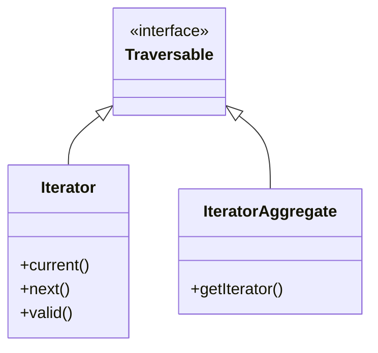

# SPL — Standard PHP Library

!!! tip "In a nutshell"
    The SPL makes your objects behave natively — indexable, countable, iterable —
    and ships ready-made stacks, queues and heaps. Exam hook: a **generator is a
    single-use, lazy `Iterator`** you cannot rewind once consumed.

!!! example "Real-world analogy"
    Implementing `ArrayAccess`, `Countable` and `Iterator` is like fitting your custom
    appliance with the standard plug, dials and gauge so it works with the house wiring
    — `$obj[$k]`, `count($obj)`, `foreach` — instead of needing special handling. A
    generator, by contrast, is like a single reel of film: it produces frames lazily on
    demand, but once you have played it to the end you cannot wind it back — to watch
    again you must thread a fresh reel.

!!! abstract "Learning objectives"
    By the end of this chapter you can:

    - [ ] Implement `ArrayAccess`, `Countable`, `Iterator` and `IteratorAggregate`.
    - [ ] Choose between `SplStack`/`SplQueue`/`SplHeap`/`SplPriorityQueue`/`SplObjectStorage`.
    - [ ] Explain generators and how they differ from building arrays.

    **Syllabus:** `PHP → SPL` ·
    **Level:** Advanced / Expert ·
    **Est. time:** 35 min ·
    **Prerequisites:** [Interfaces](interfaces.md)

---

## Theory

The **Standard PHP Library** ships interfaces and data-structure classes that
make your objects behave like native language constructs — indexable
(`ArrayAccess`), countable (`Countable`), iterable (`Iterator`/
`IteratorAggregate`) — plus ready-made structures (stacks, queues, heaps).

| Interface | Enables | Key methods |
|---|---|---|
| `ArrayAccess` | `$obj[$k]` syntax | `offsetGet/Set/Exists/Unset` |
| `Countable` | `count($obj)` | `count()` |
| `Iterator` | `foreach` (self-driven) | `current/key/next/rewind/valid` |
| `IteratorAggregate` | `foreach` (delegated) | `getIterator()` |
| `Traversable` | Marker (base of both) | — |

!!! question "Predict first"
    You `foreach` a generator to the end, then `foreach` the same generator again.
    What comes out the second time?

??? note "Reveal"
    Nothing. A generator is a **single-use** `Iterator` — it cannot be rewound
    after consumption. Build an array (or re-create the generator) to iterate twice.

## Deep Dive — how it works internally

### The iteration hierarchy

`Traversable` is an internal marker interface you cannot implement directly.
`Iterator` and `IteratorAggregate` both extend it. `foreach` accepts anything
`Traversable`. Prefer `IteratorAggregate` — you delegate to an existing iterator
(often a generator) instead of hand-writing five methods.



```php
<?php
declare(strict_types=1);

/** @implements \IteratorAggregate<int, string> */
final class TagCollection implements \IteratorAggregate, \Countable, \ArrayAccess
{
    /** @var array<int, string> */
    private array $tags = [];

    public function getIterator(): \Iterator
    {
        yield from $this->tags;                 // generator = an Iterator
    }

    public function count(): int
    {
        return \count($this->tags);
    }

    public function offsetExists(mixed $offset): bool
    {
        return isset($this->tags[$offset]);
    }

    public function offsetGet(mixed $offset): mixed
    {
        return $this->tags[$offset] ?? null;
    }

    public function offsetSet(mixed $offset, mixed $value): void
    {
        $offset === null ? $this->tags[] = $value : $this->tags[$offset] = $value;
    }

    public function offsetUnset(mixed $offset): void
    {
        unset($this->tags[$offset]);
    }
}
```

### SPL data structures

| Class | Semantics | Notes |
|---|---|---|
| `SplStack` | LIFO | Doubly-linked list |
| `SplQueue` | FIFO | `enqueue`/`dequeue` |
| `SplDoublyLinkedList` | Base of stack/queue | — |
| `SplFixedArray` | Fixed-size, int keys | Lower memory than array |
| `SplHeap` (abstract) | Ordered heap | Implement `compare()` |
| `SplMinHeap`/`SplMaxHeap` | Min/max on top | Ready-made |
| `SplPriorityQueue` | Value + priority | Not stable across equal priorities |
| `SplObjectStorage` | Set/map keyed by **object** | Attach data per object |

```php
<?php
declare(strict_types=1);

$storage = new \SplObjectStorage();
$user = new \stdClass();
$storage->attach($user, ['role' => 'admin']);  // object → data map
$storage->contains($user);                       // true
$data = $storage[$user];                          // ['role' => 'admin']
```

`SplObjectStorage` uses object **identity** (spl_object_id) as the key — perfect
for "have I seen this instance?" without polluting the object. Symfony's
DI/serializer use it to track visited objects and avoid infinite recursion.

### Generators

A function containing `yield` returns a `Generator` (a built-in `Iterator`).
Values are produced **lazily**, one at a time, so you never materialise the
whole sequence — huge memory wins for large/streamed data. `yield from`
delegates to another iterable; a generator can also `return` a final value read
via `getReturn()`.

```php
<?php
declare(strict_types=1);

function readLines(string $path): \Generator
{
    $fh = fopen($path, 'rb');
    try {
        while (($line = fgets($fh)) !== false) {
            yield rtrim($line);                  // lazy, one line in memory
        }
    } finally {
        fclose($fh);
    }
}
```

!!! note "Source reference"
    Symfony returns `Traversable`/generators widely, e.g. tagged-service iterators
    via `Symfony\Component\DependencyInjection\Argument\RewindableGenerator` —
    [symfony/symfony `8.0`](https://github.com/symfony/symfony/blob/8.0/src/Symfony/Component/DependencyInjection/Argument/RewindableGenerator.php).

## Configuration & code

=== "PHP Attributes"

    ```php
    <?php
    declare(strict_types=1);

    final class TaskQueue
    {
        private \SplPriorityQueue $queue;

        public function __construct()
        {
            $this->queue = new \SplPriorityQueue();
        }

        public function push(string $task, int $priority): void
        {
            $this->queue->insert($task, $priority);   // higher = first out
        }
    }
    ```

=== "Console"

    ```console
    $ php -r '$s=new SplStack(); $s->push(1); $s->push(2); echo $s->top();'
    2
    ```

## Best practices & anti-patterns

| ✅ Do | ❌ Avoid |
|---|---|
| `IteratorAggregate` + generator | Hand-writing all 5 `Iterator` methods |
| `SplObjectStorage` for object sets | Arrays keyed by object (illegal) |
| Generators for large/streamed data | Building giant arrays in memory |
| `SplFixedArray` for known-size numeric data | It for sparse/associative data |

## When (not) to use it / alternatives

- Use **generators** when data is large, streamed, or you don't need random
  access. Use arrays when you need `count`, indexing, or reuse (a generator is
  consumed once).
- Use `SplPriorityQueue` for scheduling; note ordering among **equal**
  priorities is **not** stable.
- Prefer plain `array` for small, simple collections — SPL structures add
  overhead you may not need.

!!! danger "Certification traps"
    - `IteratorAggregate::getIterator()` returns a `Traversable`; `Iterator`
      requires **all five** methods (`current/key/next/rewind/valid`).
    - A **generator is single-use** — you cannot rewind it after iterating.
    - `SplPriorityQueue` is **not stable** for equal priorities.
    - Object keys are impossible in plain arrays — use `SplObjectStorage`.
    - `count()` only works on `Countable` (or arrays); calling it on a plain
      object errors.

!!! warning "Common mistakes"
    - Forgetting `rewind()` semantics when implementing `Iterator` manually.
    - Iterating a generator twice and getting nothing the second time.

## Exercises

1. **(Advanced)** Make a class iterable with `foreach` **without** implementing
   five methods.
2. **(Expert)** Use `SplObjectStorage` to detect duplicate object visits.

??? success "Solutions"

    **1.** Implement `IteratorAggregate` and `yield from $this->items;` in
    `getIterator()` — the generator is the `Iterator`, so you write one method.

    **2.**
    ```php
    <?php
    declare(strict_types=1);

    $seen = new \SplObjectStorage();
    function visit(object $o, \SplObjectStorage $seen): bool
    {
        if ($seen->contains($o)) {
            return false;          // already visited
        }
        $seen->attach($o);
        return true;
    }
    ```

## Certification questions

??? question "Q1. Which methods must an `Iterator` implement?"
    - [x] A. `current`, `key`, `next`, `rewind`, `valid` ✅
    - [ ] B. `getIterator`
    - [ ] C. `count`, `offsetGet`
    - [ ] D. `next`, `prev`

    **Why:** `Iterator` defines exactly those five; `IteratorAggregate` needs only
    `getIterator`. **Ref:** [Iterator](https://www.php.net/manual/en/class.iterator.php).

??? question "Q2. What is true of a generator?"
    - [x] A. It is a single-use `Iterator` producing values lazily ✅
    - [ ] B. It builds the full array first
    - [ ] C. It can be rewound freely
    - [ ] D. It implements `ArrayAccess`

    **Why:** Generators yield lazily and cannot be rewound after consumption.
    **Ref:** [Generators](https://www.php.net/manual/en/language.generators.php).

??? question "Q3. Which structure maps data keyed by an object instance?"
    - [x] A. `SplObjectStorage` ✅
    - [ ] B. `SplStack`
    - [ ] C. `SplFixedArray`
    - [ ] D. `SplQueue`

    **Why:** `SplObjectStorage` keys by object identity and can attach data.
    **Ref:** [SplObjectStorage](https://www.php.net/manual/en/class.splobjectstorage.php).

??? question "Q4. `SplPriorityQueue` ordering among equal priorities is…"
    - [ ] A. Guaranteed FIFO
    - [x] B. Not stable / unspecified ✅
    - [ ] C. Always LIFO
    - [ ] D. Alphabetical

    **Why:** Equal-priority ordering is implementation-defined, not stable.
    **Ref:** [SplPriorityQueue](https://www.php.net/manual/en/class.splpriorityqueue.php).

??? question "Q5. Enabling `$obj[$k]` syntax requires implementing…"
    - [x] A. `ArrayAccess` ✅
    - [ ] B. `Countable`
    - [ ] C. `Iterator`
    - [ ] D. `Stringable`

    **Why:** `ArrayAccess` provides the offset methods for bracket syntax.
    **Ref:** [ArrayAccess](https://www.php.net/manual/en/class.arrayaccess.php).

## Key takeaways

- `Iterator` = 5 methods; `IteratorAggregate` = delegate via `getIterator()`.
- Generators are lazy, single-use iterators — great for memory.
- `SplObjectStorage` keys by object identity; arrays cannot.
- Pick the SPL structure by discipline: LIFO/FIFO/heap/priority.

## Last-minute revision

!!! tip "Cheat sheet"
    - `foreach` needs `Traversable` (Iterator or IteratorAggregate).
    - `count($o)` needs `Countable`; `$o[$k]` needs `ArrayAccess`.
    - `yield` → Generator (Iterator); `yield from` delegates.
    - Stack=LIFO, Queue=FIFO, Heap=ordered, PriorityQueue=value+priority (unstable).

## Connections

- **Depends on:** [Interfaces](interfaces.md) — SPL is a set of interfaces (`Iterator`, `Countable`, `ArrayAccess`) you implement.
- **Reused in:** [Closures](closures.md) — generators and callables collaborate; Symfony's `RewindableGenerator` wraps tagged services.
- **Confused with:** [OOP](oop.md) magic methods — `ArrayAccess` uses explicit `offset*` methods, not `__get`/`__set`.

## Official References
- [PHP: SPL](https://www.php.net/manual/en/book.spl.php)
- [PHP: Predefined Interfaces](https://www.php.net/manual/en/reserved.interfaces.php)
- [PHP: Generators](https://www.php.net/manual/en/language.generators.php)
- [Symfony source — RewindableGenerator](https://github.com/symfony/symfony/blob/8.0/src/Symfony/Component/DependencyInjection/Argument/RewindableGenerator.php)

## Video references

!!! tip "Watch & learn"
    These are official, continuously-updated video channels — search them for
    "PHP & web security" to reinforce this chapter. We link stable channels rather than
    individual videos so the references never rot.

    - [SymfonyCasts screencasts](https://symfonycasts.com/tracks/symfony) — scripted, code-along tutorials.
    - [Symfony official YouTube](https://www.youtube.com/@SymfonyOfficial) — SymfonyCon conference talks & keynotes.
    - [Official docs for this topic](https://symfony.com/doc/current/index.html) — some Symfony doc pages embed a screencast.

## Confidence check

I'm ready when I can:

- [ ] explain **why** `IteratorAggregate` + a generator beats hand-writing five methods
- [ ] implement `ArrayAccess`/`Countable`/`IteratorAggregate` in Symfony 8
- [ ] debug "nothing on the second loop" over a generator
- [ ] spot the trick: `SplPriorityQueue` being unstable among equal priorities
- [ ] explain how `SplObjectStorage` keys entries by object identity

---

<small>Related: [Interfaces](interfaces.md) · [Closures](closures.md) · [OOP](oop.md)</small>
