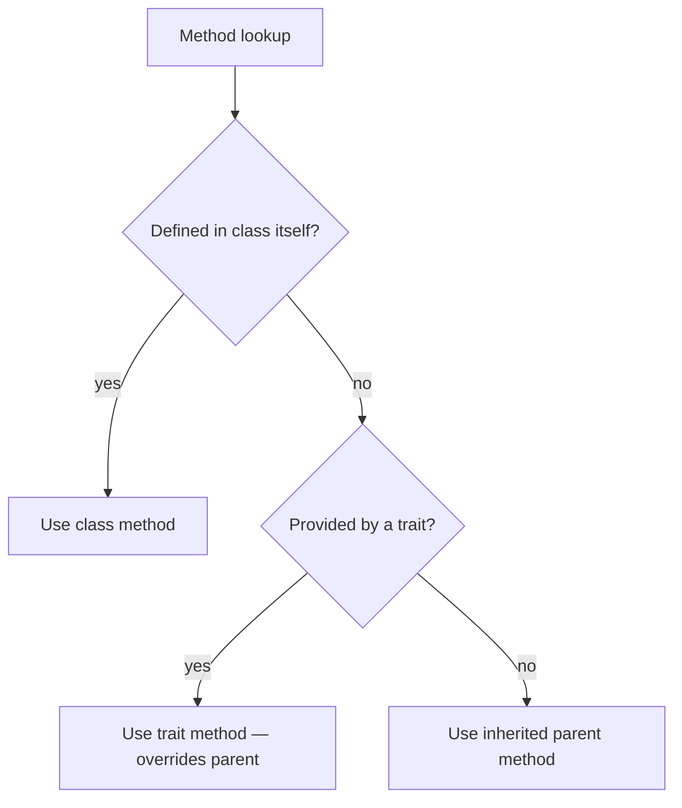

# Traits

!!! tip "In a nutshell"
    Les traits copient des méthodes dans une classe à la compilation pour une
    réutilisation horizontale — mais ce ne sont **pas des types** : impossible de
    faire un type-hint sur un trait. La précédence à mémoriser :
    classe > trait > parent hérité.

!!! example "Real-world analogy"
    Un trait est comme un tampon encreur de méthodes prêtes à l'emploi apposé sur
    chaque classe : l'encre est physiquement copiée sur la page à la compilation,
    exactement comme si vous l'aviez écrite à la main — c'est pourquoi un tampon
    n'est pas une « chose » que l'on peut désigner comme type. Si la page porte
    déjà l'écriture propre de la classe pour une méthode, cette écriture l'emporte
    sur le tampon, et le tampon l'emporte à son tour sur tout ce qui est hérité
    d'un modèle parent.

!!! abstract "Learning objectives"
    À la fin de ce chapitre, vous saurez :

    - [ ] Utiliser les traits pour la réutilisation horizontale de code et expliquer les règles de précédence.
    - [ ] Résoudre les conflits de méthodes avec `insteadof` et `as`.
    - [ ] Utiliser correctement les membres abstraits et statiques d'un trait.

    **Syllabus:** `PHP → Traits` ·
    **Level:** Advanced / Expert ·
    **Est. time:** 25 min ·
    **Prerequisites:** [OOP](oop.md)

---

## Theory

Un **trait** est un mécanisme de réutilisation **horizontale** de code : un lot
de méthodes (et de propriétés/constantes) copié dans une classe à la
compilation, comme si vous les y aviez écrites. Les traits contournent
l'héritage simple — une classe peut `use` plusieurs traits — mais ce ne sont
**pas des types** : impossible de faire un type-hint sur un trait.

| Aspect | Trait |
|---|---|
| Instanciable | Non |
| Est un type ? | Non (pas de type-hint) |
| Plusieurs par classe ? | Oui |
| Peut porter un état ? | Oui (propriétés) |
| Membres statiques ? | Oui |
| Méthodes abstraites ? | Oui (oblige la classe utilisatrice à implémenter) |

!!! question "Predict first"
    Une classe, son parent et un trait `use`-é définissent tous `run()`. Lequel
    l'emporte ?

??? note "Reveal"
    Le `run()` propre à la classe. La précédence est **classe > trait > parent
    hérité** — une méthode de trait surcharge celle du parent, mais la méthode
    propre de la classe surcharge celle du trait.

## Deep Dive — precedence & conflict resolution

### Precedence order

Quand le même nom de méthode existe à plusieurs endroits, PHP résout dans cet
ordre :

1. La méthode **propre à la classe courante** l'emporte sur toute méthode de trait.
2. Une méthode de **trait** l'emporte sur une méthode **héritée** (classe parente).
3. Deux traits portant le même nom de méthode **entrent en collision** — erreur
   fatale, sauf résolution explicite.



### Resolving conflicts: `insteadof` and `as`

`insteadof` choisit la méthode de trait à conserver ; `as` crée un alias (et
peut aussi changer la visibilité).

```php
<?php
declare(strict_types=1);

trait FileLogger    { public function log(string $m): void { /* file */ } }
trait SyslogLogger  { public function log(string $m): void { /* syslog */ } }

final class Service
{
    use FileLogger, SyslogLogger {
        FileLogger::log insteadof SyslogLogger;   // resolve the clash
        SyslogLogger::log as logToSyslog;         // keep the other, renamed
    }
}
```

`as` peut aussi changer la visibilité sans renommer :
`FileLogger::log as protected;`.

### Abstract & static trait members

- Les méthodes **abstraites** d'un trait imposent un contrat à la classe
  utilisatrice — elle doit les implémenter (comme les méthodes d'une interface,
  mais copiées dedans).
- Les propriétés/méthodes **statiques** d'un trait appartiennent à **chaque
  classe utilisatrice séparément** — une propriété statique n'est *pas*
  partagée entre toutes les classes qui utilisent le trait.

```php
<?php
declare(strict_types=1);

trait Counter
{
    private static int $count = 0;              // per-using-class

    abstract protected function label(): string; // must be provided

    public static function tick(): int
    {
        return ++self::$count;
    }
}
```

### `use` inside a class vs a namespace `use`

`use TraitName;` **dans le corps d'une classe** importe un trait.
`use Some\Class;` en **tête de fichier** est un import de namespace. Même
mot-clé, contexte différent — un distracteur d'examen classique.

```php
namespace App\Service;

use App\Logging\LoggerTrait;   // top of file: namespace import (alias)

final class Mailer
{
    use LoggerTrait;           // inside the class body: trait composition
}
```

!!! note "Source reference"
    Symfony embarque de nombreux traits, par exemple les adapters de
    `Symfony\Component\Cache\Traits\` et
    `Symfony\Bundle\FrameworkBundle\Kernel\MicroKernelTrait` —
    [symfony/symfony `8.0`](https://github.com/symfony/symfony/blob/8.0/src/Symfony/Bundle/FrameworkBundle/Kernel/MicroKernelTrait.php).

## Configuration & code

=== "PHP Attributes"

    ```php
    <?php
    declare(strict_types=1);

    trait TimestampableTrait
    {
        private ?\DateTimeImmutable $updatedAt = null;

        public function touch(): void
        {
            $this->updatedAt = new \DateTimeImmutable();
        }
    }

    final class Article
    {
        use TimestampableTrait;
    }
    ```

=== "Console"

    ```console
    $ php -r 'trait T{public $x=1;} class A{use T;} $a=new A(); var_dump($a->x);'
    int(1)
    ```

## Best practices & anti-patterns

| ✅ À faire | ❌ À éviter |
|---|---|
| Des traits petits et ciblés | Des méga-traits « fourre-tout » |
| Associer un trait à une interface (le type) | Type-hinter un trait (impossible) |
| Résoudre les conflits explicitement | Ignorer les collisions (fatal) |
| Méthodes abstraites de trait pour les contrats | Méthodes requises cachées |

## When (not) to use it / alternatives

- Utilisez un **trait** pour un comportement plus ou moins sans état partagé
  par des classes sans lien (timestamps, helpers de logging).
- Préférez la **composition** (injecter un collaborateur) quand le comportement
  a son propre cycle de vie ou ses propres dépendances — les traits ne peuvent
  être ni mockés ni remplacés à l'exécution.
- Associez un trait à une **interface** pour que les appelants puissent
  type-hinter le contrat.

!!! danger "Certification traps"
    - Précédence : **classe > trait > parent hérité**.
    - Deux traits avec la même méthode **entrent en collision** — `insteadof`/`as` obligatoire.
    - Une propriété `static` de trait est **distincte par classe utilisatrice**, pas partagée.
    - Les traits ne sont **pas des types** — ni `instanceof` ni type-hint sur un trait.
    - `as` peut changer la **visibilité** en plus de créer un alias.

!!! warning "Common mistakes"
    - S'attendre à ce qu'une méthode de trait surcharge la méthode propre de la classe (non).
    - Confondre le `use TraitName;` du corps de classe avec le `use` de namespace au niveau du fichier.

## Exercises

1. **(Advanced)** Deux traits définissent tous deux `init()`. Conservez la
   version du trait A et exposez celle du trait B sous le nom `initLegacy()`.
2. **(Expert)** Montrez qu'un compteur statique dans un trait n'est pas partagé
   entre deux classes qui l'utilisent.

??? success "Solutions"

    **1.**
    ```php
    <?php
    declare(strict_types=1);

    trait A { public function init(): string { return 'A'; } }
    trait B { public function init(): string { return 'B'; } }

    final class C
    {
        use A, B {
            A::init insteadof B;
            B::init as initLegacy;
        }
    }
    ```

    **2.** Chaque classe utilisatrice reçoit sa propre copie de `self::$count` ;
    appeler `X::tick()` n'affecte pas `Y::tick()` parce que l'état statique d'un
    trait est par classe, pas global au trait.

## Certification questions

??? question "Q1. A class, its parent, and a used trait all define `run()`. Which wins?"
    - [x] A. The class's own `run()` ✅
    - [ ] B. The trait's `run()`
    - [ ] C. The parent's `run()`
    - [ ] D. Fatal error

    **Why:** La précédence est classe > trait > hérité. **Ref:** [Traits](https://www.php.net/manual/en/language.oop5.traits.php).

??? question "Q2. Two used traits define the same method with no resolution. Result?"
    - [x] A. Fatal error ✅
    - [ ] B. The first trait wins
    - [ ] C. The last trait wins
    - [ ] D. Both run in order

    **Why:** Les conflits de traits non résolus sont fatals ; utilisez `insteadof`/`as`.
    **Ref:** [Conflict resolution](https://www.php.net/manual/en/language.oop5.traits.php#language.oop5.traits.conflict).

??? question "Q3. `SyslogLogger::log as protected logToSyslog;` does what?"
    - [x] A. Aliases the method to `logToSyslog` with `protected` visibility ✅
    - [ ] B. Deletes the method
    - [ ] C. Makes it abstract
    - [ ] D. Makes it static

    **Why:** `as` peut à la fois renommer et changer la visibilité. **Ref:** [Traits](https://www.php.net/manual/en/language.oop5.traits.php).

??? question "Q4. A `static` property in a trait used by classes X and Y is…"
    - [x] A. Separate per class (X and Y have independent copies) ✅
    - [ ] B. Shared across X and Y
    - [ ] C. Illegal
    - [ ] D. Read-only

    **Why:** L'état statique d'un trait est lié à chaque classe utilisatrice indépendamment.
    **Ref:** [Traits: static properties](https://www.php.net/manual/en/language.oop5.traits.php#language.oop5.traits.static).

## Key takeaways

- Traits = réutilisation horizontale à la compilation ; pas des types.
- Précédence : classe > trait > parent.
- Résolvez les collisions de traits avec `insteadof` (en choisir un) et `as` (alias/visibilité).
- Les membres statiques d'un trait sont par classe utilisatrice, pas partagés.

## Last-minute revision

!!! tip "Cheat sheet"
    - `use A, B { A::m insteadof B; B::m as bMethod; }`.
    - `as protected` / `as public` change la visibilité.
    - Pas de type-hint sur un trait ; associez-le à une interface.
    - Les méthodes abstraites d'un trait obligent la classe utilisatrice à les implémenter.

## Connections

- **Dépend de :** [OOP](oop.md) — les traits copient des membres dans le modèle objet de la classe à la compilation.
- **Réutilisé dans :** [Abstract Classes](abstract-classes.md) — les méthodes abstraites de trait imposent un contrat comme celles d'une classe abstraite.
- **À ne pas confondre avec :** [Interfaces](interfaces.md) — un trait n'est *pas* un type (pas de type-hint) ; associez-le à une interface pour le contrat.

## Official References
- [PHP: Traits](https://www.php.net/manual/en/language.oop5.traits.php)
- [PHP: Trait conflict resolution](https://www.php.net/manual/en/language.oop5.traits.php#language.oop5.traits.conflict)
- [Symfony source — MicroKernelTrait](https://github.com/symfony/symfony/blob/8.0/src/Symfony/Bundle/FrameworkBundle/Kernel/MicroKernelTrait.php)

## Video references

!!! tip "Watch & learn"
    Voici des chaînes vidéo officielles, mises à jour en continu — cherchez-y
    « PHP & web security » pour consolider ce chapitre. Nous référençons des
    chaînes stables plutôt que des vidéos individuelles pour que les liens ne
    périment jamais.

    - [SymfonyCasts screencasts](https://symfonycasts.com/tracks/symfony) — tutoriels scénarisés à suivre en codant.
    - [Symfony official YouTube](https://www.youtube.com/@SymfonyOfficial) — conférences et keynotes de SymfonyCon.
    - [Official docs for this topic](https://symfony.com/doc/current/index.html) — certaines pages de la doc Symfony intègrent un screencast.

## Confidence check

Je suis prêt quand je peux :

- [ ] expliquer **pourquoi** les traits existent (réutilisation horizontale au-delà de l'héritage simple)
- [ ] résoudre les conflits avec `insteadof`/`as` et changer la visibilité en Symfony 8
- [ ] déboguer une erreur fatale due à deux traits déclarant la même méthode
- [ ] repérer le piège : type-hinter un trait, ou une propriété statique de trait « partagée »
- [ ] expliquer l'ordre de précédence classe > trait > parent

---

<small>Related: [OOP](oop.md) · [Abstract Classes](abstract-classes.md) · [Interfaces](interfaces.md)</small>
